# 2 UEFI Secure Boot

Name of report: SSN_LAB_2_Nikita_Niakhai
Course: Security of Systems and Networks
Performed by Nikita Niakhai

---

## Pipeline

### Task 1 - Firmware Databases

### step 1

Turn on UEFI mode on my Virtual Box machine

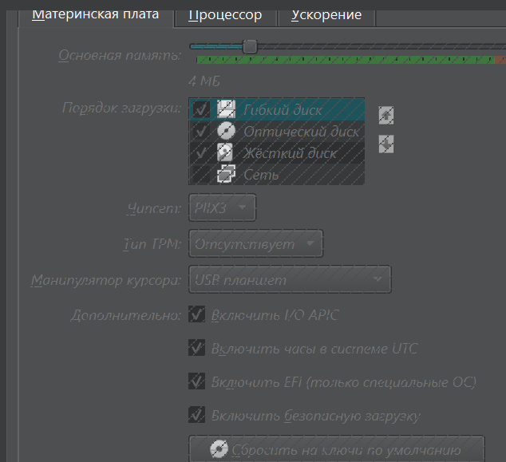

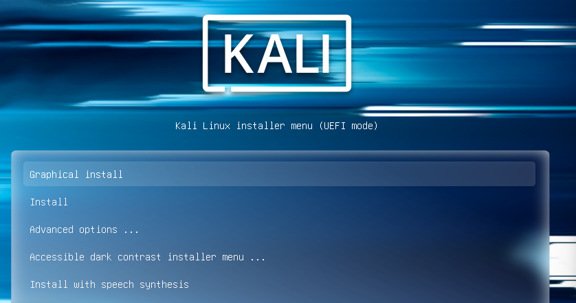

Because I have installed my machine simply in Legacy Mode (BIOS), I am obliged to reinstall in UEFI mode

> I used all hints to find proper tools for extracting and viewing the certificate

Install tools to analyse certificates

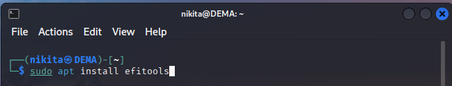

```bash
sudo apt install efitools
sudo apt install openssl
```

Dump firmware vars (db = allowed keys database)

```bash
sudo efi-readvar -v db -o db.auth
```

Extract certs from the db file

```bash
cert-to-efi-sig-list db.auth db.esl
sig-list-to-certs db.esl certs_dir/
```

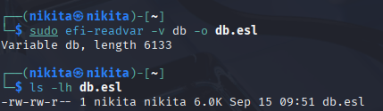

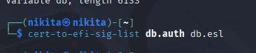

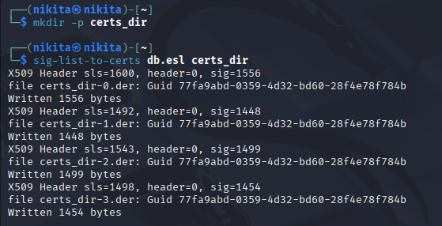

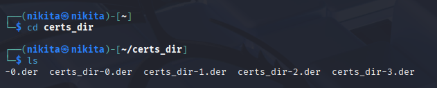

Viewing the certificate with `openssl x509`

```bash
for f in certs_dir/*.der; do
  echo "===== $f ====="
  openssl x509 -in "$f" -inform DER -noout -subject -issuer -text | sed -n '1,20p'
done
```

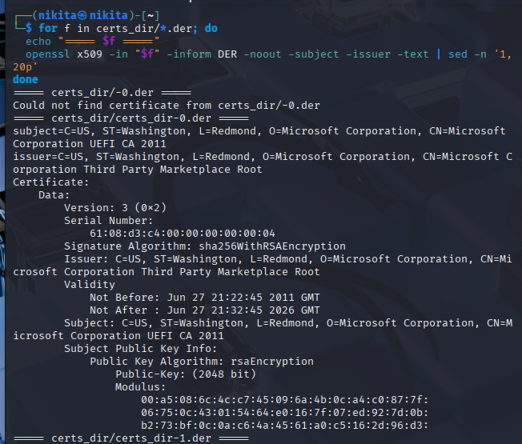

```bash
===== certs_dir/certs_dir-0.der =====
subject=C=US, ST=Washington, L=Redmond, O=Microsoft Corporation, CN=Microsoft Corporation UEFI CA 2011
issuer=C=US, ST=Washington, L=Redmond, O=Microsoft Corporation, CN=Microsoft Corporation Third Party Marketplace Root
Certificate:
    Data:
        Version: 3 (0x2)
        Serial Number:
            61:08:d3:c4:00:00:00:00:00:04
        Signature Algorithm: sha256WithRSAEncryption
        Issuer: C=US, ST=Washington, L=Redmond, O=Microsoft Corporation, CN=Microsoft Corporation Third Party Marketplace Root
        Validity
            Not Before: Jun 27 21:22:45 2011 GMT
            Not After : Jun 27 21:32:45 2026 GMT
        Subject: C=US, ST=Washington, L=Redmond, O=Microsoft Corporation, CN=Microsoft Corporation UEFI CA 2011
        Subject Public Key Info:
            Public Key Algorithm: rsaEncryption
                Public-Key: (2048 bit)
                Modulus:
                    00:a5:08:6c:4c:c7:45:09:6a:4b:0c:a4:c0:87:7f:
                    06:75:0c:43:01:54:64:e0:16:7f:07:ed:92:7d:0b:
                    b2:73:bf:0c:0a:c6:4a:45:61:a0:c5:16:2d:96:d3:
===== certs_dir/certs_dir-1.der =====
subject=C=US, O=Microsoft Corporation, CN=Microsoft UEFI CA 2023
issuer=C=US, O=Microsoft Corporation, CN=Microsoft RSA Devices Root CA 2021
Certificate:
    Data:
        Version: 3 (0x2)
        Serial Number:
            33:00:00:00:16:36:bf:36:89:9f:15:75:cc:00:00:00:00:00:16
        Signature Algorithm: sha256WithRSAEncryption
        Issuer: C=US, O=Microsoft Corporation, CN=Microsoft RSA Devices Root CA 2021
        Validity
            Not Before: Jun 13 19:21:47 2023 GMT
            Not After : Jun 13 19:31:47 2038 GMT
        Subject: C=US, O=Microsoft Corporation, CN=Microsoft UEFI CA 2023
        Subject Public Key Info:
            Public Key Algorithm: rsaEncryption
                Public-Key: (2048 bit)
                Modulus:
                    00:bd:22:2a:ae:ef:1a:31:85:13:78:51:a7:9b:fd:
                    fc:78:d1:63:b8:1a:9b:63:f5:12:06:db:4b:41:35:
                    6a:6f:ab:f5:6a:04:cc:97:cf:bb:d4:08:09:1a:61:
===== certs_dir/certs_dir-2.der =====
subject=C=US, ST=Washington, L=Redmond, O=Microsoft Corporation, CN=Microsoft Windows Production PCA 2011
issuer=C=US, ST=Washington, L=Redmond, O=Microsoft Corporation, CN=Microsoft Root Certificate Authority 2010
Certificate:
    Data:
        Version: 3 (0x2)
        Serial Number:
            61:07:76:56:00:00:00:00:00:08
        Signature Algorithm: sha256WithRSAEncryption
        Issuer: C=US, ST=Washington, L=Redmond, O=Microsoft Corporation, CN=Microsoft Root Certificate Authority 2010
        Validity
            Not Before: Oct 19 18:41:42 2011 GMT
            Not After : Oct 19 18:51:42 2026 GMT
        Subject: C=US, ST=Washington, L=Redmond, O=Microsoft Corporation, CN=Microsoft Windows Production PCA 2011
        Subject Public Key Info:
            Public Key Algorithm: rsaEncryption
                Public-Key: (2048 bit)
                Modulus:
                    00:dd:0c:bb:a2:e4:2e:09:e3:e7:c5:f7:96:69:bc:
                    00:21:bd:69:33:33:ef:ad:04:cb:54:80:ee:06:83:
                    bb:c5:20:84:d9:f7:d2:8b:f3:38:b0:ab:a4:ad:2d:
===== certs_dir/certs_dir-3.der =====
subject=C=US, O=Microsoft Corporation, CN=Windows UEFI CA 2023
issuer=C=US, ST=Washington, L=Redmond, O=Microsoft Corporation, CN=Microsoft Root Certificate Authority 2010
Certificate:
    Data:
        Version: 3 (0x2)
        Serial Number:
            33:00:00:00:1a:88:8b:98:00:56:22:84:c1:00:00:00:00:00:1a
        Signature Algorithm: sha256WithRSAEncryption
        Issuer: C=US, ST=Washington, L=Redmond, O=Microsoft Corporation, CN=Microsoft Root Certificate Authority 2010
        Validity
            Not Before: Jun 13 18:58:29 2023 GMT
            Not After : Jun 13 19:08:29 2035 GMT
        Subject: C=US, O=Microsoft Corporation, CN=Windows UEFI CA 2023
        Subject Public Key Info:
            Public Key Algorithm: rsaEncryption
                Public-Key: (2048 bit)
                Modulus:
                    00:bc:b2:35:d1:54:79:b4:8f:cc:81:2a:6e:b3:12:
                    d6:93:97:30:7c:38:5c:bf:79:92:19:0a:0f:2d:0a:
                    fe:bf:e0:a8:d8:32:3f:d2:ab:6f:6f:81:c1:4d:17:
```

### step 2

This Microsoft CA cert is not the root — it’s signed by Microsoft’s UEFI CA.

- **Platform Key (PK)**: links the platform firmware with its owner.  The key owner can create new Key Exchange Keys (KEKs) and transfer firmware ownership.

Other vars like KEK/db/dbx: define allowed and forbidden binaries.

- **KEK (Key Exchange Key)**: This establishes a trust relationship between the operating system and the platform firmware.
- **db (Database)**: The `db` is a collection of trusted signatures. EFI executable files are allowed to run only if their signatures match those listed in the `db`.
- **dbx (Database of Forbidden Signatures)**: The `dbx` contains signatures of executables that should not run, even if they match an entry in the `db`.
- **MoKLists**: This stores the list of Machine Owner Keys (MoKs). At the shim level, MoKs are used to validate drivers and the kernel, while the `db` keys perform validation during the initial boot stage.

### Task 2 - SHIM

### step 3

Kali Linux does **not use shim by default**. The installer sets GRUB (`grubx64.efi`) directly as the bootloader.
BRUB is not signed by Microsoft, but it does not stops Kali to boot via UEFI (skips Microsoft part).

`/boot/efi/EFI/kali/grubx64.efi` - path

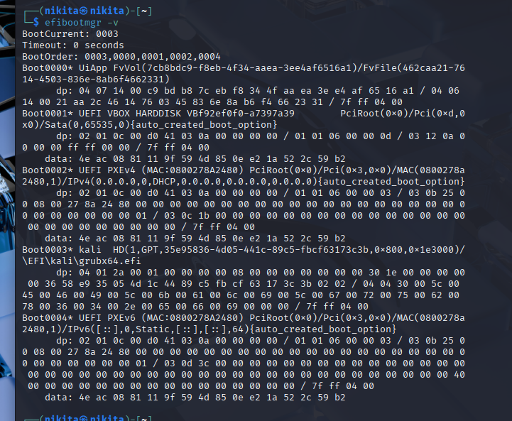

### step 4

I have checked on shim on kali, but only `grubx64` and only kali folder - so no shimx and no ubuntu folder.

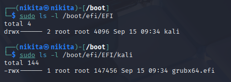

`grubx64` is not signed

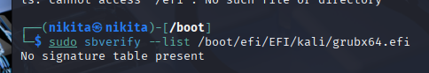

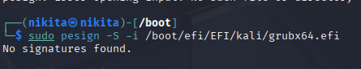

The GRUB bootloader is not signed by any certification authority (CA), as this Kali VM does not use Secure Boot or shim.

### step 5

stored in the `Attribute Certificate Table` section of the binary [doc]

### step 6

**It's defined in the PKCS #7 format**

P.S. The signature data is stored in the **X.509** format. X.509 is the standard for digital certificates, that contains the public key infrastructure (PKI) signature of the binary, ensuring Authenticity (CI**A**).

### step 7

Installing `pyew` tool and dependencies.

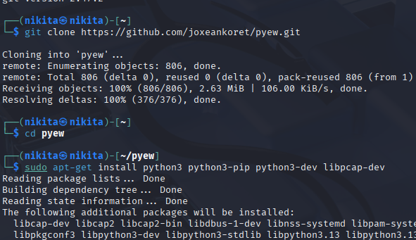

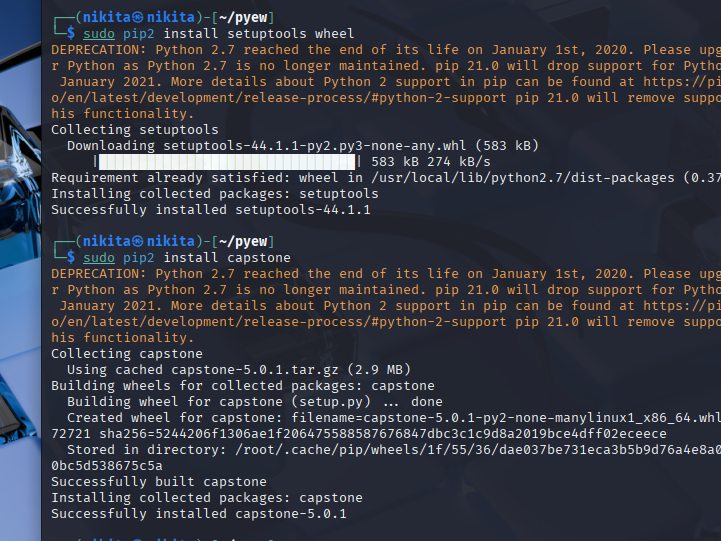

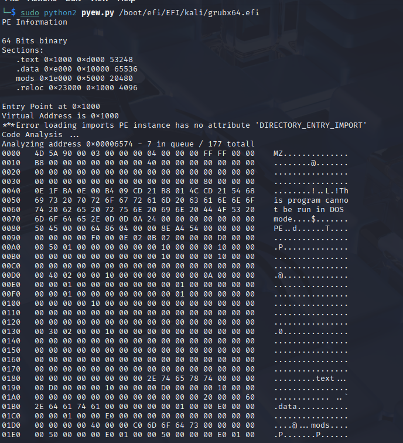

Type `pyew.pe.OPTIONAL HEADER.DATA DIRECTORY` to get a listing of all data
directory entries.

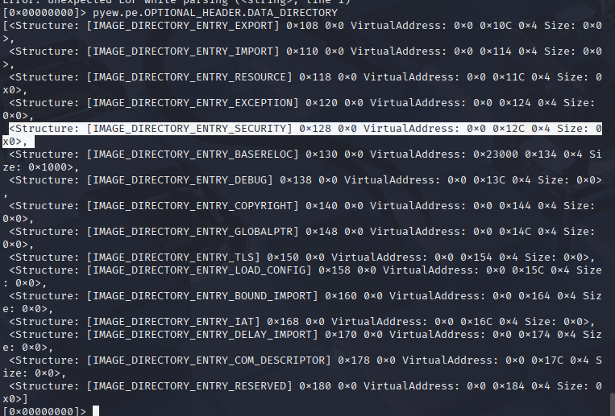

`<
Structure: [IMAGE_DIRECTORY_ENTRY_SECURITY] 0x128 0x0
VirtualAddress: 0x0 0x12C 0x4
Size: 0x0
>,`

The conclusion:

- The **virtual address** where the signature data should is **invalid** (starts with`0x0`)
- There is **no signature** present in the binary (size `0x0`).

### step 8

Since there’s **no signature** in the GRUB binary, Task 8 cannot be completed for **grubx64.efi**.

1. Microsoft Corporation Third Party Marketplace Root
→ (signs)
2. Microsoft Corporation UEFI CA 2011
    → (signs)
    3. Microsoft Windows UEFI Driver Publisher

### Task 3 - GRUB (BONUS)

### step 9

Inspect grub binary for signatures:

`sudo sbverify --list /boot/efi/EFI/ubuntu/grubx64.efi`

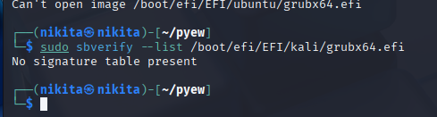

### step 10

The X.509 certificate used to verify the GRUB signature is stored in shim because shim is the first bootloader that is verified by the UEFI firmware. Once shim is verified (via its signature), it can trust the X certificate that it contains to verify further stages like GRUB.

### Reasons for Security CIA:

- If an attacker attempts to alter the shim binary or the embedded certificate, it will be detected during the boot process because the firmware verifies shim's signature before allowing the system to proceed.
- The certificate embedded in shim is protected from external modifications because shim is signed by a trusted authority (e.g., Microsoft UEFI CA), and shim's signature ensures the integrity of the embedded certificate.

### step 11

Canonical Ltd. Secure Boot Signing. cause usually they sign grum bootloader and also certificate should be embedded in shim.

### step 12

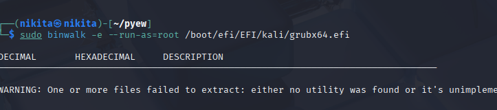

So, again no shim, no results. But ideally it would be next steps:

`sudo dd` - for extracting certificates

then after obtaining them I would use `openssl x509` to observe it

### step 13

Here I should have been confirmed via **sbverify** that **Canonical's certificate** signed **GRUB**.
