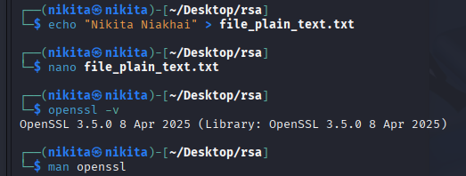
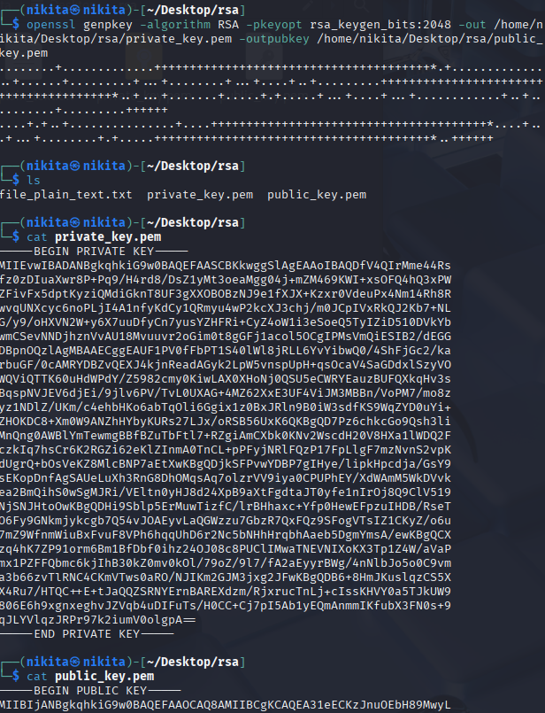
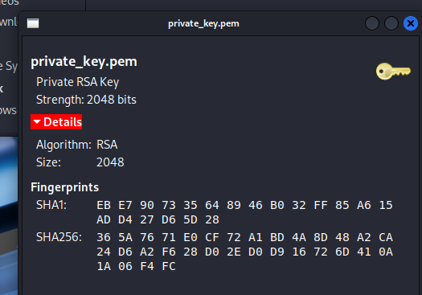
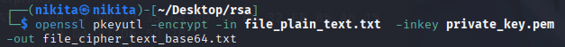
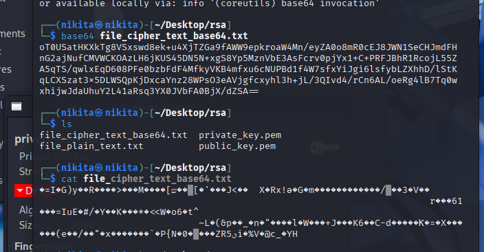
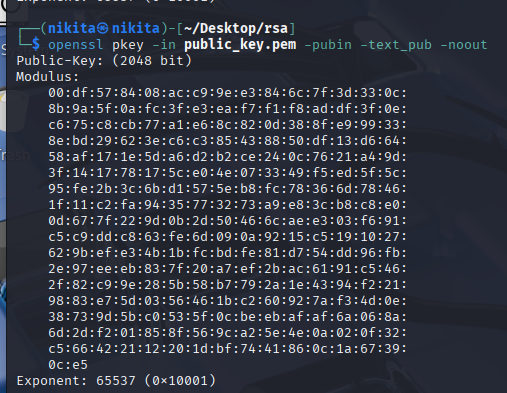
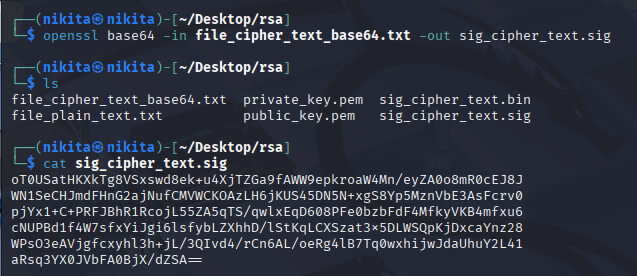
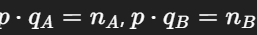

# 3 RSA

Name of report: SSN_LAB_3_Nikita_Niakhai
Course: Security of Systems and Networks
Performed by Nikita Niakhai

---

## Task 1

Questions:

1. What is openssl parameters
2. Encryption, decryption, verification

1. Learn openssl via man
2. Ensuring that man is installed via `-v` flag



1. Creating a pair of private and public keys via `openssl genpkey` (generate pair key) and with `-alghoritm` which is RSA and known amount of bits (option parameter)
`-pkeyopt rsa_keygen_bits:` and will put public key in file on path  X`-outpubkey X` and private key inside `-out Y`



**Public key:**

```bash
-----BEGIN PUBLIC KEY-----
MIIBIjANBgkqhkiG9w0BAQEFAAOCAQ8AMIIBCgKCAQEA31eECKzJnuOEbH89MwyL
ml8K/D/j6vfx+K3fPw7GdcjLd6HmjIINOI/pmTOOvSliPsbDhUOIUN8T1mRYrxce
XabSss4kDHYhpJ0/FBd4F1zgTgczSfXtX1yV/is8a9FXXrj8eDZteEYfEcL6lDV3
MnOp6Dy4yOANZ38inQstUEZsruMD9pHFyd3IY/5tCQqSFcUZECdim+/jSxv8vf6B
11Tdlvsul+7rg38gp+8rrGGRxUYvgsmeKFtYt3kqHkOU8iGYg+ddA1ZGG8Jgknrz
TQ44c51bwFNfDL7rr69qBoptLfIBhY9WnKJeTgoCDzLFZkIhEiAdv3RBhgwaZzkM
5QIDAQAB
-----END PUBLIC KEY-----
```

1. I found out that `.pem` file extension is better for storing there keys (private especially), because it is standardized format, that provides more information about keys when opened (header/body + short description of key - human readable) and also is better than `.txt` because it is copied well across systems.

    

1. Encrypting plain text with private key

    

2. Format cipher text to base64 and publish it here



**Cipher text in base64 format**

```bash
oT0USatHKXkTg8VSxswd8ek+u4XjTZGa9fAWW9epkroaW4Mn/eyZA0o8mR0cEJ8JWN1SeCHJmdFH
nG2ajNufCMVWCKOAzLH6jKUS45DN5N+xgS8Yp5MznVbE3AsFcrv0pjYx1+C+PRFJBhR1RcojL55Z
A5qTS/qwlxEqD608PFe0bzbFdF4MfkyVKB4mfxu6cNUPBd1f4W7sfxYiJgi6lsfybLZXhhD/lStK
qLCXSzat3x5DLWSQpKjDxcaYnz28WPsO3eAVjgfcxyhl3h+jL/3QIvd4/rCn6AL/oeRg4lB7Tq0w
xhijwJdaUhuY2L41aRsq3YX0JVbFA0BjX/dZSA==
```

1. Extract modulus and the exponent.
`pkey` option is to manage public key encruption
`-in` for specifying path to public/private key

    `-pubin` is one of input options, that focuses on public components (modulus & exponent)

    `-text` for outputing these components

    `-noout` for hiding public key content in output



```bash
Public-Key: (2048 bit)
Modulus:
    00:df:57:84:08:ac:c9:9e:e3:84:6c:7f:3d:33:0c:
    8b:9a:5f:0a:fc:3f:e3:ea:f7:f1:f8:ad:df:3f:0e:
    c6:75:c8:cb:77:a1:e6:8c:82:0d:38:8f:e9:99:33:
    8e:bd:29:62:3e:c6:c3:85:43:88:50:df:13:d6:64:
    58:af:17:1e:5d:a6:d2:b2:ce:24:0c:76:21:a4:9d:
    3f:14:17:78:17:5c:e0:4e:07:33:49:f5:ed:5f:5c:
    95:fe:2b:3c:6b:d1:57:5e:b8:fc:78:36:6d:78:46:
    1f:11:c2:fa:94:35:77:32:73:a9:e8:3c:b8:c8:e0:
    0d:67:7f:22:9d:0b:2d:50:46:6c:ae:e3:03:f6:91:
    c5:c9:dd:c8:63:fe:6d:09:0a:92:15:c5:19:10:27:
    62:9b:ef:e3:4b:1b:fc:bd:fe:81:d7:54:dd:96:fb:
    2e:97:ee:eb:83:7f:20:a7:ef:2b:ac:61:91:c5:46:
    2f:82:c9:9e:28:5b:58:b7:79:2a:1e:43:94:f2:21:
    98:83:e7:5d:03:56:46:1b:c2:60:92:7a:f3:4d:0e:
    38:73:9d:5b:c0:53:5f:0c:be:eb:af:af:6a:06:8a:
    6d:2d:f2:01:85:8f:56:9c:a2:5e:4e:0a:02:0f:32:
    c5:66:42:21:12:20:1d:bf:74:41:86:0c:1a:67:39:
    0c:e5
Exponent: 65537 (0x10001)
```

1. To verify what is enough for d/e I need to get signature of base64 encoding, that I didn’t derived previously

    

```bash
oT0USatHKXkTg8VSxswd8ek+u4XjTZGa9fAWW9epkroaW4Mn/eyZA0o8mR0cEJ8J
WN1SeCHJmdFHnG2ajNufCMVWCKOAzLH6jKUS45DN5N+xgS8Yp5MznVbE3AsFcrv0
pjYx1+C+PRFJBhR1RcojL55ZA5qTS/qwlxEqD608PFe0bzbFdF4MfkyVKB4mfxu6
cNUPBd1f4W7sfxYiJgi6lsfybLZXhhD/lStKqLCXSzat3x5DLWSQpKjDxcaYnz28
WPsO3eAVjgfcxyhl3h+jL/3QIvd4/rCn6AL/oeRg4lB7Tq0wxhijwJdaUhuY2L41
aRsq3YX0JVbFA0BjX/dZSA==
```

## Task 2

Probability = Divide numbers of outcomes  / on the overall numbers;

(Keys / all keys) * 100%

**Answer**: ≈0 (5.3 * 10 ^ (-150) %)

1. `Probability` = (1/#{512-bit primes}) * 100%
2. `The number of primes` near x is x/ln(x), so 512-bit primes = π(2512)−π(2511) ≈ 1.89 * 10 ^151
3. `Probability` = (1/ 1.89 * 10 ^151) * 100% ≈ 5.29×10^−152 * 100% ≈ 5.3 * 10 ^ (-150) %

Real RSA implementation also **checks `p≠q`**and re-sample if equal, making the *effective* probability of ending with `p=q` exactly zero.

## Task 3

Because good random generator is our tenet to security. And security means that it cannot be brut forced. So e.g. this generation reuses primes - collapses security. The chance of sharing the same prime enhances - both private keys are brokeable. Random must be random otherwise it is probable to hack. Whether via brut force or via compromising.

**Reference:**

**Study** by Lenstra analyzed millions of RSA public keys from the WEB. They found that about 0.4% of TLS, SSH, and PGP keys shared a prime facto**r** because of poor randomness during key generation. It lead to consequences: attackers could factor the RSA modulus in seconds, fully recovering private keys and compromising encrypted communication.

- "Ron was wrong, Whit is right" (2012) at <https://eprint.iacr.org/2012/064>

## Task 4

mod 1 in `n1.txt`

```bash
Eysjyzc Oxgorlo Jsr
```

mod2 in `n2.txt`

```bash
0xde9e10a438016ead23e753e3488113c100cbfe4c1b0e31c908d25b5fb663438bd6c96199ad6cb19a1472a2143d3d16db6f227ec866b3b1487cce0e60224ccfd1cf16379fe352e6582d26472297234a319b26a6218f80a9fb7b7d86a23876355d76fc8f49be053202f99c35f63d63b0e7a99393ef20095b87280b7793abc5febdL, 0xcde3e5c9b26d913871eeb2e1c66407cc5204c54563f816e464ce3d3a989d7169cc5f905127484294914dfb0a03c73686e85a2b73d7b10bc1637cd4417dda37a9027a7291a195a84ecb1bc1d5537ceb19b95220afa2ea608f71d1cf2d68900e5e73b1c62afdb2735e8bbe6341134611f3858252e982befe394aa37f8e35e06a6bL
```

code for gcd in `gcd_factor.py`

```bash
```

code for key bild and sign in `build_key_and_sign.py`

```bash
#!/usr/bin/env python3
import sys,base64
from Crypto.PublicKey import RSA
from Crypto.Signature import pkcs1_15
from Crypto.Hash import SHA256
def parse_int(s):
    s=s.strip()
    if s.startswith("0x") or any(c in "abcdefABCDEF" for c in s):
        return int(s,16)
    return int(s,10)
if len(sys.argv)<4:
    print("usage: build_key_and_sign.py p q 'Your Name' [e]");sys.exit(1)
p=parse_int(sys.argv[1])
q=parse_int(sys.argv[2])
name=sys.argv[3].encode()
e=int(sys.argv[4]) if len(sys.argv)>4 else 65537
n=p*q
phi=(p-1)*(q-1)
d=pow(e,-1,phi)
from Crypto.PublicKey.RSA import construct
key=construct((n,e,d,p,q))
pub_pem=key.publickey().export_key()
priv_pem=key.export_key()
print(pub_pem.decode())
print(priv_pem.decode())
m=int.from_bytes(name,'big')
if m>=n:
    print("message too long for raw RSA")
else:
    sig_int=pow(m,d,n)
    sig_bytes=sig_int.to_bytes((n.bit_length()+7)//8,'big')
    print(base64.b64encode(sig_bytes).decode())
h=SHA256.new(name)
signature=pkcs1_15.new(key).sign(h)
print(base64.b64encode(signature).decode())
```

Found that I have 2 modulus via coma from `n1.txt`:

- nA= `0xde9e10a4...febd`
- nB = `0xcde3e5c9...06a6b`

p=`0xead598a6e6e1b087bdcf58448551a9036c9c011c960c25b3e45d9c1e9e5d87d2f2f9ea1deb3d0ec215311005d1cbfa8cf9994748ff515b253da9cbb9780c949b`

nA*qA=

```bash
0xf2ae958565eadaf249c1239326230e6bbd59986797f9719cc28cd9c5ed503607390f73032ad358a93970f370147bd4200920c3ded076963b05b70e047c467387
```

nB*qB =

`0xe07276eefbf9a3c7c7c8d8a8310397be86a8e0726131630ec8cb94d46d00308c167e2cad199dfe8fcb0986e43da4d26d3d935fe30c859d71bc963159ffc09671`

Check if , then true.



for first modulus nA e=65537 (private operation of raw name NIk)

task5

и

Result:

MTRWffFCjCwzJh891PborA89ytjRxvBkclWcfDLxdXqmP9E4rGVDWovnmTJ3FThn
eHK2Uxa5Lvm8dDPfNh179fWi8+mxl7OqIntaa0iJ5Qf3ZenDsini71gzsSfiPaOq
HPE/moZQQKY9GJQgNT3kgjAeiTJtMnB5qbIDiA2cmZM=
