# 4 OPEN VPN

Name of report: SSN_LAB_4_Nikita_Niakhai
Course: Security of Systems and Networks
Performed by Nikita Niakhai

---

## Task 1 - Introduction

## 1a.

PKI is the trust framework of keys and certificates that OpenVPN uses to authenticate servers and clients. The master CA is the root of trust that signs all certificates, while separate CAs or individual keys are issued for clients to uniquely identify them.

In **OpenVPN**, PKI ensures: Server authenticity (trust for clients), Client authentication (server validates only true clients), Encryption and integrity (strong cryptography is used).

Without PKI OpenVPN would use only pre-shared keys…

## b.

- Each client has a certificate and private key, also signed by the master CA.
- The server has a certificate signed by the master CA.

**Master CA**

- The **root of trust**.
- Holds the **master private key**.
- Used to sign server and client certificates.
- If this is compromised, the whole PKI trust collapses.

**Separate CA**

- Each client has its own **unique private key + certificate**.
- Certificates are **signed by the master CA**, proving they are valid.
- If one client is compromised, its certificate can be revoked without affecting others.

## Task 2 - Set-Up

## 2a. Install, build, and initialize a Public Key Infrastructure for an installed OpenVPN.

1. Preparing to install package of openvpn and of easy-rsa. I write all in one command: update + install + create dir for CA. Then I am getting in the folder

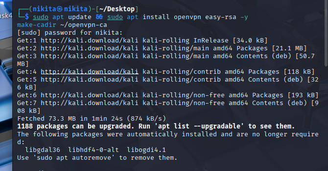

```bash
sudo apt update && sudo apt install openvpn easy-rsa -y
make-cadir ~/openvpn-ca
cd ~/openvpn-ca
./easyrsa init-pki
./easyrsa build-ca
```

1. Then I  initialize a new PKI structure under `pki/`and
build the Certificate Authority, generate `ca.crt` and encrypte `ca.key`.

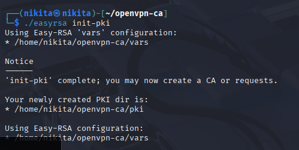

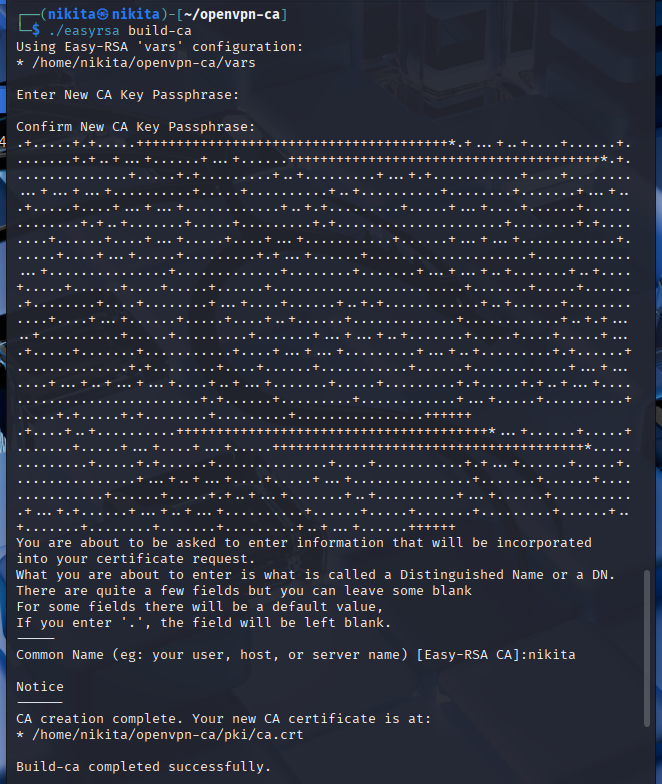

1. My new CA is placed in `/home/nikita/openvpn-ca/pki/ca.crt`

Passphrase: `kali`

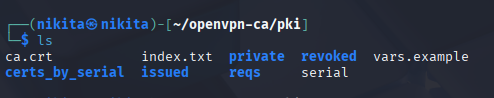

## b.

When creating the CA, the prompt asks for a **Common Name (CN)** and a **passphrase**. The passphrase encrypts the CA’s private key so it cannot be misused if copied or leaked. Each time the CA signs a cert, the passphrase must be entered, enforcing manual control and preventing silent compromise.

## c.

```bash
./easyrsa gen-dh
./easyrsa gen-req server nopass
./easyrsa sign-req server server
```

1. Generate Diffie Hellman parameters

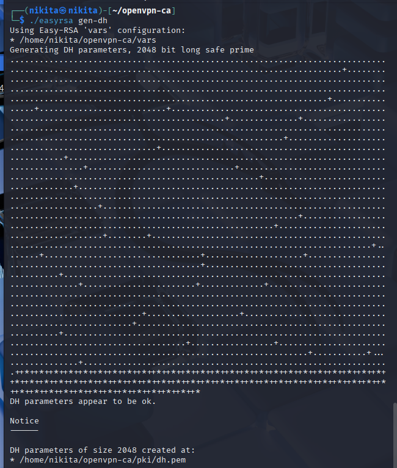

1. Generate first key for server

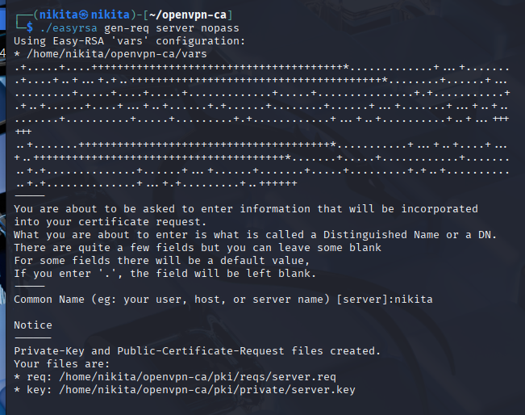

1. Generate second key

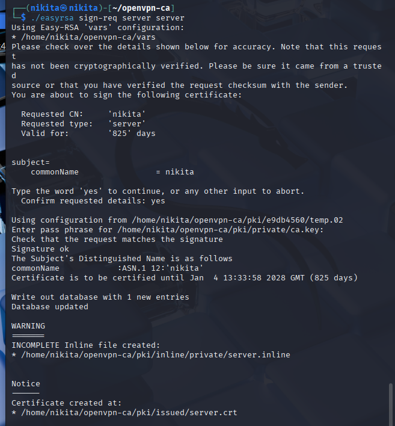

1. Paths:
`~/openvpn-ca/pki/dh.pem               # Diffie-Hellman parameters`
`~/openvpn-ca/pki/private/server.key   # Server private key` (1 key)
`~/openvpn-ca/pki/issued/server.crt    # Server certificate` (2 key)

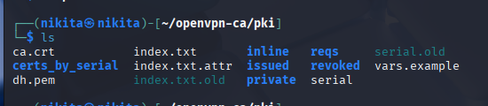

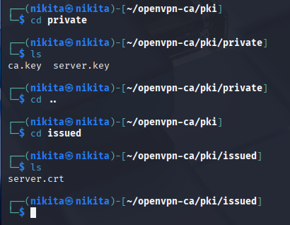

## d.

Size `2048 bits`

Location: `~/openvpn-ca/pki/dh.pem`

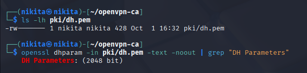

## e.

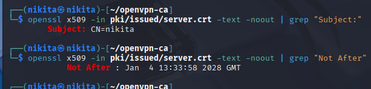

1.`openssl x509` confirms CN and validity dates. Using Not After I will know the date of sign and them do calculation. And Subject gives me understanding of common name value

1. Previosly I generated crt and key. `gen-req server nopass` generates `server.key` and `server.req` with **Common Name = server**.
2. Easy-RSA signs certs for **825 days (Jan  4 13:33:58 2028 GMT) (826 if calculate)**

## f.

1.`gen-req client1 nopass` → creates `client1.key` and `client1.req`.

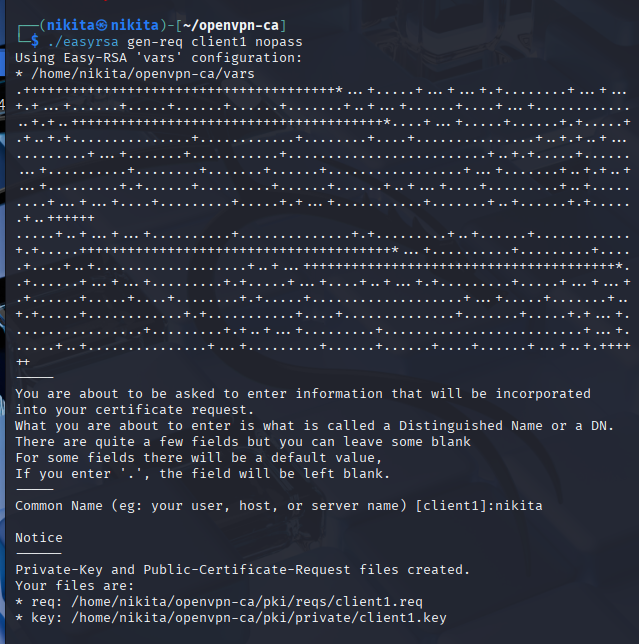

1. `sign-req client client1` → CA signs request, creating `client1.crt`.

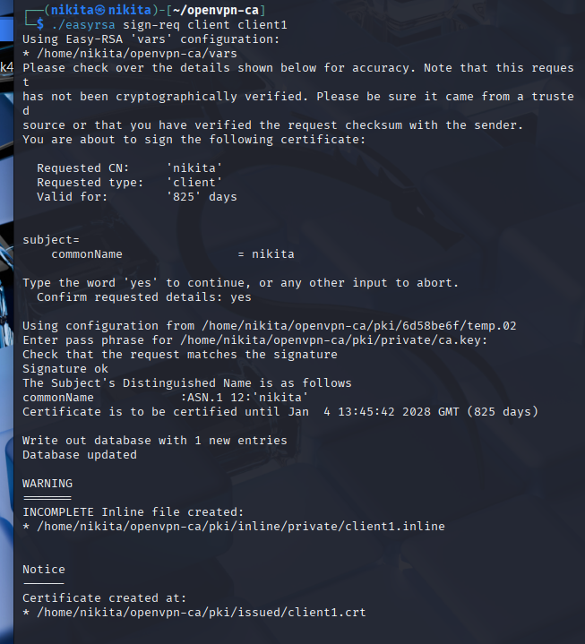

1. By default, client certificates also expire *the same* in **825 days (826 if calculate)**.


## Task 3 - Verification

## 3a.

TLS Authentication Key is an additional shared key file (`ta.key`) generated with OpenVPN. It is not a certificate but a symmetric key. Its purpose is to add a verification layer *before* the TLS handshake:

It’s essential because only peer with right ta.key can communicate; it provides security via blocking DDOS, unauth. packets, brut force scans; Server’s CPU load is reduced because malicious traffic cannot reach the “goal”. OpenVPN drops packets without the valid HMAC immediately.

## b.

1. `openvpn --genkey secret ta.key` → creates a random HMAC key used for TLS control channel.
2. `ls -lh` → confirms the file exists (~256 bytes).
3. `hexdump -C ta.key | head` → prints first lines in hex to show server key information.
4. **`chmod 600`** → read/write for root only, no access for others.

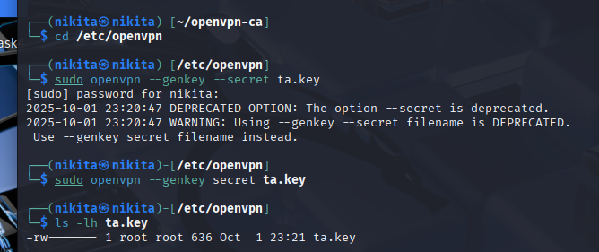

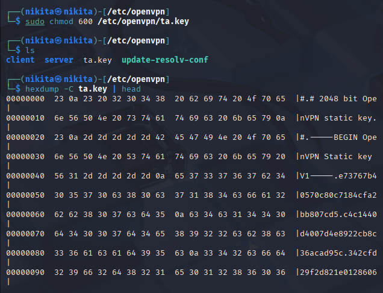

## c.

There is no separate client TLS Authentication key. The **same `ta.key` file** generated on the server is securely copied to the client. The difference lies only in how it is referenced in configuration (`0` for server, `1` for client).

- `ls -lh` → confirms file size 2048 bytes).
- `hexdump` → prints first few lines in hex to prove integrity.

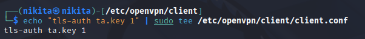


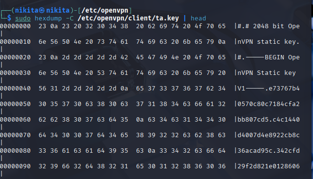

## Task 4

## 4a. Simulate a communication between the OpenVPN server and the and
client.

1. I am creating new terminal in different CLI
2. Configuring server in `openvpn/sercver.conf` for communication

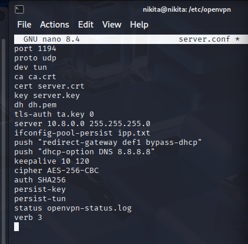

1. Configuring `client.conf` inside `openvpn/client` (Do not deleting prev config line)

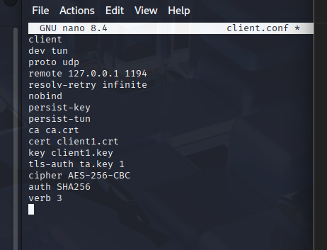

1. Copying PKI configuration (prev tasks) into openvpn folder. Also I am coppied all congif files into server folder

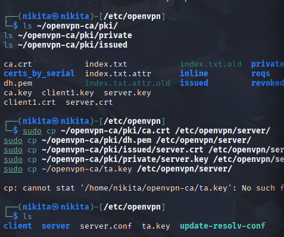

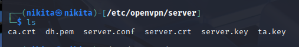

1. Starting server

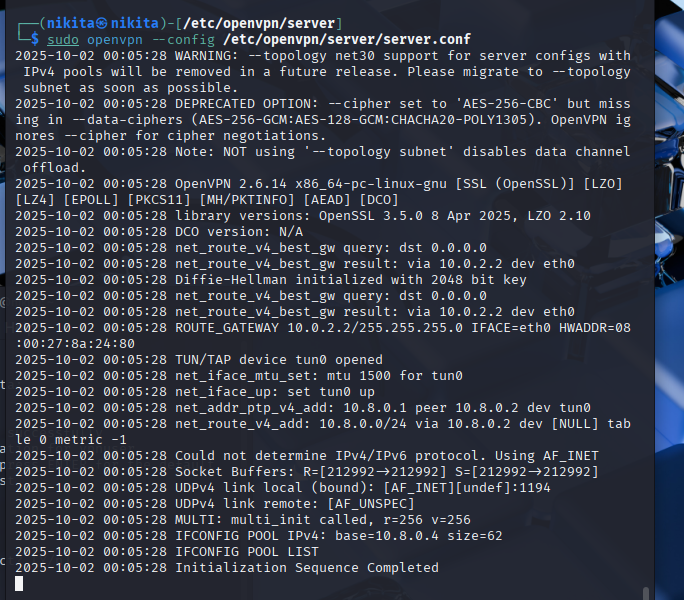

1. Copying all necessary files as ta.key and other to client folder.

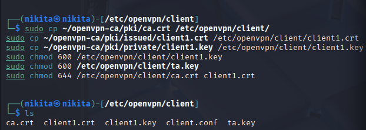

1. Launcning connection to openvpn from server and client sides.

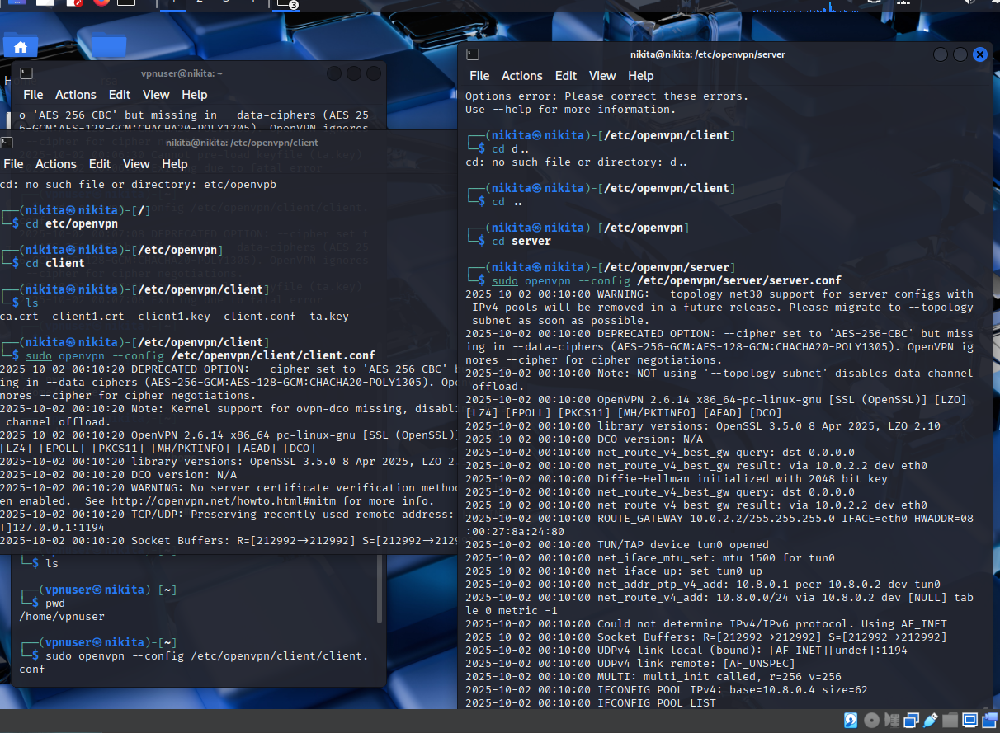

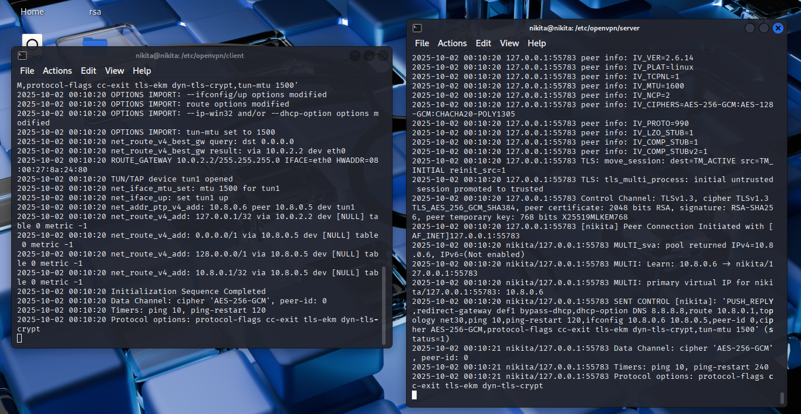

## b.

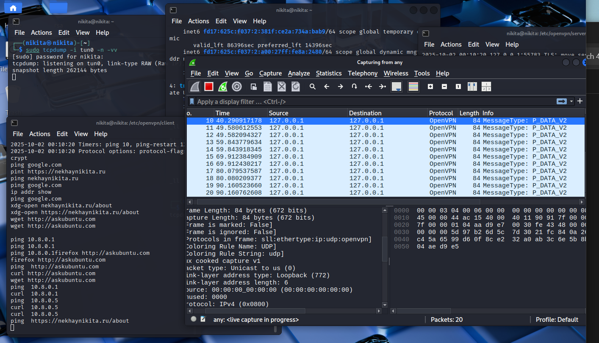

I opened Wireshark and did activites from client CLI and saw packets appear in time with OpenVPN protocol. So this is the result. I can not get some information from them because they are securely transfered

But I can see that destination port used in OpenVPN protocol packets is the same as I used in my configuration files. So these are mine packets send in Wireshark.

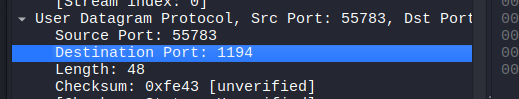

I used these commands to get activities going on:

ping  [http://askubuntu.com](http://askubuntu.com/)

curl [http://askubuntu.com](http://askubuntu.com/)

wget [http://askubuntu.com](http://askubuntu.com/)
