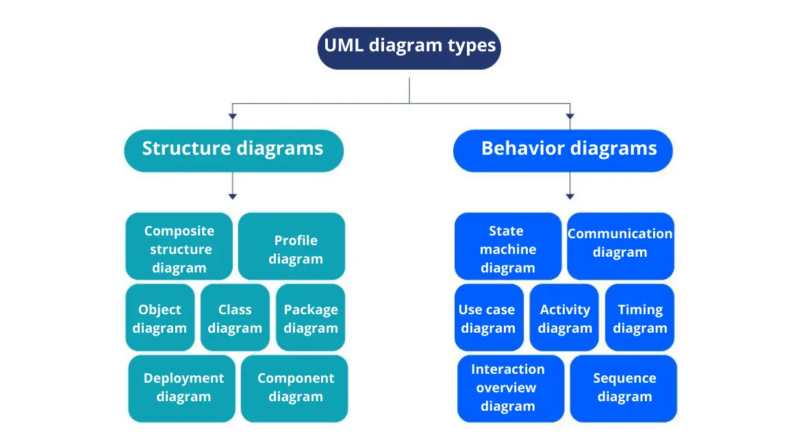
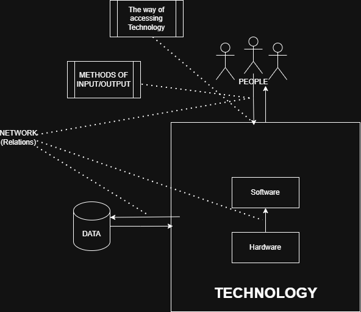
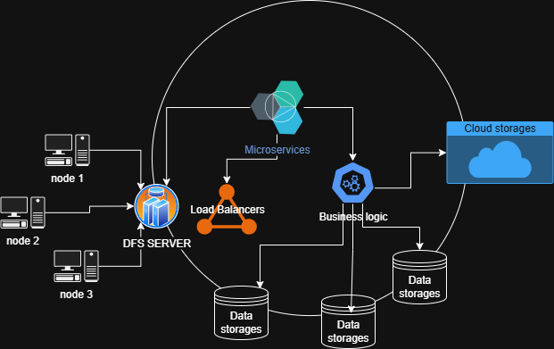

# 1 Identification of a System

Name of report: CSN_LAB_1_Nikita_Niakhai
Course: Computer Systems and Networks
Performed by Nikita Niakhai

---

### Questions

1. What is a System? Can you give an example?
2. What are the essential elements of a functional System? Can you draw a
diagram of it?
💡 you can use [app.diagrams.net](http://app.diagrams.net/) to draw and export your diagrams to
your report.
3. What is feedback in a system? What does it help us with?
4. What is an Information System? Can you give an example?
5. What are the essential elements of a functional Information System? Can you
draw a diagram of it?
6. From your point of view, what are the components of a distributed file system?
Can you draw a diagram connecting these components?
7. What is the difference between a Centralized, Decentralized, and Distributed
system? Can you give an example of each one?
8. What does transparency mean in distributed systems? Can you give an example
for each form of transparency?
9. In system documentation, what is the difference between Structure and Behaviour
documentation?

1. Answer:

System is:

- created by people
- is a collection of parts
    - parts are very different (people, hardware, software, routers, machines and etc.)
- each part has an interrelation with each other
- but it’s perceived as a WHOLE ONE thing that has a specific **GOAL** - **single coherent system**

All systems have architecture - a model that describes the system in certain formal way (documentation, diagrams).

Systems are composed of layers and structures.

In computer and network systems, we define centralized and decentralized systems. But overall, systems may be a startup, a business, a university, a car - examples of different systems.

Decentralized systems: Torrent, Kubernetes, modern Web-sites and apps

Centralized systems: computers in the middle of the XX centuries.

1. Answer:

Elements of functional IS:

- UI/UX (Interface)
- Internet. Relations to network(s) the system is in
- People (users, roles, accesses)
- Authentication and authorization layers
- Backend or other technology that handles logic and operations
- Data processing methods
- Error handling, debugging tools
- Reporting (define report, formats)
- Backup and recovery

All elements of f. IS manage data: collect, process, store, organize, share and etc.

All elements of IS work together to process raw data and return useful information.

> Usually ,to fully describe an Informational System, we use methodologies like UML, IDEF0 and etc.
>

> Also, there are design patterns that can describe such a system e.g., MODEL-VIEW-CONTROLLER, Model-View-ViewModel. Sometimes patterns can describe only a part of a system.
>

> Also there are different architectures: microservices and etc.
>

1. Answer:

There are different types of feedback.

a) Feedback from users: we can understand how people perceive a system, where are the bugs, where is the point of growth.

b) Feedback from hardware, e.g. the processor shows the temperature and the system can align and adapt to it.

c) Feedback from processing, data processing, business logic that is reports with metric: count of orders made on web-site, speed of processes.

d) Feedback inside the system between VIEW and MODEL layers.

In the systems feedback gives control, improvement and adaptation. Helps with decision-making.

1. Answer:

Information system - a technological system that operates with data created by people to be used in people’s goals. Almost all the time can’t exist without innovations.

e.g. CRM systems, Supply Chain Management systems, Knowledge Management Systems, ERP
e.g. Information systems that are used in schools, universities to manage data of their peers, students, curriculums.
e.g. Logistics systems applies in the field of transportation to achieve the goals of Logistics: CDEK, POST services and etc.

1. Answer:

(hardware, software) + data(databases) and networks between elements

I drew an abstract diagram; there were no requirement and condition, so I drew it from a high perspective.

1. Answer:

Components of distributed file systems (DFS):

- Nodes (Users, PCs, Clients)
- Server of DFS
- Storage of data (Cloud, Physical)

Node accesses a DFS, then his request is being handled by one of the DFS server. DFS server itself has inner big components and logic to handle big amounts of requests (load balancers) → then authentication components (to handle confidentiality and right access control) → some business logic components or services, that decide what request wants, where the desirable resource → then they send signals and receive information of data storage of desirable resources → maybe they decide to change location, encrypt it, migrate and etc. → if everything is okay then send answer via this chain to Node again, establishing some connection.

Also there might be some microservices that check on data and business logic, DFS servers, established connection between Node and our data storages. They handle principles of transparency (failure, location, migration, access, scaling, persistence).

1. Answer:

Distributed (decentralized is always distributed ) - controlled by multiple entities (but access can be only ). EXAMPLES: Netfilx, Amazon (microservices), Cloudlfare

Centralized system - one center and controlled by one frame, and other peers connected to the center (Solar System concept). EXAMPLES: ERP, CRM services

Decentralized system - every node of the system makes a decision itself, but every node has no idea of the complete information about the whole system it is in. EXAMPLES: IOT, P2P sharing (Torrent)Cryptocurrencies.

| Centralized: | Decentralized: | Distributed |
| --- | --- | --- |
| only one component with non-autonomous parts | multiple independent components connected to one network | physically divided components that interconnected and work as one organism |
| component shared by users all the time | componets have different owners;
not shared by all users and not all the time shared | each component makes decision |
| All resources accessible. Central resource control and access | Some resources are not accessible. Resources spread across nodes | Nodes can share resources between each other |
| Software runs in a single process | Software concurrent processes on different processors | parallel processing and shared resources lead to very good speed |
| Single point of control | Multiple points of control | No central point of control, but control is shared between nodes |
| Single point of failure | Multiple point of failure. Fault tolerant | Multiple point of failure, but build to have failure transparency |
| global time, the same clock for everyone | no global time, each PC has its own clock |  |
| data stored in one place | data divided into multiple PCs (complex design) |  |
|  | Communicate directly via peer to peer | Communicate directly via peer to peer via specific protocols. Usually one network. |
1. Answer:

Transparency means hiding some aspects of the Distributed System from the user, making them abstract. There is a list of transparent types:

1. Access transparency

    e.g. Dropbox offers transparency: files are partially stored remotely and on my PC I can freely access them

2. Concurrency (parallelism) transparency

    We need to make possible, so that user and apps can not fight to access some resources.

    atomic access (interleaved access)

3. Replication transparency

    If replication takes place for performance reasons, the system should not concern user

4. Fault transparency

    If the system fails, users must not see and know that it happened, e.g. we used backup servers and other methods to create fault transparency.

5. Location transparency

    topology is not the concern of a user (it does not matter where the data is physically is).

    E.g. TOR browser uses location transparency, which makes it an abstraction for the user and for reality

6. Migration transparency

    The fact, that the system has migrated physically changed it location, is hidden.

7. Performance transparency

    Configuration of the System is hidden from the user, so he can not see some details, e.g. modern PCs have BIOS mode to have all performance configuration, and **normally we do not have access to it.**

8. Scaling transparency

    Example history of Notion. Users didn’t know that the Notion team have scaled the platform many times in order to process these enormous amounts of streams (users, data and etc.)

9. Persistence transparency

    Hide whether resources on the disk or in memory

1. Answer:

Structure documentation describes the skeleton (relationship, architecture, plain model, static processes) of a system.

Behaviour documentation describes dynamic (motionable) aspects of the system, like flow, dynamic, flowcharts and asynchronous elements.

Difference is in the nature (focus, goal, subjects, questions asked) of these two documentation types. There are various perspectives, uncommon syntax elements used in describing methods.
