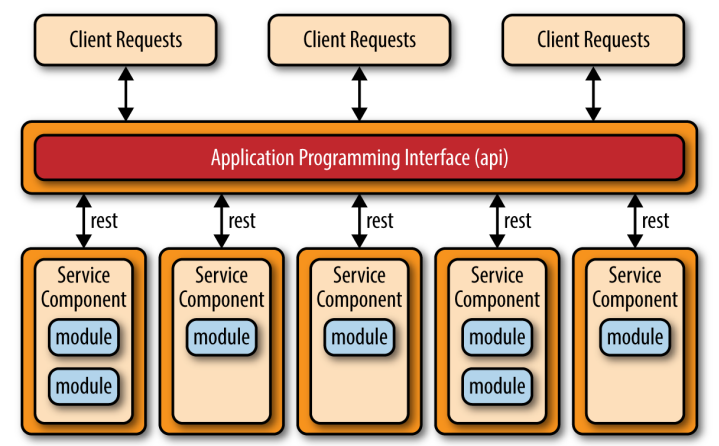
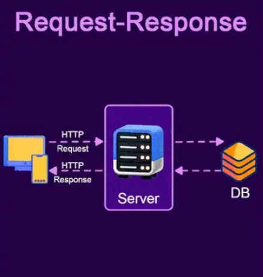
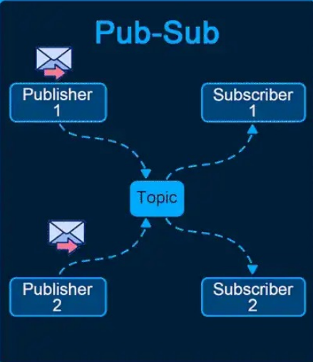
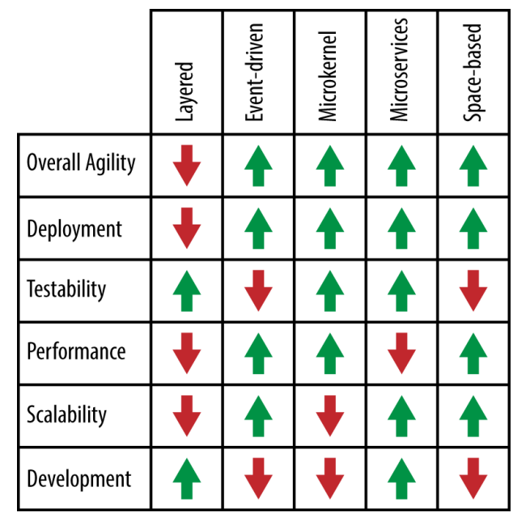

# 2 Architecture patterns

Name of report: CSN_LAB_2_Nikita_Niakhai
Course: Computer Systems and Networks
Performed by Nikita Niakhai

---

# 1.1

software architecture - is a skeleton, that provides methods, concepts (models) and vision, how to design a software piece. relationships (processes and their interactions) inside and outside such a software are described in an architecture (how to deploy in hardware). it consists of behavioural and dynamic descriptions of a system.

software architecture - is an abstraction that consists of patterns how to create a software piece: layered, microservices, microkernel, event-drive, API REST, Application REST and etc.

software architecture - a particular way to address non-functional requirements and quality attributes that used to describe a system

# 1.2.

**API Rest topology**

Client sends a request(s) that corresponds to certain querry or business logic, that is implemented in a server (back-end).

Back-end is written in e.g. MVC, so it provides many services that corresponds and awoke by different client requests.

A lot of modern apps in web and in application use such topology. It is implemented in various stacks of technologies and in many hardware pieces. From your e-commerce to some Arduino display in the gas-station.

REST topology is a way of communicating, so in order to have proper “partner”, you need to authenticate a connection.

**Request-Response**

Request may be one of HTTP methods for example, PUT, DELETE.

Usually there are 3 components: Client-Server-DB. Client sends request via HTTP to Server. Server processes it and then talks to DB via some Queries (depends on framework and libs), then marshalls the data and replies to a Client.

**Publish-Subscribe**

Well explained with example of NEWS (magazines, papers) services. There is a magazine a New York Time, that has editors, journalists - creators. They create data (messages), There are readers of the magazine - subscribers. They want to get access to data in different ways stream, non-stop, or for a short period of time, but in all cases, they need to subscribe to a magazine. So they do it and after that magazine gives them access to data that was generated via publishers.

This topology may be formed in different ways and can turn more complex.

Some server-client communication, realized in back-end via Java or Python socket, uses such a topology.

Also uses concept of broker (middleware).

# 1.3

System architecture - is a scheme/description of a whole system that consists of software, hardware, devices, routers, sides.

Software architecture - is a scheme/description of a system that consists of  components, modules, services, interfaces, data.

They have different view and scope, so that a bit topologies. Sometimes identical qualities/requirements.

system architecture example: an online bank decides on regions, active-active data centers, external KYC provider, internal ledger service, call-center workflow, fraud engine, and reporting lake. It defines contracts, SLAs, and network zones across all of them.

software architecture example: the ledger service is split into write/read models, exposes gRPC for internal calls and Kafka events, stores money movements in an append-only event store, implements idempotency and exactly-once semantics, and provides domain modules with anti-corruption layers.

# 1.4

**Software correctness** means the system returns exactly the right outputs for all inputs and conditions defined in the spec, for example, a tax calculator computes the exact due amount for every documented tax scenario. **Software robustness** means the system still behaves reasonably when faced with invalid, unexpected, or failing conditions.

A pub/sub broadcasts each message to all subscribers so everyone gets a copy. A **point-to-point** load-balances messages across consumers so only one worker handles each message.

Architecture covers the high-level structure and cross-cutting decisions like component boundaries, protocols, and quality attributes; for example, choosing microservices with gRPC, event sourcing, and zero-trust networking. Design focuses on the detailed choices inside components—classes, patterns, data structures, and algorithms.

A user interacts directly with the system’s UI or API, for example, a buyer placing an order on the website. A **primary stakeholder** has major goals or accountability tied to the system’s success, e.g. director of E-commerce owning conversion KPIs. **A secondary stakeholder** is indirectly affected or provides support with less direct influence, for example, finance analysts consuming monthly sales exports.

**Cohesion** is how tightly a module focuses on a single, well-defined purpose (higher is better). **Coupling** is the degree of interdependence between modules (lower is better).

# 2.1

The main 4 are listed below. Also OOP uses: classes, object, interfaces, abstract classes, access modifiers (private, public, protected), method overriding, constructors. I am not digging into explaining all of these, if it is necessary to achieve better grade I can talk about these in private. So now brief explanation of main 4.

Abstraction -  Provide a simple interface, hide implementation details/.
Give people a simple handle and hide the wiring—client sees “what,” not the “how,” like a `earnMoney()` that returns `{ currency, amount}` without exposing headers, retries, or error parsing.

Encapsulation - keep state private, mutate via methods (e.g., controller of TV with buttons ).
Keeps data locked up and only let it change through approved way —e.g., a `Wallet` keeps a private items (`dollars, coins, bitcoins`) array and exposes just `addMoney()` and `total()`.

Polymorphism - One interface, many behaviors
Different shapes, same handshake—multiple objects share one interface but act differently, like `render()` on `Button`, `Link`, and `IconButton` producing different DOM.

Inheritance -  Reuse/extend a base class (son and father example) IS-A.

e.g. `AdminUser` extends `User`, keeps the logic that was implemented in `User`, and adds more functions, also there is ability to change logic of already implemted functions.

# 2.2

This is a scope of system description that highlights and focuses on layered architecture, distribution, networking.

This is a structured abstraction of a system's design that simplifies complexity and highlights key characteristics for specific stakeholders, focusing on particular "concerns" like structure, behavior, or data.

1. **Performance:** The system’s ability to respond quickly and efficiently under varying loads, measured by latency, throughput, or response time.
2. **Scalability:** The system’s capacity to grow or adapt to increasing demands without significant performance degradation or manual intervention.
3. **Reliability:** The ability of the system to operate consistently and without failure over time, even in the face of unexpected conditions.
4. **Availability:** The percentage of time the system is operational and accessible, ensuring minimal downtime or interruptions.
5. **Security:** The system’s capacity to protect against unauthorized access, data breaches, and other security threats, ensuring integrity and confidentiality.
6. **Usability:** The system’s user-friendliness, ensuring that it is intuitive and accessible for its intended audience.
7. **Compatibility:** The system's ability to function and integrate with other systems, tools, or standards it interacts with.
8. **Maintainability**: Ease of ongoing updates and fixes?
9. **Testability**: How easily the system can be tested?
10. **Portability**: How well the system works across platforms?
11. **Interoperability**: Ability to integrate with other systems?
12. **Extensibility**: How easy it is to add new features?

**Microservices Architecture Pattern**

- **Problem:** Scalability and maintainability challenges in monolithic architectures.
- **Context:** Systems with multiple business domains requiring independent scalability and deployment.
- **Solution:** Break down the system into smaller, independently deployable services, each managing its domain.
- **Forces:** Balances **independence** and **decoupling** against **distributed systems complexity** and **communication overhead**.
- **Quality Impact:** Improves **scalability**, **deployability**, and **modifiability**, but might reduce **data consistency** and **increase complexity**.
- **Trade-offs:** Increased **operational overhead** (e.g., service discovery, load balancing, monitoring).
- **Known Uses:** Used by companies like **Netflix**, **Uber**, and **Amazon**.
- **Implementation Notes:** Use **Docker**, **Kubernetes**, **API Gateway** for service orchestration and communication.

# 2.3

**UML** (unified modelling language) - diagrams of 2 types behaviour and structural: use-cases, classes, state and etc. Used in system and business analysis

**ADR** - architectural design record. We create files in specific format that describes *what* was chosen (tech decision, stack) and *why.* There are many methodologies how to write ADR, that depend on scope and goals of the project.

**Patterns**

simplify future updates, reducing technical debt and enabling
seamless integration of new features and provide structured frameworks that help in building resilient
and secure systems from the ground up.

**Layers and tiers approaches.**

The architecture of a system is generally achieved by decomposing it into subsystems, following a layered and/or a partition based approach
These are orthogonal approaches:

**a layer (onion)** is a logical structuring mechanism for the elements, that make up a software solution (e.g., a kernel is a layer)
**a tier (garlic)** is a physical structuring mechanism for the system infrastructure (e.g., a user interface is a tier). Tiered, Multitiered (1, 2, 3 - modern ones)

A 1-tier model (monolithic) describes a single-tiered
application in which the user interface and data access
code are combined into a single program from a single
platform
A 2-tiers model (client/server) represents a split monolithic
model composed by a client tier that interacts directly with
a server tier
A 3-tiers model (n-tiers) is a client/server model in which the
presentation, the application processing, and the data
management are logically (ad often physically) separate
processes

**ISO/OSI** reference model defines 7 network layers, characterized by an increasing level of abstraction.

**A**ll **P**eople **S**eem **T**o **N**eed **D**ata **P**rocessing - memo technique to memorize layers

Pattern analysis approaches - Comparison

# 2.4.

| Approach | Purpose / Scope | Strengths | Limitations | When to use |
| --- | --- | --- | --- | --- |
| **UML** | Visual modelling of **structure** and **behaviour** for software & systems; used in system/business analysis. | Standard notation; good for communicating complex structure/flows; tool support.

Understandable for every team member even non-tech. | Can get heavy/noisy; risks “diagram-driven” analysis without executable truth.

You need to use a lot of models to describe a system. | You need shared visuals across teams, formal reviews, or to clarify domain/runtime interactions. |
| **ADR** | Capture what decision you made and why (context, alternatives, consequences). | Documents rationale.

Easy to version.

Reduces tribal knowledge. | Not a design picture;

Can go stale without governance.

It just used to describe whys not a whole picture of a system. | Any non-trivial tech/arch choice (protocols, DBs, patterns, vendors). |
| **Architecture Patterns** | Reusable solutions to recurring structural/behavioural problems with known trade-offs.

Guide system qualities. | Accelerate design.
 simplify future updates, reduce tech debt, enable resilient/secure foundations. | “No silver bullets”.

Complexity/consistency.

Need fit to context. | You want structured frameworks that target quality attributes (scalability, modifiability, reliability). |
| **Layers vs. Tiers** | Layers (onion): logical separation of concerns.

Tiers (garlic): physical/runtime separation across nodes. | Clear responsibilities (layers).

Deployability/scaling (tiers). I

f combine both - amazing. | Too many layers→latency/over-engineering.

Too many tiers→ops complexity. | You’re decomposing systems: decide responsibilities (layers) and physical deployment (tiers). |
| **ISO/OSI**  | Networking reference architecture: 7 layers, increasing abstraction. | Shared vocabulary; isolates concerns; maps protocols to layers. | Reference, not an implementation plan.

Modern stacks blur layers. | Education, troubleshooting, protocol placement, threat modelling at network seams. |
