# 4 Networkin Reconnaisance and Analysis

Name of report: CSN_LAB_4_Nikita_Niakhai
Course: Computer Systems and Networks
Performed by Nikita Niakhai

---

Task 1: Wireshark

1. Download this pcap file and try to investigate the traffic flow and extract any
artifact that is inside the pcap file.
💡 the goal is to find an image that is been transferred in the pcap file

1. PCAP extension is used to store data of packets sent (raw network frames). Commands like `file`, `capinfos` provide info about file to investigate it

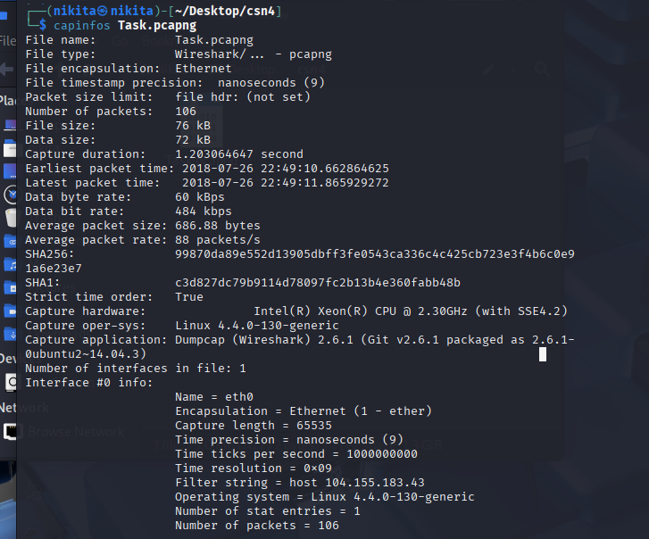

It can be analyzed with `tshark`/`tcpdump`/`wireshark`

1. With tshark I read data flows to see what was in trace and found protocols used, top IP addresses of source and destination

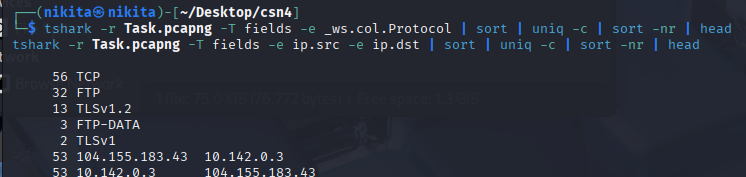

1. Then I decided to analyze packets send using tcpdump. And found following:
username is `user`
password is `password`

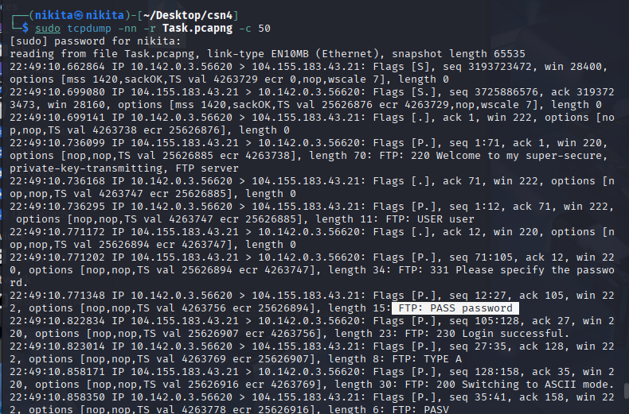

1. Then I install `tcpflow` package. Using this commands to create separate readable files for each flow. `flows` directory was created.

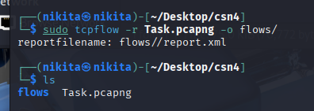

1. In addition I put all data flows into one file `stream0.pcap` using `tshark` command to read and output the stream.

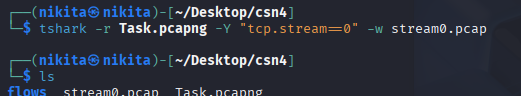

1. Then I opened wireshark and drag-and-droped new pcap file into it in order to analyze.

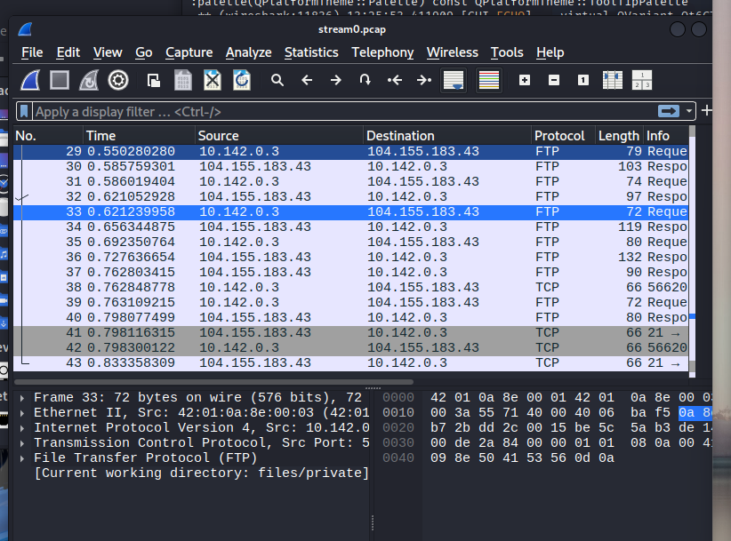

1. Now my goal to find send key.zip file

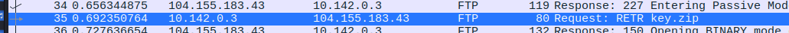

1. Now I am using files inside `flow` folder to retreieve files/directories/images from it. Using `foremost`

`foremost` carves files by header/signature from the flow dumps.

1. So I have put all extracted files inside `carved_files` directory. There is a zip file - what I need. Then I opened, digged into folders (names of it are familiar to me because in Wireshark I already have read them) found `.pem` file.

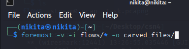

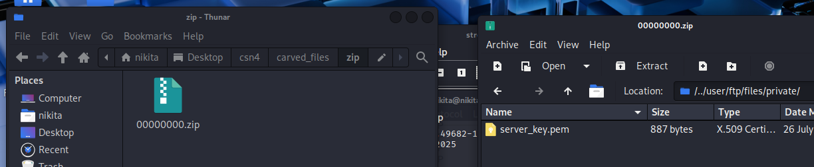

1. I use found key to decrypt data stream in Wireshark of original pcapng file. Then I export all HTTP objects. And there I have found jpg file

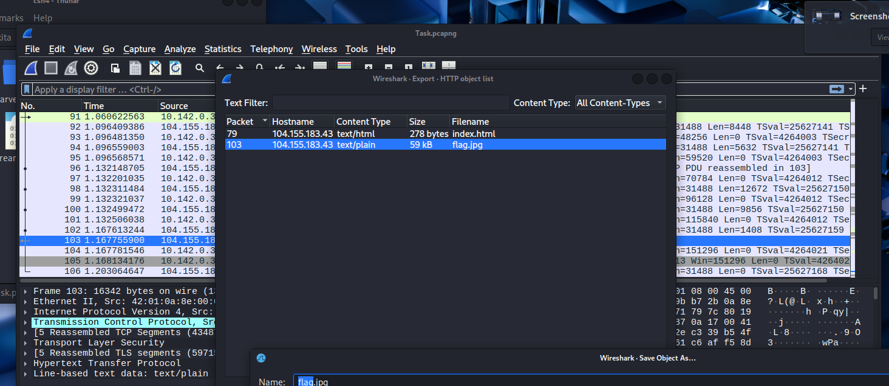

1. I open index.html and see the image there

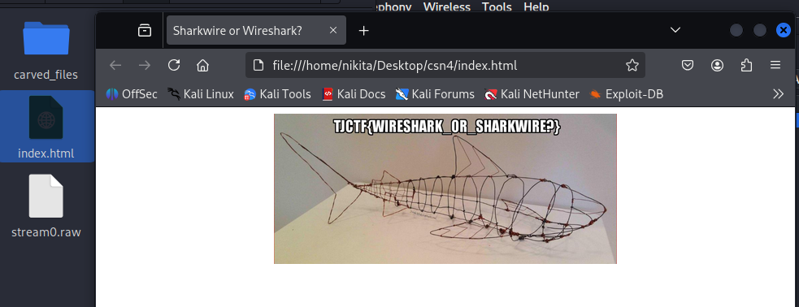

1. Try to do a networking activity (for example, pinging Google DNS) and then use
Wireshark filters to show only that activity.

1. Open Wireshark, start listening on my current network which is present on eth0. Then I opened terminal and pinged [google.com](http://google.com/). I received 9 packets of 64 bytes which are seen in terminal and 28 lines of packets via Wireshark.

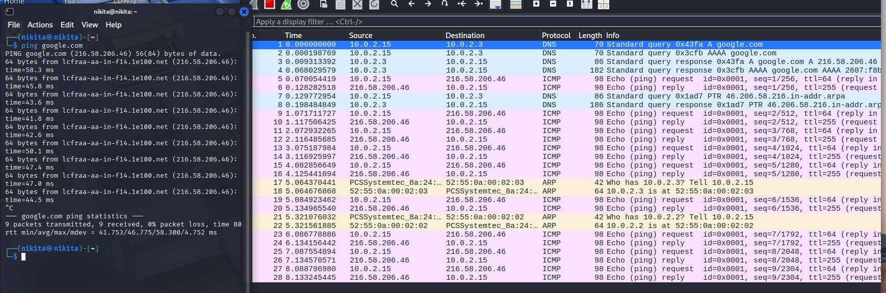

1. I applied filter in a green bar `icmp` and `ip.addr` of [google.com](http://google.com) (which is seen in terminal) and only 18 packets appeared previously are relevant to google.com

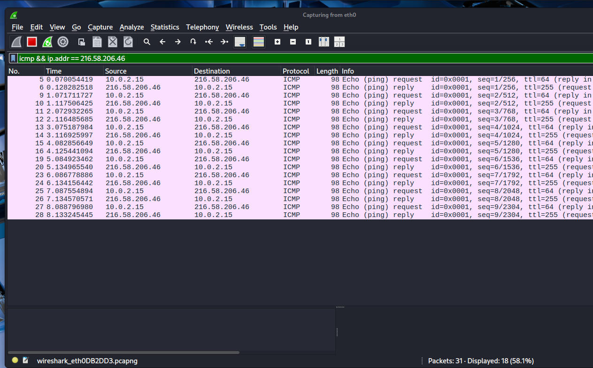

Task 2: Nmap
Do an Nmap scan of your localhost or any virtual machine that you are allowed to
scan, what can you see?

1. Do an all-port scan.

This is all-ports TCP scan (every port 1–65535)

- `p-` → scan all TCP ports (1–65535).
- `T4` → faster timing.
- `oA nmap_allports_localhost` → write results in three formats (`.nmap`, `.xml`, `.gnmap`).

Result: 53,135,137,272,445,3389,5040,5354,7680,49664,49665,49666,49667,49668,49669,49671,64652,64653,64661,64663,64664

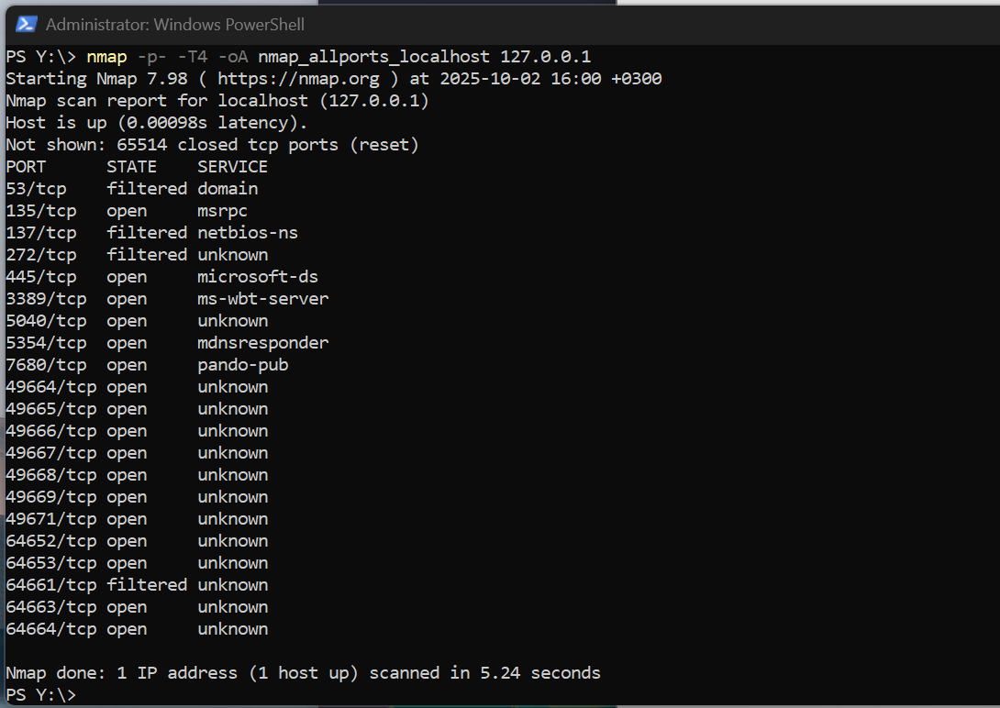

1. Do a version enumeration scan.

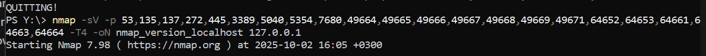

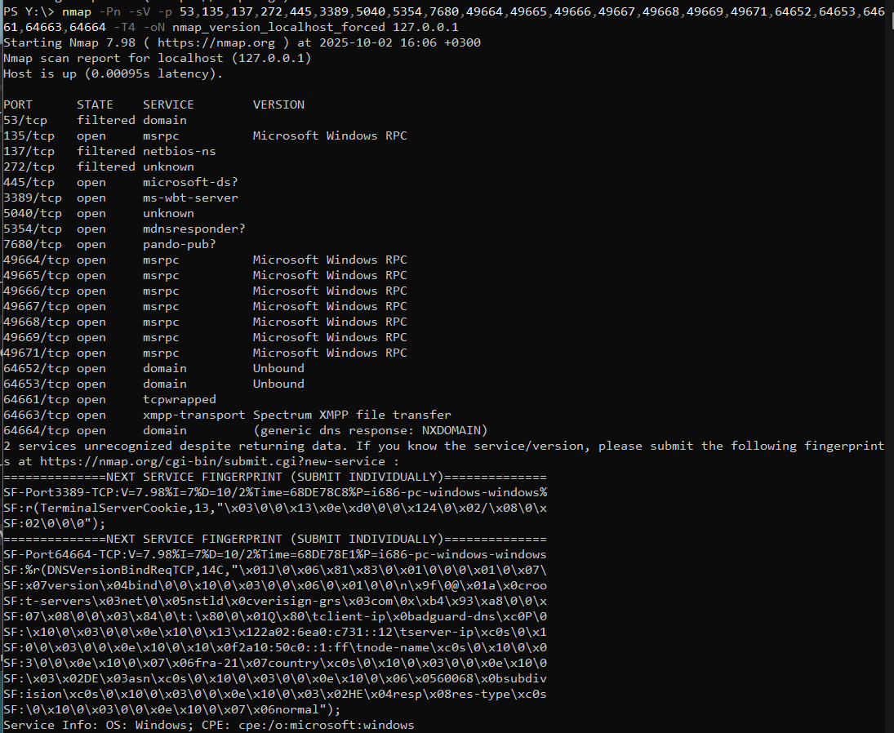

1. When scanning a Windows system Nmap will stop the scan and report that the host is down, what can you do to solve this issue?

Turn off Windows Firewall! And also just in case did the same for Windows Defender.

Windows Firewall drops ICMP echo by default, so Nmap’s default discovery never gets a reply. So that Nmap interprets that as "host down." Overriding discovery in nmam command (flag `-Pn`) or using TCP/UDP-based host discovery solves it.

1. I am not in Innopolis, this is why I do have official excuse.

Task 3: Reconnaissance
There are two types of reconnaissance, active and passive. What are the differences between them? which one would you use? Can you do a passive scan of the local subnet that is connected to your PC? (Make sure you are connected to the 10.1.1.X subnet or your own local subnet, for example home router)

 Active recon sends probes and gets fuller, faster results but is noisy and detectable; passive recon only listens, is stealthy but incomplete (you only see hosts that talk). Use passive when you must avoid detection or have limited authorization; use active when you need completeness and you are authorized. Yes — you can do a passive scan of your local subnet by listening for ARP, mDNS, NetBIOS, SSDP, ICMP, DHCP etc.; use `tcpdump`/`tshark`/`arpwatch` to capture traffic and extract observed IPs/hosts, but remember silent hosts won’t appear.

- Passive = stealthy but incomplete. Hosts that are quiet (no traffic, no broadcasts) will not show up.
- Active = complete but noisy and detectable (and potentially disallowed). Always have authorization before scanning.

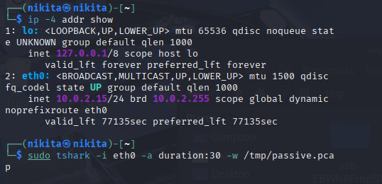

1. lists IPv4 addresses and interfaces
2. Passive capture for a fixed time (30s) and write to pcap: captures all packets seen on `eth0` for 30 seconds and saves them to `/tmp/passive.pcap`

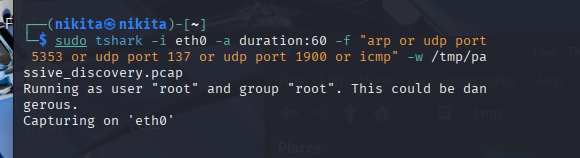

Passive capture filtered to common local discovery/broadcast traffic (ARP, mDNS, NetBIOS, SSDP) for 60s: listens only for ARP, mDNS (5353), NetBIOS-NS (137), SSDP (1900), and ICMP, which reveal many local hosts and services.

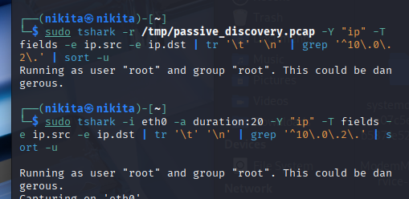

1. Extract unique IPv4 addresses observed in the capture: reads the pcap, lists source/dest IPs for IP packets, normalizes them to one-per-line, filters to your subnet (`10.1.1.*`), and de-duplicates to produce the hosts you observed.
2. Live one-shot list (capture 20 seconds and print observed hosts immediately).
