# 5 Daemons

Name of report: CSN_LAB_5_Nikita_Niakhai
Course: Computer Systems and Networks
Performed by Nikita Niakhai

---

> Please, do not downgrade my work so much ;)
>
> I don’t like to talk about excuses also I know the holy grail of *the deadline*. Nevertheless, I will write a few words..
>
> I had official excuse till 9th of October, because I was obliged to attend military commission in my country and then I spent two days travelling back to Innopolis, then I moved in dormitory again. And today (15.10) I am finally back to work.
>
> P.S. As a result of my trip, I have found out, that **I am not fit for military service**, so I can freely proceed my master’s degree!

## Task 1: Theory

1. What is `systemctl` and `init` and `systemd` ?

Learned `systemctl`  via man → Learn `systemd`

**systemctl** - is a tool to control and introspect system manager and systemd.

**systemd** - is a service manager and core system that has a big ecosystem. Main functions:
* managing services and processes (start/end)
* parallel booting of services
* logging for services (via separate tool `journalctl`)
* provides an interface to manage `cgroups` (- is a feature of Linux that gives ability to create groups for processes in order to manage their resources/ set resources-limit and etc. / security limits)
* targets (= replacement for runlevels) - feature that divides process groups into main categories of user modes (text/ GUI/ networked), shutting down / rebooting modes
* timers (replacement for crontabs) - allows to create timers for processes in more integrated and powerful way in form of files. Inside folder `etc/systemd/system` create 2 files `name.service` ([Unit] description of periodical process + [Service] path to executable service/process)+ `name.timer` ([Unit] description with time parameters, [Timer] commands to set the timer, [Install] configurational link for system to start the timer)
* mounting devices, swaping files, managing sockets, managing network connections/interfaces, managing user sessions

**init** - is a systemd that is run with PID=1 (process ID). it runs system, start essential daemons, sets up env and also shuts whole system down

2. what are the available Runlevel on linux?

Runlevel - feature of systemd that divides process groups into main categories of user modes (text/ GUI/ networked), shutting down / rebooting modes

    | **0** | System halt i.e., the system can be safely powered off with no activity. |
    | --- | --- |
    | **1** | Single user mode. |
    | **2** | Multiple user mode with no NFS (network file system). |
    | **3** | Multiple user modes under the command line interface and not under the graphical user interface. |
    | **4** | User-definable. |
    | **5** | Multiple user mode under GUI (graphical user interface) and this is the standard runlevel for most of the LINUX-based systems. |
    | **6** | Reboot which is used to restart the system. |

1. what does the systemctl list-unit-files command does?

The `systemctl list-unit-files` command shows all unit files that systemd knows about on the system in current memory. E.g., these are the configuration files that define services, timers and other units.

For each unit, it displays its **status (enabled/disabled)**, meaning whether it is configured to start automatically at boot or not, without actually showing whether the service is currently running. This allows to quickly manage units.

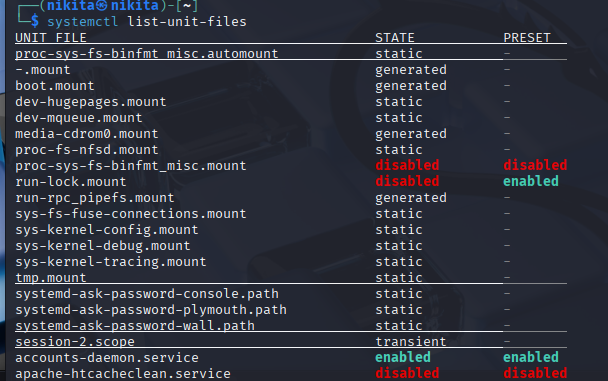

## Task 2: Creating Systemd service

Create a shell script that would write a text to a file echo "bla bla" > /tmp/test.txt and
then create a Systemd service that would this script. Here are the requirements:

1. It should run as your current user~
2. the working directory should be set to the current user home directory
3. this service will only run after the network.target service

> I used for creating a script  this source [<https://www.linuxjournal.com/content/how-create-shell-script-linux>]
>

Scripts for Linux are created inside files with `.sh` extension.

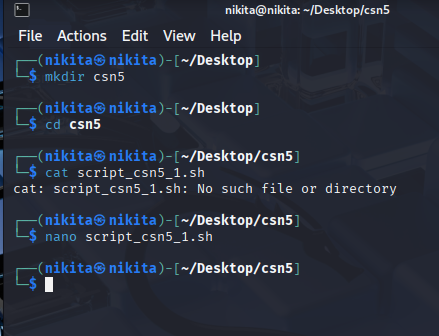

I have created folder for this task on my Desktop and left a file with the script there.

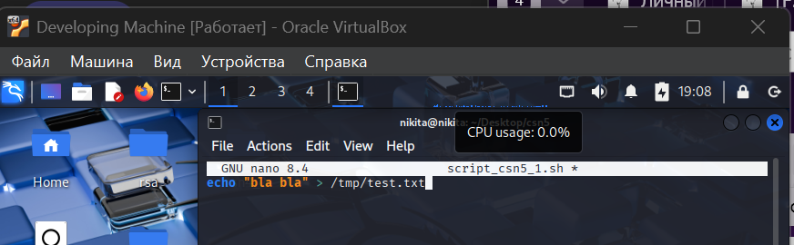

I wrote script inside `.sh` file

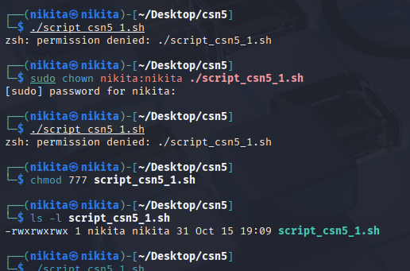

For the file to be executable I need to change permissions.

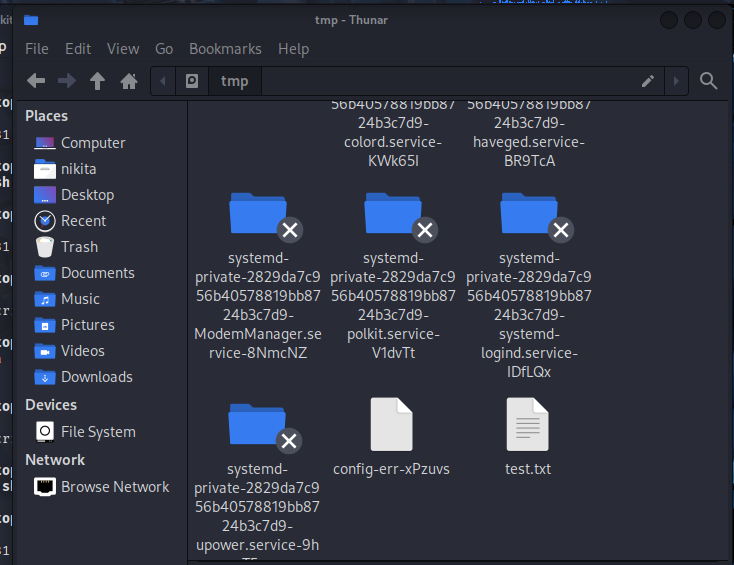

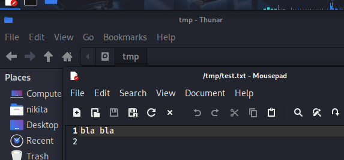

After successfully executing the script I saw the new file inside `tmp` folder

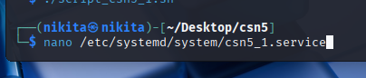

Creating a service

 I reload daemon and enable (just once) service and then start it. But I got error, because path to ExecStart had `.` symbol. Now I fixed it

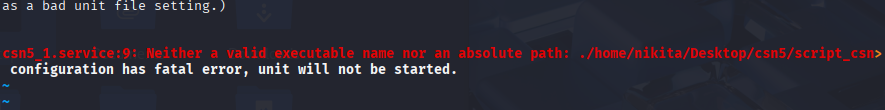

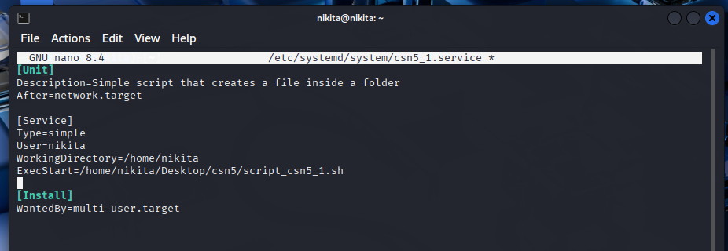

But then I got error 203 that file is not executable. Then I changed .sh file: add header (**first screenshot**) inside file. Everything works (**second screenshot**).

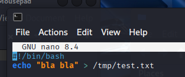

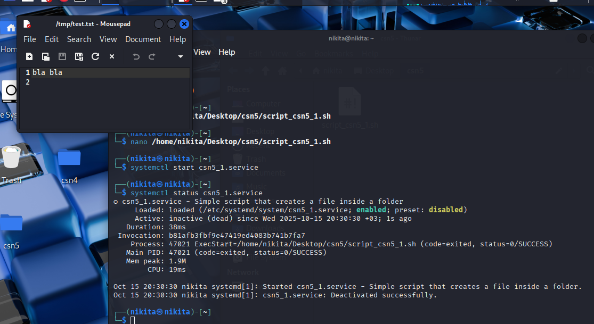

Successfully runed a script (console pipeline + result of the file).

## Task 3: Install a web-server service

1. Update modules and dependecies `sudo apt update`
2. Check presence of nginx module

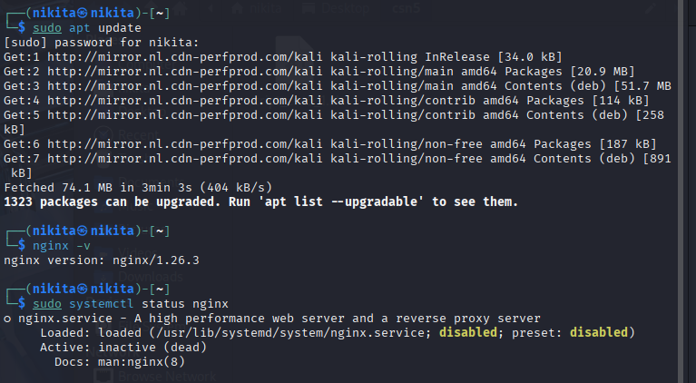

1. Check nginx service status: is disabled

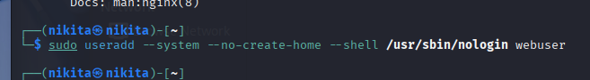

1. For privacy matters I will create low-privilleged user
    - Has no shell access
    - Cannot log in
    - Cannot modify system files

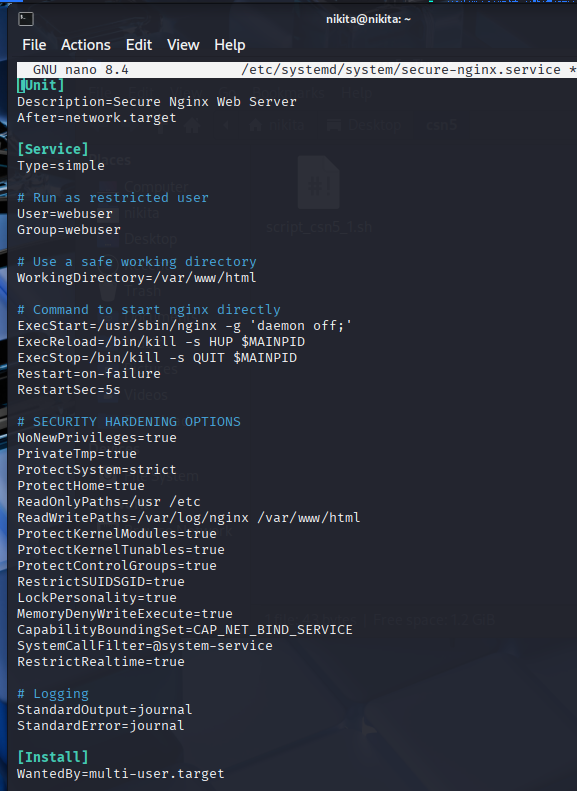

1. Next step for privacy is changing configuration of `/etc/systemd/system/secure-nginx.service`

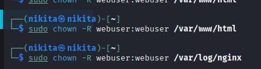

1. Make readable `nginx` log and web site page for a user.

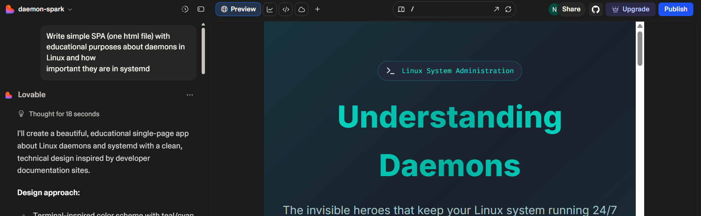

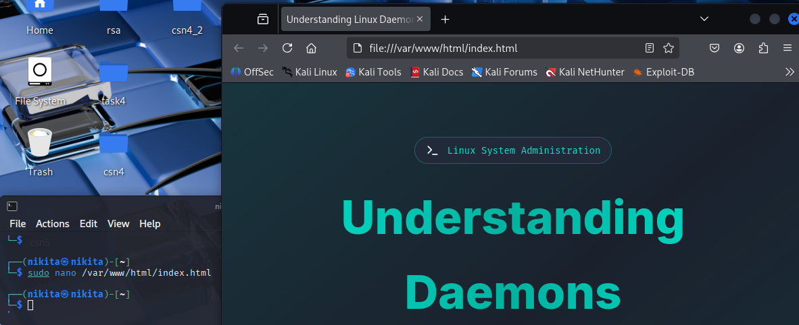

1. With Lovable AI I have created simple SPA to host on the web-server. I wrote the SPA inside `var/www/html/index.hmtl`

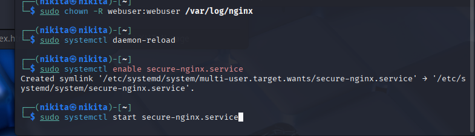

1. Then I refresh daemons and enable and start secure nginx service

    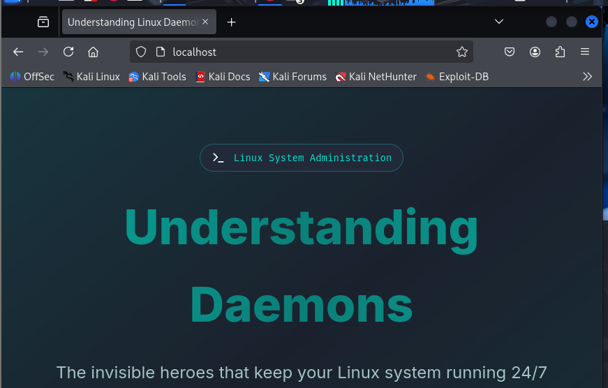

    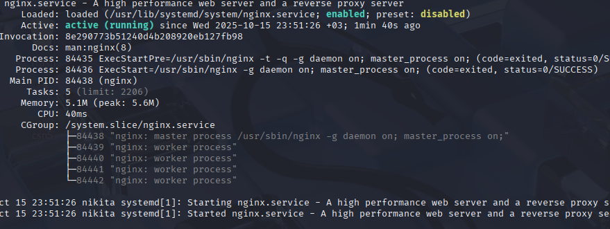

## Task 4: Crontab

Many server providers (hoster.by / timepad) allow convenient GUI to edit crontab. Also web servers written in Bitrix framework give abilities to edit it user friendly.

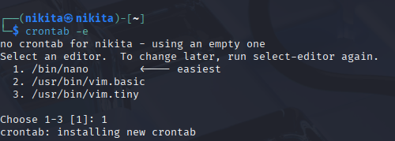

1. I execute crontab and set default view editor.

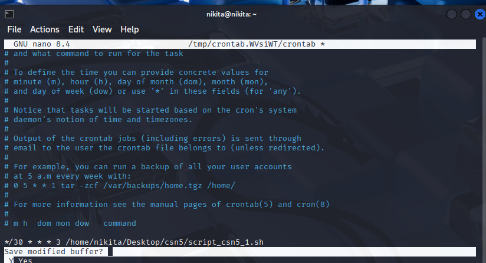

1. I Delete all commentaries and set my crontab command
2. first * is for minutes I set every 30 minutes, others for default * and last is the day of week (3 stands for Wednesday) ; after that is the command that executes, in my case is a script

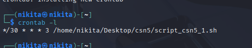

1. With -l flag I check and verify
