# 6 Static Code Analysis

Name of report: CSN_LAB_6_Nikita_Niakhai
Course: Computer Systems and Networks
Performed by Nikita Niakhai

---

Bellow there are projects and tools I picked up.

| Tool | Language | Name of project |
| --- | --- | --- |
| SNYK | PHP | DVWA |
| Deepsource | NodeJs | DVNA |

1. Signed up on all tools
2. Copied 3 repositories to my account in order to access them.

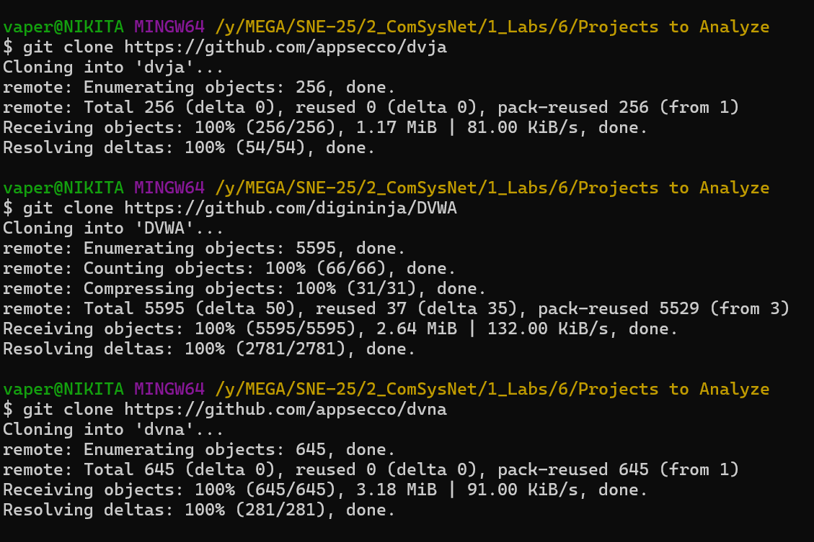

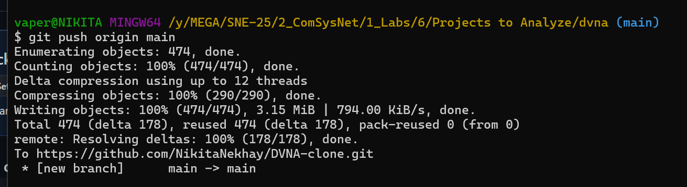

1. Used commands:

`git remote set-url origin git@github.com:username/repo.git`
- Get original repo's HTTPS clone URL (Code button).
- Create a new repository on your GitHub account.
- Clone it locally using `git clone <URL>`.
- Navigate to the local directory (`cd`).
- Initialize Git (`git init` if needed).
- Add all files (`git add .`).
- Commit changes (`git commit -m "Initial commit"`).
- Push to your new repo (`git push origin main`).

git remote set-url origin [git@github.com](mailto:git@github.com):NikitaNekhay/DVNA-clone.git

# DVWA

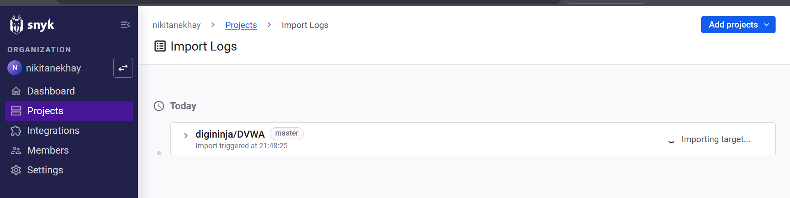

1. Imported public repo

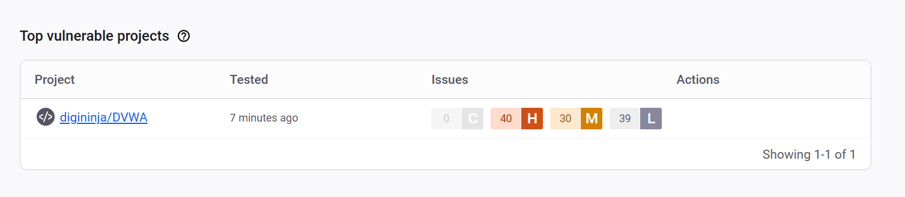

1. After that system has analysed the code

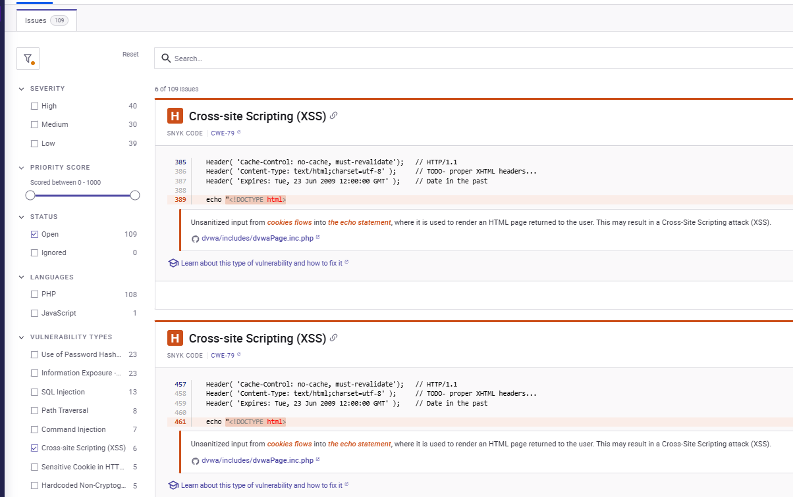

1. I clicked on the vulnerable project and saw the overview. On the left side on interface there are different options to filter issues by language/vulnerability type/severity. On the right side is a list of issues: line of code, file, good description and knowledge abilities, that are linked to Snyk Learn platform.

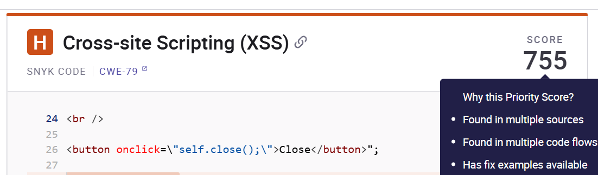

The priority score

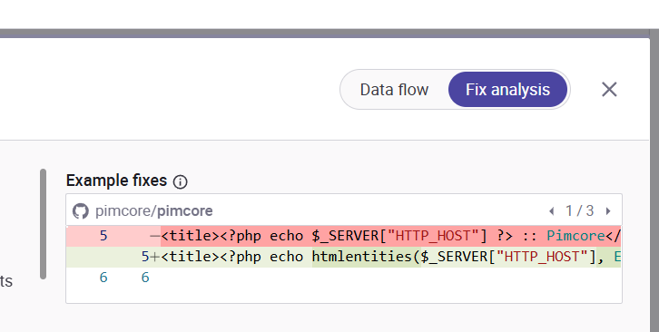

1. On each issue there is detailed analysis with *Fix analysis* option, that provides examples on how to fix issues, best practices and examples.

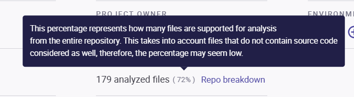

1. But the code analysis did not touch all files. Bellow is the list of unsupported extensions.
- **Unanalyzed files:**

```bash
.html1, 1, .css5, .db1, .dist2, .dockerignore1, .gitattributes1, .gitignore1, .htaccess1, .ico1, .ini1, .jpg5, .json1, .lock1, .md21, .pdf1, .png9, .sql5, .txt3, .yml8, .png1
```

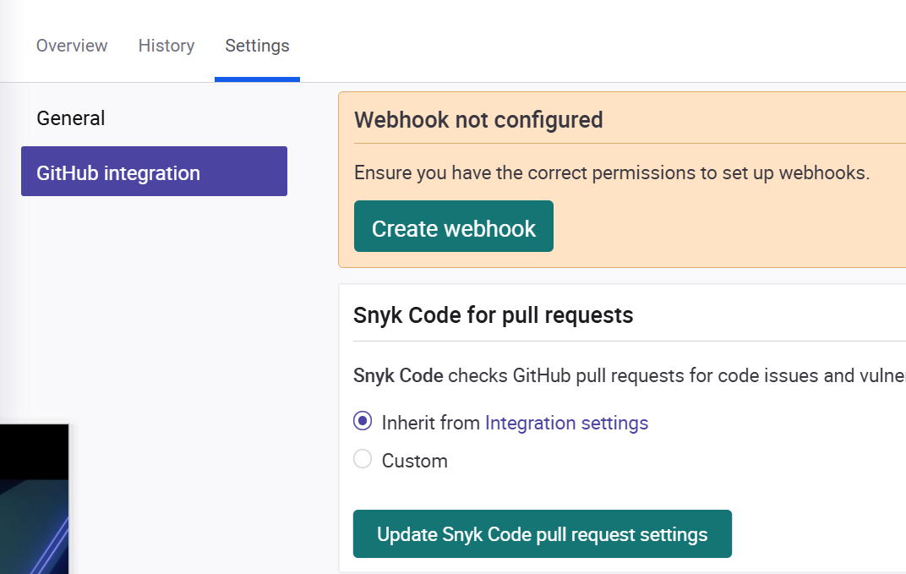

1. Also In the settings for a project, I can set periodical updated on security as well as integration to Github’s pulls and request (webhooks)

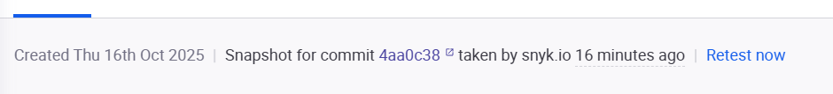

1. Analysis is made for snapshot of repo connected

# DVNA

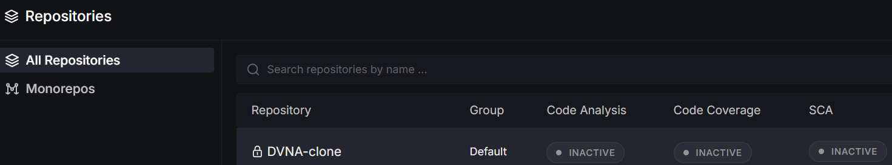

1. I picked my new cloned repo and opened it inside deepsource.

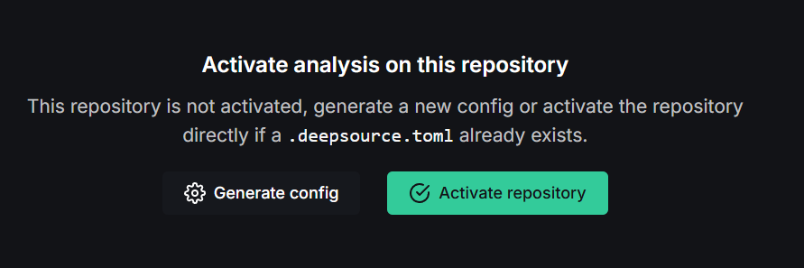

1. Then I need to generate / activate repository for deepsource analysis via creating ,

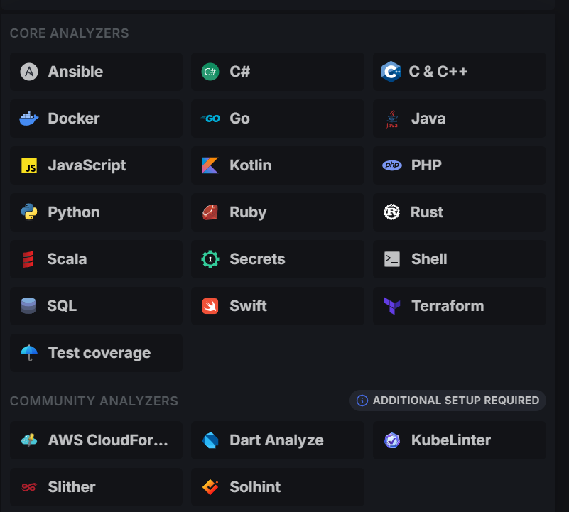

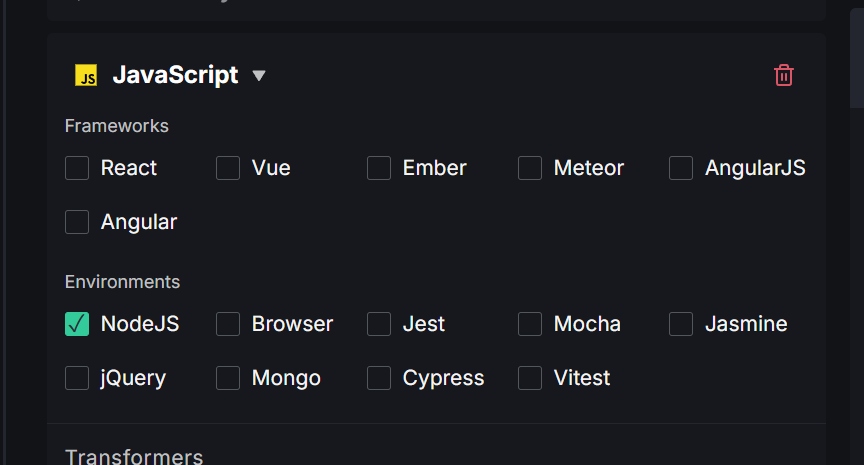

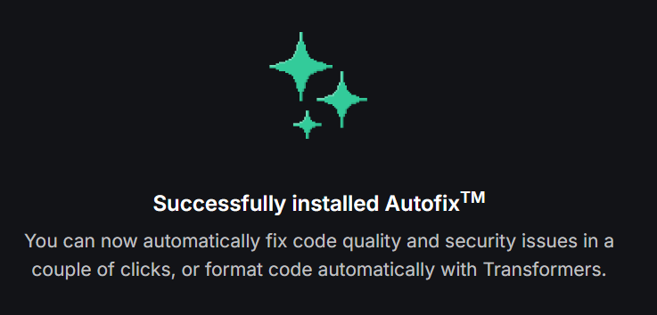

1. Generation of deepsource requires:
    1. choosing analysers for codes and techs (languages → framworks → environments)
    2. choosing patterns. Patterns are allow to include/exclude files to analysis, e.g.  ****ignore tests and auto-generated files — to improve accuracy and performance.
    3. allowing auto commit options via installing **Autofix**

2. deepsource runs static analysis automatically on every commit and flags issues such as security vulnerabilities, bug risks, anti-patterns, performance problems, and style violations.
3. Performs Software Composition Analysis (SCA) to inspect dependencies, detect vulnerabilities, and suggest remediation paths.
4. Maintains a low false-positive rate through advanced post-processing filters.

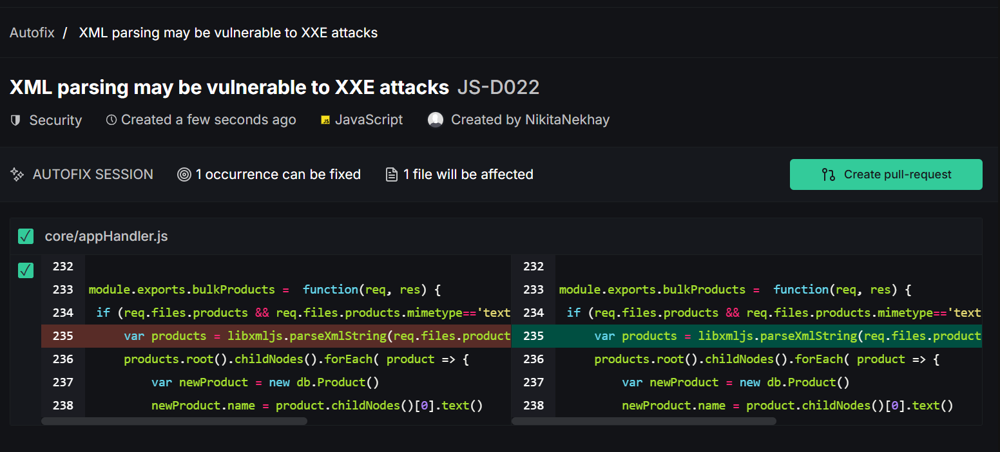

1. Supports Autofix — automated suggestions or commits for simple, fixable issues.

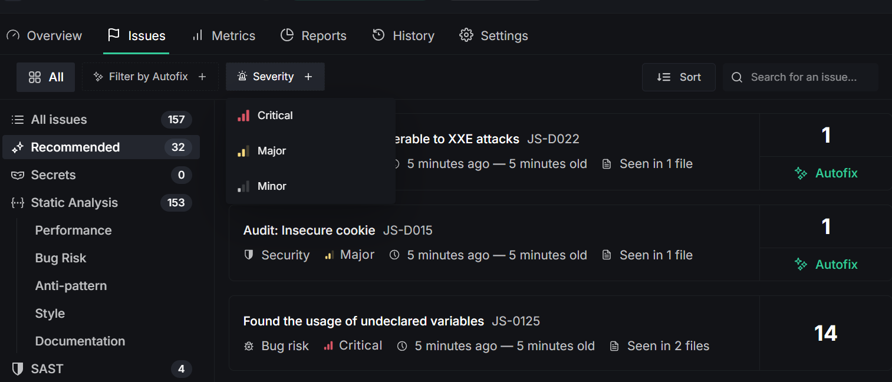

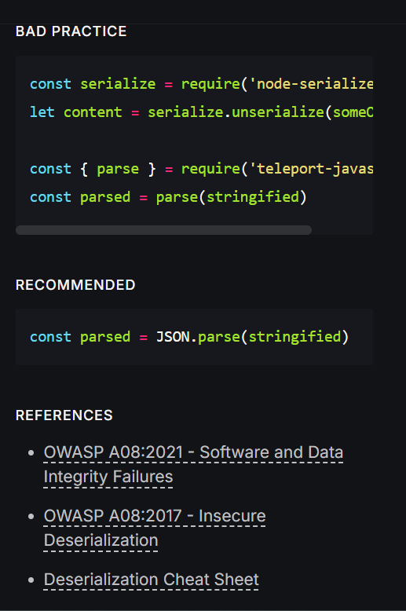

1. Displays results in a detailed dashboard with issue lists, severity levels, file locations, and educational links with references on main standards.
2. Supports baseline analysis, surfacing only new issues in pull requests while keeping existing ones in the dashboard.

    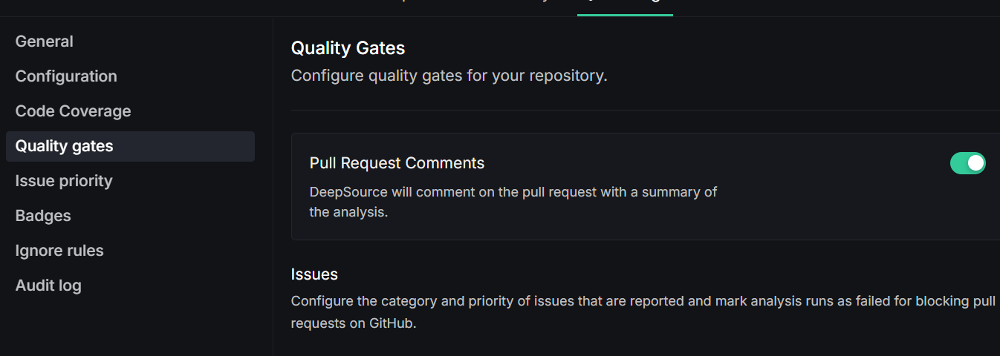

3. Enforces quality and security gates that can block pull requests not meeting set thresholds.

    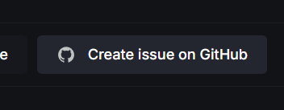

    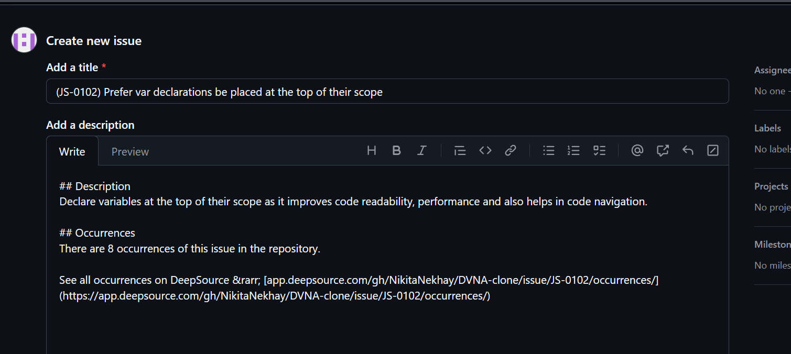

4. Integrates with tools like GitHub, Slack, and issue trackers for streamlined workflow automation. Also there is ability to directly create issues into project in the github

    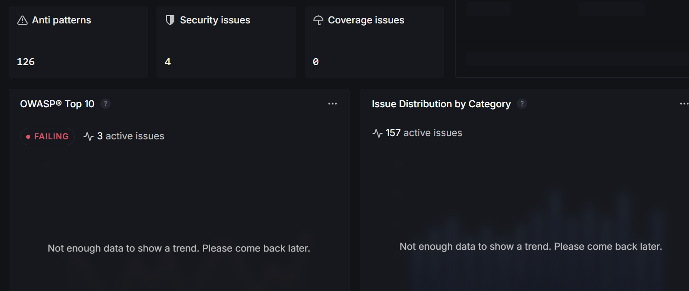

5. Provides metrics and reporting on code health, security posture, and historical trends.

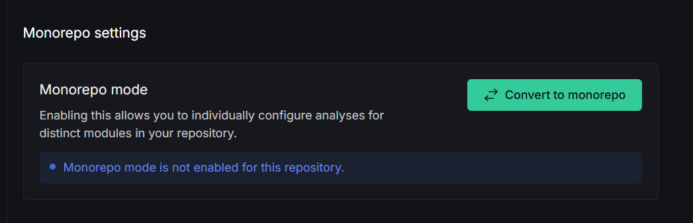

1. Supports both multi-repository and monorepo project management within a single workspace.
2. Offers enterprise-grade features such as SSO, SAML, audit logs, and self-hosted deployment options.

DeepSource stands out because it combines static analysis and dependency (SCA) scanning with a very low false-positive rate, reducing noise compared to tools like SonarQube or ESLint. Its Autofix feature automatically commits fixes for simple issues, saving developers time and maintaining code quality continuously. Additionally, it integrates seamlessly with GitHub pull requests and CI pipelines, offering real-time feedback and clear dashboards that make code improvement faster and more actionable.

> As a conclusion. It is better to use multiple tools to SCA. Firstly I would set up and configure deepsource and gitlabs tools, that provide good integrity on CI/CD, then manually I would do analysis with different tools like sonar. But not all tools provide good analysis on specific tech stacks, for example even deepsource does not support all popular js frameworks.
