# Final report

Name of report: Final_Project_VPN
Course: Computer Systems and Networks
Performed by Nikita Niakhai

---

# Single-User VPN (WireGuard) integrated with Active Directory (Samba) authentication for one user

### Stack:

- VPN protocol - **Wireguard**
- **For Active Directory (AD):** `Samba` / `Samba Domain Controller` (Samba DC) as an Active Directory Domain Controller
- SSSD and PAM, Kerberos
- **Linux Ubuntu 22.04 hosted on DigitalOcean with** : *1 vCPU / 1 GB Memory/ 25 GB SSD / 1 TB Transfer*
- Communication with server from Windows performed with `SSH`with shared keys and credentials (for AD)
- Access to AD done with `ssh`on **Powershell** and **Alpine** (**iSH** - IOS app)
- Apps for tunneling traffic **Wireguard Windows and IOS distributions**

---

# Pipeline of work

## 0 - Setting up hosting provider

1. Generating SSH keys

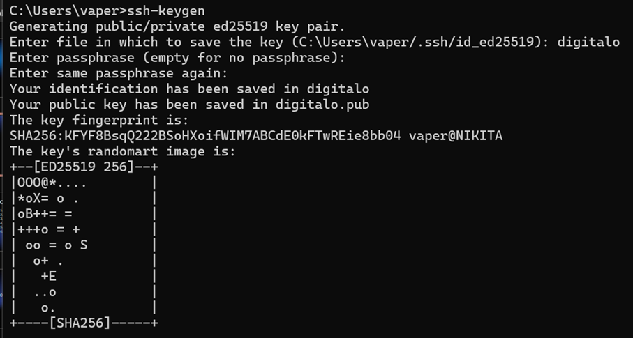

Generating SSH key on local machine

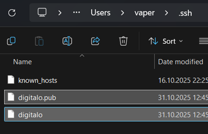

Keys are generated

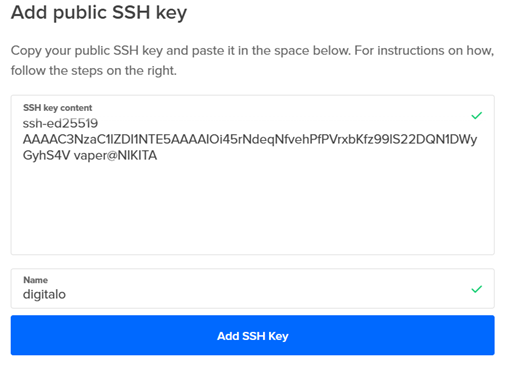

Keys are pasted to Administration Panel

1. Creating the server (droplet)

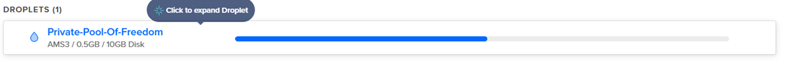

**IPv4:** `209.38.40.145`

1. Setting up connection with droplet via WinSCP & Putty

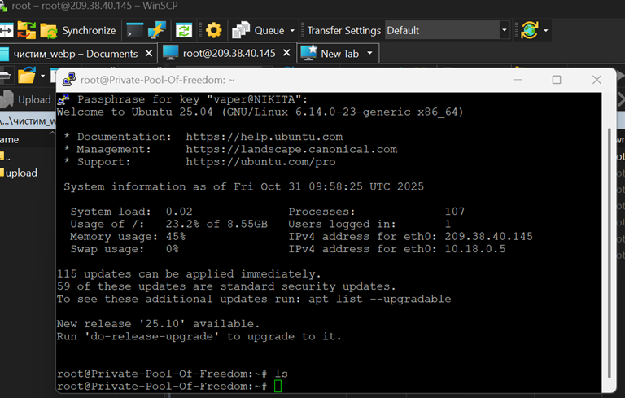

1. Configuring local machine for stable connection


Starting ssh service

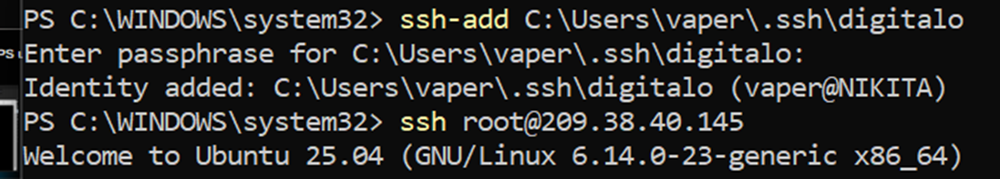

Adding public keys locally and creating link, so that authentication requirement will be encapsulated

1. Setting up access on droplet

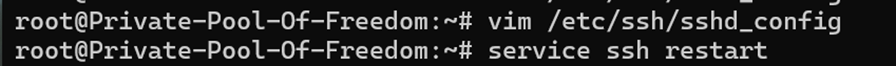


Editing `sshd` configuration (service responsible for main rules of communication) and restaring it

## 1 - Setting up Wireguard

1. Update the server:


`apt update && apt upgrade -y`

1. Install WireGuard:
`apt install -y wireguard`
2. Generate server keys:

    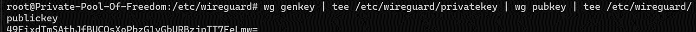

    `wg genkey | tee /etc/wireguard/privatekey | wg pubkey | tee /etc/wireguard/publickey`

3. Set permissions on the private key:

    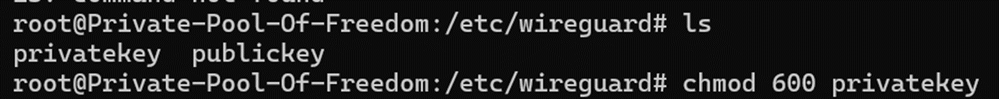

    `chmod 600 /etc/wireguard/privatekey`

4. Check network interface name:

    `ip a`
    This interface name is used in the config `/etc/wireguard/wg0.conf`

    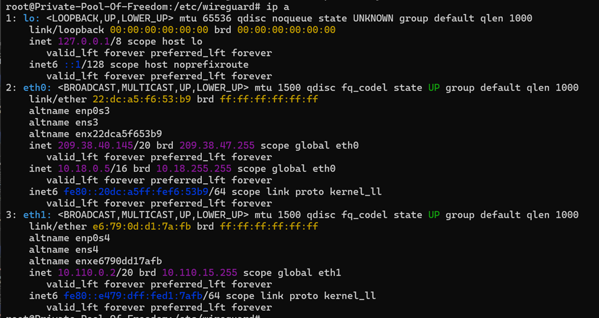

5. Configuration `/etc/wireguard/wg0.conf`:

    ```bash
    [Interface]
    PrivateKey = <privatekey>
    Address = 10.0.0.1/24
    ListenPort = 51830
    PostUp = iptables -A FORWARD -i %i -j ACCEPT; iptables -t nat -A POSTROUTING -o eth0 -j MASQUERADE
    PostDown = iptables -D FORWARD -i %i -j ACCEPT; iptables -t nat -D POSTROUTING -o eth0 -j MASQUERADE
    ```

6. Network Interface is used in the PostUp and PostDown lines!
7. Then I replace `privatekey` with the contents of the file `/etc/wireguard/privatekey`
8. Configuration for IP forwarding (also line `SaveConfig = true` in wg0.conf will do it automatically with every boot):

    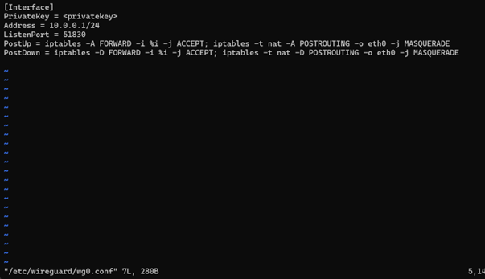

    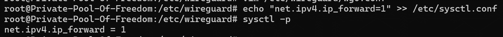

    `echo "net.ipv4.ip_forward=1" >> /etc/sysctl.conf` - set config
    `sysctl -p` - check

9. Manage the systemd daemon for WireGuard:

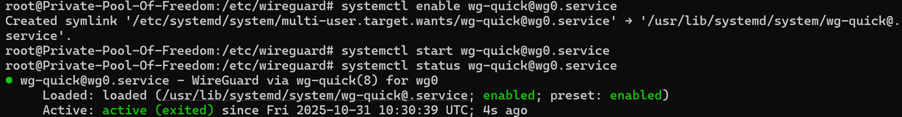

`systemctl enable wg-quick@wg0.service`
`systemctl start wg-quick@wg0.service`
`systemctl status wg-quick@wg0.service`

1. Create client keys:

    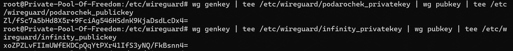

    `wg genkey | tee /etc/wireguard/name_privatekey | wg pubkey | tee /etc/wireguard/name_publickey`

2. Add the client to the server config:
`/etc/wireguard/wg0.conf`

    ```bash
    [Peer]
    PublicKey = <name_publickey>
    AllowedIPs = 10.0.0.2/32
    ```

    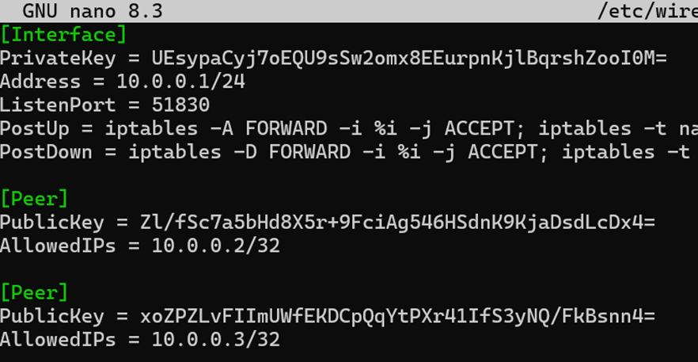

3. Replace `<name_publickey>` with the contents of the file `/etc/wireguard/name_publickey`
4. Restart the systemd service with WireGuard:
`systemctl restart wg-quick@wg0`
`systemctl status wg-quick@wg0`
5. On the local machine (for example, on a laptop), I create a text file with the client configuration:
`name_wb.conf`

    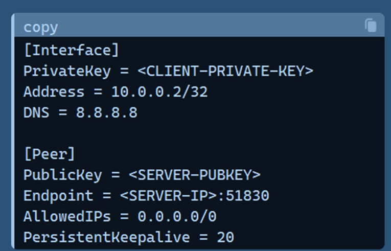

    ```bash
    [Interface]
    PrivateKey = <CLIENT-PRIVATE-KEY>
    Address = 10.0.0.2/32
    DNS = 8.8.8.8
    [Peer]
    PublicKey = <SERVER-PUBKEY>
    Endpoint = <SERVER-IP>:51830
    AllowedIPs = 0.0.0.0/0
    PersistentKeepalive = 20
    ```

6. Replace `CLIENT-PRIVATE-KEY` with the client's private key (contents of `/etc/wireguard/name_privatekey` on the server). Then replace `SERVER-PUBKEY` with the server's public key (contents of `/etc/wireguard/publickey` on the server). Replace `SERVER-IP` with the server's IP address.
7. Open this file in the WireGuard client (available for all operating systems, including mobile) and click the connect button in the client. Tunneling is setup!
8. Testing VPN

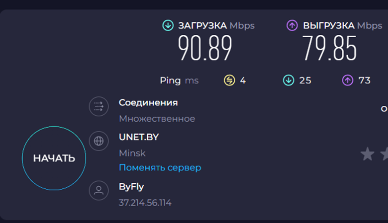

IP and speed before tunneling

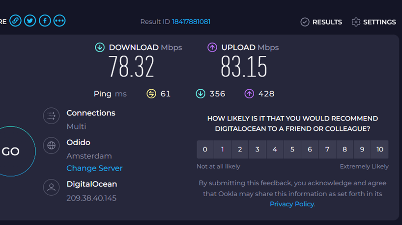

IP and speed after tunneling

1. Making backup of current state

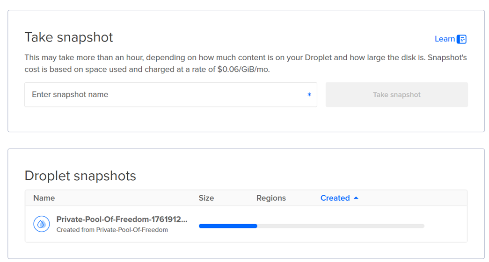

---

## 2 - Active Directory setup

1. Installation of tools
`sudo apt install -y samba krb5-user winbind libnss-winbind libpam-winbind sssd sssd-tools realmd acl attr policycoreutils-python-utils \
python3-pip python3-venv git dnsutils resolvconf`

This script installs Samba (the AD DC bits), Kerberos user tools, winbind/sssd and related NSS/PAM helpers, and utilities required for domain provisioning and troubleshooting. `resolvconf`/`dnsutils` help update DNS/resolver state.

### Provision Samba as an Active Directory Domain Controller

1. Stop processes of samba, if they are exist
`sudo systemctl stop samba-ad-dc.service || true`
`sudo systemctl stop smbd nmbd samba || true`

**I got following, which means no samba is yet present - good:**

> Failed to stop samba-ad-dc.service: Unit samba-ad-dc.service not loaded.
Failed to stop samba.service: Unit samba.service not loaded.
>

1. Deleting previous (default one) configuration of samba. And setting up domain provision and other options for DC
`sudo rm -f /etc/samba/smb.conf`
`sudo samba-tool domain provision --realm=VPN.LOCAL --domain=VPN --adminpass='Str0ngAdminPass!' --server-role=dc --use-rfc2307 --dns-backend=SAMBA_INTERNAL --option="dns forwarder = 8.8.8.8"`
Provision the AD domain (this creates the AD DC and DNS). **Files created/modified:** `/etc/samba/smb.conf`,

Kerberos keytab and Samba internal DBs stored in `/var/lib/samba`.

    After setting up DC I got the error:

    > WARNING: Using passwords on command line is insecure. Installing the setproctitle python module will hide these from shortly after program start.
    File "/usr/lib/python3/dist-packages/samba/netcmd/**init**.py", line 353, in _run
    return self.run(*args, **kwargs)
    ~~~~~~~~^^^^^^^^^^^^^^^^^
    File "/usr/lib/python3/dist-packages/samba/netcmd/domain/provision.py", line 343, in run
    result = provision(self.logger,
    session, smbconf=smbconf, targetdir=targetdir,
    >

1. **To resolve the error I only install (what they want from me) wider distribution of samba, which is `samba-ad-dc` (not remove previous samba installed):**

    `sudo apt install -y samba-ad-dc samba-dsdb-modules samba-vfs-modules python3-samba samba-common-bin smbclient winbind libnss-winbind libpam-winbind krb5-user`

1. I Write `krb5.conf` so system Kerberos uses the new AD realm. It ensures system Kerberos libraries look up KDC via DNS or the explicit localhost entries.

    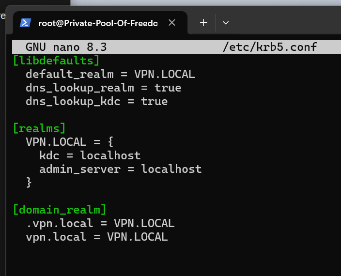

Content of file `krb5.conf`

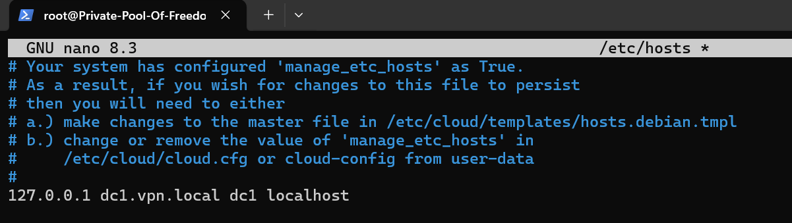

Content of file `/etc/hosts`

1. I start samba service and configure it to be enabled on boot

    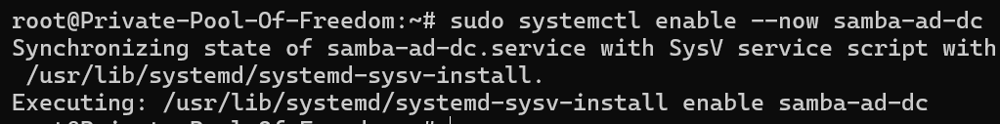

1. Now I verify how AD DC runs and DNS/Kerberos respond. Also I initiated Kerberos for administrator and set up default password

    `sudo samba-tool domain level show`
    `sudo host -t SRV _kerberos._tcp.vpn.local`
    `sudo host -t SRV _ldap._tcp.vpn.local`
    `sudo kinit administrator@VPN.LOCAL <<< 'Str0ngAdminPass!' && klist`

    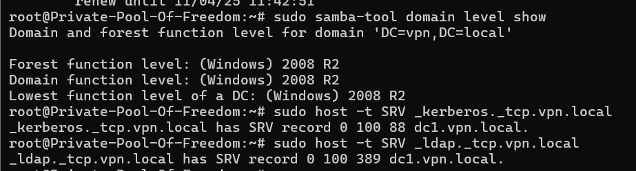

    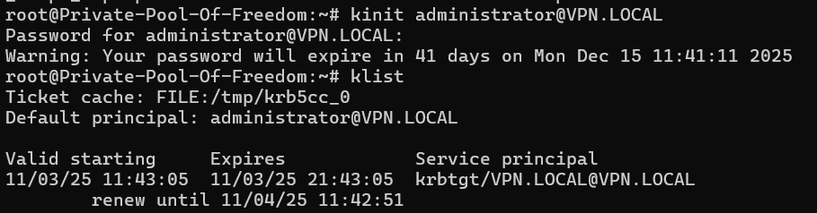

    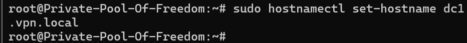

    Results of verification of Sabma AD DC / DNS/Kerberos respond

1. Results:
- **Samba AD DC** is running (`samba-ad-dc.service active`).
- **Winbind** started correctly, so AD user lookups via PAM/SSSD will work.
- **DNS and SRV records** are now correct (pointing to `dc1.vpn.local`).
- **TLS self-signed certificates** for LDAPS/HTTPS were generated automatically.

### Create AD group & AD users (create up to 10 test users)

Here I will grant rights to create WireGuard client configs. Group membership is managed by AD and not local UNIX accounts.

1. Create AD group `VPNUsers`

`sudo samba-tool group add VPNUsers`

    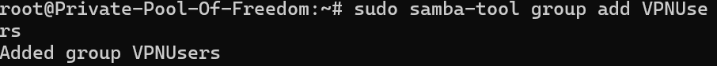

2. Create AD users and add to `VPNUsers` (created 3 real users)

    `sudo samba-tool user add alice MySecurePassword123 \
    --given-name=”alice” \
    --description="VPN user"`

    These commands create AD users, then add them to the `VPNUsers` group. I use `samba-tool` so users are created directly in AD.

    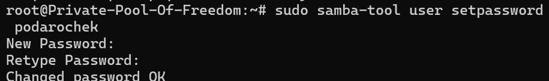

    

    

    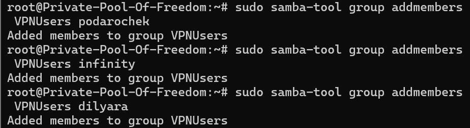

    Results of user management

### Configure SSSD and PAM so AD users can log into this server (locally) using their AD credentials

1. I ensure the Samba keytab is accessible. Export krb config file and set permission for the file:

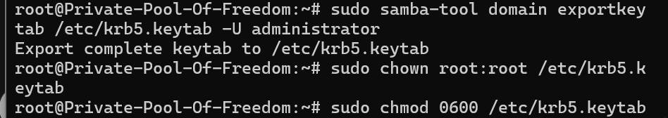

`sudo samba-tool domain exportkeytab /etc/krb5.keytab -U administrator`
`sudo chown root:root /etc/krb5.keytab`
`sudo chmod 0600 /etc/krb5.keytab`

1. Create the SSSD configuration file (full file). Secure sssd.conf and restart sssd

Here I configured for `ad` provider pointing to `VPN.LOCAL`. It tells sssd to use Kerberos for auth, AD for identity, creates fallback home directories under `/home/%u`, and disables fully qualified usernames. `ldap_id_mapping = True` lets SSSD generate UID/GID mapping for AD users.

    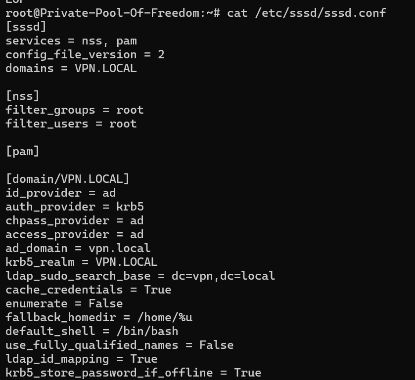

    Content of`ssd.config`

    Here I add permissions to file and start the daemon:

    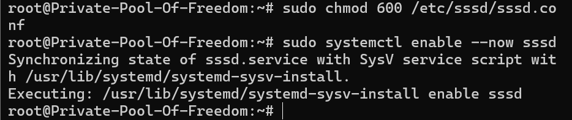

2. Configure NSS and PAM to use sssd (update /etc/nsswitch.conf and PAM)

Here commands ensure Name Service Switch uses `sss` (sssd) for passwd/group/shadow lookups. This makes AD users resolvable via system calls.

    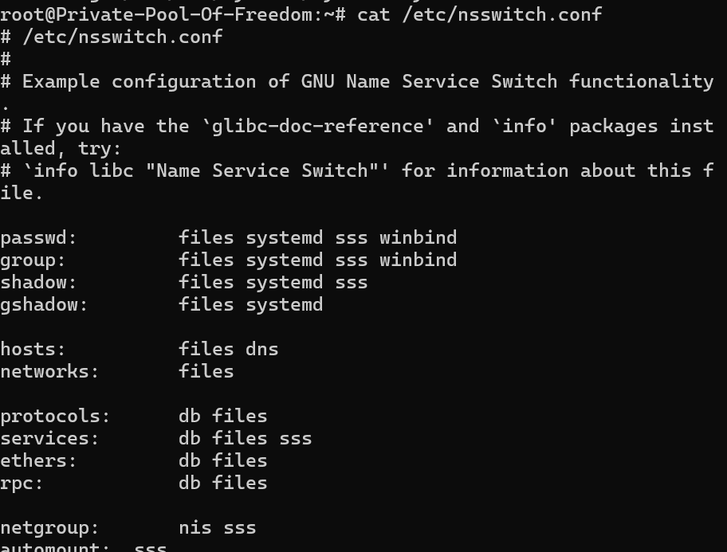

Content of file`/etc/nsswitch.conf`

1. Configure PAM to create home directories and allow AD users to authenticate and then check if pam services are present

`sudo pam-auth-update --enable mkhomedir`

    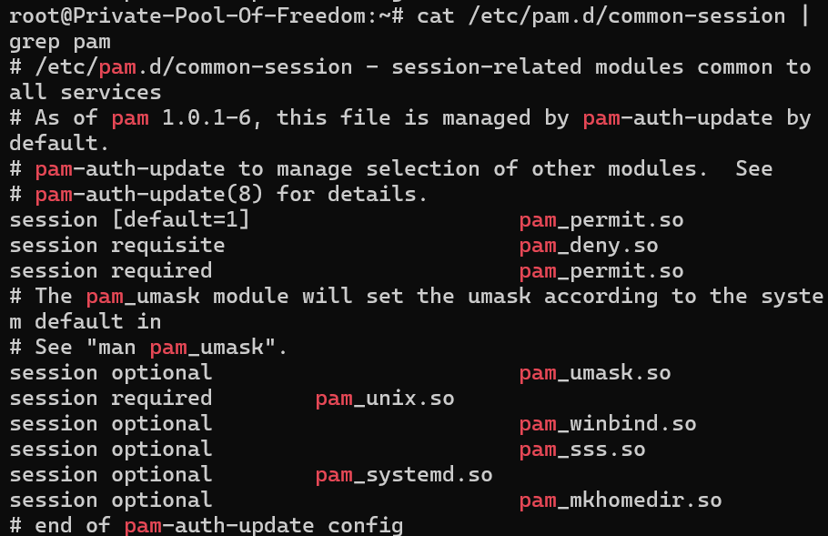

Result of command that show: pam modules are present.

1. Locally test that AD users can be looked up and can authenticate

    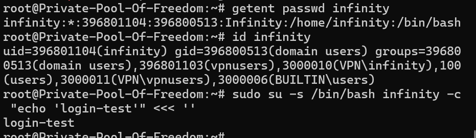

    Here`getent passwd` queries NSS via sssd to resolve the AD user entry, `id`  shows UID/GID mapping, and `sudo su -s /bin/bash usename -c ...` attempts to run a shell as `user` . These commands verify sssd identity and that PAM/Kerberos auth is working locally.

### Configure SSH for AD users and restrict sudo script execution to AD group

SSH access into the server will be the method to get client configs. For safety, I will restrict the management script to members of `VPNUsers`.

For the demo I will setup ssh to use credentials instead of shared keys but I will allow to root login as well (for the development).

1. Now I edit `/etc/ssh/sshd_config` to abort shared keys

    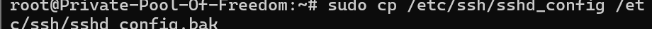

    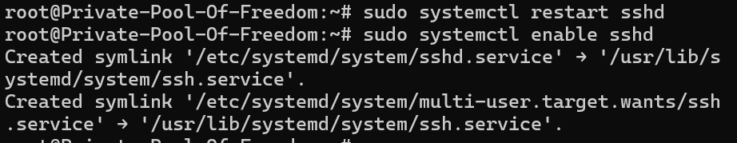

I make bakup for the config file and then restart sshd daemon.

1. Logging in as user of AD

    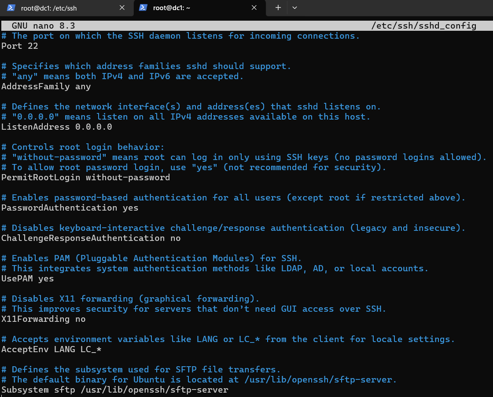

    Content of `sshd_config` file

    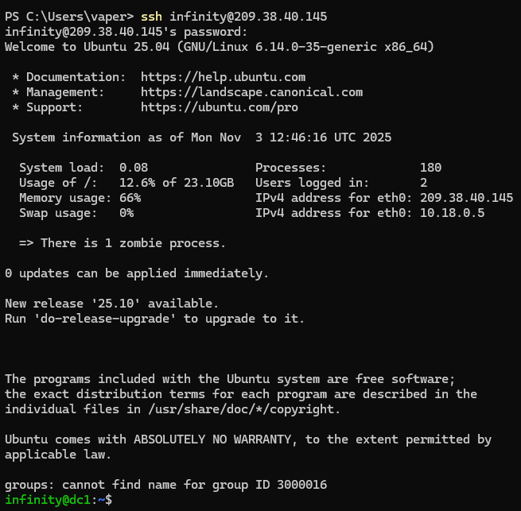

User is logged in.

1. Create a system group mapping for sudoers.

    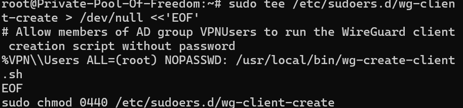

    Now members of the AD `VPNUsers` group will run the `/usr/local/bin/wg-create-client.sh` future script as root without being prompted for a password.

    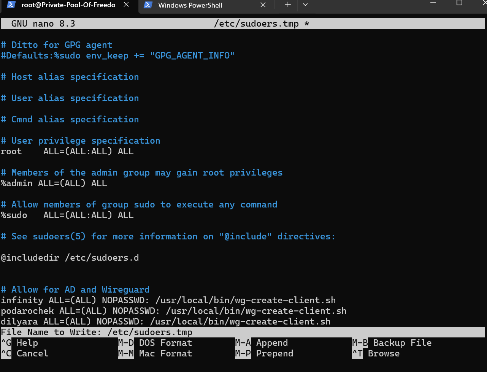

Content of `/etc/sudoers.tmp` that gives permissions for AD users

### Create the WireGuard client creation script — generate keypair, add peer to wg0, write client config

1. This script will: check the invoking user is in the AD `VPNUsers` group, generate WireGuard keypair (using `wg` and `/usr/bin/wg`), compute a client IP from the AD user uidNumber (or next available in the `10.0.0.0/24` pool), append the peer to `/etc/wireguard/wg0.conf`, call `wg addconf` or `wg set` to apply live, and output the client config file.

    > Full script on the path `/usr/local/bin/wg-create-client.sh` [last page of the Report]
    >

1. Set permission for the script

```bash
sudo chmod 700 /usr/local/bin/wg-create-client.sh
sudo chown root:root /usr/local/bin/wg-create-client.sh
```

### Test the full flow (AD user obtains config, client connects)

1. Now I run the script and then copy it to my local PC

`ssh podarochek@209.38.40.145 sudo /usr/local/bin/wg-create-client.sh podarochek`
`scp podarochek@209.38.40.145:/home/podarochek/podarochek_wg.conf /`

    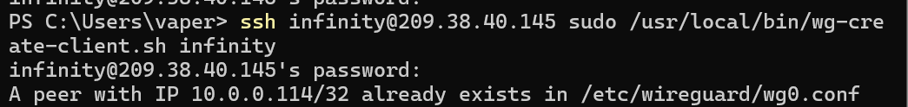

    Here I see that on my PC I already received configs. Now I try my IOS.

1. I run the script and check my current IP from Linux machine on my IOS

    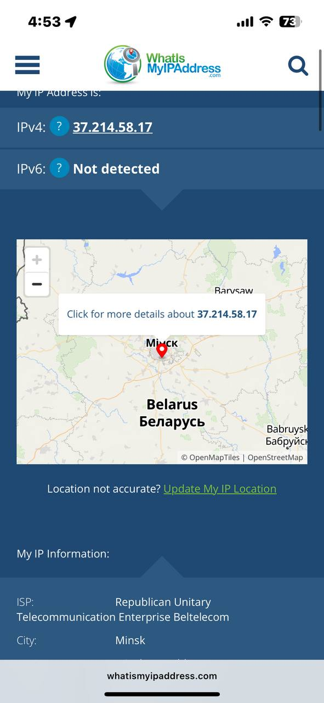

IP before enabling tunelling

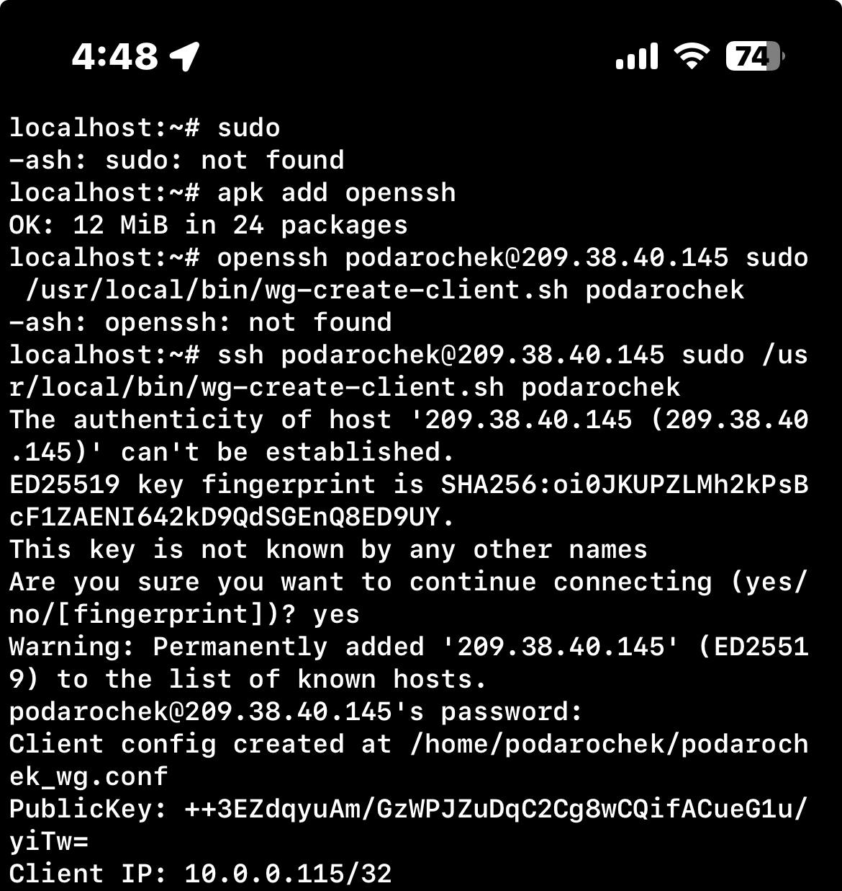

Execution of script from my IOS via podarochek credentials

1. I copy config to my local VM on IOS

    

    Copy config file from server to my IOS via podarochek credentials

    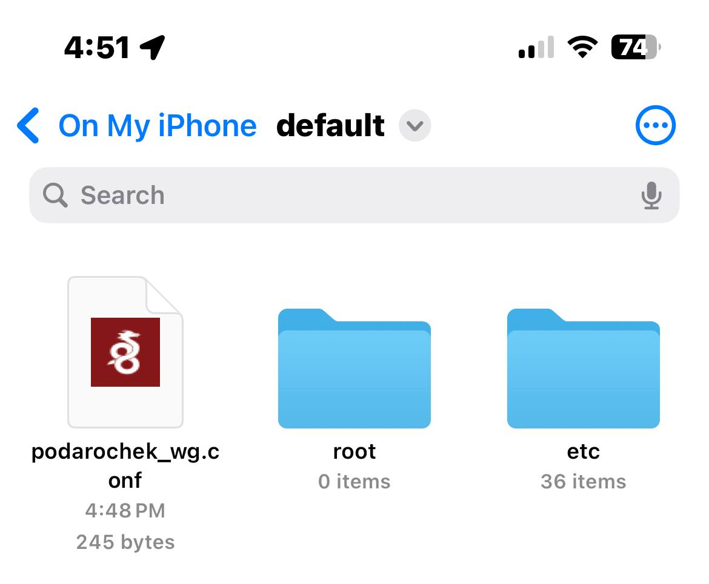

    Copied file inside my IOS device

2. I added this config in Wireguard App so now I have access to tunneling

    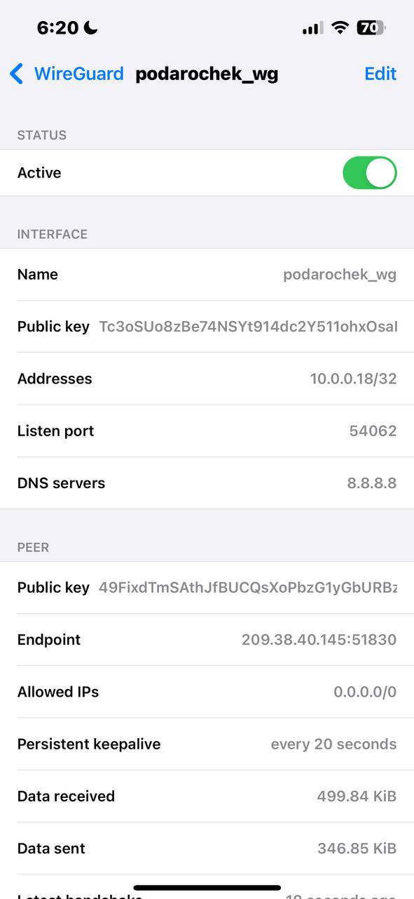

Configuration of podarochek wg_conf inside Wireguard App

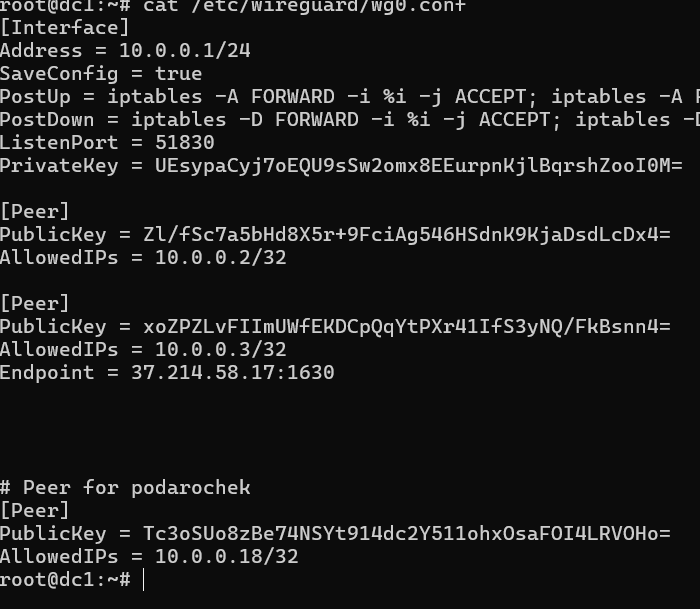

Verification of logs inside config files inside Linux Machine

1. VPN works.

    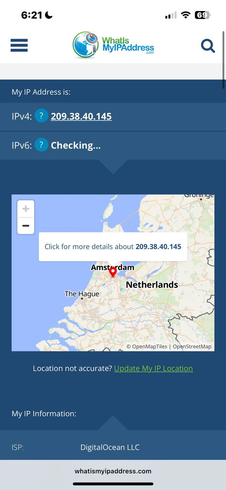

IP after enabling tunelling

# Future upgrades:

- [ ]  WireGuard UI (TSL/SSL)
- [ ]  Firewall, IDS, and hardening (Fail2Ban, Crowdsec)
- [ ]  Key rotation, access policy, and zero-trust elements
- [ ]  Prometheus Node Exporter + Grafana, or simpler Netdata for dashboards and alerting (To telegram bot)

# Applications

**Script on the path `/usr/local/bin/wg-create-client.sh` :**

```bash
sudo tee /usr/local/bin/wg-create-client.sh > /dev/null <<'EOF'
#!/usr/bin/env bash
# wg-create-client.sh
# Usage: sudo /usr/local/bin/wg-create-client.sh <username>
# This script must only be callable via sudo by members of the AD group VPNUsers (configured in /etc/sudoers.d/wg-client-create)

set -euo pipefail

WG_INTERFACE="wg0"
WG_CONF="/etc/wireguard/${WG_INTERFACE}.conf"
WG_NETWORK="10.0.0.0/24"
WG_SERVER_IP="10.0.0.1"   # server's wg IP (change if your server uses a different WG IP)
DNS_SERVERS="8.8.8.8"

if [ "$#" -ne 1 ]; then
  echo "Usage: sudo $0 <ad-username>"
  exit 2
fi

USERNAME="$1"

# Check caller is allowed (safety check)
if ! id "${SUDO_USER:-$USER}" >/dev/null 2>&1; then
  echo "Error: unable to determine invoking user"
  exit 3
fi

INVOKER="${SUDO_USER:-$USER}"

# check group membership (sssd/ad)
if ! id -nG "$INVOKER" | grep -qw "vpnusers"; then
  echo "Error: user $INVOKER is not a member of VPNUsers"
  exit 4
fi

# get UIDNUM for deterministic IP mapping
getent passwd "$USERNAME" >/dev/null 2>&1 || { echo "User $USERNAME not found via NSS"; exit 5; }
UIDNUM=$(getent passwd "$USERNAME" | awk -F: '{print $3}')

# Compute an IP for the user, restricted to /32 range 10.0.0.1–10.0.0.32
USED_IPS=$(grep -oP '10\.0\.0\.\d+' "$WG_CONF" | awk -F. '{print $4}')
START_OCTET=1
END_OCTET=32

# Try to assign based on UIDNUM
if [[ "$UIDNUM" =~ ^[0-9]+$ ]]; then
    LAST_OCTET=$(( (UIDNUM % END_OCTET) + START_OCTET ))
else
    LAST_OCTET=$START_OCTET
fi

# Ensure LAST_OCTET is not already in use
while echo "$USED_IPS" | grep -qw "$LAST_OCTET"; do
    LAST_OCTET=$((LAST_OCTET + 1))
    if ((LAST_OCTET > END_OCTET)); then
        echo "No available IPs left in 10.0.0.0/32 range"
        exit 6
    fi
done

CLIENT_IP="10.0.0.${LAST_OCTET}/32"

# ensure address is not already used in wg conf
if grep -q "$CLIENT_IP" "$WG_CONF"; then
  echo "A peer with IP $CLIENT_IP already exists in $WG_CONF"
  exit 6
fi

# generate keypair
PRIVATE_KEY=$(wg genkey)
PUBLIC_KEY=$(printf '%s' "$PRIVATE_KEY" | wg pubkey)

# create client config
CLIENT_CONF_FILE="/home/$USERNAME/${USERNAME}_wg.conf"
mkdir -p "/home/$USERNAME"
cat > "$CLIENT_CONF_FILE" <<EOC
[Interface]
PrivateKey = $PRIVATE_KEY
Address = ${CLIENT_IP}
DNS = ${DNS_SERVERS}

[Peer]
PublicKey = $(wg show $WG_INTERFACE public-key)
AllowedIPs = 0.0.0.0/0
Endpoint = 209.38.40.145:51830
PersistentKeepalive = 20
EOC

# append peer to server config (persistent)
cat >> "$WG_CONF" <<EOP

# Peer for $USERNAME
[Peer]
PublicKey = $PUBLIC_KEY
AllowedIPs = ${CLIENT_IP}
EOP

# apply live to running wg interface
wg set "$WG_INTERFACE" peer "$PUBLIC_KEY" allowed-ips "${CLIENT_IP}"

# set file ownership so the AD user can download it over SSH/SFTP
PRIMARY_GROUP=$(id -gn "$USERNAME")
chown "$USERNAME":"$PRIMARY_GROUP" "$CLIENT_CONF_FILE"
chmod 0700 "$CLIENT_CONF_FILE"

echo "Client config created at $CLIENT_CONF_FILE"
echo "PublicKey: $PUBLIC_KEY"
echo "Client IP: ${CLIENT_IP}"
EOF
```

<https://app.notion.com>


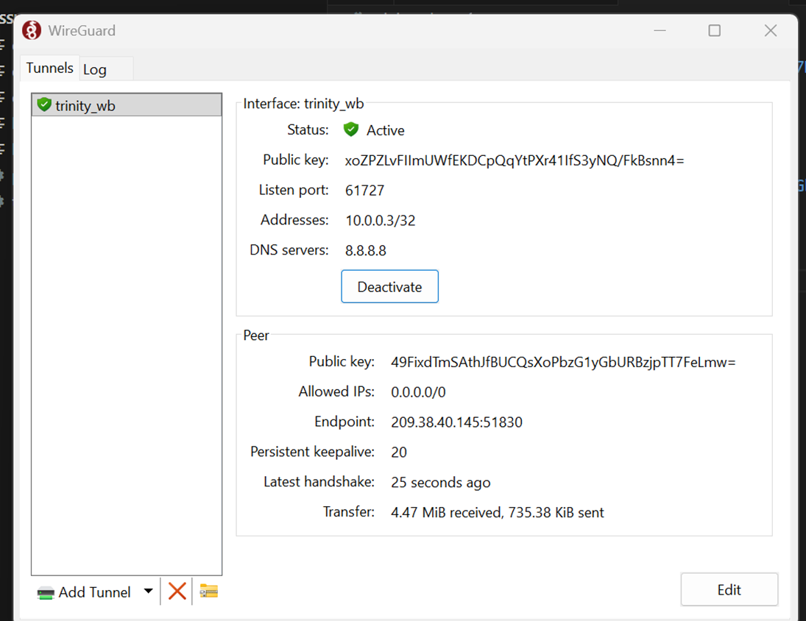
