# 1 Networking Basics

Name of report: INR_NetEng_LAB_1_Nikita_Niakhai
Course: Networks Engineering
Performed by Nikita Niakhai

---

Task 1 - Tools

1. Install the needed dependencies for GNS3: QEMU/KVM, Docker and Wireshark.
Hint: Check that virtualization is enabled in your bios. Make sure that the user belongs to all the
necessary groups after installing the tools.

I found out that guest machine (Machine inside Virtual Box) does not support virtualization, so I decided to do it on my host machine Windows and I installed all tools here.

Firstly, I must approve that my system provides virtualization functionality. I open task bar manager → Processor and there looked up for Virtualization value

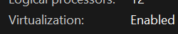

Figure 1. Task Bar Manager: Virtualization is enabled for my laptop’s processor.

Then I do install all-in-one-GNS3 that additionality deploy all necessary tools such as wireguard and docker..

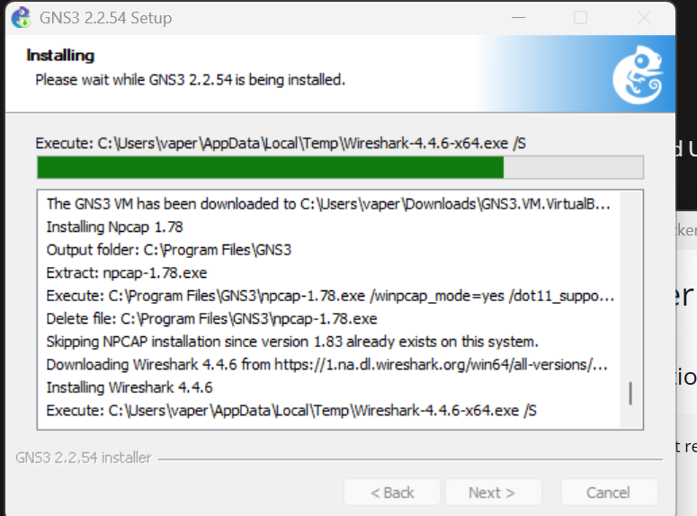

Figure 2. Installation process of GNS3 and dependencies.

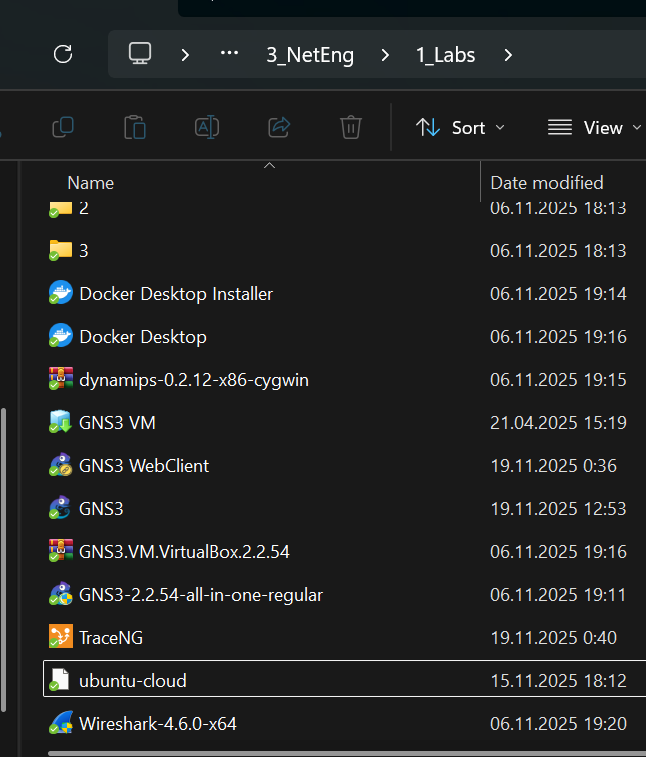

Figure 3. Tools installed for the lab, downloaded installation exe and etc inside my lab folder.

1. Start a GNS3 project, configure the pre-installed Ubuntu Cloud Guest template. Check that
you can start it.

Note, that GNS3 also installed image for Virtual machine. After many unsuccessful attempts and multiple errors during activation of GNS3 VM machine inside GNS3 interface I decided to follow recommendation and installed VMware Workstation Pro.

Also I have installed Ubuntu Cloud Guest template `.ova` file [`ubuntu-cloud`], check Figure 3.

I have configured adapters of VM for proper value to use HOST-ONLY and NAT provided by VMnet.

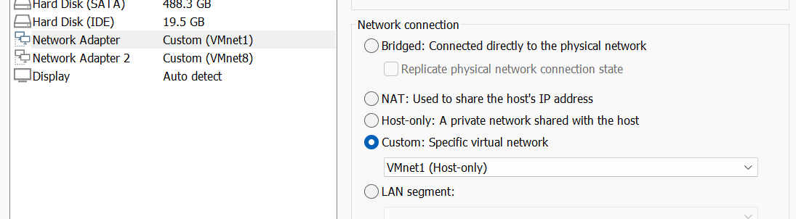

Figure 4. Network settings for GNS3 VM inside VMware.

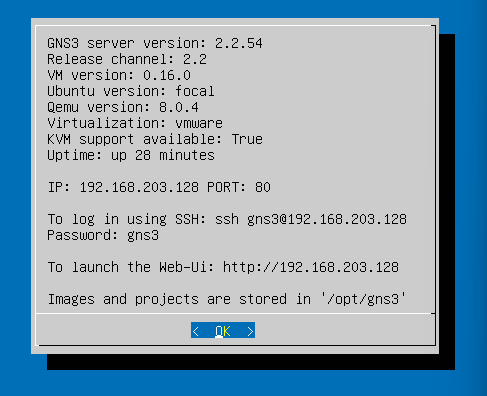

Figure 5. GNS3VM GUI is running.

For proper work of template I must check needed packages and modules on my VM, listed bellow:

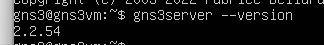

Figure 6. Version of `gns3-server` [1]

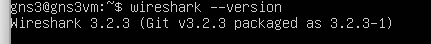

Figure 7. Version of `wireshark`

Figure 8. Version of `docker`

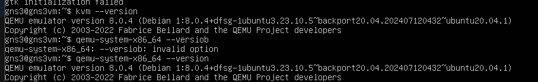

Figure 9. Versions of `kvm` and `qemu`

Now when everything is running and setup, I inspect Edit→Preferences→GNS3 VM. VM rules are setup correctly.

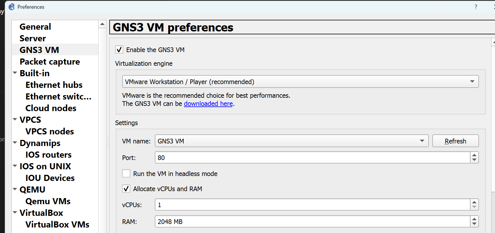

Figure 10. VM rules

Servers and nodes are active and we can observe it on Figure 11

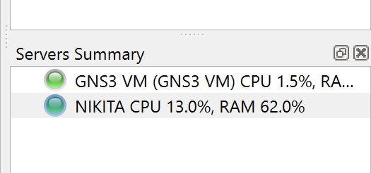

Figure 11. Servers summary

Therefore, I will install Ubuntu Cloud Guest appliance on my VM (File → Import Appliance → Select my ova), look at figure 12. There I downloaded build files from Jammy Jellyfish and now they are available to be executed.

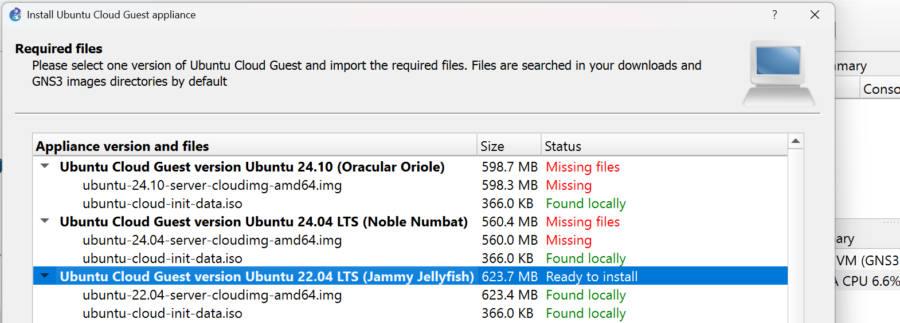

Figure 12. Installation of Ubuntu Cloud Guest

Results of installation are seen in figure 13.

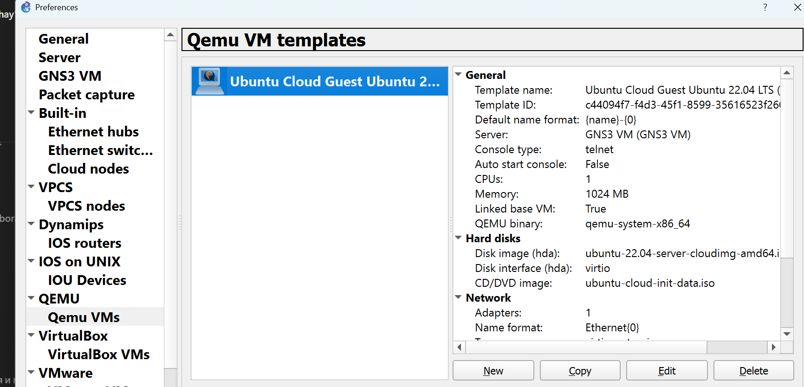

Figure 13. Rules for QEMU VM templates inside GNS3 Preferences (Ubuntu Cloud Guest is installed)

1. What are the different ways you can configure internet access in GNS3?
Test them with a single created VM and give a one-line description of each.
What are the differences between them?
Bonus: show the difference between them on practice and test the connectivity.

- **NAT NODE (Node → NAT)**

traffic is flying only inside private network and any traffic e.g. from outside internet can't reach the private network.

NAT - Network Address Translation, router service that is placed on the edge and is there to connect private network to public ones.

Why to use?

- easy to configure
- inbound traffic is the one allowed, outbound traffic is blocked

- **Cloud/Bridged**

VM is on real LAN, that we use on host machine. Depend on physical network. Inbound and Outbound traffic works

- **2 adapters: Host-Only + NAT (default one)**

secure (isolated), good for lab traffic, reliable, but 2 adapters and configuration are needed.

### Task 2 - Switching

1. Make the network topology.

Note:

> Connection to VM is not working while using VPN :(

I created project inside default folder. Then started dragging and dropping elements of first topology to my blanket. All elements will be setup as children of GNS3 VM.

I created nodes from my Ubuntu Cloud configured on VM. Then renamed them, started, accessed via Console.

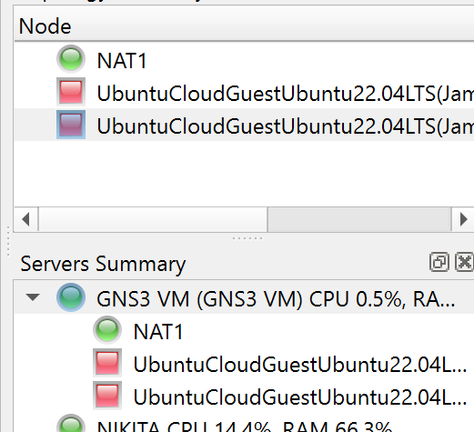

Figure 14. Servers Summary for nodes

I setup NAT for GNS3 VM server.

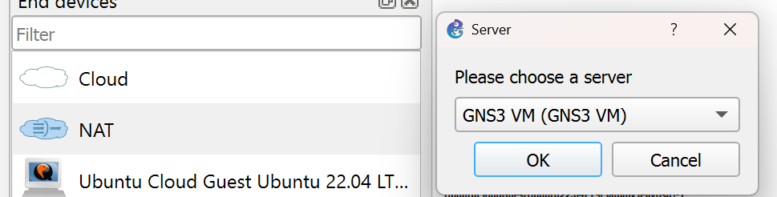

Figure 15. Generation of NAT

I used `cable` to connect elements between each other, choosed proper ports and outlined that with notes on blanket. The whole topology is seen in figure 16.

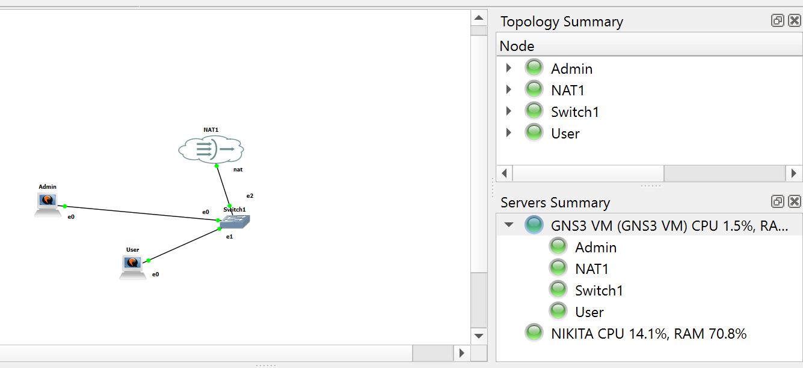

Figure 16. Topology

When I started all nodes console with booting process appeared, after the process finished, I run console for each node.

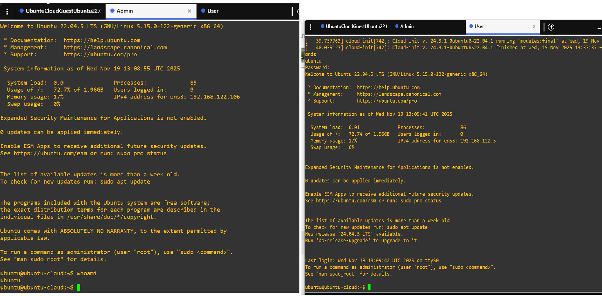

Figure 17. Console for each VM (Admin(Web-Server) and User(Admin))

1. Install openssh-server on both VMs and nginx web server on the Web VM.

 `ssh` is already configured on VM, so I just verify that process is active on both machines.

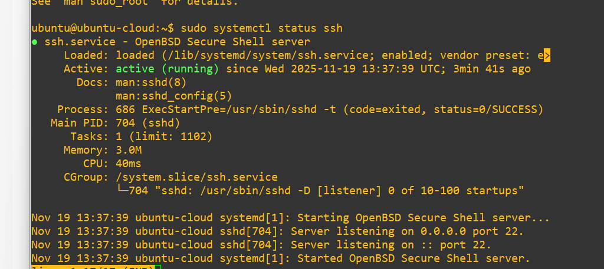

Figure 18. ssh process on web-server/admin machine.

I downloaded nginx and the needed packages on both machines.

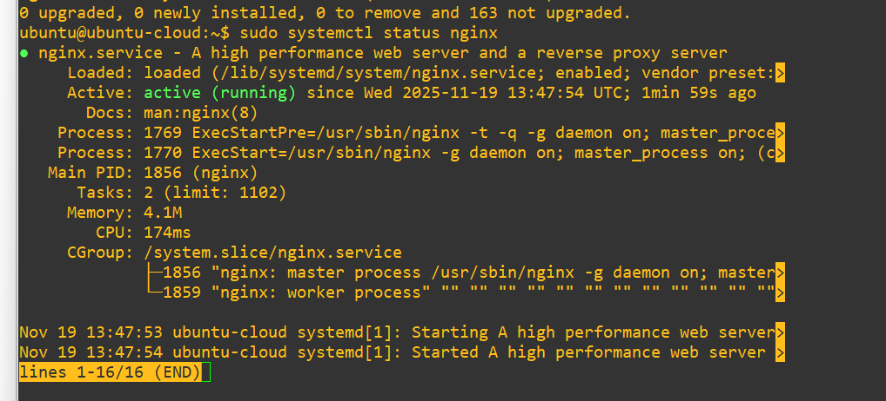

Figure 19. nginx process on web-server machine.

1. What is the IP of the mask corresponding to /28 ?
How many machines can you configure under this subnet? Explain it.

So IPV4 is 32 bits. Mask is 28. 32-28 = 4 bits for hosts.

Available addresses are 2^n bits for hosts → 2^4 = 16

But! 2 addresses are reserved, one for server `0`, one for accessing all hosts in the subnet `1`.

14 addresses.

What is IP?

11111111.11111111.11111111.11110000

255.255.255.x?

(1+2+4+8)+(16+32+64+128) - first group is 0, so decimal value for last is 16+32+64+128=240.

x=240

IP for subnet is 255.255.255.240

**Answer:** IP for /28 mask is 255.255.255.240 (decimal), 11111111.11111111.11111111.11110000 (binary) and 14 machines are available to be configured on the subnet.

Number for usable hosts is 14. Because if we transform mask to binary we get:
11111111.11111111.11111111.11110000
This leaves us with 4 bits available for host addresses. It gives us possibility of
2
4=16 different addresses, but first and last addresses are reserved for network
address and broadcast address respectively.

1. Configure the VMs with private static IPs under a /28 subnet.

First I did for Web server.

`ip a` showed me current IP address that I will be using for configuration of network.

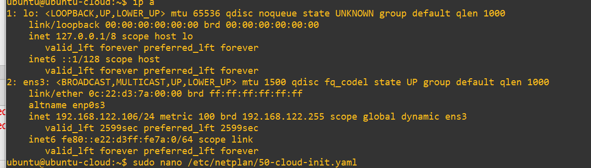

Figure 20. IP address of WEB-SERVER VM before configuration changes

I modified configuration file: added `addresses` prop with value of `current_IP_of_machine/28`, look in figure

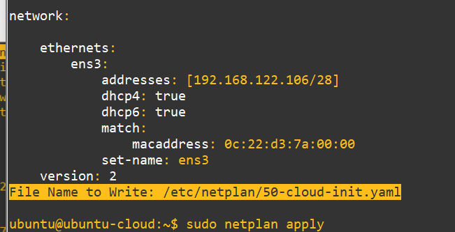

Figure 21. Configuration file for network ip.

Changed config file and added addresses.

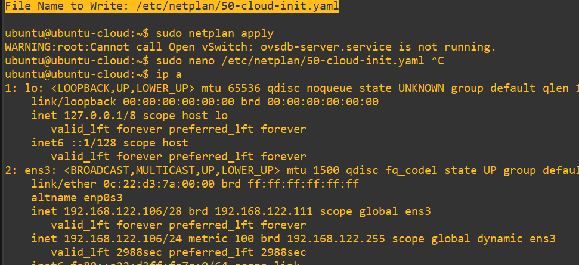

Figure 22. IP address of WEB-SERVER VM after configuration changes.

At present, Admin VM to be done, the same steps will be performed. Figures 23-25

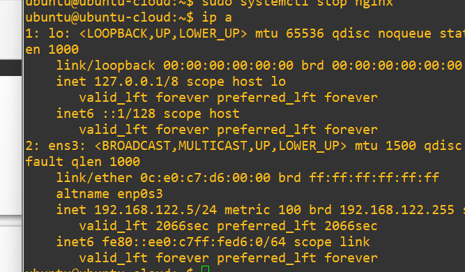

Figure 23. IP address of Admin VM before configuration changes

I modified configuration file: added `addresses` prop with value of `current_IP_of_machine/28`

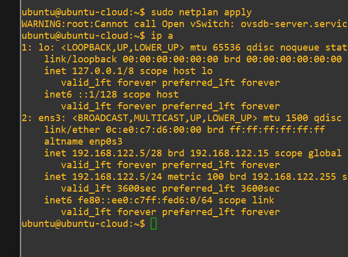

Figure 24. IP address of Admin VM after configuration changes

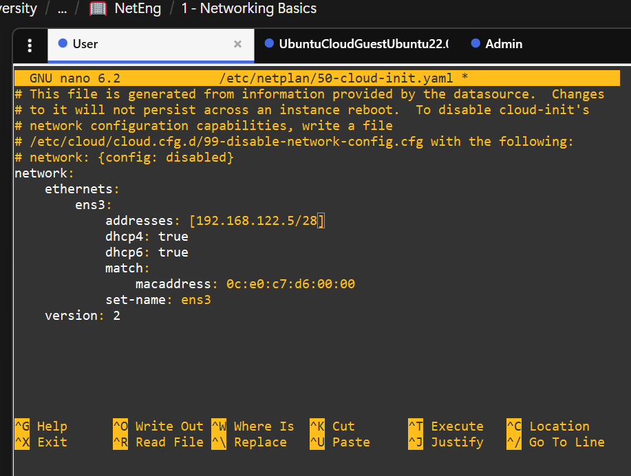

Figure 25. Configuration file for Admin VM

1. Check that you have connectivity between them.
Hint: use ping, traceroute and mtr.

Connectivity is successful from both sides, figure 26.

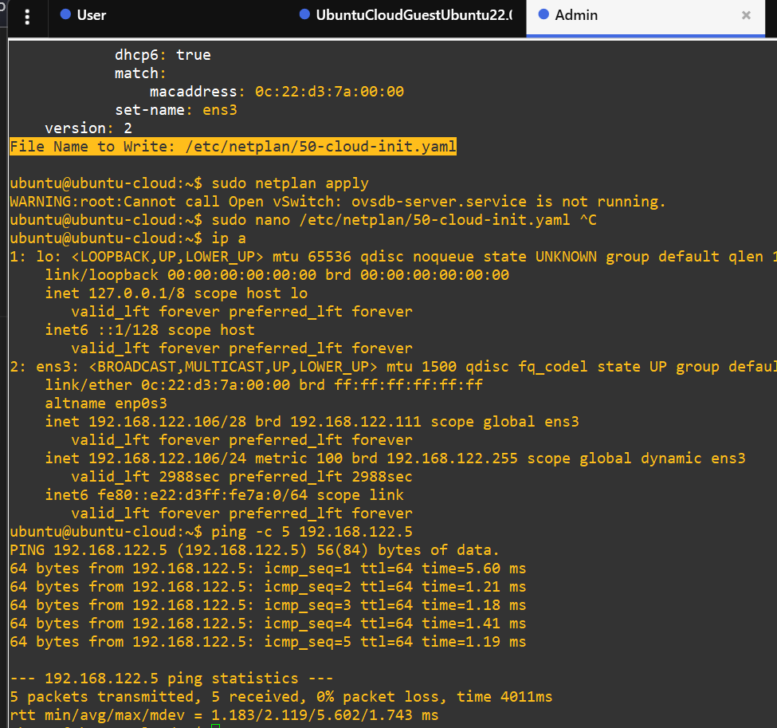

Figure 26. `Curl` is used to check accessibility of Admin machine from Web-Server

1. Make sure your web server is accessible from the Admin VM.

Web server is accessible from the Admin VM, figure 27.

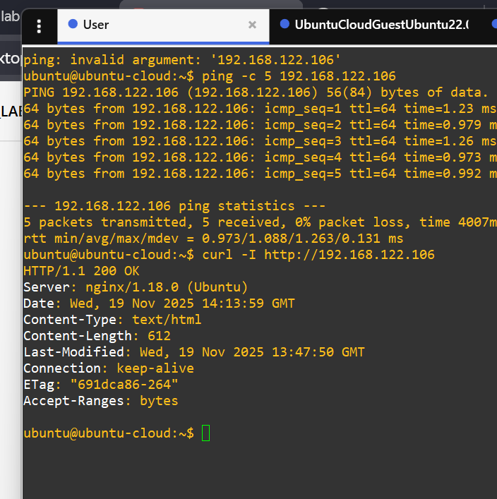

Figure 27. Check accessibility of web-server from user using`curl` command.

### Task 3 - Routing

1. Select a virtual Routing solution (Gateway) such as Mikrotik (recommended default choice),
PfSense, VyOS, Untangle NG, OpenWrt, Cumulus VX.
2. Create Internal network for Worker instance.
3. Connect your Gateway to the internet and to your workstation/host.
4. Setup the gateway for Admin, Web and Worker, then check their connectivity.
5. Configure port forwarding for http and ssh to Web and Admin respectively.
6. Check that you can ssh to the Admin and access your web page from your workstation/host.

### Application / References

[1] Documentation for GNS3 : for installing gns3 on VM : <https://docs.gns3.com/docs/getting-started/installation/linux/>

[2] Official site of GNS3 : for installing distribution

[3] Official site of VMware and their provider : to install VMware Workstation

[4] GPT for assistance in practical part and explaining theory.

---

### Previous attempts on Task 1

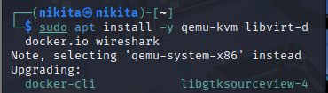

`sudo apt install -y qemu-kvm libvirt-daemon-system libvirt-clients bridge-utils virt-manager [docker.io](http://docker.io/) wireshark`

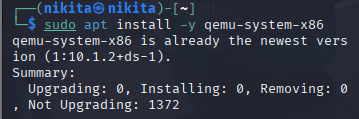

`sudo apt install -y qemu-system-x86`

Then I do restart of the machine

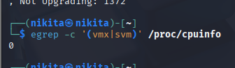

Check if “virtualization is enabled in your bios” `egrep -c '(vmx|svm)' /proc/cpuinfo`: I need to enable it.

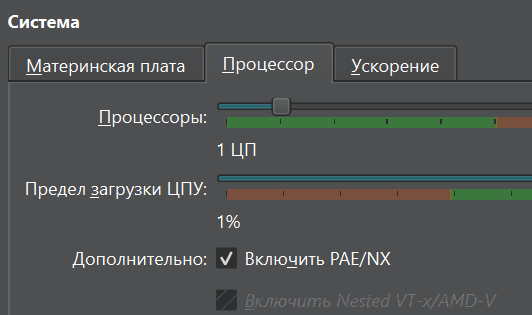

Now in the settings I don’t have this option available. To enable it I should run the command inside Windows (my normal machine) folder:
`VBoxManage modifyvm "Dev Machine 2" --nested-hw-virt on`

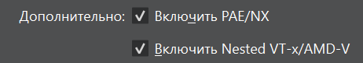

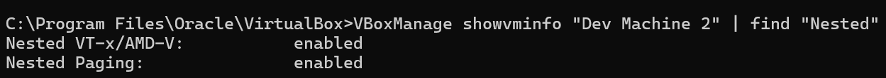

Now it is enabled.

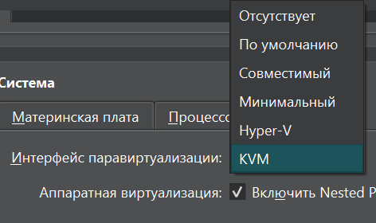

Now I choose KVM as Paravirtualization interface.

I boot machine again. And I still need to do things to my host machine such as
`bcdedit /set hypervisorlaunchtype off`

`dism.exe /Online /Disable-Feature:Microsoft-Hyper-V
dism.exe /Online /Disable-Feature:VirtualMachinePlatform
dism.exe /Online /Disable-Feature:WindowsHypervisorPlatform
dism.exe /Online /Disable-Feature:Containers`

Now I found out that guest machine does not support virtualization, so I decided to do it on my host machine Windows and I installed all tools.

Virt. is enabled for processor.

