# 2 IPv4 & IPv6

Name of report: INR_NetEng_LAB_2_Nikita_Niakhai
Course: Networks Engineering
Performed by Nikita Niakhai

---

> Write this commands on nodes every reboot
>
> `sudo dhclient -v ens3`

`192.168.1.200` - web

`192.168.1.199` - admin

`192.168.1.198` - worker 1

### Task 1 - Ports and Protocols

1. Check the open ports and listening Unix sockets against ssh (22) and http (80) on Admin and Web respectively.
Hint: use both `lsof` and `netstat`

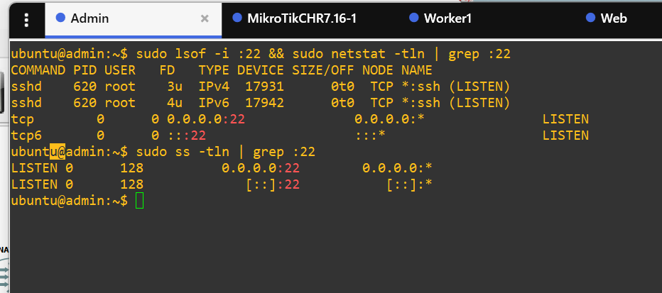

Figure 2. Check for port 22 on Admin using `lsof`

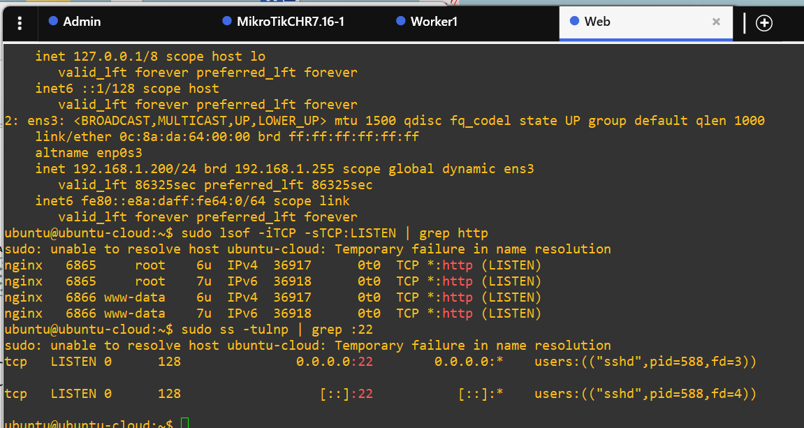

Figure 3. Check for port 80 on Web using netstat, lsof, ss

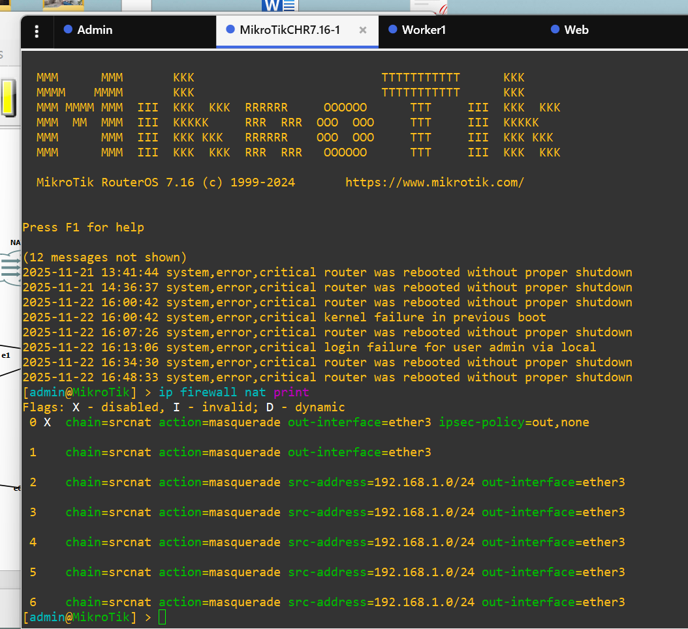

Figure 4. NAT options observed on virtual gateway

1. Scan your gateway from the outside. What are the known open ports?
Hint: use `nmap`

- `T4` option speeds up scan, `-p-` enables
scanning all ports(1-65535), `-n` disables DNS lookup.

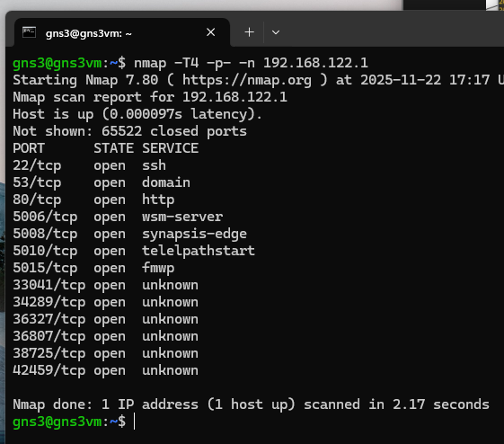

Figure 5. Scan of gateway form outside (gns3vm)

So we observer that open ports are well known: 21-ftp, 22-ssh, 23-telnet, 80-http.

1. A gateway has to be transparent, you should not see any port that is not specifically
forwarded. Adjust your firewall rules to make this happen. Disable any unnecessary services
and scan again.

To do that I have determined what services are unnecessary, then used command

`/ip service disable name_of_service,…`

The results are shown bellow, figure 6.

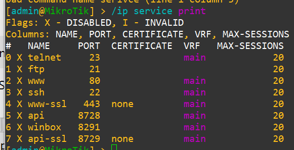

Figure 6. List of running services (disabled)

Because I have firewall set and real attacker don’t care about 2000th port that possessed by bandwidth server I decided not to disable it. But instead I assumed that nodes comming from LAN bridge should get access to 2 services ssh and winbox, so I opened them only for LAN net, figure 7.

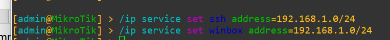

Figure 7. Enabling must-have services for LAN net

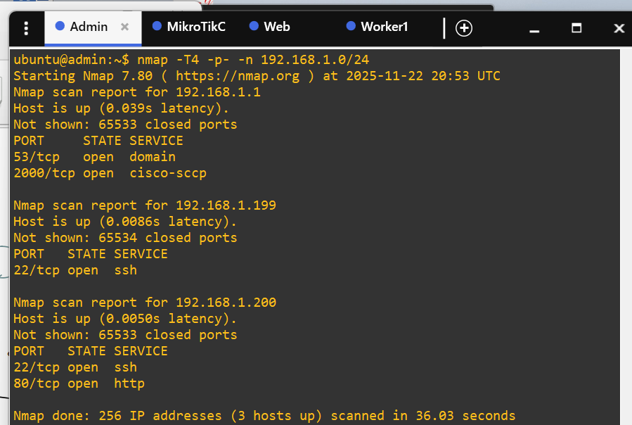

Figure 8. Scan again, unnecessary services are disabled.

1. It suppose that some scanners start by scanning the known ports and pinging a host to see if
it is alive.

4.1. Scan the Worker VM from Admin. Can you see any ports

Results, figure 9: tcp port (`22`) is open for `ssh`

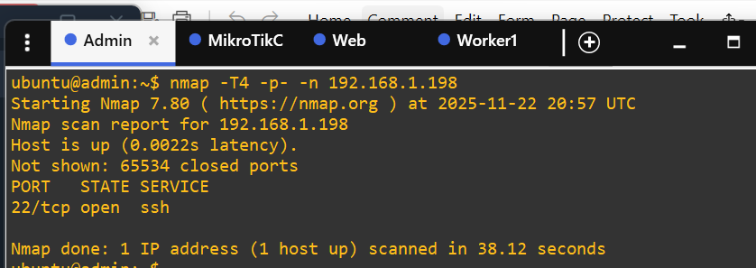

Figure 9. Scan of **Worker** from **Admin**

4.2. Block ICMP traffic on Worker and change the port for SSH to one that is above 10000.

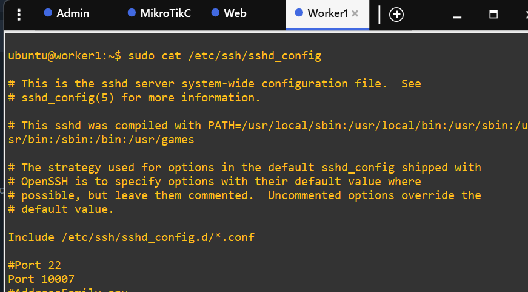

Figure 10. content of the file responsible for configuration of `ssh` service `/etc/ssh/sshd_config`

Then I restarted the service and check the status along with active port on Worker machine, figure 11.

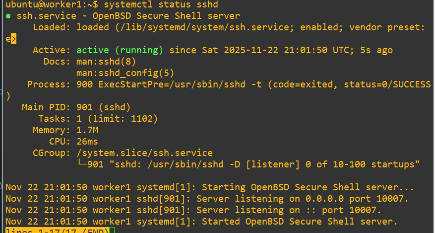

Figure 11. Status of ssh service inside **Worker** machine

I don’t have sockets enabled, so sshd.service points to previous configuration, figure 12.

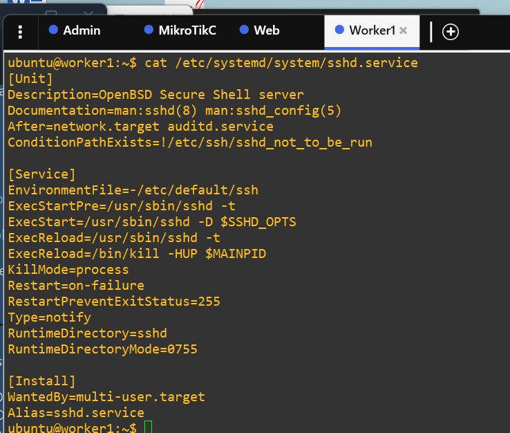

Figure 12. Status of ssh service inside **Worker** machine (2)

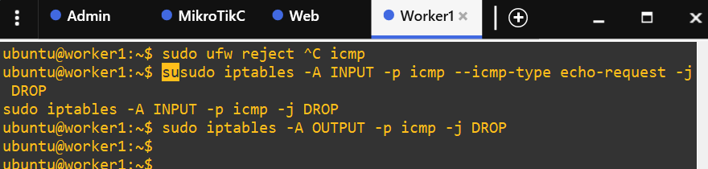

Figure 13. Blocking ICMP traffic on **Worker**

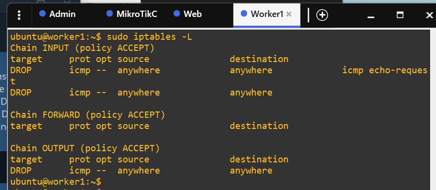

Figure 14. `IPTABLES` that show the results of new rules.

4.3. Scan it without extra arguments.

No open port were found, figure 15.

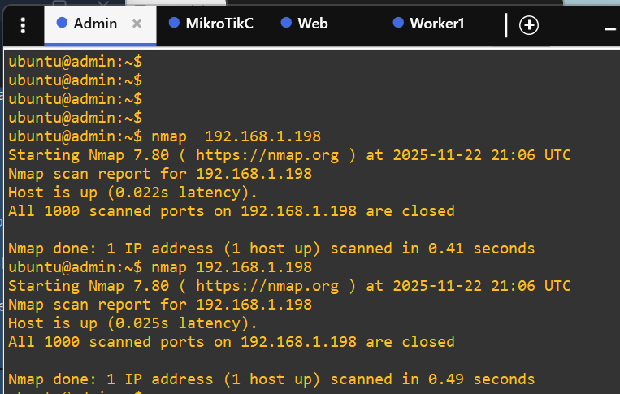

Figure 15. Scan of **Worker** from **Admin** without extras

4.4. Now make necessary changes to the command to force the scan on all possible ports, figure 16.

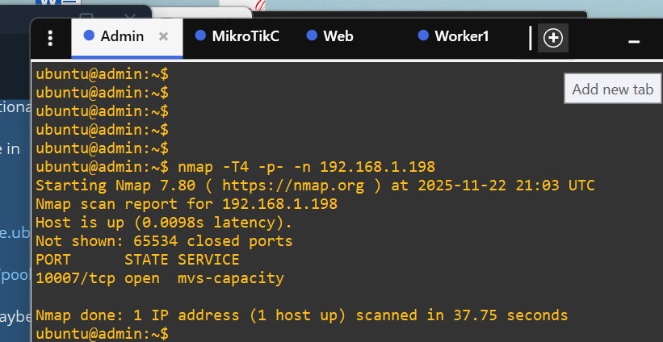

Figure 16. Scan of **Worker** from **Admin** with extra arguments.

4.5. Gather some information about your open ports on Web (ssh and http).
*Note. Don't paste the scan results, summarize them in the answer and include them as
an appendix of your submission in Moodle.*

Flags description:

| Flag | What it does (short) | Why you need it for the lab |
| --- | --- | --- |
| -A  |  Enable OS detection, version detection, script scanning, and traceroute
 |  |
| --min-rate | will increase port scan  |  |
| -sS | TCP SYN scan (stealth, fast) | Default best scan |
| -sV | Detect service + exact version (nginx 1.18.0, OpenSSH 8.9p1, etc.) | Shows real software |
| -sC | Run default script engine (http-title, ssh-hostkey, http-methods, banner grabbing…) | Grabs web page title, allowed HTTP methods, SSH keys |
| -O | OS detection (guesses Ubuntu 22.04, kernel version) | Shows OS fingerprint |
| -p 22,80 | Scan only these ports (or remove to scan all) | Focused on web + SSH |
| -v | Verbose – see what’s happening live | Good for screenshots |
| --reason | Explain why a port is open/filtered | Proof for lab report |
| --open | Show only open ports | Clean output |

### Task 2 - Traffic Captures

In some cases, you might need to take a look at the traffic sent and received from your machines
to understand what is going on. You will be sniffing the traffic of your External services. For this,
you can use Wireshark which has an integration with GNS3 or tcpdump from the machines.

1. Access your Web's http page from outside and capture the traffic between the gateway and
the bridged interface.
Can you see what is being sent?
What kind of information can you get from this?
What do the headers mean?

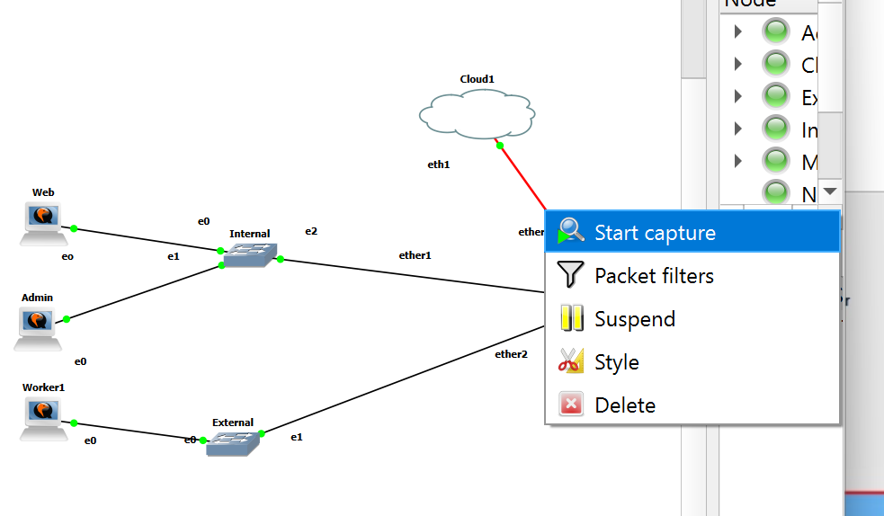

Figure 17. Starting `Wireshark` integration inside GNS3.

I started pinging [google.com](http://google.com) from Admin machine and immediately received packets in Wireshark.

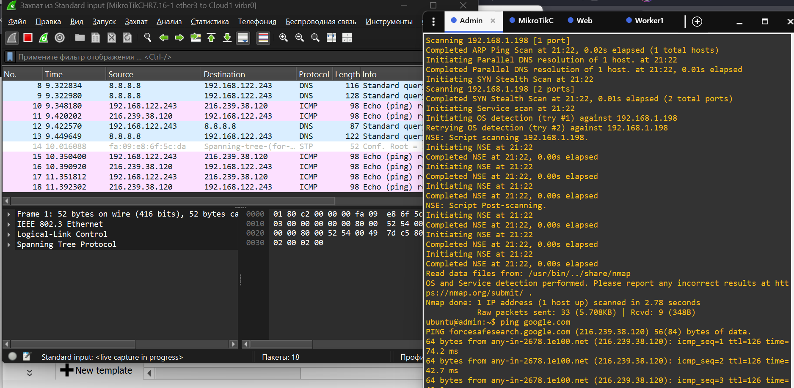

Figure 18. MNDP, CDP, LLDP, STP

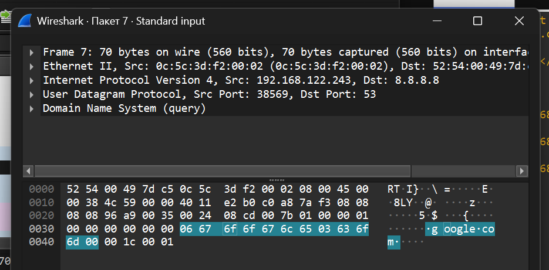

Figure 19. pinging content

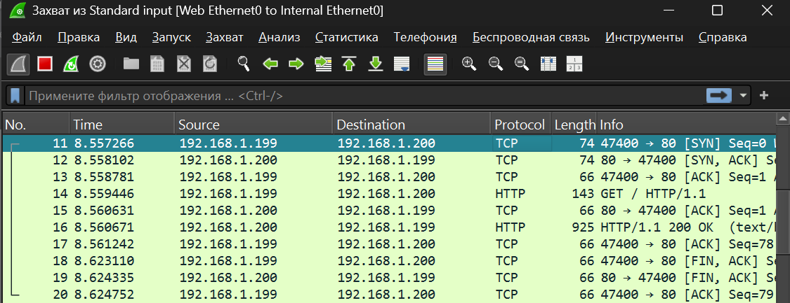

Figure 20. Content of accessing http web page.

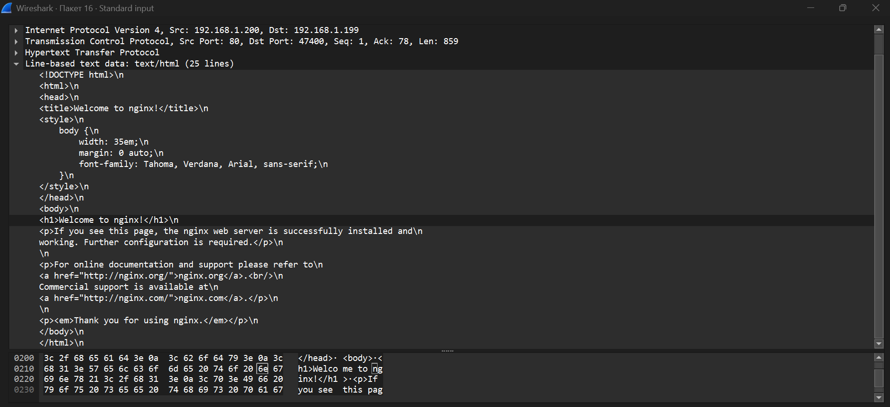

Figure 20. Content of accessing http web page (2)

We can clearly see (figures 18-20) that because HTTP has no encryption – every request and response is sent in plaintext, so any attacker on the path can read everything.

HTTP headers are metadata fields included in both requests and responses. They carry additional information:  user-agent (what browser/program is used), cookies (session data), accepted content types, etc.

Since everything is unencrypted, an attacker can read and modify all headers and the actual page content in transit.

1. SSH to the Admin from outside and capture the traffic (make sure to start capturing before
connecting to the server).
Can you see what is being sent?
What kind of information can you get from this?
What are the names of the ciphers used?

Mostly TCP packets are seen. Packets are encrypted, data (any plaintext) is not seen.

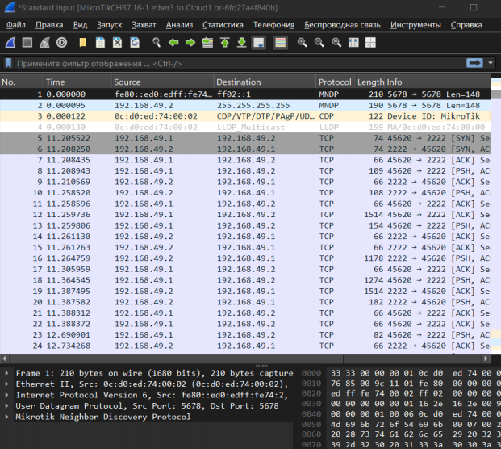

Figure 21. Content during ssh connection.

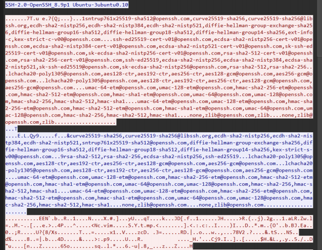

Figure 22. Capturing TCP flow whilst connected via ssh

Results of the capture, figure 22: algorithms are matched, SSH version exchange, supported enc. alghorithms.

1. Configure the Burp suite as a proxy on your machine and intercept your HTTP traffic.
Show that you can modify the contents by changing something in the request.
Why are you able to do this here and not in an SSH connection?

1 - configure nginx proxy on Ubuntu server for 8080th port.

2 - connect Web’s server using Burp

3 - see results (enjoy the capturing process)

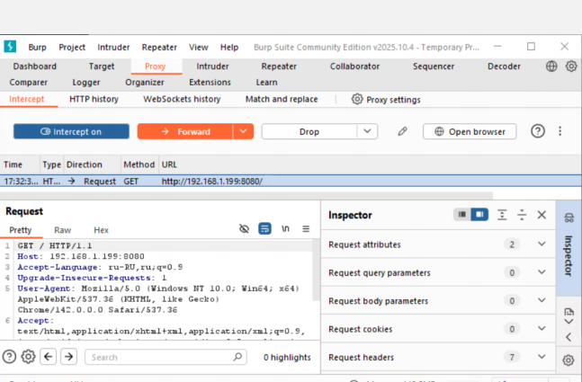

Figure 23. normal HTTP request inside Burp Suite

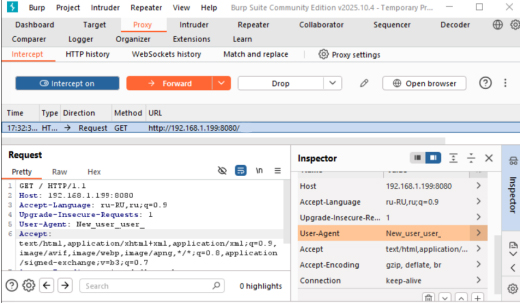

Figure 24. modified HTTP request inside Burp Suite

This request, figure 24, is modifiable because is not encrypted.

Burp Suite sits in the middle as a proxy, it catches that text before it reaches the server, lets me change whatever I want (headers, parameters, even the HTML), and then sends my modified version to the server.

BUT With SSH it’s impossible because everything is encrypted end-to-end; Burp only sees random gibberish and can’t touch the real data.

### Task 3 - IPv6

1. Configure IPv6 from the Web Server to the Worker. This includes IPs on the servers and the
default gateway.

`192.168.1.200` - web

`192.168.1.199` - admin

`192.168.1.198` - worker 1

`200` - is the number to change

Configuration on nodes (e.g. web node):

```bash
sudo ip -6 addr add 2001:db8:1::**200**/64 dev ens3
sudo ip -6 route add default via 2001:db8:1::1
```

Configuration on the router:

```bash
/ipv6 address add address=2001:db8:1::1/64 interface=LAN-Bridge advertise=yes
/ipv6 route add dst-address=::/0 gateway=fe80::1%ether3
/ipv6 firewall nat add chain=srcnat action=masquerade out-interface=ether3

/ipv6 firewall filter
add chain=input    action=accept connection-state=established,related
add chain=input    action=accept in-interface=LAN-Bridge
add chain=input    action=accept protocol=tcp dst-port=80 in-interface=LAN-Bridge
add chain=forward  action=accept connection-state=established,related
add chain=forward  action=accept in-interface=LAN-Bridge
add chain=forward  action=accept out-interface=LAN-Bridge
add chain=input    action=drop
add chain=forward  action=drop
```

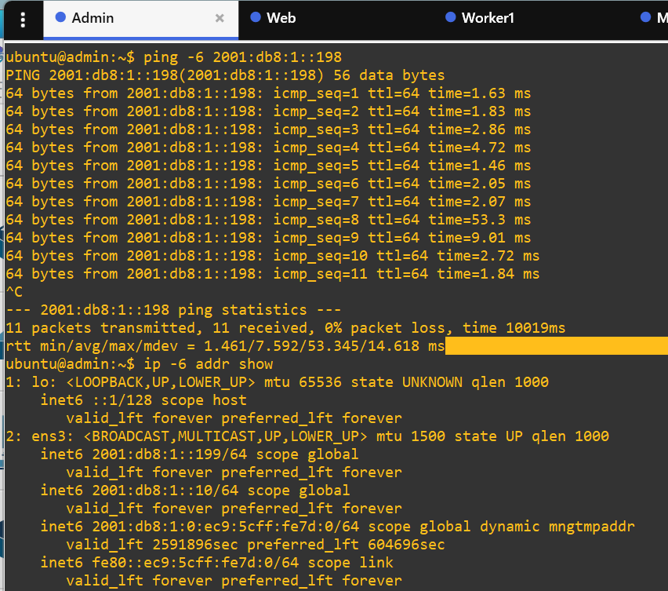

Figure 25. Pinging Web node from Admin node, also I show ip6 of Admin machine

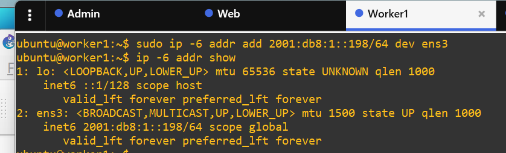

Figure 26. Configuring Web node’s ip6 and showing the results.

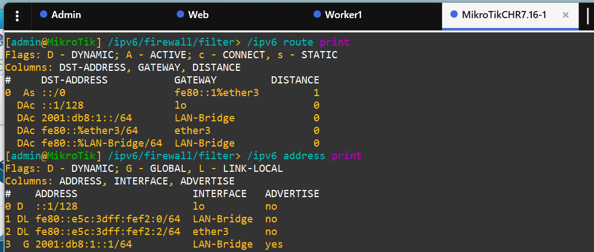

Figure 27. Configuration on MikroTik

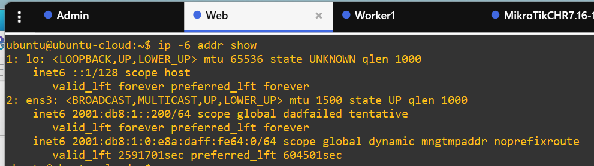

Figure 27. Configuration on Web node.

1. Access the Web's http page using IPv6 from Admin while capturing the traffic again. Can you
see the difference? What's the difference in packages? Explain.

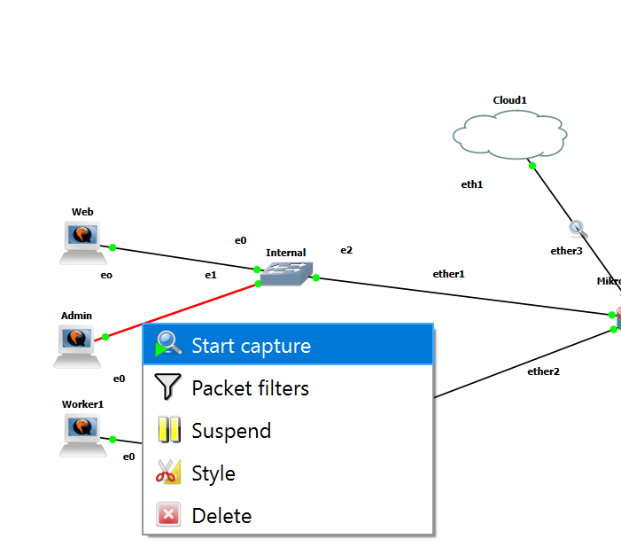

Figure 28. Topology for capturing traffic

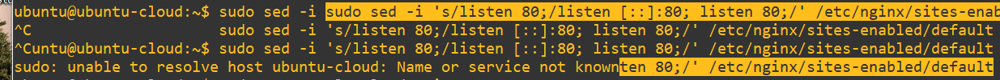


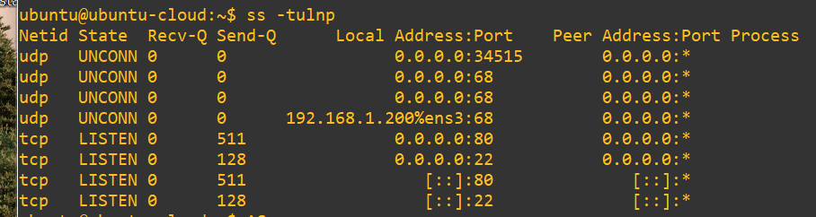

Figure 29. Configuring nginx to listen for ipv6 on Web node

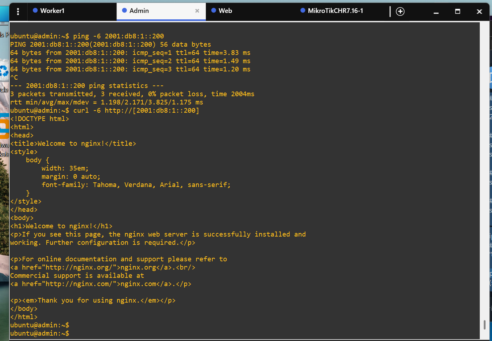

Figure 30. Accessing nginx server on Web from Admin

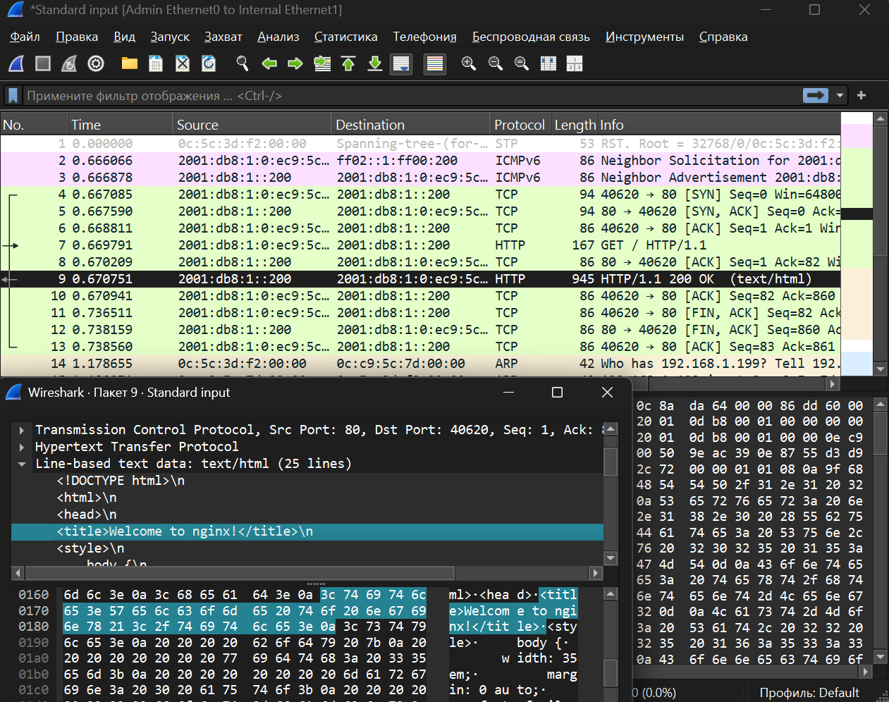

Figure 31. Captured packets HTTP

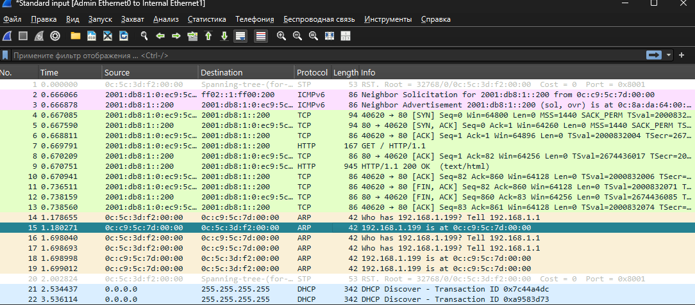

Figure 32. Acknowledgment packets (ICMPv6, ARP with ipv4 addresses, DHCP)

IPv4 and IPv6 differ mainly at the network layer. IPv4 uses a variable-sized header (20–60 bytes), while IPv6 always has a fixed 40-byte header.

The upper layers (TCP, HTTP) stay exactly the same, and instead of **ARP**, IPv6 uses ICMPv6 Neighbor Discovery (NDP) messages to find out which MAC address belongs to an IP.

1. Practice in IPv6 addresses compressing and decompressing. Write your used IPv6 addresses
both in full and compact mode. Provide the calculation chain.
Attach your IPv6 captures in a folder captures with your report.

Exemplary IPv6 addresses
Web server:      2001:db8:1::100/64
Worker node:    2001:db8:1::200/64
MikroTik LAN:   2001:db8:1::1/64

Compressed: 2001:db8:1::100

**Decompression step by step:**

1. Compressed form has 4 groups → need 8 groups → replace :: with four zero groups:
2001:db8:1:0000:0000:0000:0000:100
2. I pad every group to 4 digits with leading zeros:
2001:0db8:0001:0000:0000:0000:0000:0100
Full (uncompressed) address of Web server:
2001:0db8:0001:0000:0000:0000:0000:0100
Worker node (2001:db8:1::200)
Compressed: 2001:db8:1::200

**Decompression step by step:**

1. I replace :: with four zero groups:
2001:db8:1:0000:0000:0000:0000:200
2. Pad to 4 digits per group:
2001:0db8:0001:0000:0000:0000:0000:0200
Full (uncompressed) address of Worker:
2001:0db8:0001:0000:0000:0000:0000:0200
MikroTik LAN gateway (2001:db8:1::1)
Compressed: 2001:db8:1::1
Full: 2001:0db8:0001:0000:0000:0000:0000:0001

### Application / References

[1] Documentation for GNS3 : for installing gns3 on VM : <https://docs.gns3.com/docs/getting-started/installation/linux/>

[2] Official site of GNS3 : for installing distribution

[3] Official site of VMware and their provider : to install VMware Workstation

[4] GPT for assistance in practical part and explaining theory.

---

### Task 0 setup of topology

To configure topology I also increased system hardware: 2 processors and 4096MB memory.

At figure 0, I am configuring image for a virtual router. The default credentials: Username "`admin`" and an empty password, but I configured “`admin`” (”`ADMIN`”) as password.

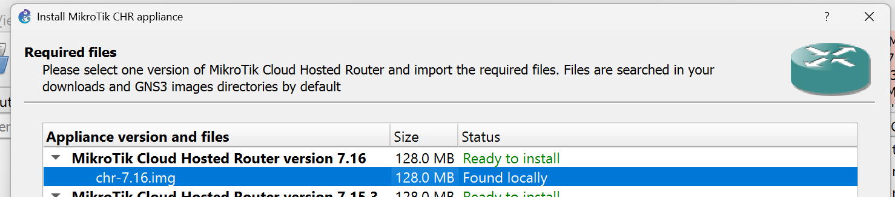

Figure 0. Installing virtual router by MikroTik

Running topology is present at figure 1. The default credentials: Username "`ubuntu`" and “`ubuntu`” password.

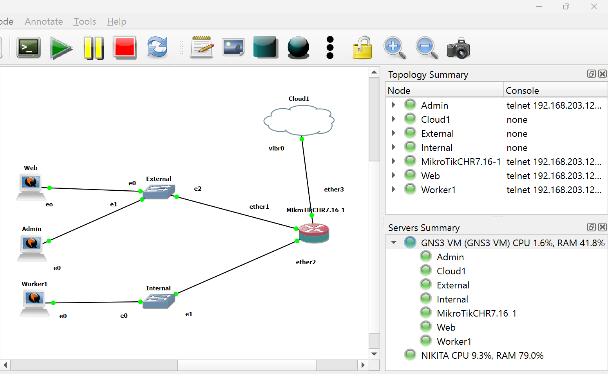

Figure 1. Network topology setup

192.168.122.1 - is for web

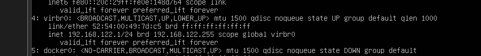

Figure 2. Network topology setup

Now I setup internet access for router and also setup IPs for my nodes inside 192.168.122.0 network:

`192.168.122.2` - web

`192.168.122.3` - admin

`192.168.122.4` - worker 1

`192.168.122.243/24` - router

Bellow figures show my ip addresses for machines:

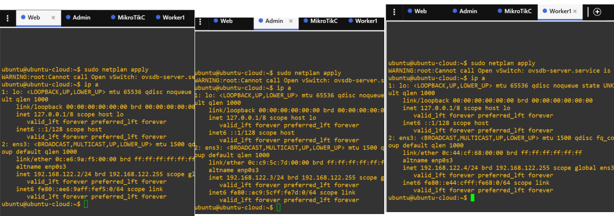

Figure 3. Network topology setup

eth3 is connects router to cloud, to prove i print interfaces. then I give the router IP of Cloud and check status, figure 4.5.

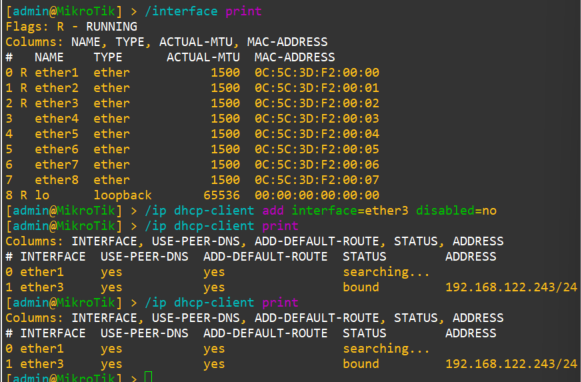

Figure 4. Configuration for virtual router to the internet

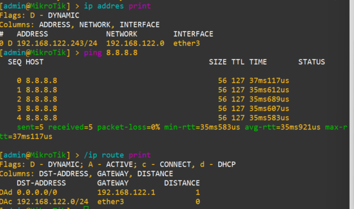

Figure 5. Status of connection to network

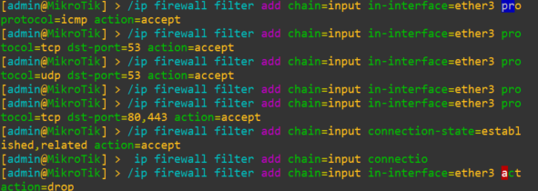

Figure 6. Setup firewall to allow dns and http(s): router is invisible while allowing outbound traffic

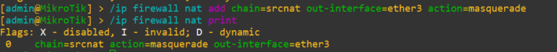

Figure 7. configuration to translate traffic from lan to wan

assign a LAN IPs on the router

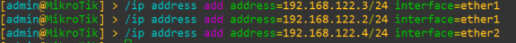

> my prompt of topology
>
> I use gns3. I have GNS3VM. I have created visually topology, now I need to configure 3 nodes and a router that nodes will have internet access and connectivity. Also my router on mikrotez connects via ether3 to vibr0 of cloud element
>
> web e0    ─────┐
> admin e0  ─────┤          ┌─────────────┐
> ├── Switch1 ┤e2 ─── ether1 on MikroTik
> worker e0 ─────┤          └─────────────┘
> └── Switch2 e1 ─── ether2 on MikroTik

### Commands to setup mikrotex

```bash
# Reset configuration if you want to start clean (no defaults)
/system reset-configuration no-defaults=yes

# === Interfaces ===
/interface bridge
add name=LAN-Bridge

# Add both internal ports to the bridge (L2 transparency, like a real switch)
/interface bridge port
add bridge=LAN-Bridge interface=ether1
add bridge=LAN-Bridge interface=ether2

# === IP on the bridge (this will be the gateway for the PCs) ===
/ip address
add address=192.168.1.1/24 interface=LAN-Bridge

# === DHCP Server so the nodes get IP automatically (easiest) ===
/ip pool
add name=dhcp_pool ranges=192.168.1.100-192.168.1.200

/ip dhcp-server
add name=dhcp1 interface=LAN-Bridge address-pool=dhcp_pool lease-time=1d

/ip dhcp-server network
add address=192.168.1.0/24 gateway=192.168.1.1 dns-server=8.8.8.8,1.1.1.1

# === NAT (masquerade) so the PCs reach Internet ===
/ip firewall nat
add chain=srcnat action=masquerade out-interface=ether3 ipsec-policy=out,none

# === Get IP on ether3 automatically from your real network (or set static) ===
# Most common: DHCP client on ether3
/ip dhcp-client
add interface=ether3 add-default-route=yes

# (If you prefer static)
/ip address add address=10.10.10.50/24 interface=ether3   # example
/ip route add gateway=10.10.10.1

# === DNS (optional, but nice) ===
/ip dns set servers=8.8.8.8,1.1.1.1 allow-remote-requests=yes
```

### resolving issue with bad internet connection

**mikrotex**

```bash
/interface print
/interface bridge port print
/ip address print
/ip dhcp-server lease print detail
/ip dhcp-server network print
/ip route print
/ip firewall nat print
/ip firewall filter print
/ip firewall mangle print
/ip dhcp-client print
tool/sniffer/quick interface=ether3
```

nodes

```bash
sudo cat /etc/netplan/50-cloud-init.yaml
ip link
ip addr
ip route
cat /etc/resolv.conf
ping -c 20 192.168.1.1
ping -c 20 8.8.8.8
traceroute -n 8.8.8.8
cat /etc/netplan/*.yaml 2>/dev/null || cat /etc/cloud/cloud.cfg.d/*.cfg 2>/dev/null || echo "no netplan/cloud-init files"
sudo dmesg | tail -20
cat /etc/netstat/50-
```

### current situation on elements

### worker

```bash
sudo cat /etc/netplan/50-cloud-init.yaml

# This file is generated from information provided by the datasource.  Changes
# to it will not persist across an instance reboot.  To disable cloud-init's
# network configuration capabilities, write a file
# /etc/cloud/cloud.cfg.d/99-disable-network-config.cfg with the following:
# network: {config: disabled}
# /etc/netplan/50-cloud-init.yaml
network:
  version: 2
  renderer: networkd
  ethernets:
    ens3:
      dhcp4: yes
      addresses:
        - 192.168.122.4/24
      routes:
        - to: default
          via: 192.168.122.243
      nameservers:
        addresses: [1.1.1.1, 8.8.8.8]
      match:
        macaddress: 0c:44:cf:68:00:00
      set-name: ens3

ubuntu@ubuntu-cloud:~$
ip link
ip addr
ip route
cat /etc/resolv.conf
1: lo: <LOOPBACK,UP,LOWER_UP> mtu 65536 qdisc noqueue state UNKNOWN mode DEFAULT group default qlen 1000
    link/loopback 00:00:00:00:00:00 brd 00:00:00:00:00:00
2: ens3: <BROADCAST,MULTICAST,UP,LOWER_UP> mtu 1500 qdisc fq_codel state UP mode DEFAULT group default qlen 1000
    link/ether 0c:44:cf:68:00:00 brd ff:ff:ff:ff:ff:ff
    altname enp0s3
1: lo: <LOOPBACK,UP,LOWER_UP> mtu 65536 qdisc noqueue state UNKNOWN group default qlen 1000
    link/loopback 00:00:00:00:00:00 brd 00:00:00:00:00:00
    inet 127.0.0.1/8 scope host lo
       valid_lft forever preferred_lft forever
    inet6 ::1/128 scope host
       valid_lft forever preferred_lft forever
2: ens3: <BROADCAST,MULTICAST,UP,LOWER_UP> mtu 1500 qdisc fq_codel state UP group default qlen 1000
    link/ether 0c:44:cf:68:00:00 brd ff:ff:ff:ff:ff:ff
    altname enp0s3
    inet 192.168.122.4/24 brd 192.168.122.255 scope global ens3
       valid_lft forever preferred_lft forever
    inet 192.168.1.200/24 metric 100 brd 192.168.1.255 scope global dynamic ens3
       valid_lft 85576sec preferred_lft 85576sec
    inet6 fe80::e44:cfff:fe68:0/64 scope link
       valid_lft forever preferred_lft forever
default via 192.168.122.243 dev ens3 proto static
default via 192.168.1.1 dev ens3 proto dhcp src 192.168.1.200 metric 100
1.1.1.1 via 192.168.1.1 dev ens3 proto dhcp src 192.168.1.200 metric 100
8.8.8.8 via 192.168.1.1 dev ens3 proto dhcp src 192.168.1.200 metric 100
192.168.1.0/24 dev ens3 proto kernel scope link src 192.168.1.200 metric 100
192.168.1.1 dev ens3 proto dhcp scope link src 192.168.1.200 metric 100
192.168.122.0/24 dev ens3 proto kernel scope link src 192.168.122.4
nameserver 127.0.0.53
nameserver 197.168.1.0
nameserver 1.1.1.1
nameserver 8.8.8.8
options edns0 trust-ad
ubuntu@ubuntu-cloud:~$ ping -c 20 192.168.1.1
PING 192.168.1.1 (192.168.1.1) 56(84) bytes of data.
64 bytes from 192.168.1.1: icmp_seq=1 ttl=64 time=1.99 ms
64 bytes from 192.168.1.1: icmp_seq=2 ttl=64 time=1.16 ms
64 bytes from 192.168.1.1: icmp_seq=3 ttl=64 time=0.805 ms
^C
--- 192.168.1.1 ping statistics ---
3 packets transmitted, 3 received, 0% packet loss, time 2005ms
rtt min/avg/max/mdev = 0.805/1.318/1.987/0.494 ms
ubuntu@ubuntu-cloud:~$ ping -c 20 8.8.8.8
PING 8.8.8.8 (8.8.8.8) 56(84) bytes of data.
64 bytes from 8.8.8.8: icmp_seq=1 ttl=126 time=93.6 ms
64 bytes from 8.8.8.8: icmp_seq=2 ttl=126 time=86.8 ms
64 bytes from 8.8.8.8: icmp_seq=3 ttl=126 time=124 ms
64 bytes from 8.8.8.8: icmp_seq=4 ttl=126 time=39.9 ms
64 bytes from 8.8.8.8: icmp_seq=5 ttl=126 time=50.8 ms
64 bytes from 8.8.8.8: icmp_seq=6 ttl=126 time=52.0 ms
64 bytes from 8.8.8.8: icmp_seq=7 ttl=126 time=43.1 ms
64 bytes from 8.8.8.8: icmp_seq=8 ttl=126 time=48.0 ms
64 bytes from 8.8.8.8: icmp_seq=9 ttl=126 time=55.1 ms
64 bytes from 8.8.8.8: icmp_seq=10 ttl=126 time=62.1 ms
64 bytes from 8.8.8.8: icmp_seq=11 ttl=126 time=80.4 ms
64 bytes from 8.8.8.8: icmp_seq=12 ttl=126 time=85.7 ms
64 bytes from 8.8.8.8: icmp_seq=13 ttl=126 time=136 ms
64 bytes from 8.8.8.8: icmp_seq=14 ttl=126 time=54.6 ms
64 bytes from 8.8.8.8: icmp_seq=15 ttl=126 time=61.7 ms
^C
--- 8.8.8.8 ping statistics ---
15 packets transmitted, 15 received, 0% packet loss, time 14041ms
rtt min/avg/max/mdev = 39.896/71.587/135.647/28.069 ms
ubuntu@ubuntu-cloud:~$ traceroute -n 8.8.8.8
traceroute: command not found
ubuntu@ubuntu-cloud:~$ sudo traceroute -n 8.8.8.8
sudo: traceroute: command not found
ubuntu@ubuntu-cloud:~$ ping -c 10 google.com
PING forcesafesearch.google.com (216.239.38.120) 56(84) bytes of data.
From ubuntu-cloud (192.168.122.4) icmp_seq=1 Destination Host Unreachable
From ubuntu-cloud (192.168.122.4) icmp_seq=2 Destination Host Unreachable
From ubuntu-cloud (192.168.122.4) icmp_seq=3 Destination Host Unreachable
From ubuntu-cloud (192.168.122.4) icmp_seq=4 Destination Host Unreachable
From ubuntu-cloud (192.168.122.4) icmp_seq=5 Destination Host Unreachable
From ubuntu-cloud (192.168.122.4) icmp_seq=6 Destination Host Unreachable
From ubuntu-cloud (192.168.122.4) icmp_seq=7 Destination Host Unreachable
From ubuntu-cloud (192.168.122.4) icmp_seq=8 Destination Host Unreachable
From ubuntu-cloud (192.168.122.4) icmp_seq=9 Destination Host Unreachable
From ubuntu-cloud (192.168.122.4) icmp_seq=10 Destination Host Unreachable

--- forcesafesearch.google.com ping statistics ---
10 packets transmitted, 0 received, +10 errors, 100% packet loss, time 9847ms
pipe 3                 cat /etc/netplan/*.yaml 2>/dev/null || cat /etc/cloud/cloud.cfg.d/*.cfg 2>/dev/null || echo "no"
## This yaml formatted config file handles settingdev/null || cat /etc/cloud/cloud.cfg.d/*.cfg 2>/dev/null || echo "no"
## logger information.  The values that are necessary to be set
## are seen at the bottom.  The top '_log' are only used to remove
## redundancy in a syslog and fallback-to-file case.
##
## The 'log_cfgs' entry defines a list of logger configs
## Each entry in the list is tried, and the first one that
## works is used.  If a log_cfg list entry is an array, it will
## be joined with '\n'.
_log:
 - &log_base |
   [loggers]
   keys=root,cloudinit

   [handlers]
   keys=consoleHandler,cloudLogHandler

   [formatters]
   keys=simpleFormatter,arg0Formatter

   [logger_root]
   level=DEBUG
   handlers=consoleHandler,cloudLogHandler

   [logger_cloudinit]
   level=DEBUG
   qualname=cloudinit
   handlers=
   propagate=1

   [handler_consoleHandler]
   class=StreamHandler
   level=WARNING
   formatter=arg0Formatter
   args=(sys.stderr,)

   [formatter_arg0Formatter]
   format=%(asctime)s - %(filename)s[%(levelname)s]: %(message)s

   [formatter_simpleFormatter]
   format=[CLOUDINIT] %(filename)s[%(levelname)s]: %(message)s
 - &log_file |
   [handler_cloudLogHandler]
   class=FileHandler
   level=DEBUG
   formatter=arg0Formatter
   args=('/var/log/cloud-init.log', 'a', 'UTF-8')
 - &log_syslog |
   [handler_cloudLogHandler]
   class=handlers.SysLogHandler
   level=DEBUG
   formatter=simpleFormatter
   args=("/dev/log", handlers.SysLogHandler.LOG_USER)

log_cfgs:
# Array entries in this list will be joined into a string
# that defines the configuration.
#
# If you want logs to go to syslog, uncomment the following line.
# - [ *log_base, *log_syslog ]
#
# The default behavior is to just log to a file.
# This mechanism that does not depend on a system service to operate.
 - [ *log_base, *log_file ]
# A file path can also be used.
# - /etc/log.conf

# This tells cloud-init to redirect its stdout and stderr to
# 'tee -a /var/log/cloud-init-output.log' so the user can see output
# there without needing to look on the console.
output: {all: '| tee -a /var/log/cloud-init-output.log'}
# to update this file, run dpkg-reconfigure cloud-init
datasource_list: [ NoCl^C
ubuntu@ubuntu-cloud:~$ dmesg | tail -20
dmesg: read kernel buffer failed: Operation not permitted
ubuntu@ubuntu-cloud:~$ sudo dmesg | tail -20
[   26.728526] blk_update_request: I/O error, dev fd0, sector 0 op 0x0:(READ) flags 0x80700 phys_seg 1 prio class 0
[   26.778188] floppy0: disk absent or changed during operation
[   26.778192] blk_update_request: I/O error, dev fd0, sector 0 op 0x0:(READ) flags 0x0 phys_seg 1 prio class 0
[   26.802783] Buffer I/O error on dev fd0, logical block 0, async page read
[   26.856560] floppy0: disk absent or changed during operation
[   26.856566] blk_update_request: I/O error, dev fd0, sector 0 op 0x0:(READ) flags 0x80700 phys_seg 1 prio class 0
[   26.892170] floppy0: disk absent or changed during operation
[   26.892173] blk_update_request: I/O error, dev fd0, sector 0 op 0x0:(READ) flags 0x0 phys_seg 1 prio class 0
[   26.931231] Buffer I/O error on dev fd0, logical block 0, async page read
[   26.970592] floppy0: disk absent or changed during operation
[   26.970596] blk_update_request: I/O error, dev fd0, sector 0 op 0x0:(READ) flags 0x80700 phys_seg 1 prio class 0
[   27.005716] floppy0: disk absent or changed during operation
[   27.005720] blk_update_request: I/O error, dev fd0, sector 0 op 0x0:(READ) flags 0x0 phys_seg 1 prio class 0
[   27.040732] Buffer I/O error on dev fd0, logical block 0, async page read
[   27.185786] ISO 9660 Extensions: Microsoft Joliet Level 3
[   27.212290] ISO 9660 Extensions: RRIP_1991A
[   35.382537] loop3: detected capacity change from 0 to 8
[   35.790065] kauditd_printk_skb: 29 callbacks suppressed
[   35.790067] audit: type=1400 audit(1763725608.092:41): apparmor="STATUS" operation="profile_replace" profile="uncon"
[   35.791347] audit: type=1400 audit(1763725608.096:42): apparmor="STATUS" operation="profile_replace" profile="uncon"
ubuntu@ubuntu-cloud:~$
```

### admin

```bash
Last login: Thu Nov 20 18:49:26 UTC 2025 on ttyS0
ubuntu@ubuntu-cloud:~$ ip link
ip addr
ip route
cat /etc/resolv.conf
1: lo: <LOOPBACK,UP,LOWER_UP> mtu 65536 qdisc noqueue state UNKNOWN mode DEFAULT group default qlen 1000
    link/loopback 00:00:00:00:00:00 brd 00:00:00:00:00:00
2: ens3: <BROADCAST,MULTICAST,UP,LOWER_UP> mtu 1500 qdisc fq_codel state UP mode DEFAULT group default qlen 1000
    link/ether 0c:c9:5c:7d:00:00 brd ff:ff:ff:ff:ff:ff
    altname enp0s3
1: lo: <LOOPBACK,UP,LOWER_UP> mtu 65536 qdisc noqueue state UNKNOWN group default qlen 1000
    link/loopback 00:00:00:00:00:00 brd 00:00:00:00:00:00
    inet 127.0.0.1/8 scope host lo
       valid_lft forever preferred_lft forever
    inet6 ::1/128 scope host
       valid_lft forever preferred_lft forever
2: ens3: <BROADCAST,MULTICAST,UP,LOWER_UP> mtu 1500 qdisc fq_codel state UP group default qlen 1000
    link/ether 0c:c9:5c:7d:00:00 brd ff:ff:ff:ff:ff:ff
    altname enp0s3
    inet 192.168.122.3/24 brd 192.168.122.255 scope global ens3
       valid_lft forever preferred_lft forever
    inet 192.168.1.198/24 metric 100 brd 192.168.1.255 scope global dynamic ens3
       valid_lft 85378sec preferred_lft 85378sec
    inet6 fe80::ec9:5cff:fe7d:0/64 scope link
       valid_lft forever preferred_lft forever
default via 192.168.122.243 dev ens3 proto static
default via 192.168.1.1 dev ens3 proto dhcp src 192.168.1.198 metric 100
1.1.1.1 via 192.168.1.1 dev ens3 proto dhcp src 192.168.1.198 metric 100
8.8.8.8 via 192.168.1.1 dev ens3 proto dhcp src 192.168.1.198 metric 100
192.168.1.0/24 dev ens3 proto kernel scope link src 192.168.1.198 metric 100
192.168.1.1 dev ens3 proto dhcp scope link src 192.168.1.198 metric 100
192.168.122.0/24 dev ens3 proto kernel scope link src 192.168.122.3
# This is /run/systemd/resolve/stub-resolv.conf managed by man:systemd-resolved(8).
# Do not edit.
#
# This file might be symlinked as /etc/resolv.conf. If you're looking at
# /etc/resolv.conf and seeing this text, you have followed the symlink.
#
# This is a dynamic resolv.conf file for connecting local clients to the
# internal DNS stub resolver of systemd-resolved. This file lists all
# configured search domains.
#
# Run "resolvectl status" to see details about the uplink DNS servers
# currently in use.
#
# Third party programs should typically not access this file directly, but only
# through the symlink at /etc/resolv.conf. To manage man:resolv.conf(5) in a
# different way, replace this symlink by a static file or a different symlink.
#
# See man:systemd-resolved.service(8) for details about the supported modes of
# operation for /etc/resolv.conf.

nameserver 127.0.0.53
options edns0 trust-ad
search .
ubuntu@ubuntu-cloud:~$ ping -c 20 192.168.1.1
PING 192.168.1.1 (192.168.1.1) 56(84) bytes of data.
64 bytes from 192.168.1.1: icmp_seq=1 ttl=64 time=1.88 ms
64 bytes from 192.168.1.1: icmp_seq=2 ttl=64 time=0.997 ms
64 bytes from 192.168.1.1: icmp_seq=3 ttl=64 time=1.65 ms
64 bytes from 192.168.1.1: icmp_seq=4 ttl=64 time=0.880 ms
64 bytes from 192.168.1.1: icmp_seq=5 ttl=64 time=0.947 ms
64 bytes from 192.168.1.1: icmp_seq=6 ttl=64 time=0.920 ms
^C
--- 192.168.1.1 ping statistics ---
6 packets transmitted, 6 received, 0% packet loss, time 5008ms
rtt min/avg/max/mdev = 0.880/1.212/1.877/0.397 ms
ubuntu@ubuntu-cloud:~$ ping -c 20 8.8.8.8
PING 8.8.8.8 (8.8.8.8) 56(84) bytes of data.
64 bytes from 8.8.8.8: icmp_seq=1 ttl=126 time=61.0 ms
64 bytes from 8.8.8.8: icmp_seq=2 ttl=126 time=212 ms
64 bytes from 8.8.8.8: icmp_seq=3 ttl=126 time=695 ms
64 bytes from 8.8.8.8: icmp_seq=4 ttl=126 time=38.6 ms
64 bytes from 8.8.8.8: icmp_seq=5 ttl=126 time=38.5 ms
64 bytes from 8.8.8.8: icmp_seq=6 ttl=126 time=44.2 ms
64 bytes from 8.8.8.8: icmp_seq=7 ttl=126 time=53.2 ms
64 bytes from 8.8.8.8: icmp_seq=8 ttl=126 time=38.8 ms
64 bytes from 8.8.8.8: icmp_seq=9 ttl=126 time=40.0 ms
^C
--- 8.8.8.8 ping statistics ---
9 packets transmitted, 9 received, 0% packet loss, time 8014ms
rtt min/avg/max/mdev = 38.518/135.682/694.514/204.479 ms
ubuntu@ubuntu-cloud:~$ ping -c 20 google.com
PING forcesafesearch.google.com (216.239.38.120) 56(84) bytes of data.
From ubuntu-cloud (192.168.122.3) icmp_seq=1 Destination Host Unreachable
From ubuntu-cloud (192.168.122.3) icmp_seq=2 Destination Host Unreachable
From ubuntu-cloud (192.168.122.3) icmp_seq=3 Destination Host Unreachable
From ubuntu-cloud (192.168.122.3) icmp_seq=4 Destination Host Unreachable
From ubuntu-cloud (192.168.122.3) icmp_seq=5 Destination Host Unreachable
From ubuntu-cloud (192.168.122.3) icmp_seq=6 Destination Host Unreachable
^C
--- forcesafesearch.google.com ping statistics ---
6 packets transmitted, 0 received, +6 errors, 100% packet loss, time 5067ms
pipe 3                 cat /etc/netplan/*.yaml 2>/dev/null || cat /etc/cloud/cloud.cfg.d/*.cfg 2>/dev/null || echo "no"
## This yaml formatted config file handles settingdev/null || cat /etc/cloud/cloud.cfg.d/*.cfg 2>/dev/null || echo "no"
## logger information.  The values that are necessary to be set
## are seen at the bottom.  The top '_log' are only used to remove
## redundancy in a syslog and fallback-to-file case.
##
## The 'log_cfgs' entry defines a list of logger configs
## Each entry in the list is tried, and the first one that
## works is used.  If a log_cfg list entry is an array, it will
## be joined with '\n'.
_log:
 - &log_base |
   [loggers]
   keys=root,cloudinit

   [handlers]
   keys=consoleHandler,cloudLogHandler

   [formatters]
   keys=simpleFormatter,arg0Formatter

   [logger_root]
   level=DEBUG
   handlers=consoleHandler,cloudLogHandler

   [logger_cloudinit]
   level=DEBUG
   qualname=cloudinit
   handlers=
   propagate=1

   [handler_consoleHandler]
   class=StreamHandler
   level=WARNING
   formatter=arg0Formatter
   args=(sys.stderr,)

   [formatter_arg0Formatter]
   format=%(asctime)s - %(filename)s[%(levelname)s]: %(message)s

   [formatter_simpleFormatter]
   format=[CLOUDINIT] %(filename)s[%(levelname)s]: %(message)s
 - &log_file |
   [handler_cloudLogHandler]
   class=FileHandler
   level=DEBUG
   formatter=arg0Formatter
   args=('/var/log/cloud-init.log', 'a', 'UTF-8')
 - &log_syslog |
   [handler_cloudLogHandler]
   class=handlers.SysLogHandler
   level=DEBUG
   formatter=simpleFormatter
   args=("/dev/log", handlers.SysLogHandler.LOG_USER)

log_cfgs:
# Array entries in this list will be joined into a string
# that defines the configuration.
#
# If you want logs to go to syslog, uncomment the following line.
# - [ *log_base, *log_syslog ]
#
# The default behavior is to just log to a file.
# This mechanism that does not depend on a system service to operate.
 - [ *log_base, *log_file ]
# A file path can also be used.
# - /etc/log.conf

# This tells cloud-init to redirect its stdout and stderr to
# 'tee -a /var/log/cloud-init-output.log' so the user can see output
# there without needing to look on the console.
output: {all: '| tee -a /var/log/cloud-init-output.log'}
# to update this file, run dpkg-reconfigure cloud-init
datasource_list: [ NoCloud, ConfigDrive, OpenNebula, DigitalOcean, Azure, AltCloud, OVF, MAAS, GCE, OpenStack, CloudSi]
ubuntu@ubuntu-cloud:~$ sudo dmesg | tail -20
[   27.202912] blk_update_request: I/O error, dev fd0, sector 0 op 0x0:(READ) flags 0x80700 phys_seg 1 prio class 0
[   27.233876] floppy0: disk absent or changed during operation
[   27.233878] blk_update_request: I/O error, dev fd0, sector 0 op 0x0:(READ) flags 0x0 phys_seg 1 prio class 0
[   27.262498] Buffer I/O error on dev fd0, logical block 0, async page read
[   27.288448] floppy0: disk absent or changed during operation
[   27.288453] blk_update_request: I/O error, dev fd0, sector 0 op 0x0:(READ) flags 0x80700 phys_seg 1 prio class 0
[   27.328092] floppy0: disk absent or changed during operation
[   27.328095] blk_update_request: I/O error, dev fd0, sector 0 op 0x0:(READ) flags 0x0 phys_seg 1 prio class 0
[   27.367984] Buffer I/O error on dev fd0, logical block 0, async page read
[   27.400172] floppy0: disk absent or changed during operation
[   27.400176] blk_update_request: I/O error, dev fd0, sector 0 op 0x0:(READ) flags 0x80700 phys_seg 1 prio class 0
[   27.439377] floppy0: disk absent or changed during operation
[   27.439380] blk_update_request: I/O error, dev fd0, sector 0 op 0x0:(READ) flags 0x0 phys_seg 1 prio class 0
[   27.477194] Buffer I/O error on dev fd0, logical block 0, async page read
[   27.623525] ISO 9660 Extensions: Microsoft Joliet Level 3
[   27.627319] ISO 9660 Extensions: RRIP_1991A
[   33.155984] loop3: detected capacity change from 0 to 8
[   33.865385] kauditd_printk_skb: 29 callbacks suppressed
[   33.865387] audit: type=1400 audit(1763725606.348:41): apparmor="STATUS" operation="profile_replace" profile="uncon"
[   33.867598] audit: type=1400 audit(1763725606.352:42): apparmor="STATUS" operation="profile_replace" profile="uncon"
ubuntu@ubuntu-cloud:~$ cat /etc/netplan/50-cloud-init.yaml
cat: /etc/netplan/50-cloud-init.yaml: Permission denied
ubuntu@ubuntu-cloud:~$ sudo cat /etc/netplan/50-cloud-init.yaml
# This file is generated from information provided by the datasource.  Changes
# to it will not persist across an instance reboot.  To disable cloud-init's
# network configuration capabilities, write a file
# /etc/cloud/cloud.cfg.d/99-disable-network-config.cfg with the following:
# network: {config: disabled}
# /etc/netplan/50-cloud-init.yaml
network:
  version: 2
  renderer: networkd
  ethernets:
    ens3:
      dhcp4: yes
      addresses:
        - 192.168.122.3/24
      routes:
        - to: default
          via: 192.168.122.243
      nameservers:
        addresses: [1.1.1.1, 8.8.8.8]
      match:
        macaddress: 0c:c9:5c:7d:00:00
      set-name: ens3
ubuntu@ubuntu-cloud:~$ ^C
```

### web

```bash
ubuntu@ubuntu-cloud:~$ sudo cat /etc/netplan/50-cloud-init.yaml
# This file is generated from information provided by the datasource.  Changes
# to it will not persist across an instance reboot.  To disable cloud-init's
# network configuration capabilities, write a file
# /etc/cloud/cloud.cfg.d/99-disable-network-config.cfg with the following:
# network: {config: disabled}
# /etc/netplan/50-cloud-init.yaml
network:
  version: 2
  renderer: networkd
  ethernets:
    ens3:
      dhcp4: yes
      addresses:
        - 192.168.122.2/24
      routes:
        - to: default
          via: 192.168.122.243
      nameservers:
        addresses: [1.1.1.1, 8.8.8.8]
      match:
        macaddress: 0c:e6:9a:f5:00:00
      set-name: ens3

ubuntu@ubuntu-cloud:~$ ip link
ip addr
ip route
cat /etc/resolv.conf
1: lo: <LOOPBACK,UP,LOWER_UP> mtu 65536 qdisc noqueue state UNKNOWN mode DEFAULT group default qlen 1000
    link/loopback 00:00:00:00:00:00 brd 00:00:00:00:00:00
2: ens3: <BROADCAST,MULTICAST,UP,LOWER_UP> mtu 1500 qdisc fq_codel state UP mode DEFAULT group default qlen 1000
    link/ether 0c:e6:9a:f5:00:00 brd ff:ff:ff:ff:ff:ff
    altname enp0s3
1: lo: <LOOPBACK,UP,LOWER_UP> mtu 65536 qdisc noqueue state UNKNOWN group default qlen 1000
    link/loopback 00:00:00:00:00:00 brd 00:00:00:00:00:00
    inet 127.0.0.1/8 scope host lo
       valid_lft forever preferred_lft forever
    inet6 ::1/128 scope host
       valid_lft forever preferred_lft forever
2: ens3: <BROADCAST,MULTICAST,UP,LOWER_UP> mtu 1500 qdisc fq_codel state UP group default qlen 1000
    link/ether 0c:e6:9a:f5:00:00 brd ff:ff:ff:ff:ff:ff
    altname enp0s3
    inet 192.168.122.2/24 brd 192.168.122.255 scope global ens3
       valid_lft forever preferred_lft forever
    inet 192.168.1.197/24 metric 100 brd 192.168.1.255 scope global dynamic ens3
       valid_lft 85744sec preferred_lft 85744sec
    inet6 fe80::ee6:9aff:fef5:0/64 scope link
       valid_lft forever preferred_lft forever
default via 192.168.122.243 dev ens3 proto static
default via 192.168.1.1 dev ens3 proto dhcp src 192.168.1.197 metric 100
1.1.1.1 via 192.168.1.1 dev ens3 proto dhcp src 192.168.1.197 metric 100
8.8.8.8 via 192.168.1.1 dev ens3 proto dhcp src 192.168.1.197 metric 100
192.168.1.0/24 dev ens3 proto kernel scope link src 192.168.1.197 metric 100
192.168.1.1 dev ens3 proto dhcp scope link src 192.168.1.197 metric 100
192.168.122.0/24 dev ens3 proto kernel scope link src 192.168.122.2
# This is /run/systemd/resolve/stub-resolv.conf managed by man:systemd-resolved(8).
# Do not edit.
#
# This file might be symlinked as /etc/resolv.conf. If you're looking at
# /etc/resolv.conf and seeing this text, you have followed the symlink.
#
# This is a dynamic resolv.conf file for connecting local clients to the
# internal DNS stub resolver of systemd-resolved. This file lists all
# configured search domains.
#
# Run "resolvectl status" to see details about the uplink DNS servers
# currently in use.
#
# Third party programs should typically not access this file directly, but only
# through the symlink at /etc/resolv.conf. To manage man:resolv.conf(5) in a
# different way, replace this symlink by a static file or a different symlink.
#
# See man:systemd-resolved.service(8) for details about the supported modes of
# operation for /etc/resolv.conf.

nameserver 127.0.0.53
options edns0 trust-ad
search .

ubuntu@ubuntu-cloud:~$ ping -c 20 192.168.1.1
PING 192.168.1.1 (192.168.1.1) 56(84) bytes of data.
64 bytes from 192.168.1.1: icmp_seq=1 ttl=64 time=1.19 ms
64 bytes from 192.168.1.1: icmp_seq=2 ttl=64 time=1.41 ms
64 bytes from 192.168.1.1: icmp_seq=3 ttl=64 time=1.10 ms
64 bytes from 192.168.1.1: icmp_seq=4 ttl=64 time=1.13 ms
64 bytes from 192.168.1.1: icmp_seq=5 ttl=64 time=1.23 ms
64 bytes from 192.168.1.1: icmp_seq=6 ttl=64 time=0.771 ms
^C
--- 192.168.1.1 ping statistics ---
6 packets transmitted, 6 received, 0% packet loss, time 5009ms
rtt min/avg/max/mdev = 0.771/1.138/1.409/0.192 ms

ubuntu@ubuntu-cloud:~$ ping -c 20 8.8.8.8
PING 8.8.8.8 (8.8.8.8) 56(84) bytes of data.
64 bytes from 8.8.8.8: icmp_seq=1 ttl=126 time=38.7 ms
64 bytes from 8.8.8.8: icmp_seq=2 ttl=126 time=39.6 ms
64 bytes from 8.8.8.8: icmp_seq=3 ttl=126 time=38.4 ms
64 bytes from 8.8.8.8: icmp_seq=4 ttl=126 time=41.2 ms
64 bytes from 8.8.8.8: icmp_seq=5 ttl=126 time=42.0 ms
^C
--- 8.8.8.8 ping statistics ---
5 packets transmitted, 5 received, 0% packet loss, time 4007ms
rtt min/avg/max/mdev = 38.440/39.979/41.983/1.403 ms
ubuntu@ubuntu-cloud:~$ ping google.com
PING forcesafesearch.google.com (216.239.38.120) 56(84) bytes of data.
From ubuntu-cloud (192.168.122.2) icmp_seq=1 Destination Host Unreachable
From ubuntu-cloud (192.168.122.2) icmp_seq=2 Destination Host Unreachable
From ubuntu-cloud (192.168.122.2) icmp_seq=3 Destination Host Unreachable
^C
--- forcesafesearch.google.com ping statistics ---
4 packets transmitted, 0 received, +3 errors, 100% packet loss, time 3316ms
pipe 3
ubuntu@ubuntu-cloud:~$ traceroute -n 8.8.8.8
Command 'traceroute' not found, but can be installed with:
sudo apt install traceroute            # version 1:2.1.0-2, or
sudo apt install inetutils-traceroute  # version 2:2.2-2ubuntu0.1
ubuntu@ubuntu-cloud:~$ traceroute -n google.com
Command 'traceroute' not found, but can be installed with:
sudo apt install traceroute            # version 1:2.1.0-2, or
sudo apt install inetutils-traceroute  # version 2:2.2-2ubuntu0.1
ubuntu@ubuntu-cloud:~$ cat /etc/netplan/*.yaml 2>/dev/null || cat /etc/cloud/cloud.cfg.d/*.cfg 2>/dev/null || echo "no netplan/cloud-init files"
## This yaml formatted config file handles setting
## logger information.  The values that are necessary to be set
## are seen at the bottom.  The top '_log' are only used to remove
## redundancy in a syslog and fallback-to-file case.
##
## The 'log_cfgs' entry defines a list of logger configs
## Each entry in the list is tried, and the first one that
## works is used.  If a log_cfg list entry is an array, it will
## be joined with '\n'.
_log:
 - &log_base |
   [loggers]
   keys=root,cloudinit

   [handlers]
   keys=consoleHandler,cloudLogHandler

   [formatters]
   keys=simpleFormatter,arg0Formatter

   [logger_root]
   level=DEBUG
   handlers=consoleHandler,cloudLogHandler

   [logger_cloudinit]
   level=DEBUG
   qualname=cloudinit
   handlers=
   propagate=1

   [handler_consoleHandler]
   class=StreamHandler
   level=WARNING
   formatter=arg0Formatter
   args=(sys.stderr,)

   [formatter_arg0Formatter]
   format=%(asctime)s - %(filename)s[%(levelname)s]: %(message)s

   [formatter_simpleFormatter]
   format=[CLOUDINIT] %(filename)s[%(levelname)s]: %(message)s
 - &log_file |
   [handler_cloudLogHandler]
   class=FileHandler
   level=DEBUG
   formatter=arg0Formatter
   args=('/var/log/cloud-init.log', 'a', 'UTF-8')
 - &log_syslog |
   [handler_cloudLogHandler]
   class=handlers.SysLogHandler
   level=DEBUG
   formatter=simpleFormatter
   args=("/dev/log", handlers.SysLogHandler.LOG_USER)

log_cfgs:
# Array entries in this list will be joined into a string
# that defines the configuration.
#
# If you want logs to go to syslog, uncomment the following line.
# - [ *log_base, *log_syslog ]
#
# The default behavior is to just log to a file.
# This mechanism that does not depend on a system service to operate.
 - [ *log_base, *log_file ]
# A file path can also be used.
# - /etc/log.conf

# This tells cloud-init to redirect its stdout and stderr to
# 'tee -a /var/log/cloud-init-output.log' so the user can see output
# there without needing to look on the console.
output: {all: '| tee -a /var/log/cloud-init-output.log'}
# to update this file, run dpkg-reconfigure cloud-init
datasource_list: [ NoCloud, ConfigDrive, OpenNebula, DigitalOcean, Azure, AltCloud, OVF, MAAS, GCE, OpenStack, CloudSigma, SmartOS, Bigstep, Scaleway, AliYun, Ec2, CloudStack, Hetzner, IBMCloud, Oracle, Exoscale, RbxCloud, UpCloud, VMware, Vultr, LXD, NWCS, Akamai, WSL, None ]
ubuntu@ubuntu-cloud:~$
dmesg | tail -20
dmesg: read kernel buffer failed: Operation not permitted
ubuntu@ubuntu-cloud:~$ dmesg | tail -20
dmesg: read kernel buffer failed: Operation not permitted
ubuntu@ubuntu-cloud:~$ sudo dmesg | tail -20
[   26.905175] blk_update_request: I/O error, dev fd0, sector 0 op 0x0:(READ) flags 0x80700 phys_seg 1 prio class 0
[   26.934204] floppy0: disk absent or changed during operation
[   26.934207] blk_update_request: I/O error, dev fd0, sector 0 op 0x0:(READ) flags 0x0 phys_seg 1 prio class 0
[   26.971136] Buffer I/O error on dev fd0, logical block 0, async page read
[   26.999811] floppy0: disk absent or changed during operation
[   26.999814] blk_update_request: I/O error, dev fd0, sector 0 op 0x0:(READ) flags 0x80700 phys_seg 1 prio class 0
[   27.027438] floppy0: disk absent or changed during operation
[   27.027440] blk_update_request: I/O error, dev fd0, sector 0 op 0x0:(READ) flags 0x0 phys_seg 1 prio class 0
[   27.058317] Buffer I/O error on dev fd0, logical block 0, async page read
[   27.087803] floppy0: disk absent or changed during operation
[   27.087806] blk_update_request: I/O error, dev fd0, sector 0 op 0x0:(READ) flags 0x80700 phys_seg 1 prio class 0
[   27.125117] floppy0: disk absent or changed during operation
[   27.125121] blk_update_request: I/O error, dev fd0, sector 0 op 0x0:(READ) flags 0x0 phys_seg 1 prio class 0
[   27.186947] Buffer I/O error on dev fd0, logical block 0, async page read
[   27.373535] ISO 9660 Extensions: Microsoft Joliet Level 3
[   27.376502] ISO 9660 Extensions: RRIP_1991A
[   33.613016] loop3: detected capacity change from 0 to 8
[   34.119526] kauditd_printk_skb: 29 callbacks suppressed
[   34.119528] audit: type=1400 audit(1763725606.840:41): apparmor="STATUS" operation="profile_replace" profile="unconfined" name="/usr/lib/snapd/snap-confine" pid=665 comm="apparmor_parser"
[   34.120974] audit: type=1400 audit(1763725606.840:42): apparmor="STATUS" operation="profile_replace" profile="unconfined" name="/usr/lib/snapd/snap-confine//mount-namespace-capture-helper" pid=665 comm="apparmor_parser"
ubuntu@ubuntu-cloud:~$
```

### mikro

```bash
[admin@MikroTik] > /interface print
Flags: R - RUNNING; S - SLAVE
Columns: NAME, TYPE, ACTUAL-MTU, L2MTU, MAC-ADDRESS
#    NAME        TYPE      ACTUAL-MTU  L2MTU  MAC-ADDRESS
0 RS ether1      ether           1500         0C:5C:3D:F2:00:00
1 RS ether2      ether           1500         0C:5C:3D:F2:00:01
2 R  ether3      ether           1500         0C:5C:3D:F2:00:02
3    ether4      ether           1500         0C:5C:3D:F2:00:03
4    ether5      ether           1500         0C:5C:3D:F2:00:04
5    ether6      ether           1500         0C:5C:3D:F2:00:05
6    ether7      ether           1500         0C:5C:3D:F2:00:06
7    ether8      ether           1500         0C:5C:3D:F2:00:07
8 R  LAN-Bridge  bridge          1500  65535  0C:5C:3D:F2:00:00
9 R  lo          loopback       65536         00:00:00:00:00:00
[admin@MikroTik] > /interface bridge port print
Columns: INTERFACE, BRIDGE, HW, PVID, PRIORITY, HORIZON
# INTERFACE  BRIDGE      HW   PVID  PRIORITY  HORIZON
0 ether1     LAN-Bridge  yes     1  0x80      none
1 ether2     LAN-Bridge  yes     1  0x80      none
[admin@MikroTik] > /ip address print
Flags: D - DYNAMIC
Columns: ADDRESS, NETWORK, INTERFACE
#   ADDRESS             NETWORK        INTERFACE
0   192.168.1.1/24      192.168.1.0    LAN-Bridge
1 D 192.168.122.243/24  192.168.122.0  ether3
[admin@MikroTik] > /ip dhcp-server lease print detail
Flags: X - disabled, R - radius, D - dynamic, B - blocked
 0 D address=192.168.1.199 address-lists="" server=dhcp1 dhcp-option="" status=conflict expires-after=9h46m43s
     last-seen=14h13m17s active-address=192.168.1.199 active-server=dhcp1 src-mac-address=0C:E6:9A:F5:00:00

 1 D address=192.168.1.198 mac-address=0C:C9:5C:7D:00:00 address-lists="" server=dhcp1 dhcp-option="" status=bound
     expires-after=23h59m24s last-seen=36s active-address=192.168.1.198 active-mac-address=0C:C9:5C:7D:00:00
     active-server=dhcp1 host-name="ubuntu-cloud"

 2 D address=192.168.1.200 mac-address=0C:44:CF:68:00:00 address-lists="" server=dhcp1 dhcp-option="" status=bound
     expires-after=23h59m24s last-seen=36s active-address=192.168.1.200 active-mac-address=0C:44:CF:68:00:00
     active-server=dhcp1 host-name="ubuntu-cloud"

 3 D address=192.168.1.197 mac-address=0C:E6:9A:F5:00:00 address-lists="" server=dhcp1 dhcp-option="" status=bound
     expires-after=23h59m25s last-seen=35s active-address=192.168.1.197 active-mac-address=0C:E6:9A:F5:00:00
     active-server=dhcp1 host-name="ubuntu-cloud"
[admin@MikroTik] > /ip dhcp-server network print
Columns: ADDRESS, GATEWAY, DNS-SERVER
# ADDRESS         GATEWAY      DNS-SERVER
0 192.168.1.0/24  192.168.1.1  8.8.8.8
                               1.1.1.1
[admin@MikroTik] > /ip route print
Flags: D - DYNAMIC; A - ACTIVE; c - CONNECT, d - DHCP
Columns: DST-ADDRESS, GATEWAY, DISTANCE
    DST-ADDRESS       GATEWAY        DISTANCE
DAd 0.0.0.0/0         192.168.122.1         1
DAc 192.168.1.0/24    LAN-Bridge            0
DAc 192.168.122.0/24  ether3                0
[admin@MikroTik] > /ip firewall nat print
Flags: X - disabled, I - invalid; D - dynamic
 0 X  chain=srcnat action=masquerade out-interface=ether3 ipsec-policy=out,none

 1    chain=srcnat action=masquerade out-interface=ether3

 2    chain=srcnat action=masquerade src-address=192.168.1.0/24 out-interface=ether3

 3    chain=srcnat action=masquerade src-address=192.168.1.0/24 out-interface=ether3

 4    chain=srcnat action=masquerade src-address=192.168.1.0/24 out-interface=ether3

 5    chain=srcnat action=masquerade src-address=192.168.1.0/24 out-interface=ether3

 6    chain=srcnat action=masquerade src-address=192.168.1.0/24 out-interface=ether3
[admin@MikroTik] > /ip firewall filter print
Flags: X - disabled, I - invalid; D - dynamic
 0    chain=input action=accept connection-state=established,related

 1    chain=input action=accept in-interface=LAN-Bridge

 2    chain=forward action=accept connection-state=established,related

 3    chain=forward action=accept in-interface=LAN-Bridge

 4    chain=forward action=drop

 5    chain=input action=drop

 6    chain=forward action=accept connection-state=established,related

 7    chain=forward action=accept in-interface=LAN-Bridge

 8    chain=forward action=drop
[admin@MikroTik] > /ip firewall mangle print
Flags: X - disabled, I - invalid; D - dynamic
[admin@MikroTik] > /ip dhcp-client print
Flags: I - INVALID
Columns: INTERFACE, USE-PEER-DNS, ADD-DEFAULT-ROUTE, STATUS, ADDRESS
#   INTERFACE  USE-PEER-DNS  ADD-DEFAULT-ROUTE  STATUS        ADDRESS
;;; DHCP client can not run on slave or passthrough interface!
0 I ether1     yes           yes                searching...
1   ether3     yes           yes                bound         192.168.122.243/24

# because this command is not working /tool torch ether3 rx tx

[admin@MikroTik] > /tool/sniffer/quick interface=ether3
Columns: INTERFACE, TIME, NUM, DIR, SRC-MAC, DST-MAC, SRC-ADDRESS
INTERFACE  TIME   NUM  DIR  SRC-MAC            DST-MAC            SRC-ADDRESS
ether3     0.449    1  ->   0C:5C:3D:F2:00:02  33:33:00:00:00:01  fe80::e5c:3dff:fef2:2:5678 (discovery)
ether3     0.449    2  ->   0C:5C:3D:F2:00:02  FF:FF:FF:FF:FF:FF  192.168.122.243:5678 (discovery)
ether3     0.449    3  ->   0C:5C:3D:F2:00:02  01:00:0C:CC:CC:CC
ether3     0.449    4  ->   0C:5C:3D:F2:00:02  01:80:C2:00:00:0E
```

### solution option 1

```bash
sudo systemctl disable --now systemd-resolved 2>/dev/null
sudo rm -f /etc/resolv.conf
echo "nameserver 192.168.1.1" | sudo tee /etc/resolv.conf
sudo chattr +i /etc/resolv.conf

sudo ip addr flush dev ens3
sudo dhclient -v ens3

sudo touch /etc/cloud/cloud.cfg.d/99-disable-network-config.cfg
echo "network: {config: disabled}" | sudo tee /etc/cloud/cloud.cfg.d/99-disable-network-config.cfg

sudo rm -f /etc/netplan/50-cloud-init.yaml
sudo netplan apply 2>/dev/null || true
```

solution to solve flush error (change name on each node)

```bash
# Find the current hostname
hostname
# → probably returns "ubuntu-cloud"

# Edit the hostname file
sudo nano /etc/hostname
# change it to whatever you want, e.g. "web" (for your web node)
# save & exit (Ctrl+O → Enter → Ctrl+X)

# Add the hostname to /etc/hosts
sudo nano /etc/hosts
# add this line (replace "web" with whatever you chose above)
127.0.1.1    web
# save & exit

# Reboot or just apply immediately
sudo hostnamectl set-hostname web
```

fix on gns3vm code

```bash
sudo apt install -y uml-utilities bridge-utils

# Create persistent TAP user (gns3 will own it)
sudo useradd --system --shell /usr/sbin/nologin tapuser 2>/dev/null || true

# Create the permanent TAP + bridge script
sudo tee /usr/local/bin/gns3-tap-bridge.sh > /dev/null <<'EOF'
#!/bin/bash
# Remove old stuff if exists
ip link del br0 2>/dev/null || true
ip tuntap del tap0 mode tap 2>/dev/null || true

# Create TAP owned by current user (gns3 runs as your user)
ip tuntap add tap0 mode tap user $(whoami)
ip link set tap0 up promisc on

# Create bridge and add your real NIC + tap0
ip link add br0 type bridge
ip link set tap0 master br0
ip link set eth0 master br0   # ← change to eth0 if your bridged NIC is eth0
ip link set eth0 up
ip link set tap0 up
ip link set br0 up

# Move the IP from eth0 to br0 (keeps Internet on GNS3 VM itself)
ETH_IP=$(ip -4 addr show eth0 | grep -oP '(?<=inet\s)\d+(\.\d+){3}/\d+')
[ -n "$ETH_IP" ] && ip addr del $ETH_IP dev eth0 2>/dev/null
[ -n "$ETH_IP" ] && ip addr add $ETH_IP dev br0 2>/dev/null

# Restore default route via bridge
ip route del default 2>/dev/null || true
GATEWAY=$(ip route | grep default | awk '{print $3}')
[ -n "$GATEWAY" ] && ip route add default via $GATEWAY dev br0
EOF

# Make it executable
sudo chmod +x /usr/local/bin/gns3-tap-bridge.sh

# Make it start at boot (systemd service)
sudo tee /etc/systemd/system/gns3-tap-bridge.service > /dev/null <<'EOF'
[Unit]
Description=GNS3 TAP + Bridge for full Internet speed
After=network-online.target

[Service]
Type=oneshot
ExecStart=/usr/local/bin/gns3-tap-bridge.sh
RemainAfterExit=yes
User=root

[Install]
WantedBy=multi-user.target
EOF

# Enable and start
sudo systemctl daemon-reload
sudo systemctl enable --now gns3-tap-bridge.service
```
