# 3 STP, VLAN, FT

Name of report: INR_NetEng_LAB_3_Nikita_Niakhai
Course: Networks Engineering
Performed by Nikita Niakhai

---

# Preparation

- I chosen CISCO 7200 as my routing solution and CISCO IOSvL2 as a switching solution - one vendor for all type of net connectors.

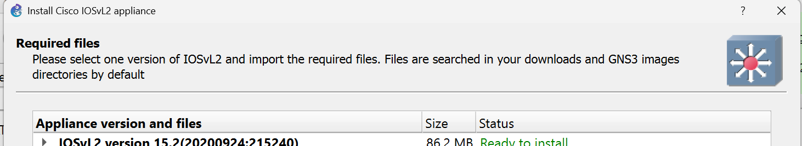

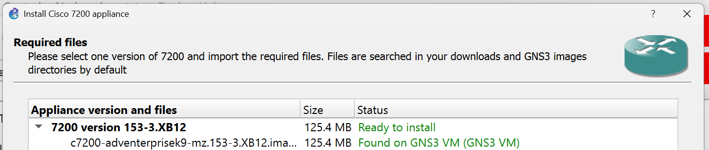

Figures.

- Created the project.
- Increased memory and CPUs for my VM to 10696MB.
- Created a snapshot “Before”.


Figure. Snapshot is done

# VLANs

### 1. Setup

- Setup topology, chosen for all nodes VM. Then added my routing and switching solutions from Cisco, because to provide communication they must be from on vendor..

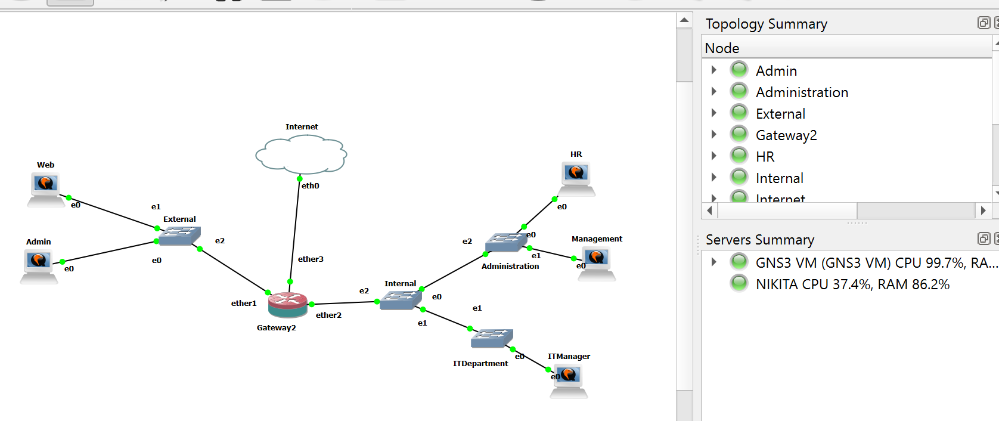

Figure. Topology

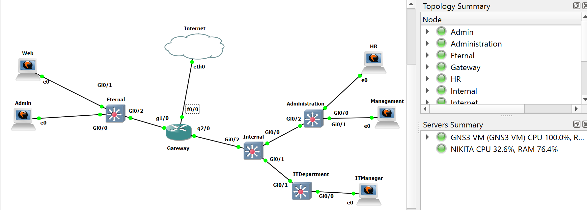

Figure. Topology

- I created new interfaces for gateway. FE - for the internet, GE - for switches.

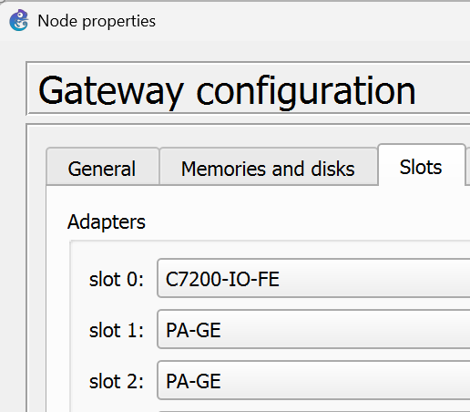

Figures

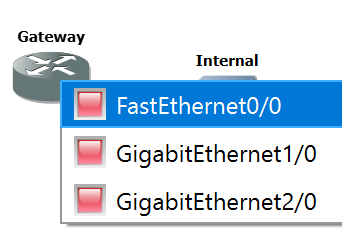

---

### 2. Created router configuration

- enabled, entered configuration mode
- setup dhcp-client for internet access (ether1)
- setup static net masks for internal and external networks
- showed ip table on

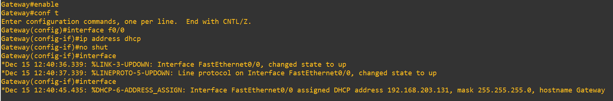

Figure

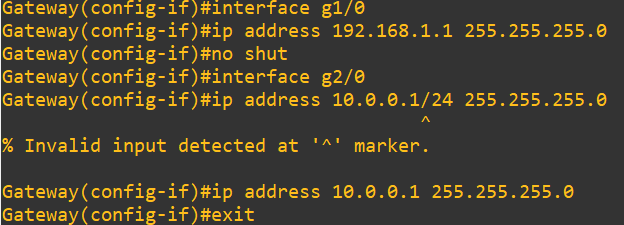

Figure


Figure

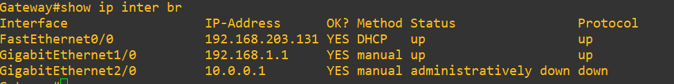

Figure. One cable is down, so we need to UP it:


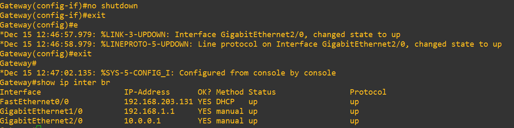

Figure

---

### 3. Configured hosts to use static IPs

```bash
# Web
sudo ip a add 192.168.1.2/24 dev ens3
sudo ip route add default via 192.168.1.1 dev ens3

# Admin
sudo ip a add 192.168.1.3/24 dev ens3
sudo ip route add default via 192.168.1.1 dev ens3

# HR
sudo ip a add 10.0.0.2/24 dev ens3
sudo ip route add default via 10.0.0.1 dev ens3

# Management
sudo ip a add 10.0.0.3/24 dev ens3
sudo ip route add default via 10.0.0.1 dev ens3

# ITManager
sudo ip a add 10.0.0.4/24 dev ens3
sudo ip route add default via 10.0.0.1 dev ens3
```

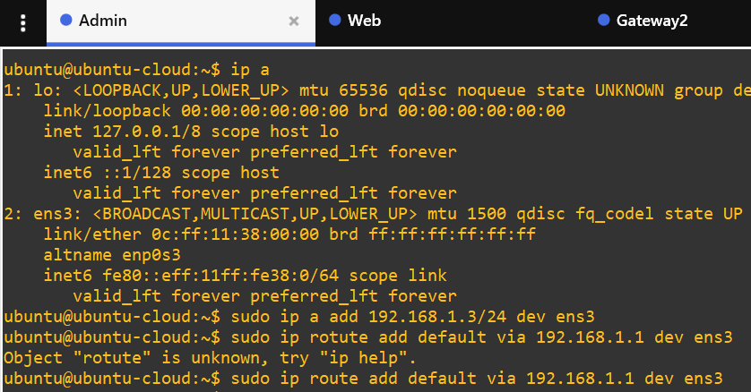

Figure. Admin configuration

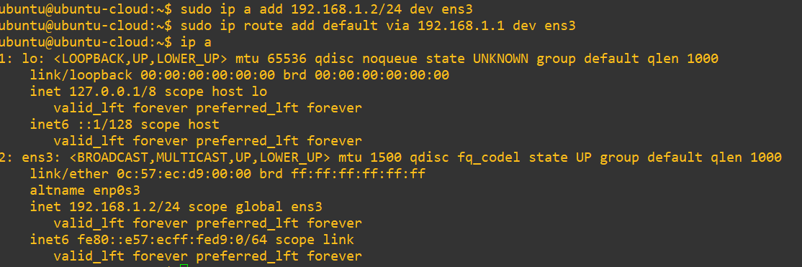

Figure. Web configuration

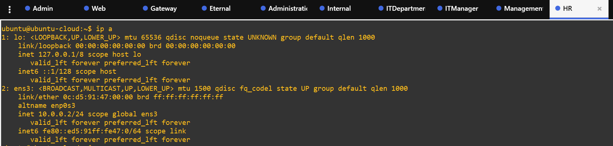

Figure. HR configuration

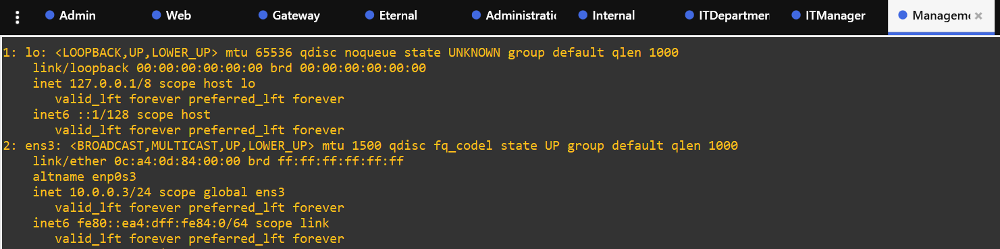

Figure. Management configuration

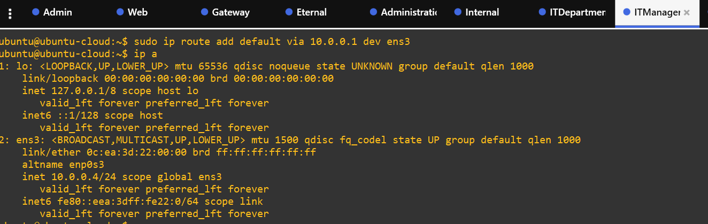

Figure. ITManager configuration

### Testing connectivity

- tested connectivity from M:M (but screenshots for ITM to all machines - for less images in the report)- success, because after configuring gateway and setting static ip address switches automatically (self-learning behaviour) assign communication based on MACs and IPs

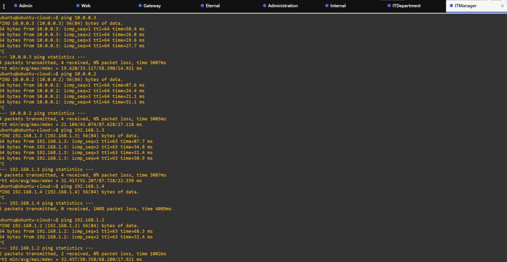

Figure

### **How do VLANs work at a packet level? What are the two main protocols used for this?**

VLANs operate on layer 2 (Ethernet) in a way that they split one physical switch into multiple interfaces/broadcast domains.

On access ports packets are not tagged, so they are associated only with the one VLAN that sends it — access traffic.

On the other hand, trunk port tag the packets allowing other VLANs share the same physical link (to transfer) — trunk traffic.

Protocol used:

1. 802.1Q — is a industry standard that simply inserts a 4-byte tag

```bash
| Dest MAC | Src MAC | **802.1Q TAG** | EtherType | Payload | FCS |
```

Where frame changes (where tag is added?)

**802.1Q tag inside**:

TPID: 0x8100
PCP : 3 bits (priority / QoS)
DEI : 1 bit (drop eligible)
VID : 12 bits (VLAN ID, 1–4094)

1. ISL (Inter-Switch Link) — is a proprietary protocol created, maintained and used by CISCO, his feature is to encapsulate a whole frame. But this is deprecated.

### **What is the Native VLAN?**

Native VLAN — is a VLAN which traffic on 802.1Q trunk sends in a state “untagged” and in the same state it crosses further, without adding a tag. By default is VLAN 1 (so do not use this one number, because it is reserved — can create huge security risks).

### **Configure the VLANs on the switches to isolate the two virtual networks as follows**

- Draw figures

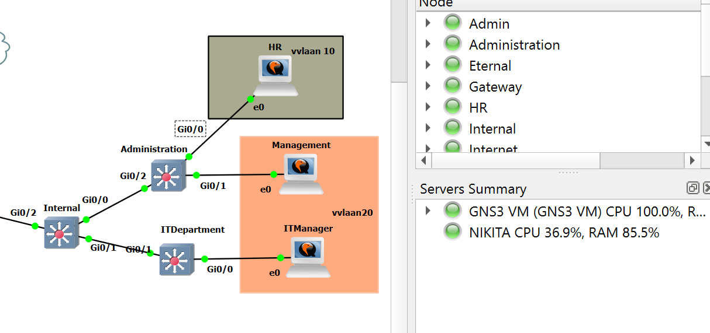

Figure

- Created a snapshot

    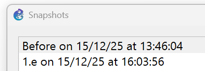

- Changed configuration for nodes (firstly delete prev ip configuration, then setup new, because I did snapshot my nodes rebooted and all configs cleared, so I do not need to delete prev ip configurations):

```bash
# HR
sudo ip a del 10.0.0.2/24 dev ens3
sudo ip a add 10.0.10.2/24 dev ens3
sudo ip route add default via 10.0.10.1 dev ens3

# Management
sudo ip a del 10.0.0.3/24 dev ens3
sudo ip a add 10.0.20.2/24 dev ens3
sudo ip route add default via 10.0.20.1 dev ens3

# ITManager
sudo ip a del 10.0.0.4/24 dev ens3
sudo ip a add 10.0.20.3/24 dev ens3
sudo ip route add default via 10.0.20.1 dev ens3
```

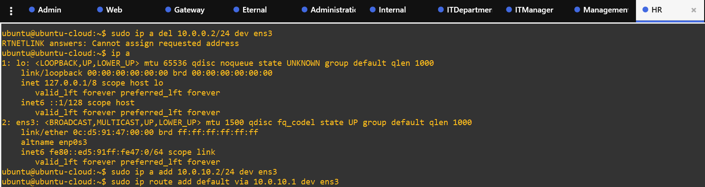

Figure HR

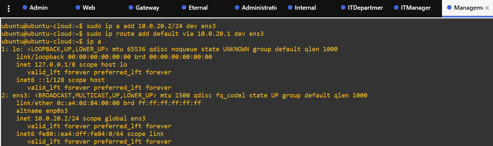

Figure Management

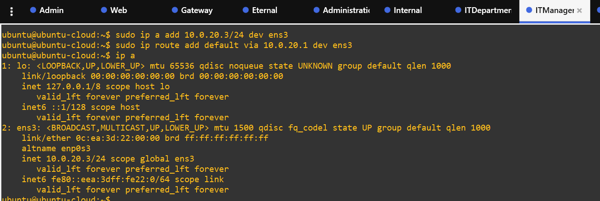

Figure ITManager

- Changed configuration for switches, so they allow VLAN, access to ports and trunk ports

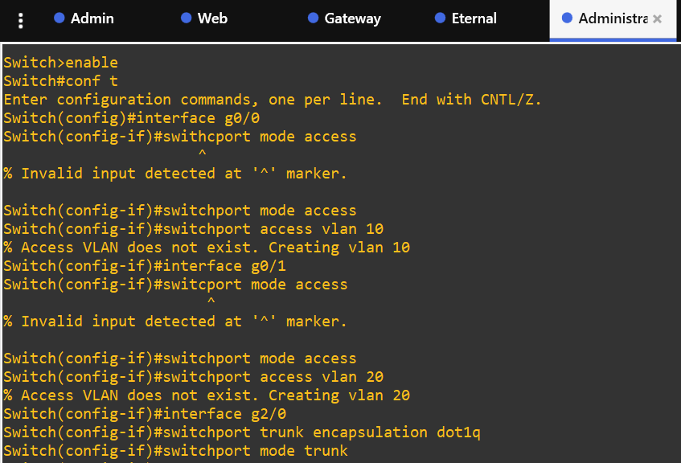

Figure Administration sw

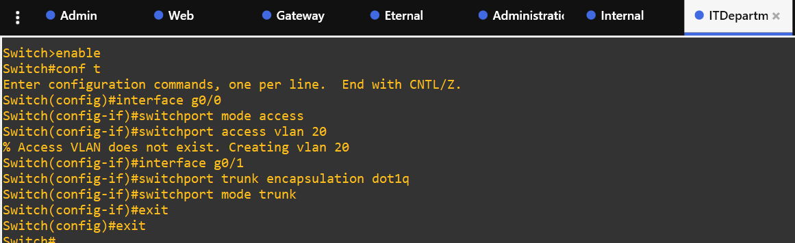

Figure ITDepartment sw

- Inspection commands on each switch executed.

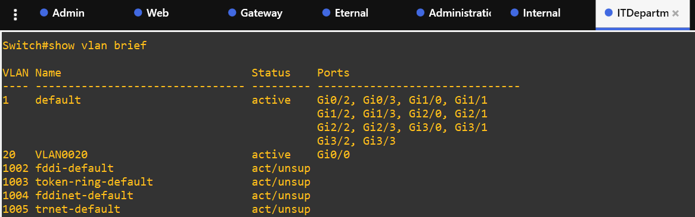

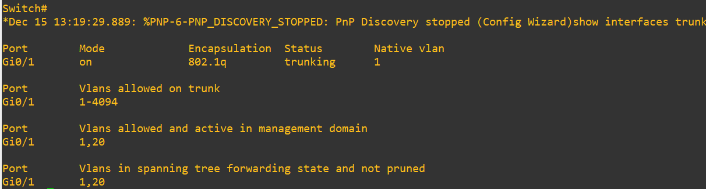

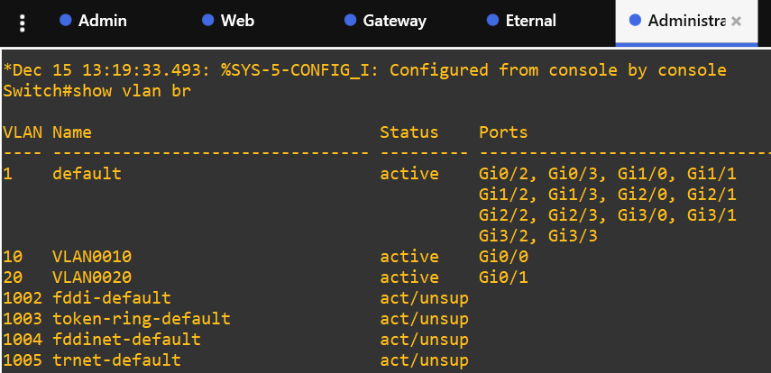

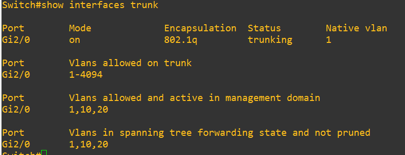

Figures. vlans and trunks

### Ping between ITManager and HR, do you have replies? Ping between ITManager and Management, do you have replies? Can you see the VLAN ID in Wireshark?

- Ping 1 (ITManager → HR) is not possible because they are in different subnets

    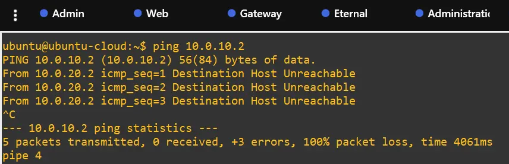

Figure

- Ping 2 (ITManager → Management) succeeded because they are in the same subnet

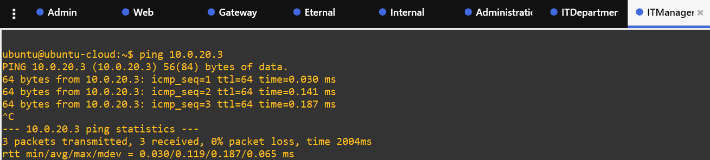

Figure

- Wireshark shows ping traffic and VLAN ID.
    - **Access port** → frame arrives **without 802.1Q tag**
    - **Native VLAN** → frame is **explicitly untagged**
    - **Trunk (non-native VLAN)** → tag is present and visible

    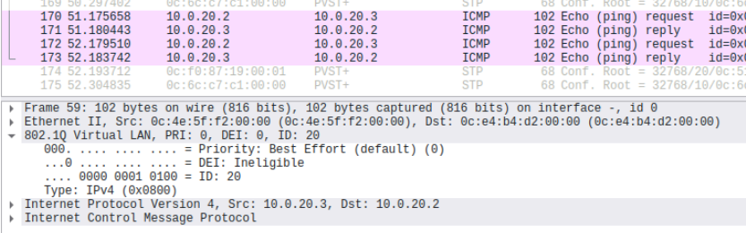

Figure

### Configure Inter-VLAN Routing between Management VLAN and HR VLAN and Show that you can now ping between them on gateway router

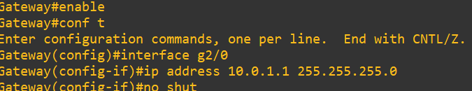

Figure

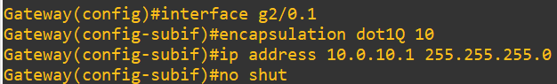

Figure

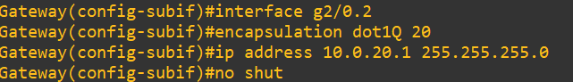

Figure

- Checked interfaces

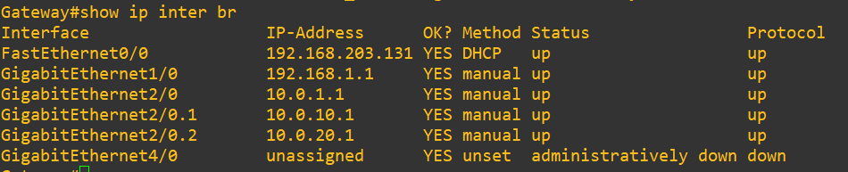

Figure

- Now ping succussed between itmanager→hr

    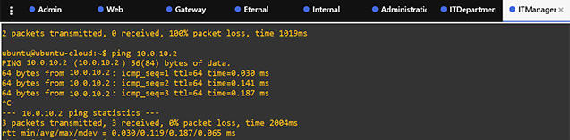

Figure

---

# Fault Tolerance

### What is Link Aggregation? How does it work (briefly)? What are the possible configuration modes?

**Link aggregation** combines/bonds multiple physical links and connection into the one logical link, using smart negotiation techniques (to choose which links are prioritized) and providing following:

bandwidth increases for logical link.

redundancy: if a link fails then, then automatically remaingin ones are set, so that connection is not interrupted

5 × 1 Gbps links → 1 logical 5 Gbps link

**How it works?**

Multiple connections are bonded → Traffic is being distributed using hash for MAC/IP/TCP-UDP during negotiation process → if a link in a group fails, then traffic continues on active ones.

**2+1 modes**: static, LACP, PAgP ([Port Aggregation Protocol](https://en.wikipedia.org/wiki/Port_Aggregation_Protocol)) *.

Static — is a force-on, should be ocnfigured very precisely and accurately, otherwise risk enhances and loops can be caused.

LCAP — simply sends LACP packets, passive mode (listens only), mostly used.

### Use link aggregation between the Web and the Gateway to have Load Balancing and Fault Tolerance as follows

- Infrastructure is changed:

    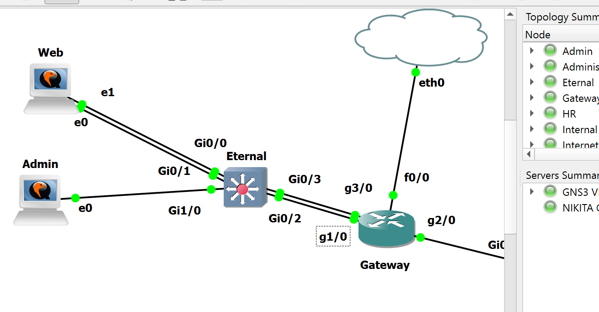

Figure

- Cisco's 7200 included here to support for EtherChannel needed.
- Added additional network interfaces on the host and then I duplicated connections
- Then, I changed Host (Web) configuration, created a file: `sudo nano /etc/netplan/00-installer-config.yaml`and added the following netplan configuration, that created a bond between interfaceces.

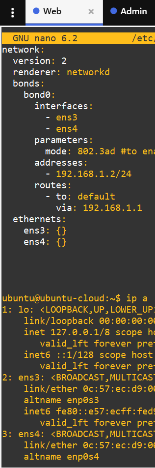

Figure. Netplan config for web

- Router configuration

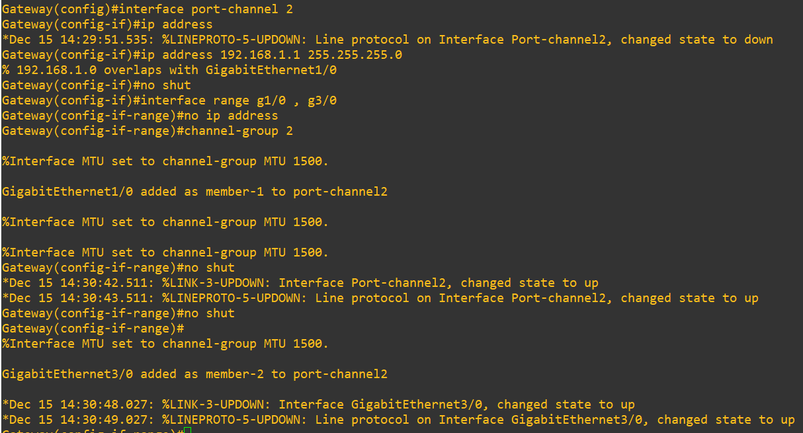

Figure

- Inspection command:

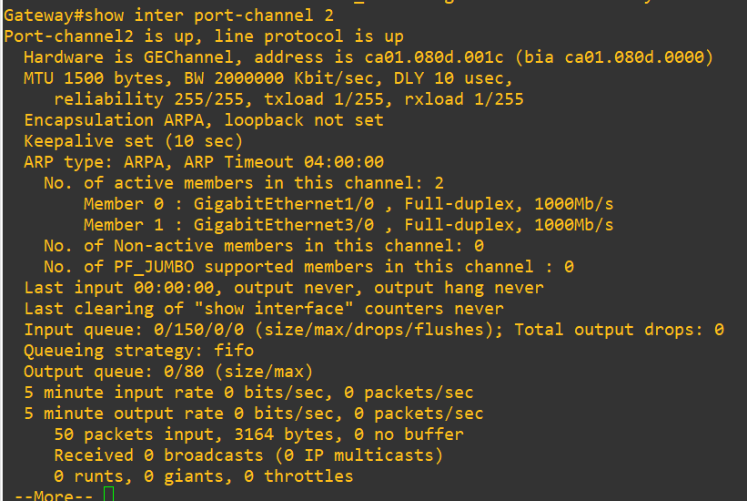

Figure

- Now I configure the switch (LACP mode with host-connected interfaces; static mode with router-connected interfaces because they do not support LACP)

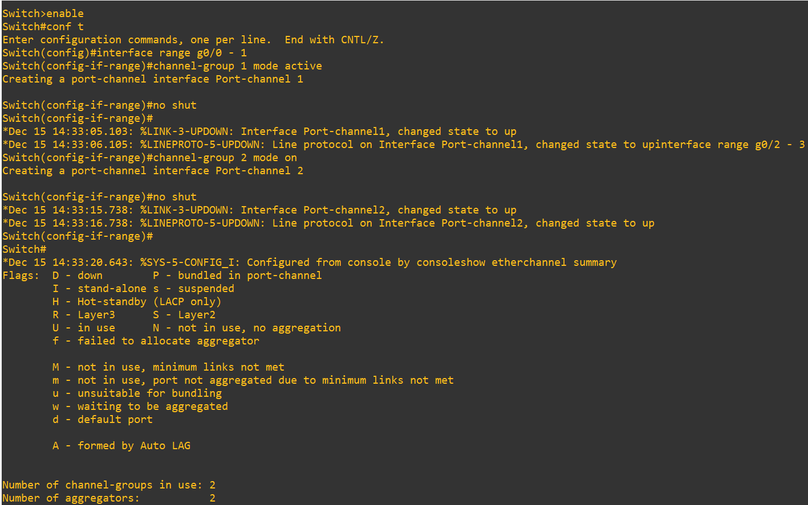


Figure

### Test the Fault Tolerance by stopping one of the cables and see if you have any downtime.

- I paused 2 cables from GNS3 in the middle on huge ping command started on the router. But fallback was still good, operation succeeded.

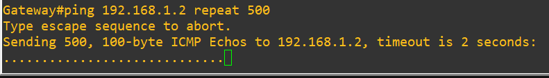

Figure

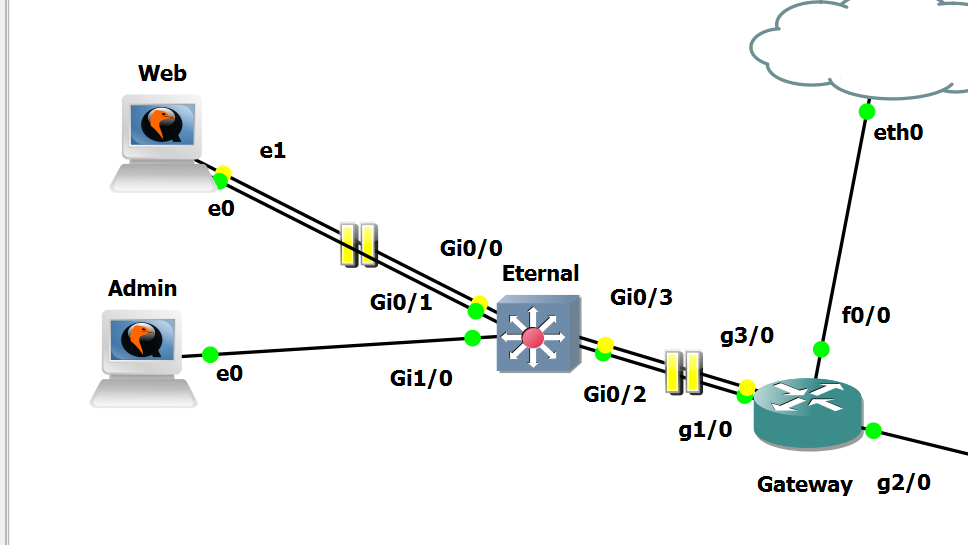

Figure

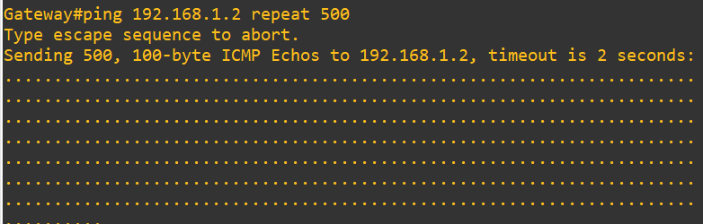

Figure

# STP

### Change the topology as follows and Disable STP on the Internal network switches.

Command is used: `no spanning-tree vlan 1-4094`

### Send a broadcast ping request to the PCs connected to the Internal Network.

Command is used from the gateway router: `ping 10.0.10.255`

### What can you notice? Why did this happen? What are the implications of this on the network?

Loop causes 100% CPU load, STP block vanished blocking mode on my switchies, so they only in an active always forwarding state, that will lead to overload and crush of the network.

### Enable back STP on the Switches and do the experiment again.

Loop is prevented.

Commands are used:

`spanning-tree vlan 1-4094`
`spanning-tree mode rapid-pvst`

### Can you see STP traffic? Explain it briefly

Traffic is seen

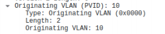

The process:

1. Exchanging data via Bridge Protocol Data Units such as bridge ID, MAC → root (one that will have all interfaces in a forwarding state) elects
2. Non-roots select root port → remaining link chooses designated port
3. Blocking state is switched for all non-root ports and non-chosen ports

### Configure the switches to have the *Internal* as the Root switch.

It is done by lowering the priority from default value as 32769 to < :

`spanning-tree vlan 1 priority VALUE`

### Would we need STP between routers?

No. The STP disable process, which immediately caused a Layer-2 loop and a broadcast storm when a broadcast ping was sent. Re-enabling STP restored normal network behavior by blocking redundant paths.

Routers on Layer 3 so they do not forward any broadcast communication.
