# 4 OSPF

Name of report: INR_NetEng_LAB_4_Nikita_Niakhai
Course: Networks Engineering
Performed by Nikita Niakhai

---

## Task 1 - Prepare your network topology

- Created Topology. Setup 2 adapters on all routes as Gigabyte Ethernet
    - Got red curved link - fixed it by changing the order of connecting nodes

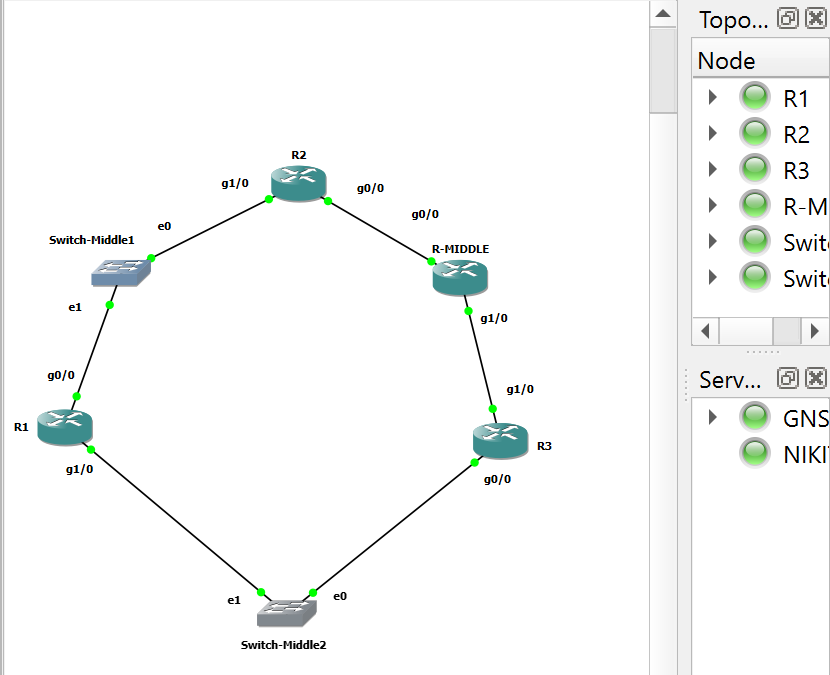

Figure. Topology II

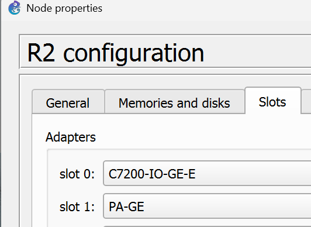

Figure. Configuration of adapters

- Setup settings on all routers. I prepared a simple network consisting of at least 3 routers, each one of them has a different subnet, and they should be able to reach each other. I did not write a static routes between different networks, but assigned static addresses!):

```bash
R2⋕ conf t
R2 (config)⋕ interface g0/0
R2 (config-if)⋕ ip address 10.0.0.1 255.255.255.252
R2 (config-if)⋕ no shut
R2 (config-if)⋕ interface g1/0
R2 (config-if)⋕ ip address 10.0.3.2 255.255.255.252
R2 (config-if)⋕ no shut

R-MIDDLE⋕ conf t
 (config)⋕ interface g0/0
 (config-if)⋕ ip address 10.0.0.2 255.255.255.252
 (config-if)⋕ no shut
 (config-if)⋕ interface g1/0
 (config-if)⋕ ip address 10.0.1.1 255.255.255.252
 (config-if)⋕ no shut

R3⋕ conf t
(config-if)⋕ interface g0/0
(config-if)⋕ ip address 10.0.2.1 255.255.255.252
(config-if)⋕ no shut
(config)⋕ interface g1/0
(config-if)⋕ ip address 10.0.1.2 255.255.255.252
(config-if)⋕ no shut

R1⋕ conf t
(config)⋕ interface g0/0
(config-if)⋕ ip address 10.0.3.1 255.255.255.252
(config-if)⋕ no shut
(config-if)⋕ interface g1/0
(config-if)⋕ ip address 10.0.2.2 255.255.255.252
(config-if)⋕ no shut 
```

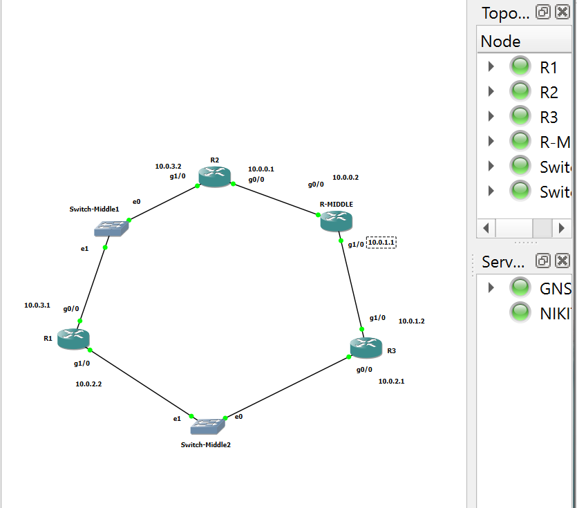

Figures. Topology II with static IPS

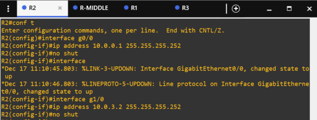

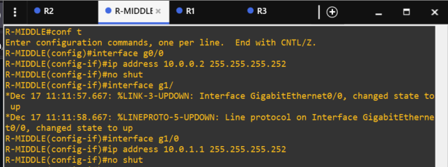

Figures. R2 and R-MIDDLE

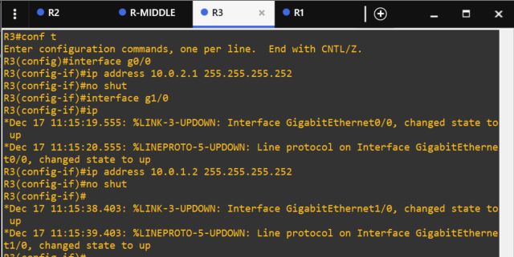

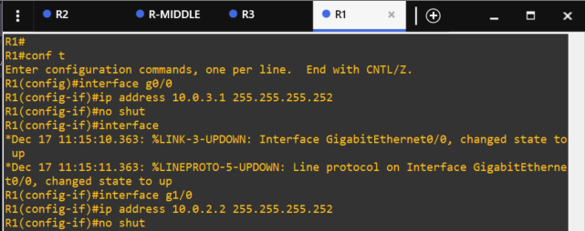

Figures. R3 and R1

- Now I checked routes on nodes using `show ip route:`

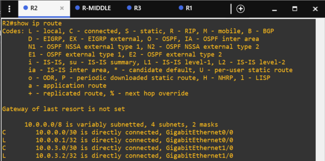

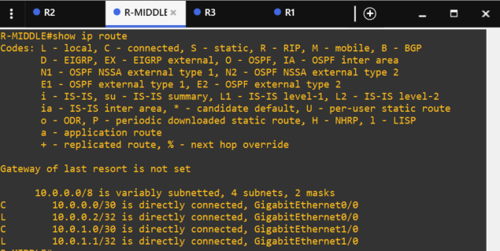

Figures. R2 and R-MIDDLE

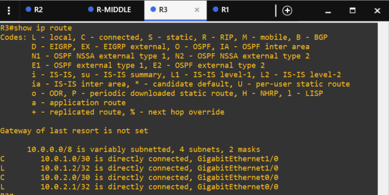

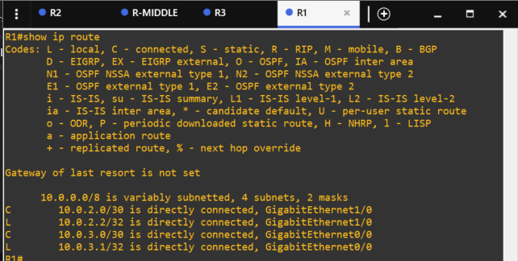

Figures. R3 and R1

- Nodes can not ping remote nodes, that are on hop+1, because OSPF is not configured yet. For example R-MIDDLE can ping R3(`10.0.1.2`) and R2 (`10.0.0.1`), but R1 (`10.0.3.1`) is unreachable.

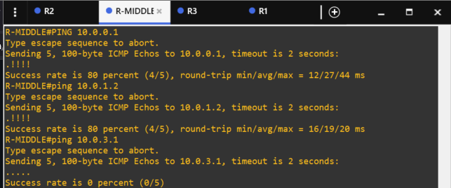

Figure. Pinging from R-MIDDLE

## Task 2 - OSPF Learning & Configuring

1. Deploy OSPF in your chosen network topology.

```bash
R2⋕ conf t
(config)⋕ router ospf 1
(config-router)⋕ router-id 1.1.1.1
(config-router)⋕ network 10.0.0.0 0.0.0.3 area 0
(config-router)⋕ network 10.0.3.0 0.0.0.3 area 0

R-MIDDLE⋕ conf t
(config)⋕ router ospf 1
(config-router)⋕ router-id 2.2.2.2
(config-router)⋕ network 10.0.0.0 0.0.0.3 area 0
(config-router)⋕ network 10.0.1.0 0.0.0.3 area 0

R3⋕ conf t
(config)⋕ router ospf 1
(config-router)⋕ router-id 3.3.3.3
(config-router)⋕ network 10.0.1.0 0.0.0.3 area 0
(config-router)⋕ network 10.0.2.0 0.0.0.3 area 0

R1⋕ conf t
(config)⋕ router ospf 1
(config-router)⋕ router-id 4.4.4.4
(config-router)⋕ network 10.0.2.0 0.0.0.3 area 0
(config-router)⋕ network 10.0.3.0 0.0.0.3 area 0

# Inspection commands
Router⋕ show ip route
Router⋕ show ip ospf neighbor
```

- Configuration is bellow:

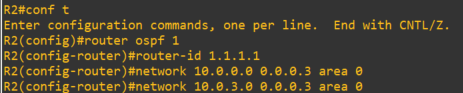

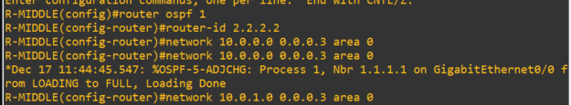

Figures. R2 and R-MIDDLE

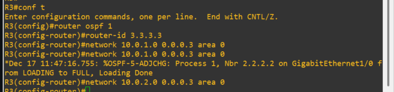

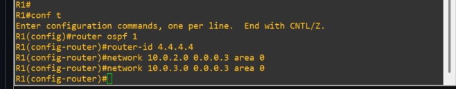

Figures. R3 and R1

- Inspection commands are bellow using `show ip route` and `show ip ospf neighbor`:

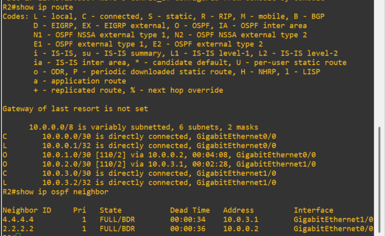

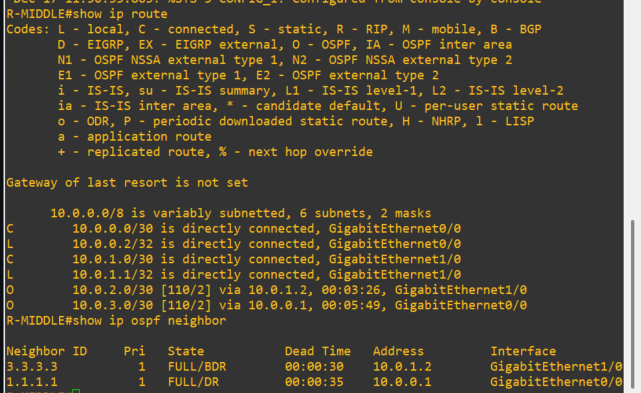

Figures. R2 and R-MIDDLE

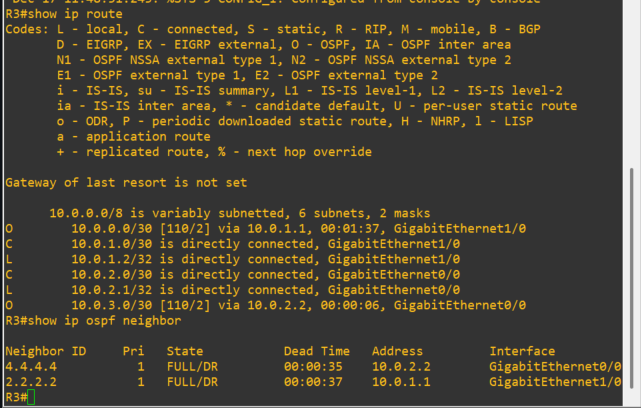

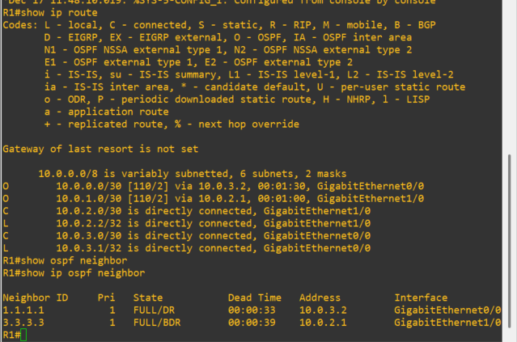

Figures. R3 and R1

- OSPF allows pinging all remote nodes:

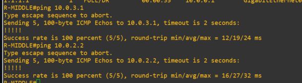

Figure. R-MIDDLE pinging R1 from 2 sides

1. Which interface you will select as the OSPF router ID and why?

I would select loopback `lo0` interface.

Router ID (RID) can be chosen by OSPF automatically on the highest IP address in the net and also it will preffer loopback interface. The last one is chosen based on assumption that this kind of interface will not go down — simply, stability. If a interface flaps, then my entire net with OSPF will not require to be restarted.

Why the highest IP? Because it allow predictability, so we can even manually set the highest ID, so that we would certainly now that the logic will select this one node.

Router ID is a part of LSAs (Link-state Advertisements — is a data packet with router information: RID, metrics, cost, bandwidth — it is shared between routers to enable OSPF learning)

1. What is the difference between advertising all the networks VS manual advertising (per
interface or per subnet)? Which one is better?

**Advertising all networks** is simple and easy to make. You can set up advertisement for a very broad wildcard, so that all IPs that match it will be advertised. Only if you add new subnet or interface you update the config.

But this one has limitations of security: you can share those IPs, whose presence is not wanted..

```bash
# ALL
router ospf 1
 network 0.0.0.0 255.255.255.255 area 0   // This enables OSPF on **ALL** interfaces
```

---

```bash
#MANUAL

interface GigabitEthernet0/0
ip ospf 1 area 0   // Enables OSPF on this specific interface only

router ospf 1
 network 0.0.0.0 255.255.255.255 area 0
 passive-interface default   // Suppresses Hellos on ALL interfaces
 no passive-interface GigabitEthernet0/0   // Re-enable only on interconnects
```

**Manual** can be done for the whole net but keep interface passive, so it will advertise net, but will be able to communicate only with passive-configured nodes.

Manual is done per an interface. Gives more control and stability as well, as security. Better for scalable systems, so you do not need to change ospf configuration.

Cisco recommends using Manual advertising.

1. If you have a static route in a router, how can you let your OSPF neighbors know about it?
Approve and show it on practice.
- Configuration for the case (R5 and R3)

```bash
# Configure static IP on R3 g2/0
R3⋕ conf t
(config)⋕ interface g2/0
(config-if)⋕ ip address 10.0.4.1 255.255.255.252
(config-if)⋕ no shut
(config-if)⋕ exit

# Configure static route on R3 to R5 network
(config)⋕ ip route 192.168.1.0 255.255.255.252 g2/0

# Configure static route on R5 to R3 network
R5# conf t
(config)⋕ ip route 10.0.4.0 255.255.255.252 g0/0
```

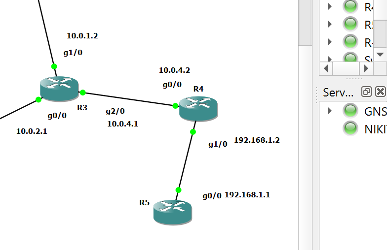

Figure. Case topology (frame)

- From R3 I branched 2 new routers, that will have a static route on network R4←→R5.
    - Configuration for the case (R4 and R5)

    ```bash
    # Configure static IP on R3 g2/0
    R3⋕ conf t
    (config)⋕ interface g2/0
    (config-if)⋕ ip address 10.0.4.1 255.255.255.252
    (config-if)⋕ no shut
    (config-if)⋕ exit

    # Configure static route on R3 to R5 network
    (config)⋕ ip route 192.168.1.0 255.255.255.252 g2/0

    # Configure static route on R5 to R3 network
    R5# conf t
    (config)⋕ ip route 10.0.4.0 255.255.255.252 g0/0
    ```

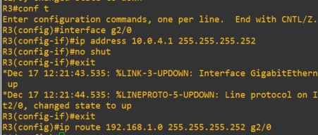

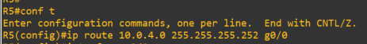

Figure. R3 and R5

- To test accessibility I used pinging (R3←→R5; R3 → R4)

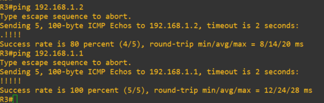

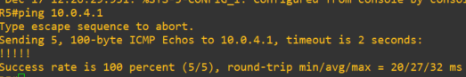

Figure. R3, R5 pinging on static routes

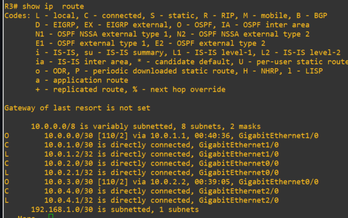

Figure. Subnets on R3

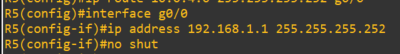

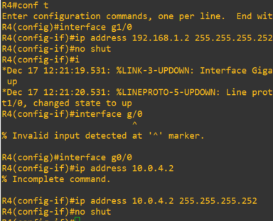

Figure. R5 and R4 configuration of static IP addresses

- Right configuration will allow to **let others find** those “guys” and ping the new static net without any manual configuration - learning process takes it place. !!!  R6 will not correctly reply to unconfigured routes for those other pinging nodes.

    ```bash
    # Let R3 people know about route to guys on R3-R4 network (10.0.4.0/30 )
    R3(config)⋕ router ospf 1
    R3(config-router)⋕ network 10.0.4.0 0.0.0.3 area 0
    # Redistribute static subnets
    (config-router)⋕ redistribute static subnets
    ```

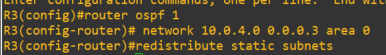

Figure. R3 configuration

- Verification

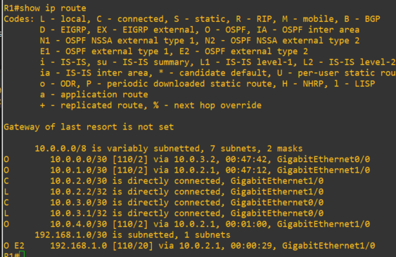

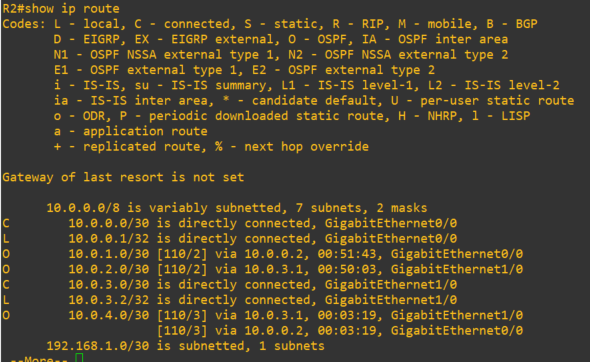

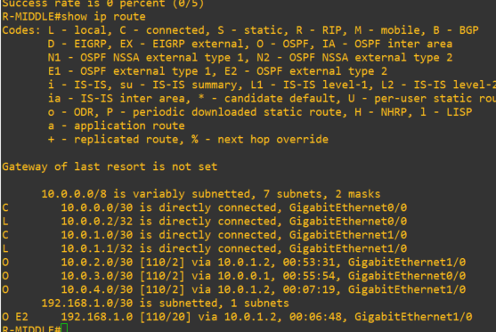

Figure. Static net is seen on all other routers (e.g. R1,R2) outside this statnet.

1. Enable OSPF with authentication between the neighbours and verify it.
- I will enable recommended measures as setting up MD5 hash auth (password) on desired neighbours (R-MIDDLE)

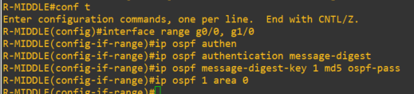

Figure. R-MIDDLE config for security

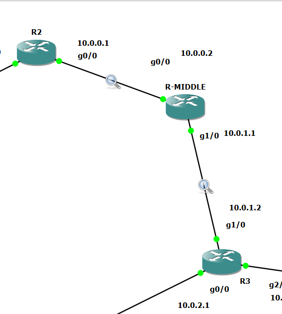

Figure. Starting capture mode

- Now authentication mechanism are seen in packets send (headers)
    - Auth Type: Cryptographic (2)
    - Auth Crypt Data: 3867cbe8cfc7e9e8e49b904f98048b38
    - …

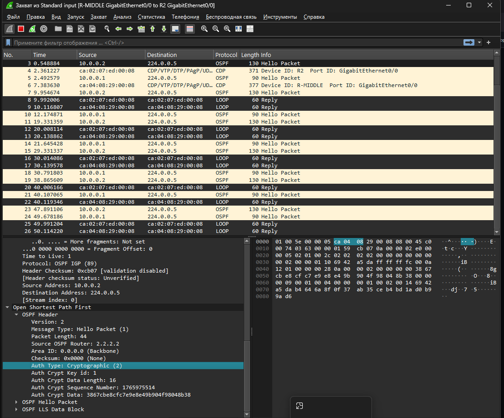

Figure. **R-MIDDLE←→R3:** *Hello Packets* are authenticated (Header)

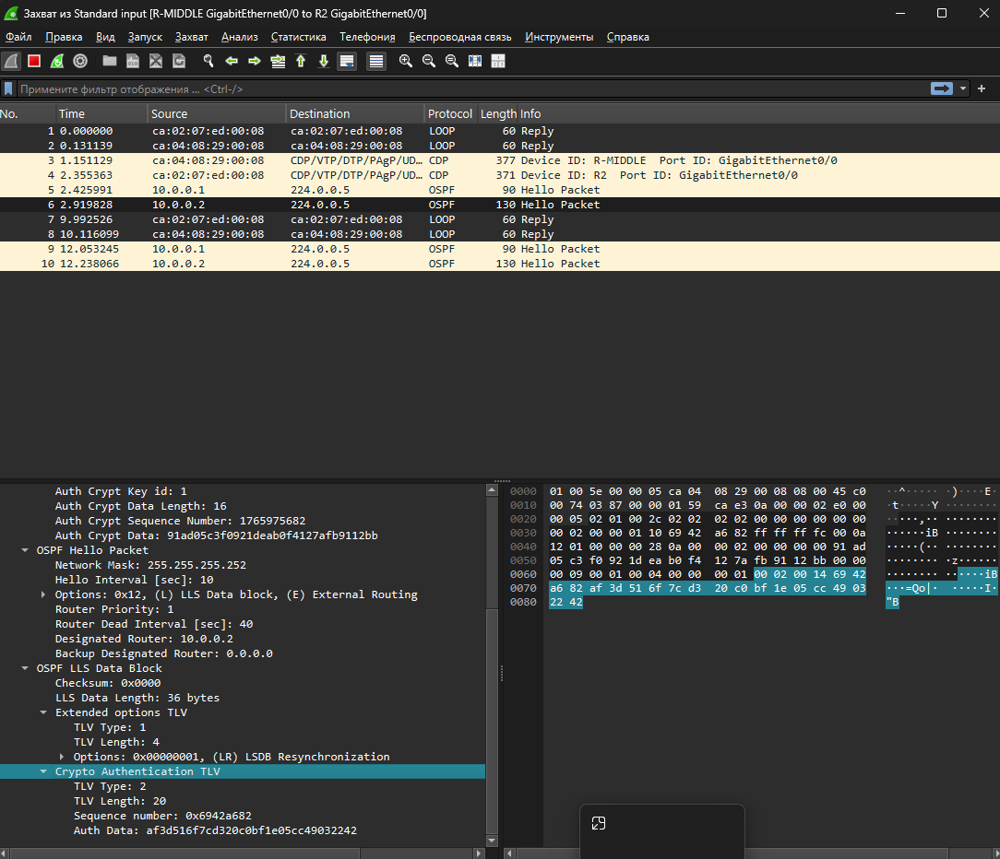

Figure. **R-MIDDLE←→R2:** *Hello Packets* are authenticated (Data block)

## Task 3 - OSPF Verification

1. How can you check if you have a full adjacency with your router neighbour?

`show ip ospf neighbor`

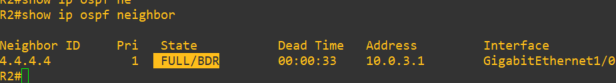

Figure. full adjacency state on R2 with his neighbour R-MIDDLE

If adjacency is incomplete, then state = EXSTART, EXCHANGE, LOADING, etc.,  (common issues: MTU mismatch, authentication failure, network type mismatch).

`debug ip ospf adj` to see adjacency progression.

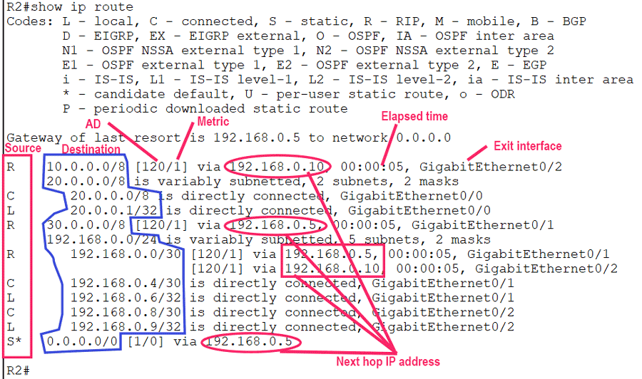

Figure. [Scheme](https://www.computernetworkingnotes.com/wp-content/uploads/ccna-study-guide/images/csg180-03-route-enries.png)

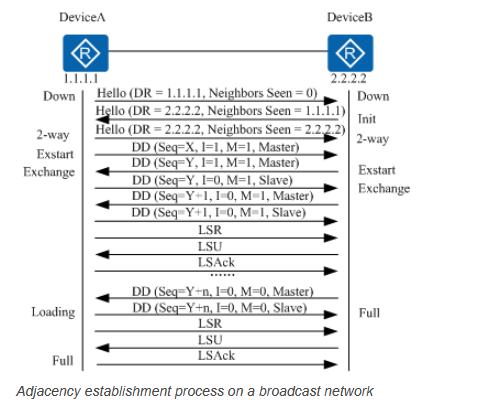

Figure. Adjacency establishment process on a broadcast network

“The adjacency establishment process is as follows:

1. The local and remote routers use OSPF interfaces to exchange Hello packets to establish a neighbour relationship.
2. The local and remote routers negotiate a master/slave relationship and exchange Database Description (DD) packets.
3. The local and remote routers exchange link state advertisements (LSAs) to synchronize their link state databases (LSDBs)”

1. How can you check in the routing table which networks did you receive from your neighbours?

`show ip route ospf` — shows only received networks by OSPF from guys in the net.

First code from the table indicates from which type of neighbours table was learned, e.g. R — by RIP protocol, B — by BGP protocol..

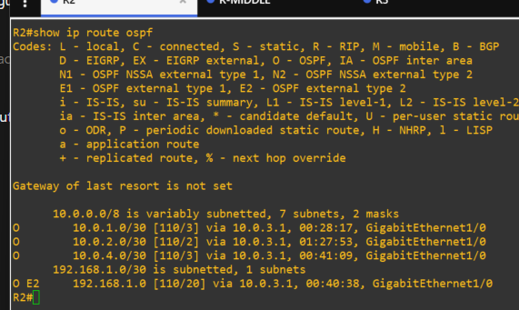

Figure. Route table on R2

1. Use traceroute to verify that you have a full OSPF network.

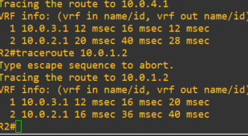

1. Which router is selected as DR and which one is BDR ?

They are selected by all routers in the topology. DR priority is used to pick between elected DR candidates. DR and BDR are choosen at the same time. Routers share LSAs with DR and BDR only so less bandwidth and adjacency. If DR fails, BDR takes his place and becomes DR and all routers start to elect new BDR, whilst not affecting routing speed.

FULL/DR and FULL/BDR — 2 type of states indicating current role of a shown router. DR — designated router, BDR — backup designated routes. FULL — stands for complete sync and OSPF set up between routers states. R-MIDDLE is fully adjacent and is designated for accessing the network.

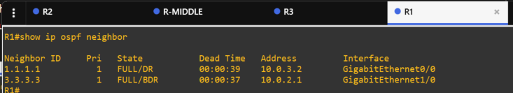

Figure. R1 table of neigbours

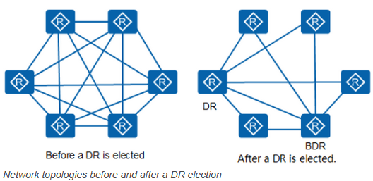

Figure. [Link](https://info.support.huawei.com/info-finder/encyclopedia/en/OSPF.html)

1. Check what is the cost for each network that has been received by OSPF in the routing
table.

Figure in question 2 shows cost and metric:

O [110/3], O [110/2], O [110/3], E [110/20]

**Intra‑area is O, External is E.**

priority is 110 by default for OSPF and metric is the path cost.

- Cost are 2/3 for regular (O) routes. Difference between is the quantity of hops
- Cost is 20 for external (E2) routes.
