# 5 QoS

Name of report: INR_NetEng_LAB_5_Nikita_Niakhai
Course: Networks Engineering
Performed by Nikita Niakhai

---

## Task 1 - Prepare your network topology

1. In the GNS3 project, I installd a virtual routing solution from CISCO 7000.
2. I prepare a simple network consisting of one router and 4 hosts and switches with Internet access.

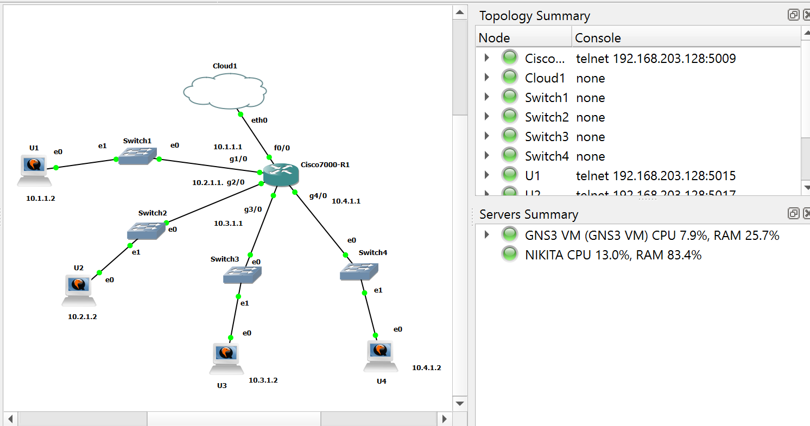

Task 2 - QoS learning & configuring

1. Let's start with a little theory. Briefly answer the questions or give one-line description what
is it: Сlass of Service (CoS), ToS (Type Of Service), Differentiated Services Code Point (DSCP),
Serialization, Packet Marking, Tail Drop, Head Drop, The Leaky bucket algorithm, The Token
Bucket Algorithm, Traffic shaping, Traffic policing?

Core ports for Quality of Service:

Class of Service (CoS) — mechanism on layer 2 (Ethernet frames) that is used to mark traffics from 0 to 7 by routers/switches. Uses 3-bit code in the 802.1Q VLAN tag

ToS (Type Of Service) — part of IPV4 header that is responsible for showing:

- priority from 0 to 7 (3 bits);
- delay, throuhput, reliability, minimization of costs (4 bits);
- unused bit;

— total 8 bit field.

Differentiated Services Code Point (DSCP) — is a more modern marking standard (newer than ToS) that uses the placement of ToS’s bits in IPV4 header and provides 64 possible values: EF expedited forwarding , AF assured forwarding, BE best effort.

Serialization — transmitting bits of the packet in a logical order. Causes delays, but mitigates with fragmentation and prioritizing techniques.

Packet Marking — is a trust-based/policy-enforced technique of pinning QoS values (DSCP, CoS …) to the packets based on classification of ports, interfaces, ACL and etc. Allows use of mechanisms like priority queuing and dropping and etc.

Tail Drop — technique for managing full queues when packets are dropped from the tail.

Head Drop — technique for managing full queues when packets are dropped from the top.

The Leaky bucket algorithm — shapes output of big amounts traffic with particular smaller rate (than the amount itself), mitigating bursts.

The Token Bucket Algorithm — (policy+shape) packets received to the bucket at a constant rate, then outgoing packet is constructed of tokens that are proportional to its size, picks needed available tokens and sends; if no available tokens packet is dropped/delayed.

Traffic shaping — technique to smooth excessed traffic into a smooth stream with a defined rate; causes delays; it doesn’t drop received packets — buffers.

Traffic policing —  when excessed packets limit rate then it drops them or remarks with different priority, whilst buffering is not used. Can cause drops.

1. Configure your network as you decided above. After your network is configured (don't forget
to show the main configuration steps in the report), try to set a speed limitation (traffic
shaping) between the two hosts.
Hint: It was found that the virtual solution for the Mikrotik router has a "sewn" in the firmware
speed limit of not more than one megabit per second, that is, in these conditions, we can only
configure the speed limit of not more than one megabit per second. Try to verify this and to get
around the restriction? Otherwise, set the traffic limit to no more than one megabit per second.

- Basic Configuration for the router:

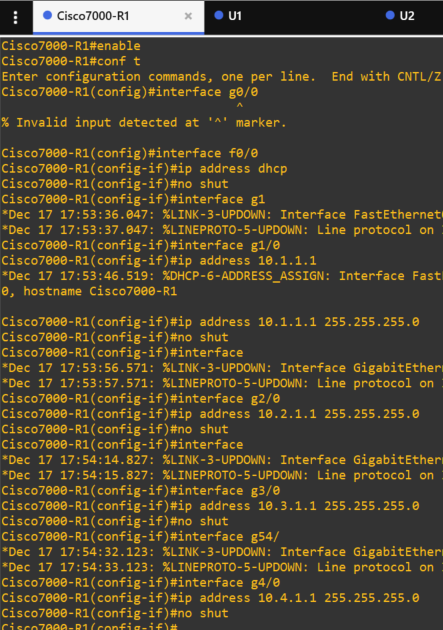

Figure. Router config

- Internet access on the router for the LAN

```bash
(config)⋕ 
access-list 1 permit 10.0.0.0 0.255.255.255
ip nat inside source list 1 interface FastEthernet0/0 overload
interface f0/0 
ip nat outside
interface range g1/0 , g2/0 , g3/0 , g4/0
ip nat inside
```

- Added static IPs, changed `resolv.conf` and added `nameserver=1.1.1.1` for DNS.

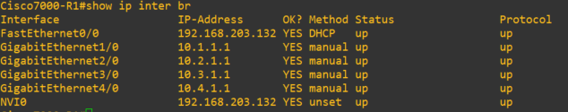

Figure. Interfaces on the router

- For all 4 hosts did the same commands, show bellow:

    ```bash
    sudo ip addr flush dev ens3
    sudo ip a add 10.X.1.2/24 dev ens3
    sudo ip route add default via 10.X.1.1 dev ens3

    sudo apt update && apt upgrade
    sudo apt install iftop iperf3 -y
    ```

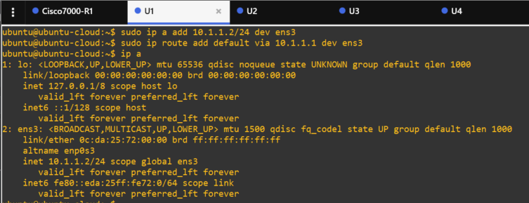

Figures. Hosts configuration

- Checked Internet access and other hosts

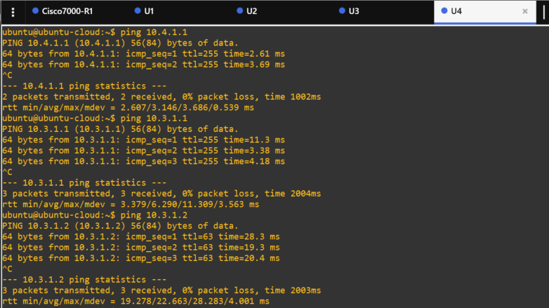

Figures. Accessibility on hosts

- Traffic shaping configuration for the router

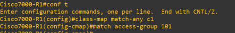

Figure. Router config: a class map to identify the traffic to shape

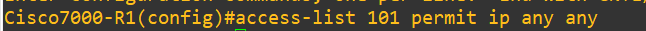

Figure. Router config: an access control list (ACL) to define the traffic

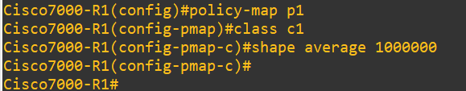

Figure. Router config: a policy map to apply the shaping of 1MB

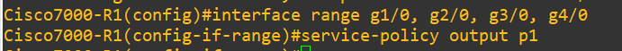

Figure. Router config: pined the policy to an outbound interface

- Limitation for the router is found bellow policy command:

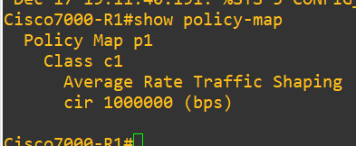

Figure. Router limitations

1. Run a bandwidth testing tool, see what is the max speed you can get and verify your speed
limitation. Compare the speed between the different hosts.
Hint: for example, you can use iperf3 tool.

- **Before: Transfer is 11.5 MBytes , Bitrate is 9.52 Mbits/sec**

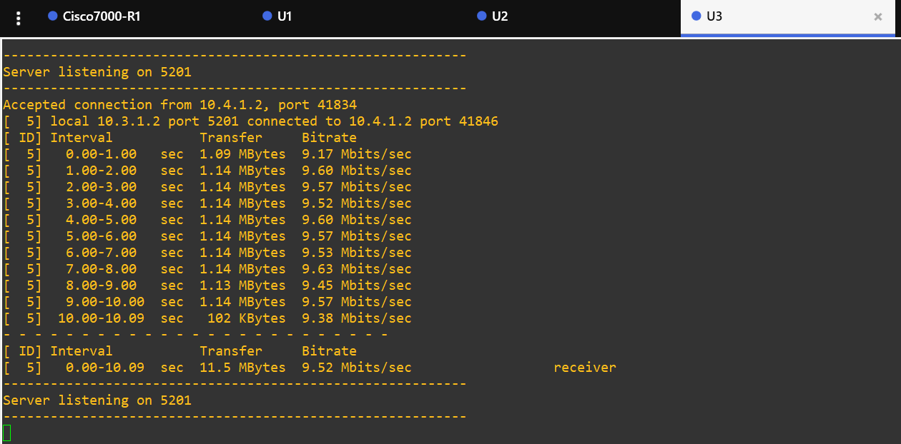

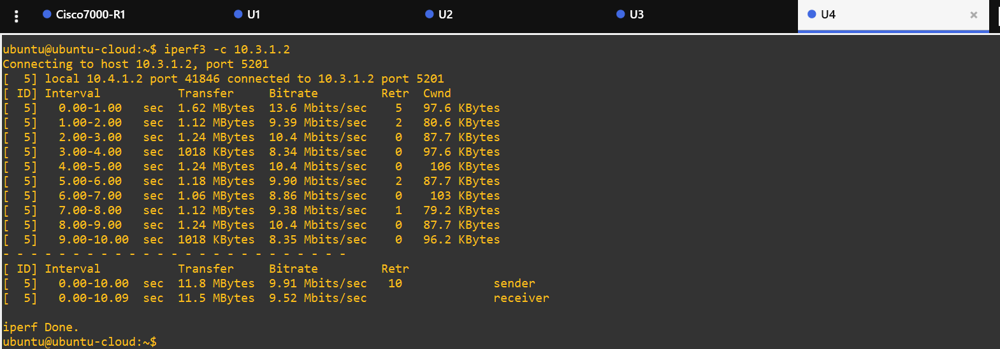

Figure. Before Run a bandwidth testing tool U3<—>U4

- **After: Transfer is 1.06 MBytes , Bitrate is 841 Kbits/sec**

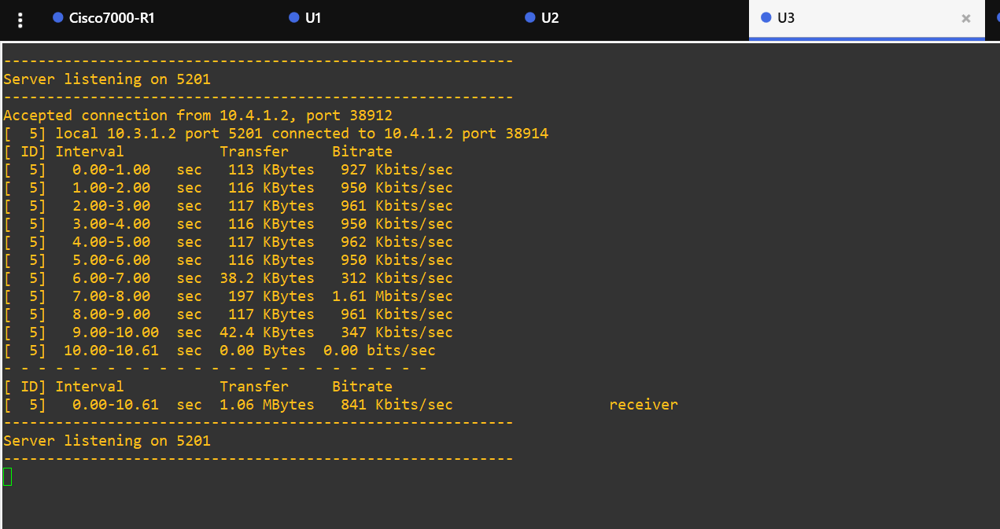

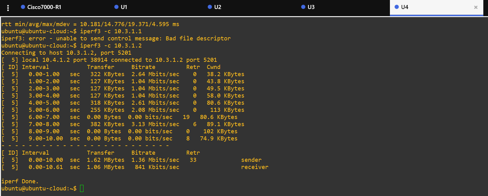

Figure. After Run a bandwidth testing tool U3<—>U4: we see changes in bitrate

1. While your bandwidth test is still running, try to download a file from one host to the other
host and see what is the max speed you can get. If you have more than two hosts on the
network, play around with different speed values and show it.

While the bandwidth test between PC3 and PC4 is running, I start downloading a file from PC3 to PC4. The throughput is throttled even more, as indicated by **`iftop`** on PC3 and **`scp`** on PC4. On PC3, **`iftop`** reports lower rate and on PC4 the download speed is shown.

U3:`sudo iftop && iperf3 -s`

U4:`scp [ubuntu@10.3.1.2](mailto:ubuntu@10.3.1.2):~/vmlinuz-5.15.0-122-generic .` `&& **iperf3 -c** 10.3.1.2 &&`

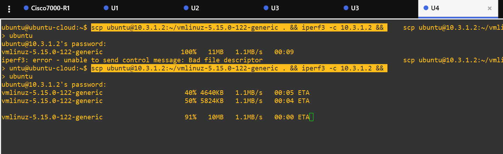

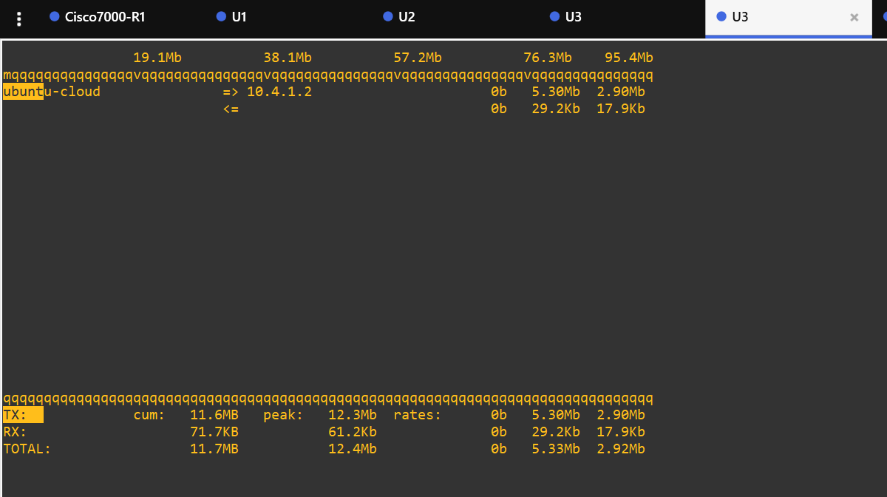

Figure. Downloading file from U3 to U4 and using iftop

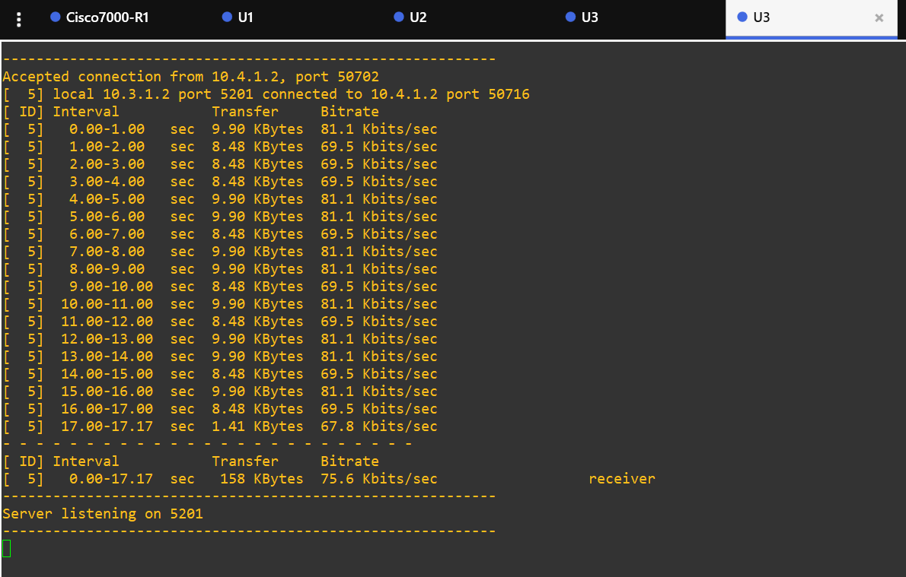

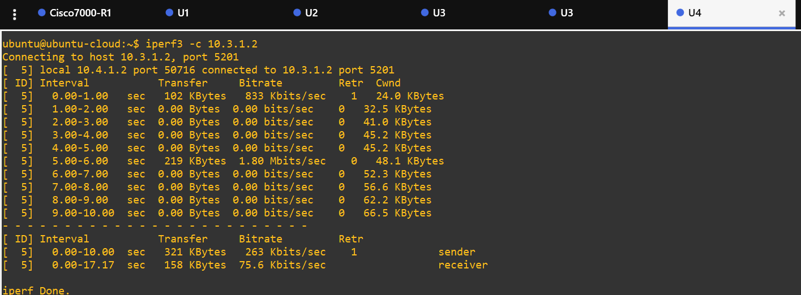

Figure. Bandwidth tests are lower

1. Deploy and verify your QoS rules to prioritize the downloading of a file

- I created class maps to distinguish traffic, used ACL to define traffic for ports of `scp` and `iperf` and then updated policy with new config and setup priority
- **That allowed to see a visible decrease in the bandwith, cause of prioritization set on the router.**

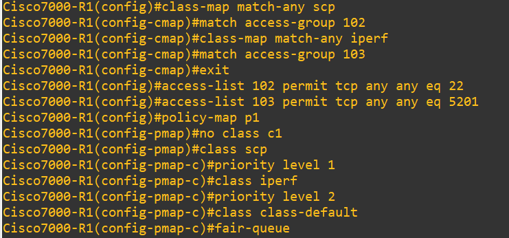

Figure. Configuration to prioritize download operation over the test

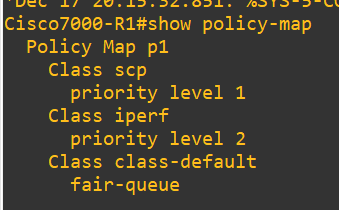

Figure. New policy

1. What is the difference between the QoS rules to traffic allocation and priority-based QoS? Try
to set up each of them and show then them. In which tasks of this lab do you use one or the
other?

1 option is to explicitly cap bandwidth with **`shape average`** on an interface; this limits the bit rate and was used in Task 2. It prevents a single heavy flow from consuming most of the link.

2  option is to prioritize traffic classes instead of fixing rates; this was done in Task 5. It ensures more important traffic (e.g., VoIP over email) is served first during congestion.

1. Try to answer the question: packet drops can occur even in an unloaded network where
there is no queue overflow. In what cases and why does this happen?

Reasons:

- QoS policing or rate limiting **`exceed-action drop`**
- TTL expiration after too many hops
- Firewall or ACL rules blocking
- Malformed packets
- Router misconfiguration…

## Task 3 - QoS verification & packets analysis

1. How can you check if your QoS rules are applied correctly? List and describe the various methods.

By using device counters (for example**`show policy-map interface`**, **`show mls qos interface statistics`**) to check that classes, shaping, marking, and drops match your policy. Additionally, use live traffic tests (e.g., VoIP call plus large file transfer) and observe that priority traffic keeps low delay and loss while best-effort traffic degrades first.

1. Try to use Wireshark to see the QoS packets. How does this depend on the number of routers in the network topology?

    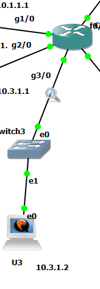

Figure. Wireshark is on g3/0

The IPv4 header has an 8‑bit QoS field that used to carry IP precedence and related bits; today it is split into DSCP (Differentiated Services Code Point) and ECN (Explicit Congestion Notification). Configure the router as before: define a traffic class and assign a DSCP value that matches the traffic type, for example with SCP/SSH:

R1: policy-map p1 → class scp → set dscp cs2

This DSCP marking is visible in Wireshark and, if applied to different flows, allows routers to prioritize traffic for QoS. As the topology grows, QoS configuration becomes harder because intermediate routers may remark or clear priorities, although properly configured networks typically preserve DSCP across hops.

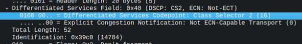

Figure. Frame of wireshark listening
