# 6 BGP

Name of report: INR_NetEng_LAB_6_Nikita_Niakhai
Course: Networks Engineering
Performed by Nikita Niakhai

---

### Prerequisites:

My ID is **18** from the txt file.

AS Numbers assigned:

- **AS650181**
- **AS650182**
- **AS650183**

**Loopback subnets** (/28 each):

- AS650181: 10.18.1.0/28 → Loopback: 10.18.1.1/32
- AS650182: 10.18.2.0/28 → Loopback: 10.18.2.1/32
- AS650183: 10.18.3.0/28 → Loopback: 10.18.3.1/32

**Transit networks** (/30):

- Between AS1-AS2: 172.16.18.0/30
- Between AS2-AS3: 172.16.18.4/30
- Between AS3-AS1: 172.16.18.8/30

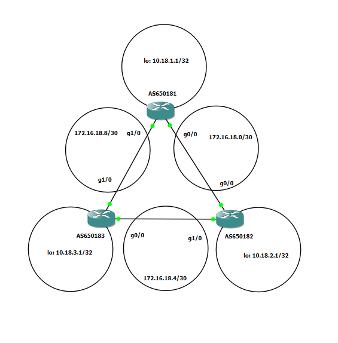

Figure. Network topology

### Lab Tasks

## **Part A: Basic Router Configuration**

Configure three routers in GNS3/EVE-NG, each representing a different AS.
For each router:

1. Configure hostname according to its AS number
- I used CISCO 7200 as my routing solution with to GE adapters.
- After creating a topology I did a snapshot

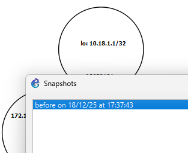

Figure. Snapshot

1. Configure loopback interface with the assigned /32 address
- I setup loopback interfaces (R1,R2,R3)


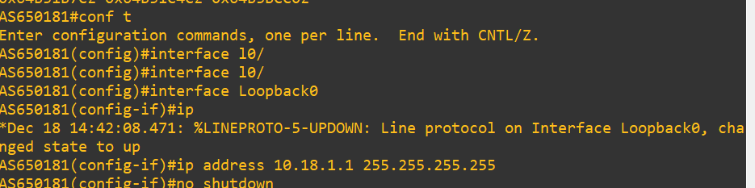

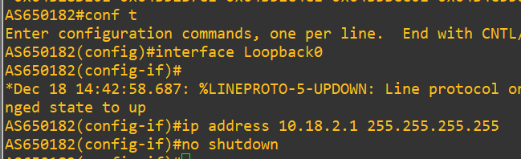

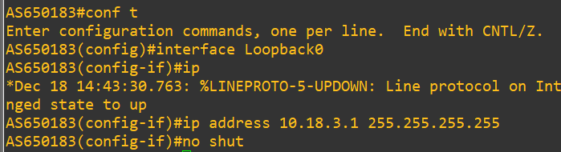

Figures. loopback interfaces (R1 up,R2 left,R3 right)

1. Configure physical interfaces with appropriate IP addresses from the /30 transit networks
- Setup physical interface configuration with static IP addresses inside transit networks (I am left with 2 possible addresses for each node: 1,2 ; 5,6 ; 9,10)

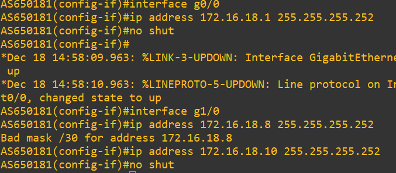

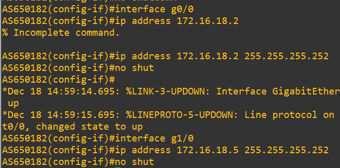

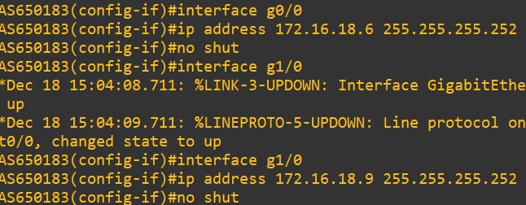

Figures. gigabyte interfaces (R1 up,R2 left,R3 right)

1. Enable routing and ensure interfaces are active
- Ensured routing is enabled using
`show ip interface brief`

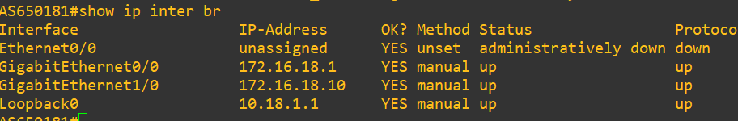

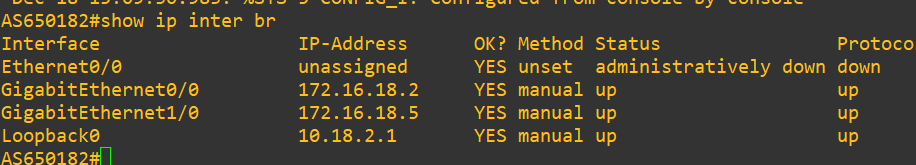

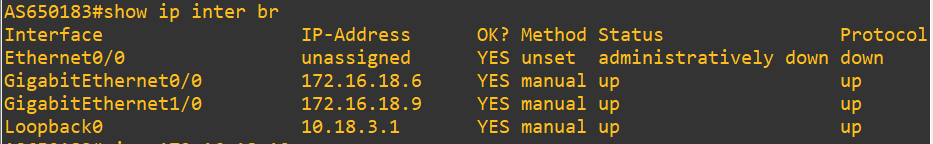

Figures. interfaces (R1 up,R2 left,R3 right)

- Ensured pinging between nodes inside each local net, e.g. router 3 can ping router 1 and 2 inside their nets (172.16.18.8/30 and 172.16.18.4/30) and can not inside different nets

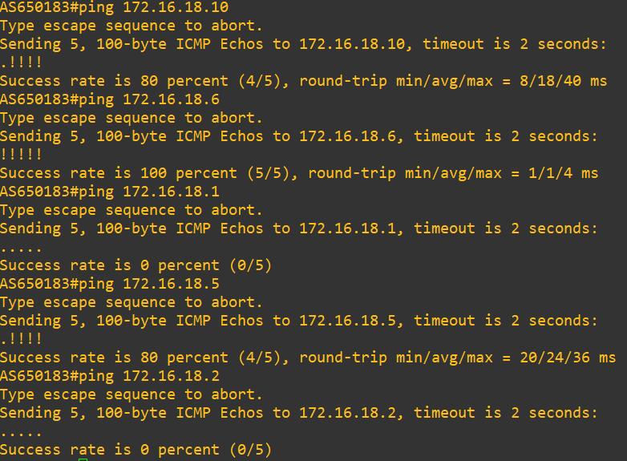

Figure. R3 pinging neighbours and itself on nets

## **Part B: BGP Configuration**

Configure BGP on all three routers:

1. Enable BGP routing with the correct AS number for each router

```bash
AS650182(config)#router bgp 650182
AS650182(config-router)#bgp log-neighbor-changes
```

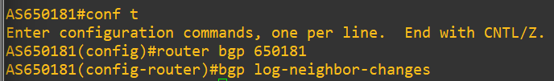

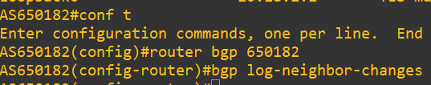

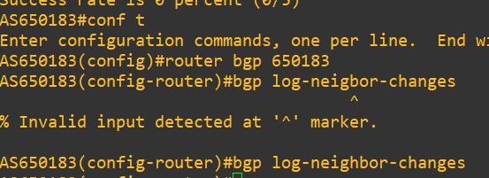

Figures. BGR routing with AS number (R1 up,R2 left,R3 right)

1. Set router ID to match the loopback address

```bash
AS650182(config)#router bgp 650182
AS650182(config-router)# bgp router-id 10.18.2.1
```

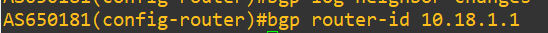

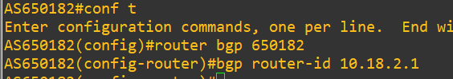

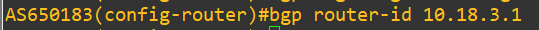

Figure. (R1,R2 ,R3 )

1. Configure eBGP neighbors pointing to the other routers' interface IPs; They are up.

```bash
AS650182(config)#router bgp 650182
AS650182(config-router)# neighbor 172.16.18.1 remote-as 650181
AS650182(config-router)# neighbor 172.16.18.6 remote-as 650183
```

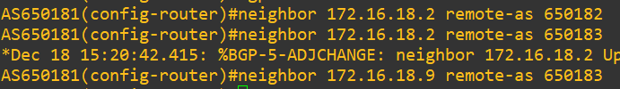

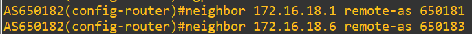

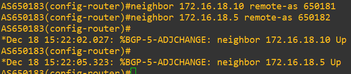

Figure. (R1 R2 R3)

1. Activate BGP for IPv4 unicast on all neighbor relationships

```bash
router bgp {AS_ID}
address-family ipv4 
neighbor {IP} activate
exit-address-family
```

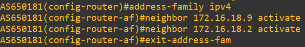

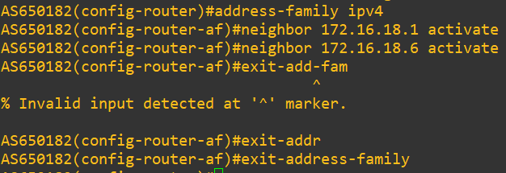

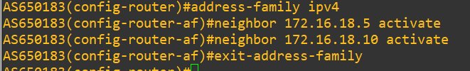

Figure. (R1 R2 R3)

1. Advertise the /28 loopback subnet and the /32 loopback address via BGP network statements

```bash
AS650181(config-router)#network 10.18.1.0 mask 255.255.255.240
AS650181(config-router)#network 10.18.1.1 mask 255.255.255.255
```

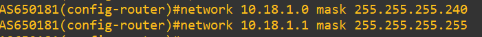

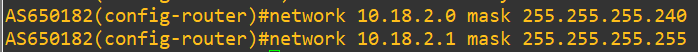

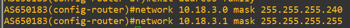

Figure. (R1 R2 R3)

1. Ensure that BGP is advertising networks that exist in the routing table

`show ip route connected`

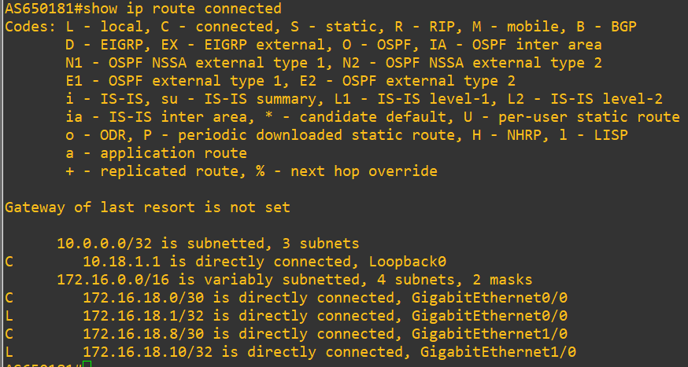

Figure. R1

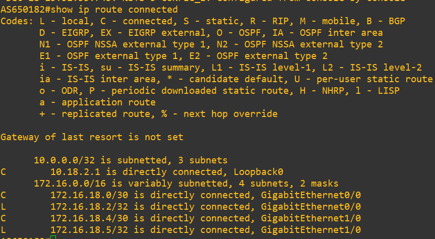

Figure. R2

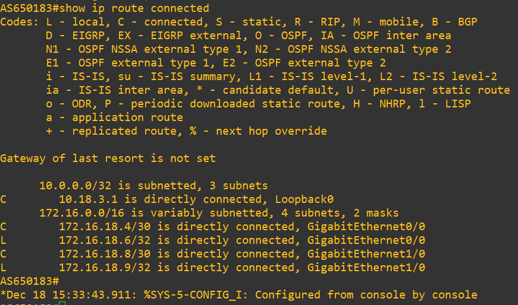

Figure. R3

## **Part C: Verification and Testing**

Perform comprehensive verification of your configuration.

1. Check BGP neighbor establishment on all routers

Command: `show ip bgp summary`

Neighbours are present. State is established, prefixes>0

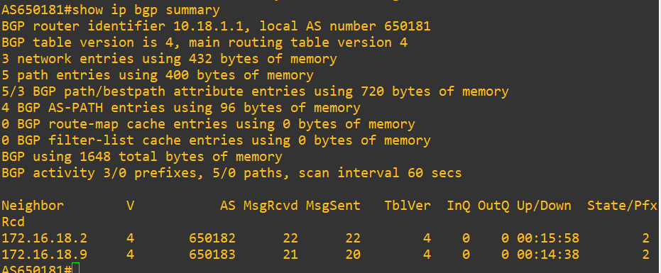

Figure. R1

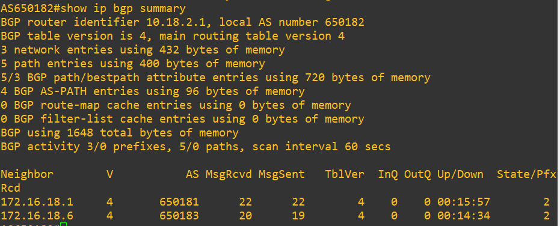

Figure. R2

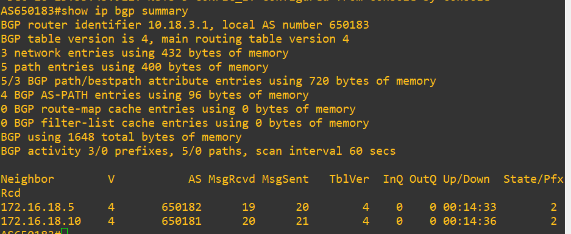

Figure. R3

1. Examine the BGP table to verify route learning

I examine correct AS pathes and all 3 internal loopbacks present, hops are right, weight is seen for each loopback network

Command:`show ip bgp`

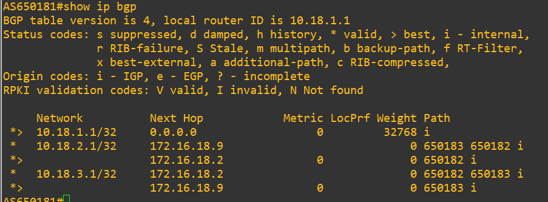

Figure. R1

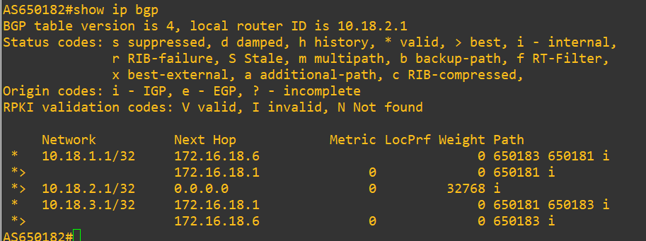

Figure. R2

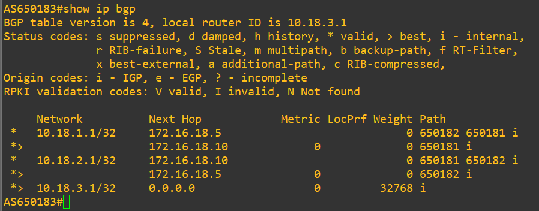

Figure. R3

1. Check the global routing table for BGP-learned routes

Command:`show ip route bgp`

BGP learned routes are present inside each node correspondingly.

For example for R3:

```
10.0.0.0/32 is subnetted, 3 subnets
B        10.18.1.1 [20/0] via 172.16.18.10
B        10.18.2.1 [20/0] via 172.16.18.5
```

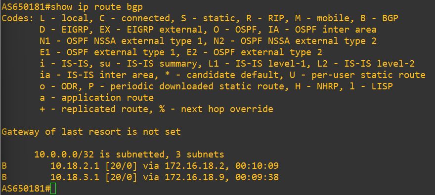

Figure. R1

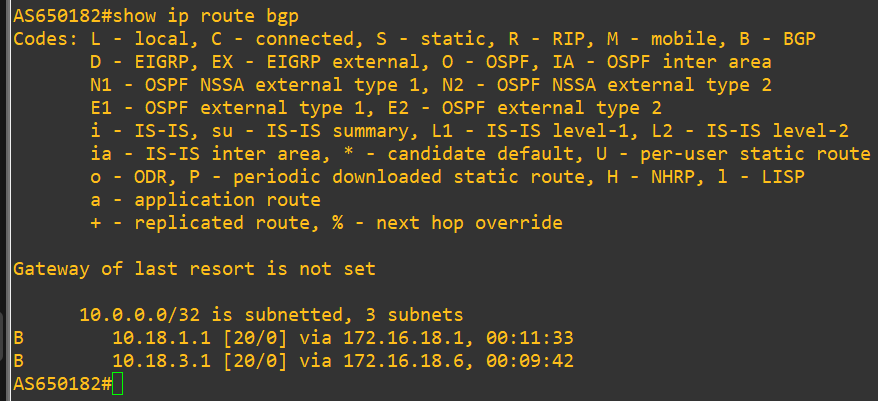

Figure. R2

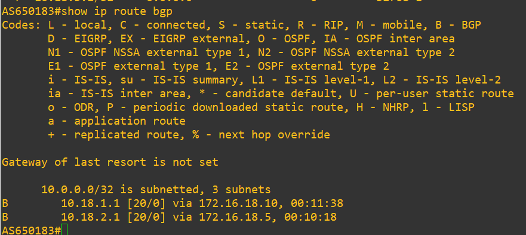

Figure. R3

1. Test connectivity between all loopback interfaces

Pinging to loopback neighbour networks is done:

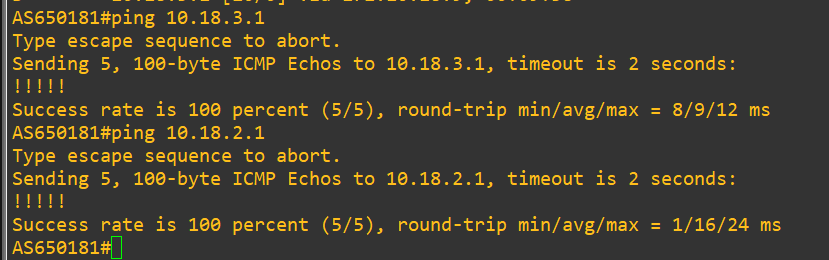

Figure. R1

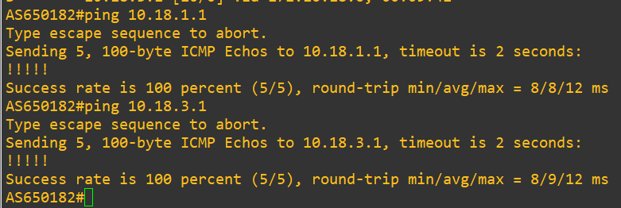

Figure. R2

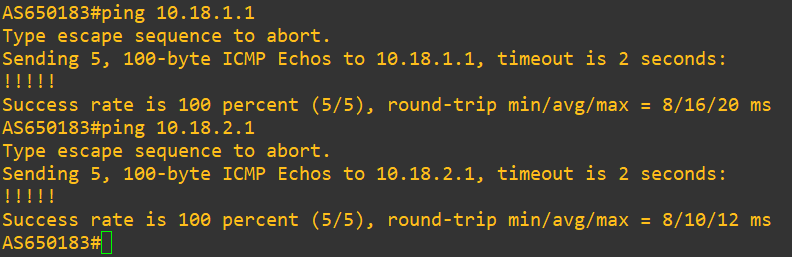

Figure. R3

1. Perform traceroute between different ASes to verify the path taken

Traceroutes show correct hopes and right addresses — topology match and no loops.

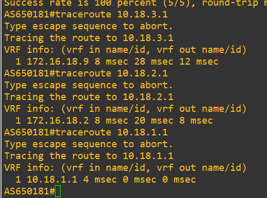

Figure. R1

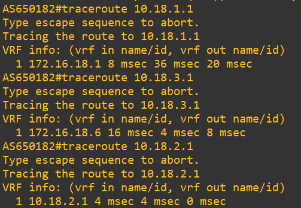

Figure. R2

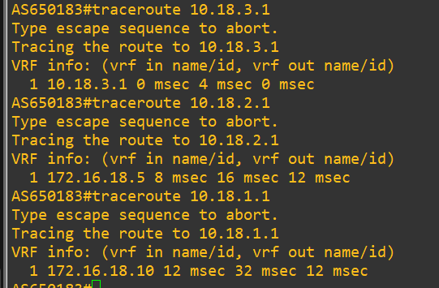

Figure. R3

> **What can cause a crush on a router?**
>
> Writing different IP address for a traceroute, e.g. for R3 write traceroute *10.18.3.2* instead traceroute *10.18.3.1*.
>
> Figure bellow shows, that traceroute process is not stopping and any exit commands from console do not work — only one options is to manually reload it.
>
> The second option is to wait, but what are limitations? 30*3 pings = 90 ping..
>
> Figure. Lagging `traceroute`
>
> 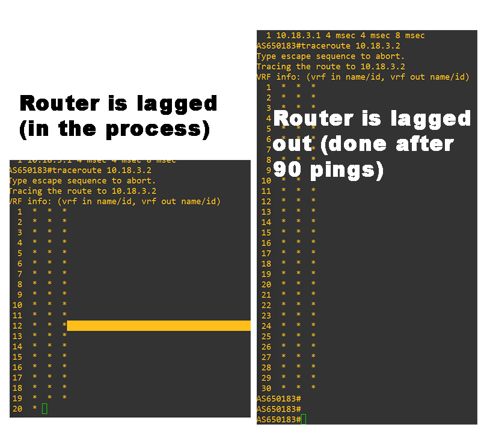

## Summary

Loopback interfaces are virtual and always up, so they are perfect for identifying a router. Even if a physical link goes down, the loopback address stays reachable. That’s why loopbacks are used as router IDs and for basic connectivity tests.

Subnets define how IP addresses are divided and used. Small subnets like /30 are used for links between routers, /28 represents a small network owned by an AS, and /32 is used for a single address such as a loopback. Writing and understanding subnet masks is essential here. This helps avoid wasting IP addresses and keeps the network structured.

BGP is the protocol, that exchanges routing information between ASes. It advertises only nets, that already exist on the router and allows each AS to announce which IP address ranges it owns. Together, loopbacks, subnetting, and BGP make inter-AS routing stable and reliable technique.
