# 1 Booting client from server (installing OS from the server)

Name of report: CIA_UNIX_LAB_1_Nikita_Niakhai
Course: Unix-based Internet Applications
Performed by Nikita Niakhai

---

## Task 1 - PXE Installation

### PXE Server Setup

1. I created the first virtual machine using VirtualBox (`PXESERVER`) and isolated a private network on my workstation.

Below on figure 1 configuration for image, name, memory, credentials.

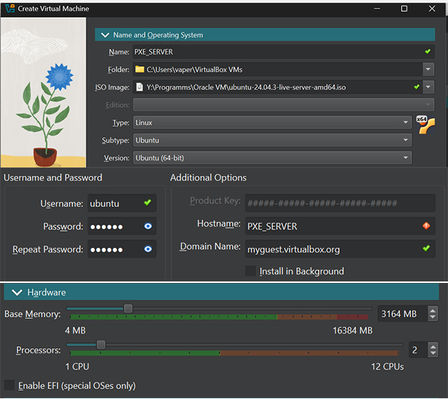

Figure 1. VM configuration

I used two network adapters, figure 2.

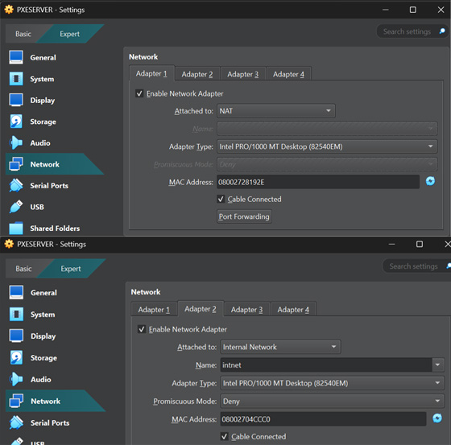

Figure 2. Network configuration

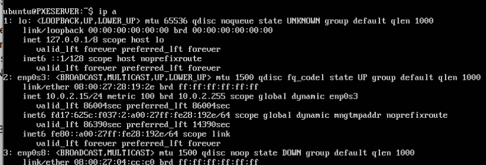

Figure 2. Network configuration (ip addresses of adapters)

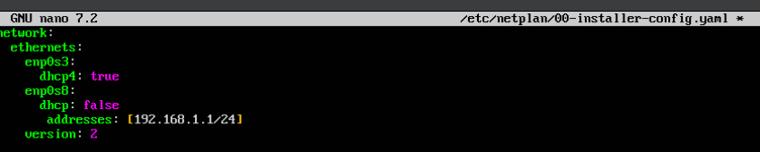

Figure 2. Network configuration (`netplan` configuration for DHCP (please note this version is with syntax errors, which I fixed later))

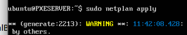

Figure 2. Network configuration (applying netplan configuration)

### Installing tools and packages

2. To set up some of the services, such as DHCP, TFTP, HTTP, NFS I used `dnsmasq.service`.

`sudo apt install dnsmasq-base`

`sudo apt install dnsmasq`

`sudo apt install apache2 net-tools unzip -y`

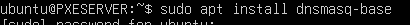

FIgure. Installing dnsmasq

I install `Ubuntu 22.04.5 live-server` ISO on the PXE server inside `/tmp` folder.

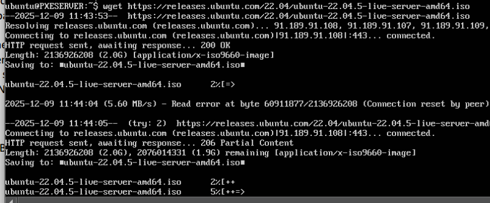

Figure.

Mount ISO and extract boot files to /srv/tftp/ubuntu/.

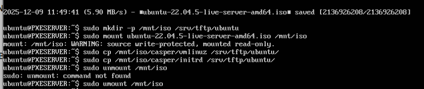

Figure. CLI for mounting ISO

Then I placed ISO in Apache directory for HTTP serving.


Figure. Apache dir `isos` is created

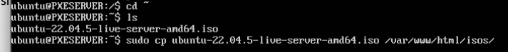

Figure. Copying iso to `isos` directory.

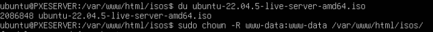

Figure. Permissions to `isos` directory.

Now I install a boot loader GRUB EFI and PXELINUX.

`sudo apt install syslinux-efi grub-efi-amd64-bin -y`

`sudo apt install grub-efi-amd64-signed grub-efi-amd64-bin -y`

`sudo apt install pxelinux`

Figure. CLI for copying bootloaders

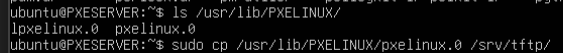

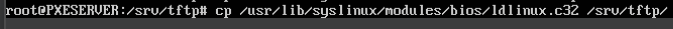

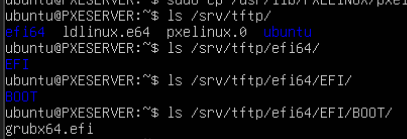

Figure 7 `/srv/tftp` folder

I created GRUB config (`/srv/tftp/grub/grub.cfg`).

`sudo mkdir -p /srv/tftp/grub`
`sudo nano /srv/tftp/grub/grub.cfg`

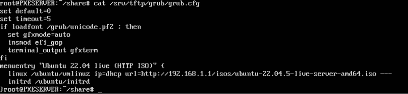

Figure 9 `grub` setup

Create PXELINUX config for BIOS understanding (/srv/tftp/pxelinux.cfg/default).

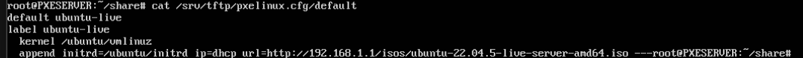

Figure. `PXELINUX` config

Established a folder for TFTP containing PXE netboot files.

Detailed config for PXE netboot with the link to ubuntu iso which is served on
apache2 web server. Ubuntu 22.04.05 server has been chosen as OS image. After
getting the initial boot files, PXE client will download image from Apache2 http
server and start the installation process

### `dnsmasq` service

Dnsmasq configuration is displayed below, operating on the internal adapter enp0s8 in the isolated network. Settings for DHCP and TFTP are defined. UEFI features are incorporated too.

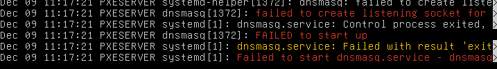

Figure. starting dnsmasq service (error)

Now I need to disable the service systemd-resolve that is on port 53 to start `dnsmasq`.

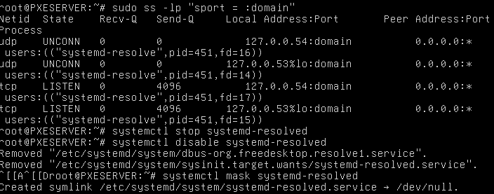

Figure. Resolving issue with dnsmasq

> To undo my actions I would run `sudo systemctl defaults systemd-resolved`,
>
> ```
> sudo systemctl unmask systemd-resolved
> sudo systemctl enable systemd-resolved
> sudo systemctl start systemd-resolved
>
> ```

I setup `dnsmasq` service and then configured it.

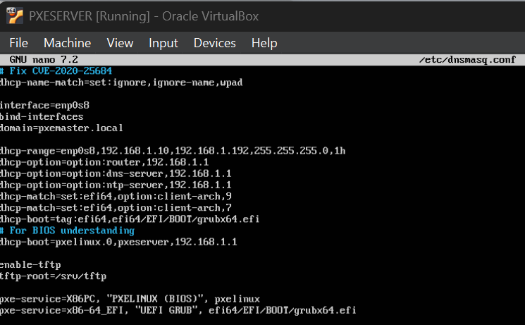

Figure. dnsmasq.conf

Then I restart: `sudo systemctl restart dnsmasq.service`

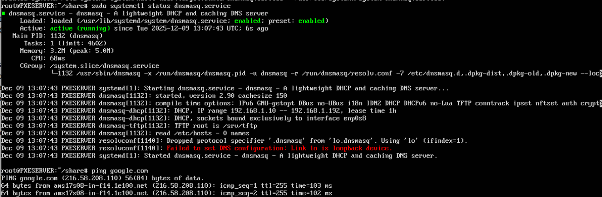

Figure. `dnsmasq.service`

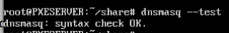

Figure. `dnsmasq.service` check

### Start Apache.

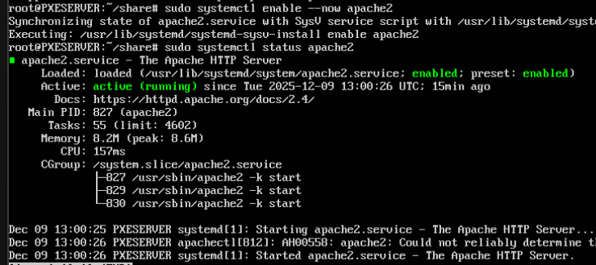

Figure. Apache started

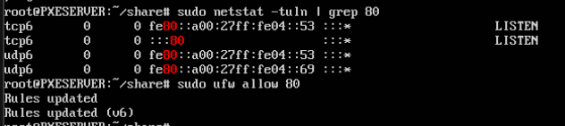

Figure. Avoid any conflicts to access apache.

In-depth setup for PXE netboot including a reference to the Ubuntu ISO hosted on the apache2 web server. Ubuntu 22.04.5 server was selected as the OS image. Following the acquisition of the starting boot files, the PXE client will fetch the image from the Apache2 HTTP server and begin the setup procedure.

1.2.1. Write about each service’s role in the PXE environment.

PXE server is a preboot execution environment (”pixie”), that allows booting OS on connected nodes (PCs) from the main Server directly - a different approach to the one manual, where we boot OS from the hard disk of a machine.

PXE server is a client-server interface.

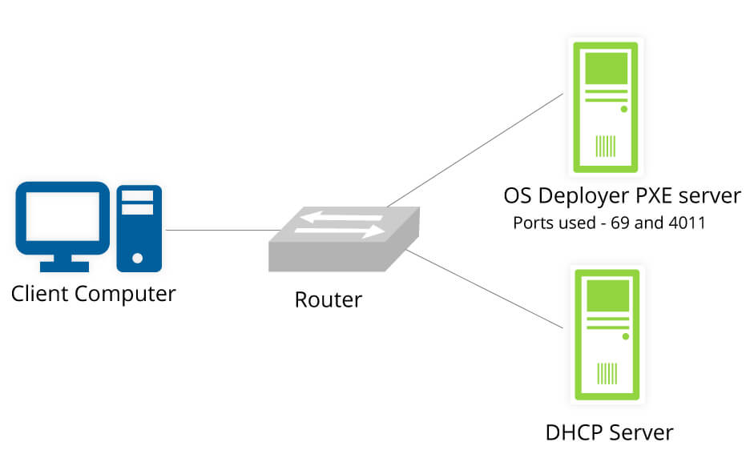

Figure. PXE architecture

1.3. Question: why not run your DHCP service on the SNE network directly?

Introducing a secondary DHCP server into an established network that already has a DHCP server could result in duplicate responses to DHCPDISCOVER queries from clients, and clients might experience disconnections due to ARP disputes.

### PXE Client Setup

The client will automatically obtain an IP address from the DHCP server within the same isolated network as the PXE server. Afterward, the client retrieves netboot files from the PXE server through TFTP.

1.  I created the second virtual machine using VirtualBox in order to test the PXE
service.

It is important to note that I created empty VM: without an image, figure.

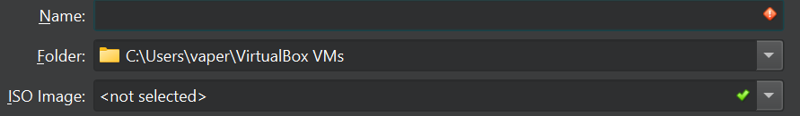

Figure. Config for Client VM

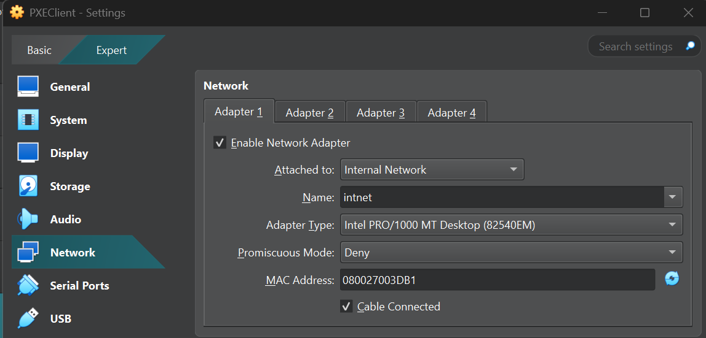

Figure. PXE client network adapter

1. Change the boot order

    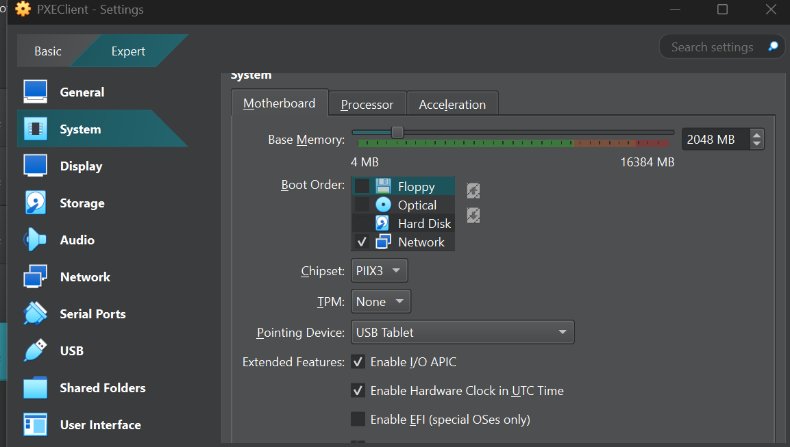

Figure. Chosen only network boot choice for PXE client

1. Show that your PXE client takes the IP, Figure PXE boot, client obtains IP from DHCP

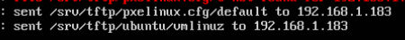

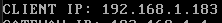

Figure. IP of client machine obtained from DHCP

1. Boot and install a new system with it and show the proof in the report.

    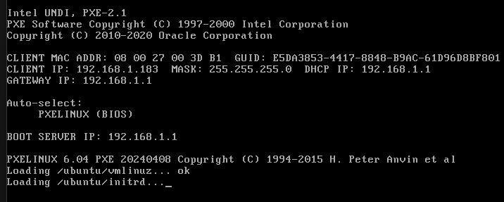

    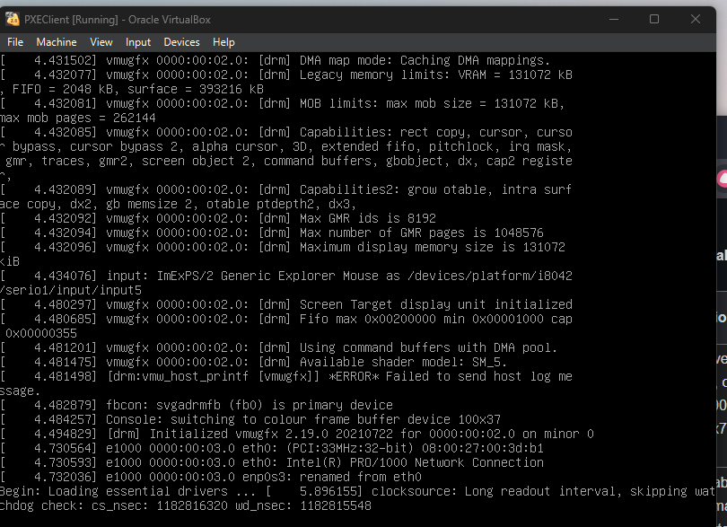

    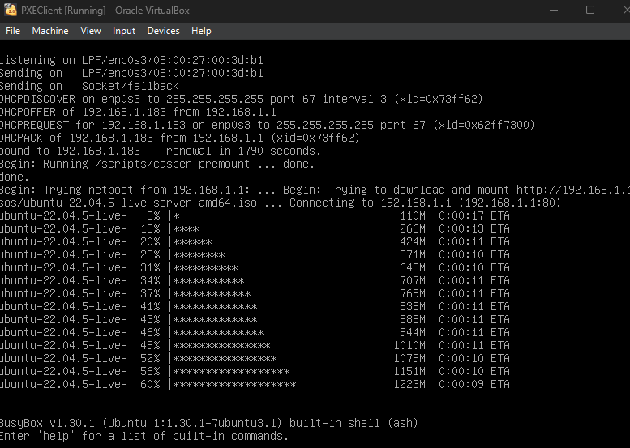

Figure. Booting and downloading image of OS on client machine

Upon choosing the installation choice, the image began downloading. As the disk remains unformatted, the image loads straight into RAM, requiring adequate RAM in the machine for a successful OS installation. The Ubuntu 22.04.5 server image is approximately 2GB, so I allocated 8GB to the client machine as a precaution.

Following that, the installation commenced.

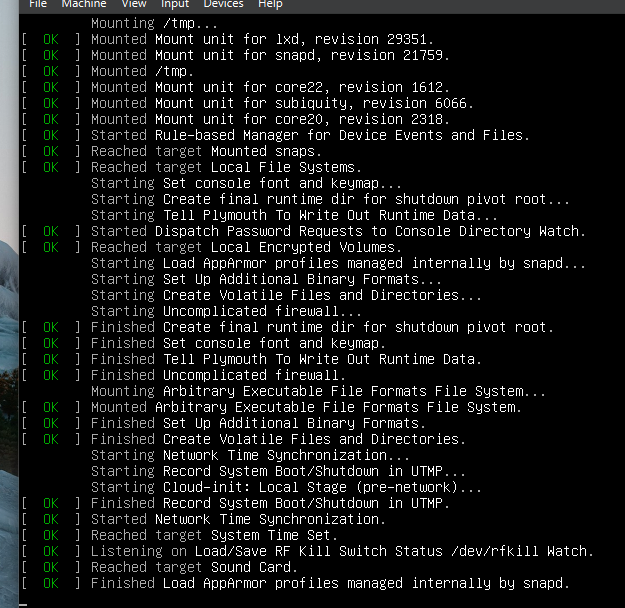

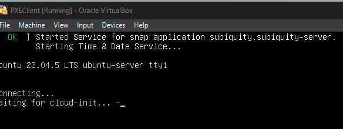

Figure. Early installation steps

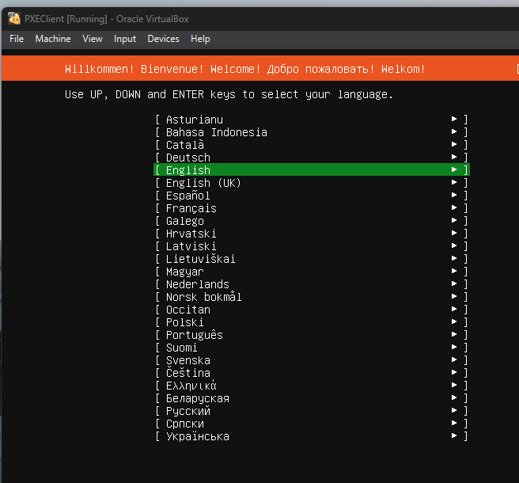

Figure. Language choice screen in installation

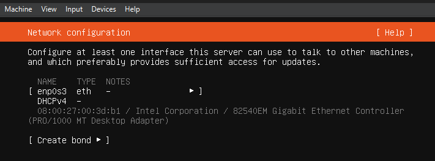

Figure. Network configuration.

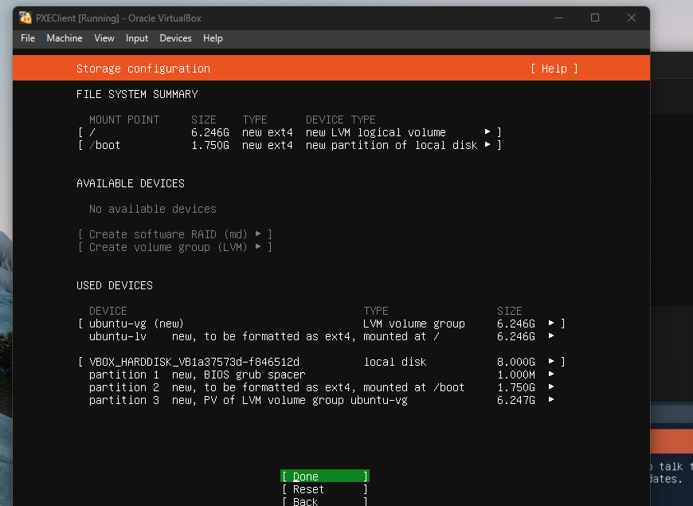

Figure. Disk setup screen

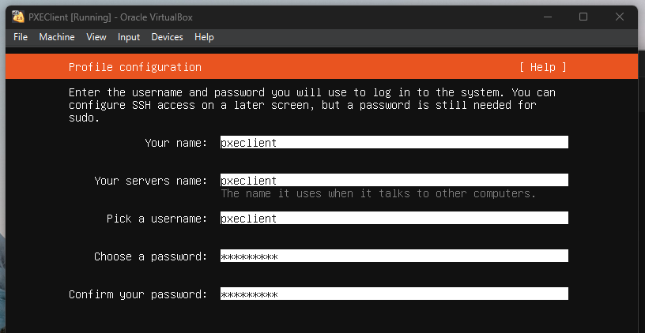

Figure. User profile setup

After some time, the installation finished without issues.

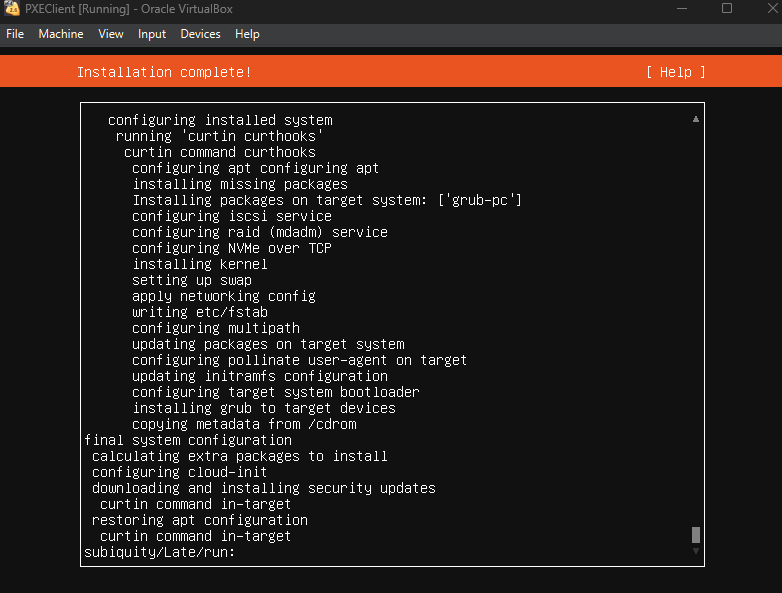

Figure. Installation success

Next, I restarted the machine from the hard drive to confirm the client's OS is functioning properly.

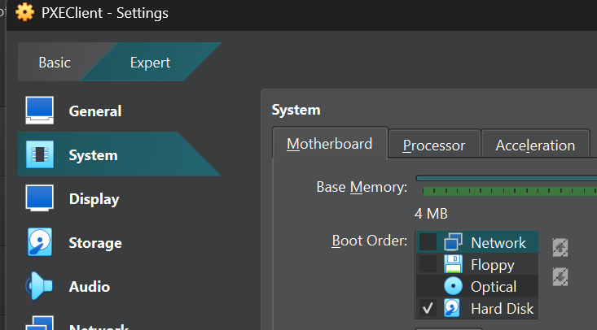

Figure. Started up the machine from hard disk

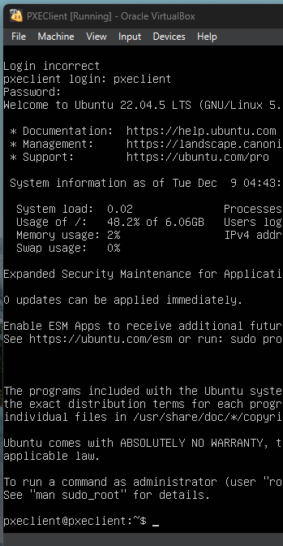

Figure. Successfully logged in client machine.

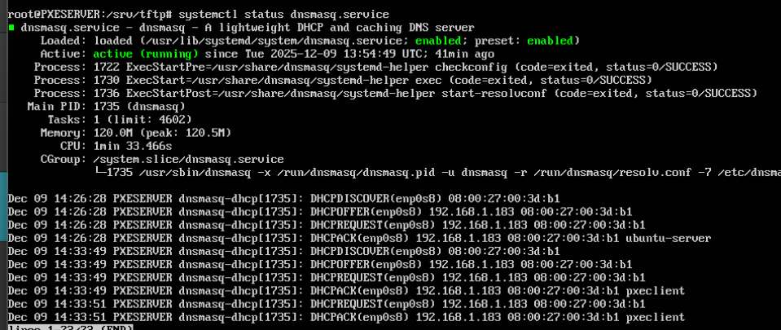

Figure. Status of `dnsmasq.service`

## Task 2 - Questions to answer

1. Briefly explain UEFI with secure boot enabled, UEFI without secure boot, and BIOS PXE
booting approaches.
1.1. How do they work? Explain with a simple diagram.

    UEFI without secure boot offers identical UEFI functions and startup sequence, but skips signature validations, permitting unsigned loaders or modified kernels to proceed.
    BIOS PXE relies on traditional firmware to obtain a network boot application and OS installer. It depends on DHCP/TFTP details transmitted over the connection, without inherent verification or protection for the boot application or following data, allowing unauthorized servers or intercepts to deliver malicious boot content.

    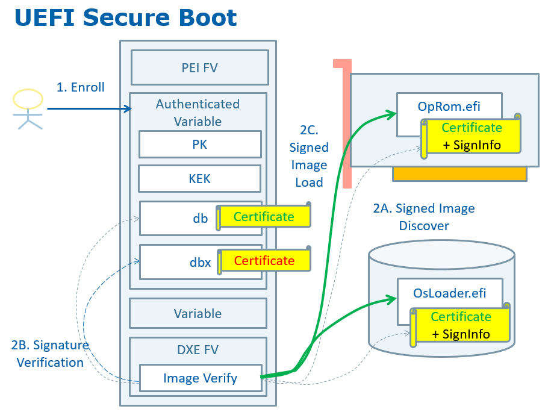

    Figure. Secure boot flow

    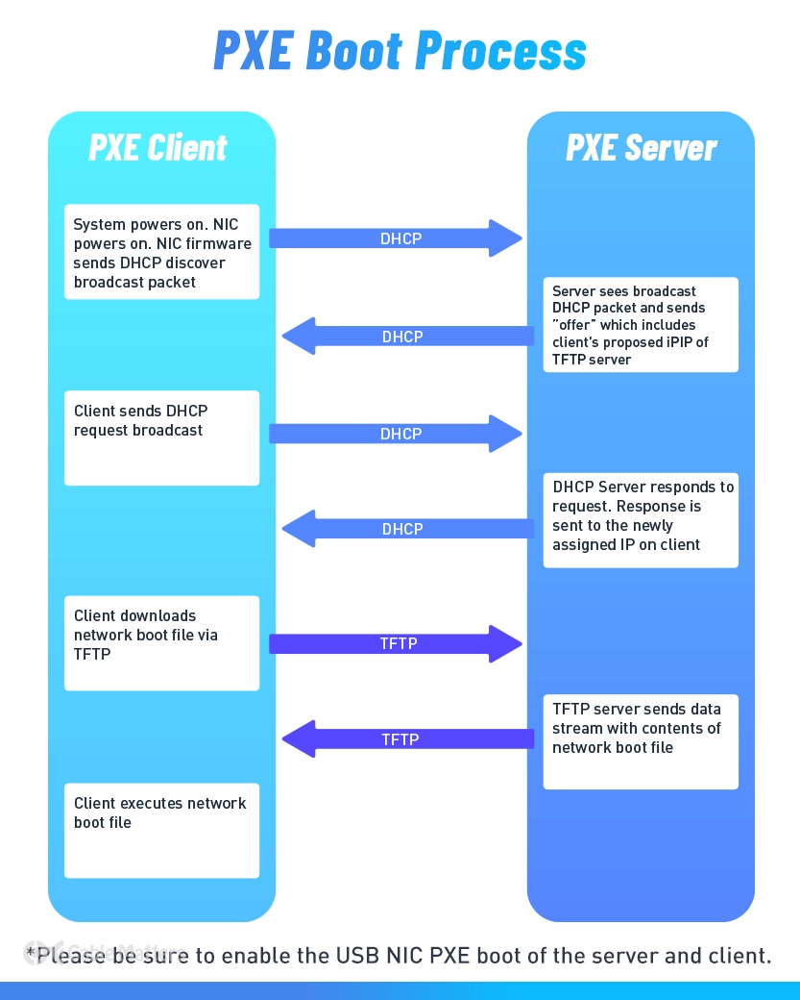

    Figure. PXE boot flow

2. What is a GPT?
2.1. What is its general layout? Explain each element. What is the role of a partition table?

GPT represents the GUID Partition Table, a contemporary disk partitioning method that supersedes MBR, and forms part of UEFI.

The GPT employs a current Logical Block Addressing system. Inherited from its forerunner, LBA 0 holds the MBR, with the Primary GPT Header at LBA 1. After the GPT Header comes the partition table proper.

Overall structure:

- protective MBR (LBA 0): a basic MBR featuring one "protective" partition record spanning the disk to stop outdated MBR-only utilities from damaging GPT disks; it indicates GPT usage without actual partition info;
- primary GPT header (LBA 1): includes disk GUID, available LBAs, positions/sizes of the partition record array, and CRC32 checks for header and records to identify errors; this serves as the main guide at the disk's beginning;
- partition record array (LBAs 2–33): a collection of uniform-size records outlining each partition: type GUID, distinct GUID, start and end LBAs, flags, and UTF-16 label;
- partitions (storage areas): the real data zones specified by the records, like an EFI System Partition (FAT32 for UEFI startup), OS, swap, backup, etc.;
- secondary partition record array and secondary GPT header (disk end): duplicate of the records and an alternate header at the final LBAs, allowing restoration if primary GPT data is corrupted.

The partition table acts as the definitive guide to the start and end points of each partition, its category, identifier, and properties, enabling firmware, loaders, and OS to find boot areas and filesystems while avoiding conflicts.

1. What is gdisk?
3.1. How does it work? What can you do with it? Provide a simple practice.

gdisk is a console-based partitioning utility from the GPT fdisk collection for generating, examining, and fixing GUID Partition Table (GPT) disks.

    When launched, gdisk tries to detect the partitioning type on the disk. If valid GPT data is found, gdisk utilizes it.
    It loads current disk metadata (protective MBR, primary GPT header, partition array, backup header), confirms CRC32 checks, and imports the table into memory for editable sessions that are only saved upon explicit approval.
    It can convert legacy MBR partitions to GPT automatically.

    gdisk primarily enables viewing, adding, removing, or adjusting GPT partitions, and modifying partition details.
    Additionally, you can switch between formats, save and load GPT metadata, and conduct repair actions on tables.

    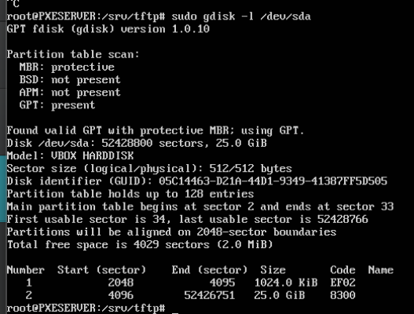

    Figure. `gdisk` display

2. What is a Protective MBR and why is it in the GPT?

    A Protective MBR is a simple Master Boot Record located at LBA 0 on a GPT disk that provides compatibility for older tools so they do not view the drive as blank or corrupt GPT data.

## Task 3 - Partitions

1. Verify the GPT schema of your Ubuntu machine.

    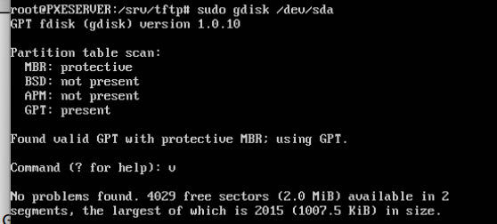

Figure. Confirming GPT format

1. Use the dd utility to dump the Protective MBR and GPT into a file in your home
directory. The dump should contain up to first partition entry (Inclusive).

    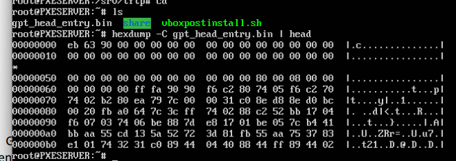

    Figure. Generating GPT dump using `dd`

    I used `cp` and shared folder to download this dump file to my host machine.

2. Load the dump file into a hex dump utility (e.g. 010 editor) to look at the raw data in
the file.

    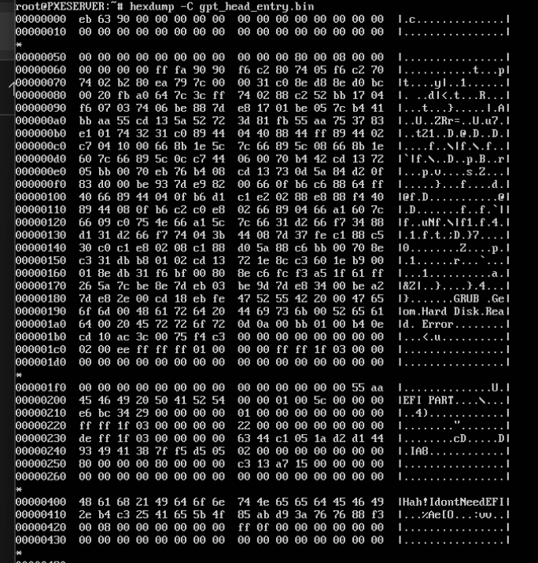

    Figure. Import GPT dump to hexdump

3. Understand and fully annotate the Protective MBR, GPT header

4.1. At what byte index from the start of the disk do the partition table entries start?

Records begin at LBA 2 at 1024 bytes or 0x400 position.

4.2. At what byte index would the partition table start if your server had a so-called
“4K native” (4Kn) disk?

For a 4Kn disk, sectors are 4096 bytes, so LBA2 starts at 8192 bytes or 0x2000 position.

| Offset (hex) | Field | Bytes (hex) | Value (LE) | Description |
| --- | --- | --- | --- | --- |
| `0x000 - 0x1BD` | x86 startup code section | (varies) | — | MBR bootstrap / manufacturer message / standard loader area |
| `0x1BE - 0x1CD` | Partition Record 0 (MBR entry) | `02` `00` `00` `00` … (full entry follows) | boot flag = `0x02` (decimal 2) | Boot flag 0x02 = non-startable in CHS context (as given) |
| (inside PartRec0) | start CHS | `00 ee ff` | — | Traditional CHS start bytes |
| (inside PartRec0) | partition type (category) | `EE` | — | `0xEE` = GPT protective MBR partition |
| (inside PartRec0) | end CHS | `ff ff ff` | — | CHS end = fully extended / not meaningful for large disks |
| (inside PartRec0) | start LBA (4 bytes, LE) | `01 00 00 00` | `1` | Partition begins at LBA 1 (protects GPT at LBA 1) |
| (inside PartRec0) | sectors count (4 bytes, LE) | `ff ff ff 04` | `0x04FFFFFF` = **83,886,079** | Number of sectors in partition → covers almost entire disk (≈40 GiB example) |
| `0x1CE - 0x1FD` | Partition Records 1–3 | `00 … 00` (all zero) | — | Unused / empty MBR partition entries |
| `0x1FE - 0x1FF` | MBR signature | `55 AA` | — | MBR magic marker (BIOS/MBR detection) |
| **Primary GPT header** (LBA 1, bytes 512–1023) | — | — | — | — |
| `0x200 - 0x207` | GPT signature | `45 46 49 20 50 41 52 54` | ASCII `"EFI PART"` | GPT header marker |
| `0x208 - 0x20B` | Version | `00 00 01 00` | `0x00000100` = 1.0 | GPT header version 1.0 |
| `0x20C - 0x20F` | Header length | `5C 00 00 00` | `0x5C` = **92** | Header size = 92 bytes |
| `0x210 - 0x213` | Header CRC32 | `1C DE E0 C6` | — | CRC32 of header (with CRC field zeroed when computed) |
| `0x214 - 0x21B` | Reserved | `00 … 00` | — | Must be zero |
| `0x21C - 0x223` | Current LBA (header LBA) | `01 00 00 00 00 00 00 00` | **1** | Primary GPT header located at LBA 1 |
| `0x224 - 0x22B` | Alternate LBA (backup header) | `FF FF FF 04 00 00 00 00` | `0x00000004FFFFFF` = **83,886,079** | Backup header located at disk end (same as sectors count) |
| `0x22C - 0x233` | First usable LBA | `22 00 00 00 00 00 00 00` | **34** | First LBA usable for partitions (LBA 34) |
| `0x234 - 0x23B` | Last usable LBA | `DE FF FF 04 00 00 00 00` | `0x00000004FFFFFDE` = **83,886,046** | Last usable LBA for partitions |
| `0x23C - 0x24B` | Disk GUID | `23 A3 11 D8 27 0D 92 4C 99 FE 23 91 49 91 C3 C8` | — | Disk unique GUID (16 bytes) |
| `0x24C - 0x253` | Partition entries starting LBA | `02 00 00 00 00 00 00 00` | **2** | Partition array begins at LBA 2 |
| `0x254 - 0x257` | Number of partition entries | `80 00 00 00` | **128** | Count of partition records in the array |
| `0x258 - 0x25B` | Size of each partition entry (bytes) | `80 00 00 00` | **128** | Each partition record is 128 bytes |
| `0x25C - 0x25F` | Partition array CRC32 | `7F E4 09 02` | — | CRC32 over the whole partition array |
| `0x260 - 0x3FF` | Reserved | (zeros / reserved) | — | Space reserved by header |
| **First GPT partition record** (LBA 2, bytes 1024–1151) | — | — | — | First 128-byte partition entry |
| `0x400 - 0x40F` | Partition type GUID | `48 61 68 21 49 64 6F 6E 74 4E 65 65 64 45 46 49` | — | Partition type / category GUID (16 bytes) |
| `0x410 - 0x41F` | Unique partition GUID | `4F A4 29 34 97 8C 8A 43 80 0E 1D 6F 98 4D 52 8B` | — | Unique GUID for this partition |
| `0x420 - 0x427` | Partition first LBA | `00 08 00 00 00 00 00 00` | **2048** | Partition starts at LBA 2048 |
| `0x428 - 0x42F` | Partition last LBA | `FF 0F 00 00 00 00 00 00` | **4095** | Partition ends at LBA 4095 |
| `0x430 - 0x437` | Attribute flags | `00 … 00` | 0 | Partition attribute bits = 0 |
| `0x438 - 0x47F` | Partition label (UTF-16LE) | `00 … 00` | — | Human-readable label (all zeros = empty) |

4.3 Name two differences between primary and logical partitions in an MBR partitioning
scheme.

In an MBR partitioning system, up to four primary partitions are allowed, but one can be designated as “extended” to serve as a holder for logical partitions. Logical partitions have no quantity limit. Another key distinction is that OS can only be placed on primary partitions, which are directly startable.

## References

1. PXE server : <https://www.manageengine.com/products/os-deployer/pxe-preboot-execution-environment.html#:~:text=A%20Preboot%20Execution%20Environment%20> (PXE,a%20CD%20or%20hard%20disk.
2. `dnsmasq` configuration : <https://wiki.archlinux.org/title/Dnsmasq>
3. Diagrams: <https://tianocore-docs.github.io/Understanding_UEFI_Secure_Boot_Chain/draft/secure_boot_chain_in_uefi/uefi_secure_boot>
4. MBR: <https://en.wikipedia.org/wiki/Master_boot_record>

### GPT prompt to assist

````bash
You are my technical assistant for creating and executing university-level Unix/Linux labs.  
You must always produce:

1. A concise but complete **lab plan**  
2. All required **Bash scripts**, always full working code, never placeholders  
3. Exact **commands** step-by-step  
4. Clear **expected outputs**  
5. **Troubleshooting guidance** for every step  
6. Explanations written in a strict, logical, no-nonsense tone

### Environment assumptions
- Host: Ubuntu Server 22.04  
- Virtualization: VirtualBox  
- Guest VMs are clean Ubuntu Server installations  
- Networking is configurable (NAT/bridged/host-only)  
- I provide an input text file with tasks

### When I send you a task file:
1. Rewrite the tasks into a clean, structured lab plan  
2. Generate all required scripts in full  
3. Provide complete setup instructions  
4. Highlight mistakes or missing information (without guessing)  
5. Create a final checklist I can follow during execution

### Output formatting rules
- Start with a **TL;DR summary**  
- Use detailed step-by-step reasoning  
- Put all commands, configs, or scripts inside fenced code blocks like:

```bash
# Example command block
sudo apt update
````

### Do NOT:
- Use placeholders
- Produce incomplete scripts
- Skip critical context
- Be vague

Wait for me to provide the input file to begin.
