# 2 DNS Deployment Delegation

Name of report: CIA_UNIX_LAB_2_Nikita_Niakhai
Course: Unix-based Internet Applications
Performed by Nikita Niakhai

---

## **Part 1: Installing BIND9 DNS Server**

### **Task 1.1: Install BIND9 Package**

1. Downloaded, installed ISO for Ubuntu servers 24.04.3 LTS []. Named machines:
    1. `ns1` - Primary DNS server -
        1. IP: `192.168.100.10`
    2. `ns2` - Secondary DNS server -
        1. IP: `192.168.100.11`
    3. `ns3` - Delegated subdomain DNS server -
        1. IP: `192.168.100.12`
    4. 11 GB disk space, 3164 MB RAM, 1 processor
2. Configured Network settings on each machine to use **Adapter 1: Host-only Adapter (VBoxNet0).**
    1. Alternately, to access Internet I will use **NAT adapter**
3. Configured bidirectional copy-paste on all machines. ****
4. Updated packages and installed needed ones.
    1. Had problem accessing root user via `su -`, but tried `sudo -i` and it worked.

```bash
# Entered root user
sudo -i

# Update package repositories

sudo apt update && apt upgrade -y && reboot

# Install BIND9 and related utilities

apt --fix-broken install

sudo apt install bind9 bind9utils bind9-doc dnsutils -y

# Verify BIND9 installation

named -v
```

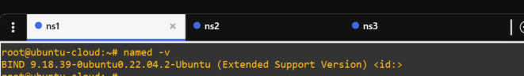

**Expected Output:** BIND version information should be displayed (e.g., BIND 9.18.x).

> 🔴
>
> Problem 1: After executing default updates and upgrades my VMs stop working, black screens. I tried reinstalling images and VMs with more disk space, memory - but the same error.
>
> Solution: I gave up using Virtual Box and opened GNS3 with GNS3 VM where I deployed 3 clients, connected them to 2 switches , figure 1,2.
>
> `ens3` - to access to enternet (interface switch1)
>
> `ens4` - to access LAN

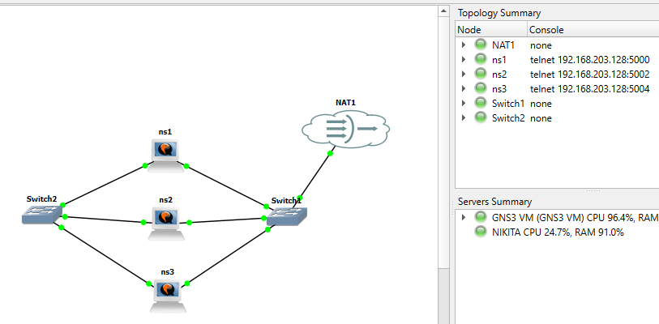

Figure 1. Topology with Internet Access

1. Connected each machine to the switch, edit `interfaces` file where I added IP of my Virtual Network connected to the internet, figure 3,4.

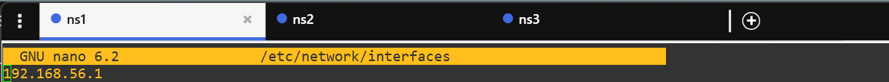

Figure 3. Configuration on each machine to access internet, part 1

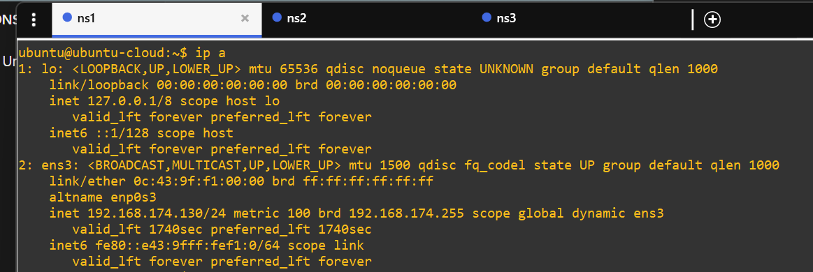

Figure 4. Configuration on each machine to access internet, part 2

> 🔴
>
> Problem 2: No space available on nodes.
>
> `lsblk` is used to check disk space
>
> Solution: Increased RAM to 2048 MB and Disk Space to 11gb on each node, rebooted. Increase memory on GNS3VM

1. Configured static IP addresses using netplan

```bash
sudo nano /etc/netplan/01-netcfg.yaml

network:
  version: 2
  ethernets:
    ens3:
      dhcp4: yes
    ens4:
      dhcp4: no
      addresses:
        - 192.168.100.10/24

sudo chmod 600 /etc/netplan/01-netcfg.yaml

sudo netplan apply
```

**Task 1.2: Understanding BIND9 Directory Structure**

**Task 1.3: Configure DNS Server Options**

Edit the options configuration file on **Server 1, figure 5**:

```bash
acl "trusted" {
    192.168.100.0/24;   # Allow queries from local network
    localhost;
    localnets;
};

options {
    directory "/var/cache/bind";

    # Allow queries from trusted networks only
    allow-query { trusted; };

    # Disable recursion for authoritative-only server

    recursion no;

    # Listen on IPv4 only
    listen-on { 192.168.100.10; 127.0.0.1; };

    listen-on-v6 { any; };

    # Disable zone transfers by default
    allow-transfer { none ; };

    # DNSSEC validation
    dnssec-validation auto;

    # Forwarders (optional, for external queries)
    forwarders {
       8.8.8.8;
       8.8.4.4;
    };

};
```

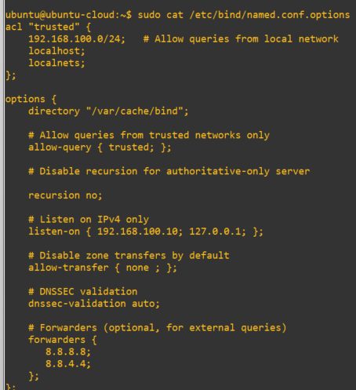

Figure 5. Configuration for DNS server (`ns1`) config

**Task 1.4: Verify Configuration Syntax, figure 6**

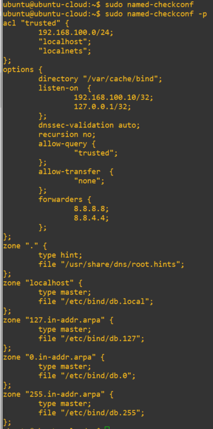

Figure 6. Check for syntax error: no errors are displayed, the configuration is syntactically correct.

### **Part 2: Creating Primary DNS Zone**

**Task 2.1,2.2: Define Forward and Reverse  Zones**

Edit the local zones configuration on **Server 1**:

```bash
zone "example.lab" {
    type master;
    file "/etc/bind/zones/db.example.lab";
    allow-transfer { 192.168.100.11; }; # Allow transfer to ns2
    notify yes;
};

zone "100.168.192.in-addr.arpa" {
    #reverse lookup zone

    type master;
    file "/etc/bind/zones/db.192.168.100";
    allow-transfer { 192.168.100.11; };
    notify yes;
};
```

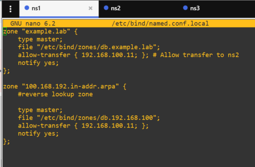

Figure 7. zone config file

**Task 2.3: Created Zone Files Directory**

**Task 2.4: Create Forward Zone File**

Create and edit the forward zone file:

`sudo nano /etc/bind/zones/db.example.lab`

Add the following content:

```bash
$TTL    86400
@       IN      SOA     ns1.example.lab. admin.example.lab. (
                     2025120201 ; Serial (YYYYMMDDNN)
                     3600       ; Refresh (1 hour)
                     1800       ; Retry (30 minutes)
                     604800     ; Expire (1 week)
                     86400 )    ; Negative Cache TTL (1 day)

; Name Servers
@       IN      NS      ns1.example.lab.
@       IN      NS      ns2.example.lab.

; A Records for Name Servers
ns1     IN      A       192.168.100.10
ns2     IN      A       192.168.100.11

; Mail Exchange Record
@       IN      MX 10   mail.example.lab.

; Host A Records
www     IN      A       192.168.100.20
mail    IN      A       192.168.100.25
ftp     IN      A       192.168.100.30
db      IN      A       192.168.100.35

; Alias (CNAME) Records
webmail IN      CNAME   www.example.lab.
smtp    IN      CNAME   mail.example.lab.

; Delegation for subdomain
dept    IN      NS      ns3.example.lab.
ns3     IN      A       192.168.100.12
```

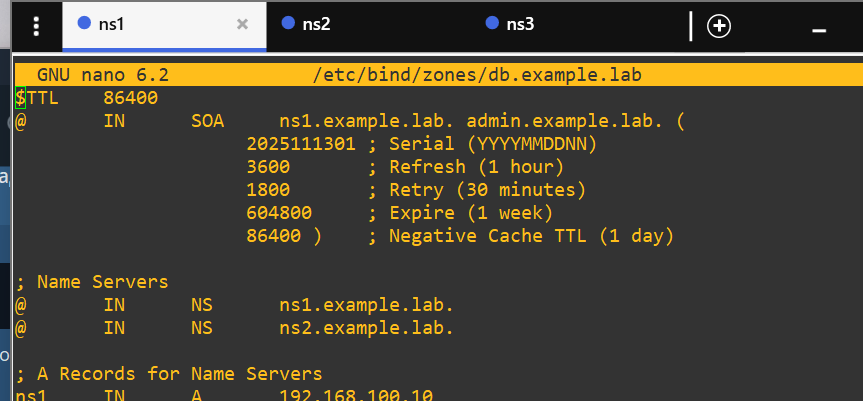

Figure 8. forward zone config file

$TTL: Default time-to-live for records (in seconds)
SOA Record: Start of Authority - defines zone properties
NS Records: Nameserver records identifying authoritative servers
A Records: Maps hostnames to IPv4 addresses
MX Record: Mail exchange server with priority
CNAME Records: Canonical name (alias) records
Delegation Records: NS and glue A records for subdomain delegation

**Task 2.5: Create Reverse Zone File**

`sudo nano /etc/bind/zones/db.192.168.100`

Add the following content:

```bash
$TTL    86400
@       IN      SOA     ns1.example.lab. admin.example.lab. (
                     2025120201 ; Serial (incremented from forward zone)
                     3600       ; Refresh
                     1800       ; Retry
                     604800     ; Expire
                     86400 )    ; Negative Cache TTL

; Name Servers
@       IN      NS      ns1.example.lab.
@       IN      NS      ns2.example.lab.

; PTR Records
10      IN      PTR     ns1.example.lab.
11      IN      PTR     ns2.example.lab.
12      IN      PTR     ns3.example.lab.
20      IN      PTR     www.example.lab.
25      IN      PTR     mail.example.lab.
30      IN      PTR     ftp.example.lab.
35      IN      PTR     db.example.lab.
```

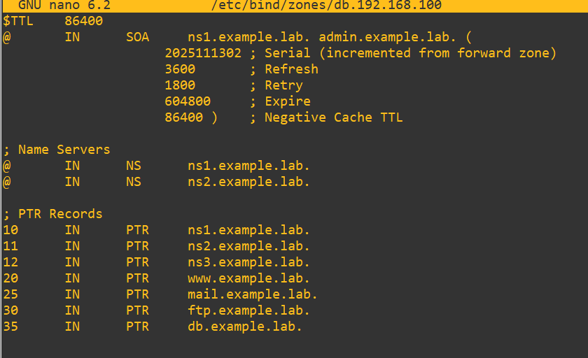

Figure 9. reverse zone config file

**Task 2.6: Validate Zone Files**

Check zone file syntax using `named-checkzone`, figure 11,12:

# Check forward zone

`sudo named-checkzone example.lab /etc/bind/zones/db.example.lab`

# Check reverse zone

`sudo named-checkzone 100.168.192.in-addr.arpa /etc/bind/zones/db.192.168.100`

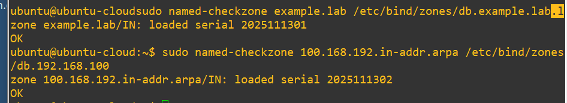

Figure 10. Validation log part 1

I fixed Serial to current date and fixed error, figure 11, 12.

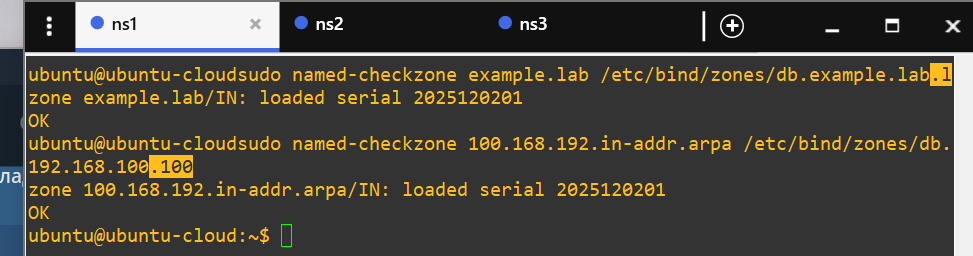

Figure 11. Validation log part 1

**Task 2.7: Restart BIND9 Service**

# Restart the service

`sudo systemctl restart bind9`

# Check service status

`sudo systemctl status bind9`

# Enable autostart on boot

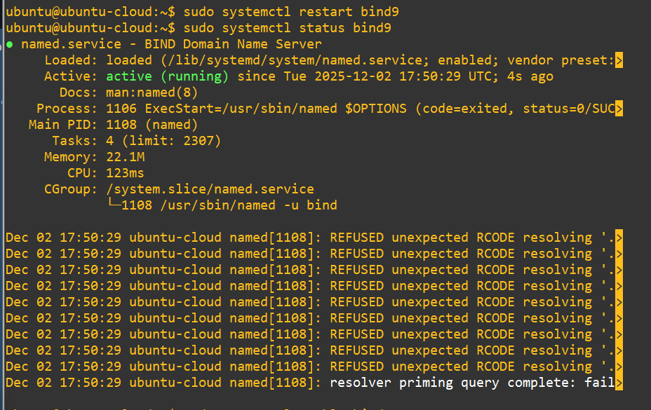

Figure 12. Refresh the bind9 server - command log

### **Part 3: Configuring Secondary (Slave) DNS Server**

**Task 3.1: Configure Secondary Server Options**

On **Server 2 (ns2)**, edit the options file:

`sudo nano /etc/bind/named.conf.options`

I adjusted the listen-on address, figure 13.

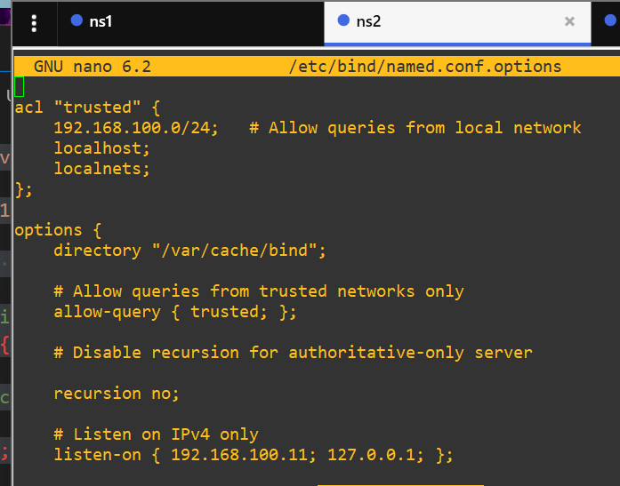

Figure 13. Server 2 - config for DNS

**Task 3.2: Define Secondary Zones**

Edit the local zones configuration:

sudo nano /etc/bind/named.conf.local

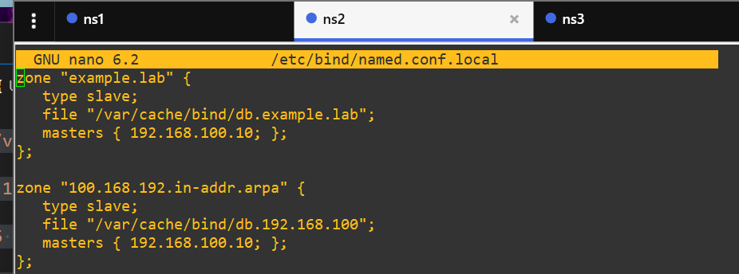

Figure 14. Server 2 - local zone config

```bash
zone "example.lab" {
   type slave;
   file "/var/cache/bind/db.example.lab";
   masters { 192.168.100.10; };
};

zone "100.168.192.in-addr.arpa" {
   type slave;
   file "/var/cache/bind/db.192.168.100";
   masters { 192.168.100.10; };
};
```

**Task 3.3: Restart Secondary Server**

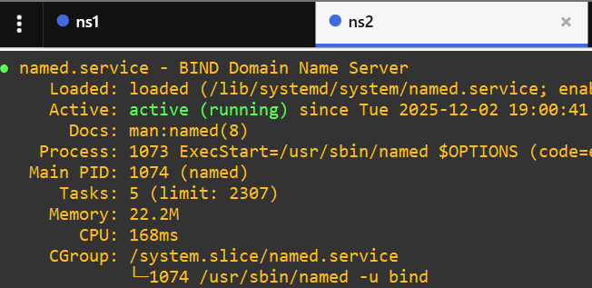

Figure 15. BIND9 service is running on server 2

**Task 3.4: Verify Zone Transfer**

I Check that zones were transferred successfully, figure 16:

# Check syslog for transfer messages

`sudo tail -f /var/log/syslog | grep named`

# Verify zone files were created

`ls -la /var/cache/bind/`

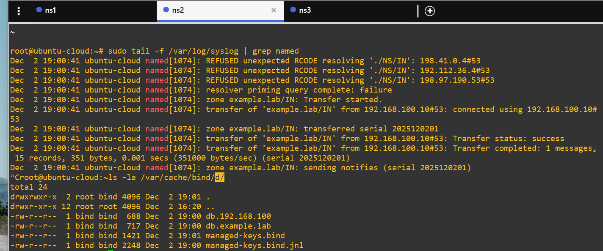

Figure 16

**Task 3.5: Manual Zone Transfer Testing**

From **Server 2**, I manually requested a zone transfer, figure 17:

`dig @192.168.100.10 example.lab AXFR`

**AXFR (Full Zone Transfer):** Transfers the complete zone file from master to slave

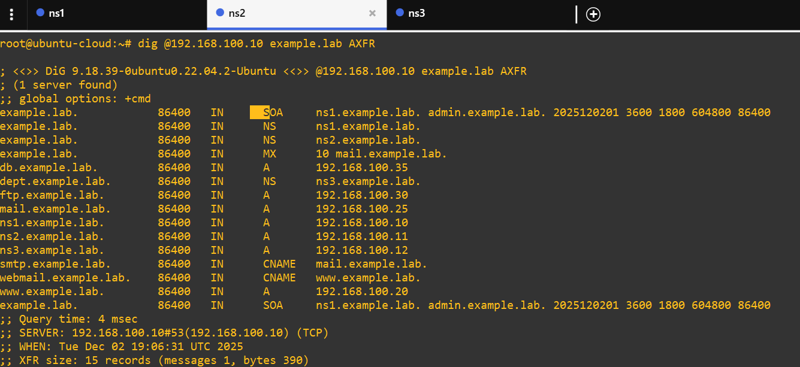

Figure 17. Log for transfering complete zone file on server 2 from server 1 (master)

### **Part 4: Implementing DNS Delegation**

**Task 4.1: Understanding Delegation Concepts**

**Task 4.2: Install BIND9 on Delegated Server, figure 18**

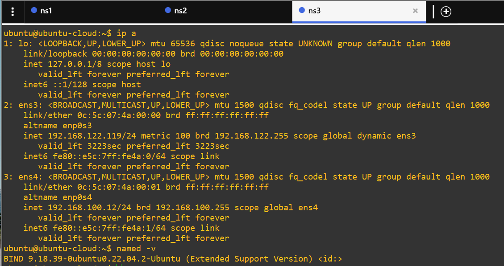

Figure 18. Configuration for server 3 (ip on ens4 / bind server)

**Task 4.3: Configure Delegated Subdomain Zone**

On **Server 3**, I edited the options file, figure 19.

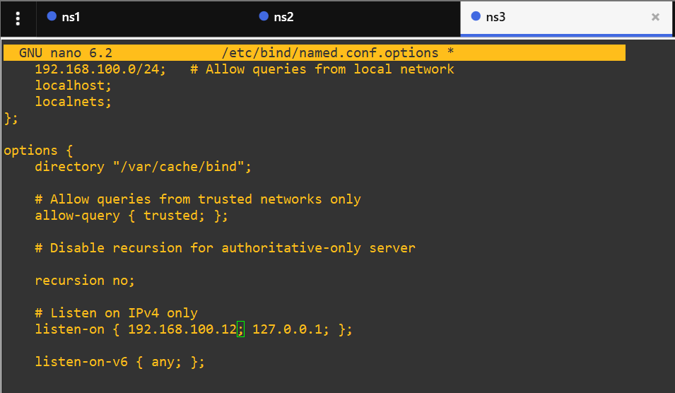

Figure 19. Subdomain config - server 3

**Task 4.4: Define Subdomain Zone**

I edited the local zone file:

`sudo nano /etc/bind/named.conf.local`

Added the delegated subdomain zone, figure 20.

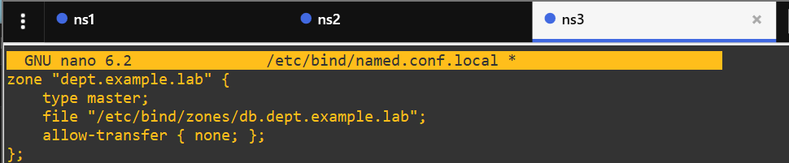

Figure 20. Subdomain local zone config file - server 3

**Task 4.5: Create Subdomain Zone File**

`sudo mkdir -p /etc/bind/zones`

`sudo nano /etc/bind/zones/db.dept.example.lab`

I added the subdomain zone content:

```bash
$TTL    86400
@       IN      SOA     ns3.example.lab. admin.dept.example.lab. (
                     2025120201 ; Serial
                     3600       ; Refresh
                     1800       ; Retry
                     604800     ; Expire
                     86400 )    ; Negative Cache TTL

; Name Server for the subdomain
@       IN      NS      ns3.example.lab.

; A record for the name server itself (required in child zone)
ns3.example.lab.     IN      A       192.168.100.12

; Subdomain hosts
hr      IN      A       192.168.100.50
finance IN      A       192.168.100.51
it      IN      A       192.168.100.52
admin   IN      A       192.168.100.53

; CNAME record
portal  IN      CNAME   hr.dept.example.lab.
```

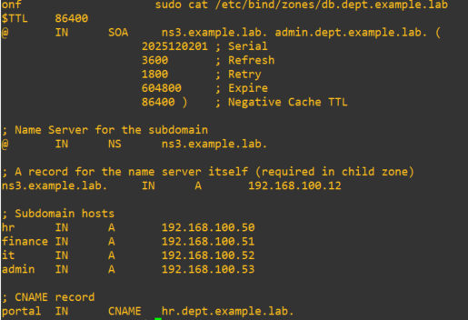

Figure 21. Configuration for subdomain zone file on server 3

**Task 4.6: Validate and Restart**

I performed following steps:

- # Check zone file

    `sudo named-checkzone dept.example.lab /etc/bind/zones/db.dept.example.lab`

- # Check configuration

    `sudo named-checkconf`

- # Restart service

    `sudo systemctl restart bind9`

Validation was successful, the warning bellow is unharmful, because this is the subdomain.

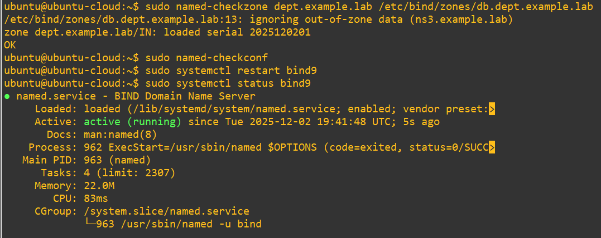

Figure 22. Log for configuration checks on server 3

**Task 4.7: Verify Delegation in Parent Zone**

Here I returned to **Server 1 (ns1)** and verified that the delegation records are present in ``/etc/bind/zones/db.example.lab``:

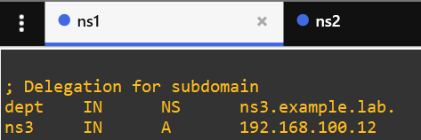

Figure 23. Log for verifying presence of delegation records

**Increment the serial number** in the parent zone and restart, figure 24:

`sudo nano /etc/bind/zones/db.example.lab`

I changed serial to **2025120202:**

`sudo systemctl restart bind9`

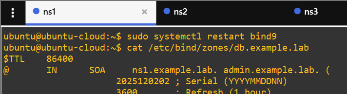

Figure 24. Executed actions of incrementing the serial number in the parent zone + status of restarted bind9

### **Part 5: Testing and Verification**

**Task 5.1: Basic DNS Query Testing**

I used `dig` command to test DNS resolution:

```bash
# Query the primary server
dig @192.168.100.10 www.example.lab
# Query the secondary server
dig @192.168.100.11 www.example.lab
# Query specific record types
dig @192.168.100.10 example.lab MX
dig @192.168.100.10 example.lab NS
dig @192.168.100.10 example.lab SOA
```

All commands showed status NOERROR, right record types, servers found, figure 25,26,27.

### Verifications using basic DNS query testing. Correct IP addresses and records are shown.

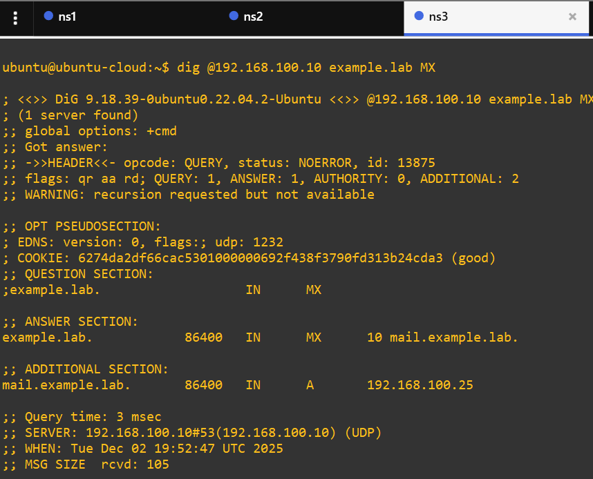

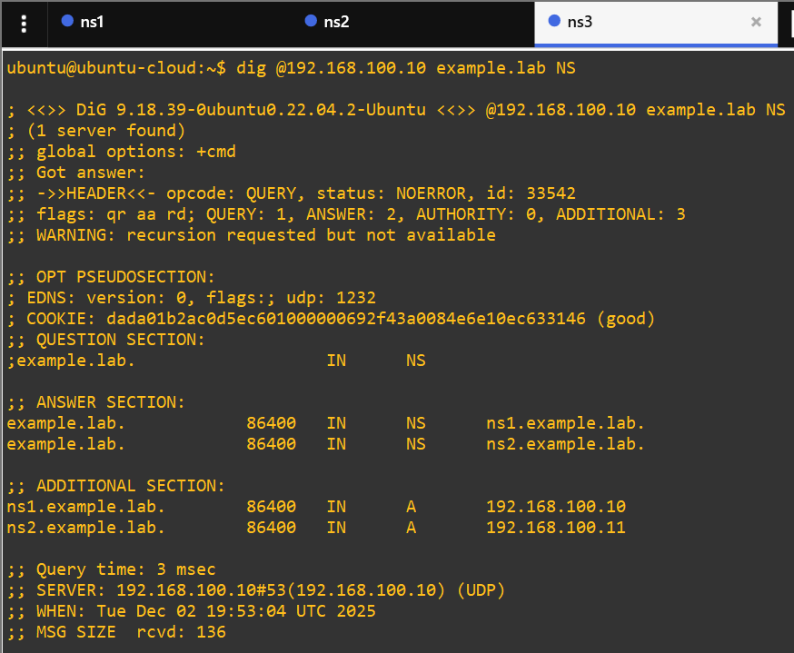

Figure 25. from server 3 to server 1 for MS,NS records

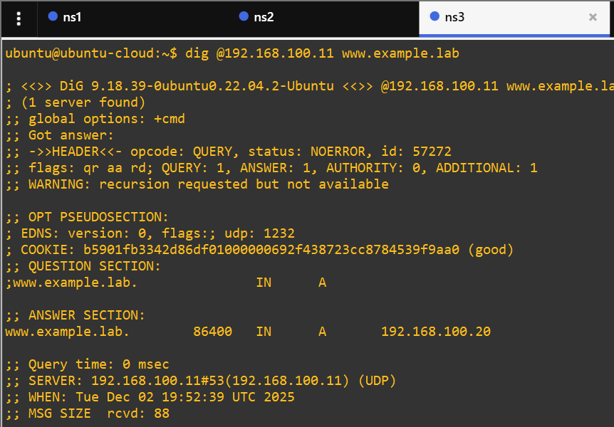

Figure 26. from server 3 to server 2 for the server

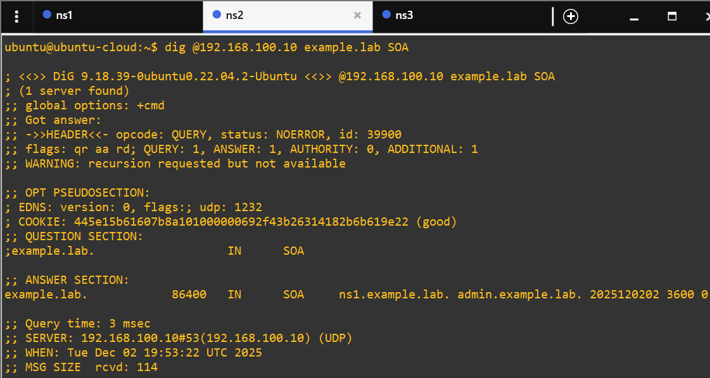

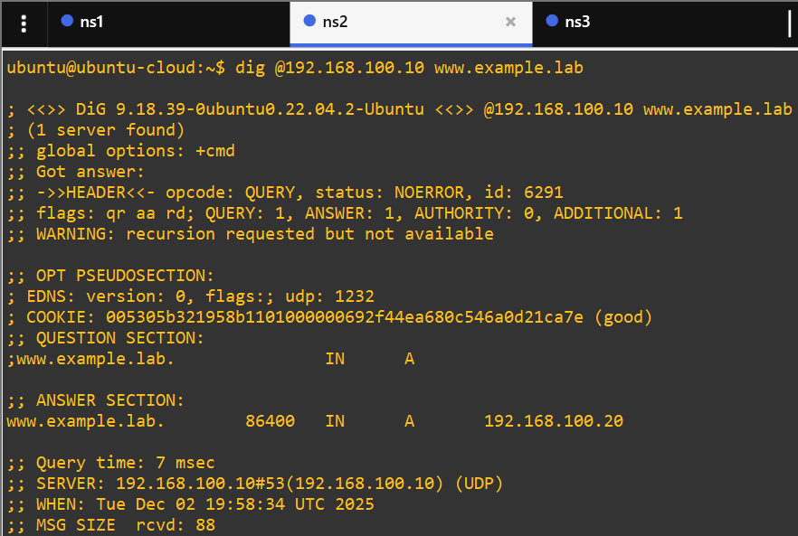

Figure 27. from server 2 to server 1 for the SOA record and the server

**Task 5.2: Test Subdomain Delegation**

I queried the delegated subdomain: those to the parent show referral to ns3, while queries to ns3 return authoritative answers.

Figures are bellow.

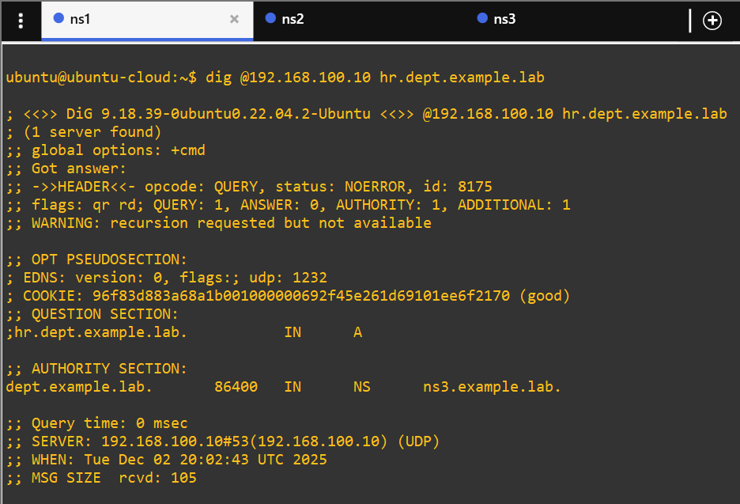

- I queried subdomain from parent server:

    `dig @192.168.100.10 hr.dept.example.lab`

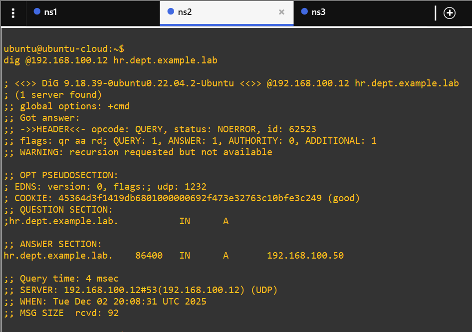

- Then I queried subdomain from delegated server

    `dig @192.168.100.12 hr.dept.example.lab`

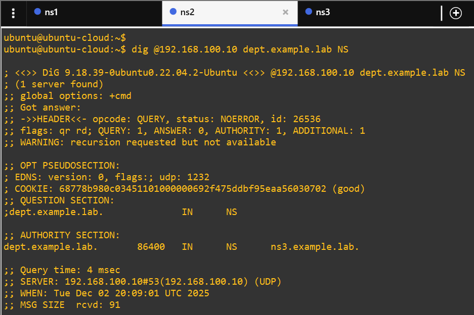

- At the end I checked NS records for subdomain

    `dig @192.168.100.10 dept.example.lab NS`

**Task 5.3: Test Reverse DNS**

I did reverse lookup from server 3,2,1 and got example.lab - Success of the check, figure 28.

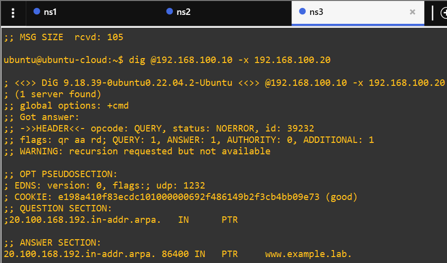

Figure 28. Reverse lookup from server 3.

**Task 5.4: Test Zone Transfer Security**

I attempted zone transfer from an unauthorized host (server 3). Transfer from unauthorized server 3 failed and from server 2 succeeded, figure 29.

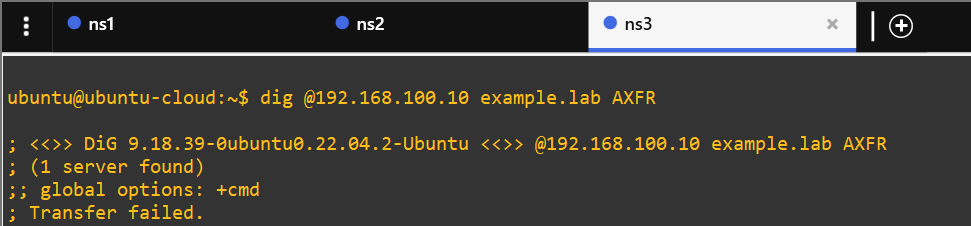

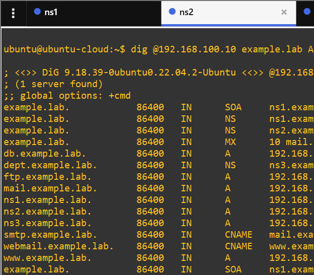

Figure 29. Log of attempts to dig from AXFR  (from server 3,2)

**Task 5.5: Using nslookup for Testing**

I used  **`nslookup`** for Testing in 2 modes an**d all successfuly show right results, figure 30.**

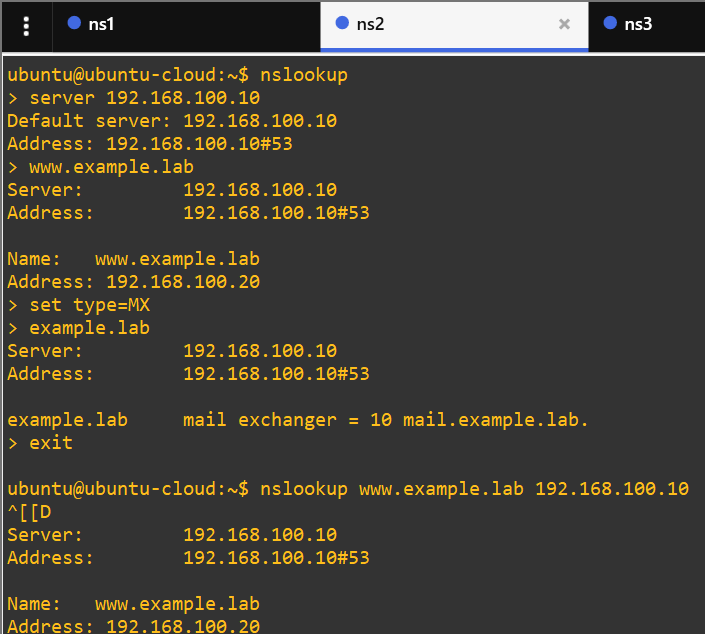

Figure 29. Log of attempts using `nslookup`

**Task 5.6: DNS Trace Testing**

For this task I traced the full resolution path:

`dig @192.168.100.10 hr.dept.example.lab +trace`

Figure 30 shows the complete delegation chain from root servers to your subdomain.

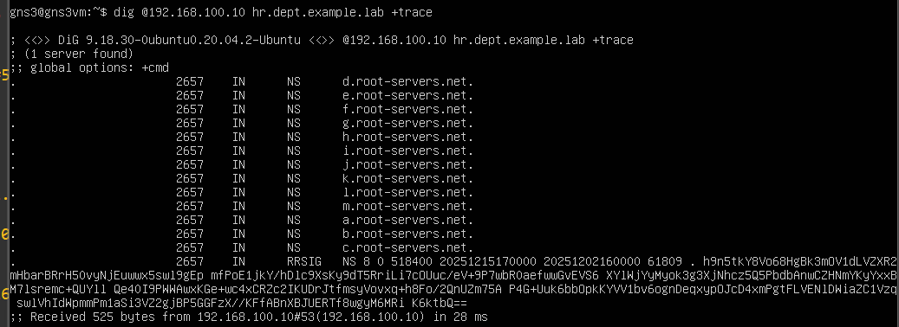

Figure 30. Trace log

**Task 5.7: Check DNS Server Logs**

Monitoring of DNS activity is done and showed in figures 31,32.

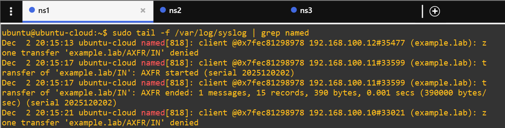

Figure 31. Real-time log monitoring

`sudo tail -f /var/log/syslog | grep named`

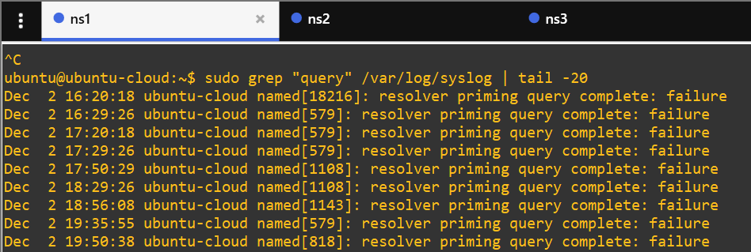

Figure 32. Search result for specific queries

`sudo grep "query" /var/log/syslog | tail -20`

### **Part 6: Advanced Configuration Tasks**

**Task 6.1: Configure DNS Logging**

On **Server 1**, I enhanced logging capabilities, editing the main configuration, shown in the figure 33.

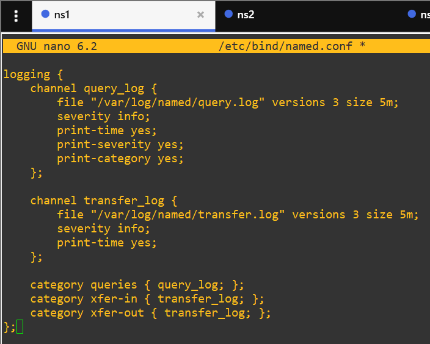

Figure 33. Main configuration for logging.

Next step was to create log directory, setup access policy and restart the service:

`sudo mkdir -p /var/log/named`

`sudo chown bind:bind /var/log/named`

`sudo systemctl restart bind9`

**Task 6.2: Implement TSIG for Secure Zone Transfers**

Firstly I generated the key, figure 34.

`sudo tsig-keygen -a hmac-sha256 ns1-ns2-key > /etc/bind/tsig-keys.conf`

**Output example**

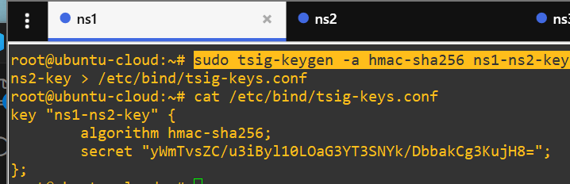

Figure 34. Key is generated and shown, using `cat` command

Then I included the key in named.conf and in zone definition files, figure 35,36.

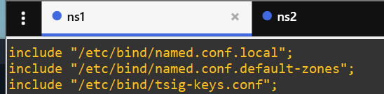

Figure 35. named.conf files with includes

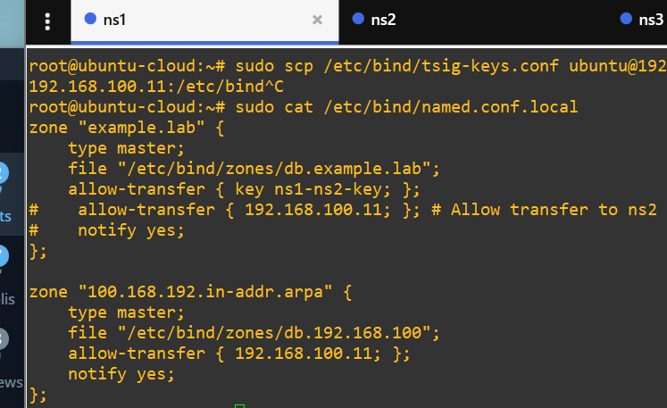

Figure 36. zone definition file updated and `scp` action to server 2

**Then on server 2**, I copied and moved the same TSIG key file with `scp` and updated configuration, figure 37.

I used `sudo nano /etc/bind/named.conf`  and added:

```bash
include "/etc/bind/tsig-keys.conf";
server 192.168.100.10 {
keys { ns1-ns2-key; };
};
```

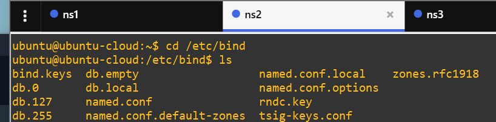

Figure 37. File is moved

To refresh changes I restarted both servers and test zone transfer with TSIG, figure 38.


Figure 37. Test between server 2 and server 1

### **6. Questions and Analysis**

**Question 1:** Explain the difference between authoritative and recursive DNS servers. Which type did you configure in this lab?

**Authoritative server** → serves only the data it owns. No recursion. Responds with final answers from its zone files.

**Recursive server** → performs full resolution on behalf of clients by querying other DNS servers.

In this lab, the configuration explicitly set `recursion no`, used local zone files, and served authoritative data only.So the servers (ns1, ns2, ns3) were **authoritative DNS servers**, not recursive ones.

**Question 2:** What is the purpose of the Serial number in the SOA record? What happens if you forget to increment it when making zone changes?

**Serial number** tracks the version of a zone. And secondary servers use it to determine whether they must fetch a new copy.

If one forgets to increment it, the master has newer data, but secondaries believe nothing changed.

Result: **clients continue receiving stale data** from secondaries.

Takeaway: updates exist, but no propagation happens.

**Question 3:** Describe the zone transfer process. What are the differences between AXFR and IXFR?

1. **Zone transfer** is a mechanism for synchronizing zone data between master and secondary.
2. **AXFR** → full zone transfer (complete copy each time).
3. **IXFR** → incremental transfer (only differences based on serial deltas).

AXFR is simple but wastes bandwidth; IXFR is efficient but requires journaling and cooperation of both servers.

**Question 4:** Why are glue records necessary in DNS delegation? What problems occur without them?

- **DNS delegation** is a process of moving authority from parent zone to downwards.
- **Glue record** is a record for a nameserver that lives inside the delegated zone.
- Required because the parent zone must give the IP of the delegated NS to avoid circular lookups.

Without glue, the resolver asks the parent for the NS, then must ask those NS servers for their own IPs—which is impossible because it cannot reach them without already knowing their IPs.

Problems: **resolution loop or complete delegation failure**.

My glue was the `ns3 IN A 192.168.100.12` entry in `example.lab`.

**Question 5:** What security risks exist with improperly configured zone transfers? How did you mitigate these risks in your configuration?

- Unrestricted zone transfers expose the full zone contents: hostnames, internal IPs, topology.
- Attackers can exploit this vulnerability for network mapping, phishing and etc.

I mitigated the risk using:

- `allow-transfer { 192.168.100.11; };` restricting AXFR to ns2;
- TSIG keys (`ns1-ns2-key`) for authenticated transfers.

And I got combined effect: **only ns2 can transfer** and only with the correct shared secret.

**Question 6:** If the primary DNS server fails, can clients still resolve names in the zone? Explain why or why not.

Yes, client can resolve, because secondary (slave) servers host a full replicated copy of the zone.

Any NS listed in the parent zone file is authoritative and valid to use. Clients query ns2 directly once ns1 becomes unreachable.

**But,** if secondary never successfully transferred the data, it eventually expires after the SOA "Expire" timer and stops answering.

**Question 7:** Describe three methods you used to troubleshoot DNS issues during this lab.

- **`dig` queries** (A, MX…, +trace, AXFR) to verify records, delegation, and zone consistency.

    ```
    dig @192.168.100.10 hr.dept.example.lab +trace
    ```

- **Log inspection** via`/var/log/syslog` + | `grep named` to observe chosen queries.

    ```bash
    sudo tail -f /var/log/syslog | grep named
    ```

- **Configuration validation** using `named-checkconf` and `named-checkzone` to catch syntax errors before restart.

    ```bash
    sudo named-checkzone example.lab /etc/bind/zones/db.example.lab
    ```

**Question 8:** What is the purpose of TSIG? In what scenarios would you implement it in a production environment?

**TSIG** provides cryptographic authentication for DNS operations (typically zone transfers and dynamic updates). It prevents unauthorized hosts from initiating AXFR/IXFR or poisoning dynamic update zones.

Production scenarios where TSIG is mandatory:

- Master–secondary synchronization across untrusted networks
- Environments requiring signed dynamic updates (DHCP + DNS integration)
- Any setup where zone-transfer leakage is a security risk

Takeaway: TSIG ensures **integrity + authenticity** for DNS communications.

### Takeaways from the work done:

> - Done: authoritative-only DNS deployed, with recursion disabled and direct control over zone data.
> - New: Serial numbers controlled propagation, and forgetting them would silently break synchronization.
> - Done: zone transfers were secured by strict ACLs and TSIG to prevent data leakage.
> - New: troubleshooting depended on `dig`, logs, and strict configuration validation.
> - Never change the name of prjects outside GNS interface, otherwise configuration disappears 💀

### **8. References**

1. Ubuntu official site, download pages. Link <https://ubuntu.com/download/server/thank-you?version=24.04.3&architecture=amd64&lts=true>
2. RFC 1035 – Domain Names: Implementation and Specification. Link: <https://datatracker.ietf.org/doc/html/rfc1035>
3. RFC 1034 – Domain Names: Concepts and Facilities. Link: <https://datatracker.ietf.org/doc/html/rfc1034>
4. TSIG: Secret Key Transaction Authentication for DNS. Link: <https://datatracker.ietf.org/doc/html/rfc2845>
5. ISC BIND 9 Knowledge Base (DNS Operations & Tutorials). Link: <https://kb.isc.org/>
6. RFC 5936 – DNS Zone Transfer Protocol (AXFR/IXFR). Link: <https://datatracker.ietf.org/doc/html/rfc5936>
