# 3 Secure Mail Server Setup and Email Inbox Configuration

Name of report: CIA_UNIX_LAB_3_Nikita_Niakhai
Course: Unix-based Internet Applications
Performed by Nikita Niakhai
Date submission: 11.12.2025
---

## Abstract

During the lab, a full email server with proper environment was configured, deployed, secured and tested, starring modern real-world tools and practices.

The setup of main tools is listed:

- Postfix - a mail server that handles SMTP.
- Dovecot - for IMAP/POP3 email retrieval.
- Roundcube - for the email interface (a local hosted web-app).
- Virtual mails with password-based file structure were created to allow single cross-functional access between tools.

The setup of security technologies:

- OpenDKIM (DomainKey Identified Mail) - for signing mail messages with a domain key.
- SPF (Sender Policy Framework) - for authenticating sending server to a starred domain.
- TLS/SSL - for security across different processes to ensure that email is transmitted, authenticated across encrypted channels.
- Firewall rules were updated to open only necessary ports (restrict access to the chosen ones).

By the end of the lab, email pipeline—sending, receiving, storing, retrieving, and logging messages—was functioning securely and reliably.

### Overview of Email Server Architecture

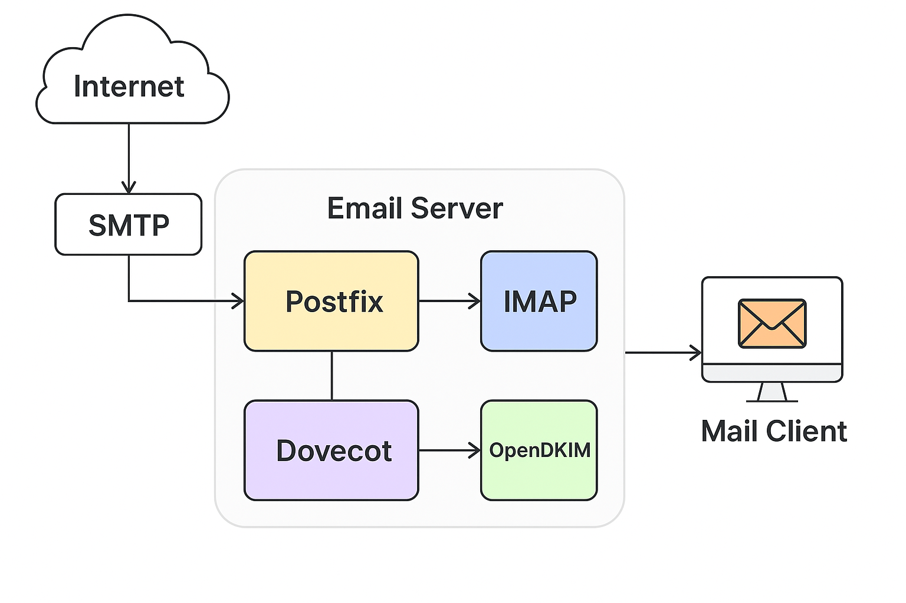

Figure 1. Architecture [GPT was used to create such a diagram]

### Brief Description of Protocols (SMTP, IMAP, POP3)

SMTP (Single Mail Transfer Protocol) is used only to transfer (no storage, no downloading) messages from client to server e.g., from the [Innopolis.University](http://Innopolis.University) email server to GMAIL server. Used on the web. Placed on port 25. Uses TLS/SSL for secure transmission: 465 port SSL / port 587 TLS.

POP3 (Post Office Protocol) - downloads email messages from the server to local device, making them available offline, and deletes them from the server. Placed on port 110. Less secure than IMAP, but still TLS/SSL ports (995)

IMAP (Internet Mail Access Protocol) - access, manage of email messages on a remote server and provides synchronization between devices. Places on port 143. Requires internet connection. Security is configured on port 993.

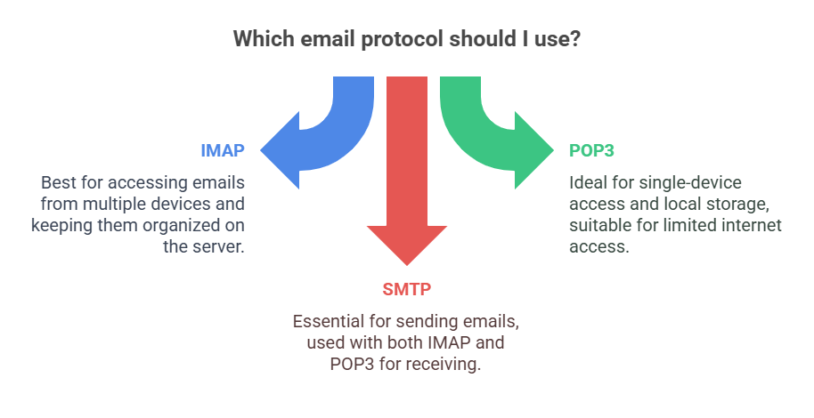

Figure 2. [<https://www.geeksforgeeks.org/computer-networks/imap-vs-pop3-vs-smtp/>]

### Input

---

**Hostname**: `email`

**Domain Used:** `mail.example.com`

**Server IP:** `192.168.1.100`

---

## Part 1: System Preparation and Initial Setup

### Task 1.1: Update System Packages

- Updated the system to ensure all packages are current:

```bash
sudo apt update
sudo apt upgrade -y
```

### Task 1.2: Configure Hostname

- Set system hostname (replace [mail.example.com](http://mail.example.com/) with template domain):

```bash
sudo hostnamectl set-hostname mail.example.com
```

- Edited /etc/hosts to include my hostname:

```bash
sudo nano /etc/hosts
```

- Added the following line:

```bash
192.168.1.100 mail.example.com mail
```

### Task 1.4: Install Essential Tools

```bash
sudo apt install -y curl wget git net-tools dnsutils telnet
```

- Deliverable 1.1: Take a screenshot showing the output of `hostname -f` and cat `/etc/hosts.`

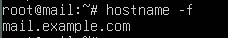

Figure 3.

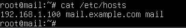

Figure 4.

## Part 2: Postfix SMTP Server Installation and Configuration

### Task 2.1: Install Postfix

- Installed Postfix mail server:

```bash
sudo apt install -y postfix
```

- During installation:
    - Selected "Internet Site" as the configuration type
    - Entered my domain name ([example.com](http://example.com/))

### Task 2.2: Configure Postfix Main Configuration

- Edited the main Postfix configuration file:

```bash
sudo nano /etc/postfix/main.cf
```

- Modified the following parameters:

```bash
# Basic Settings
myhostname = mail.example.com
mydomain = example.com
myorigin = $mydomain
mydestination = $myhostname, localhost.$mydomain, localhost, $mydomain

# Network Settings
inet_interfaces = all
inet_protocols = ipv4

# Mail Storage
home_mailbox = Maildir/
mailbox_size_limit = 0
recipient_delimiter = +

# Virtual Mailbox Settings (for virtual users)
virtual_mailbox_domains = example.com
virtual_mailbox_base = /var/mail/vhosts
virtual_mailbox_maps = hash:/etc/postfix/vmailbox
virtual_minimum_uid = 100
virtual_uid_maps = static:5000
virtual_gid_maps = static:5000

# SMTP Client Restrictions
smtpd_relay_restrictions = permit_mynetworks,
    permit_sasl_authenticated,
    defer_unauth_destination
```

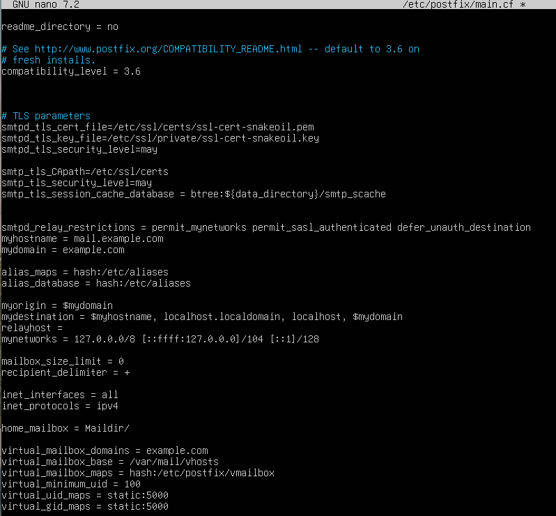

Figure 5.

### Task 2.3: Configure SMTP Authentication

- Added SASL authentication settings to `/etc/postfix/main.cf`:

```bash
# SMTP Authentication
smtpd_sasl_auth_enable = yes
smtpd_sasl_type = dovecot
smtpd_sasl_path = private/auth
smtpd_sasl_security_options = noanonymous
smtpd_sasl_local_domain = $myhostname
broken_sasl_auth_clients = yes
```

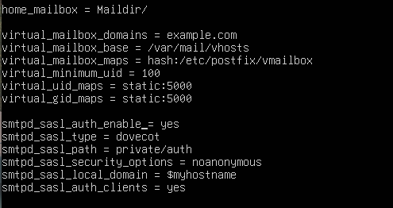

Figure 6.

### Task 2.4: Configure Master Process

- Edited `/etc/postfix/master.cf` to enable submission port:

```bash
sudo nano /etc/postfix/master.cf
```

- Uncommented and configured the submission service (port 587):

```bash
submission inet n       -       y       -       -       smtpd
  -o syslog_name=postfix/submission
  -o smtpd_tls_security_level=encrypt
  -o smtpd_sasl_auth_enable=yes
  -o smtpd_reject_unlisted_recipient=no
  -o smtpd_client_restrictions=permit_sasl_authenticated,reject
  -o smtpd_relay_restrictions=permit_sasl_authenticated,reject
```

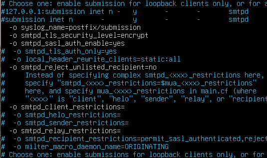

Figure 7.

### Task 2.5: Create Virtual Mailbox Map

- Created the virtual mailbox mapping file:

```bash
sudo nano /etc/postfix/vmailbox
```

- Added user mappings:

```bash
user1@example.com    example.com/user1/
user2@example.com    example.com/user2/
```

- Generated the hash database:

```bash
sudo postmap /etc/postfix/vmailbox
```

### Task 2.6: Create Mail Directory and User

```bash
sudo groupadd -g 5000 vmail
sudo useradd -g vmail -u 5000 vmail -d /var/mail/vhosts -m
sudo mkdir -p /var/mail/vhosts/example.com
sudo chown -R vmail:vmail /var/mail/vhosts
```

### Task 2.7: Restart Postfix

```bash
sudo systemctl restart postfix
sudo systemctl enable postfix
sudo systemctl status postfix
```

- Deliverable 2.1: Provide the output of `postconf -n` command.
- Deliverable 2.2: Take a screenshot showing Postfix **service status.**

    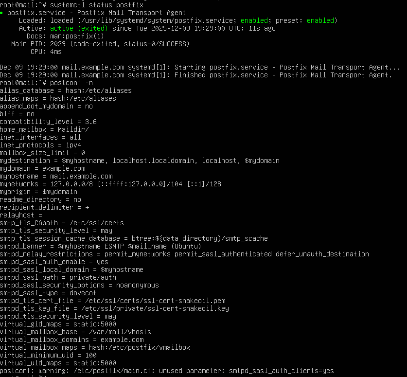

Figure 8.

## Part 3: Dovecot IMAP/POP3 Server Setup

### Task 3.1: Install Dovecot

```bash
sudo apt install -y dovecot-core dovecot-imapd dovecot-pop3d
```

### Task 3.2: Configure Dovecot Main Settings

- Edited `/etc/dovecot/dovecot.conf`:

```bash
sudo nano /etc/dovecot/dovecot.conf
```

- Ensured the following line is uncommented:

```bash
protocols = imap pop3 lmtp
listen = *, ::
```

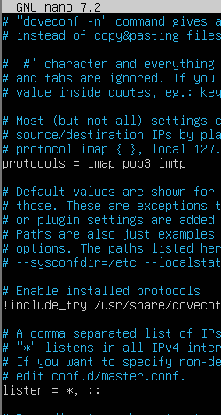

Figure 9.

### Task 3.3: Configure Mail Location

- Edite `/etc/dovecot/conf.d/10-mail.conf:`

```bash
sudo nano /etc/dovecot/conf.d/10-mail.conf
```

- Configured mail location:

```bash
mail_location = maildir:/var/mail/vhosts/%d/%n
mail_privileged_group = mail

namespace inbox {
  inbox = yes
}
```

Command to beatifully display content of the file `grep -v "^#" your_file | grep -v "^$" | less`

- removes the lines starting with "#" and also removes the empty lines, than send the result to `less` for a better display.

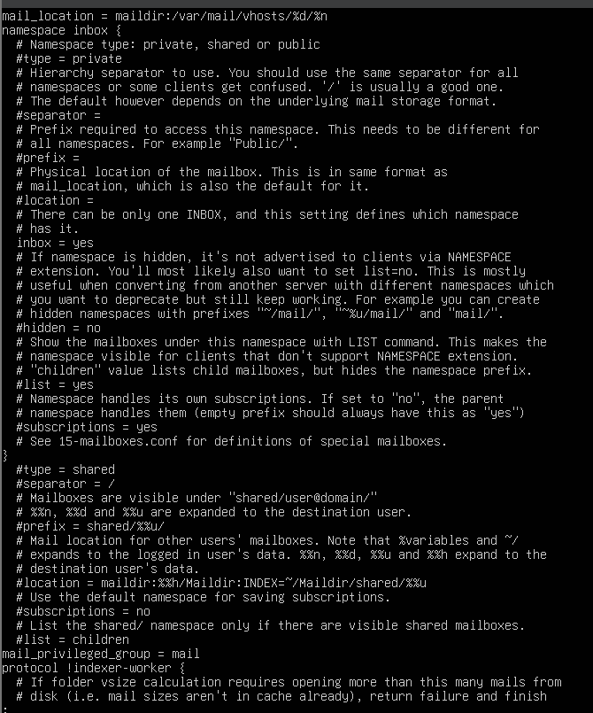

Figure 10.

### Task 3.4: Configure Authentication

- Edited `/etc/dovecot/conf.d/10-auth.conf`:

```bash
sudo nano /etc/dovecot/conf.d/10-auth.conf
```

- Modified the following:

```bash
disable_plaintext_auth = yes
auth_mechanisms = plain login
```

- Commented out the system auth include and uncommented:

```bash
!include auth-passwdfile.conf.ext
```


Figure 11.

### Task 3.5: Configure User Database

- Edited `/etc/dovecot/conf.d/auth-passwdfile.conf.ext` :

```bash
sudo nano /etc/dovecot/conf.d/auth-passwdfile.conf.ext
```

- Configured:

```bash
passdb {
  driver = passwd-file
  args = scheme=PLAIN username_format=%u /etc/dovecot/users
}

userdb {
  driver = static
  args = uid=vmail gid=vmail home=/var/mail/vhosts/%d/%n
}
```

- Created the users file:

```bash
sudo nano /etc/dovecot/users
```

- Added users (format: `username:password`):

```bash
user1@example.com:{PLAIN}password123
user2@example.com:{PLAIN}password456
```

- Set permissions:

```bash
sudo chmod 640 /etc/dovecot/users
sudo chown root:dovecot /etc/dovecot/users
```

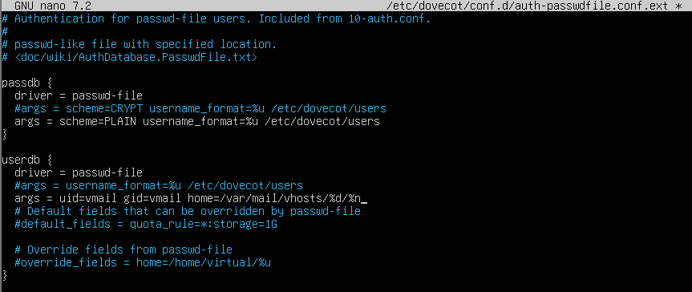

Figure 12.

### Task 3.6: Configure Dovecot SASL for Postfix

- Edited /etc/dovecot/conf.d/10-master.conf:

```bash
sudo nano /etc/dovecot/conf.d/10-master.conf
```

- Find the service auth section and add:

```bash
service auth {
  unix_listener /var/spool/postfix/private/auth {
    mode = 0660
    user = postfix
    group = postfix
  }
}
```

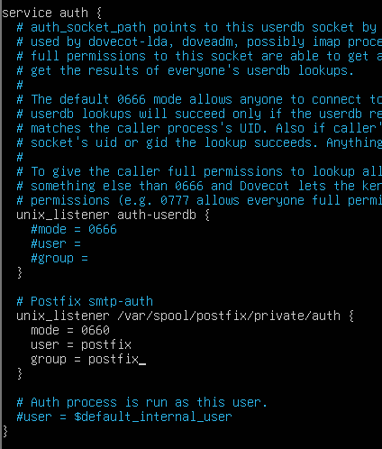

Figure 13.

### Task 3.7: Restart Dovecot

```bash
sudo systemctl restart dovecot
sudo systemctl enable dovecot
sudo systemctl status dovecot
```

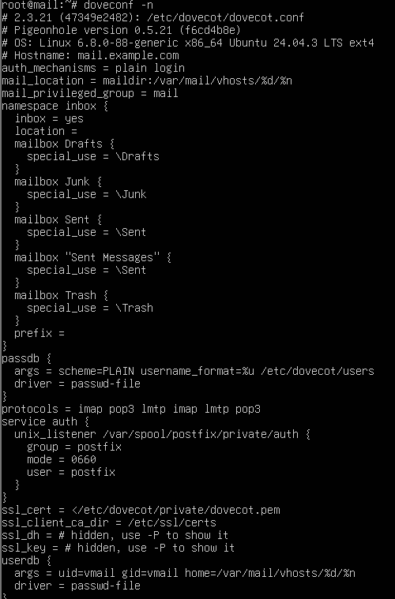

- Deliverable, figure 14: the output of `doveconf -n` command.

    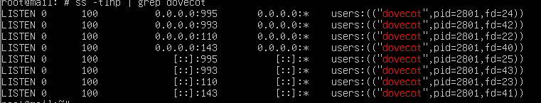

- Deliverable, figure 15: Verification that Dovecot is listening on ports 143 and 110 using `ss -tlnp | grep dovecot`.

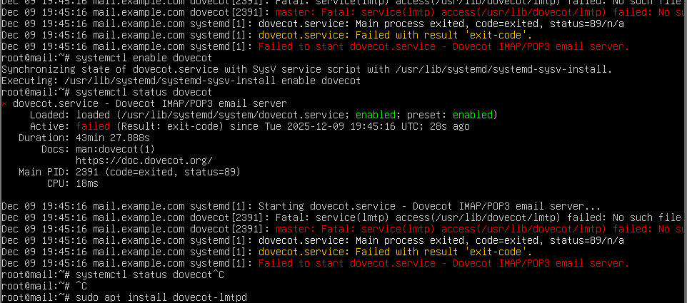

Figure 16. Status of services (error is present)

Got error that dovecot missed `lmtp` that we configured inside  `/etc/dovecot/dovecot.conf,` so I installed this package for dovecot and restarted. Error disappeared.

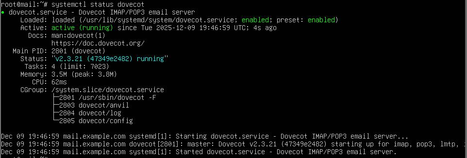

Figure 17. Updated status of dovecot

## Part 4: Security Implementation - TLS/SSL Encryption

### Task 4.1: Generate Self-Signed SSL Certificate (for testing)

```bash
sudo mkdir -p /etc/ssl/mail
cd /etc/ssl/mail
sudo openssl req -new -x509 -days 365 -nodes \
  -out mail.example.com.crt \
  -keyout mail.example.com.key
```

- Fill in the certificate details when prompted.

> *BLA-BLA certificate details* may cause errors in identifying the certificate.

- Set proper permissions:

```bash
sudo chmod 600 /etc/ssl/mail/mail.example.com.key
sudo chmod 644 /etc/ssl/mail/mail.example.com.crt
```

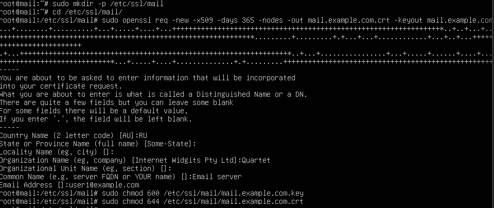

Figure 18.

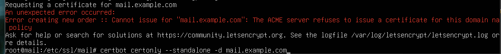

Figure 19.

For a local domain, it is not possible to create a certificate with Let’s Encrypt, because this type of domain is in the block list.

### Task 4.2: Configure Postfix TLS

- Edited `/etc/postfix/main.cf` and add:

```bash
# TLS Settings
smtpd_tls_cert_file=/etc/ssl/mail/mail.example.com.crt
smtpd_tls_key_file=/etc/ssl/mail/mail.example.com.key
smtpd_use_tls=yes
smtpd_tls_security_level=may
smtpd_tls_auth_only = yes
smtpd_tls_loglevel = 1
smtpd_tls_received_header = yes
smtpd_tls_session_cache_timeout = 3600s

# Outgoing TLS
smtp_tls_security_level = may
smtp_tls_loglevel = 1
```

### Task 4.3: Configure Dovecot SSL

- Edited `/etc/dovecot/conf.d/10-ssl.conf`:

```bash
sudo nano /etc/dovecot/conf.d/10-ssl.conf
```

- Configured SSL settings:

```bash
ssl = required
ssl_cert = </etc/ssl/mail/mail.example.com.crt
ssl_key = </etc/ssl/mail/mail.example.com.key
ssl_min_protocol = TLSv1.2
ssl_prefer_server_ciphers = yes
```

### Task 4.4: Restart Services

```bash
sudo systemctl restart postfix
sudo systemctl restart dovecot
```

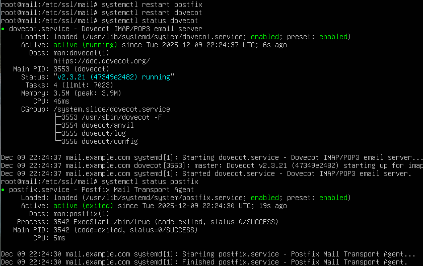

Figure 20.

### Task 4.5: Configure Firewall

- Allow necessary mail server ports:

```bash
sudo ufw allow 25/tcp
sudo ufw allow 587/tcp
sudo ufw allow 465/tcp
sudo ufw allow 143/tcp
sudo ufw allow 993/tcp
sudo ufw allow 110/tcp
sudo ufw allow 995/tcp
sudo ufw allow 80/tcp
sudo ufw allow 443/tcp
sudo ufw enable

# OR BETTER OPTION
for p in 25 587 465 143 993 110 995 80 443; do sudo ufw allow ${p}/tcp; done && sudo ufw enable
```


- Deliverable, figure 21: firewall rules updated

- Test of TLS connection using: `openssl s_client -connect localhost:587 -starttls smtp`

Here, I ran into the issue - can’t connect to the email. So I executed `ss tlnp | grep 587` and saw nothing! That means I didn’t turn on something. I checked [master.cf](http://master.cf) and observed that I had not commented out one specific line for submission.

**Was:**

```bash
#submission inet n       -       y       -       -       smtpd
```

**Become:**

```bash
submission inet n       -       y       -       -       smtpd
```

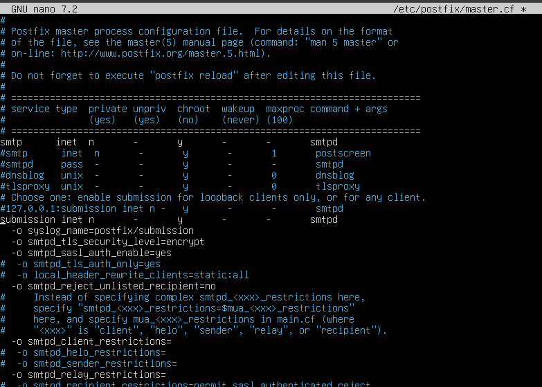

Figure 22. Misconfiguration fixed

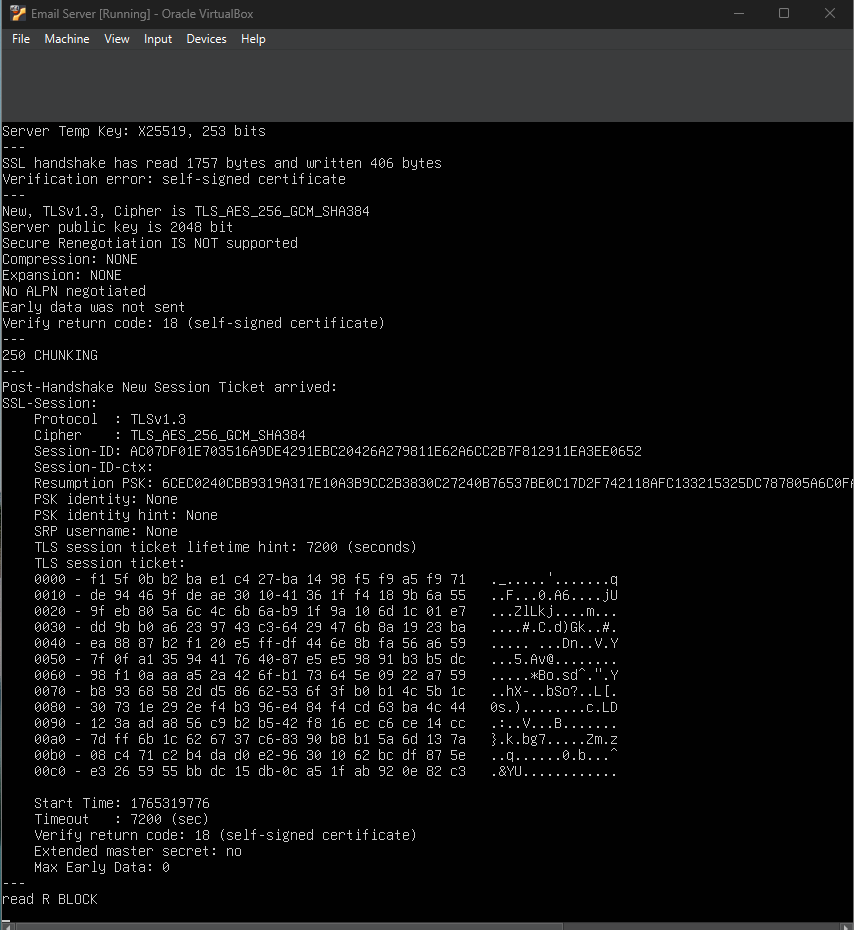

Figure. Successfully connected using TLS 1.3

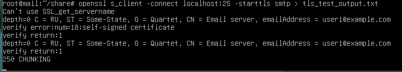

Figure 24. Successfully copied connection log to shared folder for the report.

## Part 5: Email Authentication Configuration

### Task 5.2: Install OpenDKIM

```bash
sudo apt install -y opendkim opendkim-tools
```

### Task 5.3: Configure OpenDKIM

- Edited `/etc/opendkim.conf`:

```bash
sudo nano /etc/opendkim.conf
```

- Configured:

```bash
Domain                  example.com
KeyFile                 /etc/opendkim/keys/example.com/default.private
Selector                default
Socket                  inet:8891@localhost
Mode                    sv
Syslog                  yes
LogWhy                  yes
Canonicalization        relaxed/simple
```

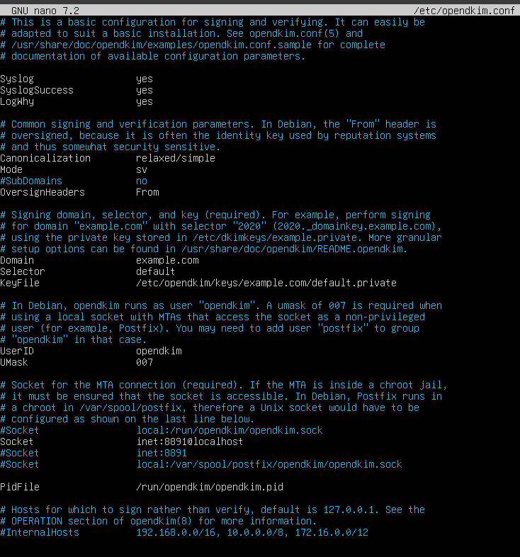

Figure 25.

### Task 5.4: Generate DKIM Keys

```bash
sudo mkdir -p /etc/opendkim/keys/example.com
sudo opendkim-genkey -D /etc/opendkim/keys/example.com -d example.com -s default
sudo chown -R opendkim:opendkim /etc/opendkim/keys/
```

- View the public key:

```bash
sudo cat /etc/opendkim/keys/example.com/default.txt
```

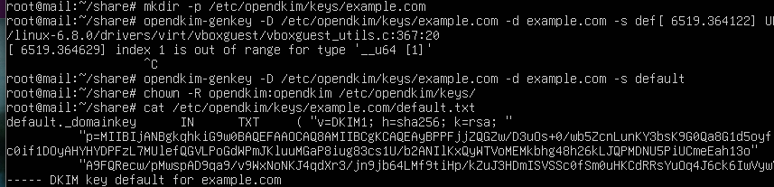

Figure 26.

### Task 5.6: Connect OpenDKIM to Postfix

- Edited `/etc/postfix/main.cf` and add:

```bash
# DKIM
milter_default_action = accept
milter_protocol = 6
smtpd_milters = inet:localhost:8891
non_smtpd_milters = inet:localhost:8891
```


Figure 27.

### Task 5.8: Restart Services

```bash
sudo systemctl restart opendkim
sudo systemctl restart postfix
```

- Deliverable 5.1: Provide the DKIM public key from default.txt.
- Deliverable 5.2: Show OpenDKIM service status.

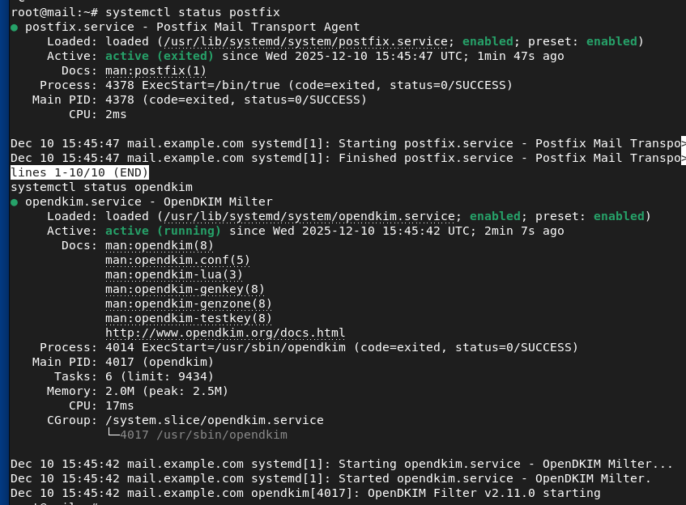

Figure 28.

## Part 6: Webmail Interface Setup (Roundcube)

### Task 6.1: Install Web Server and PHP

```bash
sudo apt install -y nginx php-fpm php-cli php-imap php-json \
  php-mysql php-mbstring php-xml php-zip php-intl \
  php-imagick php-curl php-gd
```

### Task 6.2: Install MariaDB

```bash
sudo apt install -y mariadb-server
sudo mysql_secure_installation
```

### Task 6.3: Create Database for Roundcube

```bash
sudo mysql -u root -p
```

- Run the following SQL commands:

```sql
CREATE DATABASE roundcube CHARACTER SET utf8mb4 COLLATE utf8mb4_unicode_ci;
CREATE USER 'roundcube'@'localhost' IDENTIFIED BY 'strong_password';
GRANT ALL PRIVILEGES ON roundcube.* TO 'roundcube'@'localhost';
FLUSH PRIVILEGES;
EXIT;
```

### Task 6.4: Download and Install Roundcube

```bash
cd /tmp
wget https://github.com/roundcube/roundcubemail/releases/download/1.6.5/roundcubemail-1.6.5-complete.tar.gz
tar -xzf roundcubemail-1.6.5-complete.tar.gz
sudo mv roundcubemail-1.6.5 /var/www/roundcube
sudo chown -R www-data:www-data /var/www/roundcube
```

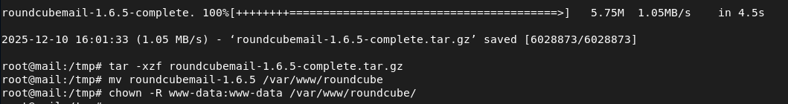

Figure 29.

Here I have error I can’t access login page after installation.

Firstly, I found that I did not put right password for roundcube user, then I reinstalled it and put it right. But error is the same. Then I tried accessing mysql via roundcube user with the password - good.

I opened logs folder inside `var/www/roundcube` and saw errors:

Error: [1146] Table 'roundcube.session' doesn't exist

Now I manually add this schema (This imports the initial tables (including 'session') from Roundcube's SQL file):

```bash
mysql -u roundcube -pstrong_password roundcube < /var/www/roundcube/SQL/mysql.initial.sql
```

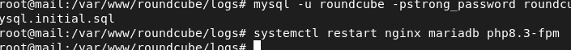

Figure 29. Restart of main services

Error is solved. GPT helped with adding the schema, since the schema wasn't imported.

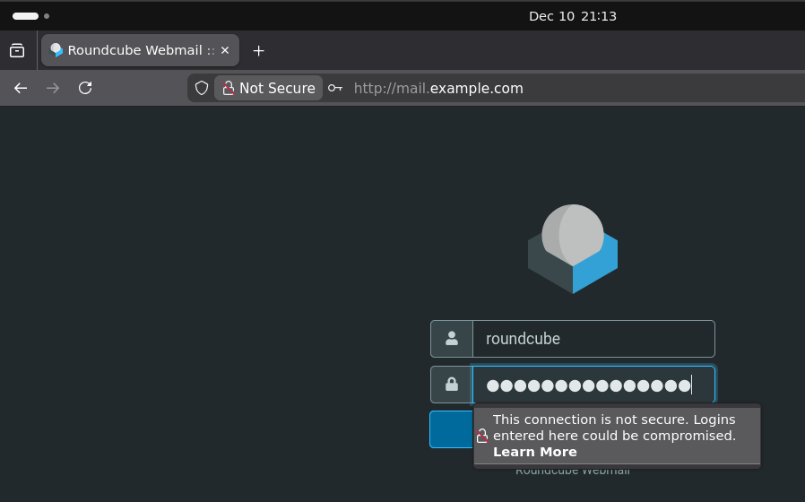

Figure 30. Login page of roundcube

### Task 6.5: Configure Nginx for Roundcube

- Create Nginx configuration:

```bash
sudo nano /etc/nginx/sites-available/roundcube
```

- Add:

```bash
server {
    listen 80;
    server_name mail.example.com;
    root /var/www/roundcube;
    index index.php;

    location / {
        try_files $uri $uri/ /index.php;
    }

    location ~ \.php$ {
        include snippets/fastcgi-php.conf;
        fastcgi_pass unix:/var/run/php/php8.1-fpm.sock;
    }

    location ~ /\.ht {
        deny all;
    }
}
```

- Enable the site:

```bash
sudo ln -s /etc/nginx/sites-available/roundcube /etc/nginx/sites-enabled/
sudo nginx -t
sudo systemctl restart nginx
```

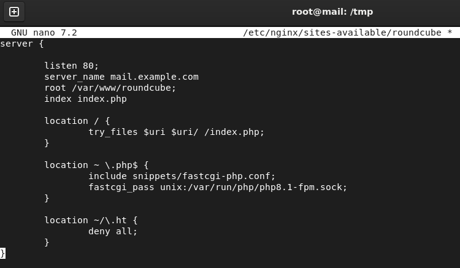

Figure 31. Nginx configuration (with a syntax error and old socket version)

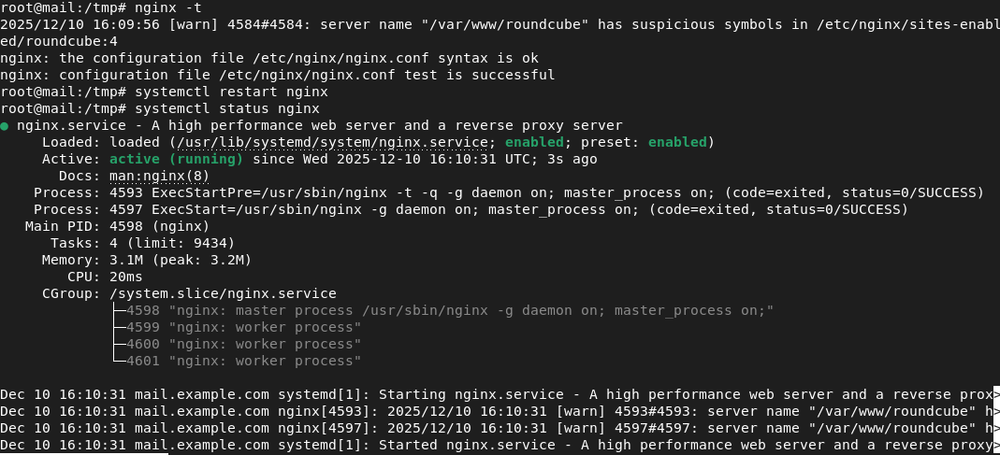

Figure 32. nginx service status

### Task 6.6: Configure Roundcube

- Visit <http://mail.example.com/installer> in your browser to complete the installation.
- Database setup:
- Database type: MySQL
- Database name: roundcube
- Database user: roundcube
- Database password: (your password)
- IMAP settings:
- IMAP server: ssl://localhost:993
- SMTP settings:
- SMTP server: tls://localhost:587
- Use authentication: Yes
- After configuration, download the config.inc.php file and place it in /var/www/roundcube/config/.
- Remove the installer for security:

```bash
sudo rm -rf /var/www/roundcube/installer
```

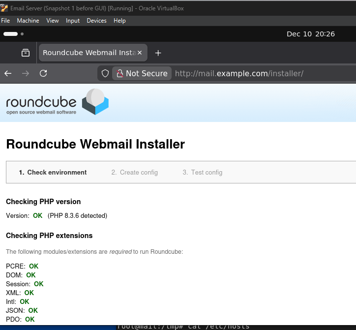

Figure 33. a screenshot of the Roundcube installation page

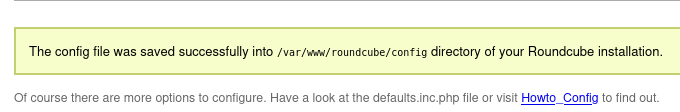

Figure 34. A screenshot of the Roundcube installation page (2)

> I had problems deploying the site: default nginx settings were disrupting me. So I fully reinstalled nginx, deleted all folders and reinstalled roundcube and rewrote nginx conf for the site.
>
> Also I changed fpm php socket to use 8.3 version, because 8.1 is not supported.

## Part 7: Testing and Troubleshooting

### Task 7.1: Test SMTP with Telnet

- Test basic SMTP connectivity:

```bash
telnet localhost 25
```

- Commands to execute:

```bash
EHLO localhost
MAIL FROM: <user1@example.com>
RCPT TO: <user2@example.com>
DATA
Subject: Test Email
This is a test email.
.
QUIT
```

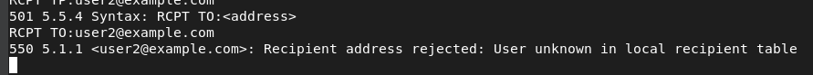

Figure 35. Error about `user2`

**The error** "550 5.1.1 [user2@example.com](mailto:user2@example.com): Recipient address rejected: User unknown in local recipient table" occurs because Postfix is treating "[example.com](http://example.com/)" as a local domain instead of a virtual domain. As a result, it's checking for "user2" as a system user (e.g., in /etc/passwd), which doesn't exist

In my Postfix configuration (/etc/postfix/main.cf) I had:
`mydestination = $myhostname, localhost.$mydomain, localhost, $mydomain`

So I changed to:
`mydestination = $myhostname, localhost.$mydomain, localhost`

And now IMAP and SMTP tests work correctly.

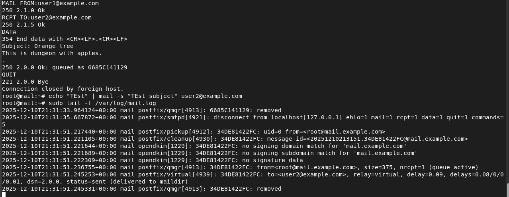

Figure 36. Pipeline of IMAP/SMTP tests and content of the `mail.log`

### Task 7.2: Test SMTP with TLS

```bash
openssl s_client -connect localhost:587 -starttls smtp
```

- After connection, test SMTP commands.

### Task 7.3: Test IMAP Connection

```bash
openssl s_client -connect localhost:993
```

- Commands:

```bash
a001 LOGIN user1@example.com password123
a002 LIST "" "*"
a003 SELECT INBOX
a004 LOGOUT
```

Here I was not able to normally run commands so -quiet option helped to calm down SSL warnings (to suppress certificate warnings).

```bash
openssl s_client -connect localhost:993 -quiet
```

### Task 7.4: Send Test Email

```bash
echo "Test email body" | mail -s "Test Subject" user2@example.com
```

### Task 7.5: Check Mail Logs

- View Postfix logs:

```bash
sudo tail -f /var/log/mail.log
```

- Or on some systems:

```bash
sudo tail -f /var/log/maillog
```

### Task 7.6: Verify Email Authentication

- Send an email to an external address (Gmail, etc.) and check headers for:
- SPF: PASS
- DKIM: PASS
- DMARC: PASS

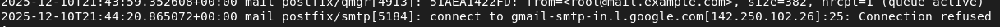

Figure 37. Log of sending email to an external address (Screenshot showing email headers with SPF, DKIM, and DMARC results.)

Because this is local domain and email, we cannot send emails to internet, only inside LAN.

### Task 7.7: Test Mail Queue

- Check mail queue:

```bash
mailq
postqueue -p
```

- Flush queue:

```bash
postqueue -f
```

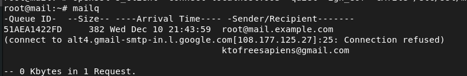

Figure 38. Error on sending email to an external address (Screenshot showing email headers with SPF, DKIM, and DMARC results.)

### Task 7.8: Common Troubleshooting Commands

- Check Postfix configuration:

```bash
postconf -n
```

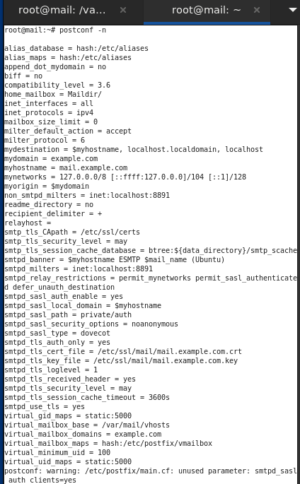

Figure 39.

- Check Dovecot configuration:

```bash
doveconf -n
```

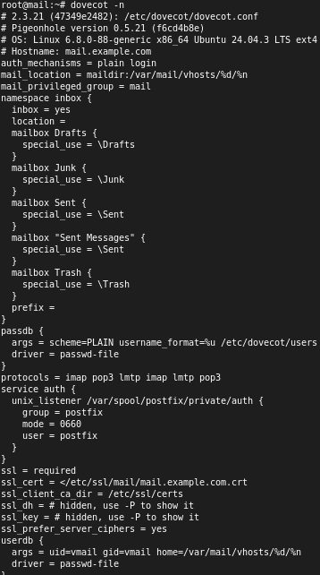

Figure 40.

- Check service status:

```bash
systemctl status postfix
systemctl status dovecot
systemctl status opendkim
```

They are active, running. Only Dovecot showed failed attempts to send emails to user2 during the moment, when I had a misconfiguration.

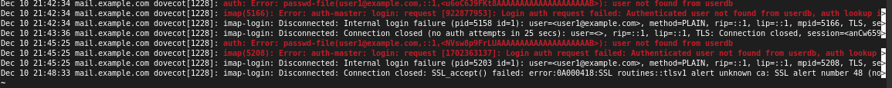

Figure 41. Dovecot errors on the authentication of unknown users.

- Check listening ports:

```bash
ss -tlnp | grep -E ':(25|587|465|143|993|110|995)'
```


- Deliverable, figure 42: Provide complete mail.log output from sending a test email.

To copy all config files I used `cp` and shared folder:

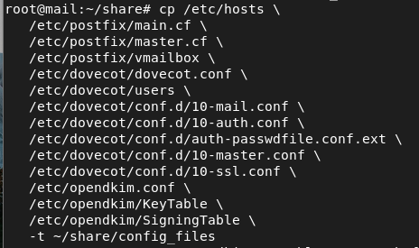

 Figure 43. Copying configs to shared folder.

## Security takeaways

### TLS/SSL Encryption

TLS/SSL was enabled for SMTP submission, IMAP, and POP3, ensuring all communication between clients and the server is encrypted. This prevents credential theft and protects message confidentiality during transit.

### Authentication Mechanisms (SPF, DKIM, DMARC)

SPF records were configured to specify who is allowed to send to the host.

DKIM was implemented through OpenDKIM to cryptographically sign outgoing mail, and DMARC policies enforced connection between SPF and DKIM.

These tools collectively mitigate spoofing & improve trust with other receiving servers.

### Port Security and Firewall Configuration

The firewall was restricted to essential ports: 25 (SMTP), 587 (submission), 993 (IMAP-SSL), and 443 (HTTPS for Roundcube).

All other ports were closed to reduce attack surface and prevent unauthorized access.

## Discussion

How Email Security Protocols Work Together?

SPF restricts unauthorized senders, DKIM signs messages to verify integrity, and DMARC ties both together, defining how receiving servers should handle failures. Combined with TLS, these protocols provide layered protection against spoofing, interception, and identity fraud.

**Real-World Applications and Use Cases**

This architecture mirrors what many organizations deploy: custom mail servers for internal communication, secure messaging environments, and hybrid setups that combine local mail handling with cloud spam filtering.

## Summary

The lab demonstrated how to set up a lab environment the closest to a real-world implementation of local email servers. During the lab, I configured main interfaces and tools to create the environment for secure email messaging, starting from DNS server configuration to configuring a web-app for managing end-users’ mails.

## References

- Postfix Documentation: <http://www.postfix.org/documentation.html>
- Dovecot Wiki: <https://doc.dovecot.org/>
- OpenDKIM Documentation: <http://www.opendkim.org/>
- Roundcube Documentation: <https://github.com/roundcube/roundcubemail/wiki>
