# 4 Web

Name of report: CIA_UNIX_LAB_4_Nikita_Niakhai
Course: Unix-based Internet Applications
Performed by Nikita Niakhai
Date submission: 12.12.2025
---

## Task 1 - Install & Configure Virtual Hosts

### 1. Download, verify, build and install the webserver daemon from the source

- Installed dependencies:

    `sudo apt update`
    `sudo apt install -y build-essential libpcre3 libpcre3-dev zlib1g zlib1g-dev \
    libssl-dev libmaxminddb0 libmaxminddb-dev mmdb-bin wget git tar ca-certificates`

    - Packages installed:
        - build-essential → gcc, g++, make, etc.
        - libpcre3-dev → PCRE library for regex support
        - zlib1g-dev → gzip compression support
        - libssl-dev → OpenSSL headers for HTTPS
        - libmaxminddb-dev → GeoIP2 library
        - mmdb-bin → mmdblookup utility
        - wget, git, tar, ca-certificates → utilities
- Downloaded latest stable source of web-server:

    `cd /usr/local/src`
    `sudo wget <https://nginx.org/download/nginx-1.26.3.tar.gz>`
    `sudo wget <https://nginx.org/download/nginx-1.26.3.tar.gz.asc>`

- Extracted: `tar -zxvf nginx-1.26.0.tar.gz`
- Configured nginx

    ```bash
    sudo tar -xzf nginx-1.26.3.tar.gz
    cd nginx-1.26.3
    sudo ./configure \
      --prefix=/etc/nginx \
      --sbin-path=/usr/sbin/nginx \
      --conf-path=/etc/nginx/nginx.conf \
      --error-log-path=/var/log/nginx/error.log \
      --http-log-path=/var/log/nginx/access.log \
      --pid-path=/var/run/nginx.pid \
      --lock-path=/var/run/nginx.lock \
      --with-http_ssl_module \
      --with-http_v2_module \
      --with-http_realip_module \
      --with-http_stub_status_module \
      --with-threads \
      --with-http_gzip_static_module \
      --add-module=/usr/local/src/ngx_http_geoip2_module
    ```

- Flags explained:
    - -prefix=/etc/nginx → base directory for configuration files
    - -sbin-path=/usr/sbin/nginx → location of the nginx binary
    - -with-http_ssl_module → enables HTTPS support
    - -with-http_v2_module → HTTP/2
    - -with-http_stub_status_module → /status page
    - -with-threads → thread pool support
    - -with-http_gzip_static_module → serve pre-compressed files
    - -add-module= → statically compiles the GeoIP2 module
- Build & Install

    `sudo make -j$(nproc)`

    `sudo make install`

    - `-j$(nproc)` uses all CPU cores for parallel compilation

### 2. Define the root directory and then two virtual hosts (and configure DNS records or wildcard accordingly)

- I configured, applied static IP address using `netplan`, opened ports for 80 and 443 ports

    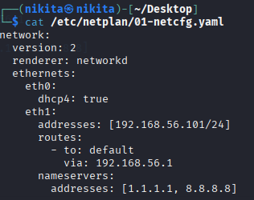

    Figure. `netplan` config

- Verified ip address, using `ip a`

    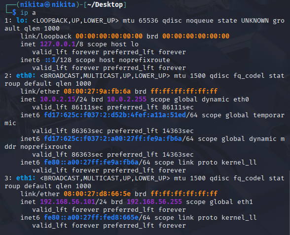

    Figure. interfaces enabled and adresses on VM

- Setup DNS records inside hosts interface in my Windows host in order to access web pages.

    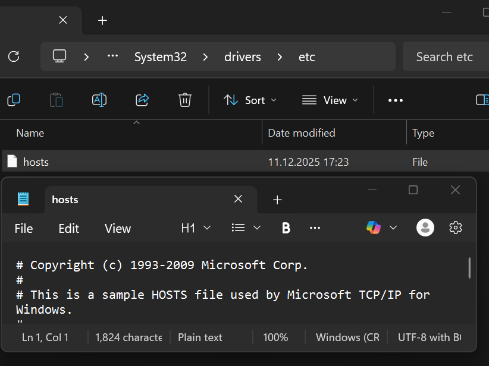

    Figure. `hosts` content

- Created root directories, files for simple html pages, set permissions and access policy

    ```bash
    sudo mkdir -p /var/www/aaa.st99.sne22.ru/html
    sudo mkdir -p /var/www/bbb.st99.sne22.ru/html

    sudo chown -R nikita:nikita /var/www/aaa.st99.sne22.ru/html
    sudo chown -R nikita:nikita /var/www/bbb.st99.sne22.ru/html
    sudo chmod -R 755 /var/www
    ```

    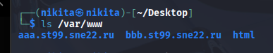

    Figure. Root directories

- Created configs for the server and `nginx`:
    - `sudo mkdir -p /etc/nginx/sites-available /etc/nginx/sites-enabled`
    - Created configs for the servers there

        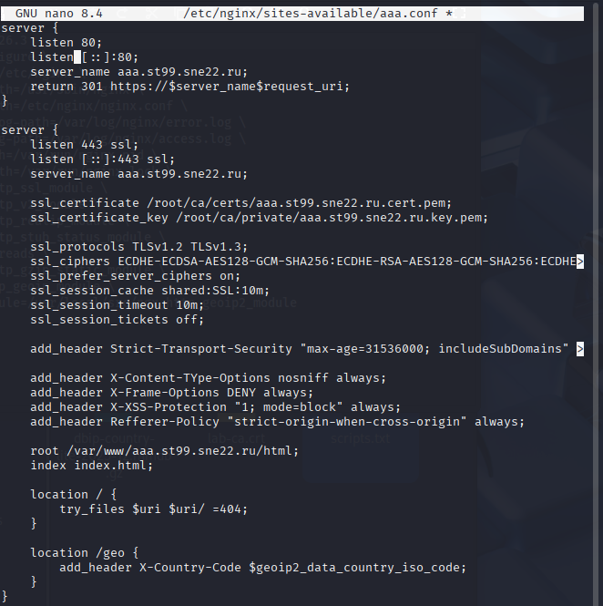

        Figure. `/etc/nginx/sites-available/aaa.conf`

        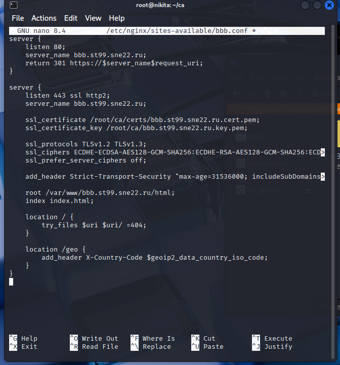

        Figure. `/etc/nginx/sites-available/bbb.conf` — identical except server_name, root, and certificate paths changed to bbb.

        **Security tuning explanations**:

        - listen 443 ssl http2 → enables HTTP/2 over TLS
        - ssl_protocols TLSv1.2 TLSv1.3 → only modern secure protocols
        - ssl_ciphers  → Mozilla "Intermediate" compatibility list (secure and widely supported)
        - ssl_prefer_server_ciphers off → allows client to choose strongest cipher
        - ssl_session_cache/tickets → improves performance while disabling tickets for forward secrecy
        - Strict-Transport-Security → forces HTTPS for 1 year
        - Additional headers → prevent MIME sniffing, clickjacking, XSS, and control referrer leakage

        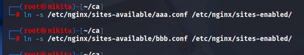

        Figure. SymLinked configs from `sites-available` folder to prod folder `sites-enabled`

    - Created `nginx.conf`

        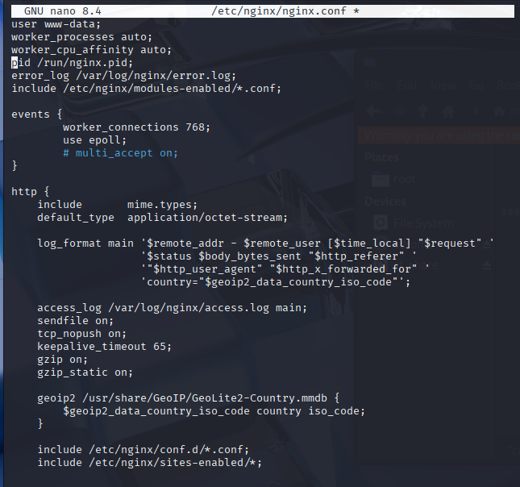

        Figure. `/etc/nginx/nginx.conf`

        - geoip2  → loads the country database and creates variable $geoip2_country_iso
        - include  → loads all virtual hosts from sites-enabled
        - Included configs for the servers in nginx.conf → `include /etc/nginx/sites-enabled/*;`
        - log_format main  → custom access log including GeoIP country
        - tcp_nopush on; + tcp_nodelay on; → optimizes TCP packet handling

### 3. Create a simple, unique HTML page for each virtual host to make sure that the server can correctly serve it

- For aaa: `/var/www/aaa/public_html/index.html`.
- For bbb: `/var/www/bbb/public_html/index.html`.
- Tested access from Windows host machine

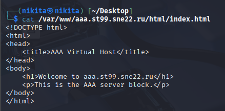

Figure. HTML page for aaa site

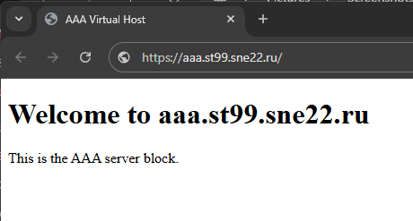

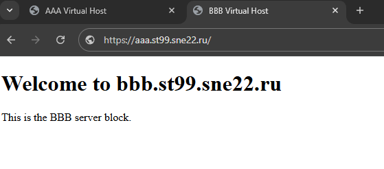

Figure. Pages accessed

### 4. Check the configuration syntax, start the daemon and enable it at boot time

- Check syntax: `sudo nginx -t`.
- Enable at boot: `sudo systemctl start/enable/restart nginx`

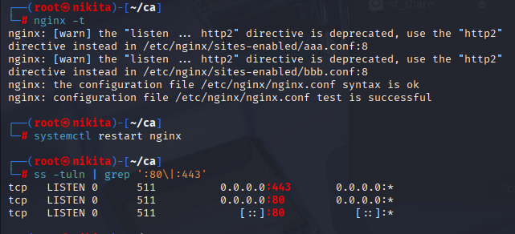

Figure. Output of `nginx -t` and `systemctl restart nginx` and listening ports.

### 5. Use curl to display the contents of a full HTTP/1.1 session served by your server

- Runed: `curl -v`

    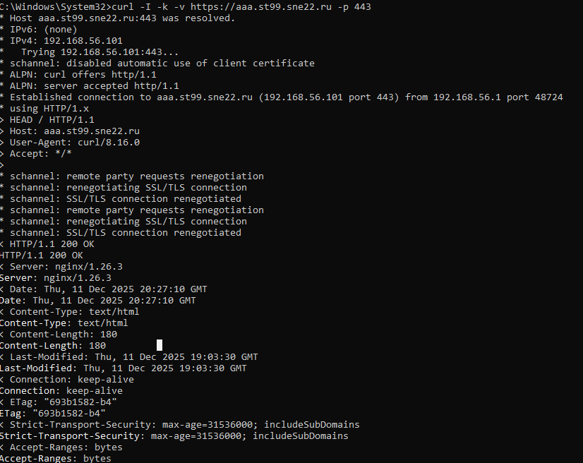

    Figure. Full curl -v output for HTTP session.

### 6. Explain the meaning of each request and reply header

- Request headers: User-Agent (client software), Host (virtual host name), Accept (accepted content types).
- Response headers: Server (web server software), Date (response time), Content-Type (response MIME type), Content-Length (body size), Connection (keep-alive or close).

## Task 2 - SSL/TLS

### 1. Enable SSL/TLS and tune the various settings to make it as secure as possible

- Add to server blocks: `listen 443 ssl; ssl_certificate /etc/ssl/certs/certificate; ssl_certificate_key /etc/ssl/private/key;`.
- Tune: In http block, add `ssl_protocols TLSv1.2 TLSv1.3; ssl_ciphers HIGH:!aNULL:!MD5; ssl_prefer_server_ciphers on; ssl_session_cache shared:SSL:10m; ssl_session_timeout 10m;`.
- Redirect HTTP to HTTPS: Add server block `server { listen 80; server_name aaa.stX.sne22.ru; return 301 https://$host$request_uri; }`.
- Reload: `sudo nginx -s reload`.

    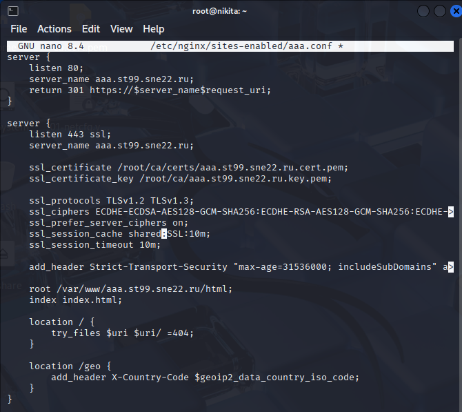

    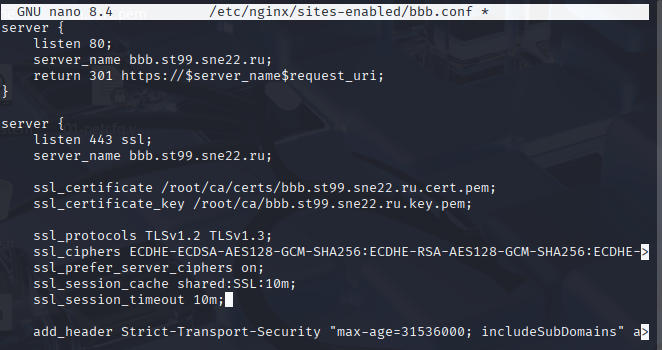

    Figure. Updated server block with SSL settings.

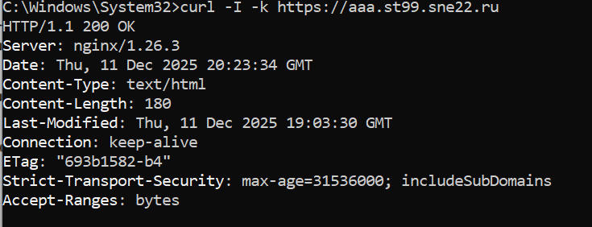

### 2. Describe how you created your own certificate(s) e.g. with Let’s encrypt (certbot) or self-signed and re-validate every virtual-host. Explain your security tuning process

- Modified `openssl.cnf` to direct to my keys and certs

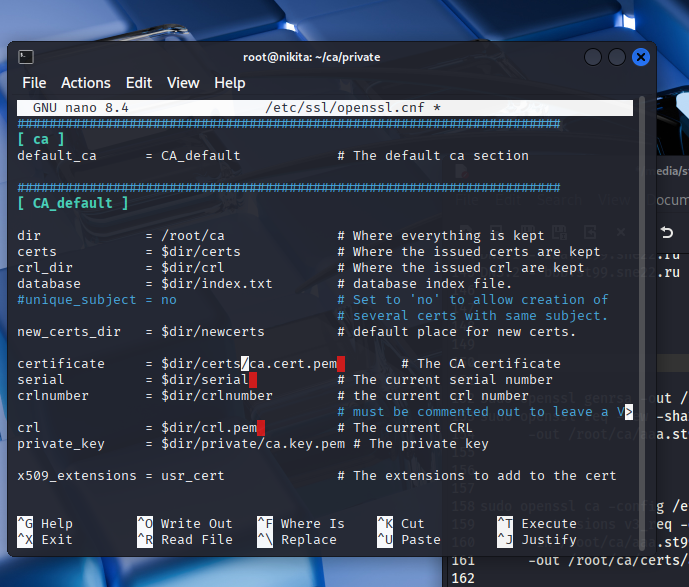

Figure. `openssl.cnf`

- Created CA directory structure

    ```bash
    sudo mkdir -p /root/ca/{certs,crl,newcerts,private}
    cd /root/ca
    sudo chmod 700 private
    touch index.txt
    echo 1000 > serial
    ```

- Generated CA key and root certificate
    - `sudo openssl genrsa -aes256 -out private/ca.key.pem 4096`
    - `sudo chmod 400 private/ca.key.pem`

    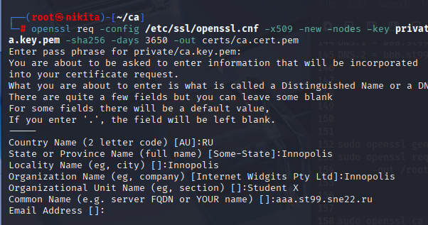

    Figure. `sudo openssl req -config /etc/ssl/openssl.cnf -x509 -new -nodes -key private/ca.key.pem -sha256 -days 3650 -out certs/ca.cert.pem`

- Server certificates (same process for both hosts) `req.cnf` and `req-bb.cnf`for SAN support

    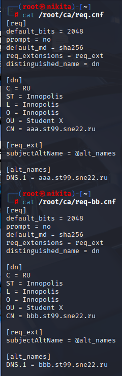

    Figure. Cnf files

    - Generated key and CSR for aaa:

        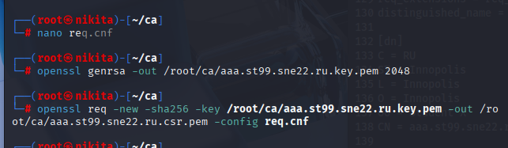

        Figure. Key and csr for aaa

    - Repeated for bbb with CN = [bbb.st99.sne22.ru](http://bbb.st99.sne22.ru/).

        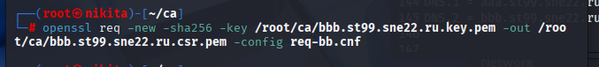

        Figure. Key and csr for aaa

- Sign server certificates

    ```bash
    sudo openssl ca -config /etc/ssl/openssl.cnf \
          -extensions v3_req -days 375 -notext -md sha256 \
          -in /root/ca/aaa.st99.sne22.ru.csr.pem \
          -out /root/ca/certs/aaa.st99.sne22.ru.cert.pem
    ```

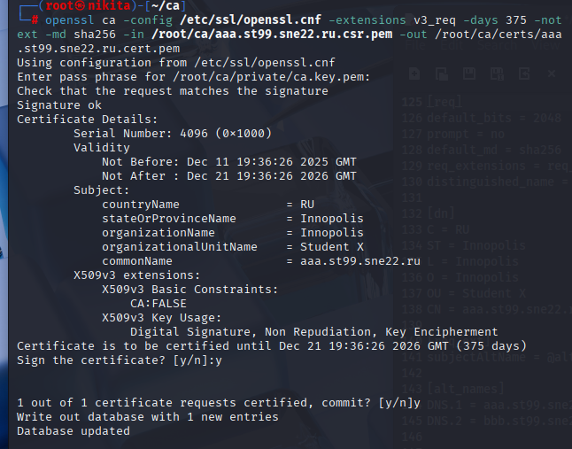

Figure. Server certificates signed for aaa

- Repeated for bbb (with `req-bb.cnf`).

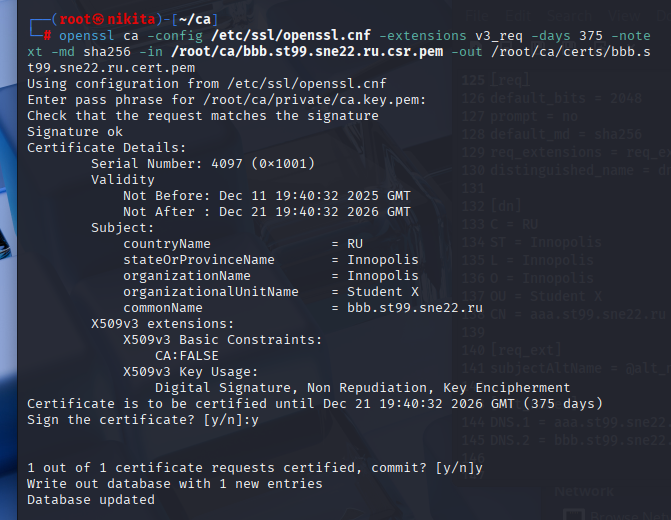

Figure. Server certificates signed for bbb

- Install CA into Windows host
    - Copied `/root/ca/certs/ca.cert.pem` to Windows desktop via shared folder → renamed to `lab-ca.crt`
    - Double-clicked → Install Certificate → Local Machine → Place all certificates in Trusted Root Certification Authorities

        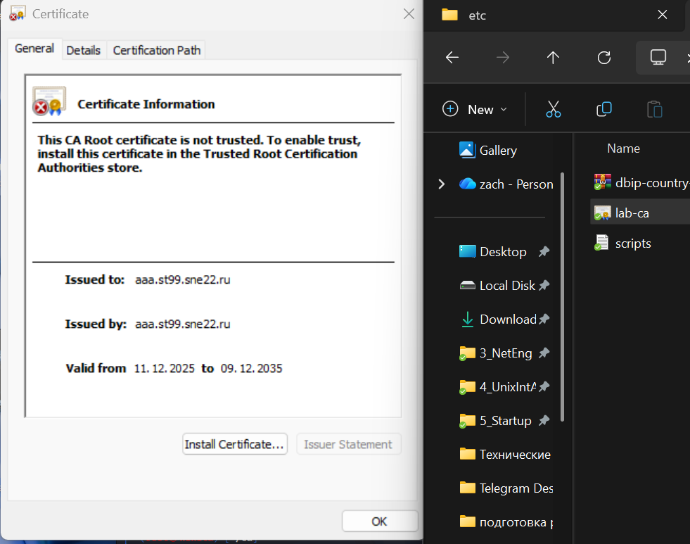

        Figure. Installation of certificate into windows local machine

        

        Figure. Installed certificate in a Chrome browser

- Tuning process: selected strong ciphers, enabled session caching for performance, HSTS: `add_header Strict-Transport-Security "max-age=31536000; includeSubDomains" always;`.

    ```bash
    # Test aaa virtual host (headers only)
    curl -I --cacert C:\Users\vaper\Desktop\lab-ca.crt https://aaa.st99.sne22.ru

    # Test bbb virtual host
    curl -I --cacert C:\Users\vaper\Desktop\lab-ca.crt https://bbb.st99.sne22.ru

    # Full page content (aaa)
    curl --cacert C:\Users\vaper\Desktop\lab-ca.crt https://aaa.st99.sne22.ru

    # Verbose output showing TLS handshake
    curl -v --cacert C:\Users\vaper\Desktop\lab-ca.crt https://aaa.st99.sne22.ru
    ```

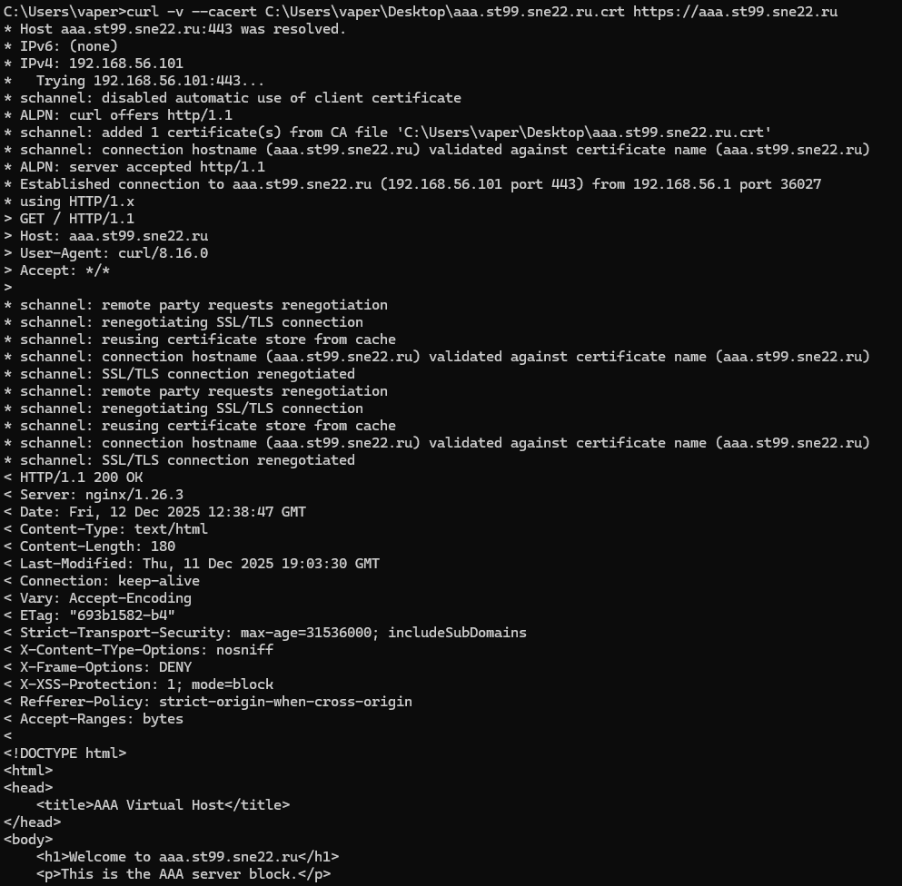

Figure. HTTPS curl test.

- **HTTPS is fully functional**
    - HTTP/1.1 200 OK
    - Connection established on port 443 to 192.168.56.101
    - TLS handshake completed successfully using your local CA
    - schannel validated the hostname correctly: connection hostname ([aaa.st99.sne22.ru](http://aaa.st99.sne22.ru/)) validated against certificate name
    - Security tuning is active (all headers present)

## Task 3 (bonus) - GeoIP

### 1. Enable GeoIP on your chosen web-server (is only NGINX capable to do this?) and show how to take advantage of it with real examples

- Compile Nginx with module: Added `-with-http_geoip_module` to configure.

```bash
*cd nginx-1.26.3
sudo ./configure \
  --prefix=/etc/nginx \
  --sbin-path=/usr/sbin/nginx \
  --conf-path=/etc/nginx/nginx.conf \
  --error-log-path=/var/log/nginx/error.log \
  --http-log-path=/var/log/nginx/access.log \
  --pid-path=/var/run/nginx.pid \
  --lock-path=/var/run/nginx.lock \
  --with-http_ssl_module \
  --with-http_v2_module \
  --with-http_realip_module \
  --with-http_stub_status_module \
  --with-threads \
  --with-http_gzip_static_module \
  ***--with-http_geoip_module \**
  *--add-module=/usr/local/src/ngx_http_geoip2_module*
```

- I download databases.
    - I visited <https://db-ip.com/db/download/ip-to-country-lite>
    - Selected free current version for db , chose MMDB format (GeoIP2/GeoLite2 compatible)
    - `wget https://download.db-ip.com/free/dbip-country-lite-2025-12.mmdb.gz`
- Configured database:

    `sudo mkdir -p /usr/share/GeoIP`

    `cd /usr/share/GeoIP`

    `sudo gunzip dbip-country-lite-2025-12.mmdb.gz`

    `sudo mv dbip-country-lite-2025-12.mmdb GeoLite2-Country.mmdb`

- Verified database.

    Output showed correct country information for Google DNS → database working.

    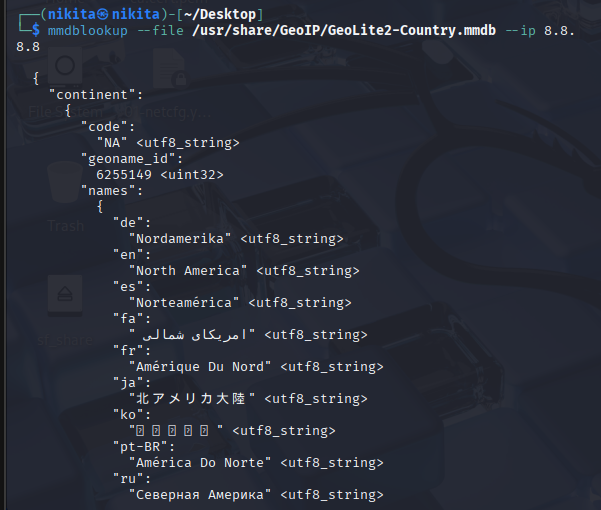

Figure. DNS querry for Google in database

- Configured geoip in configs for nginx files (nginx.cong and aaa.conf and bbb.conf)
    - **GeoIP Directive in nginx.conf** (inside the http {} block):
        - geoip2 /usr/share/GeoIP/GeoLite2-Country.mmdb {  }: Loads the country database from the specified path.
        - Inside the block: $geoip2_country_iso $geoip2_data_country_iso_code country iso_code;
            - Defines the variable $geoip2_country_iso (alias for $geoip2_data_country_iso_code).
            - Extracts the two-letter ISO country code (e.g., "US", "RU") from the database based on the client's IP address.
    - **Logging Integration**:
        - Custom log format main in nginx.conf: Includes country="$geoip2_data_country_iso_code" at the end.
        - Access log line: access_log /var/log/nginx/access.log main;
        - Result: Each entry in /var/log/nginx/access.log appends the detected country code (e.g., country="US" or empty for private/unmatched IPs).
        - Added in virtual host server blocks: add_header X-Geo-Country $geoip2_data_country_iso_code always;
        - Allows direct observation of the detected country in HTTP response headers (e.g., X-Geo-Country: RU).
- Tested that geoip works by assigning country code, looked in logs for specific querry.

    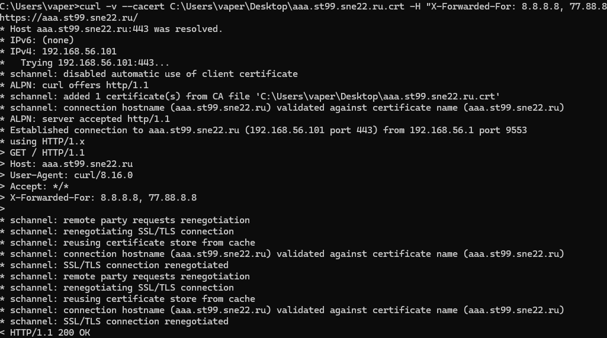

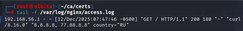

Figure. GeoIP configuration and access log examples from hosts IP.

Summary

NGINX is not the only web server capable of handling IP geolocation functionality, such as looking up a client's country based on their IP address and using it for logging, access control, redirects, or custom headers. Web-server like Apache (third-party modules), Caddy (community plugins), LiteSpeed (built-in support, easy configuration) also provide such functionality referring to cross platforms like MaxMind and GeoIP2.

But Nginx’s modules are lightweight, widely documented so that making it becomes more native in a way.

## References

- [Installing NGINX Open Source](https://docs.nginx.com/nginx/admin-guide/installing-nginx/installing-nginx-open-source/)
- [Building nginx from Sources](https://nginx.org/en/docs/configure.html)
- [How To Set Up Nginx Server Blocks (Virtual Hosts) on Ubuntu 16.04](https://www.digitalocean.com/community/tutorials/how-to-set-up-nginx-server-blocks-virtual-hosts-on-ubuntu-16-04)
- [Command-line parameters - nginx](https://nginx.org/en/docs/switches.html)
- [Launch Nginx on startup - ubuntu](https://serverfault.com/questions/69350/launch-nginx-on-startup)
- [Debug Curl Requests](https://catonmat.net/cookbooks/curl/debug-curl-requests)
- [HTTP headers - MDN Web Docs](https://developer.mozilla.org/en-US/docs/Web/HTTP/Reference/Headers)
- [Configuring HTTPS servers - nginx](https://nginx.org/en/docs/http/configuring_https_servers.html)
- [How To Configure Nginx to use TLS 1.2 / 1.3 only](https://www.cyberciti.biz/faq/configure-nginx-to-use-only-tls-1-2-and-1-3/)
- [Create a Self-Signed Certificate for Nginx in 5 Minutes](https://www.humankode.com/ssl/create-a-selfsigned-certificate-for-nginx-in-5-minutes/)
- [Certbot instructions for NGINX](https://certbot.eff.org/instructions?ws=nginx&os=ubuntufocal)
- [Module ngx_http_geoip_module - nginx](https://nginx.org/en/docs/http/ngx_http_geoip_module.html)
- [GeoIP | NGINX Documentation](https://docs.nginx.com/nginx/admin-guide/dynamic-modules/geoip/)
