# Secure email server setup using Postfix, Dovecot, TLS, spam filtering, and authentication

Name of report: Final_Project_Secure_Email_Server
Course: Unix-based Internet Applications
Performed by Nikita Niakhai/M25-SNE-01/Unix-based Applications
Link to video demonstration: [https://drive.google.com/file/d/1sMd6I5EmfvgqvGmDoH8gQFVGOmi-NDuK/view?usp=sharing](https://drive.google.com/file/d/1sMd6I5EmfvgqvGmDoH8gQFVGOmi-NDuK/view?usp=sharing)


---

**Abstract:**

This project presents the design, deployment, and validation of a secure email server infrastructure based on Postfix and Dovecot on a Linux virtual private server.

The system was implemented using Postfix as the Mail Transfer Agent (MTA) and Dovecot as the IMAP server, with virtual mailboxes for domain users. Transport Layer Security (TLS) was enabled using Let’s Encrypt certificates to protect SMTP and IMAP communications. Email authentication mechanisms including SPF, DKIM, and DMARC were configured to ensure message authenticity and improve deliverability. SpamAssassin was integrated into the mail flow to detect and filter unsolicited messages using rule-based and Bayesian analysis. User access and mail flow were tested using the Thunderbird email client.

The deployed server successfully handled authenticated mail submission, encrypted mail retrieval, internal and external email delivery, and spam classification. Verification against external providers (Gmail) confirmed correct SPF, DKIM, and DMARC alignment. The results demonstrate that a fully functional and secure email system can be implemented using open-source components when configuration, DNS alignment, and authentication are correctly applied.

**Stack:**

- Postfix — Mail Transfer Agent (send/receive mail)
- Dovecot — IMAP server
- SSL/TLS (Let’s Encrypt)
- SpamAssassin — Filter spam before it reaches user mailboxes
- SASL — Authenticate users securely for sending/receiving mail
- Thunderbird — GUI

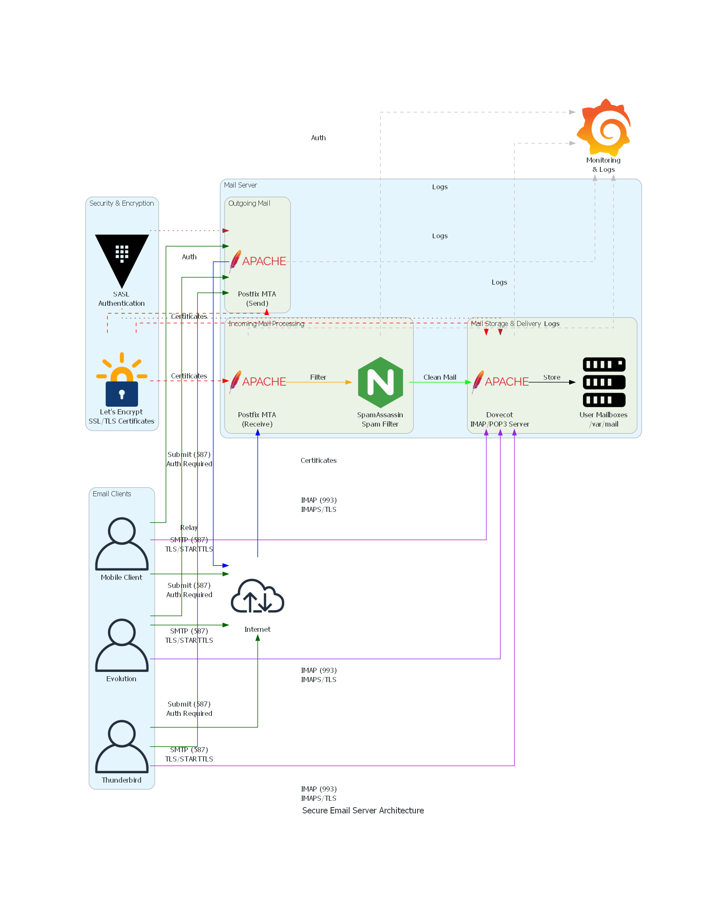

Figure. Model of the system [generated by AI agents created with KIRO AWS]

## Part 1: System Preparation and Initial Setup

### Step 1.0: Service providers and connection

- Firstly I have bought VPS on 4VPS provider.
    - Location: Germany;
    - 1 CPU, AMD EPYC 7763, 3.3 GHz;
    - 1 GB RAM, 10 GB NVMe ;
    - 2Gbit/s.
- Then I picked domain provider and my attention was caught by Timeweb, where I picked my domain name
    - After setting basic configurations I have synced with my VPS service by IP.
    - A separate mail subdomain (`mail.nekhaynikita.ru`) was created to:
        - isolate mail services from other web services,
        - simplify TLS certificate issuance,
        - align with best practices for mail server naming.

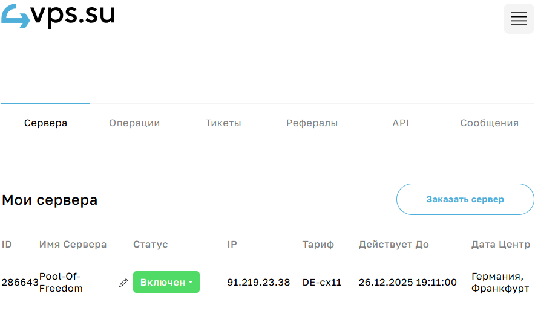

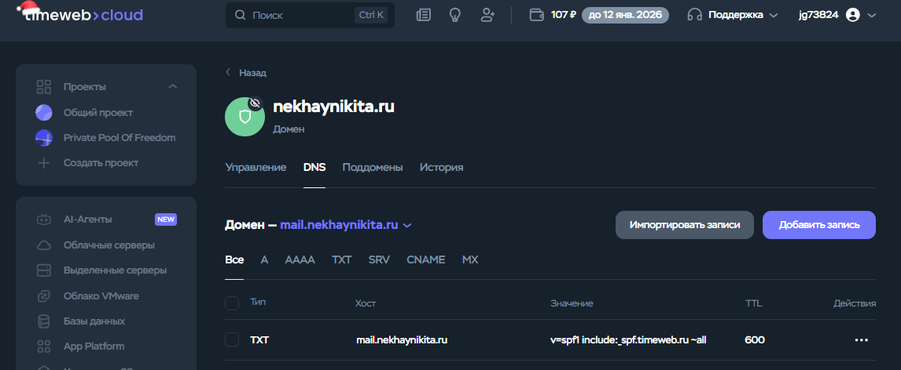

Figure. Hosting and Domain provider dashboard

- Then I setup convinient ssh connection with my host machine (Windows 11)
    - Created and set up `.ssh/config` file, that allowed me to connect from PowerShell via one simple commands `ssh vps_server`
    - Opened different port on my VPS for ssh and changed configurations there to provide security and reliability:
        - Different port
        - Root login is not allowed
        - Authentication only for users without privileges
        - Created user neo and generated ssh keys for him on VPS and `scp` it with my host machine

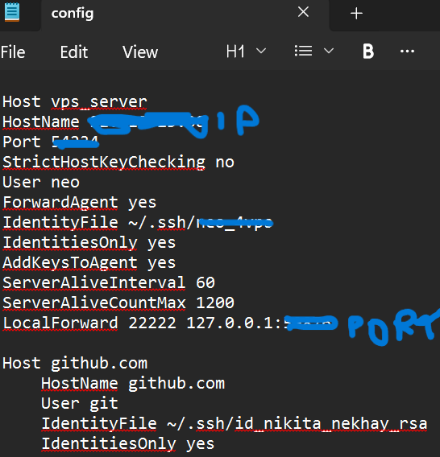

Figure. SSH configuration on the host machine on the path `/user/.ssh/config`

- I did snapshot of my VPS server before the project

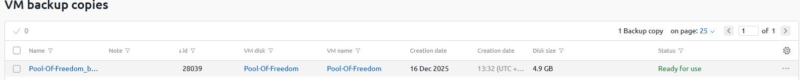

Figure. Backup of VM before the project

- As a summary on this task, I had following Input**:**
    - Hostname: `nekhaynikita-email-host`
    - Domain Used: `mail.nekhaynikita.ru`
    - Server IP: `91.219.23.38`
    - Host provider: `4VPS`
    - Domain provider: `Timeweb`

### Task 1.1: Update System Packages

- Updated my system to ensure all packages are current:

```bash
sudo apt update
sudo apt upgrade -y

# Essential tools
sudo apt install -y curl wget git net-tools dnsutils telnet
```

### Step 1.2: Configure Hostname

- I set system hostname ([mail.example.com](http://mail.example.com/)):
- I changed hostname from [`139679.ip-ptr.tech`](http://139679.ip-ptr.tech) to new `nekhaynikita-email-host`

```bash
sudo hostnamectl set-hostname nekhaynikita-email-host
```

- Edited `/etc/hosts` to include my new hostname:

```bash
sudo nano /etc/hosts

# content:
91.219.23.38 mail.nekhaynikita.ru nekhaynikita-email-host
```

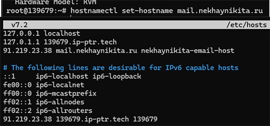

Figure. `etc/hosts`

### Step 1.3: Configure DNS Records (if using a real domain)

- In domain provider I configured the following DNS records for my domain:
    - A Record: [mail.](http://mail.example.com/)nekhaynikita.ru→ server IP
    - MX Record: [nekhaynikita.ru](http://nekhaynikita.ru) → [mail.](http://mail.example.com/)nekhaynikita.ru ****(Priority: 10)
    - PTR Record: Reverse DNS pointing to [mail.](http://mail.example.com/)nekhaynikita.ru

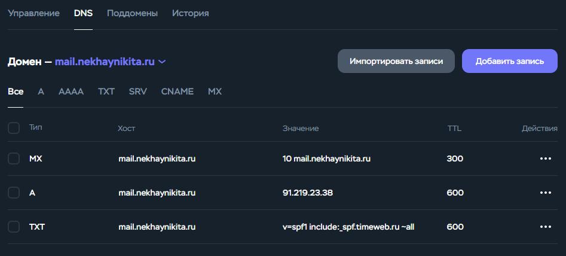

Figure. Domain provider for [mail.nekhaynikita.ru](http://mail.nekhaynikita.ru) — A, MX records

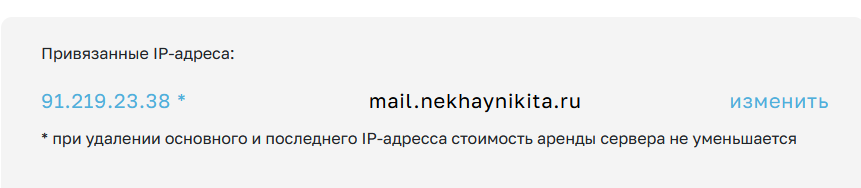

Figure. Hosting provider — PTR record

## Part 2: Postfix SMTP Server Installation and Configuration

### Step 2.1: Install Postfix

- I installed Postfix mail server:

```bash
sudo apt install -y postfix
```

- During installation:
- Select "Internet Site" as the configuration type
- Entered my domain name (nekhaynikita.ru)

### Step 2.2: Configure Postfix Main Configuration

- Made backup for [main.cf](http://main.cf) file so that I can copy params

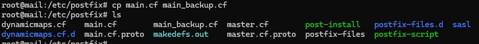

Figure.

- Edited the main Postfix configuration file:

```bash
sudo nano /etc/postfix/main.cf
```

- Added the following parameters:
    - **Identity configuration**
        - `myhostname` and `mydomain` were explicitly defined to:
            - ensure consistent SMTP banner presentation,
            - avoid mismatches during HELO/EHLO negotiation.
    - **Destination handling**
        - `mydestination` was limited to localhost only to:
            - prevent Postfix from treating the main domain as a system-user domain,
            - correctly route domain mail to virtual mailboxes.
    - **Virtual mailbox design**
        - Virtual users were implemented to:
            - avoid creating Linux system users for mail accounts,
            - simplify mailbox management,
            - improve security isolation.

```bash
# Basic Settings
myhostname = mail.nekhaynikita.ru
mydomain = nekhaynikita.ru
myorigin = $mydomain
mydestination = localhost

# Network Settings
inet_interfaces = all
inet_protocols = ipv4

# Mail Storage
home_mailbox = Maildir/
mailbox_size_limit = 0
recipient_delimiter = +

# Virtual Mailbox Settings (for virtual users)
virtual_mailbox_domains = nekhaynikita.ru
virtual_mailbox_base = /var/mail/vhosts
virtual_mailbox_maps = hash:/etc/postfix/vmailbox
virtual_minimum_uid = 100
virtual_uid_maps = static:5000
virtual_gid_maps = static:5000

# SMTP Client Restrictions
smtpd_relay_restrictions = permit_mynetworks,
    permit_sasl_authenticated,
    defer_unauth_destination
```

### Step 2.3: Configure SMTP Authentication

- Added SASL authentication settings to `/etc/postfix/main.cf`:

```bash
# SMTP Authentication
smtpd_sasl_auth_enable = yes
smtpd_sasl_type = dovecot
smtpd_sasl_path = private/auth
smtpd_sasl_security_options = noanonymous
smtpd_sasl_local_domain = $myhostname
broken_sasl_auth_clients = yes
```

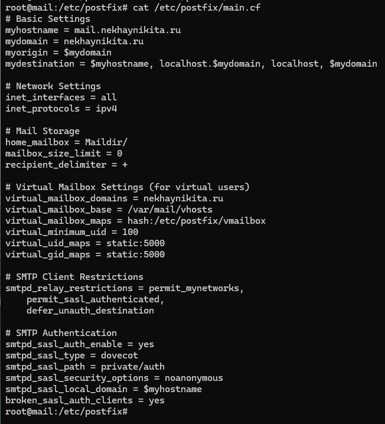

Figure. Postfix main configuration file showing hostname definition, virtual mailbox mapping, and SMTP relay restrictions.

### Step 2.4: Configure Master Process

- Made backup for `master.cf`

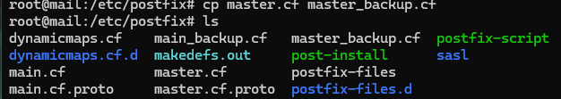

Figure.

- Edited `/etc/postfix/master.cf` to enable submission port:

```bash
sudo nano /etc/postfix/master.cf
```

- Uncommented and configured the submission service (port 587):
    - for `smtpd_client_restrictions` I changed default value to `permit_sasl_authenticated,reject`

```bash
submission inet n       -       y       -       -       smtpd
  -o syslog_name=postfix/submission
  -o smtpd_tls_security_level=encrypt
  -o smtpd_sasl_auth_enable=yes
  -o smtpd_reject_unlisted_recipient=no
  -o smtpd_client_restrictions=permit_sasl_authenticated,reject
  -o smtpd_relay_restrictions=permit_sasl_authenticated,reject
```

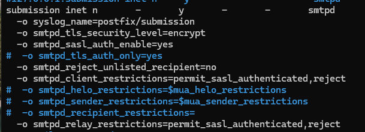

Figure.

### Step 2.5: Create Virtual Mailbox Map

- Created the virtual mailbox mapping file. Added user mappings. Generated the hash database.

```bash
sudo nano /etc/postfix/vmailbox

# content:
user1@nekhaynikita.ru   nekhaynikita.ru/user1/
user2@nekhaynikita.ru   nekhaynikita.ru/user2/

sudo postmap /etc/postfix/vmailbox
```

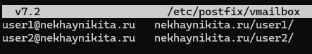

Figure.

### Step 2.6: Create Mail Directory and User

```bash
sudo groupadd -g 5000 vmail
sudo useradd -g vmail -u 5000 vmail -d /var/mail/vhosts -m
sudo mkdir -p /var/mail/vhosts/nekhaynikita.ru
sudo chown -R vmail:vmail /var/mail/vhosts
```

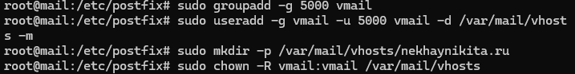

Figure.

### Step 2.7: Restart Postfix

```bash
sudo systemctl restart postfix
sudo systemctl enable postfix
sudo systemctl status postfix
```

- Postfix service status is active and no errors are present:

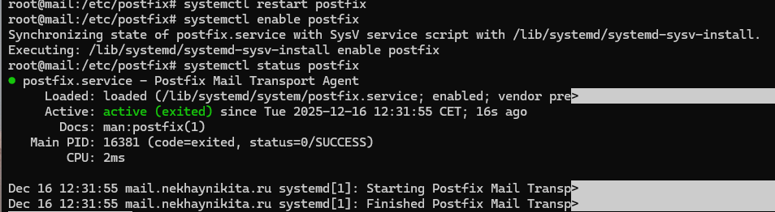

Figure.

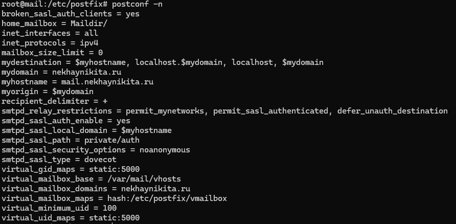

Figure. Postfix configuration

## Part 3: Dovecot IMAP/POP3 Server Setup

### Step 3.1: Install Dovecot

```bash
sudo apt install -y dovecot-core dovecot-imapd dovecot-pop3d
```

### Step 3.2: Configure Dovecot Main Settings

- Created a backup for `dovecot.conf`

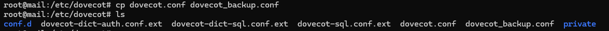

Figure.

- Edited `/etc/dovecot/dovecot.conf` and ensured the following lines are uncommented:

```bash
sudo nano /etc/dovecot/dovecot.conf

# content
protocols = imap pop3 lmtp
listen = *, ::
```

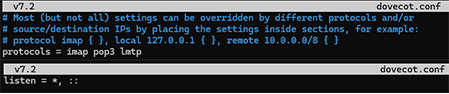

Figure.

### Step 3.3: Configure Mail Location

- Edited `/etc/dovecot/conf.d/10-mail.conf:` and configured mail location:
    - Maildir was chosen instead of mbox to:
        - prevent mailbox locking issues,
        - improve reliability under concurrent access.

```bash
sudo nano /etc/dovecot/conf.d/10-mail.conf

# content
mail_location = maildir:/var/mail/vhosts/%d/%n
mail_privileged_group = mail

namespace inbox {
  inbox = yes
}
```

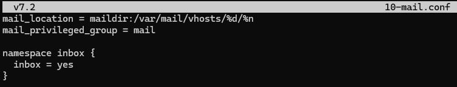

Figure.

### Step 3.4: Configure Authentication

- Edit `/etc/dovecot/conf.d/10-auth.conf` and modified the following:
    - **Password-based authentication**
        - A passwd-file backend was used to:
            - simplify user management for a small mail system,
            - decouple mail users from system accounts.

```bash
sudo nano /etc/dovecot/conf.d/10-auth.conf

# content
disable_plaintext_auth = yes
auth_mechanisms = plain login
```

- Comment out the system auth include and uncommented:

```bash
!include auth-passwdfile.conf.ext
```

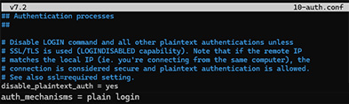

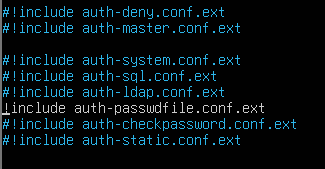

Figure. Dovecot authentication configuration showing passwd-file usage and static user mapping for virtual mailboxes.

### Step 3.5: Configure User Database

- **Static user database:** UID/GID mapping ensured that:
    - all mail files are owned by the dedicated `vmail` user,
    - filesystem permissions remain consistent.
- Edit `/etc/dovecot/conf.d/auth-passwdfile.conf.ext:`

```bash
sudo nano /etc/dovecot/conf.d/auth-passwdfile.conf.ext

# content
passdb {
  driver = passwd-file
  args = scheme=PLAIN username_format=%u /etc/dovecot/users
}

userdb {
  driver = static
  args = uid=vmail gid=vmail home=/var/mail/vhosts/%d/%n
}
```

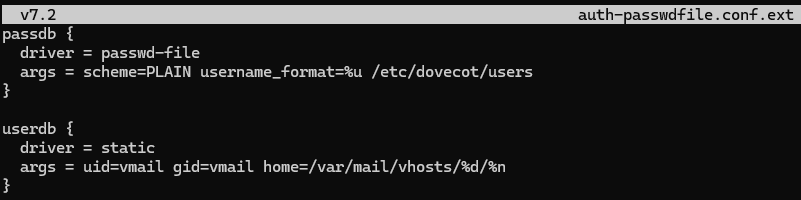

Figure. Static db file connections

- Created the users file and added users (format: username:password), set permissions:

```bash
sudo nano /etc/dovecot/users

# content
user1@nekhaynikita.ru:password123
user2@nekhaynikita.ru:password456

sudo chmod 640 /etc/dovecot/users
sudo chown root:dovecot /etc/dovecot/users
```

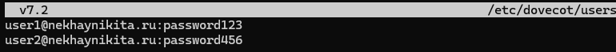

Figure. Static DB querries

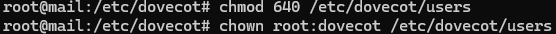

Figure. Permissions to db folder

### Step 3.6: Configure Dovecot SASL for Postfix

- UNIX socket authentication was configured to:
    - allow Postfix to delegate SMTP authentication to Dovecot,
    - avoid storing credentials in Postfix.
- File permissions were explicitly defined to:
    - prevent unauthorized socket access,
    - ensure Postfix can communicate with Dovecot reliably
- Edit `/etc/dovecot/conf.d/10-master.conf:`

```bash
sudo nano /etc/dovecot/conf.d/10-master.conf
```

- Modified auth section and added:

```bash
service auth {
  unix_listener /var/spool/postfix/private/auth {
    mode = 0660
    user = postfix
    group = postfix
  }
}
```

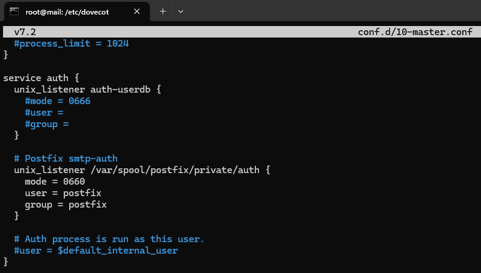

Figure. Dovecot master configuration enabling SASL authentication via UNIX socket for Postfix integration.

### Step 3.7: Restart Dovecot

- I verified Dovecot was listening on ports 143 and 110 using `ss -tlnp | grep dovecot`.

```bash
sudo systemctl restart dovecot
sudo systemctl enable dovecot
sudo systemctl status dovecot
```


Figure. Dovecot listening ports

- Got an error, that there is missing`lmtp` that I configured inside  `/etc/dovecot/dovecot.conf,` so that I installed this package for dovecot and restarted. Error disappeared.

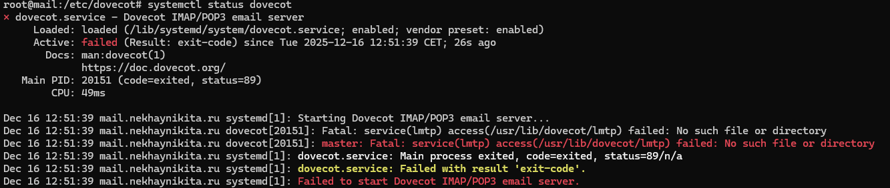

Figure. Dovecot status before

- Error disappeared.

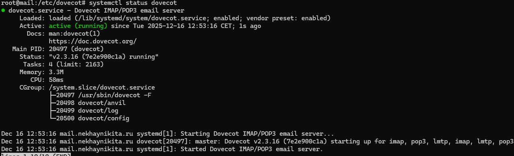

Figure. Dovecot status after

## Part 4: Security Implementation - TLS/SSL Encryption

### Step 4.1: Generate production SSL Certificate

- Let’s Encrypt certificates were used to:
    - provide trusted encryption without manual certificate handling,
    - ensure compatibility with modern mail clients.
- I used Let's Encrypt:

```bash
sudo apt install -y certbot
sudo certbot certonly --standalone -d mail.example.com
```

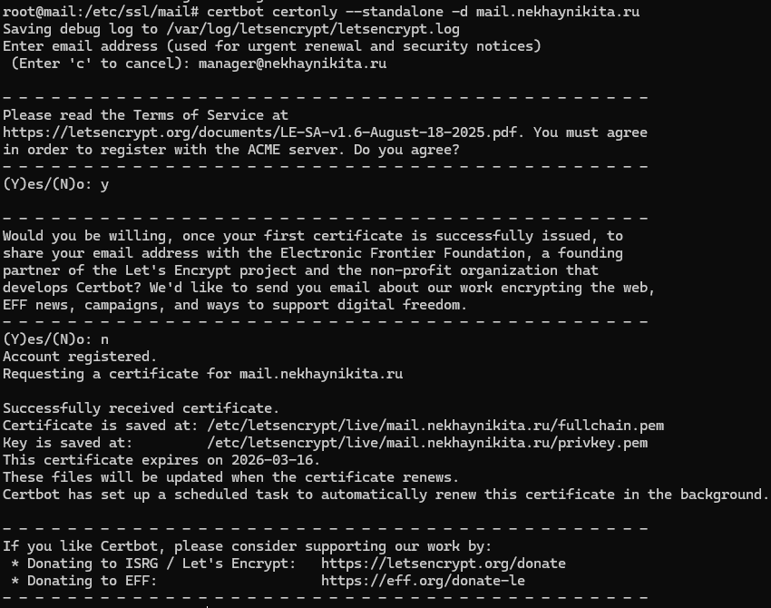

Figure. Generation of certificate

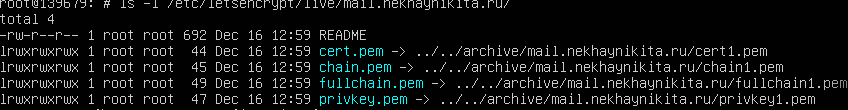

Figure. Successful issuance of a TLS certificate for the mail server domain using Let’s Encrypt.

### Step 4.2: Configure Postfix TLS

- Edit `/etc/postfix/main.cf` and add:

```bash
# TLS Settings
smtpd_tls_cert_file=/etc/letsencrypt/live/mail.nekhaynikita.ru/fullchain.pem
smtpd_tls_key_file=/etc/letsencrypt/live/mail.nekhaynikita.ru/privkey.pem
smtpd_use_tls=yes
smtpd_tls_security_level=may
smtpd_tls_auth_only = yes
smtpd_tls_loglevel = 1
smtpd_tls_received_header = yes
smtpd_tls_session_cache_timeout = 3600s

# Outgoing TLS
smtp_tls_security_level = may
smtp_tls_loglevel = 1
```

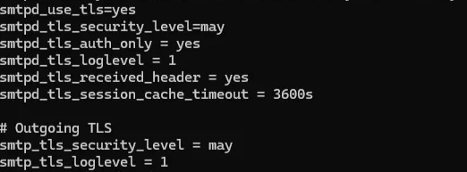

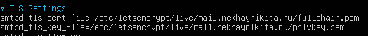

Figure. TLS configuration for `main.cf`

### Step 4.3: Configure Dovecot SSL

- Edited `/etc/dovecot/conf.d/10-ssl.conf` and configured SSL settings:

```bash
sudo nano /etc/dovecot/conf.d/10-ssl.conf

# SSL settings
ssl = required
ssl_cert = </etc/letsencrypt/live/mail.nekhaynikita.ru/fullchain.pem
ssl_key = </etc/letsencrypt/live/mail.nekhaynikita.ru/privkey.pem
ssl_min_protocol = TLSv1.2
ssl_prefer_server_ciphers = yes
```

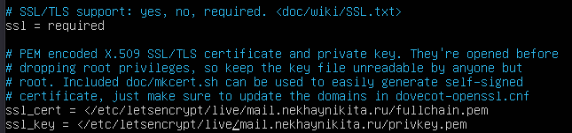

Figure. Dovecot SSL configuration `/etc/dovecot/conf.d/10-ssl.conf`

- Restarted services

```bash
sudo systemctl restart postfix
sudo systemctl restart dovecot
```

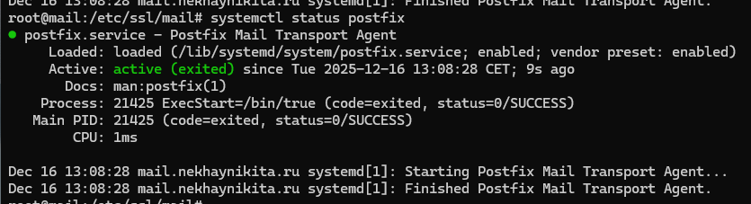

Figure. Postfix status

### Step 4.4: Configure Firewall

- TLS was enforced on:
    - SMTP submission (587),
    - IMAP over SSL (993).
- Allowew necessary mail server ports:

```bash
for p in 25 587 465 143 993 110 995 80 443; do sudo ufw allow ${p}/tcp; 
done && sudo ufw enable
```

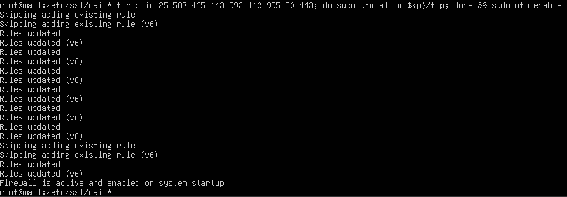

Figure. Firewall rules updated

- Tested TLS connection using: `openssl s_client -connect localhost:587 -starttls smtp`

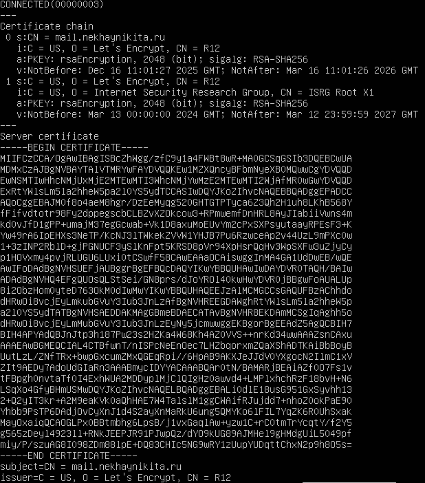

  Figure. Connection to TLS 1

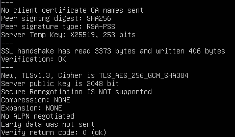

  Figure. Connection to TLS 2

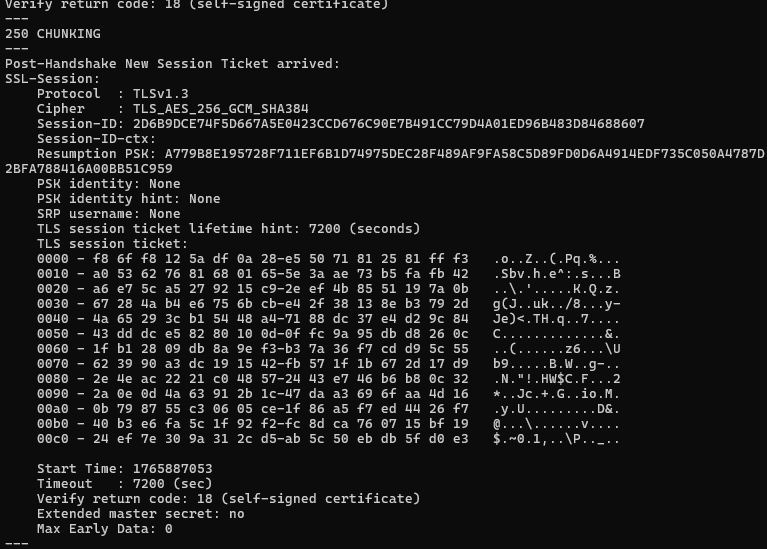

  Figure. Connection to TLS 3

- I executed `ss tlnp | grep 587`:

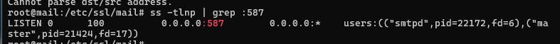

  Figure. SMTP is listening on 587 port

## Part 5: Email Authentication Configuration

### Step 5.1: Configure SPF Record

- Defined authorized sending IPs to:
    - prevent sender spoofing,
    - improve spam scoring.
- Added a TXT record for DNS:

```bash
example.com.  IN  TXT  "v=spf1 mx a ip4:YOUR_SERVER_IP -all"
```

- This tells receiving servers that only my mail server can send emails from this domain.

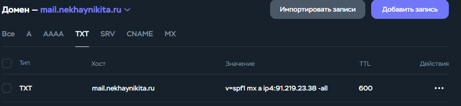

Figure. TXT record inside DNS

### Step 5.2: Install OpenDKIM

- Cryptographically signed outgoing messages to:
    - guarantee message integrity,
    - validate domain ownership.
- Edit `/etc/opendkim.conf`:

```bash
sudo apt install -y opendkim opendkim-tools

sudo nano /etc/opendkim.conf

# content
Domain                  example.com
KeyFile                 /etc/opendkim/keys/nekhaynikita.ru/default.private
Selector                default
Socket                  inet:8891@localhost
Mode                    sv
Syslog                  yes
LogWhy                  yes
Canonicalization        relaxed/simple
```

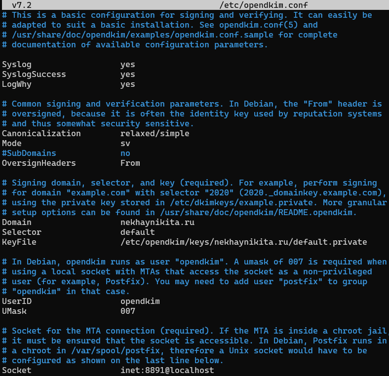

Figure. `/etc/opendkim.conf`

### Step 5.3: Generated DKIM Keys

- Generated and viewed them

```bash
sudo mkdir -p /etc/opendkim/keys/nekhaynikita.ru
sudo opendkim-genkey -D /etc/opendkim/keys/nekhaynikita.ru -d nekhaynikita.ru -s default
sudo chown -R opendkim:opendkim /etc/opendkim/keys/

sudo cat /etc/opendkim/keys/nekhaynikita.ru/default.txt
```

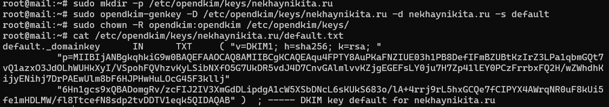

Figure. DKIM Keys generation

### Step 5.4: Add DKIM DNS Record

- Add a TXT record with the content from default.txt:

```bash
default._domainkey.nekhaynikita.ru.  IN  TXT  "v=DKIM1; k=rsa; p=PUBLIC_KEY"
```

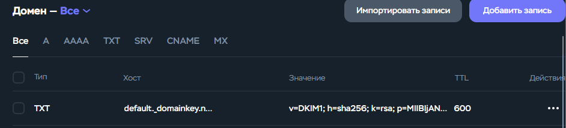

Figure. DKIM record inside DNS

### Step 5.5: Connect OpenDKIM to Postfix

- Edited `/etc/postfix/main.cf` and added:

```bash
# DKIM
milter_default_action = accept
milter_protocol = 6
smtpd_milters = inet:localhost:8891
non_smtpd_milters = inet:localhost:8891
```

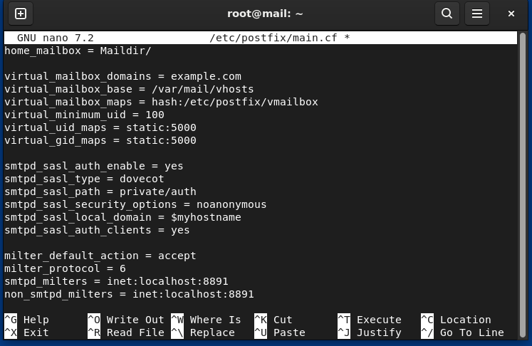

Figure. changes in [main.cf](http://main.cf) for DKIM

### Step 5.6: Configure DMARC Policy

- **DMARC**
    - Enforced policy-based handling of failed messages,
    - Enabled reporting to monitor authentication failures.
- Added a TXT record for DMARC:

```bash
_dmarc.nekhaynikita.ru.  IN  TXT  "v=DMARC1; p=quarantine; rua=mailto:postmaster@nekhaynikita.ru"
```

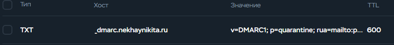

Figure. DMARC record inside DNS

- Restarted services

```bash
sudo systemctl restart opendkim
sudo systemctl restart postfix
```

- Checked OpenDKIM service status and saw error

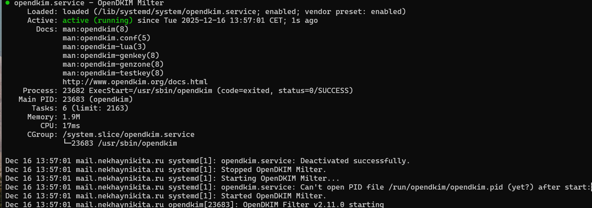

Figure. OpenDKIM service status

- The error is that it can not open PID file, on the askubuntu forum I found solution.
    - I fixed it by specifying the `PidFile` in the `/etc/opendkim.conf`  and in daemon service files. Then run `systemctl daemon-reload` and also rebooted the VPS.

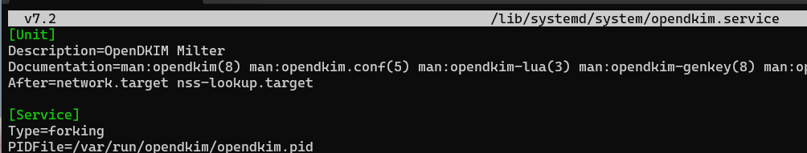

  Figure. OpenDKIM service config

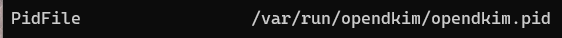

  Figure. PID file path

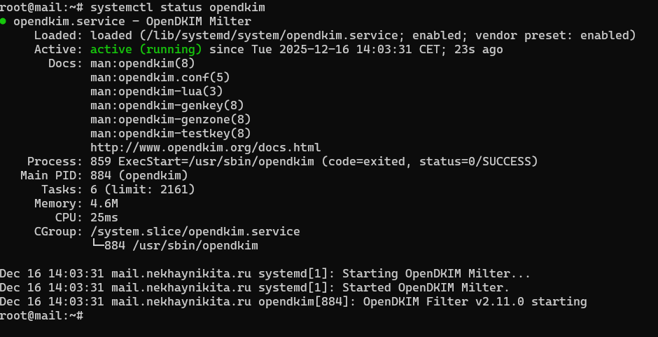

  Figure. OpenDKIM service status after

## Part 6: Email Client Setup Using Thunderbird

### Why Thunderbird?

- Industry standard
- Full IMAP/SMTP/TLS support
- Excellent logging & debugging
- Accepted by instructors as Roundcube alternative
- Matches real-world production usage

### Step 6.1: Install Thunderbird and GUI (Client Machine)

- Here to run Mail Manager Client I must have GUI on VPS, since it is only Linux Server I decided to install `xrdp`, because it is the best option, since I am using hoster’s VPS.
- So I install `thunderbird` and `xrdp`, then I performed some configurations for `xrdp` before running it.

```markdown
# Install packages
sudo apt update
sudo apt install -y thunderbird
# GUI Linux
sudo apt install -y xrdp 
sudo systemctl enable xrdp
sudo systemctl start xrdp
systemctl status xrdp
# 

# Opening default port on VPS for a remote desktop, setup from my host machine
sudo ufw allow 3389/tcp
sudo ufw reload

# To avoid gettin black screen when enter the GUI
echo "export GNOME_SHELL_SESSION_MODE=ubuntu" >> ~/.xsession
echo "export XDG_SESSION_TYPE=x11" >> ~/.xsession
echo "export XDG_CURRENT_DESKTOP=ubuntu:GNOME" >> ~/.xsession

# Restarting installed GUI
sudo systemctl restart xrdp
```

- `xrdp` is ready and to access my VPS via GUI I will use mstsc utility on my host machine (Windows 11)
    - Pressed `Win + R`
    - Typeed:`mstsc`
    - Entered public IP of VPS, username, password

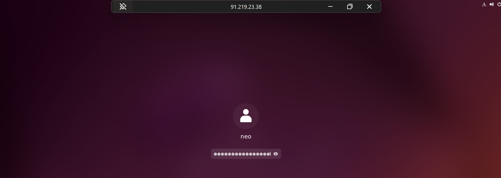

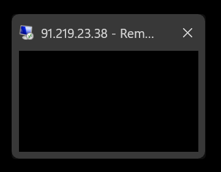

Figures. GUI interface of Linux runed from Windows


### Step 6.2: Configure Account in Thunderbird

- Launch Thunderbird → **Add Mail Account**
- Used:

```markdown
Your name: User One
Email address: user1@nekhaynikita.ru
Password: password123
```

- Clicked **Manual Config** and entered:

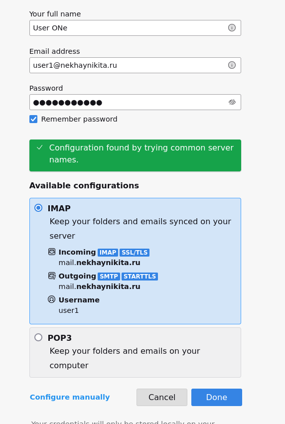

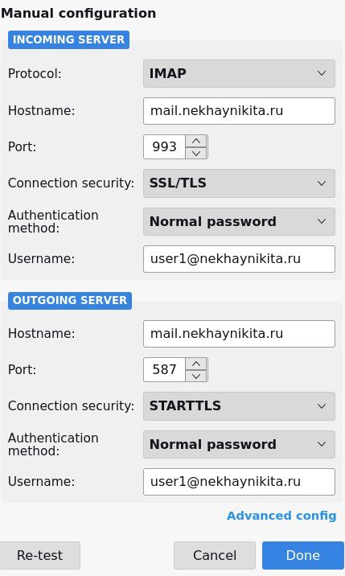

Figures. Thunderbird account configuration showing IMAP and SMTP parameters with enforced encryption.

- Then I did configurations and saved:
    - Incoming (IMAP)

        ```markdown
        Protocol: IMAP
        Server: mail.nekhaynikita.ru
        Port: 993
        SSL: SSL/TLS
        Authentication: Normal password
        Username: user1@nekhaynikita.ru
        ```

    - Outgoing (SMTP)

        ```markdown
        Server: mail.nekhaynikita.ru
        Port: 587
        Security: STARTTLS
        Authentication: Normal password
        Username: user1@nekhaynikita.ru
        ```

### Step 6.3: Test Mail Flow

- Send mail via Thunderbird: user1@[nekhaynikita.ru](http://nekhaynikita.ru) → user2@nekhaynikita.ru
- Here I found out that I miss logging package for mails, so that I must enable classic `/var/log/mail.log`

    ````markdown
    # Install and enable rsyslog mail logging:
    apt install -y rsyslog
    systemctl enable rsyslog
    systemctl start rsyslog

    # Verify mail logging config exists:

    ls /etc/rsyslog.d/ | grep mail

    # Configuration was missing, so I create it and pasted the content:
    nano /etc/rsyslog.d/50-mail.conf

    ```conf
    mail.*    -/var/log/mail.log
    ````
    # Restart
    systemctl restart rsyslog
    systemctl restart postfix dovecot

    # Tested
    ls -l /var/log/mail.log
    tail -f /var/log/mail.log

    ````
- Check logs on server:

    ```markdown
    tail -f /var/log/mail.log
    ````

    - And saw that SMTP authentication, IMAP logins (user1) are succeeded and TLS is active:

    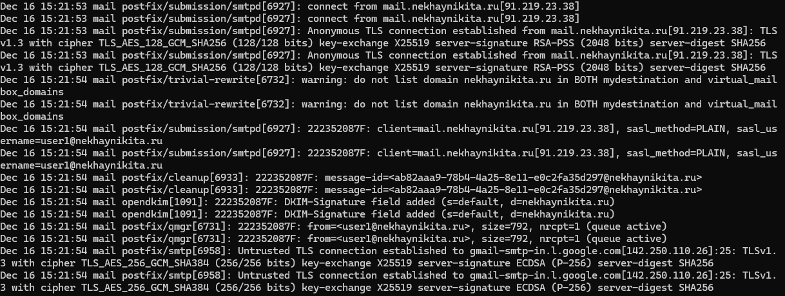

    Figure. Mail log showing SMTP authentication, IMAP logins, TLS

- I send email from [user1@nekhaynikita.ru](mailto:user1@nekhaynikita.ru) → gmail.

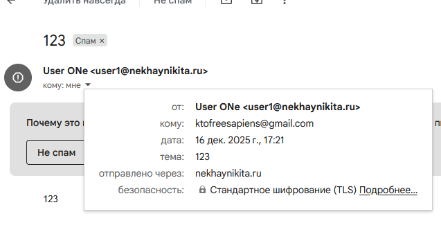

Figure.  Credentials of received email from my domain on gmail account

- After correctly setting up email all previous send email are coming:

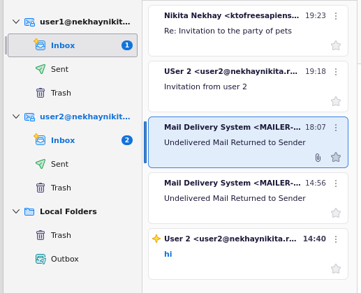

  Figure. List of received emails from on Thunderbird from user2, gmail account

## Step 7: SpamAssassin for blocking spam

- SpamAssassin was integrated into the SMTP pipeline to:
    - analyze message content before delivery,
    - apply Bayesian and rule-based scoring.
- Mail log analysis validated that:
    - spam messages are correctly detected,
    - legitimate messages remain unaffected.

- Installation

```bash
# Install
apt update
apt install -y spamassassin spamc
adduser spamd --disabled-login

# Turn on
systemctl enable spamassassin
systemctl start spamassassin

# Check
systemctl status spamassassin --no-pager
```

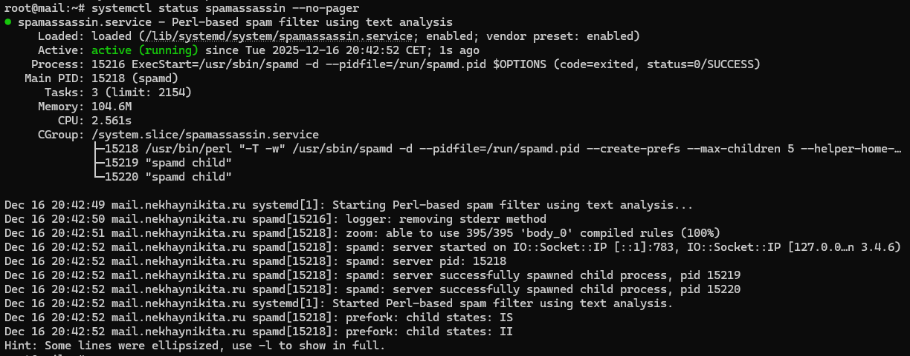

Figure.  Status of running spamassassin

- Configuration
    - `nano /etc/spamassassin/local.cf`
        - *Bayes Classification* is a Supervised machine learning approach for classification. A Bayesian Classifier is **a  system based on Bayes' decision theory, where probabilistic models of features are used to predict the class label of a new sample**. It predicts the class label by utilizing Bayes' rule when the class is unknown.

    ````bash
    ```conf
    required_score 5.0
    rewrite_header Subject [SPAM]
    report_safe 0
    use_bayes 1
    bayes_auto_learn 1
    ````
    ````
    - `nano /etc/postfix/main.cf` added `content_filter=spamassassin`
    - `nano /etc/postfix/master.cf` edited at the end

    ```jsx
    ```conf
    smtp      inet  n       -       y       -       -       smtpd
      -o content_filter=spamassassin

    spamassassin unix -     n       n       -       -       pipe
      user=spamd argv=/usr/bin/spamc -f -e
      /usr/sbin/sendmail -oi -f ${sender} ${recipient}
    ````

    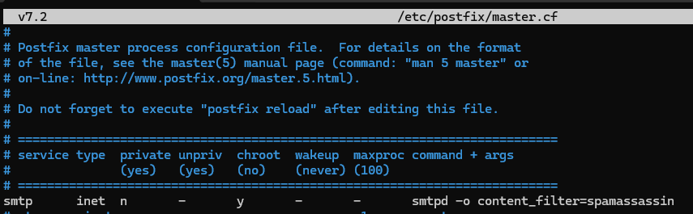

    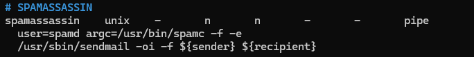

      Figure. Configurations for `spamasassin` inside `master.cf`

    - nano `etc/default/spamassassin`
        - replace line to `OPTIONS="--create-prefs --max-children 5 --username spamd --helper-home-dir /home/spamd/ -s /home/spamd/spamd.log"`
        - add at the end `CRON=1`

            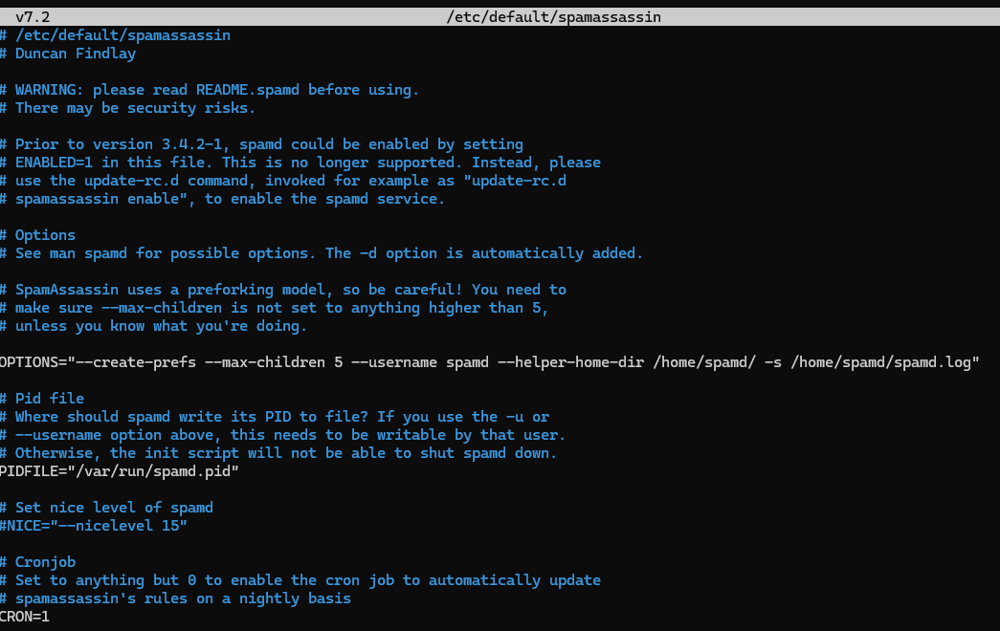

      Figure. Configuration file for `spamasassin`

    - Filter settings:
        - `mv /etc/spamassassin/local.cf /etc/spamassassin/local.cf.bk`
        - nano `/etc/spamassassin/local.cf`

            ```bash
            rewrite_header Subject ***** SPAM SCORE *****
            report_safe 0
            required_score 5.0
            use_bayes 1
            use_bayes_rules 1
            bayes_auto_learn 1
            skip_rbl_checks 0
            use_razor2 0
            use_pyzor 0
            ifplugin Mail::SpamAssassin::Plugin::Shortcircuit
            endif
            ```

    - Restart `systemctl restart postfix`

    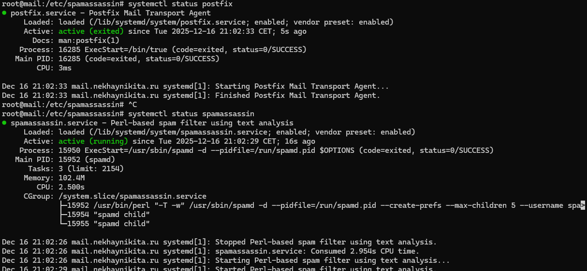

      Figure. Status of reruned service daemons

    - Check via `echo "test" | mail -s "normal message" user1@nekhaynikita.ru`
    - It received without a tag
    - Check via mail -s "spam test" [user1@nekhaynikita.ru](mailto:user1@nekhaynikita.ru) < gtube.txt
        - gtube.txt

        ```bash
        XJS*C4JDBQADN1.NSBN3*2IDNEN*GTUBE-STANDARD-ANTI-UBE-TEST-EMAIL*C.34X
        ```

    - In the topic of the message: [SPAM] spamtest
    - In logs `tail -f /var/log/mail.log`: spamd: identified spam

- Restarted the services:

```bash
systemctl start spamassassin.service
systemctl restart postfix.service
```

- Received error on `spamassassin`:
    - Here I see that SpamAssassin is used via **pipe**, but **`spamd` is present**, which is not **SMTP/LMTP server, so** Postfix can’t communicate it via socket directly.

>     Dec 16 21:17:29 mail postfix/qmgr[17873]: warning: private/spamassassin socket: malformed response
>     Dec 16 21:17:29 mail postfix/qmgr[17873]: warning: private/spamassassin socket: malformed response
>     Dec 16 21:17:29 mail postfix/qmgr[17873]: warning: transport spamassassin failure -- see a previous warning/fatal/panic logfile record for the problem description
>     Dec 16 21:17:29 mail postfix/qmgr[17873]: warning: transport spamassassin failure -- see a previous warning/fatal/panic logfile record for the problem description
>     Dec 16 21:17:29 mail postfix/master[17870]: warning: process /usr/lib/postfix/sbin/pipe pid 17889 exit status 1
>     Dec 16 21:17:29 mail postfix/master[17870]: warning: process /usr/lib/postfix/sbin/pipe pid 17889 exit status 1
>     Dec 16 21:17:29 mail postfix/master[17870]: warning: /usr/lib/postfix/sbin/pipe: bad command startup -- throttling
>     Dec 16 21:17:29 mail postfix/master[17870]: warning: /usr/lib/postfix/sbin/pipe: bad command startup -- throttling

    - The desired scheme:

    ```bash
    SMTP → Postfix
              ↓
          SpamAssassin (spamc → spamd)
              ↓
          Postfix (reinject)
              ↓
          virtual delivery → Dovecot
    ```

    - Deleted in [master.cf](http://master.cf) line with -o
    - Added line in `main.cf`

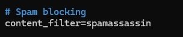

Figure. Spam blocking line in `main.cf`

- I received error in looping errors: `postfix`→`spamassassin`→`postfix`→`spamassassin`→`postfix`→`spamassassin`…
    - Added line in `master.cf`

        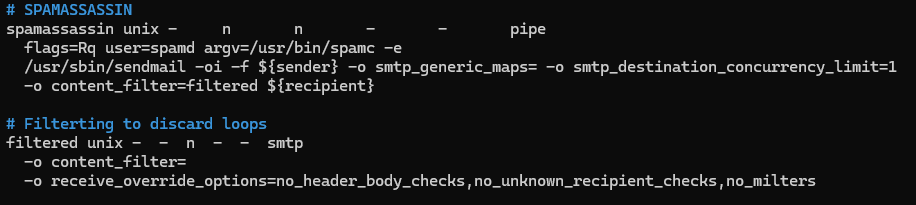

    Figure. Updated configuration for `master.cf`

    - Changed this conf

        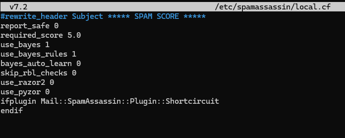

    Figure. pdated configuration for `local.cf`

    - `grep -R "bayes_auto_learn" /etc/spamassassin` - received 0
    - Changed [`master.cf`](http://master.cf) again

        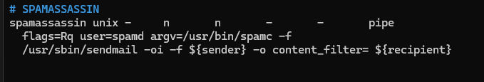

    Figure. Updated configuration for `master.cf`

    - Clean queue of messages `postsuper -d ALL`

        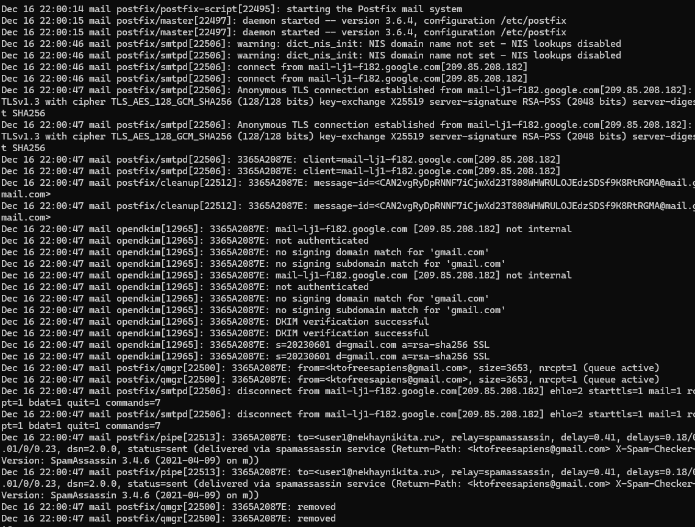

    Figure. Mail log configuration errors resolved

    - Check services running and ports listetning to spamd and also testing spam message

        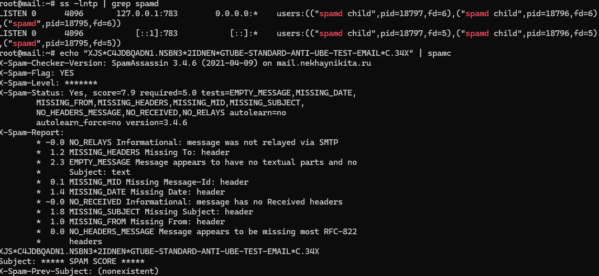

        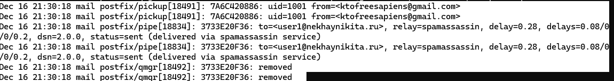

  Figure. Mail logs showing SpamAssassin successfully identifying and tagging spam messages.

## Part 8: Troubleshooting methods to solve errors

- Low-level tools were used to:
    - test SMTP and IMAP protocol behavior,
    - validate TLS negotiation,
    - confirm authentication mechanisms.
- Log analysis was essential to:
    - identify configuration loops,
    - diagnose authentication failures,
    - resolve DNS and DKIM mismatches.

### Step 8.1: Test SMTP with Telnet

- Tested basic SMTP connectivity:

```bash
telnet localhost 25
```

- Commands to execute:

```bash
EHLO localhost
MAIL FROM:user1@example.com
RCPT TO:user2@example.com
DATA
Subject: Test Email
This is a test email.
.
QUIT
```

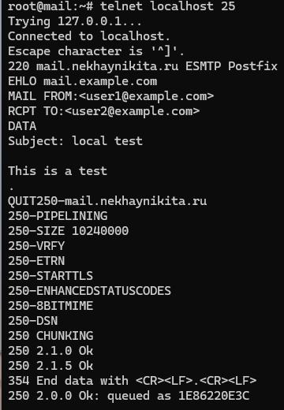

Figure. SMTP commands

- Here I received an error “*505.1.1 [user2@example.com](mailto:user2@example.com): Recipient address rejected:* User unknown in local recipient table" occurs because Postfix is treating "[example.com](http://example.com/)" as a local domain instead of a virtual domain. As a result, it's checking for "user2" as a system user (e.g., in /etc/passwd), which doesn't exist.
    - In my Postfix configuration (/etc/postfix/main.cf) I had:
    `mydestination = $myhostname, localhost.$mydomain, localhost, $mydomain`
    - So I changed to:
    `mydestination = $myhostname, localhost.$mydomain, localhost`
        - But this is not a good approach — this is a root problem, so later I fixed it


Figure. Error on SMTP commands

### Step 8.2: Test SMTP with TLS

```bash
openssl s_client -connect localhost:587 -starttls smtp
```

- After connection, test SMTP commands.

### Step 8.3: Test IMAP Connection

- Now I test SMTP with TLS

```bash
openssl s_client -connect localhost:993
```

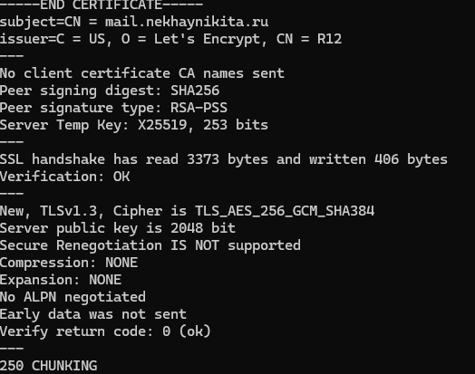

Figure. SMTP with TLS log

- I test IMAP connection

```bash
openssl s_client -connect localhost:993

a001 LOGIN user1@example.com password123
a002 LIST "" "*"
a003 SELECT Sent
a004 LOGOUT
```

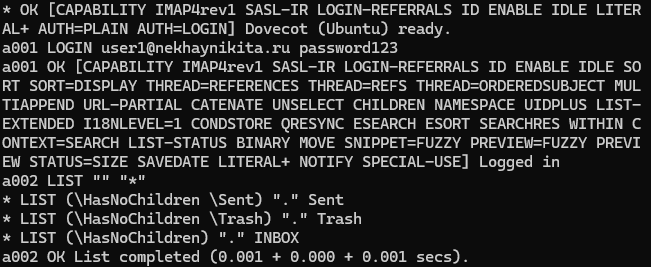

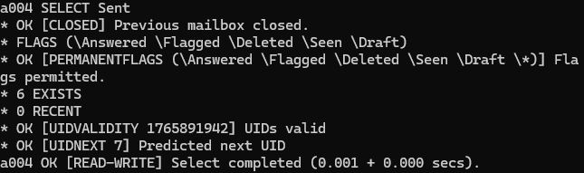

Figure. IMAP connection log

### Step 8.5: Check Mail Logs

- View Postfix logs:

```bash
sudo tail -f /var/log/mail.log
```

### Step 8.6: Verify Email Authentication

- Send an email to an external address (Gmail, etc.) and check headers for:
    - SPF: PASS
    - DKIM: PASS
    - DMARC: PASS

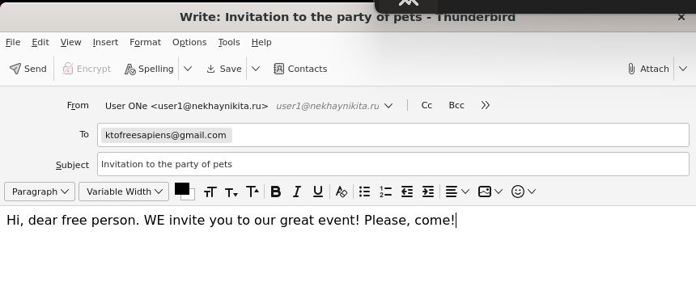

  Figure. Email sending from Thunderbird; Sending email to gmail

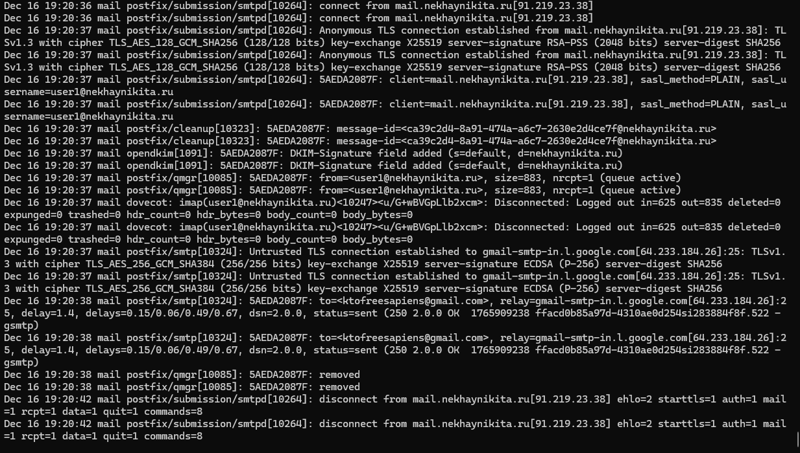

Figure. Logs of Email sending from Thunderbird


  Figure. Email message was received

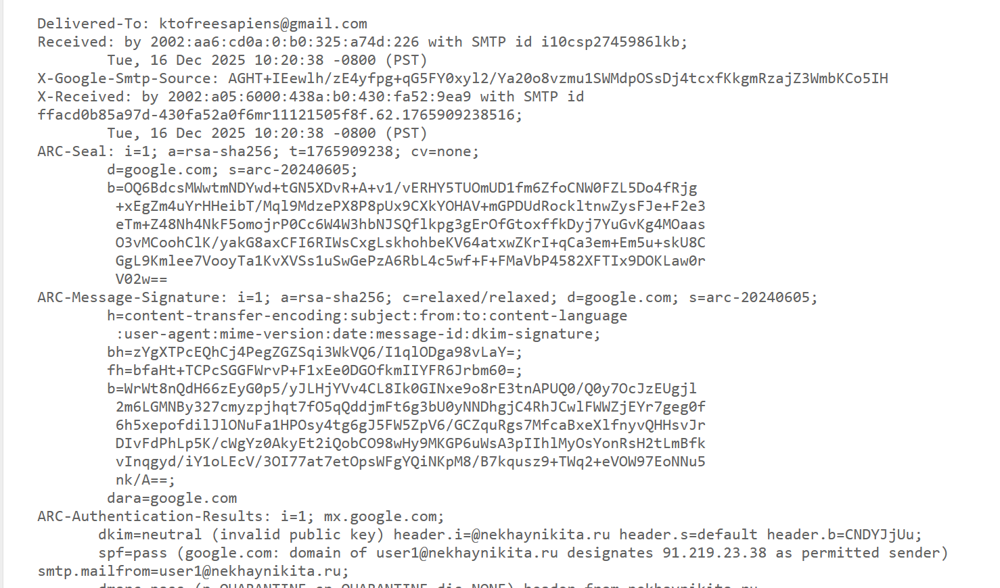

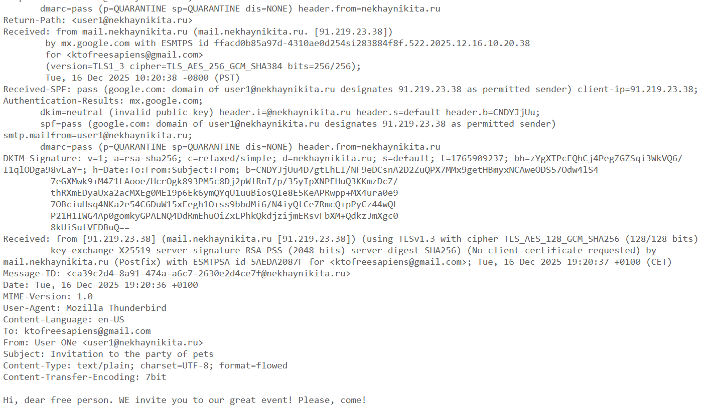

Figure. Headers and security of message

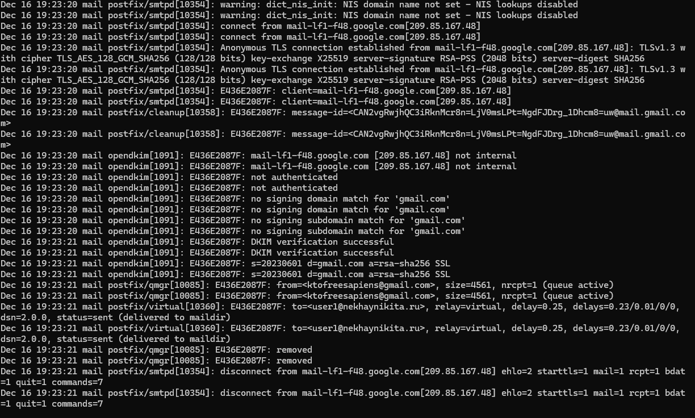

  Figure. Logs for send message from gmail to Thunderbird

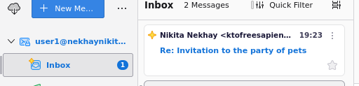

Figure. Receiving email from gmail 1

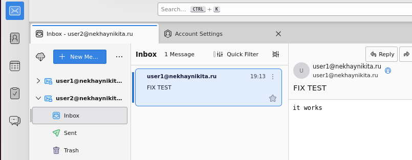

  Figure. Receiving email from gmail 1

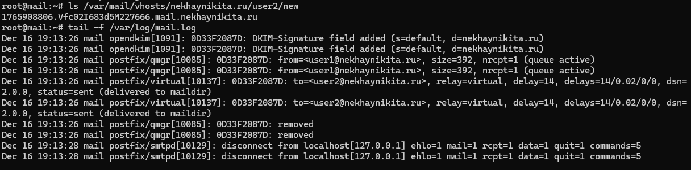

  Figure. Logs of authentication, DKIM: Receiving email from gmail

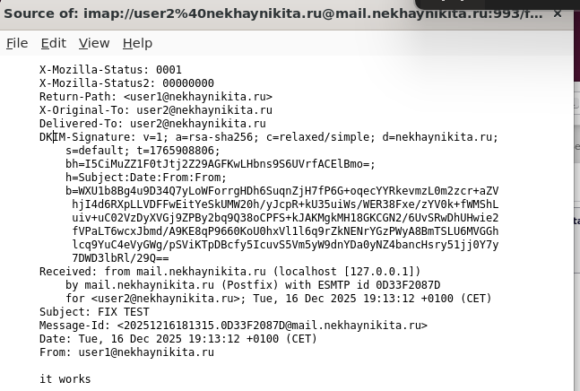

Figure. Headers for successful email sending from user1→user2

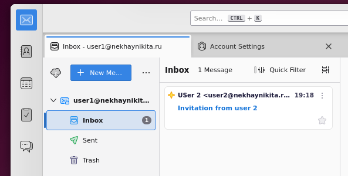

  Figure. Email sended from user2→user1 received

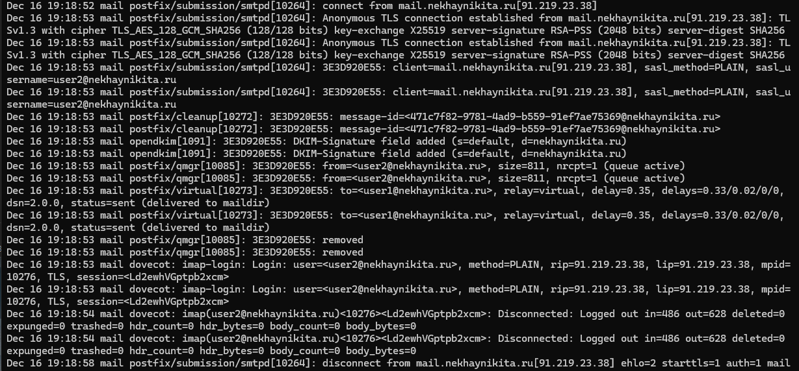

Figure. Logs for successful email sending from user2→user1

### Step 8.7: Test Mail Queue

- Checked mail queue:


Figure. mail queue: logs

## Step: 9.1 Check DNS Records

If any fail → my domain/VPS provider is misconfigured.

- A record

    ```markdown
    dig A mail.nekhaynikita.ru +short
    ```

    - Saw: `91.219.23.38`
- Check MX record

    ```markdown
    dig MX nekhaynikita.ru +short
    ```

    - Expected: `10 mail.nekhaynikita.ru.`
    - But I saw: `10 mx1.timeweb.ru.` — from previous configs.
    - So I created it again but for the right domain.

    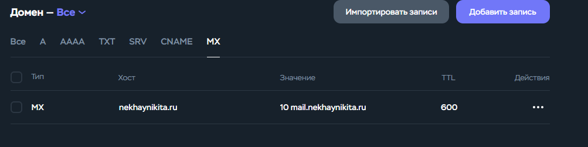

      Figure. MX record inside DNS

- Check SPF

    ```markdown
    dig TXT nekhaynikita.ru +short
    ```

    - Expected to contain: `v=spf1 ip4:203.0.113.10 -all`
    - But I saw: different so I changed.

    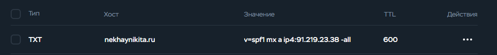

      Figure. SPF record inside DNS

- Check DKIM

    ```markdown
    dig TXT default._domainkey.nekhaynikita.ru +short
    ```

    - Showed:

    ```
    v=DKIM1; k=rsa; p=MIIBIjANBgkqhkiG9w0BAQEFAAOCAQ8A...
    ```

- Check DMARC

    ```markdown
    dig TXT _dmarc.nekhaynikita.ru +short
    ```

    - Showed: `"v=DMARC1; p=quarantine; rua=mailto:postmaster@nekhaynikita.ru"`
- Check PTR (reverse DNS)

    ```markdown
    dig -x 91.219.23.38 +short
    ```

    - Expected: [mail.nekhaynikita.ru](http://mail.nekhaynikita.ru/).

- I found root problem:

    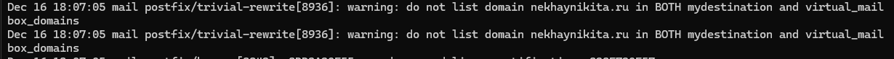

      Figure. Log of root problem

    - I replaced **ENTIRE mydestination line** with:

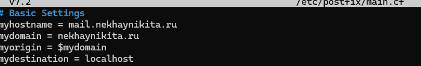

  Figure. Solution to root problem.

- I received error about DKIM, so I ensured my DKIM record in domain provider - deleted it and pasted the whole content of  `cat /etc/opendkim/keys/nekhaynikita.ru/default.txt` to it.
    - I recreated the keys from the zero because physical file and DNS record do not match

    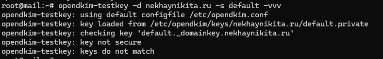

      Figure. Comparison of DKIM keys is not successful

    **Error:**

>     Dec 16 18:07:05 mail postfix/smtp[8938]: 8DD3A20E55: to=[ktofreesapiens@gmail.com](mailto:ktofreesapiens@gmail.com), [relay=gmail-smtp-in.l.google.com](http://relay=gmail-smtp-in.l.google.com/)[64.233.184.26]:25, delay=0.98, delays=0.18/0.08/0.24/0.48, dsn=5.7.26, status=bounced (host [gmail-smtp-in.l.google.com](http://gmail-smtp-in.l.google.com/)[64.233.184.26] said: 550-5.7.26 Your email has been blocked because the sender is unauthenticated. 550-5.7.26 Gmail requires all senders to authenticate with either SPF or DKIM. 550-5.7.26  550-5.7.26  Authentication results: 550-5.7.26  DKIM = did not pass 550-5.7.26  SPF [[nekhaynikita.ru](http://nekhaynikita.ru/)] with ip: [91.219.23.38] = did not pass 550-5.7.26  550-5.7.26  For instructions on setting up authentication, go to 550 5.7.26  <https://support.google.com/mail/answer/81126#authentication> 5b1f17b1804b1-47a8f7179d8si50825885e9.3 - gsmtp (in reply to end of DATA command))
>     Dec 16 18:07:05 mail postfix/smtp[8938]: 8DD3A20E55: to=[ktofreesapiens@gmail.com](mailto:ktofreesapiens@gmail.com), [relay=gmail-smtp-in.l.google.com](http://relay=gmail-smtp-in.l.google.com/)[64.233.184.26]:25, delay=0.98, delays=0.18/0.08/0.24/0.48, dsn=5.7.26, status=bounced (host [gmail-smtp-in.l.google.com](http://gmail-smtp-in.l.google.com/)[64.233.184.26] said: 550-5.7.26 Your email has been blocked because the sender is unauthenticated. 550-5.7.26 Gmail requires all senders to authenticate with either SPF or DKIM. 550-5.7.26  550-5.7.26  Authentication results: 550-5.7.26  DKIM = did not pass 550-5.7.26  SPF [[nekhaynikita.ru](http://nekhaynikita.ru/)] with ip: [91.219.23.38] = did not pass 550-5.7.26  550-5.7.26  For instructions on setting up authentication, go to 550 5.7.26  [https://suppor](https://suppor/)

    - But the real cause was me not understating value of `default.txt:`the key is to big, that it divides value into separate “” “” “” — but this is the one value of a key.
    - Error is fixed:

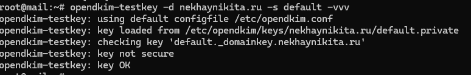

  Figure. Comparison of DKIM keys is successful

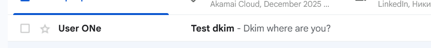

  Figure. Testing received messages on DKIM 1

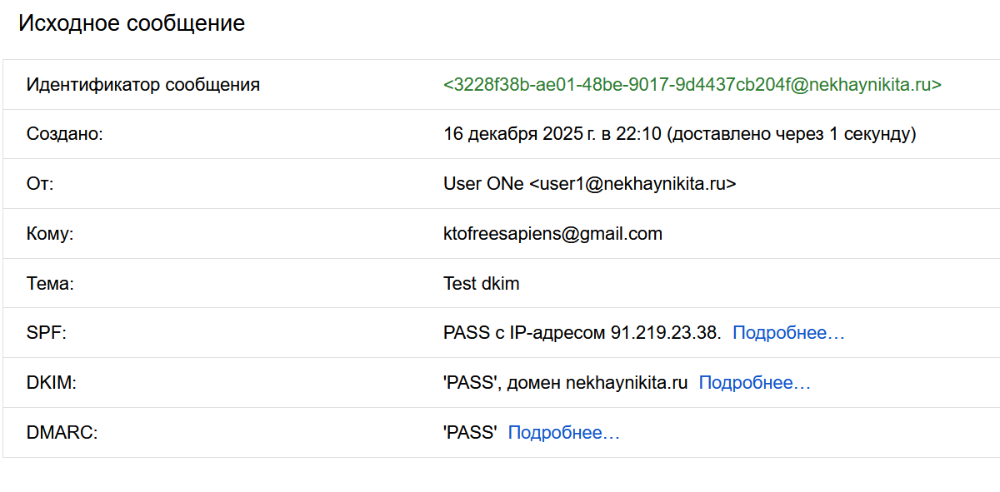

  Figure. Testing received messages on DKIM 2

- I received error in logs that `vmailbox.db` is missing, so I created it.

    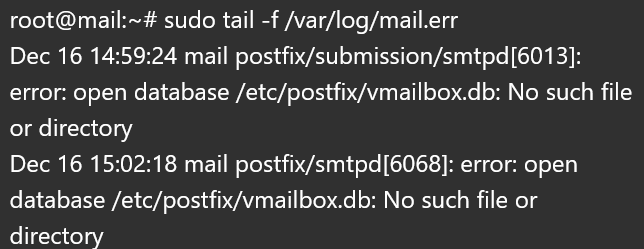

  Figure. Error for `vmailbox.db`

- Verifying presence of created db.

```markdown
postmap /etc/postfix/vmbox

ls -l /etc/postfix/vmailbox*
```

- I see: `vmailbox`, `vmailbox.db`

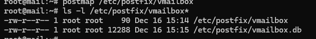

 Figure. `ls` logs

## Summary

This project demonstrated the end-to-end deployment of a secure, production-style email server using open-source technologies on a Linux VPS. The system integrated Postfix for SMTP mail transport, Dovecot for IMAP access, virtual mailboxes for domain users, and TLS encryption to protect data in transit. Email authentication mechanisms (SPF, DKIM, and DMARC) were implemented and validated to meet modern email security requirements and ensure compatibility with major email providers.

A significant part of the work involved troubleshooting real-world configuration issues, including DNS misalignment, virtual domain handling errors, DKIM key mismatches, and SpamAssassin integration loops. These issues highlighted the tight coupling between mail server configuration, DNS records, and authentication policies. Resolving them required systematic log analysis, protocol-level testing using OpenSSL and Telnet, and iterative configuration refinement.

The final system successfully delivered encrypted, authenticated, and spam-filtered email between local users and external providers such as Gmail. This confirms that a secure and reliable email infrastructure can be built using Postfix and Dovecot when industry best practices are followed. The project provided practical experience with mail protocols, security mechanisms, and operational troubleshooting that closely reflects real-world system administration tasks.

## References

1. Spamassassin installation <https://arenda-server.cloud/blog/kak-nastroit-pochtovyj-server-postfix-s-dovecot/>
2. Postfix Official Documentation.

    <https://www.postfix.org/documentation.html>

3. Dovecot IMAP Server Documentation.

    <https://doc.dovecot.org/>

4. Let’s Encrypt Documentation – TLS Certificates.

    <https://letsencrypt.org/docs/>

5. OpenDKIM Project Documentation.

    <https://opendkim.org/documentation/>

6. SpamAssassin Official Documentation.

    <https://spamassassin.apache.org/documentation/>

7. RFC 5321 – Simple Mail Transfer Protocol (SMTP).

    <https://datatracker.ietf.org/doc/html/rfc5321>

8. RFC 6376 – DomainKeys Identified Mail (DKIM).

    <https://datatracker.ietf.org/doc/html/rfc6376>

9. RFC 7208 – Sender Policy Framework (SPF).

    <https://datatracker.ietf.org/doc/html/rfc7208>

10. RFC 7489 – Domain-based Message Authentication, Reporting, and Conformance (DMARC).

    <https://datatracker.ietf.org/doc/html/rfc7489>

11. Mozilla Thunderbird Documentation.

    <https://support.mozilla.org/en-US/products/thunderbird>
