# 1 Containerization and application layer load balancing

Name of report: LS_LAB_1_Nikita_Niakhai
Course: DevOps and Security
Performed by Nikita Niakhai 18
Date submission: 27.01.2026
---

## Task 1: Get familiar with Docker Engine

1. Pull Nginx v1.23.3 image from dockerhub registry and confirm it is listed in local images

- I updated packages

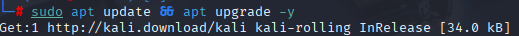

- I Set up Docker's `apt` repository [[1](https://docs.docker.com/engine/install/ubuntu/#install-using-the-repository)]

```bash
# Add Docker's official GPG key:
sudo apt update
sudo apt install ca-certificates curl
sudo install -m 0755 -d /etc/apt/keyrings
sudo curl -fsSL https://download.docker.com/linux/ubuntu/gpg -o /etc/apt/keyrings/docker.asc
sudo chmod a+r /etc/apt/keyrings/docker.asc

# Add the repository to Apt sources:
sudo tee /etc/apt/sources.list.d/docker.sources <<EOF
Types: deb
URIs: https://download.docker.com/linux/ubuntu
Suites: noble
Components: stable
Signed-By: /etc/apt/keyrings/docker.asc
EOF

sudo apt update
```

- I installed latest docker

```bash
sudo apt install docker-ce docker-ce-cli containerd.io docker-buildx-plugin docker-compose-plugin
```

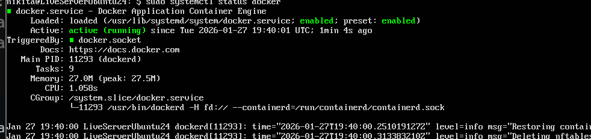

- Pulled nginx

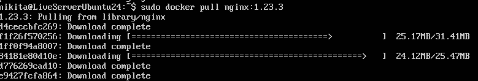

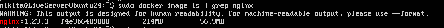

1. Run the pulled Nginx as a container with the below properties
a. Map the port to 8080.
b. Name the container as `nginx-st18`
c. Run it as daemon .

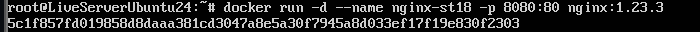

1. Confirm port mapping.
- List open ports in host machine. Verified running status in proccesses:

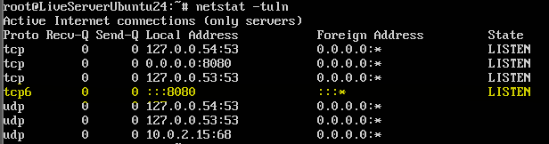

- I accesses docker and updated packages there and installed `net-tools`. List open ports inside the running container.

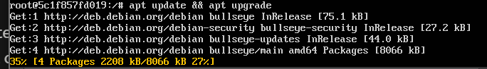

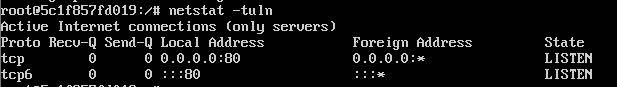

- I exited from docker CLI and accessed the page. And saw default nginx page

```bash
# With verbose output (shows headers)
curl -v http://localhost:8080
```

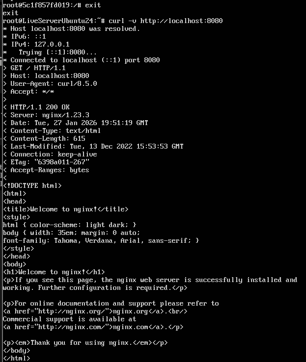

1. Create a Dockerfile similar to the below properties (let’s call it container A).
- Image tag should be Nginx v1.23.3.
- Create a custom index.html file and copy it to your docker image to replace the Nginx default web
page.
- Build the image from the Dockerfile, tag it during build as `nginx:st18`, check/validate local images, and
run your custom made docker image.
- Stopped prev container to be able to access port 8080 and runed containerA

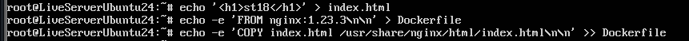

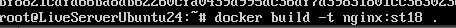


- Access via browser and validate that your custom page is hosted.

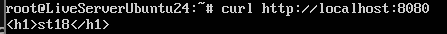

## Task 2: Work with multi-container environment

1. Create another Dockerfile similar to step 1.4 (Let’s call it container B), and an index.html with different content.

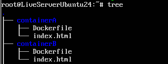

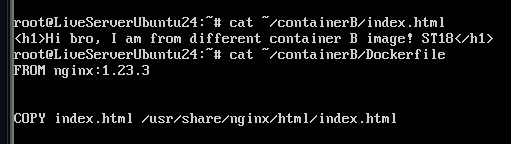

- Created

1. Write a docker-compose file with the below properties (Multi-build: Builds both Dockerfiles and runs both images; Port mapping: Container A should listen to port 8080 and container B should listen to port 9090. (They
host two different web pages)
- I wrote it

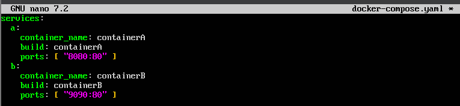

- I run docker images

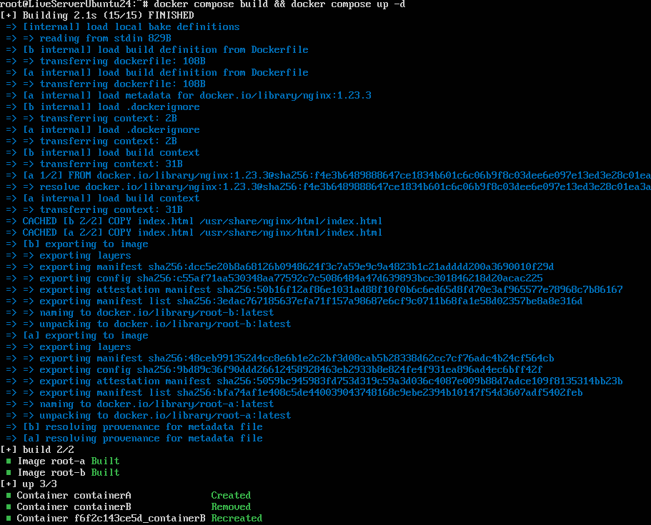

- I confirm both websites are accessible

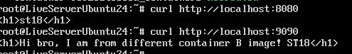

- Volumes: Mount (bind) a directory from the host file system to Nginx containers and update the
contents of index.html in the host file system, re-deploy and confirm in the browser that the web
page's content is updated.

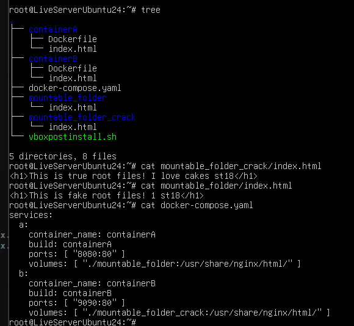

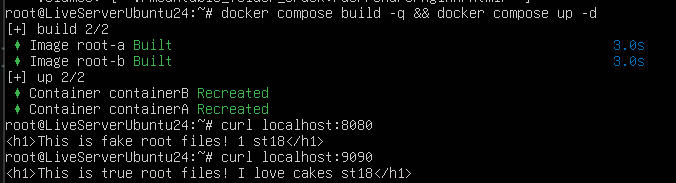

1. Configure L7 Loadbalaner

- Install Nginx in the host machine or add a third container in the docker-compose that will act as
loadbalancer, and configure it in front of two containers in a manner that it should distribute the load in a Weighted Round Robin approach.
- Added configuration for docker-compose

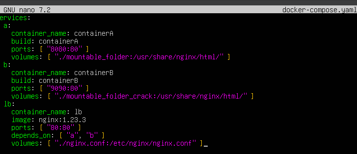

- Added nginx for load balancing

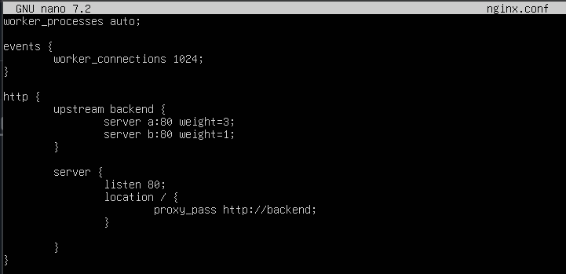

- Entered lb container, updated packages and installed nginx
- Updated container and created new

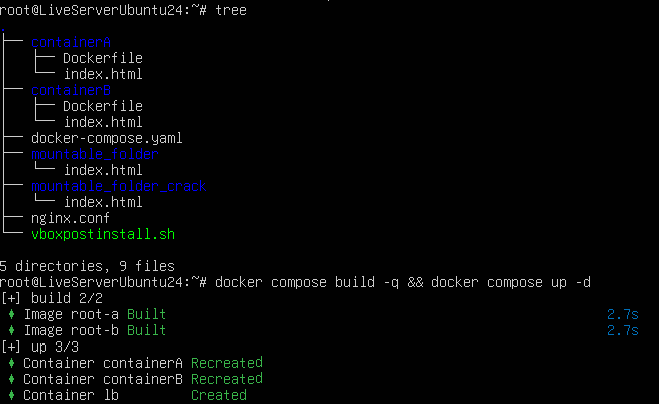

- Made 10 curls and saw that weights for load balancing divided correctly. Accessed the page of Nginx ALB and validated, it is load-balancing the traffic.

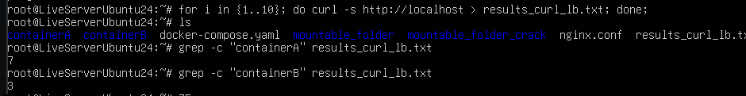
