# 2 Ansible, Terraform

Name of report: Ansible_SCM_LAB_2_Nikita_Niakhai
Course: DevOps and Security
Performed by Nikita Niakhai

---

The goal is to easily, reliably and quickly maintain different kinds of systems at once.
**Other software configuration management (SCM) tools:**

Ansible
SaltStack
Puppet
Chef

# Task 1 - Prerequisites

Prepared 3 (VMs) on my Windows Host Machine:

- Controller VM Ubuntu Desktop 22.04 with Ansible (aka “`ansible-controller`")
- Ubuntu Server (aka "`ubuntu prod`")
- Fedora (aka "`fedora dev`"), that is Red-Hat based system that uses different tools instead of Ubuntu, e.g. `sudo dnf upgrade --refresh`

Added network setting inside Virtual Box for new Host Only adapter #2 :

My adapter is 192.168.30.1/24

- IPv4 Address: 192.168.30.1
- IPv4 Network Mask: 255.255.255.0
- DHCP Server Address: 192.168.30.100
- Lower/Upper Address Bounds: 192.168.30.101 to 192.168.30.254

Added NAT and second adapter Host Only adapter #2 on all VMs:

192.168.30.101 — `ansible-controller`

192.168.30.102 — `fedora dev`

192.168.30.103 — `ubuntu prod`

username to sign in: ansible_user

password: user

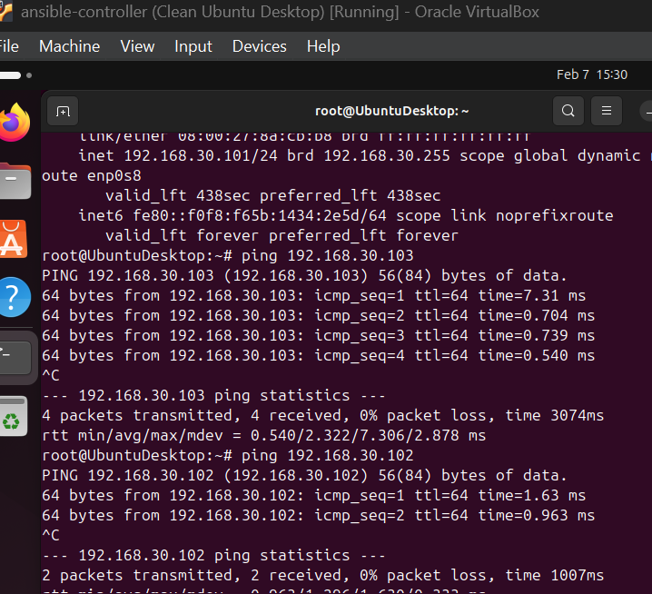

Figure. ansible machine showing his ip and then pinging dev and prod

Checked if python is installed on managable machines — true. Means I can run code from Ansible on nodes.

Then I opened ssh connections on managable nodes:

- Nodes:
    - Open SSH server: Ubuntu `sudo apt install openssh-server -y`; Fedora `sudo dnf install openssh-server -y && sudo systemctl enable --now sshd`
- Controller:
    - generated key ssh-keygen

        

    - Copied keys to nodes from controller
        - empty key was not suitable for setting up this connection, so I created key on Fedora, because by default it is empty.
        - `-i` to point to key file that should be sent.

            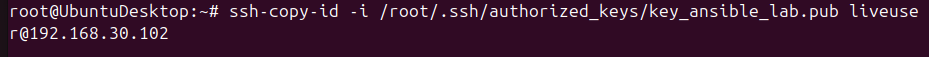

        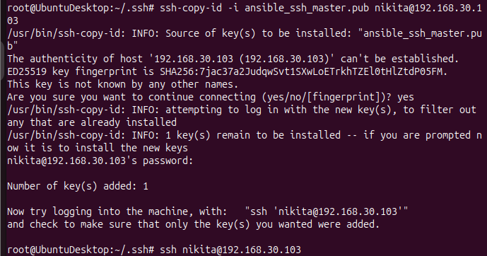

    - Accessed ssh

        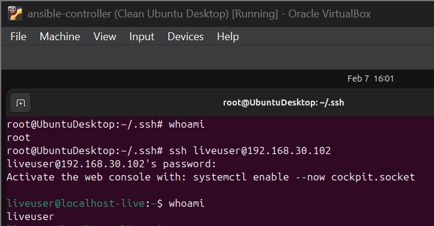

        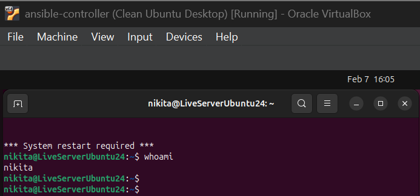

# Task 2 - SCM Theory

1. Ansible directory
- `ansible.cfg` is ini type file [[ref.](https://docs.ansible.com/ansible/latest/reference_appendices/config.html)] that configures the ansible: sets limits, accesses, chagnes usage of SSH and etc.

- `inventory` directory [[ref.](https://docs.ansible.com/ansible/latest/inventory_guide/intro_inventory.html)] — is a place to define all managed nodes/hosts that controller will work with. It consists of groups for hosts, host names and their address (IP/domain name).

    Inventories are of 2 types dynamic and static.

    - Groups are created to apply the same playbooks on whole group of nodes, also to categorize nodes or gather them based on some fact, e.g. group  of databases, or web-servers.
    - `[group:vars]` — defines attributes that we need for each hosts, e.g. to connect to them (ssh keys location / password / username and etc.)
- `roles` directory [[ref.](https://docs.ansible.com/ansible/latest/playbook_guide/playbooks_reuse_roles.html)]
    - Each role has a [defined](https://docs.ansible.com/ansible/latest/playbook_guide/playbooks_reuse_roles.html#role-directory-structure) directory structure, all directories inside `/roles` folder represent each role. Inside each role you have following structure
        - `tasks`: tasks/job that are executed as a playbook
        - `defaults/group_vars`: - place for secrers.yaml with Vault secured / other shared values
        - `handlers`: kind of a place for common functins, e.g. you write there restart enable for some services, instead of creating seperate tasks as steps in playbook
        - `templates`: some template files used to run anything for example html files, scripts and etc.
        - `files` : scripts, constable files, tables
        - `vars`: place for overall vars (used in a role)
- `meta`:
- `playbooks` folder
    - `-` are used to define items in the list, e.g. list of hosts, list of tasks, list of playbooks inside one file
    - `gather_facts` — allow ansible to gather information from the nodes, by default is *yes*
    - **colours** of executed commands:
        - green — nothing was changed
        - red — error
        - yellow — something changes
        - blue — command was skipped
    - `hosts:` has name of managable nodes + type of connection to this specific node:
        - Ansible has different types of connections to different types of nodes:
            - Network Devices — `network_cli` (type of ssh connection)
            - Linux Machines — `ssh`
                - Windows machines — `winrm` (is a protocol for establish secure remote connection, invented by Microsoft, based on WS-Management protocol; uses SOAP services, providing HTTP/S , yml)
            - Cloud machines — `local`
    - tasks have pre defined modules, each module requires specific params
    - there are keywords for each tasks, to be more precise in somethings, e.g.:
        - when — gets boolean value, e.g. from state received from ansible_facts
        - become: true — be root when you execute
1. The most important parameters from `ansible.cfg`:
2. The difference between roles/.../vars , roles/.../defaults and playbook/.../group_vars variables definitions.
3. Precedence order is specified [in the docs](https://docs.ansible.com/ansible/latest/playbook_guide/playbooks_variables.html#understanding-variable-precedence). “Last defined wins”

    > • Configuration settings
    • Command-line options
    • Playbook keywords
    • Variables
    • Direct Assignment
    >

Ansible will make a change until it has to make a change! **Ansible is idempotent**.

# Task 3 - check github

**Light tasks**: Ansible Vault (definitely a good choice), Restart services

**Hard**: Certificates generation

**Structure:**

```bash
ansible-lab/
├── ansible.cfg
├── inventory/
│   └── hosts.ini
├── group_vars/
│   └── all.yml               # plain vars
│   └── secrets.yml           # Vault-encrypt
├── roles/
│   └── apache/
│       ├── defaults/
│       │   └── main.yml
│       ├── handlers/
│       │   └── main.yml
│       ├── tasks/
│       │   └── main.yml
│       ├── templates/
│       │   └── index.html.j2
│       │   └── ports.conf.j2     # example custom config
│       └── vars/
│           └── main.yml          # if needed, but we'll use defaults mostly
└── playbooks/
    └── deploy_apache.yml
```

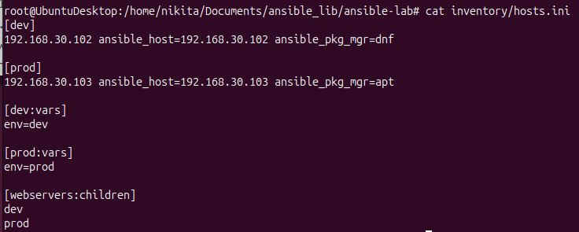

**Inventory file — hosts.ini showing both hosts (dev/prod)**

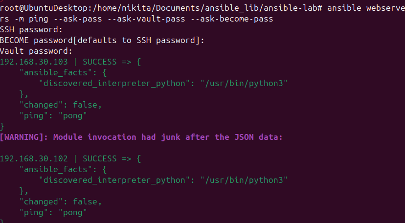

**Test connectivity**

```bash
ansible webservers -m ping --ask-vault-pass --ask-become-pass --ask-vault-pass
```

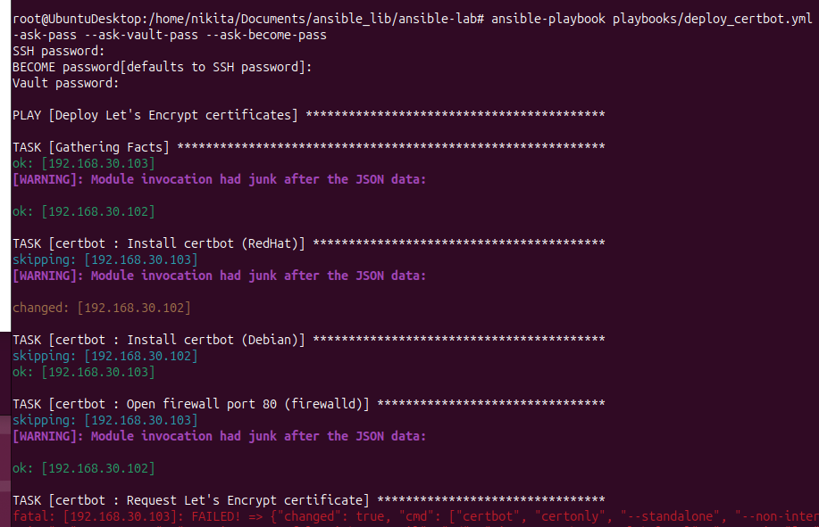

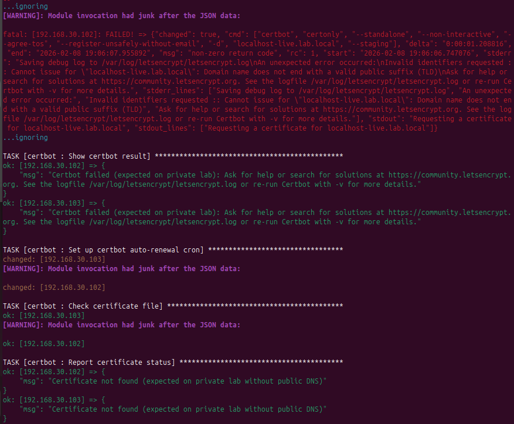

**Run the playbook (**the full ansible-playbook playbooks/deploy_certbot.yml**)**

```bash
ansible-playbook playbooks/deploy_apache.yml --ask-vault-pass
```

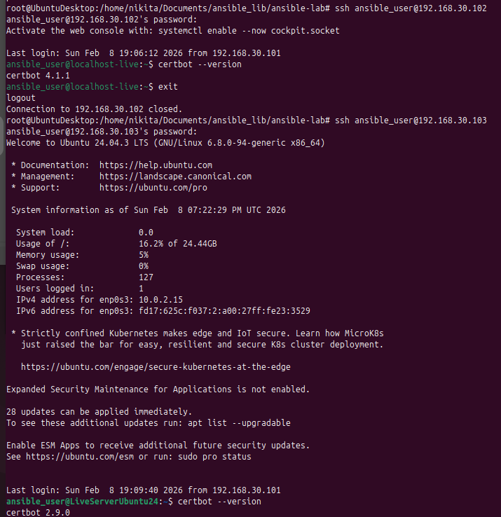

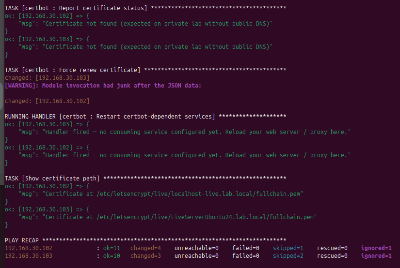

**Certbot installed — SSH into each host and run certbot --version**

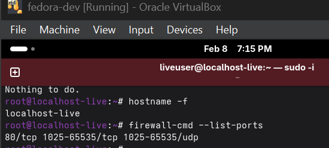

**Firewall port open (Fedora only) — firewall-cmd --list-ports on 192.168.30.102**

**I encrypt the secrets file with Ansible Vault**

The file `group_vars/secrets.yml`contains sensitive values in plain text right now.
So I encrypt it before running the playbook.

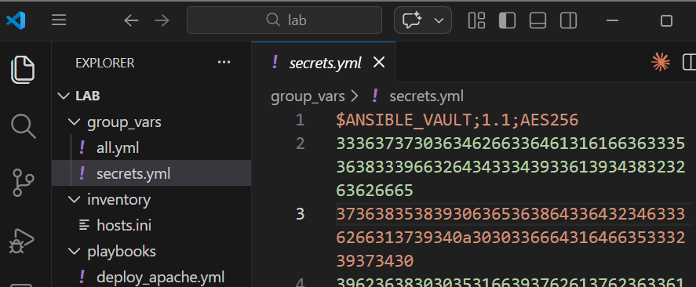

**Vault file is encrypted — encrypted blob
(not the plaintext)**

**Useful commands**

```
| Action                          | Command                                                             |
|---------------------------------|---------------------------------------------------------------------|
| Run playbook                    | `ansible-playbook playbooks/deploy_apache.yml --ask-vault-pass`     |
| Run only on dev                 | `ansible-playbook playbooks/deploy_apache.yml --ask-vault-pass -l dev` |
| Run only on prod                | `ansible-playbook playbooks/deploy_apache.yml --ask-vault-pass -l prod` |
| Restart Apache only             | `ansible-playbook playbooks/deploy_apache.yml --ask-vault-pass --tags restart` |
| Edit vault secrets              | `ansible-vault edit group_vars/secrets.yml`                         |
| View vault secrets              | `ansible-vault view group_vars/secrets.yml`                         |
| Change vault password           | `ansible-vault rekey group_vars/secrets.yml`                        |
| Check syntax                    | `ansible-playbook playbooks/deploy_apache.yml --syntax-check`       |
| Dry run                         | `ansible-playbook playbooks/deploy_apache.yml --ask-vault-pass --check` |
| Test connectivity               | `ansible webservers -m ping --ask-vault-pass`                       |
```

# Bonus 2 - Ansible AWX

[Comparison of open-source configuration management software](https://en.wikipedia.org/wiki/Comparison_of_open-source_configuration_management_software)

## References

Ansible explained:

1. Indian guy - just the definition: [www.youtube.com/watch?v=h8MurJBJVNc](http://www.youtube.com/watch?v=h8MurJBJVNc)
2. Playbooks, but not all key semantics, but still good: <https://www.youtube.com/watch?v=p9bda0-TIRc>
