# 3 CI/CD Gitlab

Name of report: CICD_GITLAB_LAB_3_Nikita_Niakhai
Course: DevOps and Security
Performed by Nikita Niakhai student number 19
Date submission: 12.02.2026
---

## Task 1: Infra Deployment

1. Deployed three VMs that I will be using as Gitlab Server, Gitlab Runner, and the deployment server.

My domain is `st19.sne.com`

`192.168.30.101` — ubuntu desktop with gitlab and postfix and domain `VM1`

`192.168.30.102` — ubuntu server 2  with Gitlab Runner`VM2`

`192.168.30.103` — ubuntu server 1 with Deployment Server `VM3`

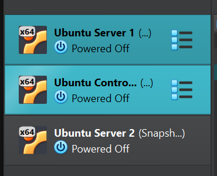

Hosts configuration is done on all 3 VMs, here is example fot VM1:

```bash
sudo nano /etc/hosts
```

Add these lines:
```
192.168.30.101    st19.sne.com gitlab
192.168.30.102    runner.st19.sne.com runner
192.168.30.103    deploy.st19.sne.com deploy
```

Installed docker network to communicate on `VM1`:

```bash
docker network create gitlab-network
```

Installed postfix for docker so that it will be communicating with gitlab runner on another container.

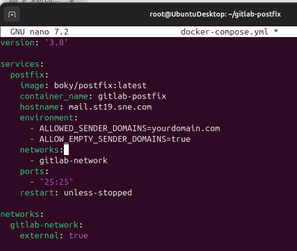

Docker compose file for postfix container

Then I executed docker image with postfix and here are result of postfix running

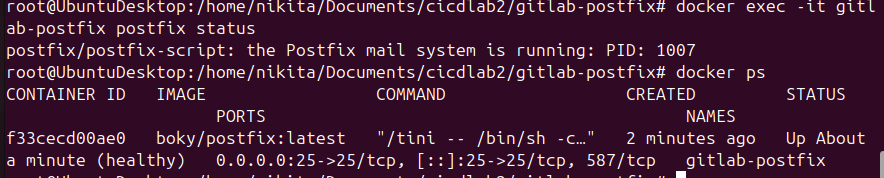

1. Set up Gitlab Server (`VM1`)

For my gitlab container I added these envs:

```bash
services:
  gitlab:
    image: gitlab/gitlab-ce:latest
    container_name: gitlab
    hostname: st19.sne.com
    environment:
      GITLAB_OMNIBUS_CONFIG: |
        external_url 'http://st19.sne.com'
        gitlab_rails['smtp_enable'] = true
        gitlab_rails['smtp_address'] = "gitlab-postfix"
        gitlab_rails['smtp_port'] = 25
        gitlab_rails['smtp_domain'] = "yourdomain.com"
        gitlab_rails['smtp_tls'] = false
        gitlab_rails['smtp_openssl_verify_mode'] = 'none'
        gitlab_rails['smtp_enable_starttls_auto'] = false
        gitlab_rails['smtp_authentication'] = false
        gitlab_rails['gitlab_email_from'] = 'gitlab@yourdomain.com'
        gitlab_rails['gitlab_email_reply_to'] = 'noreply@yourdomain.com'
    networks:
      - gitlab-network
    ports:
      - "80:80"
      - "443:443"
      - "22:22"
    volumes:
      - gitlab-config:/etc/gitlab
      - gitlab-logs:/var/log/gitlab
      - gitlab-data:/var/opt/gitlab
    restart: unless-stopped

networks:
  gitlab-network:
    external: true

volumes:
  gitlab-config:
  gitlab-logs:
  gitlab-data:
```

Ports 22 80 443 were unused, I checked that with `netstat -tlnp`

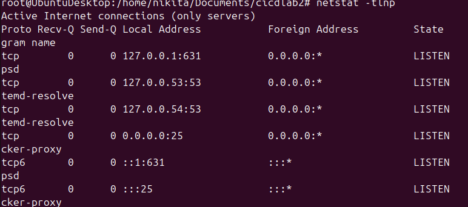

Then I runed my docker container and checked whether 2 container are in the same docker network using `docker network inspect gitlab-network`

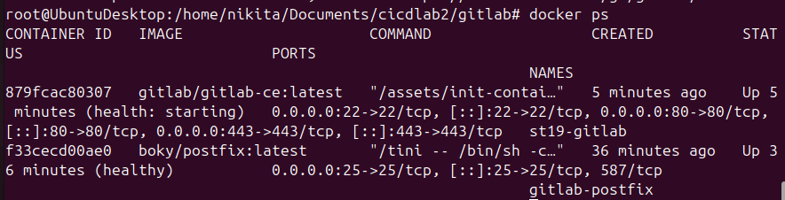

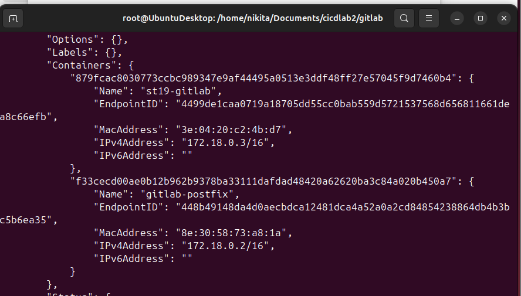

Now I can sign in via my host machine:

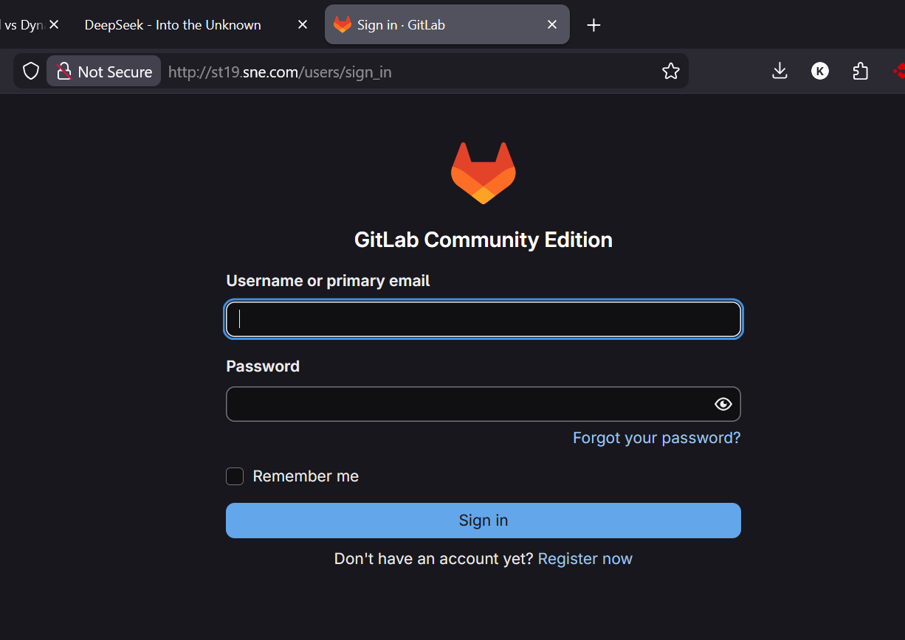

I found out what means full local gitlab solution: even accounts and passwords are all local :) to understand that I used AI and checked volumes created and mounted, because I though maybe the error with them.

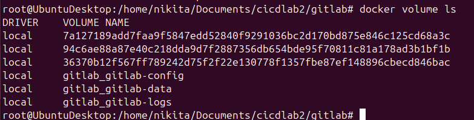

To sign in as root and find credentials I used docker docs info [[x](https://docs.gitlab.com/install/docker/installation/)]. I visited the GitLab URL, and sign in with the username `root` and the password from the following command:

```bash
sudo docker exec -it gitlab grep 'Password:' /etc/gitlab/initial_root_password
```

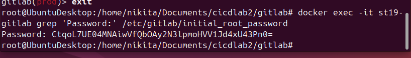

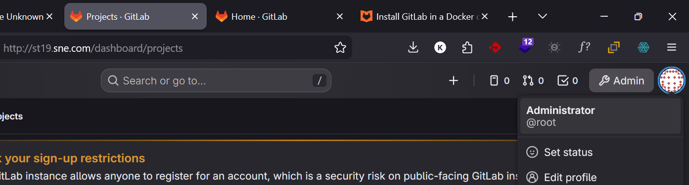

Then I did some default profile configurations.

Added SSH key generation:

```bash
# Generate SSH key pair
ssh-keygen -t ed25519 -C "st19@sne.com" -f ~/.ssh/gitlab_st19

# Paste your public key in the Key field
cat ~/.ssh/gitlab_st19.pub

# Create/edit SSH config
nano ~/.ssh/config
```

Add this configuration:
```bash
Host st19.sne.com
    HostName st19.sne.com
    User git
    IdentityFile ~/.ssh/gitlab_st19
    StrictHostKeyChecking no

chmod 700 ~/.ssh
chmod 600 ~/.ssh/gitlab_st19
chmod 644 ~/.ssh/gitlab_st19.pub
chmod 600 ~/.ssh/config

ssh -T git@st19.sne.com
```

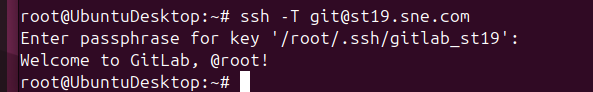

After all prerequisites on host machines and gitlab server were arranged I pushed my project from local env to the lab:

```bash
# Or if already cloned via HTTP, change remote:
cd st19-repo
git remote set-url origin git@st19.sne.com:root/st19-repo.git
```

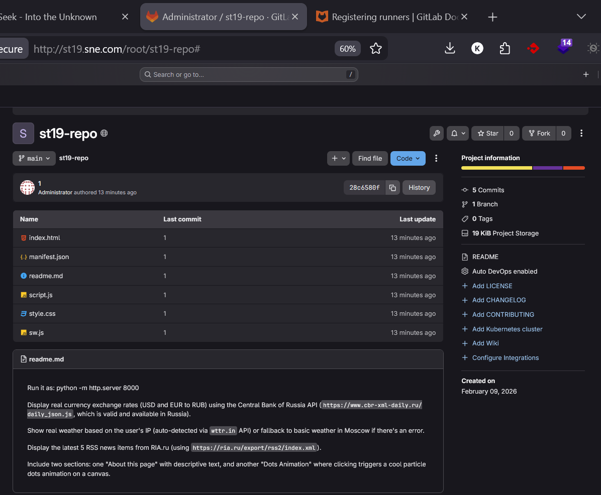

Get registration toketn from GitLab

[[st19.sne.com/root/st19-repo/-/settings/ci_cd#js-runners-settings](http://st19.sne.com/root/st19-repo/-/settings/ci_cd#js-runners-settings)]

```bash
token
```

1. Gitlab runner on VM2 setup on clean OS.

Installed docker runner [[x](https://docs.gitlab.com/runner/install/linux-repository/)]

```bash
curl -L "https://packages.gitlab.com/install/repositories/runner/gitlab-runner/script.deb.sh" -o script.deb.sh
less script.deb.sh
sudo bash script.deb.sh
sudo apt install gitlab-runner
# registering runner
sudo gitlab-runner register
#  Runner tag to st19-runner
# set the executor type to shell
```

I authenticate Gitlab runner with Gitlab server via registration token, and validated:

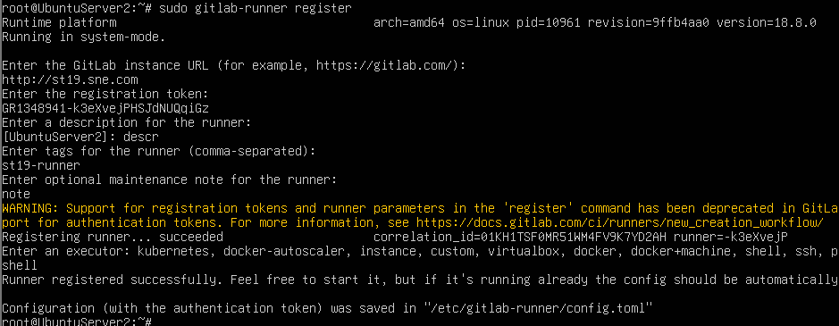

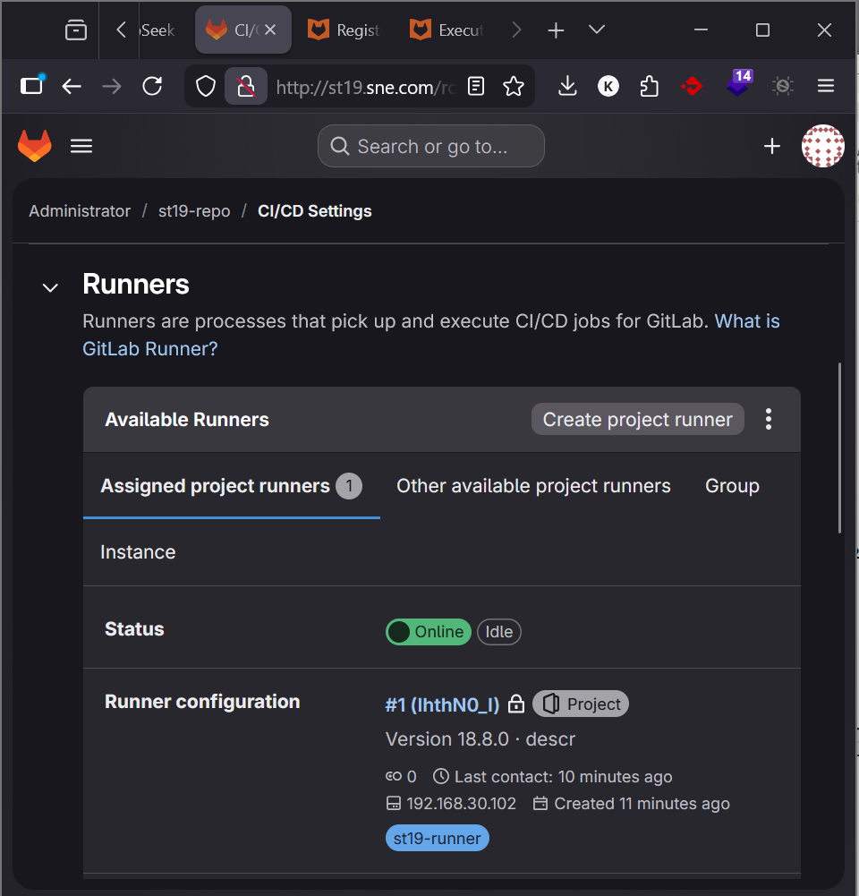

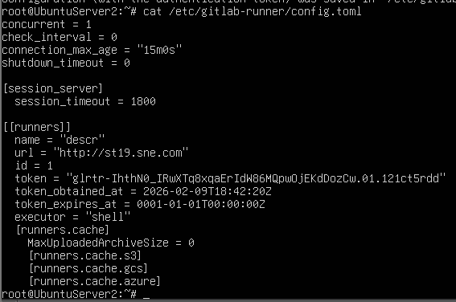

GitLab executor is an instance that actually runs my CI/CD pipeline, in this case it is set on `VM2`, so all commands for pipeline will be executed on this machines, also since we use `shell` as executor. If we’d use `container` - for each jib it would create clean isolated container; `ssh` - would execute commands on different machine and etc.

1. Set up the Deployment Server (VM3).

Here I need to set up **SSH key-based authentication** so that `VM2` (GitLab Runner) can connect to `VM3` (Deployment Server) without a password to deploy applications:

`VM3`

```bash
# Make sure your user can run docker
sudo usermod -aG default_user_not_root $USER
```

`VM2`

```bash
# Switch to gitlab-runner user
sudo su - gitlab-runner

# Generate SSH key (no passphrase for automation)
ssh-keygen -t ed25519 -C "gitlab-runner-deploy" -f ~/.ssh/id_deploy_vm3

# ssh-copy-id to vm3 my key id_deploy_vm3

# added hosts configuration to seamless deploy connection
```

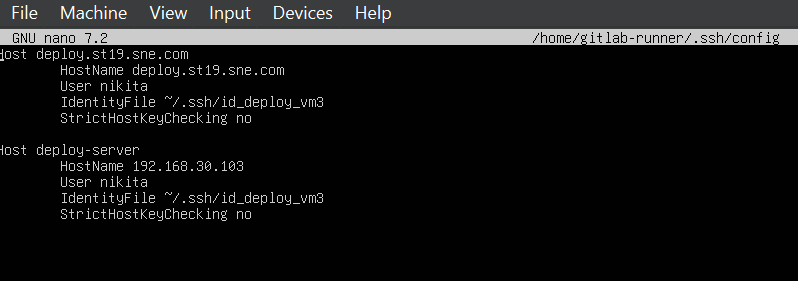

`ssh deploy-server` to connect from runner to deploy env

## Task 2: Create CI/CD Pipeline

1. Created single page application and pushed it to project:

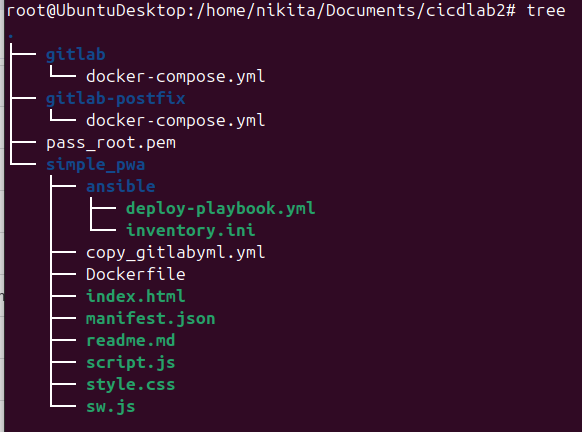

1. GitLab project:

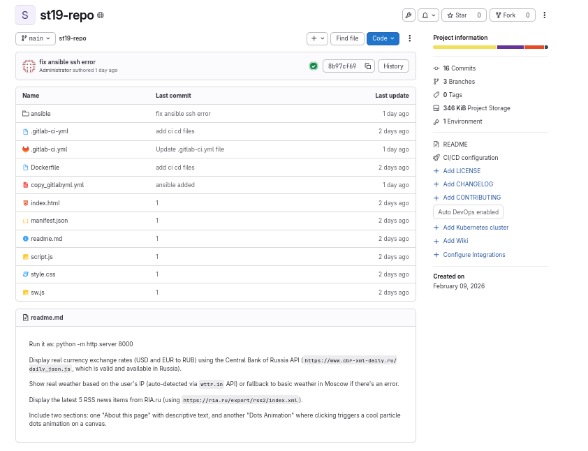

1. Creating CI/CD.

I registered on docker hub. Created variables inside project for pushing to docker-hub:

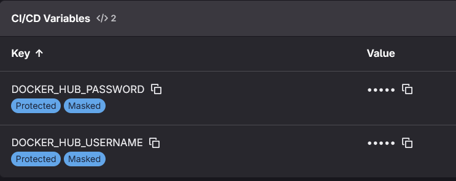

I created `Dockerfile`:

```bash
FROM nginx:alpine

# Copy SPA files to nginx html directory
COPY . /usr/share/nginx/html/

# Expose port 80
EXPOSE 80

# Start nginx
CMD ["nginx", "-g", "daemon off;"]
```

Then I created my `.gitlab-ci.yml`:

```bash
stages:
  - build
  - test
  - docker-build
  - docker-push
  - deploy

variables:
  DOCKER_IMAGE_NAME: "nikitanekhay/st19-spa"
  DOCKER_IMAGE_TAG: "${CI_COMMIT_SHORT_SHA}"

# CI Stage 1: Build the application
build-app:
  stage: build
  tags:
    - st19-runner
  script:
    - echo "Building the application..."
    - ls -la
    # If using npm:
    # - npm install
    # - npm run build
    - echo "Build completed successfully"
  artifacts:
    paths:
      - .  # Save all files for next stages
    expire_in: 1 hour

# CI Stage 2: Run tests
test-app:
  stage: test
  tags:
    - st19-runner
  dependencies:
    - build-app
  script:
    - echo "Running application tests..."
    # Add your actual test commands here
    # For npm projects:
    # - npm test
    # For simple validation:
    - test -f index.html && echo "index.html exists - OK"
    - echo "All tests passed!"

# CI Stage 3: Build Docker image
build-docker:
  stage: docker-build
  tags:
    - st19-runner
  dependencies:
    - build-app
  script:
    - echo "Building Docker image..."
    - docker build -t ${DOCKER_IMAGE_NAME}:${DOCKER_IMAGE_TAG} .
    - docker build -t ${DOCKER_IMAGE_NAME}:latest .
    - echo "Docker image built successfully"
    - docker images | grep st19-spa

# CI Stage 4: Push to Docker Hub
push-docker:
  stage: docker-push
  tags:
    - st19-runner
  dependencies:
    - build-docker
  script:
    - echo "Logging into Docker Hub..."
    - echo "$DOCKER_HUB_PASSWORD" | docker login -u "$DOCKER_HUB_USERNAME" --password-stdin
    - echo "Pushing Docker image to Docker Hub..."
    - docker push ${DOCKER_IMAGE_NAME}:${DOCKER_IMAGE_TAG}
    - docker push ${DOCKER_IMAGE_NAME}:latest
    - echo "Docker image pushed successfully"
    - docker logout

# CD Stage 1: Deploy to deployment server
deploy-app:
  stage: deploy
  tags:
    - st19-runner
  dependencies: []
  script:
    - echo "Deploying to VM3 (Deployment Server)..."

    # Stop and remove old container if exists
    - ssh deploy-server "docker stop st19-spa || true"
    - ssh deploy-server "docker rm st19-spa || true"

    # Pull latest image
    - echo "Pulling Docker image on deployment server..."
    - ssh deploy-server "docker pull ${DOCKER_IMAGE_NAME}:latest"

    # Run new container
    - echo "Starting new container..."
    - ssh deploy-server "docker run -d --name st19-spa -p 8080:80 ${DOCKER_IMAGE_NAME}:latest"

    # Verify deployment
    - echo "Verifying deployment..."
    - ssh deploy-server "docker ps | grep st19-spa"
    - echo "Deployment completed successfully!"
    - echo "Access the application at: http://deploy.st19.sne.com:8080"
  only:
    - main
```

Here I got error on CI/CD, because docker was not installed on `VM3`,so I installed.

1. I validate that the deployment is successful by accessing the web app via the browser on deployment server
side.

Here Is my project:

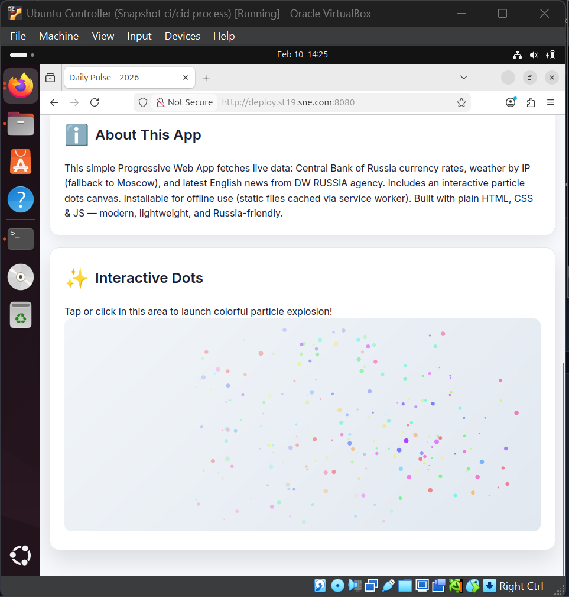

This is successful results for CI/CD pipeline:

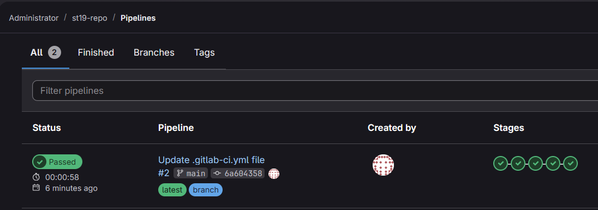

Here is more detailed description in a screenshot for each stage:

- Build the application

    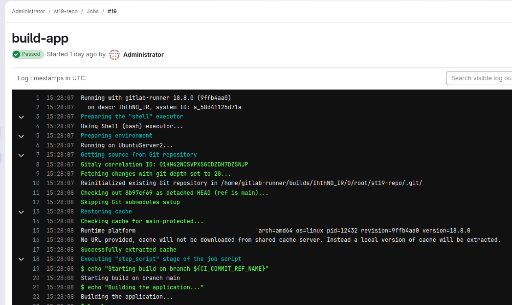

- Run test (to check the application works ok)

    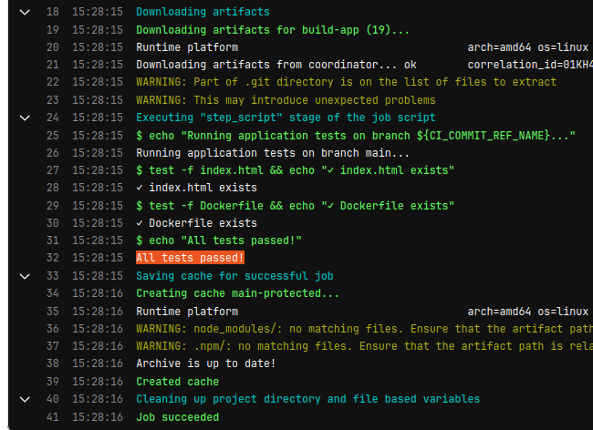

- Build docker image (Note: you need Dockerfile)

    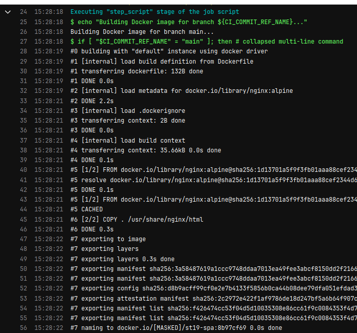

- Pushed to my docker hub account

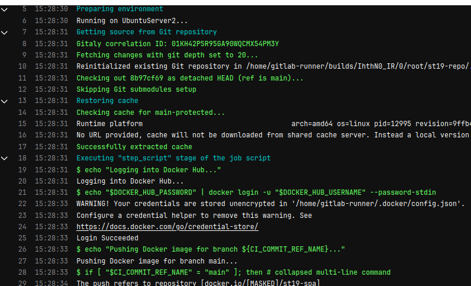

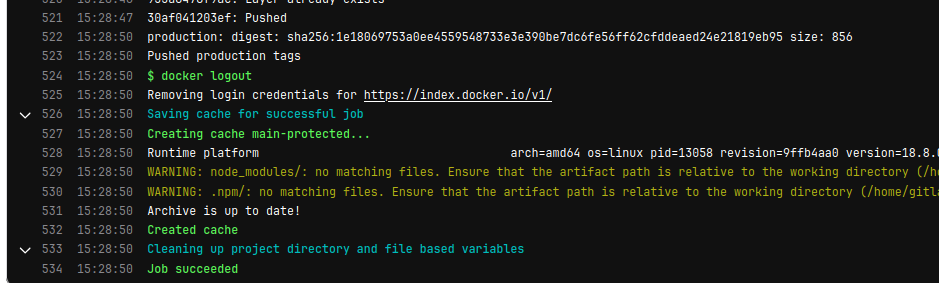

- CD pipe

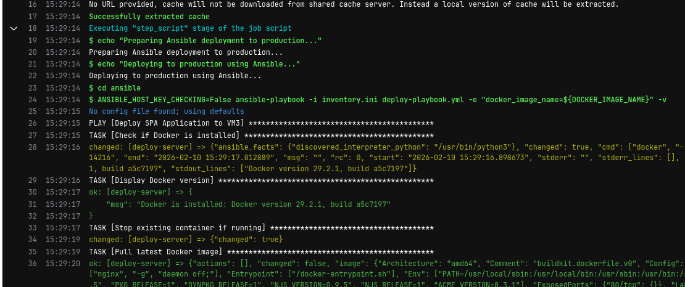

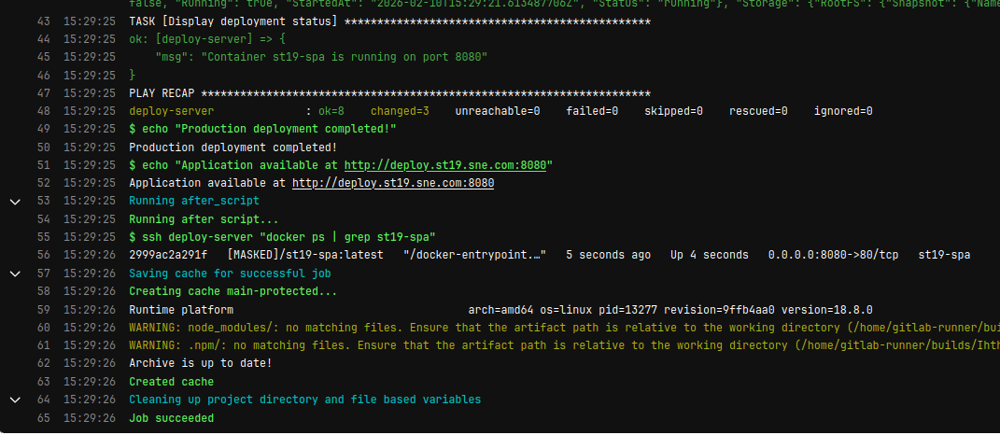

## Task 3: Polish the CICD

I update the CD stages to be able to deploy the web application using Ansible, updated the pipeline to support multi-branch (e.g. master and develop) and jobs should be triggered based on the specific target branch.
Also for all of these I modified my configs for new keywords such as `cache`, `artifact`, `needs`, and `dependencies` to have more control of pipeline execution.

> In github page for the project, you can observe all files containing version of completed 3 tasks.

I created folder ansible in the root of spa: `inventory.ini, deploy-playbook.yml`. Installed ansible on `VM2` and tested it running.

Changed `.gitlab-ci.yml` configuration for ansbile (part of changes). Updated  cache, artifact, needs, and dependencies to have more control of pipeline execution

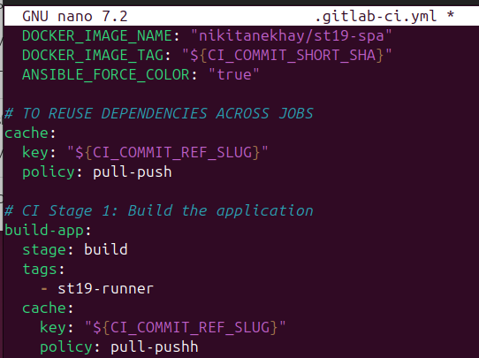

Here is push made from new branch, successfully deployed as it seen on the screenshots:

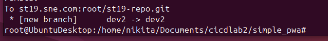

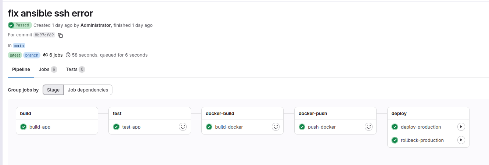


