# 4 k8s

Name of report: K8S_LAB_4_Nikita_Niakhai
Course: DevOps and Security
Performed by Nikita Niakhai
Date submission: 26.02.2026
---

# Task 1 - Preparation

**1.1.** Choose an application.

My chosen application is a frontend (`-p 5173`) React.js and backend (`-p 3000`) Node.js with simple Rest API communicating with google sheet as a database.

The project sends successful forms to sheets, has openrouter api for a chat bot, answering questions about the company and the tech.

Project is a SPA for a startup, that has attributes:

- non-confidential data like in JSON format
- application configuration values (or environment variables)
- env secrets (like authorization credentials)
- has availability from outside (on Internet) via Vercel on the deployment phase.

> GITHUB LINK: <https://github.com/NikitaNekhay/safe-pocket-map-spa>
>

**1.2.** Get familiar with Kubernetes (k8s) and concepts — check references for the report.

Kubernetes is a non typical PaaS (Platform as a service), providing a lot of functionality to effectively, automatically, manage and orchestrate big amounts of nodes, containers.

K8S provides to huge services:

- scalability
- right smart distribution of resources between nodes and podes
- load and resource balancing
- logging and monitoring, detecting containers
- deployment of containers

Kubernetes consists of:

- Pods —  is a container or combination of container that have common setup, shared network/memory resources, basically their goal is the same.
- Service — is a group of nodes responsible for one functionality. Is a entrance to a node, they have more stable dns and ip.
- Deployments — responsible for life cycle of a node, quantity of them and etc.
- Node — is a virtual or physical machine running containers inside. Kubernetes has 2 service nodes:
    - Master node — “Mind unit”, Contains **K8S control plane,** services kube-scheduler, kube-controller-manager, kube-apiserver, etcd.
    - Worker node — “Working unit”, Contains **container runtime** (platform on which pod is launched, e.g. *docker*, *container d*), serivices for k8s system responsible for proxy, kubelet.


Fig. Diagram of k8s master node components

**1.3.** Install and set up the necessary tools :

- `kubectl` [[documentation](https://kubernetes.io/docs/tasks/tools/install-kubectl-linux/), section *Install using native package management*]
- `minikube` [[documentation](https://kubernetes.io/ru/docs/tasks/tools/install-minikube/) ]

Because I run the lab inside my VM on my host machine, I will use it, instead of nested virtualization.

```bash
# for docker (minikube driver)
sudo usermod -aG docker $USER && newgrp docker

minikube start --driver=docker

# to avoid problems with not "enough space" errors, allocate more space
minikube stop
minikube delete
minikube start --driver=docker --disk-size=50g

minikube ssh -- docker system prune
```

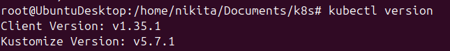

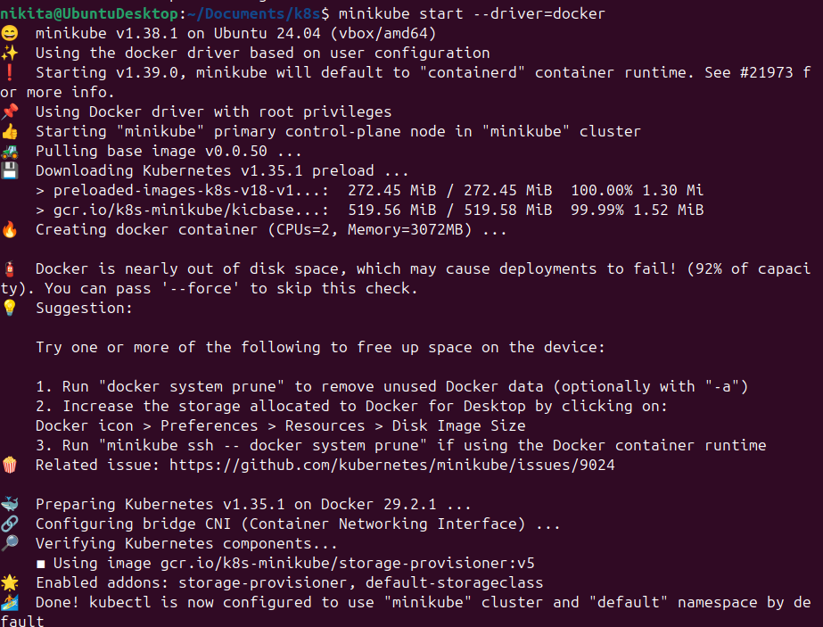

Figure 1.1 — kubectl and miniube installation

**1.4.** Get access to Kubernetes Dashboard.

```bash
# Access via browser on your VM or tunnel it
minikube dashboard --url & # if headless VM
```

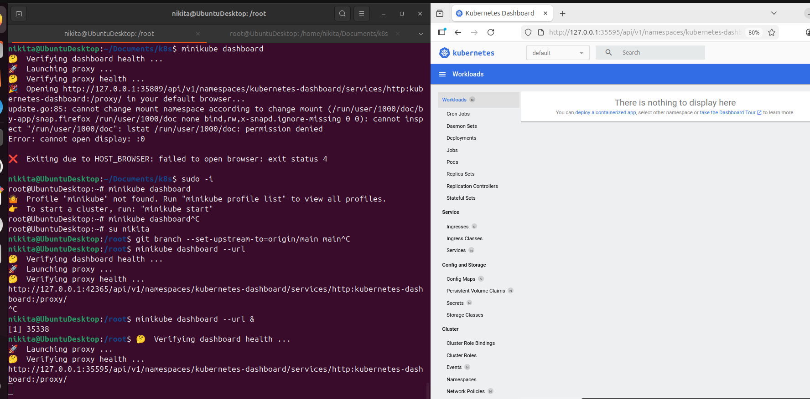

Figure 1.2 — Kubernetes Dashboard access

---

# Task 2 - k8s Nodes

We are going to start to learn Kubernetes from `kubectl` command line that is dedicated to work with k8s cluster.

1. I use `kubectl` commands to get and describe my one cluster node.
2. Get the more detailed information about the `minikube` node
3. Get the OS and CPU information.

```bash
# Commands used
kubectl get nodes
kubectl describe node minikube
```

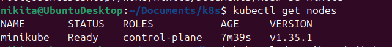

Figure 2.1 — kubectl get nodes output

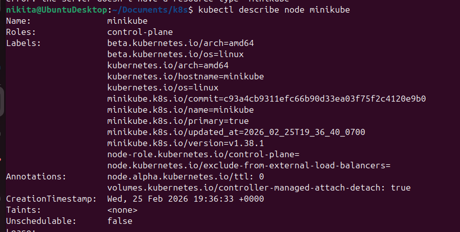

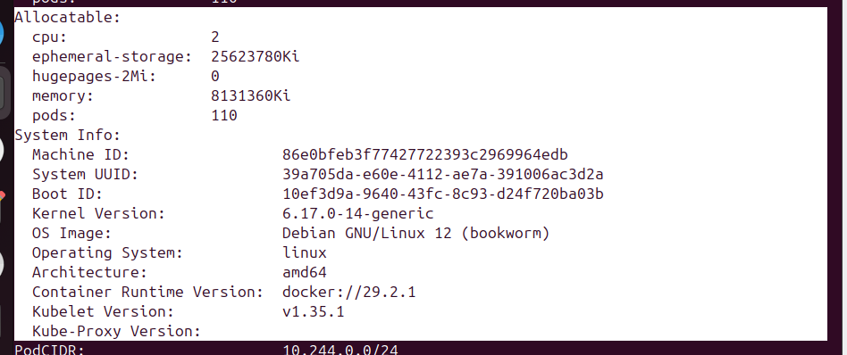

Figure 2.2 — kubectl describes node output (OS and CPU info)

---

# Task 3 - k8s Pod

1. Prerequisites: create Dockerfiles for my backend and frontend

**Backend `Dockerfile`:**

```bash
FROM node:20-alpine

RUN addgroup -S appgroup && adduser -S appuser -G appgroup

WORKDIR /app

COPY package.json ./

COPY backend/package.json backend/package-lock.json* ./backend/

RUN npm install --prefix backend --omit=dev --legacy-peer-deps

COPY backend/ ./backend/

USER appuser

WORKDIR /app/backend

ENV NODE_ENV=production
ENV PORT=3000

EXPOSE 3000

CMD ["node", "--openssl-legacy-provider", "index.js"]
```

**Frontend `Dockerfile`:**

```bash
FROM node:20-alpine AS builder

WORKDIR /app

COPY package.json ./

COPY frontend/package.json frontend/package-lock.json* ./frontend/

RUN npm install --prefix frontend --legacy-peer-deps

COPY frontend/ ./frontend/

WORKDIR /app/frontend
ARG VITE_API_URL
ARG VITE_GA_ID
ENV VITE_API_URL=$VITE_API_URL
ENV VITE_GA_ID=$VITE_GA_ID
RUN npm run build

FROM nginx:alpine

COPY --from=builder /app/frontend/dist /usr/share/nginx/html
COPY frontend/nginx.conf /etc/nginx/conf.d/default.conf

EXPOSE 80
CMD ["nginx", "-g", "daemon off;"]
```

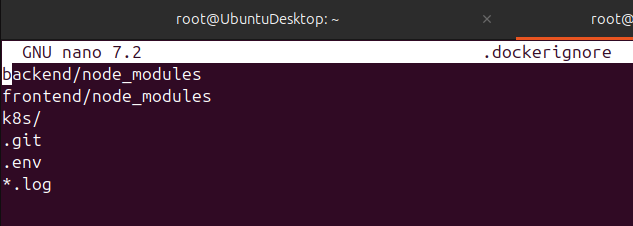

Also docker igonre file in the root

Verified images, then removed the for free space

```bash
docker run -d -p 3000:3000 spm-backend:latest
# d for running image in the daemon, so that console is not blocked, p for being on the right port, so i can access it through vm
```

Then I enter minikube env and build images there

```bash
eval $(minikube docker-env)

docker build -f backend/Dockerfile -t spm-backend .
docker build -f frontend /Dockerfile -t spm-frontend .
```

Now pods are running, but backend has error (`kubectl describe pod backend`):

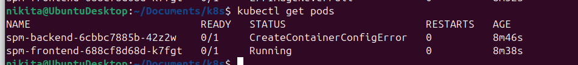

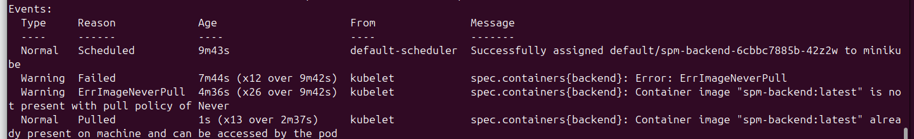

The problem is that on my VM I still had image for this backend with the same name, so I deleted the image, rebuild docker image to eval “$minikube docker-env” and

> Pod is one of the simplest and basic k8s unit. It's like an abstraction over Docker containers. Inside pods there are containers run your application.
>

1. Write a Pod spec for your chosen application, deploy the application and run a pod.

    For frontend I decided to directly start with a deployment type, but for backend I created Pod type.

2. With `kubectl`, get the pods, pod logs, describe pod, go into pod shell.
3. Make sure that your app is working correctly inside Pod.
4. Put the results into report.

```yaml
# Pod manifest (backend.yaml)
apiVersion: v1
kind: Pod
metadata:
  name: spm-backend
  namespace: default
  labels:
    app: spm-backend
spec:
  containers:
    - name: backend
      image: spm-backend:latest
      imagePullPolicy: Never
      ports:
        - containerPort: 3000
      env:
        - name: NODE_ENV
          value: "production"
        - name: PORT
          value: "3000"
        - name: CORS_ORIGIN
          value: "http://localhost:5173"
        - name: GOOGLE_CLIENT_EMAIL
          valueFrom:
            secretKeyRef:
              name: spm-backend-secret
              key: GOOGLE_CLIENT_EMAIL
        - name: GOOGLE_PRIVATE_KEY
          valueFrom:
            secretKeyRef:
              name: spm-backend-secret
              key: GOOGLE_PRIVATE_KEY
        - name: GOOGLE_SHEET_ID
          valueFrom:
            secretKeyRef:
              name: spm-backend-secret
              key: GOOGLE_SHEET_ID
      readinessProbe:
        httpGet:
          path: /
          port: 3000
        initialDelaySeconds: 5
        periodSeconds: 10
      livenessProbe:
        httpGet:
          path: /
          port: 3000
        initialDelaySeconds: 15
        periodSeconds: 20
      resources:
        requests:
          cpu: "100m"
          memory: "128Mi"
        limits:
          cpu: "500m"
          memory: "256Mi"
---
apiVersion: v1
kind: Service
metadata:
  name: spm-backend
  namespace: default
  labels:
    app: spm-backend
spec:
  type: NodePort
  selector:
    app: spm-backend
  ports:
    - name: http
      port: 3000
      targetPort: 3000
      nodePort: 30300

# Pod (Deployment) manifest (frontend.yaml)

apiVersion: apps/v1
kind: Deployment
metadata:
  name: spm-frontend
  namespace: default
  labels:
    app: spm-frontend
spec:
  replicas: 1
  selector:
    matchLabels:
      app: spm-frontend
  template:
    metadata:
      labels:
        app: spm-frontend
    spec:
      containers:
        - name: frontend
          image: spm-frontend:latest
          imagePullPolicy: Never   # use the locally built image in minikube
          ports:
            - containerPort: 80
          readinessProbe:
            httpGet:
              path: /
              port: 80
            initialDelaySeconds: 5
            periodSeconds: 10
          livenessProbe:
            httpGet:
              path: /
              port: 80
            initialDelaySeconds: 10
            periodSeconds: 20
          resources:
            requests:
              cpu: "50m"
              memory: "64Mi"
            limits:
              cpu: "200m"
              memory: "128Mi"
---
apiVersion: v1
kind: Service
metadata:
  name: spm-frontend
  namespace: default
  labels:
    app: spm-frontend
spec:
  type: NodePort
  selector:
    app: spm-frontend
  ports:
    - name: http
      port: 80
      targetPort: 80
      nodePort: 30080   # access via: minikube service spm-frontend --url
```

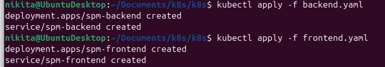

Figure 3.1 — Pod manifest and kubectl apply

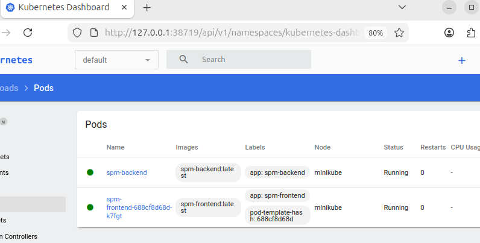

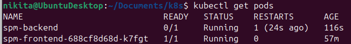

Figure 3.2 — kubectl get pods output

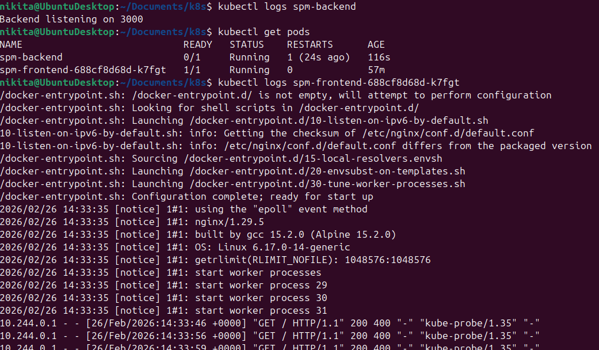

Figure 3.3 — Pod logs (kubectl logs)

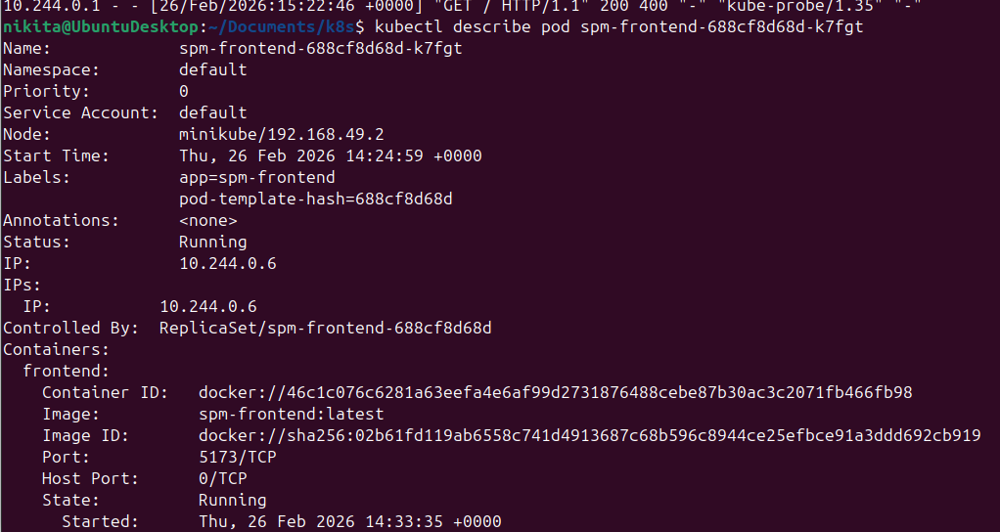

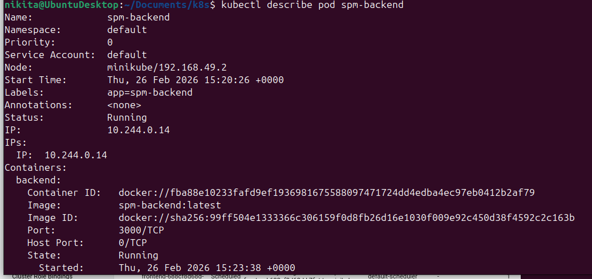

Figure 3.4 — kubectl describe pod output

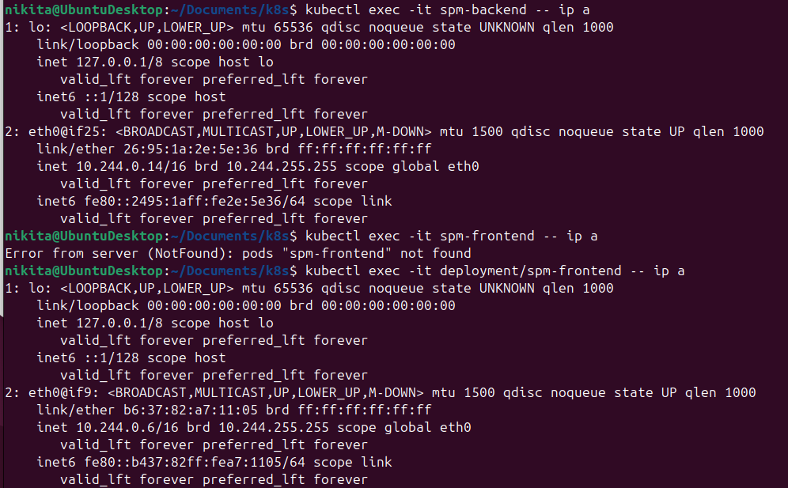

Figure 3.5 — Pod shell (kubectl exec -it)

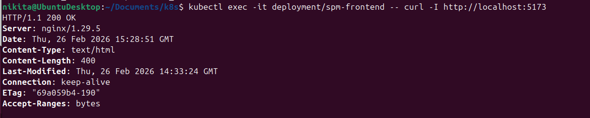

Figure 3.6 — Application working correctly inside Pod

---

# Task 4 - k8s Service

We use k8s Services to make an application accessible from outside the Kubernetes virtual network, provide a compatible IP address and link to DNS name to pod, to route internal/external traffic within pods.

1. Figure out the necessary Service spec fields.
2. Write a Service spec for your pod(s) and deploy the Service.
3. With `kubectl`, get the Services and describe them.
4. Make sure that pods can communicate between each other using DNS names, check pods addresses.
5. Delete any Pod, recreate it and check addresses again. Make sure that traffic is routed to the new Pod correctly.
6. Learn about `Loadbalancer` and `NodePort`.

Services can be of many types, picked depending on your desired net and permission access:
    - `ClusterIP` — type by default, no external access (untill k8s proxy is used), dev & local & intenal usage primary - do not try to share it to the web

        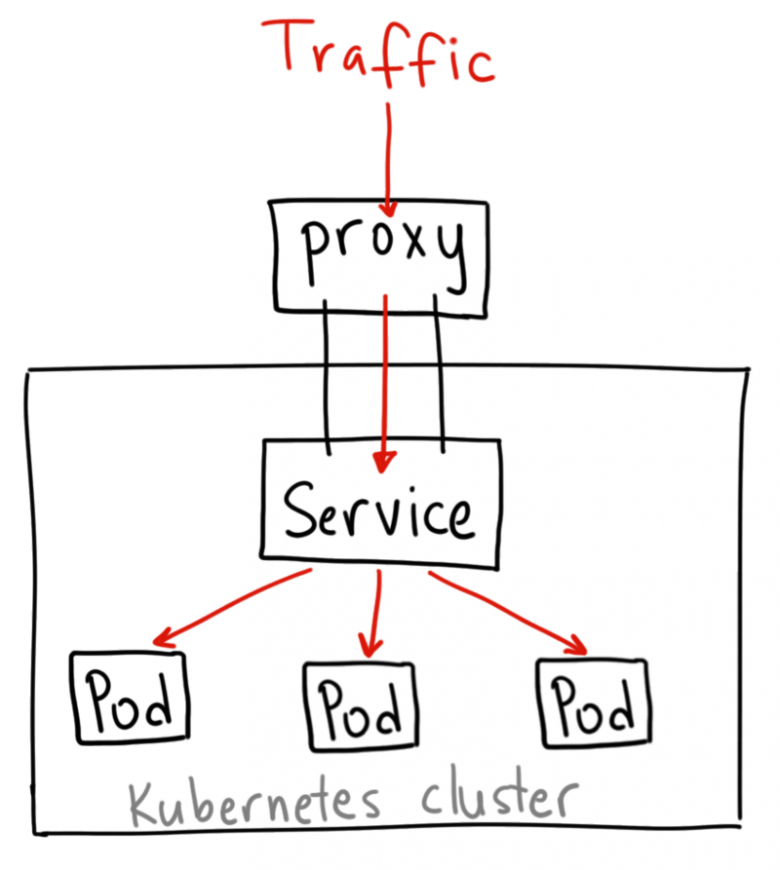

    - `NodePort` — for incomming traffic provides port on the node (vm / minikube) then it directs to service which then decides to which pod allocate a request. Better define port yourself, otherwise a port between 30000–32767 will be determined. 1 port per service.

        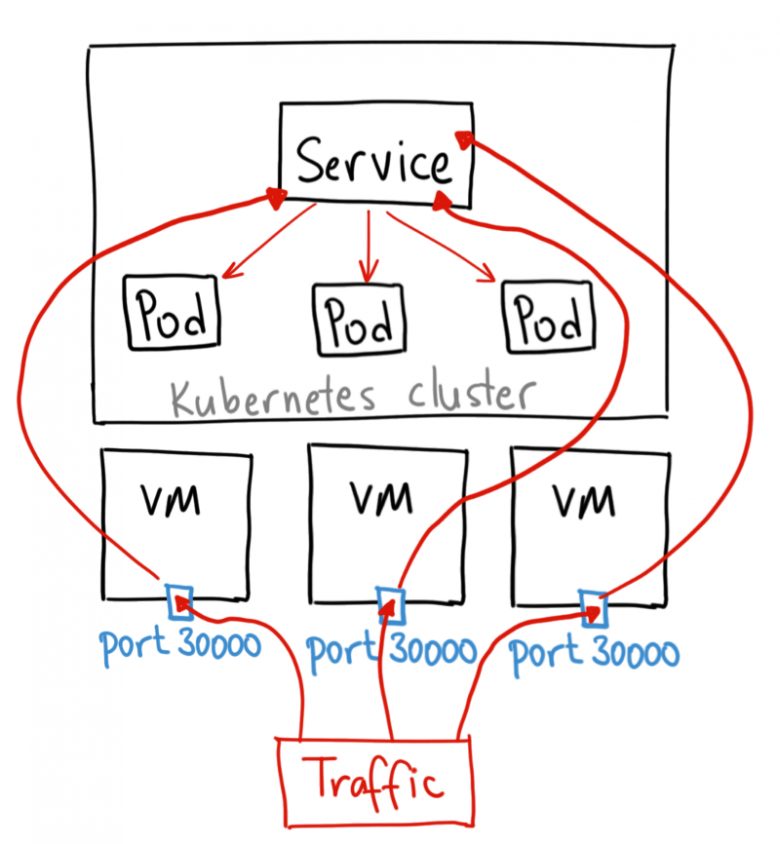

    - `LoadBalancer` — inside k8s engine it creates *network load balancer* , which takes defined IP address and then through this IP it will allocate all incoming traffic. But 1 ip address per service → expensive.

        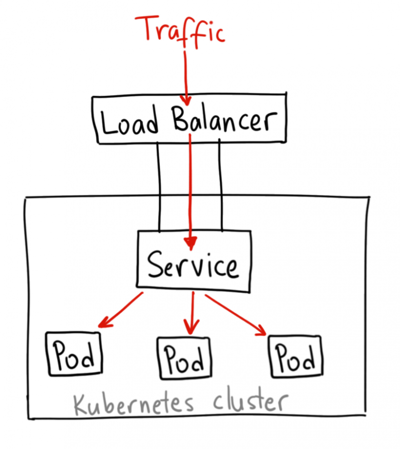

    - `Ingress` (formally it is not a Service kind:Ingress, it has his own types) — but it works like a higher version of a Service, it smartly routes traffics to group of services. Types:
        - [Google Cloud Load Balancer](https://cloud.google.com/kubernetes-engine/docs/tutorials/http-balancer), [Nginx](https://github.com/kubernetes/ingress-nginx), [Contour](https://github.com/heptio/contour), [Istio](https://istio.io/docs/tasks/traffic-management/ingress.html)

        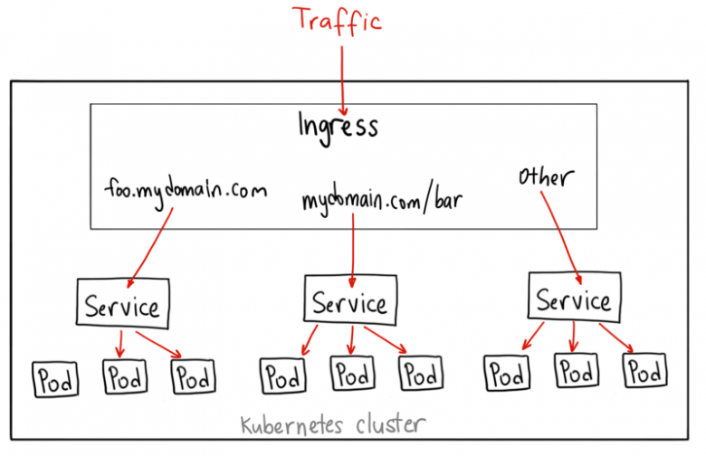

7. Deploy an external Service to access your application from outside, e.g., from your local host.

```yaml
# Service manifest front (service.yaml)
apiVersion: v1
kind: Service
metadata:
  name: spm-frontend
  namespace: default
  labels:
    app: spm-frontend
spec:
  type: NodePort
  selector:
    app: spm-frontend
  ports:
    - name: http
      port: 5173
      targetPort: 5173
      nodePort: 30080   # access via: minikube service spm-frontend --url

# Service manifest back(service.yaml)
apiVersion: v1
kind: Service
metadata:
  name: spm-backend
  namespace: default
  labels:
    app: spm-backend
spec:
  type: NodePort
  selector:
    app: spm-backend
  ports:
    - name: http
      port: 3000
      targetPort: 3000
      nodePort: 30300
```

Fixed error with empty endpoints for backend, because of type how to check connectivity, and also accessed through the outside of the net my services.

Used minikube’s ip address and port assigned in service files.

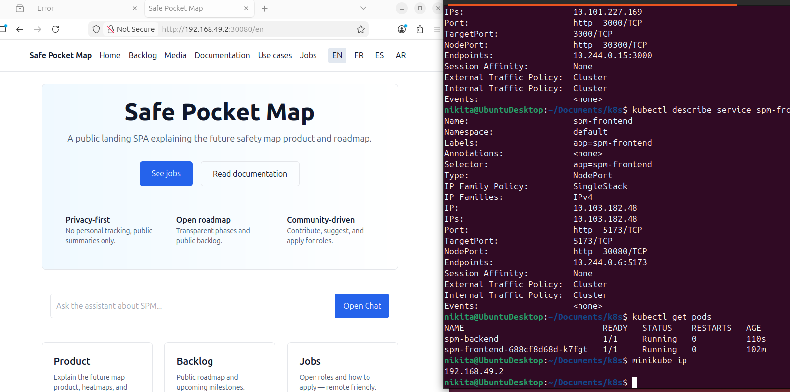

Figure 4.1 External Service access from local host

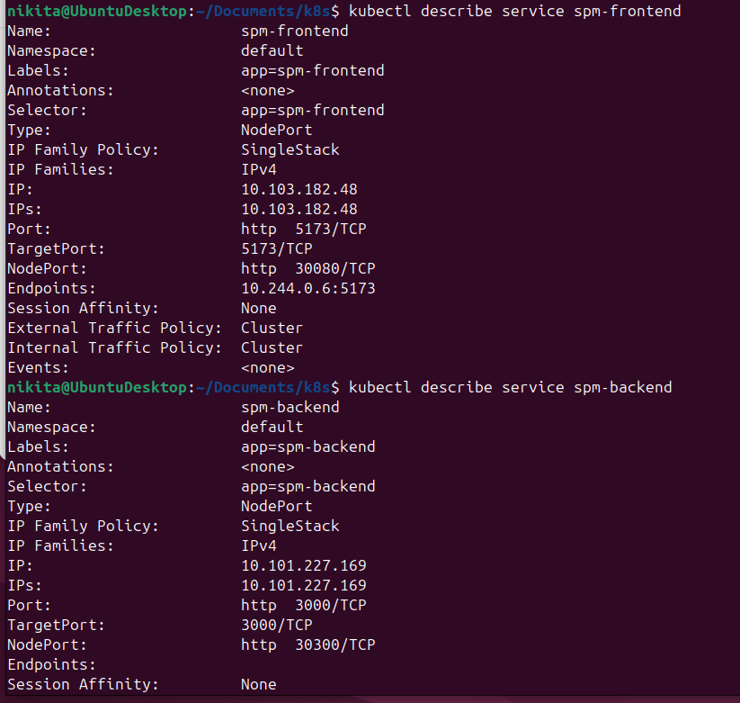

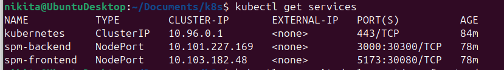

Figure 4.2 — kubectl get services / describe service

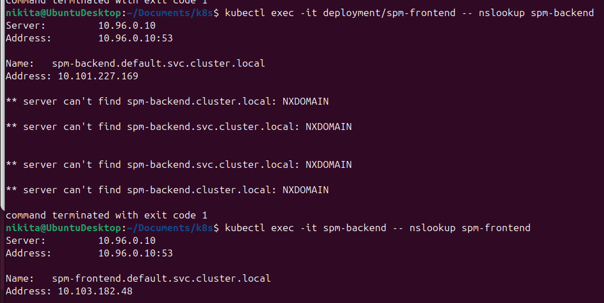

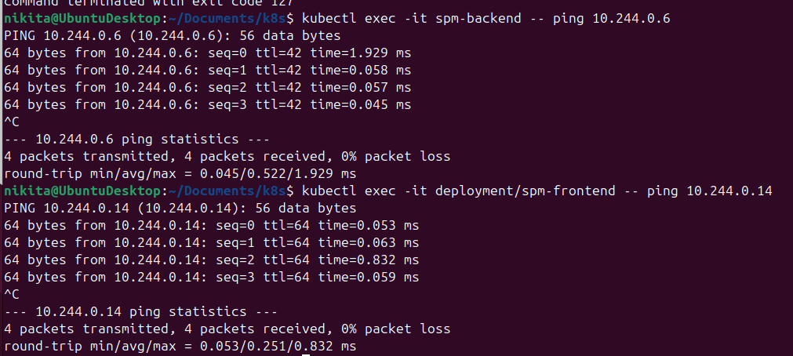

Figure 4.3 — Pod DNS communication check

So after deletion the ip address of the backend pod dynamically changed.

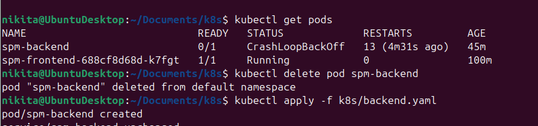

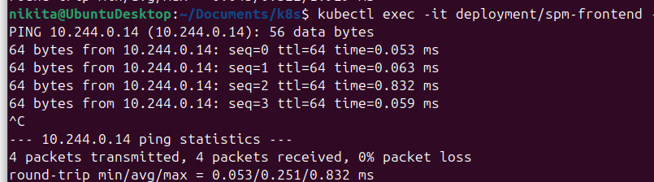

Figure 4.4 — Pod deletion and recreation, traffic routing check

---

# Task 5 - k8s Deployment

Deployment is Kubernetes manifest to manage Pods automatically by Controller. It helps to release, scale and upgrade Pods.

1. Figure out the necessary Deployment spec fields.

    **Pod:**

    - One or more containers
    - You start it — it runs
    - If it crashes — it's dead, gone forever
    - Not scalable

    **Deployment:**

    - A controller that manages Pods
    - Pod crashes → Deployment automatically creates a new one
    - You can say "I want 3 replicas" → you get 3 copies running
    - Built‑in support for updates and rollbacks

    **Takeaway:**

    - A Pod dies → Deployment creates a new one
    - You update the container image → Deployment performs a rolling update (restarts Pods gradually)
    - You change `replicas: 5` → Deployment scales to five Pods

    **New fields:**

    ```bash
    spec:
      replicas: 1              # How many Pod copies to create (Pod has no such field)

      selector:                # How to find the Pods this Deployment controls
        matchLabels:           # (Pod has no selector)
          app: spm-backend

      template:                # Pod template – describes the Pods to be created
        metadata:
          labels:
            app: spm-backend
        spec:
          containers: [...]   # Same container definition as in a standalone Pod
    ```

2. Make sure that you wiped previous Pod manifests. Write a Deployment spec for your pod(s) and deploy the application.
3. With `kubectl`, get the Deployments and describe them.
4. Update your Deployment manifest to scale your application to three replicas. I deployed 3 pods for frontend. I checked IPs inside the local lan of k8s and saw different IPs, but for outside word it can be one address.

    ```bash
    kubectl scale deployment spm-backend --replicas=3
    ```

5. Access pod shell and logs using Deployment labels.
6. Make any application configuration change in your Deployment yaml and try to update the application. Monitor what are happened with pods (`--watch`).
    1. Update Deployment:

    bash

    `kubectl set image deployment/spm-backend backend=spm-backend:v2`

    b. Rollback:

    `kubectl rollout history deployment/spm-backend
    kubectl rollout undo deployment/spm-backend`

7. Rollback to previous application version using Deployment.
8. What are Annotations in k8s, why and when we can use them?

    Annotations are like sticky notes you attach to Kubernetes objects
     to store extra information that isn't used for identifying or selecting
     them. You use them when you need to add details like tool versions,
    contact info, or descriptions that help humans or automation tools
    understand the object better. For example, you might add an annotation
    saying "this deployment was created by CI pipeline version 2.5" so your
    team knows where it came from.

```yaml
# Deployment manifest backend only, because fronent is already in deployment (deployment.yaml)
apiVersion: apps/v1
kind: Deployment
metadata:
  name: spm-backend
  namespace: default
  labels:
    app: spm-backend
spec:
  replicas: 1
  selector:
    matchLabels:
      app: spm-backend
  template:
    metadata:
      labels:
        app: spm-backend
    spec:
      containers:
        - name: backend
          image: spm-backend:latest
          imagePullPolicy: Never
          ports:
            - containerPort: 3000
          env:
            - name: NODE_ENV
              value: "production"
            - name: PORT
              value: "3000"
            - name: CORS_ORIGIN
              value: "http://192.168.49.2:30080"
            - name: GOOGLE_CLIENT_EMAIL
              valueFrom:
                secretKeyRef:
                  name: spm-backend-secret
                  key: GOOGLE_CLIENT_EMAIL
            - name: GOOGLE_PRIVATE_KEY
              valueFrom:
                secretKeyRef:
                  name: spm-backend-secret
                  key: GOOGLE_PRIVATE_KEY
            - name: GOOGLE_SHEET_ID
              valueFrom:
                secretKeyRef:
                  name: spm-backend-secret
                  key: GOOGLE_SHEET_ID
          readinessProbe:
            tcpSocket:
              port: 3000
            initialDelaySeconds: 5
            periodSeconds: 10
          livenessProbe:
            tcpSocket:
              port: 3000
            initialDelaySeconds: 15
            periodSeconds: 20
          resources:
            requests:
              cpu: "100m"
              memory: "128Mi"
            limits:
              cpu: "500m"
              memory: "256Mi"
---
apiVersion: v1
kind: Service
metadata:
  name: spm-backend
  namespace: default
  labels:
    app: spm-backend
spec:
  type: NodePort
  selector:
    app: spm-backend
  ports:
    - name: http
      port: 3000
      targetPort: 3000
      nodePort: 30300
```

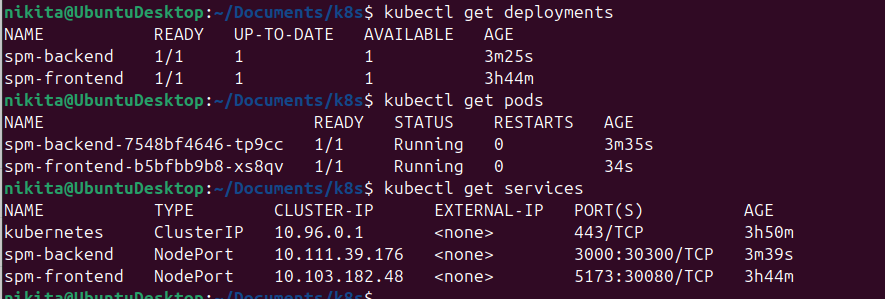

Figure 5.1 — Deployment manifest and kubectl apply

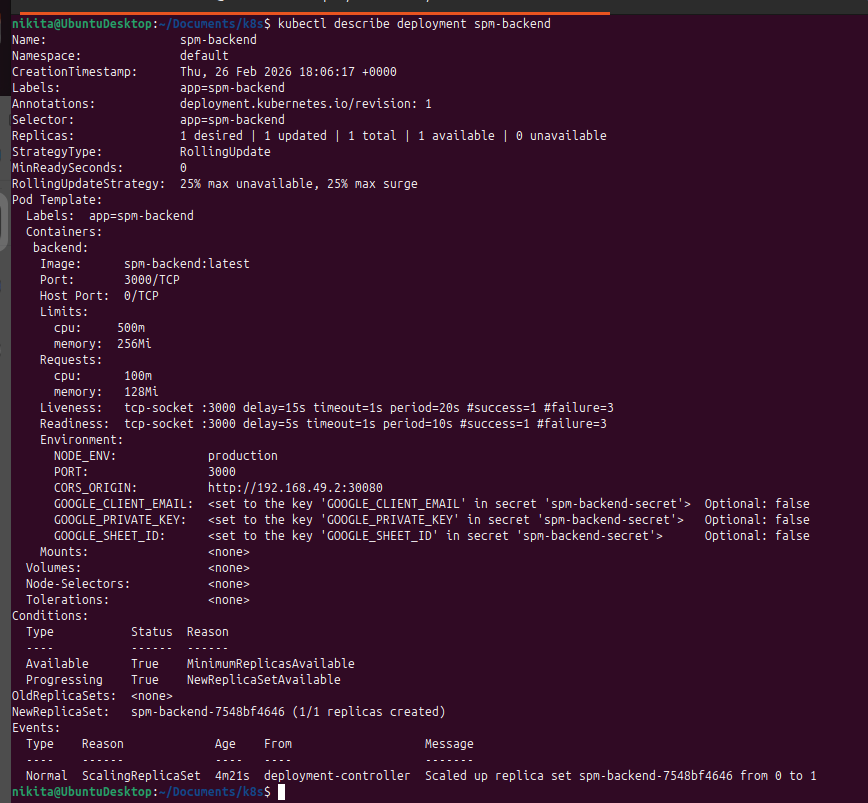

Figure 5.2 — kubectl get deployments / describe deployment for backend

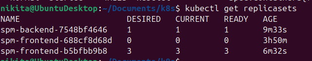

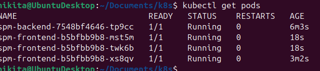

Figure 5.3 — Scaling to 3 replicas

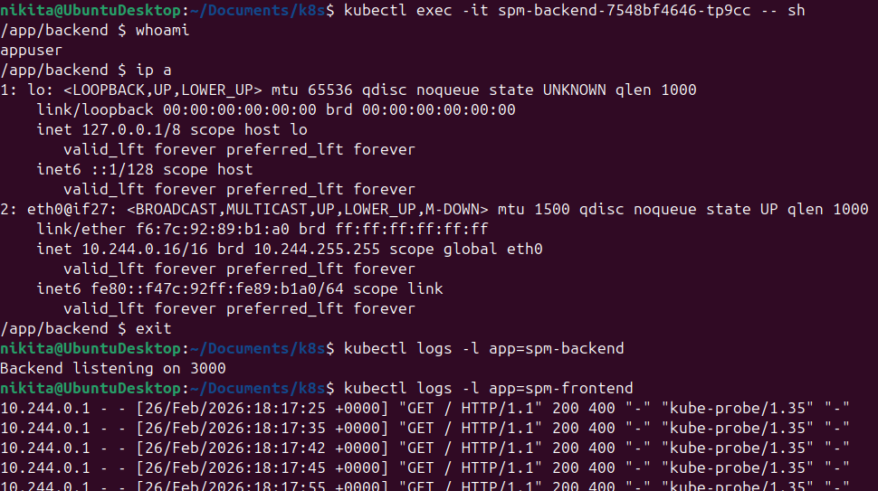

Figure 5.4 — Accessing pod shell and logs via Deployment labels

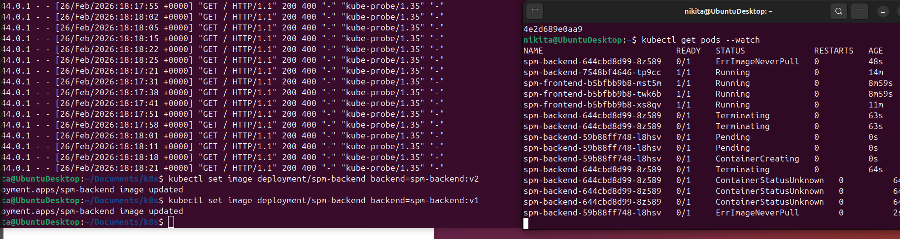

Figure 5.5 — Application update with --watch pods monitoring

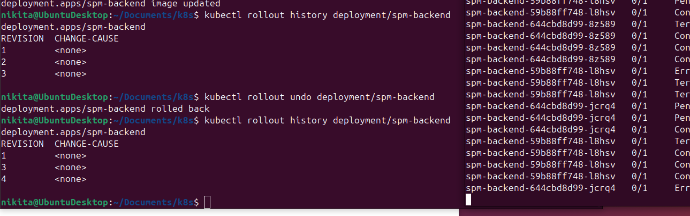

Figure 5.6 — Rollback to previous version

---

# Task 6 - k8s Secrets

Secret manifest is quite similar to `configMap`. However, we use Secret to work with confidential application data. Kubernetes encode secrets in Base64 format.

1. Figure out the necessary Secret spec fields.
2. Create and apply a new Secret manifest. For example, it could be login and password to login to your app or something else.
3. With `kubectl`, get and describe your secret(s).
4. Decode your secret(s).
5. Update your Deployment to reference to your secret as environment variable.
6. Make sure that you are able to see your secret inside pod.
7. **Question:** Secrets objects are just a Base64 encoded data. We can't consider this as an encrypted data. What to do if you need to hide a sensitive data in real deployments? Propose your ideas.

    Use third party Vault like form AWS or HashiCorp.

    Do encryption for keys — Sealed Secrets / SOPS for encrypting files.

    Restrict access to secret RBAC role based access.

    Or use cloud solution from AWS or Yandex to handle it.

```yaml
# Secret manifest example (secret.yaml)
apiVersion: v1
kind: Secret
metadata:
  name: my-app-secret
type: Opaque
data:
  username: dXNlcm5hbWU=
  password: cGFzc3dvcmQ=
```

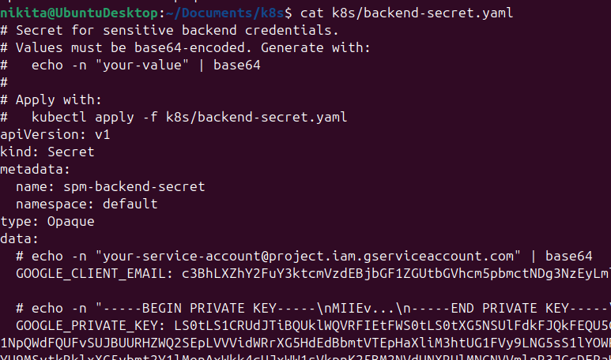

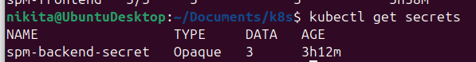

Figure 6.1 — Secret manifest and kubectl apply

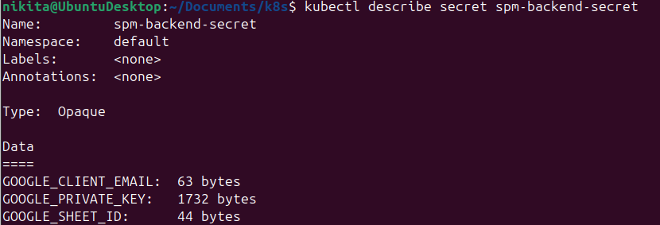

Figure 6.2 — kubectl get secret / describe secret

```bash
# one secret
kubectl get secret spm-backend-secret -o jsonpath='{.data.GOOGLE_CLIENT_EMAIL}' | base64 -d

# all secrets
kubectl get secret spm-backend-secret -o yaml
```

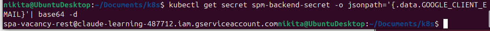

Figure 6.3 — Decoding secrets

```bash
env:
  - name: GOOGLE_CLIENT_EMAIL
    valueFrom:
      secretKeyRef:
        name: spm-backend-secret
        key: GOOGLE_CLIENT_EMAIL
```

Figure 6.4 — Deployment updated with secret env variable

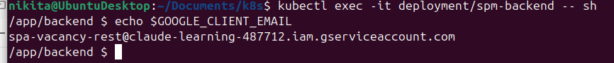

Figure 6.5 — Secret visible inside pod

---

# Task 7 - k8s ConfigMap

ConfigMap is Kubernetes manifest to store application configuration settings in two ways: key-value pairs as environment variables and text (like JSON) data as dedicated file into container filesystem.  ConfigMap used to store non-sensitive data as plain text.

1. Figure out the necessary ConfigMap spec fields.
2. Modify your Deployment manifest to set up some app configuration via environment variables.
3. Create a new ConfigMap manifest. In data spec, put some app configuration as key-value pair. In the Deployment.Pod spec add the connection to key-value pair from ConfigMap yaml file.
4. Create a new file like `config.json` file and put some json data into.
5. Create a new one ConfigMap manifest. Connect ConfigMap yaml file with `config.json` file to read the data from it.

    Here I decided to create a dump db in config.json

    ```bash
    cat > config.json << 'EOF'
    {
      "database": {
        "host": "db.default.svc.cluster.local",
        "port": 5432
      },
      "cache": {
        "ttl": 3600
      }
    }
    EOF

    # create configmap
    kubectl create configmap spm-backend-files --from-file=config.json

    # i use it as volumeMounts inside deployment spec:
    spec:
      containers:
        - name: backend
          volumeMounts:
            - name: config-volume
              mountPath: /etc/config
      volumes:
        - name: config-volume
          configMap:
            name: spm-backend-files
    ```

6. Update your Deployment to add `Volumes` and `VolumeMounts`.
7. With `kubectl`, check the ConfigMap details. Make sure that you see the data as plain text.
8. Check the filesystem inside app container to show the loaded file data on the specified path.

```yaml
# ConfigMap manifest (configmap.yaml)
apiVersion: v1
kind: ConfigMap
metadata:
  name: my-app-config
data:
  APP_ENV: production
  APP_PORT: "8080"
  config.json: |
    {
      "key": "value"
    }
```

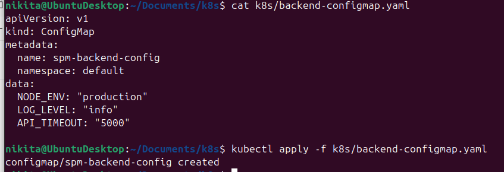

Figure 7.1 — ConfigMap manifest and kubectl apply

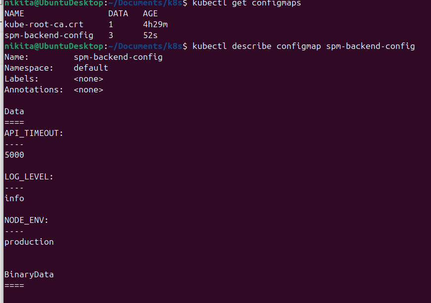

Figure 7.2 — kubectl get configmap / describe configmap (plain text data)

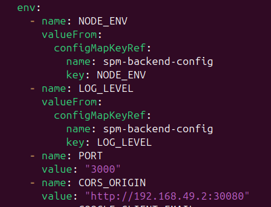

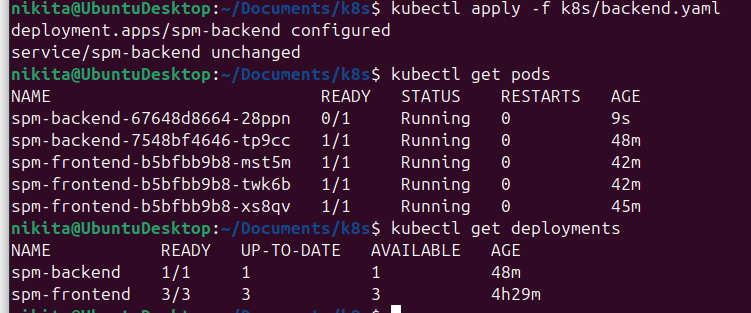

Figure 7.3 — Deployment with env vars from ConfigMap

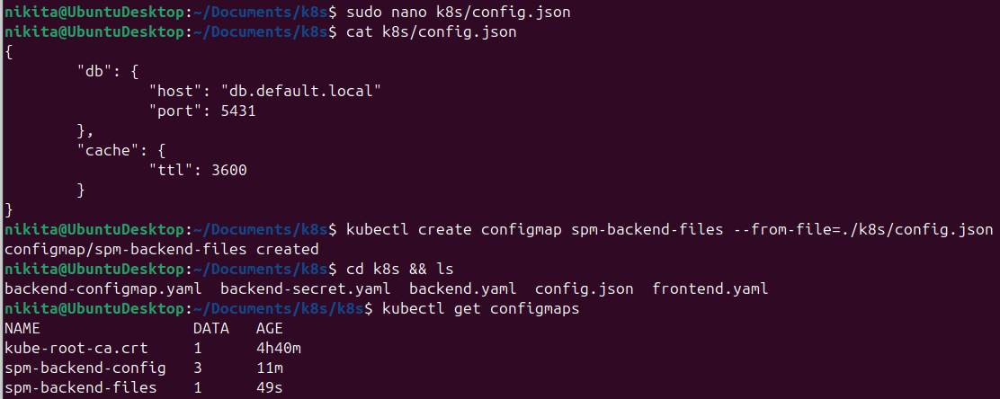

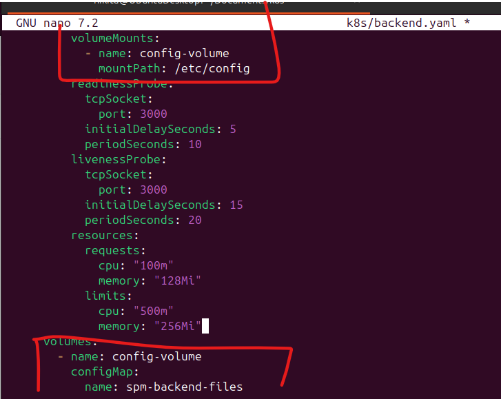

Figure 7.4 — Deployment with Volumes and VolumeMounts

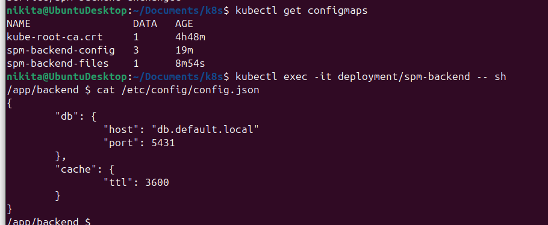

Figure 7.5 — Loaded config.json visible inside container filesystem

---

# Task 8 - k8s Namespace

Namespace Kubernetes Manifest is designed for different projects and deployment environments isolation. With Namespaces we can separate App 1 deployment from App 2 deployment, manage (and isolate) cluster resources for them, define users list to have access either to App 1 or to App 2 deployment. Using Namespaces, we also can define different environments like DEV, TEST, STAGE. In that way, Namespaces is a required feature for a real Kubernetes production clusters.

1. Figure out the necessary Namespace spec fields.
2. Create two different Namespaces in your k8s cluster.
3. Using `kubectl`, get and describe your Namespaces.
4. Deploy two different applications in two different Namespaces with `kubectl`. By the way, it's acceptable even just to deploy the same objects (same app you used before) in the different Namespaces but with unique resources names.
5. With `kubectl`, get and describe pods from different Namespaces with `-n` flag.
6. Does Namespaces isolate objects from each other?

Yes. K8S sees them as different objects, network by default is not isolated

7. How does accessing Service objects located on different Namespaces change your work with this k8s object kind?
Format: `<service>.<namespace>.svc.cluster.local`

    I need to provide full names. e.g.

    ```bash
    # one namespace
    ```
    spm-backend:3000
    ```
    # another namespace
    ```
    spm-backend.prod.svc.cluster.local:3000
    ````bash
1. Bonus to switch namespaces

    ```jsx
    # Install
    git clone https://github.com/ahmetb/kubectx.git ~/.kubectx
    mkdir -p ~/.local/bin
    ln -s ~/.kubectx/kubens ~/.local/bin/kubens

    # Use
    kubens           # показать все namespaces
    kubens dev       # переключиться на dev
    kubens -         # вернуться на предыдущий

    # Updated syntax for basic kubectl:
    kubens dev
    kubectl get pods  # by default in dev namespace
    ````

```yaml
# Namespaces manifest (namespace.yaml)
cat > namespaces.yaml << 'EOF'
apiVersion: v1
kind: Namespace
metadata:
  name: dev
---
apiVersion: v1
kind: Namespace
metadata:
  name: prod
EOF

kubectl apply -f namespaces.yaml
```

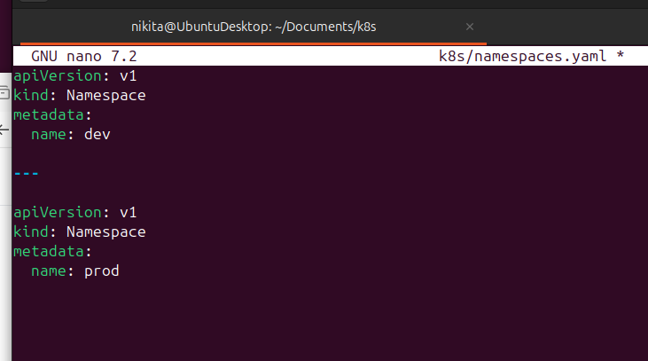

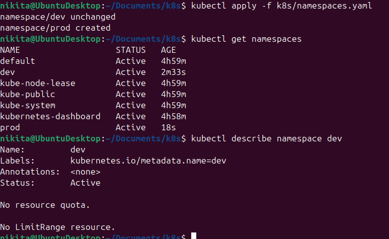

Figure 8.1 — Namespace manifests and kubectl apply, describe

Switch namespaces with CLI to prod :

```bash
# delete namespace field in dep yaml

# apply
kubectl apply -f backend.yaml -n prod
kubectl apply -f frontend.yaml -n prod
```

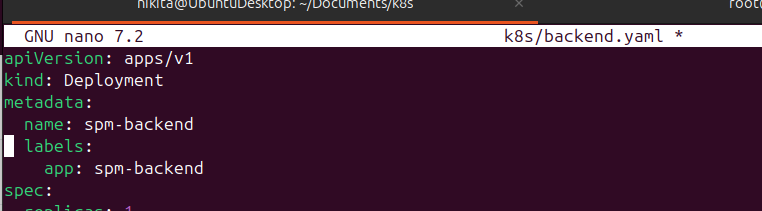

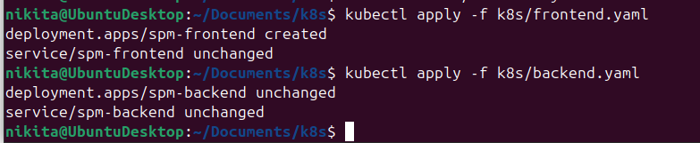

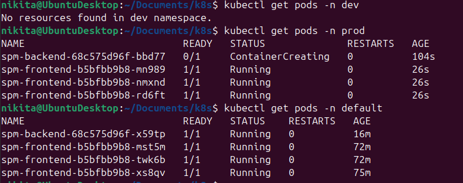

Figure 8.2 — Deployments in different Namespaces and kubectl get pods -n <namespace>

---

# Task 9 - k8s RBAC

RBAC (Role-based access control) is a system for allocating access rights to various objects in a Kubernetes cluster.

1. Figure out the necessary `ServiceAccount`, `ClusterRole` and `ClusterRoleBinding` specs fields.
2. Create a new ServiceAccount dedicated to your app deployment.
3. Create `ClusterRole` and `ClusterRoleBinding` manifests, connect them to the custom ServiceAccount.
4. With `kubectl`, get and describe your Service Accounts, Roles and Bindings.
5. Provide a PoC that your custom ServiceAccount has different permissions to cluster resources rather than the default one.
6. **Questions:** why to create custom ServiceAccounts is a good practice? Why it's useful? What is the difference between Roles and ClusterRoles and their Bindings?

    **Why create custom ServiceAccounts?**

    - **Security**: Each pod gets only the permissions it absolutely needs (principle of
    least privilege), reducing the risk of accidental or malicious actions.
    - **Audit**: You can track which application or pod performed specific actions by associating them with a dedicated ServiceAccount.
    - **Isolation**: Different applications or teams can have separate identities with their own distinct permissions, preventing one app from interfering with
    another.

    **Difference between Role and ClusterRole**

    - **Role**: Defines permissions **within a single namespace** (e.g., read access to pods in the "default" namespace). Use it for resources that belong to a specific project or environment.
    - **ClusterRole**: Defines permissions **cluster-wide** (e.g., view nodes, manage persistent volumes) or for resources that are not namespaced. It can also be reused across multiple namespaces.
    - **RoleBinding**: Grants the permissions of a Role to users or ServiceAccounts **inside a particular namespace**.
    - **ClusterRoleBinding**: Grants ClusterRole permissions **across the entire cluster**, regardless of namespace.

> ⭐
>
> **Bonus — Rancher:** On real complicated production Kubernetes clusters, it's very important to have a centralized GUI based system to easily access, control and monitor k8s deployments. Install any k8s container management platform and show several actions related to cluster control in practice. Rancher is one of the most popular solution.

Implemented here:

```bash
# Install Rancher 
helm repo add rancher-latest https://releases.rancher.com/server-charts/latest
helm repo update

helm install rancher rancher-latest/rancher \
  --namespace cattle-system \
  --create-namespace \
  --set hostname=rancher.local

# Access
# https://rancher.local
```

```yaml
# ServiceAccount — identity for pods
apiVersion: v1
kind: ServiceAccount
metadata:
  name: spm-backend-sa
  namespace: default

---

# ClusterRole — set of rules to do things
apiVersion: rbac.authorization.k8s.io/v1
kind: ClusterRole
metadata:
  name: spm-backend-role
rules:
  - apiGroups: [""]              # API group
    resources: ["pods"]          # which resources?
    verbs: ["get", "list"]       # which actions?

---

# ClusterRoleBinding — tied to ServiceAccount
apiVersion: rbac.authorization.k8s.io/v1
kind: ClusterRoleBinding
metadata:
  name: spm-backend-role-binding
subjects:
  - kind: ServiceAccount
    name: spm-backend-sa
    namespace: default
roleRef:
  kind: ClusterRole
  name: spm-backend-role
  apiGroup: rbac.authorization.k8s.io
```

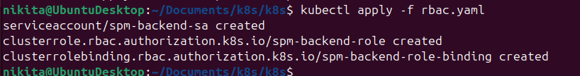

Figure 9.1 — ServiceAccount, ClusterRole, ClusterRoleBinding manifests and kubectl apply

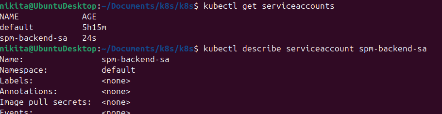

Figure 9.2 — kubectl get serviceaccounts / describe

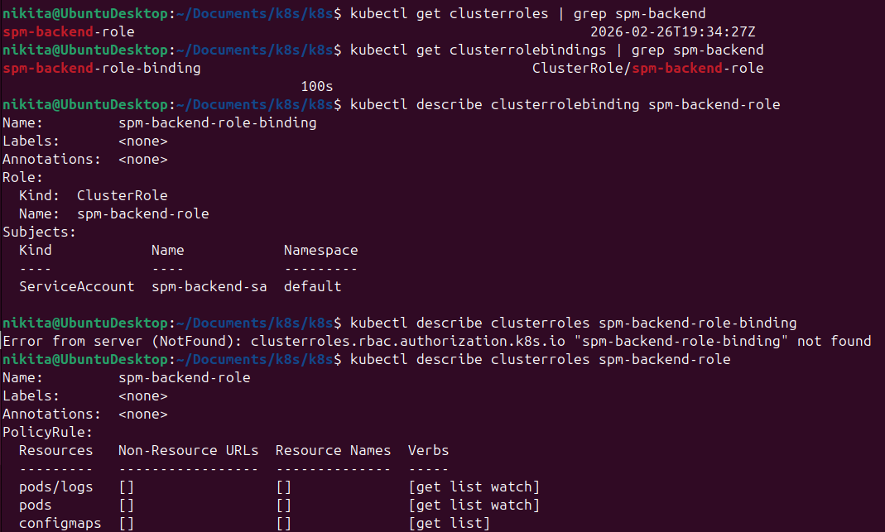

Figure 9.3 — kubectl get clusterroles / clusterrolebindings

I created 2 services accounts with different access rules (true and none), and then checked their ability to delete pods:

```bash
# admin-sa can delete pods
kubectl auth can-i delete pods --as=system:serviceaccount:default:admin-sa

# viewer-sa can not delete pods
kubectl auth can-i delete pods --as=system:serviceaccount:default:viewer-sa
```

New accounts:  `rbac-poc.yaml`

```bash
# ServiceAccount with delete
apiVersion: v1
kind: ServiceAccount
metadata:
  name: admin-sa
  namespace: default
---
apiVersion: rbac.authorization.k8s.io/v1
kind: ClusterRole
metadata:
  name: admin-role
rules:
  - apiGroups: [""]
    resources: ["pods"]
    verbs: ["get", "list", "delete"]
---
apiVersion: rbac.authorization.k8s.io/v1
kind: ClusterRoleBinding
metadata:
  name: admin-role-binding
subjects:
  - kind: ServiceAccount
    name: admin-sa
    namespace: default
roleRef:
  kind: ClusterRole
  name: admin-role
  apiGroup: rbac.authorization.k8s.io

---

# ServiceAccount with no wills
apiVersion: v1
kind: ServiceAccount
metadata:
  name: viewer-sa
  namespace: default
---
apiVersion: rbac.authorization.k8s.io/v1
kind: ClusterRole
metadata:
  name: viewer-role
rules:
  - apiGroups: [""]
    resources: ["pods"]
    verbs: ["get", "list"]
---
apiVersion: rbac.authorization.k8s.io/v1
kind: ClusterRoleBinding
metadata:
  name: viewer-role-binding
subjects:
  - kind: ServiceAccount
    name: viewer-sa
    namespace: default
roleRef:
  kind: ClusterRole
  name: viewer-role
  apiGroup: rbac.authorization.k8s.io
```

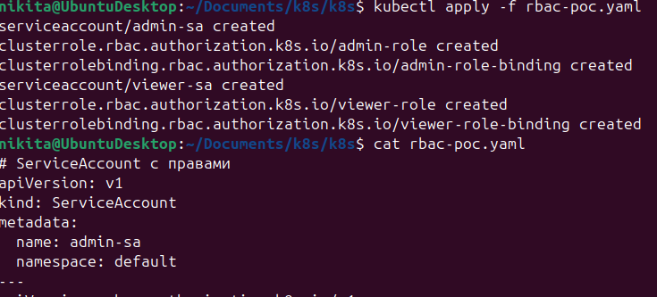

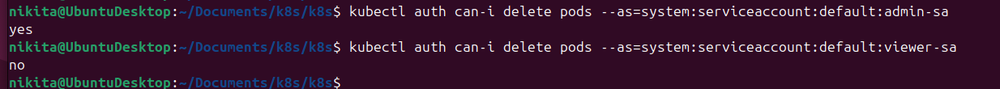

Figure 9.4 — PoC: custom ServiceAccount vs default permissions

## References

**Intro**

1. <https://habr.com/ru/companies/otus/articles/537162/>
2. <https://kubernetes.io/ru/docs/concepts/overview/what-is-kubernetes/>
3. <https://yandex.cloud/ru/blog/posts/2025/03/kubernetes-guide?utm_referrer=https%3A%2F%2Fwww.google.com%2F>

Services explained

1. <https://habr.com/ru/companies/slurm/articles/358824/>

LoadBalancer explaine

1. <https://www.okteto.com/blog/kubernetes-load-balancer-service/>
