# 5 LLM in DevOps

Name of report: LLM_LAB_5_Nikita_Niakhai
Course: DevOps and Security
Performed by Nikita Niakhai
Date submission: 06.03.2026
---

> In this lab, students explore how Large Language Models (LLMs) can be used as assistive tools in DevOps environments. The lab focuses on integrating an LLM into an existing CI/CD pipeline with Kubernetes deployment and security checks, and evaluating how LLMs can support explanation, troubleshooting, and security-aware decision-making.
>
> **Prerequisites:** Virtualization, Containerization (Docker), CI/CD pipelines, Basic Linux and Git knowledge.
>
> **Students will reuse:** the CI/CD pipeline from Lab 3, a containerized application from previous labs, and a Kubernetes deployment configuration.

---

# Task 1 — CI/CD Pipeline Baseline with Security and Kubernetes

Before introducing the LLM, you will prepare a secure DevOps baseline.

1. Show the CI/CD pipeline you implemented in Lab 3, including the following stages:
    - Source code checkout
    - Build
    - Test
    - Container image build and deploy
2. Add a Static Application Security Testing (SAST) stage to your pipeline (using tools like Bandit, **Semgrep**, Sonarqube). Show the output of the security scan.
3. Extend your pipeline to include a deployment stage to Kubernetes.

## ✍️ Execution

> The pipeline from Lab 3 covered five stages: **build → test → docker-build → docker-push → deploy**. The `build-app` job validates the repository contents and saves artifacts. `test-app` verifies that `index.html` is present. `build-docker` and `push-docker` build and push the image to Docker Hub. The original `deploy-app` job SSHed into a VM and ran the container with `docker run`.
>

Hosts configuration is done on all 3 VMs, here is example fot VM1:

```bash
sudo nano /etc/hosts
```

Add these lines:
```
192.168.30.101    st19.sne.com gitlab
192.168.30.102    runner.st19.sne.com runner
192.168.30.103    deploy.st19.sne.com deploy
```


Figure 1.1 — CI/CD pipeline overview from Lab 3

For Lab 5 the following changes were made:

- A new **`sast`** stage was inserted after `test`, running **Semgrep** (`semgrep scan --config=auto -json`). `allow_failure: true` is set so a finding does not block the rest of the pipeline. The JSON report is saved as an artifact.
- The old SSH-based `deploy-app` job was replaced with **`deploy-k8s`**, which decodes `$KUBECONFIG_B64`, runs `kubectl apply f k8s/`, and verifies the rollout. This deploys the same Docker image to a Kubernetes cluster.
- Two new parallel **`llm-review`** stage jobs were added (described in Task 2).

> Check `.lab3_gitlab-ci.yml` file for lab 3 configurations provided in the folder

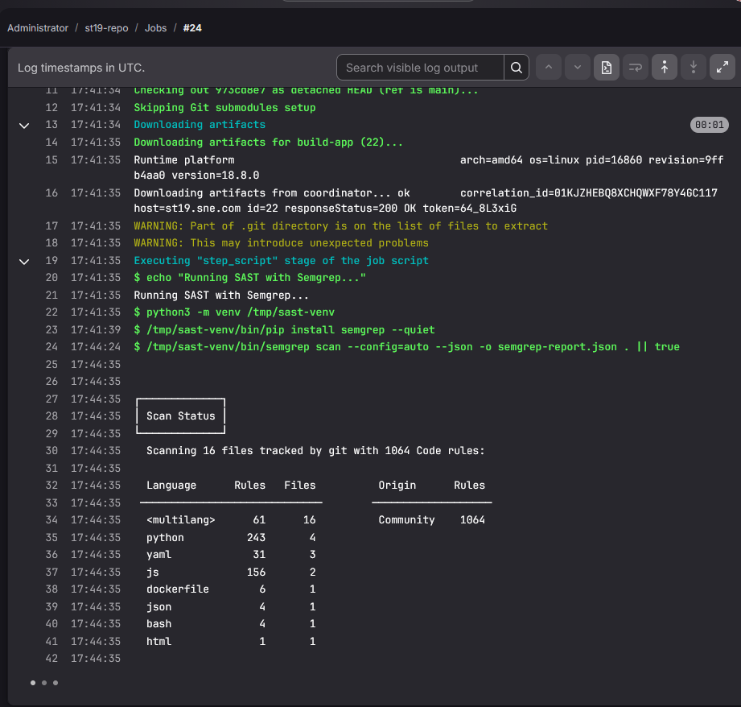

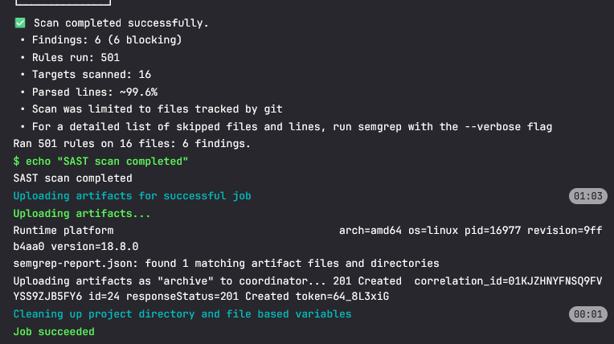

Figure 1.2 — SAST stage added to pipeline (result of a stage completed)

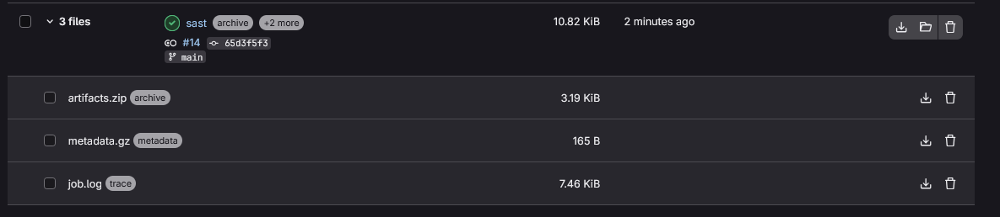

Figure 1.3 — SAST tool output: artifacts, content of a report (Semgrep)

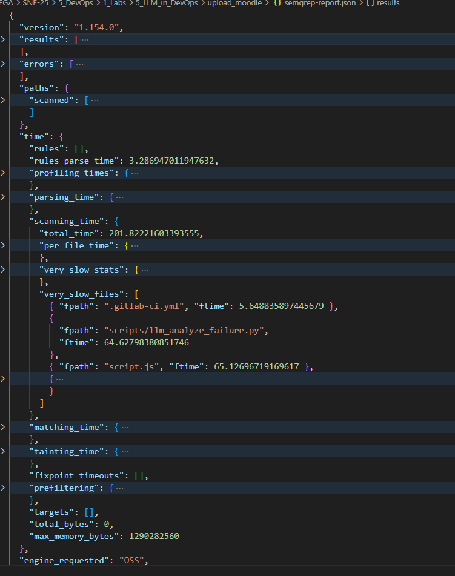

Figure 1.3.1 — SAST tool output: all content of the report (Semgrep)

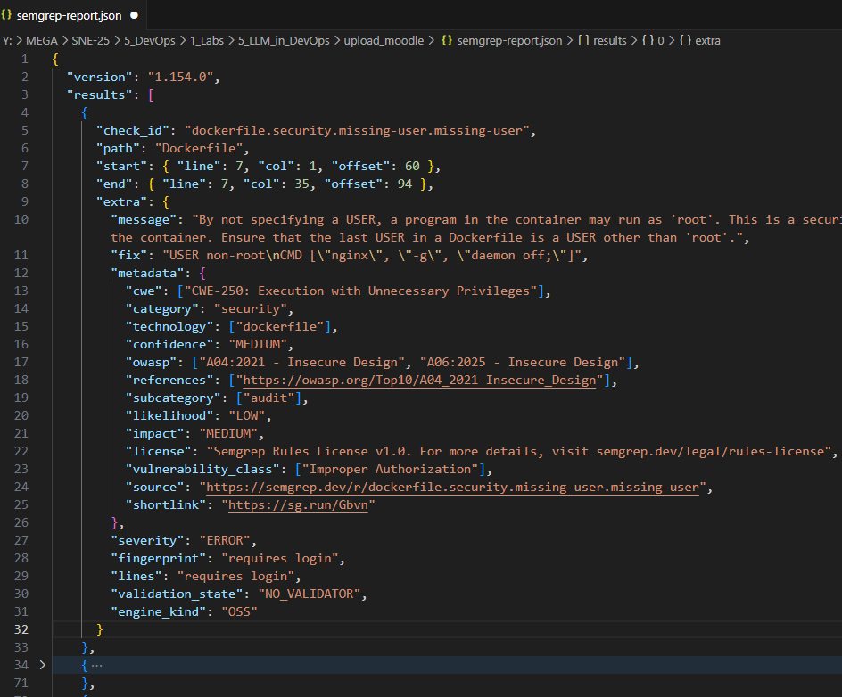

Figure 1.3.2 — SAST tool output: result fields in the report (Semgrep)

**K3S installation steps**

```bash
# 1. Install k3s
curl -sfL https://get.k3s.io | sh -

# 2. Verify
sudo k3s kubectl get nodes

# 3. Copy config
mkdir -p ~/.kube
sudo cp /etc/rancher/k3s/k3s.yaml ~/.kube/config
sudo chown $USER:$USER ~/.kube/config

# 4. Now kubectl works
kubectl cluster-info
kubectl get nodes

# 5. Access policy
sudo mkdir -p /home/gitlab-runner/.kube
sudo cp /etc/rancher/k3s/k3s.yaml /home/gitlab-runner/.kube/config
sudo chown -R gitlab-runner:gitlab-runner /home/gitlab-runner/.kube
```

**K8S PIPELINE STAGE**

```yaml
# CD Stage: Deploy to Kubernetes
deploy-k8s:
  stage: deploy
  tags:
    - st19-runner
  dependencies: []
  script:
    - echo "Deploying to Kubernetes..."
    - curl -LO "https://dl.k8s.io/release/$(curl -Ls https://dl.k8s.io/release/stable.txt)/bin/linux/amd64/kubectl"
    - chmod +x kubectl
    - mkdir -p $HOME/bin/
    - mv kubectl $HOME/bin/
    - export PATH="$HOME/bin:$PATH"
    - mkdir -p ~/.kube
    - echo "$KUBECONFIG_B64" | base64 -d > ~/.kube/config
    - kubectl apply -f k8s/
    - kubectl rollout status deployment/simple-pwa --timeout=120s
    - echo "Kubernetes deployment completed successfully!" 
  only:
    - main
```

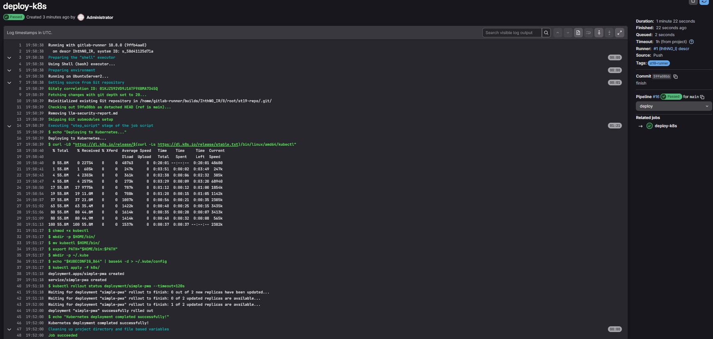

Figure 1.4 — Kubernetes deployment stage in pipeline

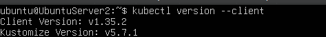

Figure 1.4.1 — Kubernetes and k3s installation


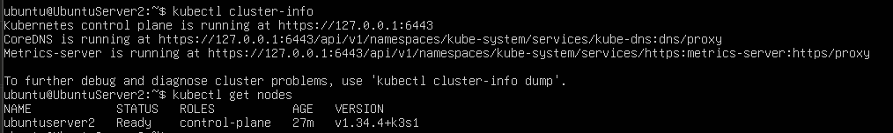

Figure 1.4.2 — Kubernetes and k3s finally running on VM2 runner machine

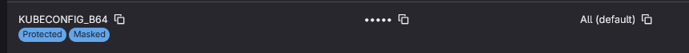

Figure 1.4.3 — K8S configuration environment variable added to CI/CD

---

# Task 2 — LLM Setup and Deployment

In this task, you will prepare an LLM that will later be used in the CI/CD pipeline.

1. Choose an external LLM API (Open Router Chat API (llama). Show how you obtained an API key and tested it locally using a simple prompt.
2. Add a new stage called `llm-review` to your existing CI/CD pipeline that will send application source code or pipeline configuration to the LLM and store the response as a pipeline artifact. Then show the updated pipeline stage.
3. Why should the LLM stage be placed after the build and test stages?

## ✍️ Execution

**Chosen LLM API: OpenRouter** (`https://openrouter.ai`). OpenRouter is an API gateway that provides access to many models — including `meta-llama/llama-3.1-8b-instruct` — through a single OpenAI-compatible endpoint. A free account was created at `openrouter.ai`, and an API key was generated in the dashboard under *Keys*. The key was stored as a GitLab CI/CD variable named `OPENROUTER_API_KEY` (masked, protected).

```bash
# Local API test example
curl https://api.openai.com/v1/chat/completions \
  -H "Authorization: Bearer $OPENROUTER_API_KEY" \
  -H "Content-Type: application/json" \
  -d '{
    "model": "gpt-4",
    "messages": [{"role": "user", "content": "Hello, describe this code: print(\"hello\")"}]
  }'
```

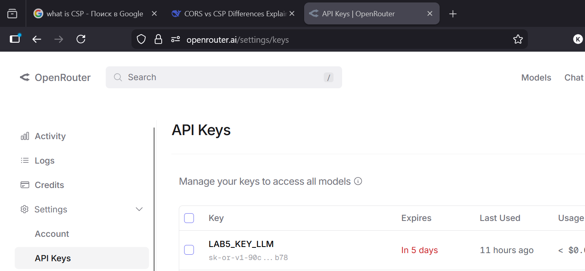

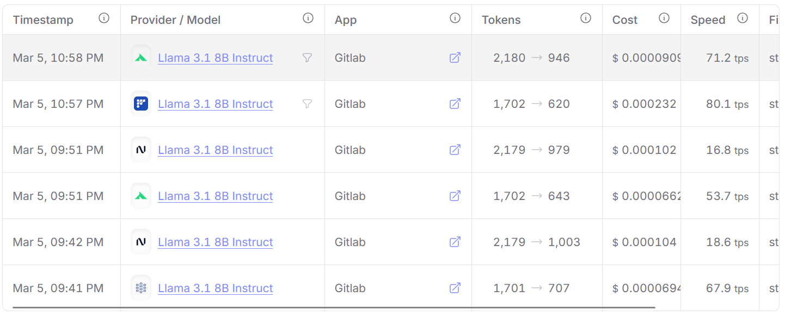

Figure 2.1 — API key obtained and logs from API Dashboard of successful test queries provided

The `llm-review` stage contains two parallel jobs. Both install `requests` via pip and invoke Python scripts that read the source files, build a prompt, call the OpenRouter API, and write a markdown artifact.

```yaml
# CI Stage 6a: LLM Code Review
llm-review:
  stage: llm-review
  tags:
    - st19-runner
  dependencies:
    - build-app
  script:
    - echo "Running LLM code review..."
    - python3 -m venv /tmp/llm-venv
    - /tmp/llm-venv/bin/pip install requests --quiet
    - /tmp/llm-venv/bin/python3 scripts/llm_review.py
    - echo "LLM review completed"
  artifacts:
    paths:
      - llm-review-report.md
    expire_in: 1 week
    when: always
  allow_failure: true
```

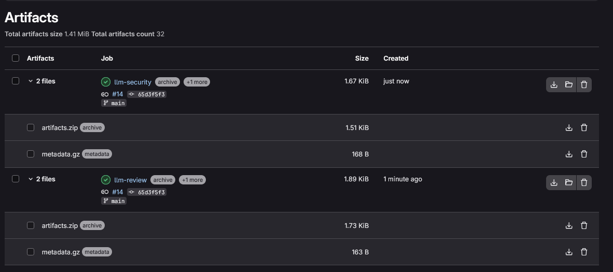

Figure 2.2 — llm-review and security artifacts proving that stage is added to pipeline configuration

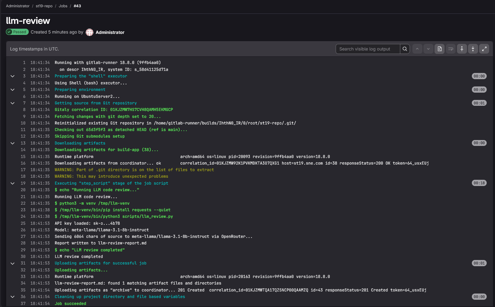

Figure 2.3 — Pipeline with llm-review stage running + logs from the llm-review stage

> **Q: Why should the LLM stage be placed after the build and test stages?**
>

The LLM stage is placed after build and test for three reasons. First, **fast feedback first**: build and test failures are cheap, quick to detect — if the code does not compile or basic tests fail, there is no point spending API credits and time on an LLM review. Second, **quality of input**: the LLM receives code, that already passed syntactic and functional validation, making the review more meaningful and focused on higher-level concerns rather than trivial errors. Third, **cost efficiency**: LLM API calls introduce latency and may have per-token costs, so that placing the stage late ensures it only runs on code that has passed the essential quality gates, avoiding unnecessary expense on broken commits.

---

# Task 3 — Testing and Validation

1. Trigger the pipeline and verify that the LLM stage runs successfully. Provide evidence from the pipeline logs and show the result of the artifact.
2. Does the LLM output correctly describe or explain the application or the pipeline? Briefly explain your observation.
3. How does the LLM output help a developer during CI/CD execution?

## ✍️ Execution

The pipeline was triggered by pushing a commit to the `main` branch. GitLab ran all seven stages sequentially (with `llm-review` and `llm-security` executing in parallel within the `llm-review` stage). Both LLM jobs completed with exit code 0. The artifacts `llm-review-report.md` and `llm-security-report.md` were produced and are downloadable from the pipeline artifacts panel.

The `llm_review.py` script reads SPA files, concatenates them into a prompt, and calls `model` via OpenRouter. The response is wrapped in a markdown template and saved as `llm-review-report.md`.

The `llm_security_review.py` script adds the `.gitlab-ci.yml` to the prompt and focuses the model on security, reliability, and trust, saving `llm-security-report.md`.

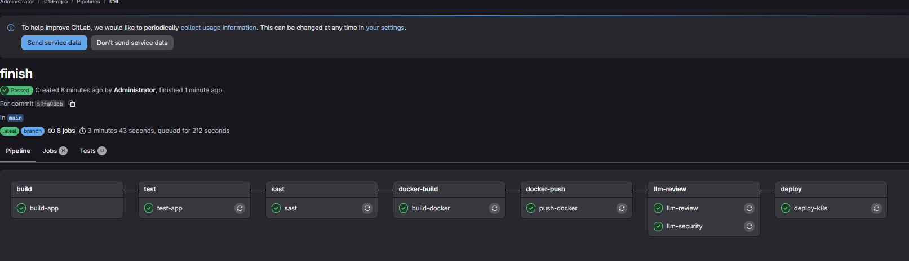

Figure 3.1 — Pipeline triggered, all stages including llm-review succeeded

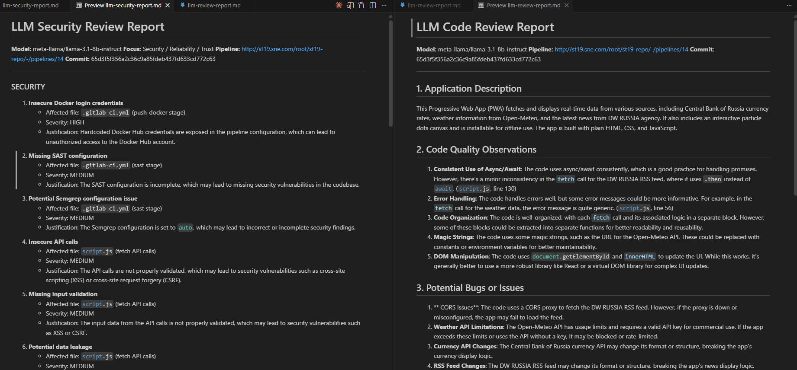

Figure 3.2 — LLM artifact output (llm-review.json and llm-security)

> **Q: Does the LLM output correctly describe or explain the application or the pipeline?**
>

Yes, in general. The model correctly identified the project as a Progressive Web App using a service worker for offline caching and a manifest for installability. The code quality observations were mostly accurate, but had some generals notes like add ARIA..

 The security section correctly noted the absence of a Content Security Policy header, though that is a server-side concern outside the scope of the client JS files reviewed.

> **Q: How does the LLM output help a developer during CI/CD execution?**
>

Convinience: read the report directly from the pipeline artifacts without waiting for a human reviewer.

Issues that static linters may miss, LLM handles.

Easier to onboard for non-tech.

Advisory information more.

---

# Task 4 — Security and Trust Analysis

1.. What security risks can arise when sending source code, logs or configurations to an LLM?

2a. Modify your current LLM prompt so that the model analyzes the CI/CD pipeline from a security, reliability, and trust perspective. The prompt should explicitly ask the LLM to identify potential risks, vulnerabilities, and failure points, and to justify its observations.

2b. Run the refined prompt, report the LLM's output, and critically assess which points you consider valid, questionable, or incorrect.

## ✍️ Execution

> **Q: What security risks can arise when sending source code, logs or configurations to an LLM?**
>
1. **IP leakage** — Code sent to external APIs leaves your control, regardless of provider promises.
2. **Credential exposure** — CI/CD configs often contain tokens, hostnames, or secrets that reveal attack surface.
3. **Compliance risk** — Regulations like GDPR or HIPAA may forbid sending code/logs to external services without proper agreements.
4. **Training on your data** — Some providers (especially free tiers) use submissions to improve models, potentially leaking proprietary logic.
5. **Hallucinations as trusted advice** — Auto-acting on LLM output risks false assurances; attackers can craft code that fools the model.
6. **Prompt injection** — Malicious content in dependencies or commits can manipulate LLM output.

The security-focused prompt used is implemented in `scripts/llm_security_review.py`. It sends both the CI/CD pipeline YAML and a subset of source files, then instructs the model to analyze from three perspectives:

```bash
You are a DevSecOps expert performing a security, reliability, and trust audit of a CI/CD pipeline and its application source code.

Analyze from THREE perspectives: SECURITY, RELIABILITY, and TRUST.

## CI/CD Pipeline Configuration

## Application Source Code (subset)
---

For each perspective provide a numbered list of findings. Each finding must include:
- A clear description of the risk
- The affected file/section
- Severity: LOW / MEDIUM / HIGH / CRITICAL
- Justification from the code

### SECURITY
Identify vulnerabilities, secrets exposure, injection risks, insecure API calls, hardcoded credentials, supply chain risks, and data leakage vectors.

### RELIABILITY
Identify single points of failure, missing retry logic, no health checks, pipeline steps without error handling, timeout risks, and missing rollback strategies.

### TRUST
Assess trustworthiness of LLM-generated output in this pipeline. Can LLM output be blindly trusted? What are risks of acting on LLM advice in automated workflows?

### SUMMARY TABLE
| Finding # | Perspective | Severity | One-line description |

Be specific, reference exact file names. Flag speculative findings with "(speculative)".
```

**Security stage**

```yaml
# CI Stage 6b: LLM Security Review (parallel with llm-review)
llm-security:
  stage: llm-review
  tags:
    - st19-runner
  dependencies:
    - build-app
  script:
    - echo "Running LLM security review..."
    - python3 -m venv /tmp/llm-s-venv
    - /tmp/llm-s-venv/bin/pip install requests --quiet
    - /tmp/llm-venv/bin/python3 scripts/llm_security_review.py
    - echo "LLM security review completed"
  artifacts:
    paths:
      - llm-security-report.md
    expire_in: 1 week
    when: always
  allow_failure: true
```

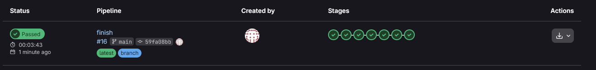

Figure 4.1 — All stages successful pipeline.
