# Final Project

Name of report: Final_Project_DevSecOps
Course: DevOps and Security S26
Performed by Roman Solovev, Salekh Mamadaliev, Nikita Niakhai — M25-SNE-01
Date submission: 16.03.2026
Video Demo: [Link](https://drive.google.com/drive/folders/1s-k67JRx-Jmlv-OSL_vvzPehKTc3vNH9?usp=sharing)
Video Demo (backup): [Link](https://drive.google.com/file/d/1JopM22CGU-YA4CZQDMkdAW4TObc8JTeO/view?usp=sharing)

---

# 1. Introduction

**Abstract:**

This project presents an AI-powered DevSecOps platform that integrates a large language model into a self-hosted GitLab CI/CD pipeline for automated code security review and interactive bot-assisted analysis. The system is deployed on a single hardened VPS using Docker for GitLab CE and Minikube for Kubernetes orchestration of the AI bot service, with Caddy as reverse proxy and HAProxy for load balancing. The result is a working end-to-end solution where every code commit is automatically scanned for vulnerabilities by the LLM, and developers can also request AI feedback directly through GitLab slash commands.

**Keywords:** CI/CD, DevSecOps, Kubernetes, Docker, GitLab, LLM, AI, Reverse Proxy, Security, Automation

---

# 2. Project Overview

The project focuses on CI/CD convenience through an AI-powered web service deeply integrated into a GitLab-based DevSecOps pipeline. It combines a self-hosted GitLab CE instance, a Kubernetes-orchestrated runner and bot (Uvicorn web-server) infrastructure, and LLM-based code analysis into a single cohesive system running on a hardened VPS. The platform enables automated AI security reviews during CI/CD pipeline execution and interactive AI-assisted code review via slash commands in GitLab commits.

## 2.1 Goals and Motivation

The main goal is to reduce the manual effort and delay involved in code security reviews by embedding an LLM directly into the CI/CD workflow, so developers receive immediate, automated feedback on vulnerabilities and code quality with every commit. Traditional security review processes often happen late in the development cycle or require dedicated personnel, creating bottlenecks — this project addresses that by making AI-driven analysis a native pipeline stage and an on-demand bot accessible through GitLab comments. The project also demonstrates a fully self-hosted, infrastructure-aware DevSecOps setup with proper server hardening, container orchestration, reverse proxying, and load balancing, delivering practical value as both a security tool and a reference architecture for small-team DevOps environments.

## 2.2 Technology Stack

*List and briefly describe each technology used.*

| **Category** | **Technology** | **Purpose** |
| --- | --- | --- |
| CI/CD | GitLab CE | Pipeline orchestration and source control |
| Containerization | Docker | Application and service packaging |
| Orchestration | Minikube / kubectl | Local Kubernetes cluster management |
| Reverse Proxy | Caddy | HTTPS routing to internal services |
| Load Balancer | HAProxy | Traffic distribution to the AI bot |
| AI / LLM | Openrouter API + GItlab API + Gitlab webhooks | Code review, pipeline analysis, bot commands |
| Security | Fail2ban, UFW, SSH hardening | Server-level protection |

## ✍️ Notes

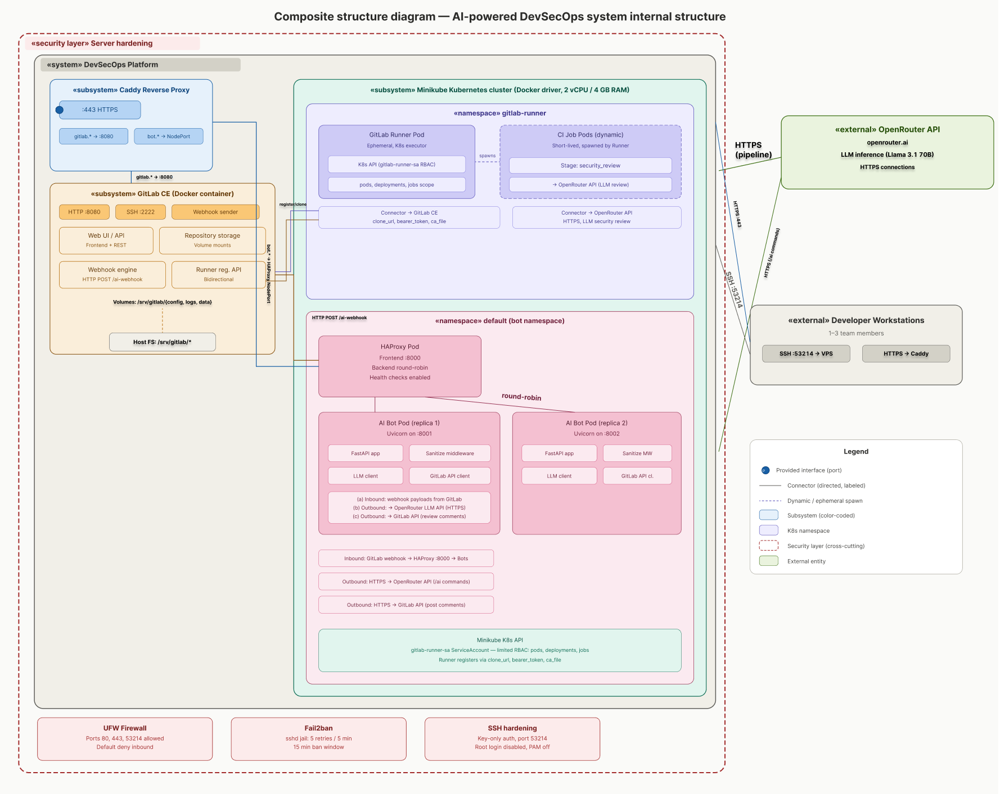

Figure 2.1 — Composite structure UML diagram

**Composite Structure Diagram:** The diagram shows a top-level "DevSecOps Platform" block containing Caddy (HTTPS :443 facing outward), a GitLab CE Docker container (with Web UI, Repository, and Webhook Engine sub-parts plus volume mount connectors), and a Minikube Cluster subdivided into "gitlab-runner" namespace (Runner + ephemeral CI Job pods) and "default" namespace (HAProxy round-robin to two AI Bot pods), all wrapped in a UFW/Fail2ban/SSH hardening boundary. External actors — Developer Workstations, OpenRouter API, Let's Encrypt, and nip.io — sit outside the system boundary, with connectors going to/from the AI Bot pods (OpenRouter, GitLab API), CI Job pods (OpenRouter), and Caddy (developers).

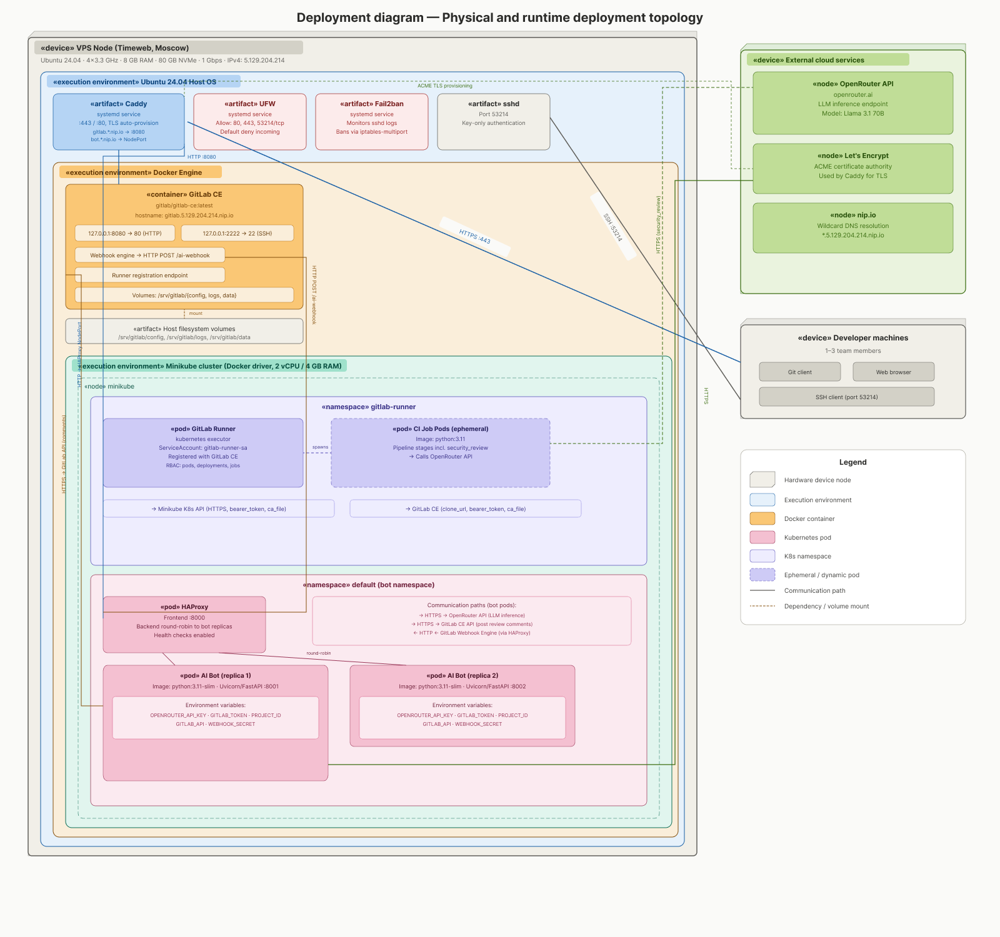

Figure 2.2 — Deployment UML diagram

**Deployment Diagram:** The diagram shows a single "VPS" hardware node hosting Caddy (:443), UFW, Fail2ban, and sshd (:53214) at the OS level, a Docker Engine containing the GitLab CE container (localhost:8080/2222 with volume dependency arrows to /srv/gitlab/*), and a nested Minikube node (2 vCPU / 4 GB) with GitLab Runner pods in "gitlab-runner" namespace and HAProxy + three AI Bot replica pods in "lb-demo" namespace. Communication paths labeled by protocol/port connect external Developer Machines (SSH :53214, HTTPS :443) into the VPS, Caddy to GitLab and Minikube's HAProxy internally, and Bot/CI pods outward to external cloud nodes (OpenRouter API, Let's Encrypt, nip.io).

---

# 3. Architecture Model

The project runs on a **VPS** accessed via SSH with key-based authentication. All services are deployed either directly in Docker or inside a Minikube Kubernetes cluster on the same host.

## 3.1 Infrastructure Setup

- VPS provider Timeweb
- Price: 1800 RUB / month
- Location: Russia, Moscow
- OS: Ubuntu 24.04
- 4 x 3.3 GH CPU • 8 GB RAM • 80 GB of space NVMe
- Internet configuration: throughput 1000 mb/s, public IPV4 address, nio free reverse domain name for securing https connection

## 3.2 Keys and access to VPS

`root` user is only available from any other user inside VPS, root login is permitted. One user `project` is granted with all required access privileges and ability to switch on root user.

## ✍️ Execution

```bash
# Example: SSH key setup
ssh-keygen -t ed25519 -C "devops-final"
ssh-copy-id -i ~/.ssh/id_ed25519.pub user@vps-ip
```

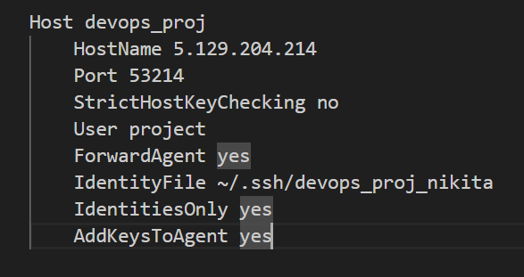

Figure 3.2 — SSH access and key configuration on developer’s machine


Figure 3.2 — Authorized keys for accessing VPS via `ssh` for developers

---

# 4. Server Security

The server is hardened using several complementary tools: **Fail2ban** for brute-force protection, **UFW** as a firewall, and **SSH hardening** to restrict access vectors.

## 4.1 SSH Hardening

Custom configuration for SSH service were added:

- changed default 22 port to 53214;
- disabled root login;
- disabled password authentication;
- disabled PAM;
- only Public key authentication is available.

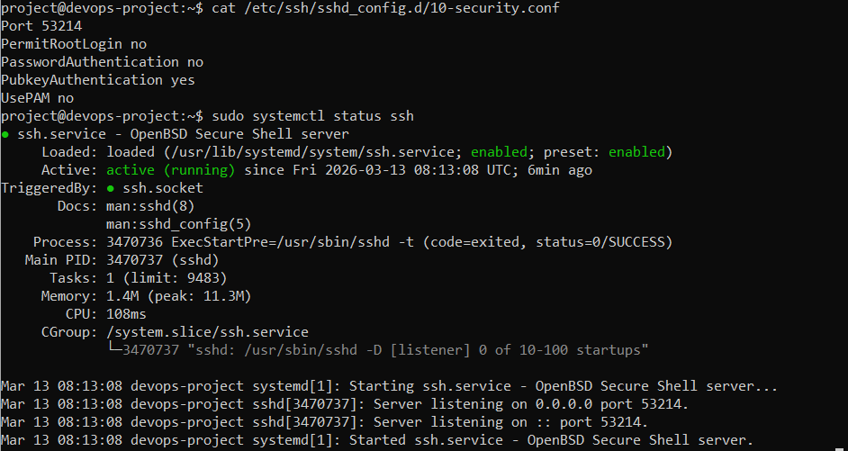

Figure 4.1 — Status of hardened SSH service

Checking that password authentication is indeed disabled:

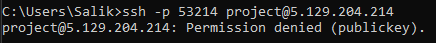

Figure 4.2 — Checking password authentication

## 4.2 UFW Firewall Rules

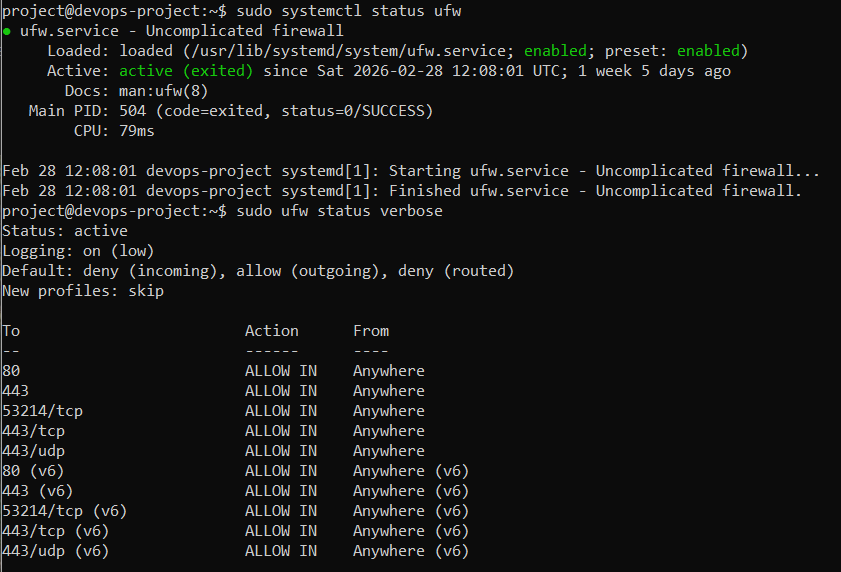

Figure 4.3 — UFW service

We can check open ports on machine using nmapX on other host. Used kali machine for this:

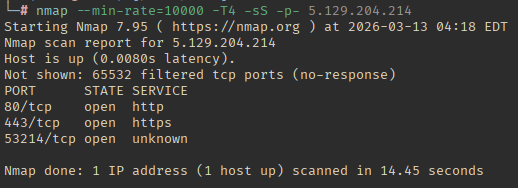

Figure 4.4 — nmap scan of the cloud machine

## 4.3 Fail2ban Configuration

Fail2ban is configured via /etc/fail2ban/jail.local with the following global parameters in the [DEFAULT] section:

- "bantime = 900" — an offending IP address will be banned for 900 seconds (15 minutes) upon triggering the threshold;
- "findtime = 300" — the time window within which failed attempts are counted is 300 seconds (5 minutes);
- "maxretry = 5" — IP address is banned after 5 consecutive failed authentication attempts within the time window;
- "banaction = iptables-multiport" — banning is enforced via iptables, blocking the IP across multiple ports simultaneously.

The SSH jail is explicitly enabled and configured with the following parameters:

- "enabled = true" — SSH jail is active and monitoring for failed authentication attempts;
- "port = 53214" — Fail2ban monitors and applies bans on the custom SSH port 53214;
- "filter = sshd" — uses the built-in sshd filter to parse SSH-related log entries;
- "logpath = %(sshd_log)s" — log file path from the system default SSH log location;
- "backend = %(sshd_backend)s" — log monitoring backend is inherited from system defaults;
- maxretry = 5 — Overrides (though matches) the global default, banning an IP after 5 failed attempts.

The remaining parameters (bantime, findtime) are inherited from the [DEFAULT] section.
"[DEFAULT]" section settings apply globally to all enabled jails. The configuration ensures that any IP exceeding 5 failed login attempts within a 5-minute period is automatically blocked for 15 minutes at the firewall level, mitigating brute-force attacks.

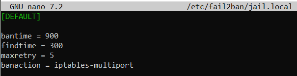

Figure 4.5 — Fail2ban configuration “DEFAULT” section

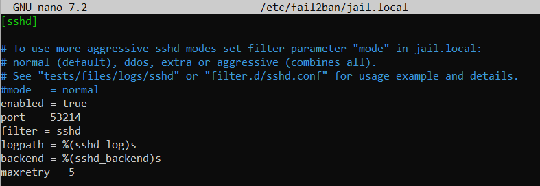

Figure 4.5 — Fail2ban configuration “sshd” jail section

We can check status of fail2ban and block ip list using command: fail2ban-client status. As we are already hardened SSH service, there’s no active brute force attempts from the scanners on the internet.

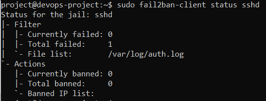

Figure 4.6 — Fail2ban status

---

# 5. Containerization and Orchestration

**GitLab CE** runs inside a Docker container on the VPS. The **GitLab Runner** is deployed inside Minikube (Kubernetes) in a dedicated namespace with a scoped access policy, providing isolation between the runner and other cluster workloads.

## 5.1 GitLab CE in Docker

Community edition of Gitlab is running as a standalone container on the machine, configured to serve UI via a `gitlab.`-prefixed [nip.io](http://nip.io) hostname. Interface and ssh ports are binded to local ports to be later proxied by Caddy outside. Config and log volumes are mapped to preserve all the important data between restarts.

- **Hostname configuration**: Sets the container hostname to `gitlab.5.129.204.214.nip.io`
- **Port mapping**:
    - Binds host port 8080 (localhost only) to container port 80 for HTTP access
    - Binds host port 2222 (localhost only) to container port 22 for SSH access
- **Volume mounts** (persistent data storage):
    - `/srv/gitlab/config:/etc/gitlab` - GitLab configuration files
    - `/srv/gitlab/logs:/var/log/gitlab` - GitLab log files
    - `/srv/gitlab/data:/var/opt/gitlab` - GitLab application data
- **Image**: Uses the latest GitLab Community Edition image from Docker Hub

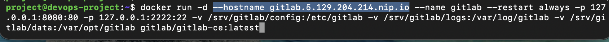

Figure 5.1 — Command for running Gitlab Server

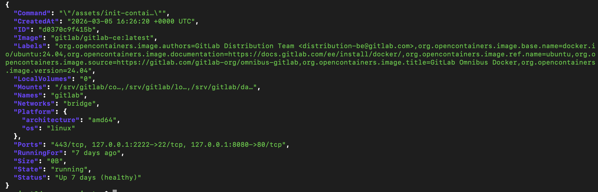

Figure 5.2 — GitLab CE running in Docker (docker ps output)

## 5.2 Minikube Cluster Setup

No extra configurations or plugins (except kubectl) were added to bare minikube setup, it was started with docker as a virtualization driver, 2vCPU/4GBRAM resource limit.

- **Driver specification (`-driver=docker`)**: Configures Minikube to use Docker as the underlying virtualization driver, running Kubernetes nodes as Docker containers
- **CPU allocation (`-cpus=2`)**: Allocates 2 CPU cores to the Minikube virtual machine/container for cluster operations
- **Memory allocation (`-memory=4g`)**: Assigns 4 gigabytes of RAM to the Minikube instance to ensure adequate resources for running Kubernetes components and applications

```bash
# Minikube init
minikube start --driver=docker --cpus=2 --memory=4g
```

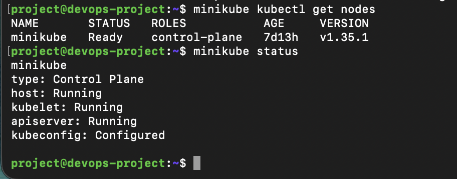

Figure 5.3 — Minikube running + node status

## 5.3 GitLab Runner in Kubernetes

Gitlab runner is registered and configured as a k8s executor, meaning for each job, a separate short-living pod is launched and runs untill the job is finished (Figure 5.5).

To separate the “service” pods - our gitlab runs, and other useful workload, all gitlab-related operations and configurations are moved to a separate namespace `gitlab-runner`. Runner is instructed to assume the service account with limited pods/deployment/jobs permissions to manage job pods mentioned above (Figure 5.4). Other resources and any resource outside of its namespace is inaccessible.

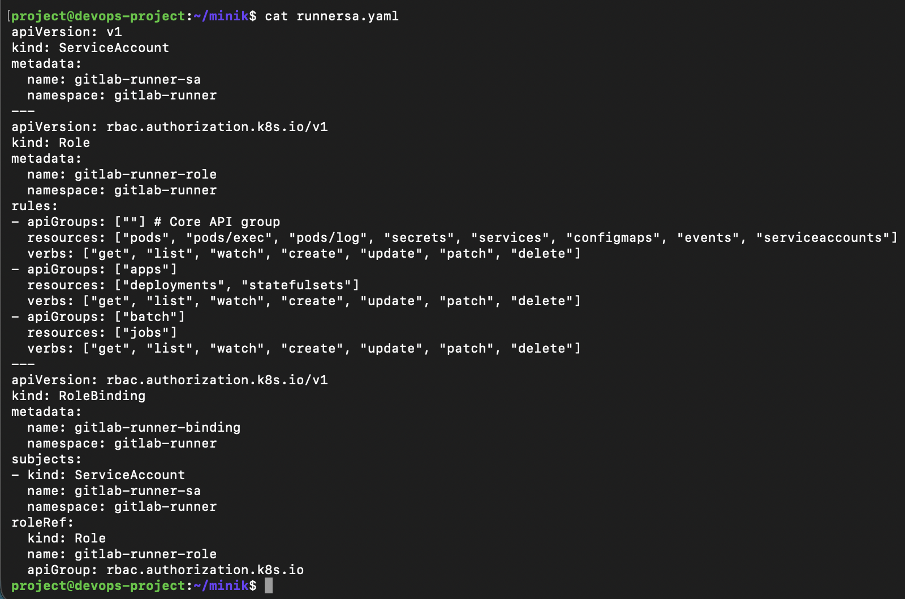

Figure 5.4 — k8s Service Account for gitlab runner

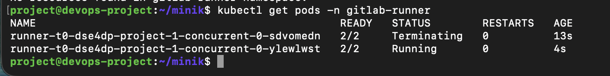

Figure 5.5 — Runner pods launched on pipeline job runs

As mentioned above, gitlab runner assumes the `gitlab-runner-sa` Service Account, which is configured in its configuration toml file created and edited on runner registration on the server (Figure 5.7)

Configuration toml (Figure 5.6) also includes other keys and crutial configurations for launching the pods and managing the server - k8s executor integration:

| Attribute | Description |
| --- | --- |
| **`url`** | The full URL of the GitLab instance where the runner is registered |
| **`token`** | The unique authentication token used by the runner to authenticate with the GitLab instance |
| **`executor`** | The environment in which each CI/CD job runs - k8s (minikube) |
| **`clone_url`** | URL used by the runner to clone the repository - alternative, reachable address |
| **`bearer_token`** | A bearer token for the Kubernetes executor to allow the runner to talk to the Kubernetes API |
| **`ca_file`**  | The file path to a custom Certificate Authority (CA) certificate (cluster cert) |
| **`namespace`** | Defines the Kubernetes namespace where new pods for CI/CD jobs will be created |
| **`service_account`** | Specifies the Kubernetes service account that the runner's job pods will use to authenticate with the Kubernetes API, granting them specific permissions |

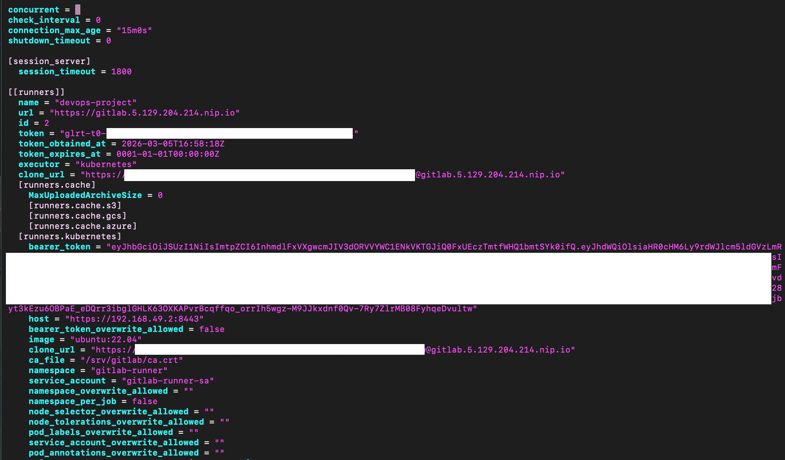

Figure 5.6 — Runner configuration toml file

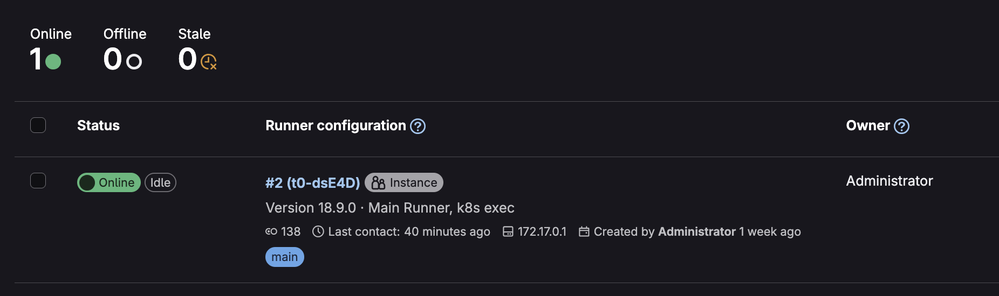

Figure 5.7 — Runner registered and active in GitLab UI

---

# 6. Reverse Proxy Configuration

**Caddy** acts as the entry point for all external HTTPS traffic, routing requests between the internet and internal services — GitLab and the AI bot.

## 6.1 Caddy Setup

Caddy was installed as a service and provided with a minimal configuration to route traffic to gitlab container and minikube, where load balancing is performed with other more “configured” tools:

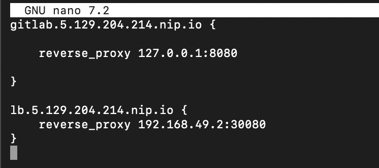

Figure 6.1 — Caddyfile configuration

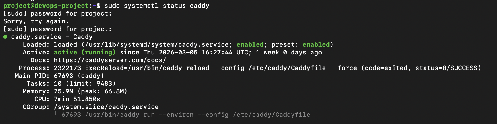

Figure 6.2 — Caddy service

## 6.2 TLS / HTTPS

Caddy also has Automatic HTTPS capability that handles SSL/TLS certificate provisioning and renewal via Let's Encrypt without manual intervention, paired with [nip.io](http://nip.io) - a wildcard DNS service that maps any IP address in a domain name (e.g., `gitlab.5.129.204.214.nip.io` resolves to `5.129.204.214`), eliminating the need for custom domain configuration or local DNS entries results in a simplistic and effective HTTPS+DNS setup

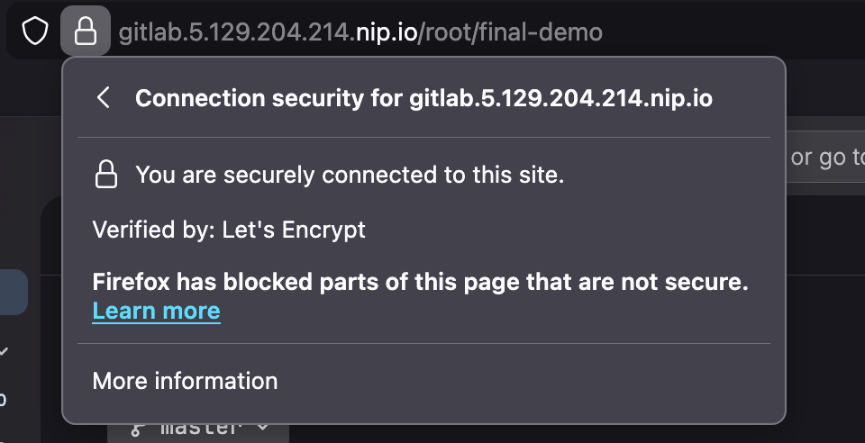

Figure 6.3— HTTPS working for GitLab via Caddy

---

# 7. LLM Integration into CI/CD Pipeline

The LLM is integrated as a dedicated `llm-review` stage in the GitLab CI/CD pipeline. It receives application source code or pipeline configuration and returns structured analysis covering code quality, security issues, and improvement suggestions.

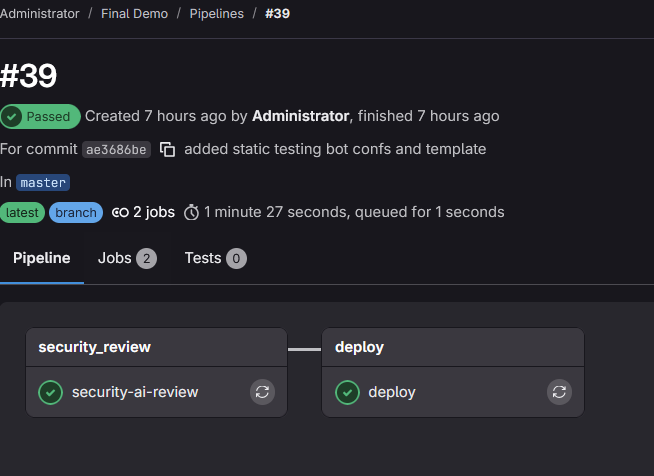

Figure 7.1 — CI/CD pipeline with a llm-security-review stage

## 7.1 Prompt Design

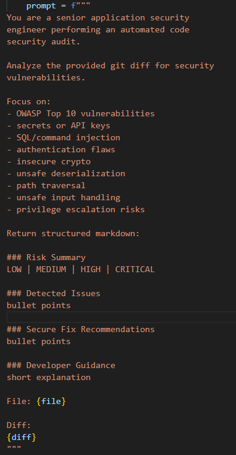

Figure 7.1 — CI/CD LLM prompt for security review

## 7.2 LLM API and Engine

Openrouter API was chosen because it provides free API key, variety of LLMs, auto-decision on the engine. Important to note that Openrouter has great documentation and pleasant UI to work with the engine.

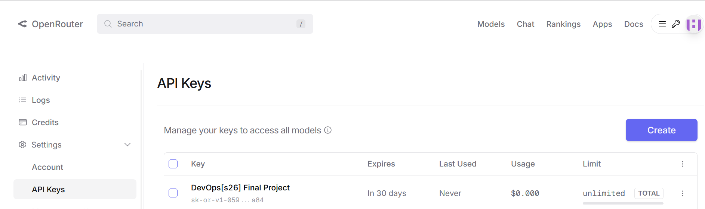

Figure 7.1 — OpenRouter API key setup

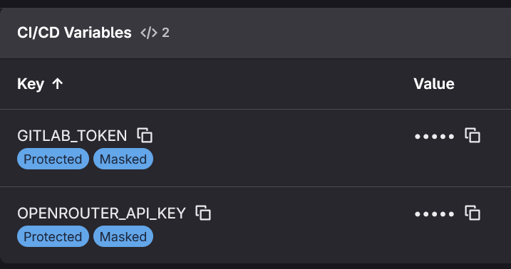

Figure 7.1 — Environment variables used for LLM features triggered on CI/CD pipeline

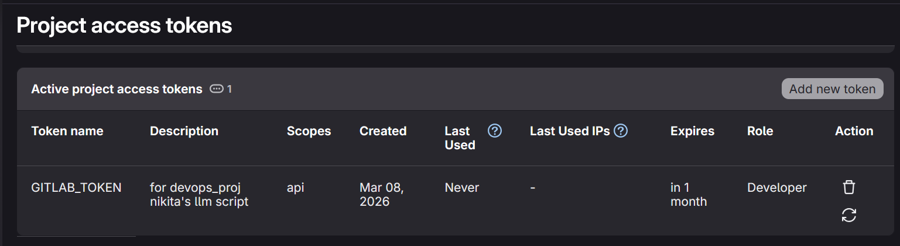

Figure 7.1 — Gitlab token foy python script used for LLM features triggered on CI/CD pipeline

## 7.3 Security Review Capabilities

The LLM is asked to scan git diffs for OWASP Top 10 vulnerabilities including SQL injection, command injection, path traversal, unsafe deserialization, and insecure cryptographic usage, along with detecting hardcoded secrets, API keys, and authentication flaws. It checks for unsafe input handling, privilege escalation risks, and insecure configurations that could appear in any committed code changes across infrastructure or application files. Each finding is classified by severity as LOW, MEDIUM, HIGH, or CRITICAL, with structured output providing detected issues, secure fix recommendations, and developer guidance.

## ✍️ Execution

*Here are the pipeline stage configuration and LLM outputs.* `.gitlab-ci.yml`

```yaml
# .gitlab-ci.yml — llm-review stage
stages:
  ...
  - security_review
  ...

security-ai-review:
	stage: security_review
	image: python:3.11
	before_script:
		- pip install requests
		- apt-get update
		- apt-get install -y git
	script:
		- python ai_security_review.py
```

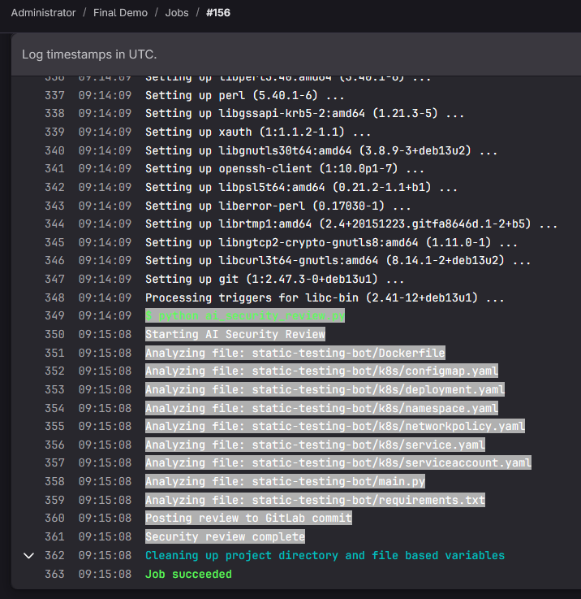

Figure 7.1 — llm-review stage in GitLab CI pipeline

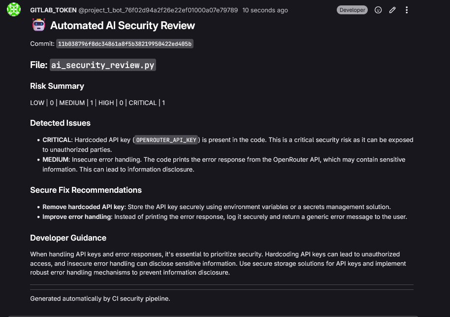

Figure 7.2 — LLM artifact output (security and code review report)

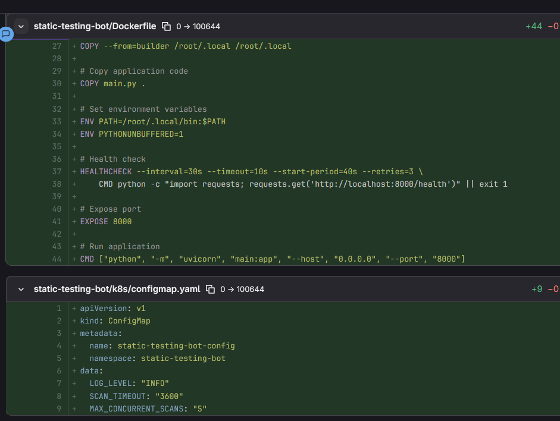

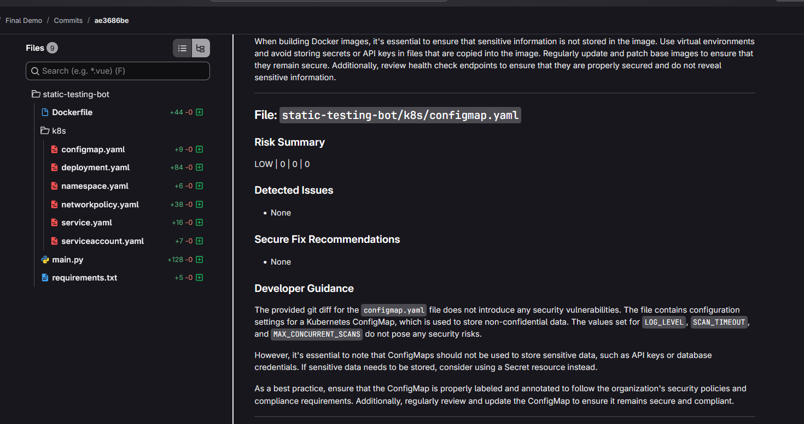

Figure 7.3 — LLM security review on a Kubernetes configmap and dockerfile (up).

---

# 8. AI GitLab Bot — Web Service

The AI bot is a **Uvicorn-based Python web server** that integrates with GitLab via webhooks. It listens for slash commands posted in commits and responds with LLM-powered analysis.

## 8.1 Web Server Architecture

Uvicorn set on [localhost](http://localhost) inside k8s minikube in a few nodes. Port 8000 is used. Python 3.11-slim is used fot light installation.

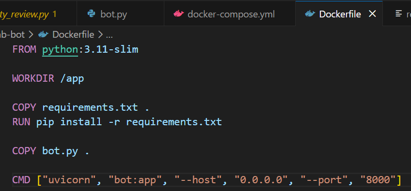

Figure 8.1 — Dockerfile configuration for uvicorn server.

## 8.2 Bot Commands

The bot supports the following commands:

| **Command** | **Description** |
| --- | --- |
| `/ai explain` | Reviews Terraform, Kubernetes manifests, and IaC scripts for insecure settings or open ports |
| `/ai "how's production?"` | Returns a summary of the current deployment health and recent pipeline status |

## 8.3 GitLab Webhook Integration

The GitLab webhook is configured to send event payloads to the bot's `/ai-webhook` POST endpoint, with a secret token set via `X-Gitlab-Token` header that the bot compares against its `WEBHOOK_SECRET` environment variable. If the secret matches the bot proceeds to process the event, and if it doesn't match the bot returns an "unauthorized" status, though it notably returns HTTP 200 rather than a 401/403 status code.

## ✍️ Execution

*Bellow is the bot code structure, webhook config.*

```python
"""
AI Security Bot — Code Skeleton / Template
Shows all main components: config, helpers, middleware, endpoint.
"""

from fastapi import FastAPI, Request
import os, re, socket, requests

app = FastAPI()

# ── Config ──────────────────────────────────────────────
OPENROUTER_API_KEY = os.environ["OPENROUTER_API_KEY"]
GITLAB_TOKEN       = os.environ["GITLAB_TOKEN"]
PROJECT_ID         = os.environ["PROJECT_ID"]
GITLAB_API         = os.environ["GITLAB_API"]
WEBHOOK_SECRET     = os.environ.get("WEBHOOK_SECRET", "")
HOSTNAME           = socket.gethostname()
AI_MODEL           = "meta-llama/llama-3.1-70b-instruct"
MAX_PROMPT         = 5000

# ── Helpers ─────────────────────────────────────────────
def sanitize(text: str) -> str:
    """Strip secrets/keys/passwords from text before sending to LLM."""
    # ... regex redaction, then truncate to MAX_PROMPT ...
    return text[:MAX_PROMPT]

def ask_llm(prompt: str) -> str:
    """Send sanitized prompt to OpenRouter and return LLM response."""
    # ... POST to openrouter.ai/api/v1/chat/completions ...
    # ... headers: Authorization, Content-Type, HTTP-Referer, X-Title ...
    # ... body: model, messages, temperature=0.2, max_tokens=1200 ...
    # ... fail safely on error, never leak secrets ...
    return "LLM response"

def get_commit_diff(commit: str) -> str:
    """Fetch diff for a commit from GitLab API."""
    # ... GET {GITLAB_API}/projects/{PROJECT_ID}/repository/commits/{commit}/diff ...
    # ... concatenate file paths + diffs, truncate to MAX_PROMPT ...
    return "diff text"

def post_reply(commit: str, discussion_id: str, text: str) -> None:
    """Post a note back to a GitLab commit discussion."""
    # ... POST {GITLAB_API}/projects/{PROJECT_ID}/.../discussions/{id}/notes ...
    pass

# ── Middleware ──────────────────────────────────────────
@app.middleware("http")
async def add_hostname_header(request: Request, call_next):
    """Attach X-Served-By header to every response."""
    response = await call_next(request)
    response.headers["X-Served-By"] = HOSTNAME
    return response

# ── Webhook Endpoint ───────────────────────────────────
@app.post("/ai-webhook")
async def webhook(req: Request):
    """Main entry point: receives GitLab note events, runs AI, replies."""
    # 1. Verify WEBHOOK_SECRET via X-Gitlab-Token header
    # 2. Ignore non-"note" events
    # 3. Ignore notes not starting with "/ai"
    # 4. Extract commit ID from payload
    # 5. Build prompt (user command or default "explain")
    # 6. Fetch diff → ask LLM → post reply back to GitLab
    return {"status": "ok"}
```

As bot is served in Minikube on port 30080, it only accessible locally via minikube address. So we need to use proxy to forward external requests to minikube pods:

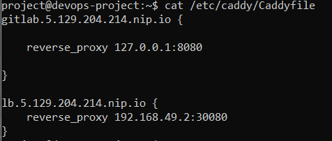

Figure 8.1 — Caddy proxy configuration

Pods itself are running in minikube:

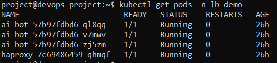

Figure 8.2 — Running pods

Webhook configuration in project settings which allows bot answer directly in commit comments:

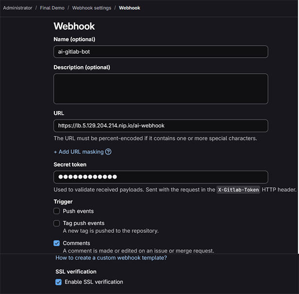

Figure 8.3 — GitLab webhook configuration

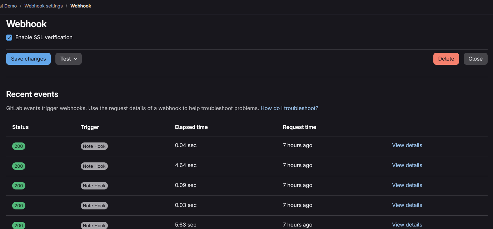

Figure 8.4 — Webhook logs of payloads

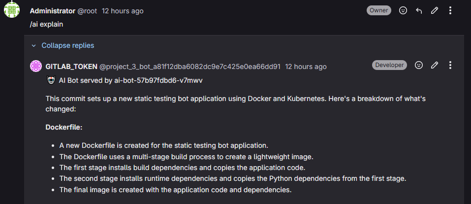

Figure 8.5 — /ai explain command triggered in GitLab MR

---

# 9. Deployment

The AI GitLab Bot is deployed behind **HAProxy** as a load balancer, distributing traffic across multiple Uvicorn worker instances for availability and performance.

All resources are deployed in a dedicated namespace “lb-demo”, which isolates the load balancing demo from other workloads in the cluster.

FInal pipeline configuration that deploys haproy and ai-bot pods with security review:

```yaml
stages:
  - security_review
  - deploy

security-ai-review:
  stage: security_review
  image: python:3.11-slim
  before_script:
    - pip install requests
    - apt-get update
    - apt-get install -y git
  script:
    - python ai_security_review.py

deploy:
  stage: deploy
  image: bitnami/kubectl:latest
  script:
    - kubectl apply -f k8s/namespace.yaml
    - kubectl apply -f k8s/bot.yaml
    - kubectl apply -f k8s/haproxy.yaml
    - kubectl rollout restart deployment/haproxy -n lb-demo
    - kubectl rollout status deployment/ai-bot -n lb-demo --timeout=60s
    - kubectl rollout status deployment/haproxy -n lb-demo --timeout=60s

  only:
    - master
```

## 9.1 HAProxy Load Balancer

ConfigMap haproxy-config stores the HAProxy configuration file. The configuration defines:

- HTTP mode with sensible timeouts (connect 5s, client 30s, server 30s);
- “option forwardfor” to preserve the original client IP;
- a single frontend bound to port 80 that routes all traffic to the ai-bot backend;
- round-robin load balancing algorithm, which distributes requests evenly across all available backend pods;
- active health checks (check) on each backend server — HAProxy automatically removes unhealthy pods from rotation and restores them when they recover

Deployment haproxy runs a single HAProxy pod using the official haproxy:alpine image. The configuration file is mounted from the ConfigMap via a volume, which allows updating the configuration without rebuilding the image.
Service haproxy exposes HAProxy externally via NodePort 30080, making the application accessible from outside the Minikube cluster at Minikube address http://192.168.49.2:30080. Internally it listens on port 80.
HAProxy distributes incoming requests across the three bot replicas using round-robin. Each response includes the “X-Served-By” header with the pod name, providing a clear visual proof that load balancing is working.

haproxy deployment configuration:

```yaml
---
apiVersion: v1
kind: ConfigMap
metadata:
  name: haproxy-config
  namespace: lb-demo
data:
  haproxy.cfg: |
    global
      log stdout local0 info

    defaults
      mode http
      timeout connect 5s
      timeout client  30s
      timeout server  30s
      option forwardfor
      option httplog
      log global

    frontend http
      bind *:80
      default_backend ai-bot

    backend ai-bot
      balance roundrobin
      server-template ai-bot 3 ai-bot-headless.lb-demo.svc.cluster.local:8000 check resolvers k8sdns resolve-prefer ipv4 init-addr none
    resolvers k8sdns
      nameserver dns1 kube-dns.kube-system.svc.cluster.local:53
      accepted_payload_size 8192
      hold valid 5s

---
apiVersion: apps/v1
kind: Deployment
metadata:
  name: haproxy
  namespace: lb-demo
spec:
  replicas: 1
  selector:
    matchLabels:
      app: haproxy
  template:
    metadata:
      labels:
        app: haproxy
    spec:
      containers:
        - name: haproxy
          image: haproxy:alpine
          ports:
            - containerPort: 80
          volumeMounts:
            - name: config
              mountPath: /usr/local/etc/haproxy/haproxy.cfg
              subPath: haproxy.cfg
      volumes:
        - name: config
          configMap:
            name: haproxy-config

---
apiVersion: v1
kind: Service
metadata:
  name: haproxy
  namespace: lb-demo
spec:
  type: NodePort
  selector:
    app: haproxy
  ports:
    - port: 80
      targetPort: 80
      nodePort: 30080
```

## 9.2 Bot Deployment

Deployment ai-bot runs 3 replicas of the AI GitLab bot, built from a custom Docker image ai-gitlab-bot:latest. Key configuration points:

- imagePullPolicy: Never instructs Kubernetes to use the locally built image inside Minikube rather than pulling from a registry;
- all sensitive configuration (API keys, tokens) is injected via envFrom referencing a Kubernetes Secret ai-bot-secret, keeping credentials out of the image and the repository;
- the application listens on port 8000 (uvicorn/FastAPI);
- each pod exposes its own hostname via the X-Served-By response header, making it possible to observe which pod handled each request.

Service ai-bot is a ClusterIP service (internal only) that load balances traffic across all 3 bot replicas on port 8000. HAProxy uses this service as its backend target.

ai-bot deployment configuration:

```yaml
---
apiVersion: apps/v1
kind: Deployment
metadata:
  name: ai-bot
  namespace: lb-demo
spec:
  replicas: 3
  selector:
    matchLabels:
      app: ai-bot
  template:
    metadata:
      labels:
        app: ai-bot
    spec:
      containers:
        - name: ai-bot
          image: ai-gitlab-bot:latest
          imagePullPolicy: Never
          ports:
            - containerPort: 8000
          envFrom:
            - secretRef:
                name: ai-bot-secret
---
apiVersion: v1
kind: Service
metadata:
  name: ai-bot-headless
  namespace: lb-demo
spec:
  clusterIP: None
  selector:
    app: ai-bot
  ports:
    - port: 8000
      targetPort: 8000
```

## 9.3 Proof of Concept

Checking running pods and services:

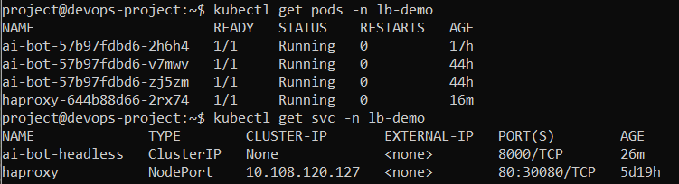

Figure 10.1 — Running pods and services

Making sure that load balancing is working, by recieving different “X-Sever-By” header value for different requests:

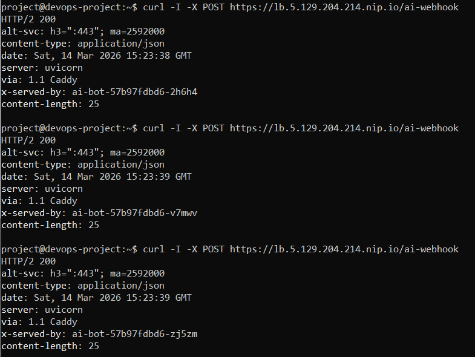

Figure 10.2 — Load balancing in action via curl

Also we can check pod name directly in bot’s anwser in Gitlab comments:

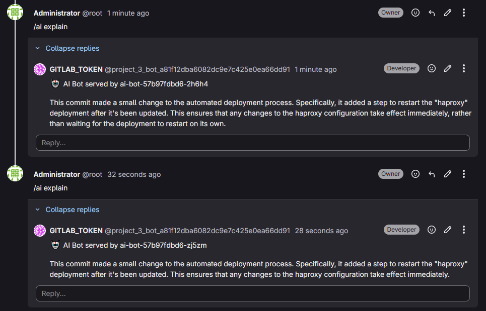

Figure 10.3 — VIsible pod name in Gitlab comments

Additionally we can check fault tolerance of the deployment by deleting one of the pods.
After that kubernetes will automatically run new pod, and other pods are still working, bot is still working without interruptions:

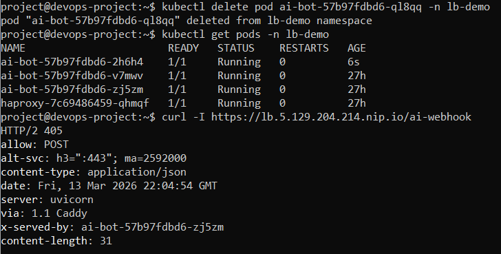

Figure 10.4 — Fault tolerance check

For troubleshooting purposes we can also check logs directly from pods, and debug if needed:

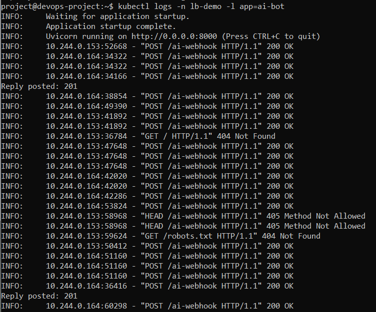

Figure 10.5 — ai-bot pods logs

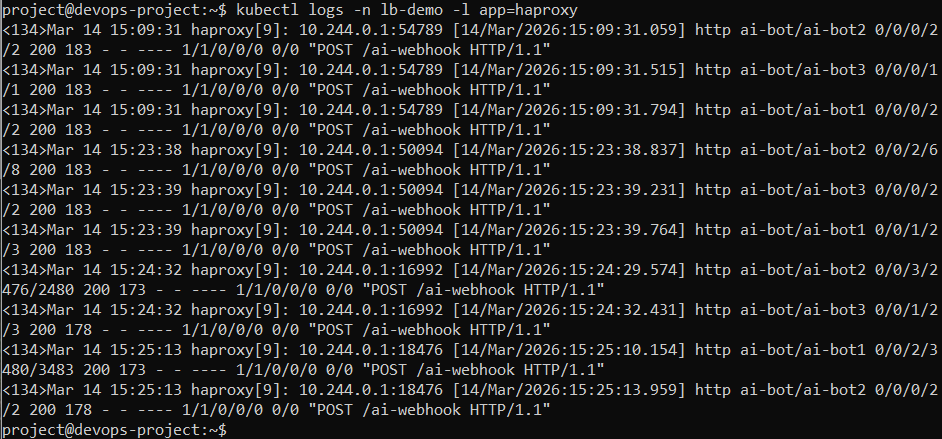

Figure 10.6 — haproxy logs

## 9.4 Changing balancing algorithm

HAProxy supports multiple load balancing algorithms, each suited for different use cases. Round Robin distributes requests evenly across all backend servers in sequence, which works well when all servers have equal capacity and request processing time is the same. Least Connections (leastconn) routes each new request to the server with the fewest active connections, making it a better choice for workloads with variable response times such as LLM API calls. Random selects a backend server randomly, which statistically produces similar distribution to round robin but without maintaining any state. Source hashes the client IP to always route the same client to the same server, useful when session persistence is required.
For our demo environment, Round Robin is the most appropriate choice. All three bot replicas are identical, run on the same node, and handle stateless webhook requests. Since the goal is to visually demonstrate load balancing where each request lands on a different pod in a predictable, observable sequence round robin provides the clearest proof of concept. The X-Served-By response header confirms that requests are distributed evenly across ai-bot pods, which is exactly what we need to validate the setup.

But we still able to configure our deployment and change balancing algorithm. For example, we can change “round-robin” to “random” algorithm in haproxy configuration and deploy it, which is also suitable for out small environment and can be easily demonstrated.

 Changed value of “balance” parameter in haproxy configuration in the haproxy’s ConfigMap

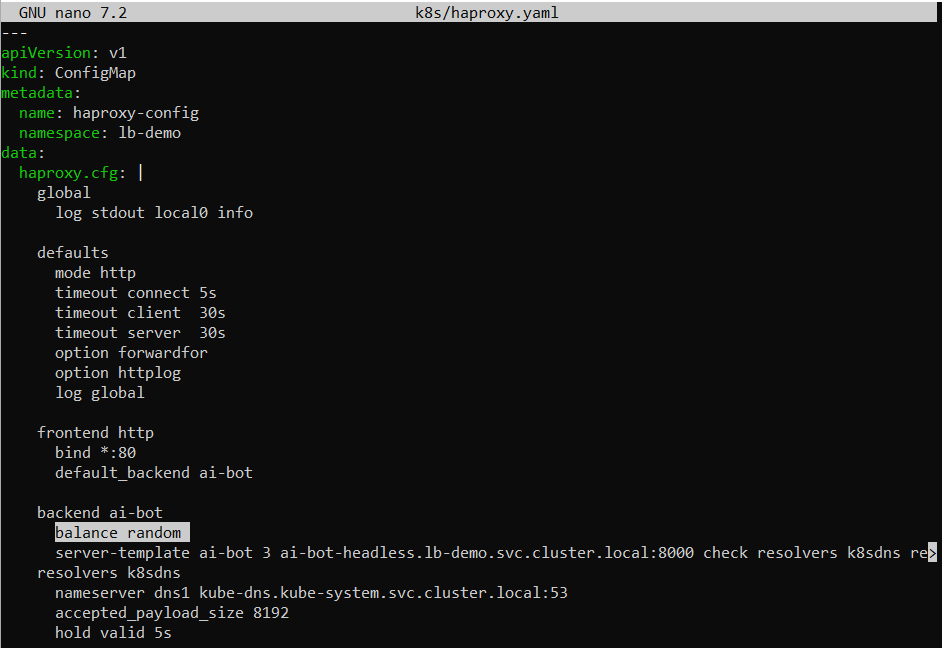

FIgure 10.7 — Updated balancing algorithm in Configmap

Deployed it to the cluster:

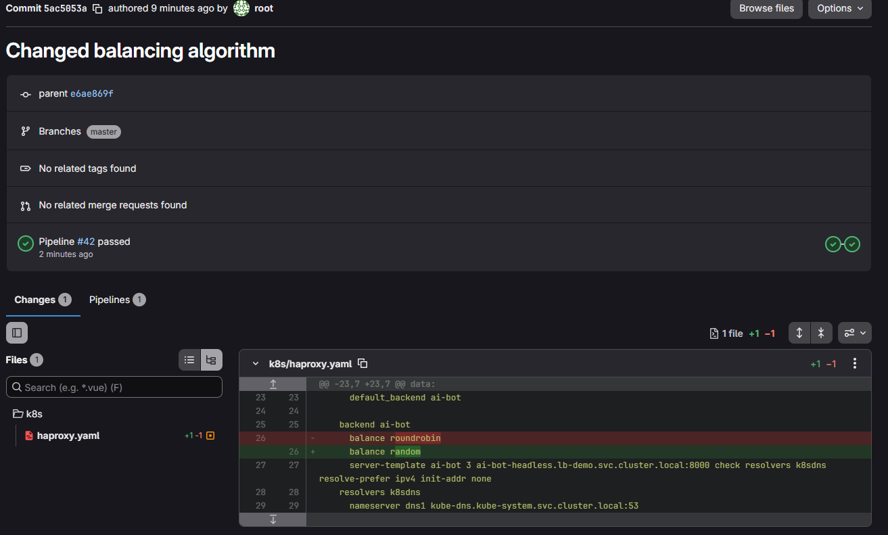

Figure 10.8 — Commiting changes

Checking requests balancing via curl:

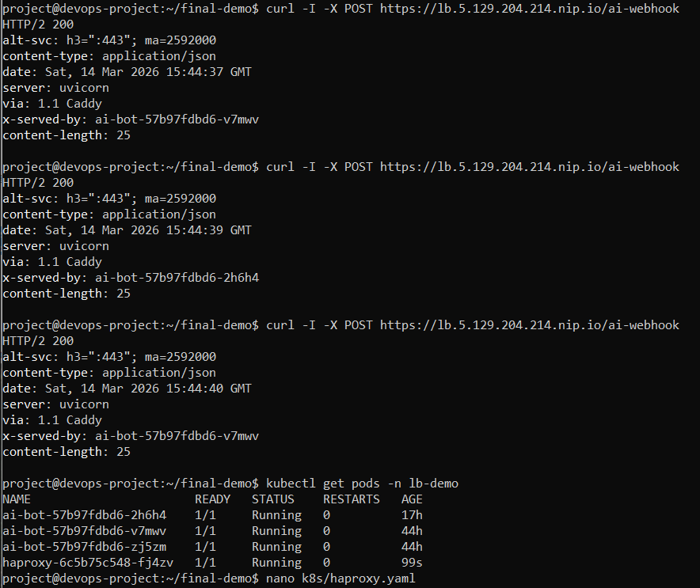

Figure 10.9 — Checking balancing via curl

---

# 10. Future Development

*Describe growth points and potential improvements identified during the project.*

- [ ]  Extend bot commands to support `/ai review` for full MR diff analysis
- [ ]  Integrate SAST results directly into LLM prompts for context-aware security advice
- [ ]  Add support for self-hosted LLM (e.g. llama3 via Ollama) to avoid sending code to external APIs
- [ ]  Implement Kubernetes HPA (Horizontal Pod Autoscaler) for the bot under load
- [ ]  Add persistent logging of all LLM interactions for audit purposes
- [ ]  Explore GitLab AI-native features and compare with custom implementation

---

# 11. References

- [GitLab CE Documentation](https://docs.gitlab.com/)
- [Kubernetes Documentation](https://kubernetes.io/docs/)
- [Caddy Documentation](https://caddyserver.com/docs/)
- [HAProxy Documentation](https://www.haproxy.org/)
- [Fail2ban Documentation](https://www.fail2ban.org/)
- [OpenAI API Documentation](https://platform.openai.com/docs/)
- [FastAPI Documentatio](https://fastapi.tiangolo.com/)
