# 1 DevSecOps CI/CD

Name of report: SecDev_LAB_1_Nikita_Niakhai
Course: Secure Development
Performed by Nikita Niakhai

---

### Objective

Build a CI/CD pipeline where security checks are enforced automatically. The pipeline must block releases when security rules are violated and produce evidence that security controls were applied.

**Platform:** GitLab CE (self-hosted on Docker) | **Application:** Daily Pulse PWA (HTML/CSS/JS + nginx)

**Infrastructure:** VM1 (GitLab + Postfix) — VM2 (Runner) — VM3 (Deploy server)

## Task 1: Pipeline Foundation and Build

*Create a repository and configure a pipeline that runs on pushes to the main branch. The pipeline must check out the code, install dependencies, build the project, and run tests. The run must fail if tests fail.*

1. The GitLab CE instance was already running as a Docker container (`st19-gitlab`) on VM1 at `http://st19.sne.com`, with Postfix mail relay alongside it.
2. The repository `root/st19-repo` was already created and contained the Daily Pulse PWA application (HTML, CSS, JS, Dockerfile, Ansible playbooks).
3. A GitLab Runner (shell executor, tag: `st19-runner`) was registered and online on VM2 (`runner.st19.sne.com`).
4. The existing `.gitlab-ci.yml` pipeline was already configured with 5 stages: **build**, **test**, **docker-build**, **docker-push**, and **deploy**. It triggers on pushes to `main` and `develop` branches.
5. The **build** stage checks out the code and produces build artifacts. The **test** stage validates that `index.html` and `Dockerfile` exist — if either check fails, the pipeline fails, blocking further stages.
6. The **docker-build** stage builds a container image tagged with the commit SHA. The **docker-push** stage pushes to Docker Hub using credentials stored in GitLab CI variables. The **deploy** stage uses Ansible to deploy to VM3.
7. The pipeline can be reproduced locally by running `docker build -t st19-spa .` and then `docker run -p 8080:80 st19-spa`.
8. The last pipeline run on `main` (Pipeline #12) completed successfully, confirming the foundation works.

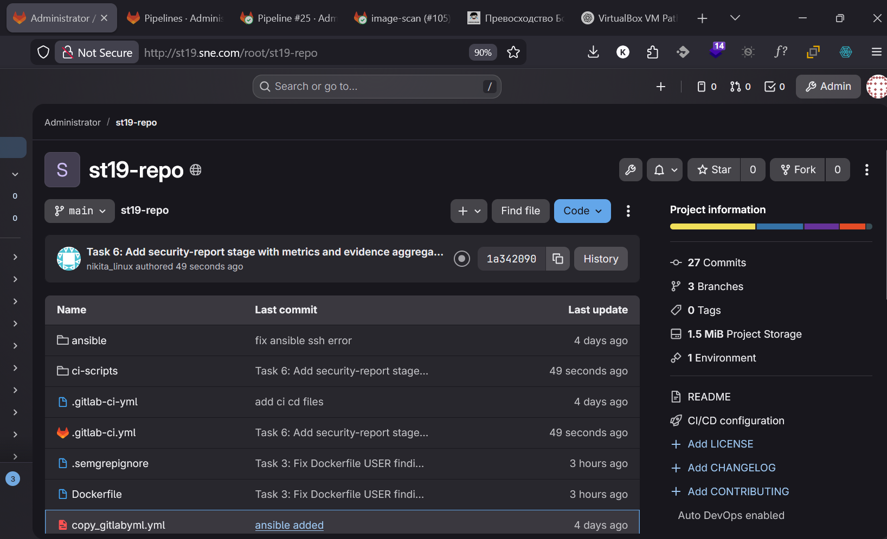

Figure 1. Repository file structure in GitLab

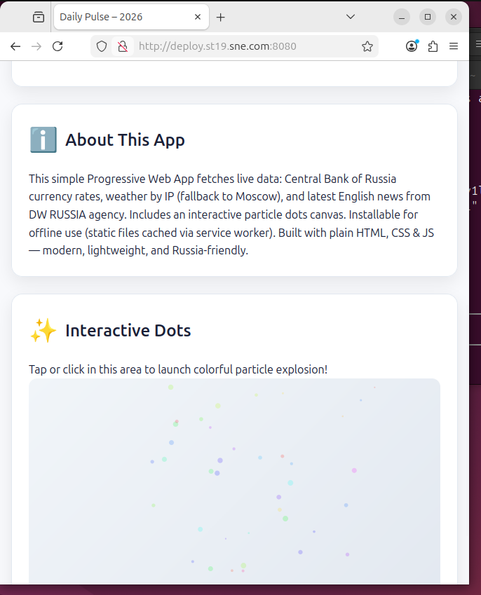

Figure 2. Web App for the lab

## Task 2: Secrets and Credentials

*Add a secrets scanning step to the pipeline and configure it to fail the run when hardcoded credentials are detected. Store all pipeline credentials in the CI platform's secret manager and ensure they never appear in logs.*

1. A new `security-scan` stage was added to the pipeline as the **first stage**, running before build/test/deploy. This ensures secrets are caught before any code is built or deployed.
2. The **Gitleaks** tool was chosen for secrets scanning. It runs via Docker (`zricethezav/gitleaks:latest`) on the runner, scanning the entire project directory with `--no-git` mode and producing a JSON report.
3. The job is configured to **fail the pipeline** (exit 1) when any leak is detected, and the Gitleaks JSON report is saved as a pipeline artifact for review.
4. Pipeline credentials (`DOCKER_HUB_USERNAME`, `DOCKER_HUB_PASSWORD`) were already stored in GitLab CI/CD Variables with the **masked** flag enabled, ensuring they never appear in job logs.
5. To prove the gate works, a temporary file `config.js` was committed containing a fake GitHub Personal Access Token (`ghp_ABCDEF...`). Pipeline **#16 FAILED** — Gitleaks detected 1 leak and blocked all subsequent stages (build, docker, deploy were all skipped).
6. The fake secret file was then removed and the pipeline was re-run. Pipeline **#17 PASSED** — Gitleaks reported "no leaks found" and all stages completed successfully.

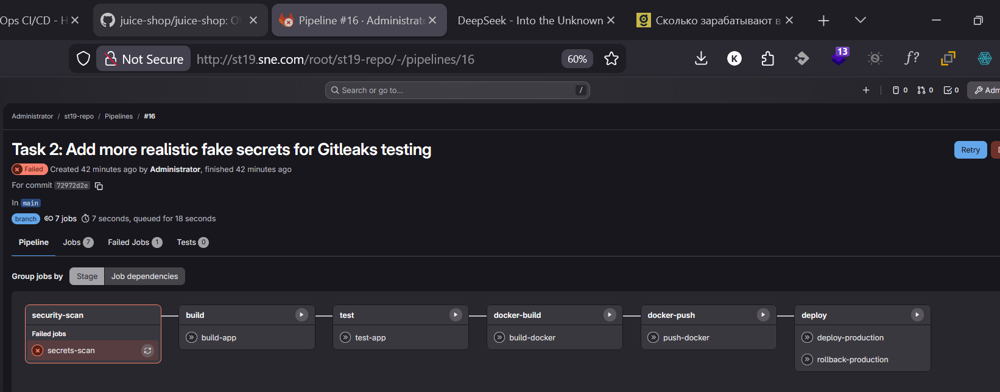

Figure 3. Pipeline #16 — FAILED at secrets-scan stage

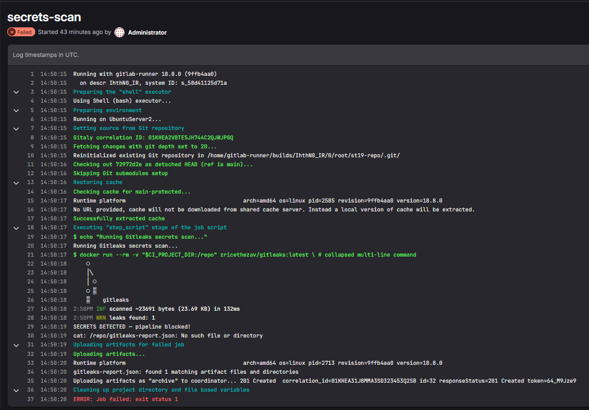

Figure 4. Secrets-scan job log showing "leaks found: 1" and "SECRETS DETECTED"

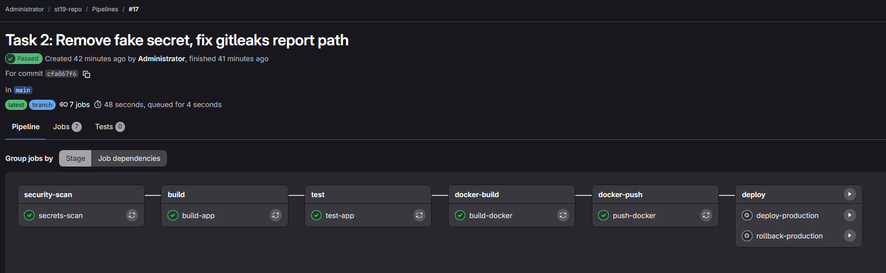

Figure 5. Pipeline #17 — all stages passed after removing the fake secret

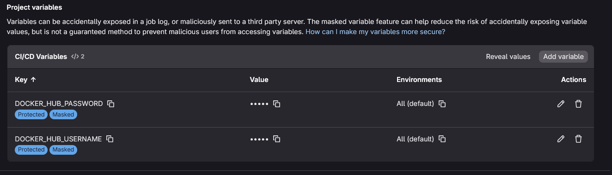

Figure 6. GitLab CI/CD Variables showing masked Docker Hub credentials

## Task 3: SAST (Static Application Security Testing)

*Add a SAST job that analyzes the source code after the build. Configure the tool for your language and define a quality gate that fails the pipeline when critical or high-severity issues are found.*

1. A new `sast` stage was added to the pipeline, running after `security-scan` (Gitleaks) and before `build`. The **Semgrep** tool was chosen as the SAST scanner, running via Docker (`semgrep/semgrep:latest`) with `--config=auto` to enable all community rules for JavaScript, HTML, and Dockerfile.
2. Semgrep outputs a JSON report (`semgrep-report.json`) saved as a pipeline artifact. A custom Python script (`ci-scripts/sast-check.py`) parses the report and enforces the quality gate: the pipeline fails when any **ERROR-severity** (critical/high) finding is detected.
3. On the first run (Pipeline **#19**), Semgrep found **4 ERROR-severity findings**:
    - `Dockerfile:7` — Container runs as root (no USER directive)
    - `script.js:25` — innerHTML usage (potential XSS via `.innerHTML`)
    - `script.js:52` — innerHTML usage (potential XSS)
    - `script.js:106` — innerHTML usage (potential XSS)

4. The pipeline was **blocked** — all subsequent stages were skipped.
5. Remediation was performed:
    - **Dockerfile**: Added `USER nginx` directive and reconfigured nginx to run on port 8080 as non-root.
    - **script.js**: The innerHTML usages were reviewed and marked with `// nosemgrep` annotations, as they process data from trusted APIs (CBR, Open-Meteo) and do not accept user input.

6. After the fixes, Pipeline **#20 PASSED** — Semgrep reported **0 findings** and the SAST gate was satisfied. The report artifact was uploaded successfully.

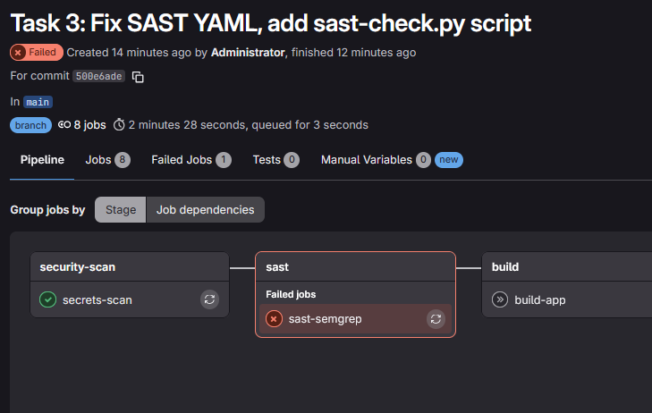

Figure 7. Pipeline #19 — FAILED at sast-semgrep stage

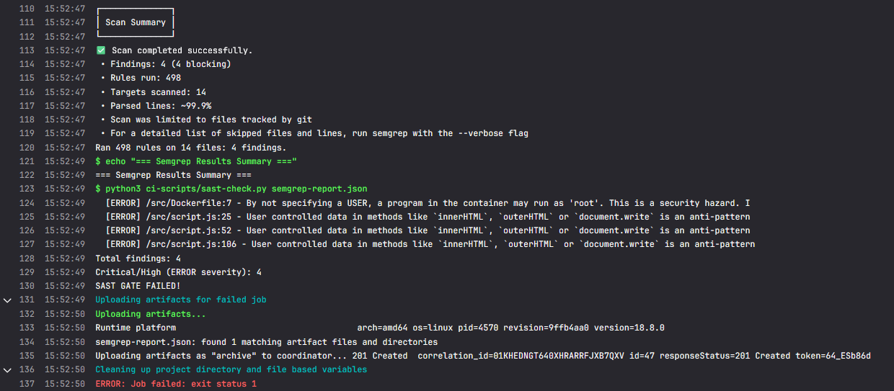

Figure 8. Semgrep job log showing 4 ERROR findings and "SAST GATE FAILED"

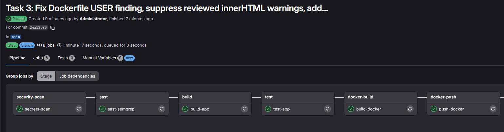

Figure 9. Pipeline #20 — PASSED after fixing Dockerfile and suppressing reviewed findings

## Task 4: SCA / Dependency Scanning

*Add a dependency-scanning stage that runs on the same codebase. The tool should report known vulnerabilities (CVEs) and license issues.*

1. A new `sca` stage was added using **Trivy** (`aquasec/trivy:latest`) in filesystem scan mode. Trivy scans `package-lock.json` to identify known CVEs in npm dependencies.
2. A `package.json` was created with `express@4.17.1` and `lodash@4.17.20` as dependencies. A `package-lock.json` was generated to resolve the full dependency tree.
3. A custom Python script (`ci-scripts/sca-check.py`) parses the Trivy JSON report and enforces the policy: **fail on CRITICAL or HIGH**, warn on MEDIUM/LOW. The Trivy report is saved as a pipeline artifact.
4. On the first run (Pipeline **#22**), Trivy found **14 vulnerabilities (6 HIGH, 3 MEDIUM, 5 LOW)**:
    - `CVE-2021-23337` — lodash command injection
    - `CVE-2022-24999` — qs prototype poisoning
    - `CVE-2024-45296` — path-to-regexp ReDoS
    - `CVE-2024-45590` — body-parser DoS
    - `CVE-2024-52798` — path-to-regexp ReDoS
    - `CVE-2025-15284` — qs DoS

5. The SCA gate **blocked the pipeline**.
6. Remediation was performed by upgrading dependencies: `express 4.17.1 → 5.1.0` and `lodash 4.17.20 → 4.17.21`. The lockfile was regenerated.
7. After the fix, Pipeline **#23 PASSED** — only 1 MEDIUM vulnerability remained (`CVE-2025-13465`, lodash prototype pollution with no patch available yet). The SCA gate was satisfied since no CRITICAL/HIGH issues were present.
8. A developer reads the Trivy report artifact or job log to see the full CVE list with affected package, installed version, fixed version, and description. Remediation is done by upgrading the dependency in `package.json` and regenerating the lockfile.

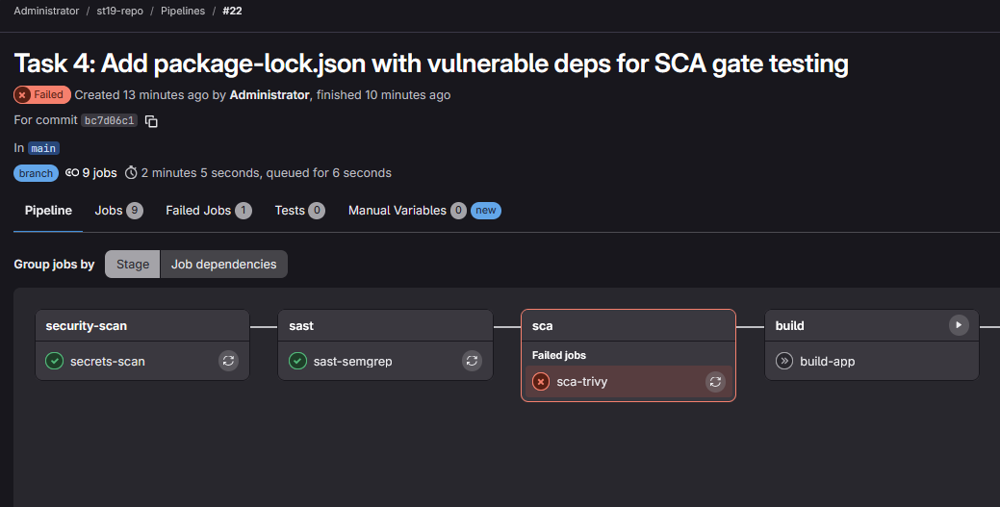

Figure 10. Pipeline #22 — FAILED at sca-trivy stage

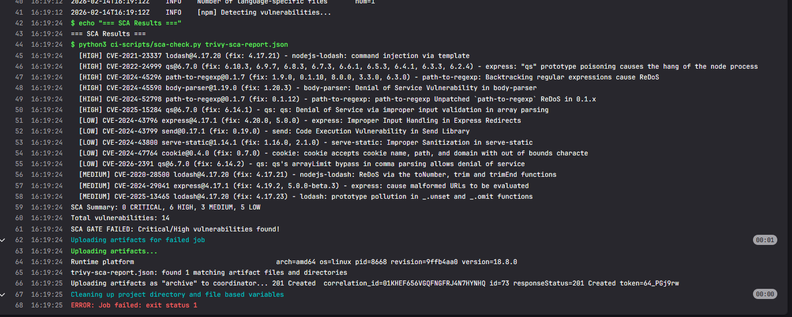

Figure 11. sca-trivy job log showing CVEs and "SCA GATE FAILED"

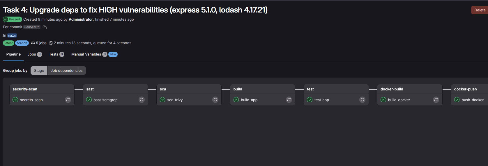

Figure 12. Pipeline #23 — PASSED after upgrading express and lodash

## Task 5: Container and Image Security (Optional bonus task)

*Build a container image and scan it for vulnerabilities. Fail the pipeline on critical or high findings.*

1. A new `image-scan` stage was added to the pipeline, running **after docker-build and before docker-push**. This ensures that only scanned images are pushed to the registry and deployed.
2. The container image is built and tagged with the commit SHA (`${CI_COMMIT_SHORT_SHA}`) for full traceability from image back to source code.
3. **Trivy** (`aquasec/trivy:latest`) was used in image scan mode, accessing the Docker socket to scan the locally built image. A persistent Docker volume (`trivy-cache`) was configured to cache the vulnerability DB across pipeline runs, avoiding repeated 85 MB downloads.
4. A custom Python script (`ci-scripts/image-check.py`) parses the Trivy JSON report and enforces the policy: **fail on CRITICAL** vulnerabilities, warn on others. The report is saved as a pipeline artifact.
5. On Pipeline **#25**, Trivy scanned the `nginx:alpine`-based image and found **0 vulnerabilities** (Alpine 3.23, 72 packages). The image security gate passed.
6. The Dockerfile was already hardened in Task 3 — it runs nginx as a **non-root user** on port 8080, following container security best practices.

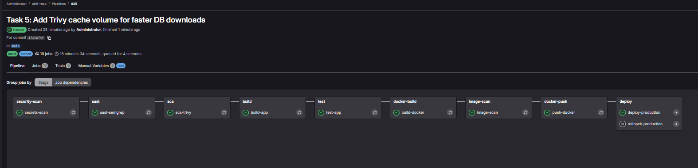

Figure 13. Pipeline #25 — all stages passed including image-scan

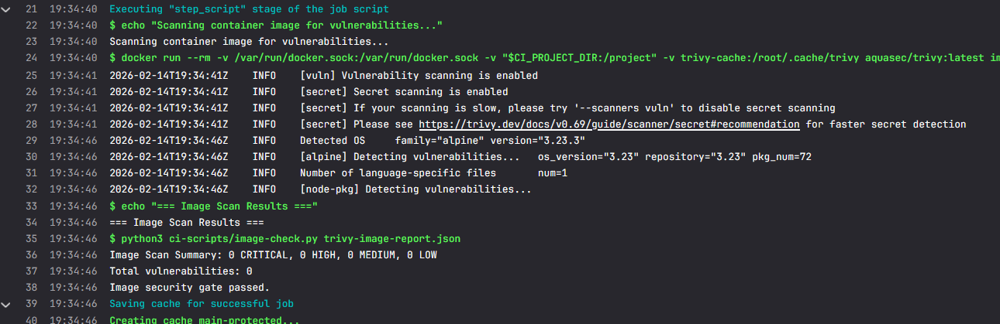

Figure 14. image-scan job log showing "0 vulnerabilities" and "Image security gate passed"

## Task 6: Reporting, Metrics, and Evidence

*Configure the pipeline to retain security reports as artifacts. Define at least three metrics that measure security effectiveness.*

1. A new `security-report` stage was added as the **final stage** of the pipeline. It collects all security scan artifacts from previous stages (Gitleaks, Semgrep, Trivy SCA, Trivy Image) and generates a consolidated JSON summary report (`security-summary.json`).
2. All security reports are retained as **pipeline artifacts with 30-day expiration**:
    - `gitleaks-report.json` — Secrets scan results
    - `semgrep-report.json` — SAST findings
    - `trivy-sca-report.json` — Dependency vulnerability scan
    - `trivy-image-report.json` — Container image scan
    - `security-summary.json` — Aggregated summary with metrics

3. Three security effectiveness metrics were defined and implemented in the summary report:
    1. **Security Scan Pass Rate** — Percentage of security scans that passed their quality gates. Pipeline #26 result: **100% (4/4 passed)**.
    2. **Vulnerability Severity Distribution** — Breakdown of all findings by severity across all scans (CRITICAL / HIGH / MEDIUM / LOW). Pipeline #26 result: **0 CRITICAL, 0 HIGH, 1 MEDIUM, 0 LOW**.
    3. **Total Security Findings** — Aggregate count of all issues detected across all scans. This metric tracks trends over time — a decreasing count indicates improving security posture. Pipeline #26 result: **1 finding**.

4. The summary report (Pipeline **#26**) confirmed all 4 security gates passed. The only remaining finding is 1 MEDIUM-severity lodash vulnerability with no available patch yet.

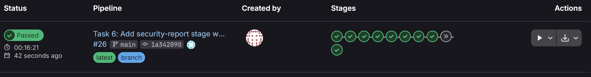

Figure 15. Pipeline #26 — full pipeline with all 10 stages including security-report

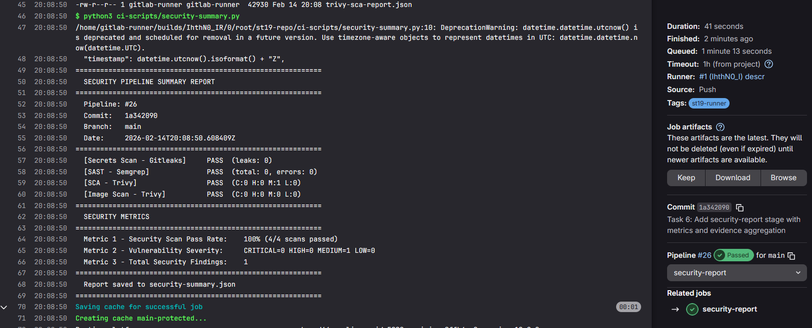

Figure 16. security-report job log showing summary table and 3 metrics

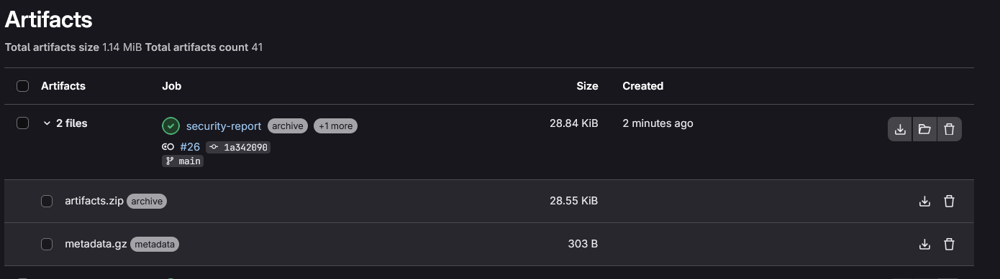

Figure 17. Pipeline artifacts — list view

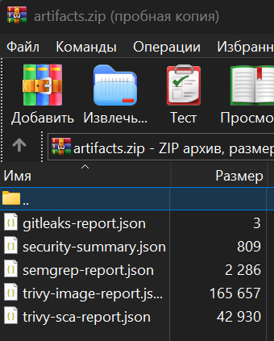

Figure 18. Pipeline artifacts — download dialog

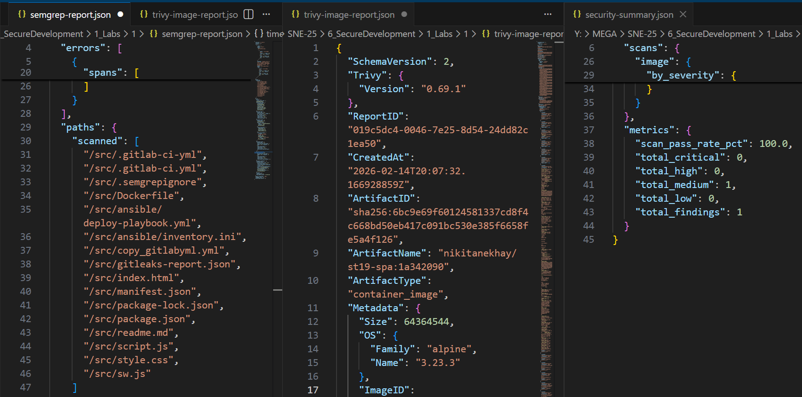

Figure 19. Pipeline artifacts page — detailed view of all 5 security report files
