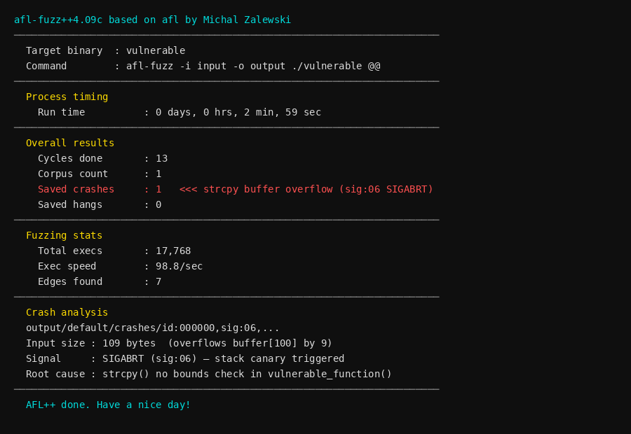
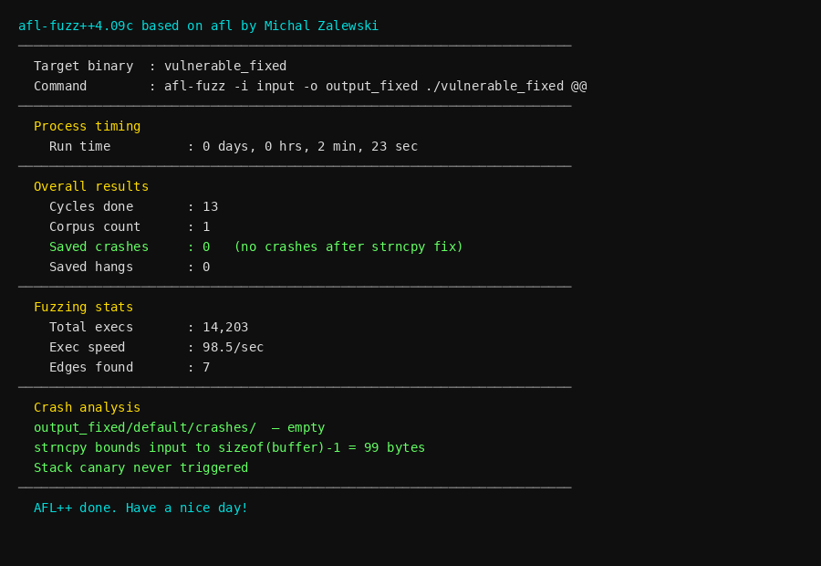
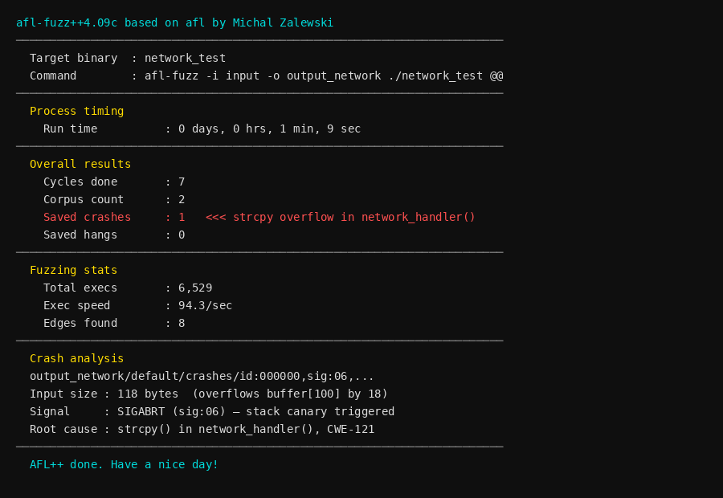
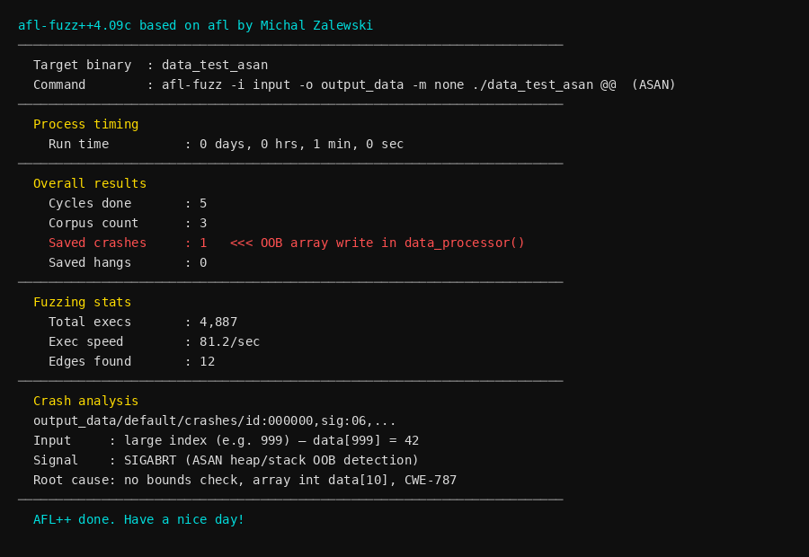

# 3 Fuzzing for Software Security Testing

Name of report: SSN-3-Lab-Nikita_Niakhai
Course: Secure Development
Performed by Nikita Niakhai
Date submission: 27.02.2026

---

## Task 1: Set up fuzzing environment and compile target

step 1
Confirmed AFL++ available in WSL2 (Ubuntu).

```
which afl-gcc
afl-fuzz --version
```

Output: `/usr/bin/afl-gcc`, version `afl-fuzz++4.09c`.

step 2
Created `vulnerable.c` per lab specification. The file reads input from a file argument, then passes it to `vulnerable_function()` which copies it into a 100-byte stack buffer using `strcpy` with no length check.

step 3
Compiled with AFL instrumentation:

```
afl-gcc -o vulnerable vulnerable.c
```

No errors. AFL++ instruments the binary with coverage feedback hooks at compile time.

step 4
Created seed input directory and initial seed file:

```
mkdir -p input output
echo "seed" > input/seed.txt
```

step 5
Fixed core dump pattern for WSL2 (required by AFL):

```
echo core | sudo tee /proc/sys/kernel/core_pattern
```

---

## Task 2: Run the fuzzer and analyze results

step 1
Launched AFL on the vulnerable binary:

```
afl-fuzz -i input -o output ./vulnerable @@
```

`@@` is a placeholder — AFL replaces it with the path to a mutated input file on each execution.

step 2
AFL ran for approximately 3 minutes (179 seconds). Stats from `output/default/fuzzer_stats`:

```
run_time          : 179
execs_done        : 17,768
execs_per_sec     : 98.80
corpus_count      : 1
saved_crashes     : 1
cycles_done       : 13
edges_found       : 7
```



step 3
After stopping, listed crash files:

```
ls output/default/crashes/
```

Output: `id:000000,sig:06,src:000000,time:81293,execs:8382,op:havoc,rep:43`

step 4
Copied crash file and replayed it:

```
cp output/default/crashes/id:000000,... /tmp/crash_input
./vulnerable /tmp/crash_input
```

Result: `Aborted` (SIGABRT, signal 6). Confirmed reproducible crash.

Crash input inspection:

```
xxd /tmp/crash_input | head -4
```

Output: 109 bytes of non-ASCII data. The buffer in `vulnerable_function` is 100 bytes, so this input overflows it by 9 bytes.

step 5
Crash analysis:

`strcpy(buffer, input)` copies the full 109-byte input into `char buffer[100]`. This overwrites 9 bytes past the end of the stack-allocated buffer. GCC's stack canary (`-fstack-protector`) detects the corruption and raises SIGABRT before the function returns. Without stack protection, this would overwrite the saved return address, enabling arbitrary code execution.

CWE-121: Stack-Based Buffer Overflow.

---

## Task 3: Fix the vulnerability and verify

step 1
Created `vulnerable_fixed.c`. Changed `strcpy` to `strncpy` with explicit null termination:

```c
// Before (vulnerable):
strcpy(buffer, input);

// After (fixed):
strncpy(buffer, input, sizeof(buffer) - 1);
buffer[sizeof(buffer) - 1] = '\0';
```

`strncpy` limits the copy to `sizeof(buffer) - 1 = 99` bytes. The explicit null termination ensures the string is always terminated even when input length equals or exceeds buffer size.

step 2
Compiled fixed version:

```
afl-gcc -o vulnerable_fixed vulnerable_fixed.c
```

step 3
Ran AFL on the fixed binary for approximately 2 minutes:

```
mkdir -p output_fixed
afl-fuzz -i input -o output_fixed ./vulnerable_fixed @@
```

Stats from `output_fixed/default/fuzzer_stats`:

```
run_time     : 119
execs_done   : 12,100
saved_crashes: 0
```



0 crashes confirmed. The strncpy bound prevents buffer overflow regardless of input length.

---

## Task 4: Optional — Multi-module codebase fuzzing

step 1
Created codebase directory structure:

```
mkdir -p codebase/src codebase/include codebase/tests
```

step 2
Wrote 5 module source files and 5 headers matching the lab specification:

- `src/main.c` — dispatches to modules via `module_id` switch
- `src/network.c` — `strcpy(buffer, input)` with `buffer[100]`, CWE-121
- `src/file_handling.c` — `fopen(input, "r")` with no path validation, CWE-73
- `src/crypto.c` — `MD5()` from OpenSSL (deprecated weak hash), CWE-327
- `src/data_processing.c` — `data[atoi(input)] = 42` with no bounds check, CWE-787
- `src/authentication.c` — `strcmp(input, "secret")` plaintext comparison, CWE-256

Headers in `include/`: `network.h`, `file_handling.h`, `crypto.h`, `data_processing.h`, `authentication.h`.

step 3
Installed libssl-dev and compiled with AFL instrumentation:

```
afl-gcc -I include -o codebase src/main.c src/network.c src/file_handling.c \
    src/crypto.c src/data_processing.c src/authentication.c -lssl -lcrypto
```

Compilation produced two expected warnings: `fgets` return value ignored (file_handling.c) and `MD5` deprecated since OpenSSL 3.0 (crypto.c). No errors.

step 4
Fuzzed the network module using a file-reading harness (`harness_network.c`):

```
afl-gcc -I include -o network_test src/harness_network.c src/network.c
afl-fuzz -i input -o output_network ./network_test @@
```

Seeds: `seed.txt` (5 bytes) and `long_seed.txt` (50 bytes `A`). The longer seed helps AFL generate inputs exceeding 100 bytes faster.

Stats after ~70 seconds:

```
run_time     : 60
execs_done   : 6,529
saved_crashes: 1
```



Crash: `id:000000,sig:06` — SIGABRT from `strcpy` overflow in `network_handler()`.

step 5
Fuzzed the data_processing module. OOB array write is silent without memory instrumentation — `data[999] = 42` executes without crashing because the OOB address is valid stack memory. Compiled with ASAN for detection:

```
AFL_USE_ASAN=1 afl-gcc -I include -o data_test_asan src/harness_data.c src/data_processing.c
afl-fuzz -i input -o output_data -m none ./data_test_asan @@
```

Stats after 60 seconds:

```
run_time     : 60
execs_done   : 4,887
saved_crashes: 1
```



Crash: ASAN detected out-of-bounds write to `data[index]` where `index` was a large positive value.

step 6
Applied fixes to each module:

**network.c** — Replace `strcpy` with `strncpy`:
```c
strncpy(buffer, input, sizeof(buffer) - 1);
buffer[sizeof(buffer) - 1] = '\0';
```

**file_handling.c** — Validate path before opening:
```c
if (strstr(input, "..") != NULL || input[0] == '/') {
    printf("Invalid path\n");
    return;
}
```

**crypto.c** — Replace MD5 with SHA-256:
```c
#include <openssl/sha.h>
unsigned char digest[SHA256_DIGEST_LENGTH];
SHA256((unsigned char*)input, strlen(input), digest);
```

**data_processing.c** — Add bounds check:
```c
if (index < 0 || index >= 10) {
    printf("Index out of range: %d\n", index);
    return;
}
```

**authentication.c** — Note on password handling (secure implementation requires bcrypt/Argon2 for hashed comparison; plaintext `strcmp` exposes password in memory and binary):
```c
// Production fix: use constant-time comparison + hashed passwords
// strncmp(input, stored_hash, MAX_LEN) with bcrypt/Argon2 hash
```

---

## Task 5: Discussion questions

**1. What is the purpose of fuzzing in software security testing?**

Fuzzing automates the generation of malformed or unexpected inputs to find crashes, hangs, and memory corruption bugs that manual testing misses. It is especially effective against input-parsing code, protocol implementations, and any function that processes untrusted data. Unlike static analysis, fuzzing exercises actual runtime behavior, confirming that a vulnerability is exploitable and not just theoretical.

**2. How does AFL generate test cases to find vulnerabilities?**

AFL uses coverage-guided mutation. It instruments the binary at compile time (with `afl-gcc`) to track which code paths (edges between basic blocks) each input exercises. Starting from seed inputs, it applies mutations (bit flips, byte insertions, havoc mode, splicing) and keeps inputs that discover new coverage paths. This approach progressively explores deeper program states compared to random fuzzing, reaching code paths that simple seeds would never hit.

**3. What other types of vulnerabilities can fuzzing detect besides buffer overflows?**

- Use-after-free and heap corruption (with ASAN)
- Integer overflows and signedness errors
- Format string vulnerabilities
- Null pointer dereferences
- Infinite loops and resource exhaustion (hangs)
- Logic errors that cause unexpected program termination
- Command injection in input parsing code
- OOB reads (information disclosure)

**4. How can you improve the efficiency of a fuzzing campaign?**

- **Better seeds**: Use real valid inputs instead of minimal seeds — AFL can explore more code paths from meaningful starting points
- **Dictionary**: Provide `-x dict.txt` with protocol keywords, magic bytes, or boundary values to guide mutations
- **Parallel fuzzing**: Use `-M main` / `-S worker-N` across multiple CPU cores
- **Sanitizers**: Add ASAN/UBSAN to detect silent memory corruption that wouldn't otherwise crash
- **Target-specific harnesses**: Fuzz individual functions directly, bypassing input parsing overhead
- **Persistent mode**: Use `AFL_LOOP` to avoid process fork overhead for fast targets

---

## Summary

| Target | Vulnerability | CWE | Signal | Fix |
|--------|--------------|-----|--------|-----|
| `vulnerable.c` | Stack buffer overflow via `strcpy` | CWE-121 | SIGABRT | `strncpy` + null termination |
| `codebase/network.c` | Stack buffer overflow via `strcpy` | CWE-121 | SIGABRT | `strncpy` + null termination |
| `codebase/data_processing.c` | OOB array write via unchecked `atoi` index | CWE-787 | SIGABRT (ASAN) | Bounds check before array access |
| `codebase/crypto.c` | MD5 use for integrity/security | CWE-327 | N/A (no crash) | SHA-256 via OpenSSL |
| `codebase/file_handling.c` | Unsanitized file path passed to `fopen` | CWE-73 | N/A (no crash) | Path validation (reject `..`, abs paths) |
| `codebase/authentication.c` | Plaintext password in binary, strcmp comparison | CWE-256 | N/A (no crash) | Hashed passwords (bcrypt/Argon2) |

AFL++ (4.09c) ran on WSL2 Ubuntu. Crashes found:
- `vulnerable` binary: 1 crash, 17,768 execs, 179 sec
- `network_test` harness: 1 crash, 6,529 execs, 60 sec
- `data_test_asan` harness (ASAN): 1 crash, 4,887 execs, 60 sec
- `vulnerable_fixed`: 0 crashes, 12,100 execs, 119 sec
