# 4 SIEM

Name of report: SIEM_LAB_4_Nikita_Niakhai
Course: Secure Development
Performed by Nikita Niakhai
Date submission: 25.03.2026
Link to video demonstration: [https://drive.google.com/file/d/1qXv6a7Ly2g-MyLsMSPKfqglmQBda6Kiv/view?usp=sharing](https://drive.google.com/file/d/1qXv6a7Ly2g-MyLsMSPKfqglmQBda6Kiv/view?usp=sharing)

---

> This lab is designed to introduce students to security solutions, specifically a SIEM. Students can use any SIEM of choice — a solid recommendation is the open source platform **Wazuh**, which provides a fleet of capabilities at no cost.
>
> In this lab, students will interact with additional tools such as **VirusTotal**, **YARA**, **osquery**, and **SOAR**, and gain experience with SIEM log analysis, vulnerability detection, and more.

---

# Part A

## Task 1 — Introduction

**SIEM** [[1](https://www.cisco.com/site/us/en/learn/topics/security/what-is-siem.html)] [[2](https://www.microsoft.com/en-us/security/business/security-101/what-is-siem)] — (stands for Security Information and Event Management) is a security tool used to monitor, gather event information *from many sources), respond to attacks and allerts.

**Features:**

It gives ability to **collect, manage, gather and** **display** in a dashboard view with different filters data from the systems (applications, databases, OS, network devices, proxies).

- Logs information.
- Detects threats.
- Responds to incidents.
- Alerts SOC (security operation center) team.
- Filter using AI by event/source/type of event information.
- Gives ability to do Forensics analysis.
- Provides integrability with other security tools.

**Examples and tools:**

Proprietary: Microsoft Sentinel

### a. SIEM Architecture

Wazuh consists of main components: wazuh-manager (server), wazuh-dashboard, wazuh-indexer and wazuh-agents/modules on end nodes.

Wazuh agents establish encrypted with AES TCP connection on port 1514 with Wazuh server and continuously send data about events.. Then Wazuh server uses defined Rules and Decoders to parse and “read” the data.

Then Wazuh server securely with TLS enabled sends data about alerts/warnings/events to Filebeat, which reads them and sends to Wazuh Indexer, after that Wazuh dashboard queries (user/password authentication, TLS) with API (port 55000/TCP) the Wazuh server to display the data.

In this lab I used All-in-One deployment (server-wazuh components are hosted on one VM), you can divide hosting all main components server, indexer, dashboard between different VMs, containers.

The diagram below represents a Wazuh deployment architecture. It shows how the Wazuh server and the Wazuh indexer nodes can be configured as clusters, providing load balancing and high availability.


Figure 1.1 — SIEM architecture diagram

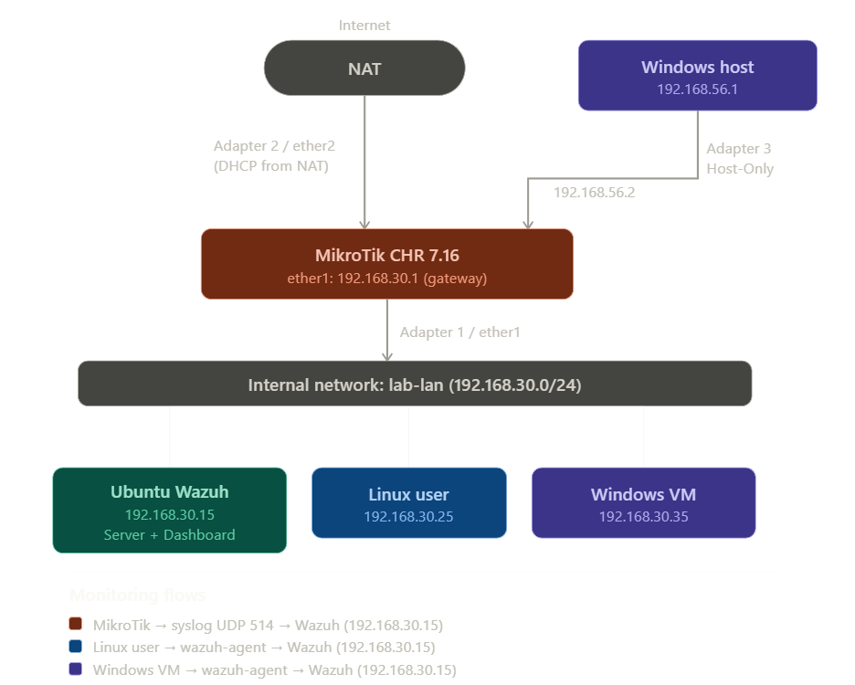

Figure 1.2 — Infrastructure diagram

---

**Table for Infrastructure**

| VM/Serice | VirtualBox adapter(s) | IP | Info |
| --- | --- | --- | --- |
| MikroTik CHR 7.16 | Adapter 1: Internal Network `lab-lan`, Adapter 2: NAT
Adapter 3: **Host-Only Adapter** → `VirtualBox Host-Only Ethernet Adapter #1` (192.168.56.x) | ether1: DHCP (10.0.2.15), ether2: 192.168.30.1
ether2: 192.168.56.2 | admin:admin |
| Ubuntu Wazuh | Adapter 1: Internal Network `lab-lan` | 192.168.30.15 (wazuh) | ubuntu:ubuntu |
| Linux user | Adapter 1: Internal Network `lab-lan` | 192.168.30.25 | ubuntu:ubuntu |
| Windows | Adapter 1: Internal Network `lab-lan` | 192.168.30.35 | user:user and admin:admin |
| Wazuh Dashboard |  |  | admin:admin |
- Setting up communication on infrastructure

    ```
    **#  MikroTik router configuration**

    # ether1 = LAN side
    /ip address add address=192.168.30.1/24 interface=ether1

    # ether2 = NAT adapter (internet via VirtualBox NAT)
    /ip dhcp-client add interface=ether2 disabled=no

    # Enable NAT masquerade so LAN hosts reach internet
    /ip firewall nat add chain=srcnat out-interface=ether2 action=masquerade

    # Allow DNS relay for LAN clients
    /ip dns set allow-remote-requests=yes

    # Verify internet works
    /ping 8.8.8.8 count=3

    # This puts MikroTik on the same subnet as your Windows Host-Only adapter
    /ip address add address=192.168.56.2/24 interface=ether3

    # allow forwarding between ether3(With Host) and ether1 (Lan)
    /ip firewall filter add chain=forward in-interface=ether3 out-interface=ether1 action=accept
    /ip firewall filter add chain=forward in-interface=ether1 out-interface=ether3 action=accept

    **# On host machine Windows:**
    route add 192.168.30.0 mask 255.255.255.0 192.168.56.2 metric 5

    **#  Ubuntu Wazuh server**

    # Find your interface name
    ip link show

    # Set static IP via netplan
    sudo tee /etc/netplan/01-static.yaml << 'EOF'
    network:
      version: 2
      ethernets:
        enp0s3:
          addresses: [192.168.30.15/24]
          routes:
            - to: default
              via: 192.168.30.1
          nameservers:
            addresses: [192.168.30.1, 8.8.8.8]
    EOF

    sudo netplan apply

    # Verify
    ping -c 3 192.168.30.1    # gateway
    ping -c 3 8.8.8.8       # internet
    ping -c 3 google.com    # DNS

    **# Linux user machine**

    # Same approach, different IP
    sudo tee /etc/netplan/01-static.yaml << 'EOF'
    network:
      version: 2
      ethernets:
        enp0s3:
          addresses: [192.168.30.25/24]
          routes:
            - to: default
              via: 192.168.30.1
          nameservers:
            addresses: [192.168.30.1, 8.8.8.8]
    EOF

    sudo netplan apply
    ping -c 3 192.168.30.1
    ping -c 3 192.168.30.15

    **# Windows VM**

    # Find your adapter index
    Get-NetAdapter

    # Found that it is 4

    # Set static IP
    New-NetIPAddress -InterfaceIndex 4 -IPAddress 192.168.30.35 -PrefixLength 24 -DefaultGateway 192.168.30.1
    Set-DnsClientServerAddress -InterfaceIndex 4 -ServerAddresses 192.168.30.1,8.8.8.8

    # Verify
    ping 192.168.30.1
    ping 192.168.30.15
    ping 8.8.8.8
    ```

    Replace `InterfaceIndex 6` with the actual index from `Get-NetAdapter`.

    ---

    ## Step 6 — Verify full connectivity from every machine

    Every VM should be able to reach every other VM and the internet:
    ```bash
    ping 192.168.30.1     # MikroTik
    ping 192.168.30.15    # Wazuh
    ping 192.168.30.25    # Linux user
    ping 192.168.30.35    # Windows
    ping 8.8.8.8       # Internet
    ```


Figure — Miktrotik communication setup and test via `ping`


Figure — Linux machine `ping` test (windows, wazuh, router, nat)


Figure — Wazuh machine `ping` test (windows,linux machine, router, nat)

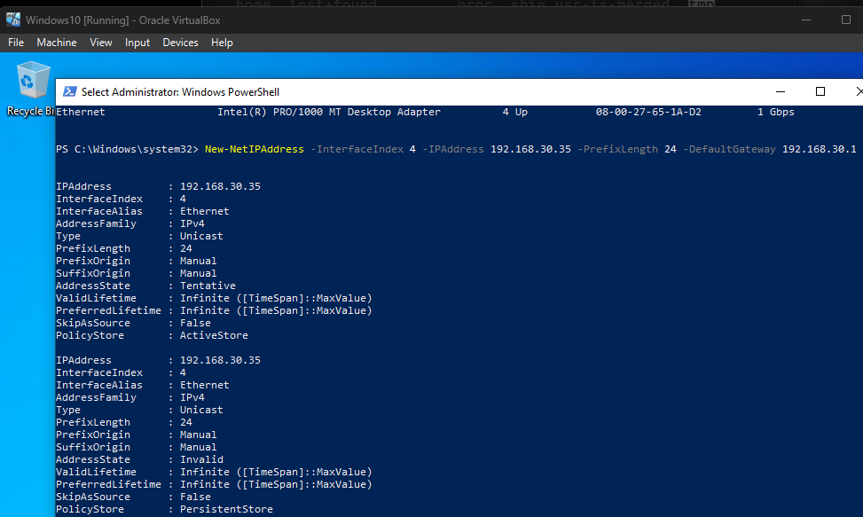

Figure — Windows machine setting up gateway


Figure — Wazuh machine `ping` test (linux machine, wazuh, router, nat)

- Installed wazuh server on wazuh machine [[installation guide](https://documentation.wazuh.com/current/quickstart.html)]

    ```bash
    curl -sO https://packages.wazuh.com/4.14/wazuh-install.sh && sudo bash ./wazuh-install.sh -a

    sudo tar -O -xvf wazuh-install-files.tar wazuh-install-files/wazuh-passwords.txt

    sed -i "s/^deb /#deb /" /etc/apt/sources.list.d/wazuh.list
    apt update
    ```

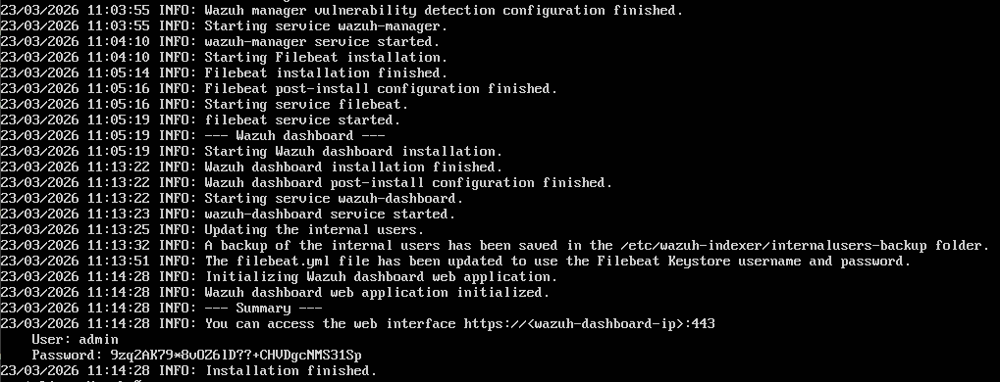

Figure — Wazuh installation is complete

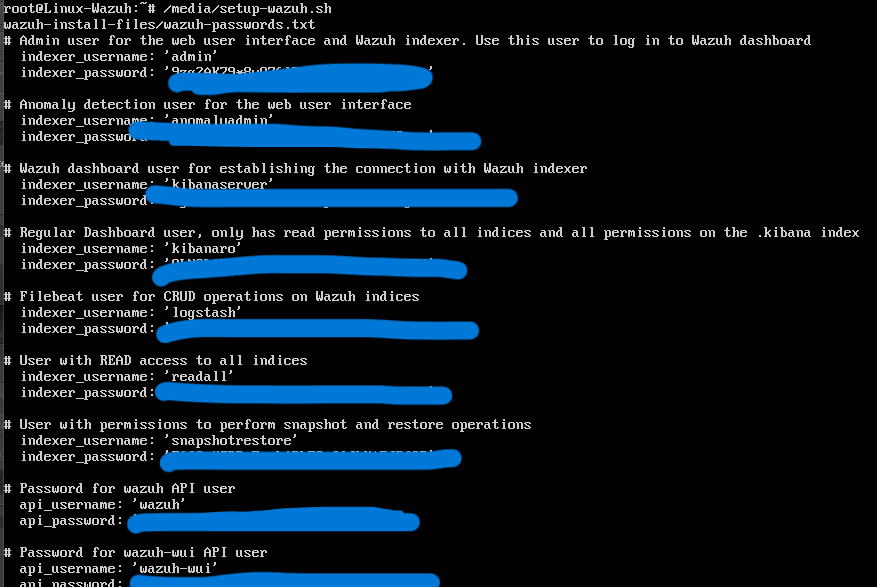

Figure — Wazuh credentials querying

---

### b. Open Source Advantages & Business Model

I researched those solutions [[3](https://wazuh.com/) about wazuh], [[4](https://selectel.ru/blog/open-source-siem/) good russian source], [[5](https://redcanary.com/cybersecurity-101/security-operations/top-free-siem-tools/)] and referenced lecture slides. What is HIDS and NIDS [[6](https://www.securityvision.ru/education/cyberwiki/h/hids-vs-nids-khostovye-i-setevye-ids/)]. Overview on SOC tools [[7](https://youtu.be/DS70_6YuHFg?is=JNreTE1ov4eSFz2s)]. Business model is described [here](https://www.tigerdata.com/blog/how-open-source-software-makes-money-time-series-database-f3e4be409467).

> **Advantage 1: Cost Savings**
>

Open source SIEM eliminates licensing fees, allowing budget-conscious teams to deploy powerful tools like log management and alerting without upfront costs. This is ideal for startups or SMBs testing security features before scaling.

> **Advantage 2: Customization**
>

Users can modify the codebase to fit specific needs, such as integrating HIDS/NIDS or adapting to unique environments like cloud or on-premises setups. This flexibility supports tailored compliance and threat hunting in SOCs.

> **Advantage 3: Well review and documented, Community**
>

Active communities drive rapid updates, bug fixes, and shared enhancements, providing transparency and reducing vendor lock-in risks. For solutions like Wazuh, this means free forums, documentation, and contributions from thousands of users

> **Q: How do open source vendors make money?**
>

Open source SIEM vendors monetize through paid professional support (e.g., 24/7 help desks), enterprise subscriptions for advanced features or scalability (e.g., Wazuh Cloud tiers from $16/month), managed cloud hosting, and partner programs offering discounts on consulting or certified deployments. Dual licensing or "open core" models add premium modules, while services like training and integrations generate revenue without charging for the core software.

---

## Task 2 — Setup Infrastructure

### a. Configure SIEM with 3+ Unique Devices

**Install wazuh agents on VMs**

Refferences: [[mikrotik setup](https://wazuh.com/blog/monitoring-network-devices/)], [[windows agent](https://documentation.wazuh.com/current/installation-guide/wazuh-agent/wazuh-agent-package-windows.html)], [[linux agent](https://documentation.wazuh.com/current/installation-guide/wazuh-agent/wazuh-agent-package-linux.html)].

```bash
# **Install Wazuh agent on Linux user**

#Install the following packages if missing:
apt-get install gnupg apt-transport-https

#Install the GPG key:
curl -s https://packages.wazuh.com/key/GPG-KEY-WAZUH | gpg --no-default-keyring --keyring gnupg-ring:/usr/share/keyrings/wazuh.gpg --import && chmod 644 /usr/share/keyrings/wazuh.gpg

#Add the repository:
echo "deb [signed-by=/usr/share/keyrings/wazuh.gpg] https://packages.wazuh.com/4.x/apt/ stable main" | tee -a /etc/apt/sources.list.d/wazuh.list

#Update the package information:
apt-get update

# Select your package manager and run the command below. Replace the WAZUH_MANAGER value with your Wazuh manager IP address or hostname:
WAZUH_MANAGER="192.168.30.15" apt-get install wazuh-agent

# Enable and start the Wazuh agent service.
systemctl daemon-reload
systemctl enable wazuh-agent
systemctl start wazuh-agent

**# Install Wazuh agent on Windows** 

Download the Windows installer to start the installation process.
https://packages.wazuh.com/4.x/windows/wazuh-agent-4.14.4-1.msi

# run installation (Powershell)
.\wazuh-agent-4.14.4-1.msi /q WAZUH_MANAGER="192.168.30.15"

# Start  (Powershell)
Start-Service wazuhsvc

# Files are stored C:\Program Files (x86)\ossec-agent

# Send all logs to Wazuh via syslog (UDP 514)
/system logging action set remote address=192.168.30.15 remote-port=514

/system logging add topics=info action=remote
/system logging add topics=error action=remote
/system logging add topics=warning action=remote
/system logging add topics=critical action=remote
/system logging add topics=firewall action=remote
```

---

### **Configuring: MikroTik to send syslog to Wazuh Server**

- Paste the following code snippet at the bottom of the `/etc/rsyslog.conf` file on the Ubuntu endpoint. This code enables the UDP port **514** to listen for syslogs and adds a location to store the security events. Replaced `<YOUR_MIKROTIK_IP_ADDRESS>` with my IP address of the MikroTik device.

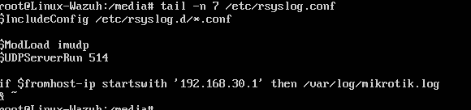

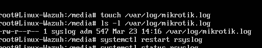

Figure — `/etc/rsyslog.conf` file with new configurations and log file is created

- Create the `mikrotik.log` file in the `/var/log` directory to store the syslog events.
- Change the file ownership for the `/var/log/mikrotik.log` file to syslog and group to `adm`.
- Restart the rsyslog utility for the changes to take effect.

    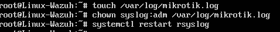

---

- On the Wazuh server, edit `/var/ossec/etc/ossec.conf` and add inside the `<ossec_config>` block:
    - `allowed-ips` specifies which endpoints are allowed to send logs to this server. Replace `<CIDR_NOTATION>` with the CIDR address of the network on which your endpoints are. If you monitor just one endpoint, you can put its IP address.
    - `local-ip` specifies the local IP address of the Wazuh server to be used for this connection. Replace `<WAZUH_MANAGER_IP>` with the IP address of the Wazuh server.

    ```
    <remote>
      <connection>syslog</connection>
      <port>514</port>
      <protocol>udp</protocol>
      <allowed-ips>192.168.30.1</allowed-ips>
      <local_ip>192.168.30.15</local_ip>
    </remote>
    ```

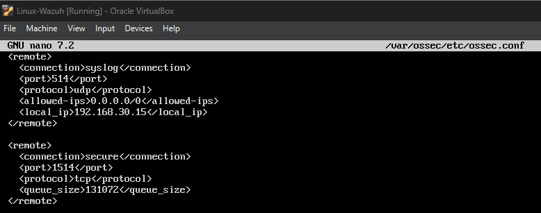

Figure — `/var/ossec/etc/ossec.conf` new block is added

---

- Setup mikrotik to allow WinBox UI


---

- Install WinBox on my host machine and connect to edit Mikrotik configurations.
    - SW already found to which endpoint to connect

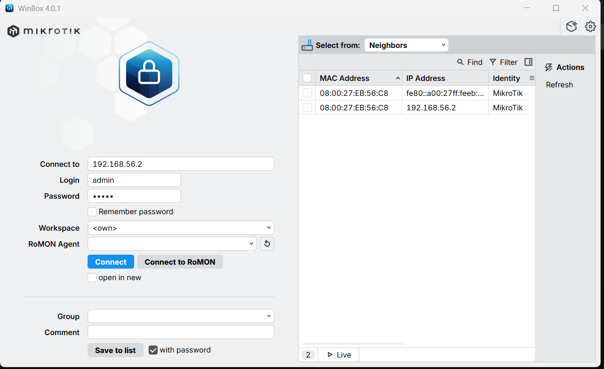

Figure — WinBox logginig to mikrotik router

- Open Logging tab

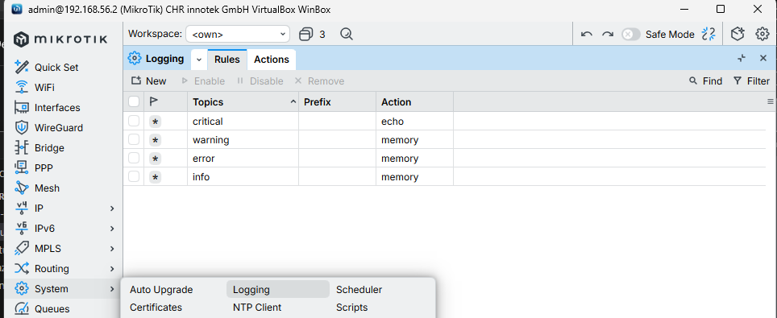

Figure — Inside mikrotik configuration for allowing forwarding to remote node

- Click on the **System** > **Logging** > **Rules** tab and create new or modify the existing rules where the topic’s **error**, **info**, and **warning** are set to `remote`.


Figure — Changing rules to remote


Figure — All rules are changed to remote

- Click the **System** > **Logging** > **Actions** tab to edit the **remote** action. Set the **Remote address** field to the IP address of the Wazuh manager and the **Remote port** field to the Rsyslog listening port.

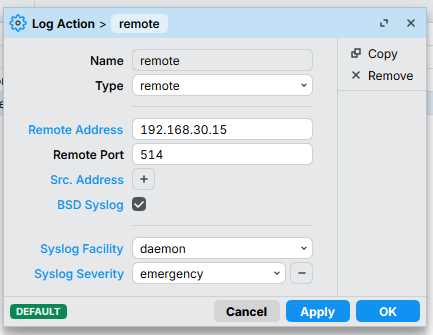

Figure — configuring remote action to actually point to my Wazuh Server

---

- Setting up Wazuh Decoders from [documentation](https://wazuh.com/blog/monitoring-network-devices/).
- Wrote 2 files, send them to wazuh server
- Restart `sudo systemctl restart wazuh-manager`
- Content of the files:

`/var/ossec/etc/decoders/mikrotik_decoders.xml`

```
<decoder name="mikrotik">
  <prematch>^RouterOS7.1-logs: </prematch>
</decoder>

<decoder name="mikrotik1">
  <parent>mikrotik</parent>
  <regex type="pcre2">\S+ (\w+ \d+ \d+:\d+:\d+) MikroTik user (\S+) (.*?) from (\d+.\d+.\d+.\d+) via (\w+)</regex>
  <order>logtimestamp, logged_user, action, ip_address, protocol</order>
</decoder>

<decoder name="mikrotik1">
  <parent>mikrotik</parent>
  <regex type="pcre2">\S+ (\w+ \d+ \d+:\d+:\d+) MikroTik dhcp-client on (\S+) (.*?) address (\d+.\d+.\d+.\d+)</regex>
  <order>logtimestamp, interface, action, ip_address</order>
</decoder>

<decoder name="mikrotik1">
  <parent>mikrotik</parent>
  <regex type="pcre2">\S+ (\w+ \d+ \d+:\d+:\d+) MikroTik router (\S+)</regex>
  <order>logtimestamp, action</order>
</decoder>
```

`var/ossec/etc/rules/mikrotik_rules.xml`

```
<group name="Mikrotik,">

  <rule id="110000" level="0">
    <decoded_as>mikrotik</decoded_as>
    <description>Mikrotik-Event</description>
  </rule>

  <rule id="110001" level="5">
    <if_sid>110000</if_sid>
    <match>dhcp-client on ether</match>
    <description>MikroTik dhcp-client received an IP address $(ip_address)</description>
  </rule>

  <rule id="110002" level="5">
    <if_sid>110000</if_sid>
    <match>rebooted</match>
    <description>MikroTik router rebooted</description>
  </rule>

  <rule id="110003" level="5">
    <if_sid>110000</if_sid>
    <match>logged out from</match>
    <description>MikroTik user logged out via $(protocol)</description>
  </rule>

  <rule id="110004" level="5">
    <if_sid>110000</if_sid>
    <match>logged in from</match>
    <description>MikroTik user logged in from $(ip_address) via $(protocol)</description>
  </rule>

</group>
```


Figure — Copying created rules and decoders files to wazuh server

- Custom Rules and Decoders are seen in the dashboard, after the reboot of wazuh-manager.

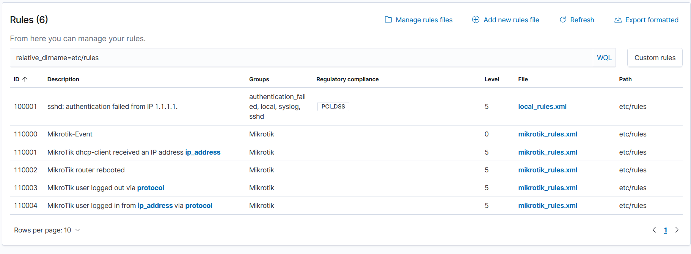

Figure — Verifying that custom rules are seen and applied in the SIEM architecture

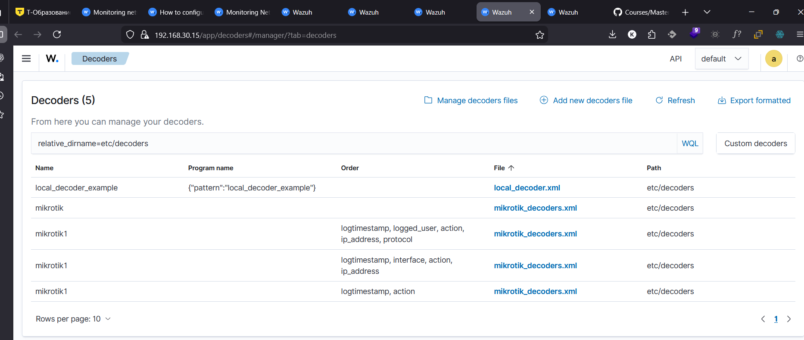

Figure — Verifying that custom decoders are seen and applied in the SIEM architecture

---

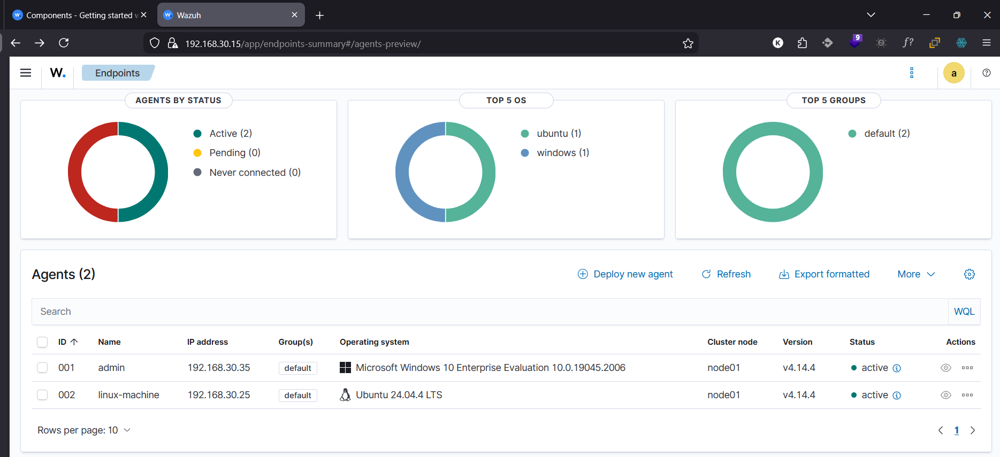

Figure 2.1 — SIEM dashboard showing all connected agents/devices

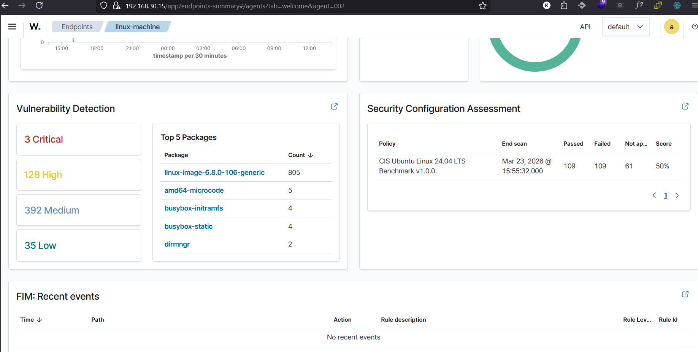

Figure 2.2 — Log data visible from Device 1 (e.g. Linux)

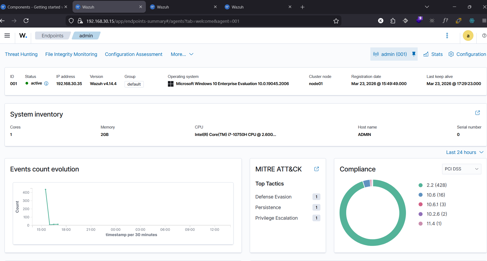

Figure 2.3 — Log data visible from Device 2 (e.g. Windows)

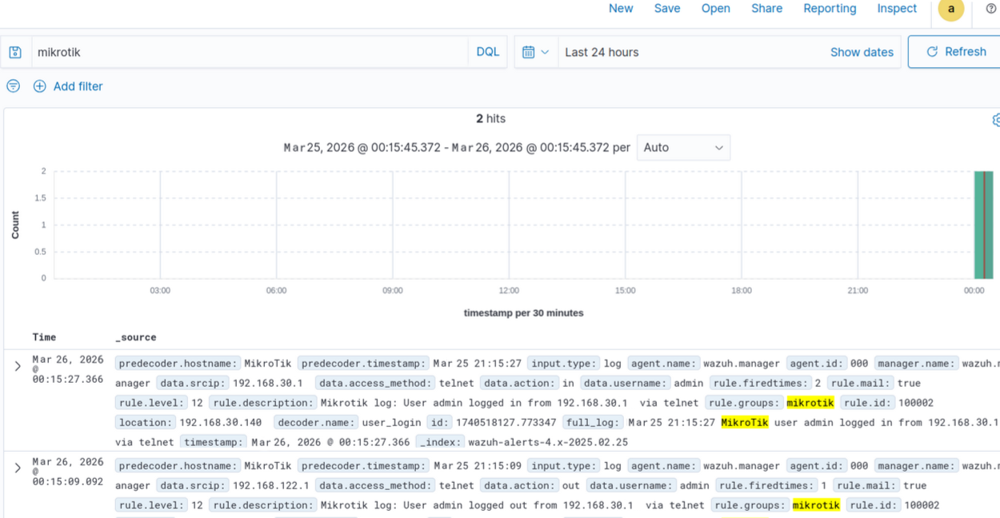

Figure 2.4 — Log data visible from Device 3 (e.g. Network device)

---

### b. Log Explanation — Why Can You View These Logs?

> **Log 1 — Creating file with touch inside `/etc` on Linux-Wazuh machine**
>

Log was triggered on PAM’s process: that login session was opened successfully started (I intentionally `ctrl+D`).

This is type of data log (`input.type:`)

Name of agents `Linux-Wazuh`

Command executed is seen bellow attribute `data.command`: */usr/bin/tee /etc/newfile.txt*

Rules attributes pointing to specific rule are part of this set of attributes:

```
**rule.level:**
    3
**rule.pci_dss:**
    10.2.5
**rule.hipaa:**
    164.312.b
**rule.tsc:**
    CC6.8, CC7.2, CC7.3
**rule.description:**
```

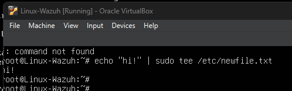

Figure — triggering log to appear

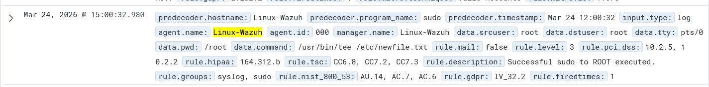

Figure 2.5 — Selected Log 1 detail in SIEM

> **Log 2 — Creating file with touch inside `/etc` on linux-machine**
>

Event is trigerred by me nano the file inside etc directory.

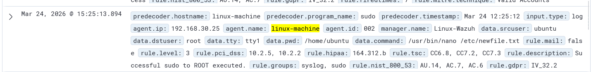

Figure 2.6 — Selected Log 2 detail in SIEM

---

## Task 3 — Use Cases *(B, C)*

### Use Case B — Brute Force Attack Detection

[Detecting a brute-force attack - Proof of Concept guide](https://documentation.wazuh.com/current/proof-of-concept-guide/detect-brute-force-attack.html)

*Describe the attack simulation tool used (e.g. Hydra, Medusa), target service (SSH, RDP, HTTP), and how detection rules are configured in the SIEM.*

```bash
# Example: simulate SSH brute force with Hydra
hydra -l root -P /usr/share/wordlists/rockyou.txt ssh://<target-ip> -t 4

# Check SIEM rule triggering for brute force (Wazuh rule 5551, 5712, etc.)
```

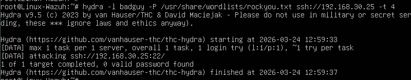

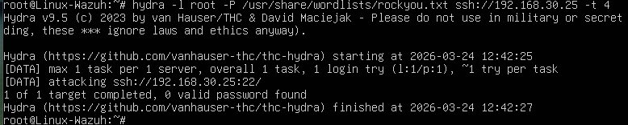

Figure 3b.1 — Brute force attack launched from attacker machine

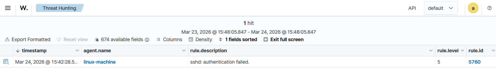

Figure 3b.2 — SIEM alert: brute force detected on Device 1

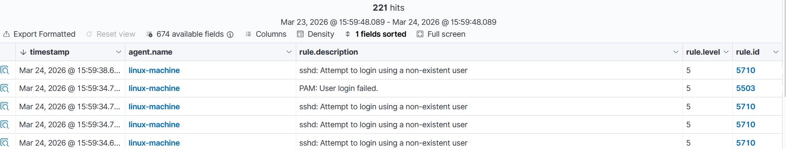

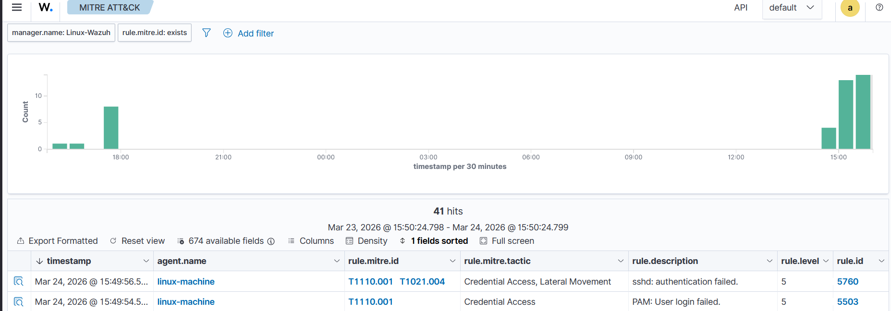

Figure 3b.3 — SIEM alert: brute force detected on Device 1

---

### Use Case C — CVE / Vulnerability Detection and Remediation

[Vulnerability detection - Proof of Concept guide · Wazuh documentation](https://documentation.wazuh.com/current/proof-of-concept-guide/poc-vulnerability-detection.html)

- Performed the following steps on the Wazuh server to confirm that the Wazuh Vulnerability Detection module is enabled and properly configured.
    - Check Vulnerability detection is enabled in Wazuh configuration `/var/ossec/etc/ossec.conf`

    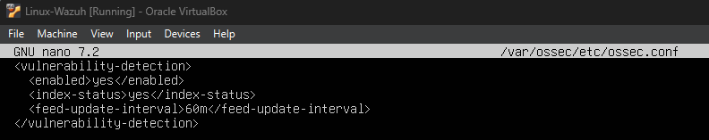

    Figure — `/var/ossec/etc/ossec.conf`

    - Check for host ip addres and certificates match the ones inside`filebeat.yml`

    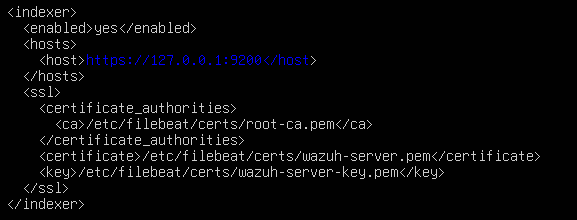

    Figure — `/var/ossec/etc/ossec.conf`

    

    

    Figure — `/etc/filebeat/filebeat.yml`

- reduced time for scanning for vulnerabilities to 7 minutes
 in the `/var/ossec/etc/ossec.conf` file on the Wazuh agent

    

    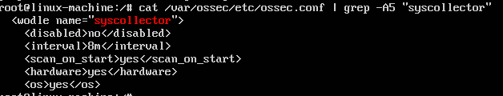

    Figures — changing interval on Wazuh Agent configuration

- Go to <https://192.168.30.15/app/vulnerability-detection> and open tab Inventory too look at Vulnerable detections
    - filtered them on my agent name
- Found 3 critical CVEs with `linux-image-6.8.0-106-generic`


Figures — 3 critical CVEs

- Removing this package

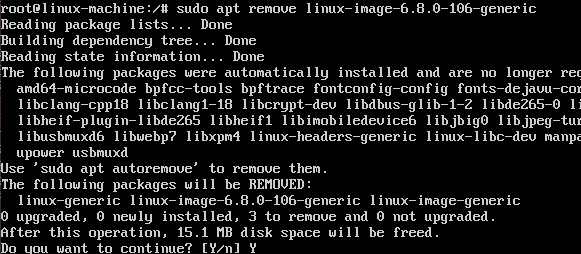

Figures — removing critical package


Figure 3c.6 — Remediation applied on Device 3

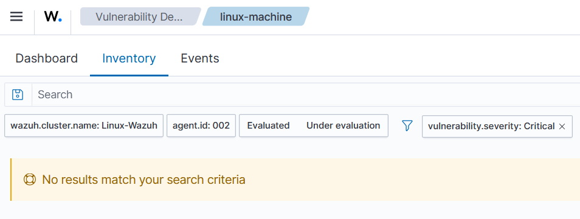

Figure 3c.7 — Updated scan showing vulnerability resolved on all devices

- Then to properly show how vulnerability would like when it is installed on running node, I decided to install this one package and check.


Figure — Installing vulnerable package (image)

- Now inside tab `Events` I can observe such vulnerable packet, that actualyy causes a lot of CVEs of different severity.

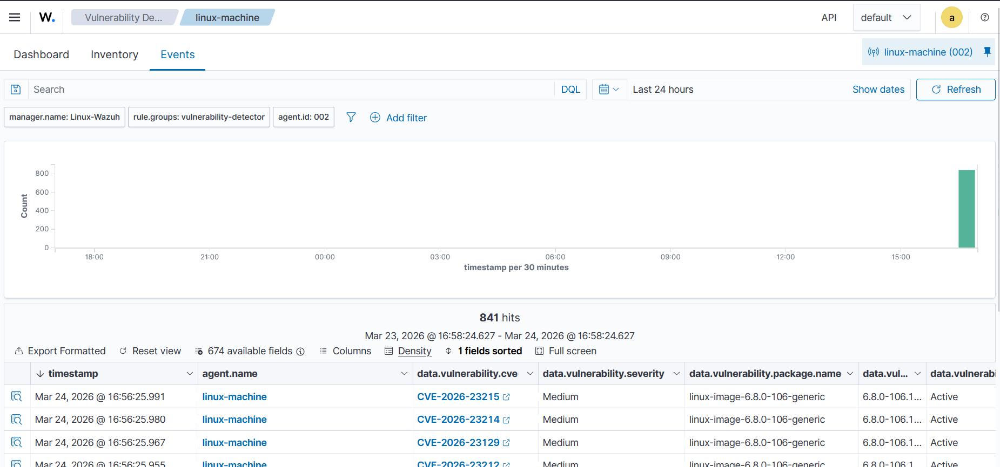

Figure — Events tab with targeted package

- Then I again uninstall it and was waiting to agent run again.

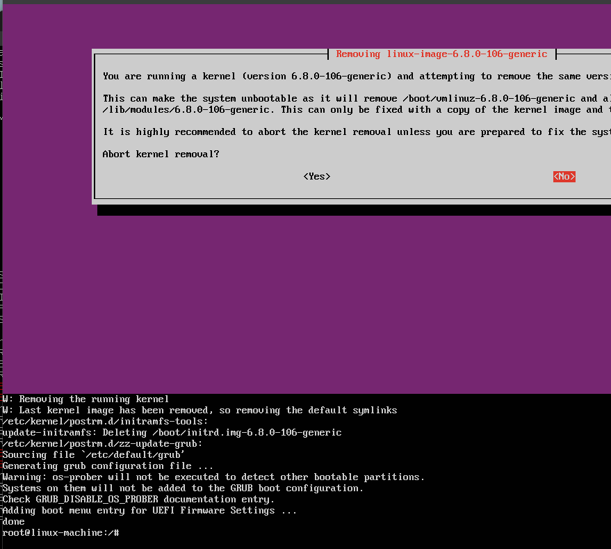

Figure — vulnerable image is uninstalled

- Event now is Resolved:

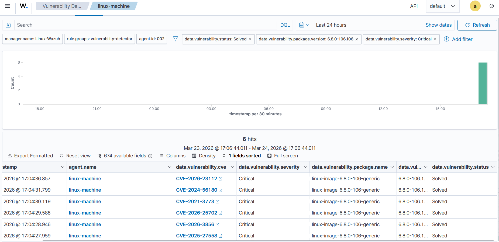

Figure — resolved status on all events with this package.

---

# Part B

## Task 4 — SIEM Integration *(malware)*

[Detecting malware using YARA integration - Proof of Concept guide](https://documentation.wazuh.com/current/proof-of-concept-guide/detect-malware-yara-integration.html)

> 🔴
>
> **NOTE 1:** A sample incident alert should be sent to the owner (you) of the attacked endpoint when alerts are detected for every use case.
>
> **NOTE 2:** **Please be careful — THESE ARE REAL MALWARE.** Handle in an isolated, sandboxed environment only.

---

### 2 — WhisperGate Detection with YARA / VirusTotal

### Configuring linux-machine with agent

- Install on linux-machine YARA

```bash
sudo apt update
sudo apt install -y make gcc autoconf libtool libssl-dev pkg-config
sudo curl -LO https://github.com/VirusTotal/yara/archive/v4.5.5.tar.gz
sudo tar -xvzf v4.5.5.tar.gz -C /usr/local/bin/ && rm -f v4.5.5.tar.gz
cd /usr/local/bin/yara-4.5.5/
sudo ./bootstrap.sh && sudo ./configure && sudo make && sudo make install && sudo make check
```

- Test that YARA is running

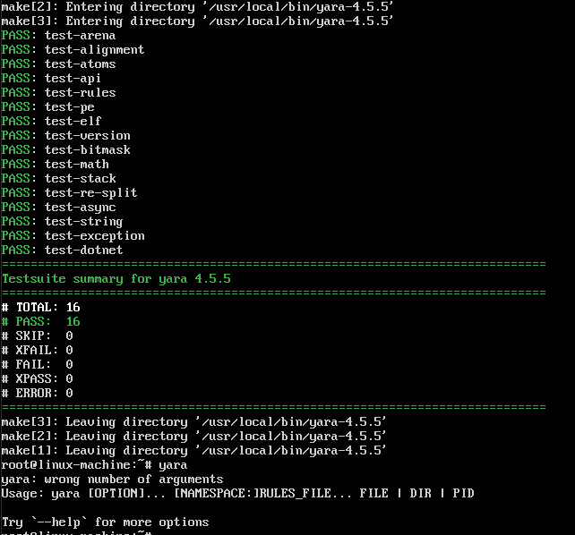

- Download YARA detection rules:

```bash
sudo mkdir -p /tmp/yara/rules
sudo curl 'https://valhalla.nextron-systems.com/api/v1/get' -H 'Accept: text/html,application/xhtml+xml,application/xml;q=0.9,*/*;q=0.8' -H 'Accept-Language: en-US,en;q=0.5' --compressed -H 'Referer: https://valhalla.nextron-systems.com/' -H 'Content-Type: application/x-www-form-urlencoded' -H 'DNT: 1' -H 'Connection: keep-alive' -H 'Upgrade-Insecure-Requests: 1' --data 'demo=demo&apikey=1111111111111111111111111111111111111111111111111111111111111111&format=text' -o /tmp/yara/rules/yara_rules.yar
```

- Added more rules specifically for whispergate malware.
Download detection rules to `/tmp/yara/rules`. Rules are downloaded from this [link](https://github.com/cado-security/DFIR_Resources_Whispergate/blob/main/YARA/WhisperGate.yara).

    ```
    rule Whispergate_Stage_1 {
        meta:
          description = "Detects first stage payload from WhisperGate"
          author = "mmuir@cadosecurity.com"
          date = "2022-01-17"
          license = "Apache License 2.0"
          hash = "a196c6b8ffcb97ffb276d04f354696e2391311db3841ae16c8c9f56f36a38e92"
        strings:
          $a = { 31 41 56 4E 4D 36 38 67 6A 36 50 47 50 46 63 4A 75 66 74 4B 41 54 61 34 57 4C 6E 7A 67 38 66 70 66 76 }
          $b = { 38 42 45 44 43 34 31 31 30 31 32 41 33 33 42 41 33 34 46 34 39 31 33 30 44 30 46 31 38 36 39 39 33 43 36 41 33 32 44 41 44 38 39 37 36 46 36 41 35 44 38 32 43 31 45 44 32 33 30 35 34 43 30 35 37 45 43 45 44 35 34 39 36 46 36 35 }
          $c = { 24 31 30 6B 20 76 69 61 20 62 69 74 63 6F 69 6E 20 77 61 6C 6C 65 74 }
          $d = { 74 6F 78 20 49 44 }
        condition:
          uint16(0) == 0x5A4D and all of them
    }

    rule Whispergate_Stage_2 {
        meta:
          description = "Detects second stage payload from WhisperGate"
          author = "mmuir@cadosecurity.com"
          date = "2022-01-17"
          license = "Apache License 2.0"
          hash = "dcbbae5a1c61dbbbb7dcd6dc5dd1eb1169f5329958d38b58c3fd9384081c9b78"
        strings:
          $a = { 6D 5F 49 6E 74 65 72 63 65 70 74 6F 72 }
          $b = { 6D 5F 62 31 36 65 37 33 65 30 64 61 61 63 34 62 34 33 62 36 35 36 36 39 30 31 62 35 34 32 34 63 35 33 }
          $c = { 6D 5F 34 33 37 37 33 32 63 65 65 35 66 35 34 64 37 64 38 34 61 64 64 37 62 64 33 30 39 37 64 33 63 61 }
          $d = { 6D 5F 30 64 62 39 37 30 38 63 66 36 34 39 34 30 38 32 39 66 39 61 66 38 37 65 64 65 65 64 66 36 30 65 }
          $e = { 6D 5F 65 31 34 33 33 31 36 38 32 30 62 31 34 64 30 33 38 38 61 37 32 37 34 34 33 38 65 63 30 37 38 64 }
          $f = { 6D 5F 66 33 31 30 39 30 63 37 31 35 64 65 34 62 30 62 61 62 64 33 31 61 36 33 34 31 31 30 34 36 63 38 }
          $g = { 6D 5F 36 31 31 64 31 61 62 63 33 32 66 63 34 66 64 38 61 33 34 65 30 34 34 66 39 37 33 34 34 31 64 61 }
          $h = { 6D 5F 37 37 34 62 39 32 31 30 64 39 38 31 34 32 65 62 62 34 34 31 33 35 35 39 64 61 61 65 35 61 34 34 }
        condition:
          uint16(0) == 0x5A4D and all of them
    }
    ```

- Create a `yara.sh` script in the `/var/ossec/active-response/bin/` directory. This is necessary for the Wazuh-YARA Active Response scan

    ```
    #!/bin/bash
    # Wazuh - Yara active response
    # Copyright (C) 2015-2022, Wazuh Inc.
    #
    # This program is free software; you can redistribute it
    # and/or modify it under the terms of the GNU General Public
    # License (version 2) as published by the FSF - Free Software
    # Foundation.

    #------------------------- Gather parameters -------------------------#

    # Extra arguments
    read INPUT_JSON
    YARA_PATH=$(echo $INPUT_JSON | jq -r .parameters.extra_args[1])
    YARA_RULES=$(echo $INPUT_JSON | jq -r .parameters.extra_args[3])
    FILENAME=$(echo $INPUT_JSON | jq -r .parameters.alert.syscheck.path)

    # Set LOG_FILE path
    LOG_FILE="logs/active-responses.log"

    size=0
    actual_size=$(stat -c %s ${FILENAME})
    while [ ${size} -ne ${actual_size} ]; do
        sleep 1
        size=${actual_size}
        actual_size=$(stat -c %s ${FILENAME})
    done

    #----------------------- Analyze parameters -----------------------#

    if [[ ! $YARA_PATH ]] || [[ ! $YARA_RULES ]]
    then
        echo "wazuh-yara: ERROR - Yara active response error. Yara path and rules parameters are mandatory." >> ${LOG_FILE}
        exit 1
    fi

    #------------------------- Main workflow --------------------------#

    # Execute Yara scan on the specified filename
    yara_output="$("${YARA_PATH}"/yara -w -r "$YARA_RULES" "$FILENAME")"

    if [[ $yara_output != "" ]]
    then
        # Iterate every detected rule and append it to the LOG_FILE
        while read -r line; do
            echo "wazuh-yara: INFO - Scan result: $line" >> ${LOG_FILE}
        done <<< "$yara_output"
    fi

    exit 0;
    ```


- Change `yara.sh` file owner to `root:wazuh` and file permissions to `0750`:

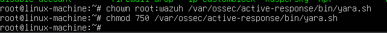

- Add the following within the `<syscheck>` block of the Wazuh agent `/var/ossec/etc/ossec.conf` configuration file to monitor the  directory

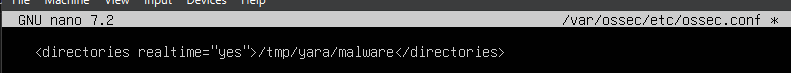

- Restart the Wazuh agent

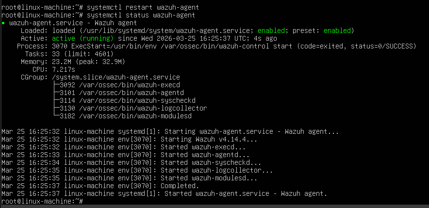

---

### Configuring Wazuh server

- Add the following rules to the `/var/ossec/etc/rules/local_rules.xml`
 file. The rules detect FIM events in the monitored directory. They also
 alert when the YARA integration finds malware. You can modify the rules
 to detect events from other directories:
    - Copied prev version, then added new groups and copied back

    ```
    <group name="syscheck,">
      <rule id="100300" level="7">
        <if_sid>550</if_sid>
        <field name="file">/tmp/yara/malware/</field>
        <description>File modified in /tmp/yara/malware/ directory.</description>
      </rule>
      <rule id="100301" level="7">
        <if_sid>554</if_sid>
        <field name="file">/tmp/yara/malware/</field>
        <description>File added to /tmp/yara/malware/ directory.</description>
      </rule>
    </group>

    <group name="yara,">
      <rule id="108000" level="0">
        <decoded_as>yara_decoder</decoded_as>
        <description>Yara grouping rule</description>
      </rule>
      <rule id="108001" level="12">
        <if_sid>108000</if_sid>
        <match>wazuh-yara: INFO - Scan result: </match>
        <description>File "$(yara_scanned_file)" is a positive match. Yara rule: $(yara_rule)</description>
      </rule>
    </group>
    ```

    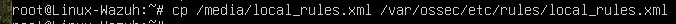

- Add decoders to local `var/ossec/etc/decoders/local_decoder.xml`, so that YARA stuff will be decoded properly
    - Copied prev version, then added new groups and copied back

    ```
    <decoder name="yara_decoder">
      <prematch>wazuh-yara:</prematch>
    </decoder>

    <decoder name="yara_decoder1">
      <parent>yara_decoder</parent>
      <regex>wazuh-yara: (\S+) - Scan result: (\S+) (\S+)</regex>
      <order>log_type, yara_rule, yara_scanned_file</order>
    </decoder>
    ```

    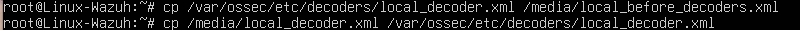

- Add the following configuration to the Wazuh server `/var/ossec/etc/ossec.conf` configuration file. This configures the Active Response module to trigger after the rule 100300 and 100301 are fired:
    - Copied prev version, then added new groups and copied back

    ```
    <ossec_config>
      <command>
        <name>yara_linux</name>
        <executable>yara.sh</executable>
        <extra_args>-yara_path /usr/local/bin -yara_rules /tmp/yara/rules/yara_rules.yar</extra_args>
        <timeout_allowed>no</timeout_allowed>
      </command>

      <active-response>
        <disabled>no</disabled>
        <command>yara_linux</command>
        <location>local</location>
        <rules_id>100300,100301</rules_id>
      </active-response>
    </ossec_config>
    ```

    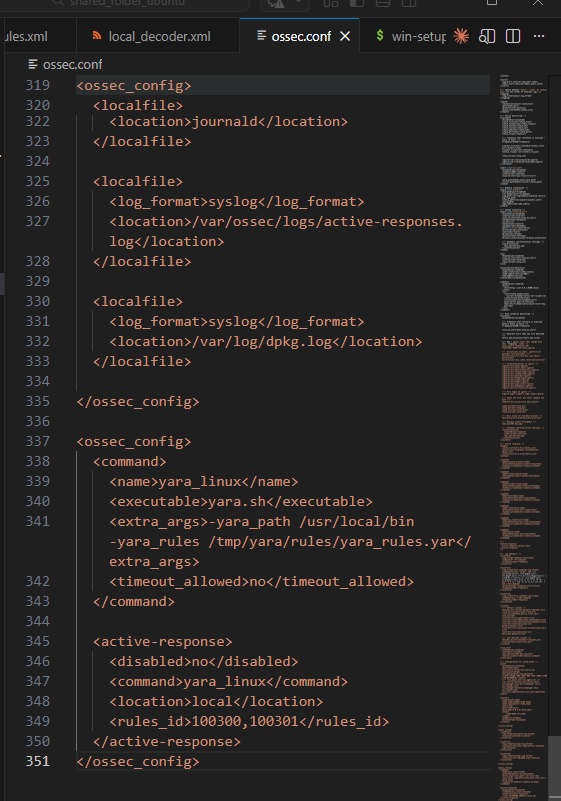

- Restart the Wazuh manager to apply the configuration changes:

    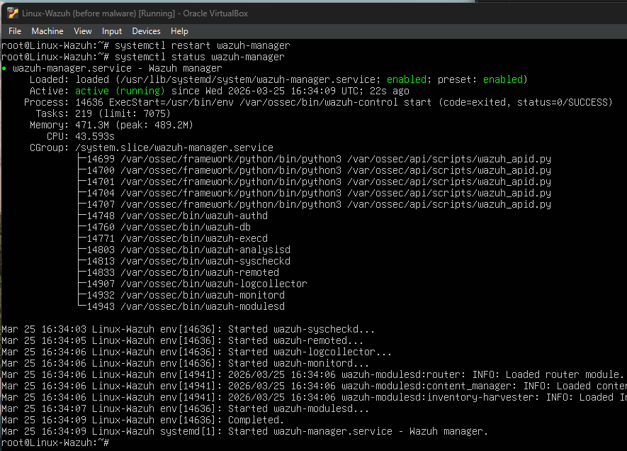

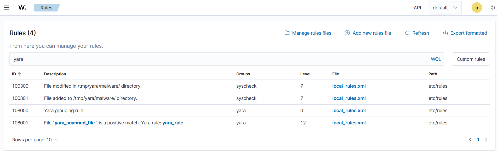

Figure — YARA integration configured in SIEM (Rules)

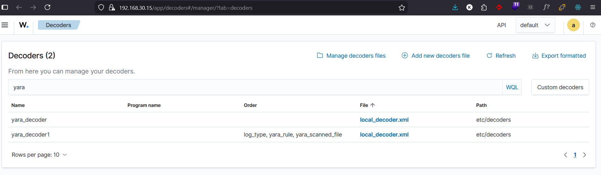

Figure — YARA integration configured in SIEM (Rules)

### Installing malware and attacking myself with it

- Now I downloaded malware sample and placed inside`/tmp/yara/malware`

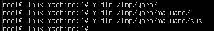

```bash
git clone https://github.com/cado-security/DFIR_Resources_Whispergate
cd DFIR_Resources_Whispergate/Samples
unzip -P "infected" a196c6b8ffcb97ffb276d04f354696e2391311db3841ae16c8c9f56f36a38e92.zip
mv a1* /tmp/yara/malware/sus
```

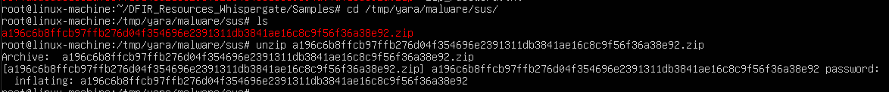

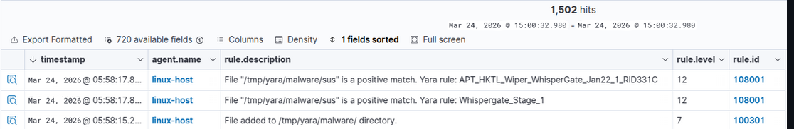

Figure — WhisperGate sample detected (no execution)

---

# Bonus

> ⭐
>
> **Bonus tasks — complete for extra credit.**

### Bonus 1 — Automate Incident Alert Notifications

*Automate the sample incident alerts sent in the use cases section using any platform of choice (e.g. email via Postfix, Slack webhook, PagerDuty, Shuffle SOAR).*

*Describe the automation platform chosen and how it is connected to the SIEM alert pipeline.*

```bash
# Example: Wazuh custom integration for Slack notification
# /var/ossec/integrations/custom-slack
curl -X POST -H 'Content-type: application/json' \
  --data '{"text":"SIEM Alert: '"$ALERT_DESCRIPTION"'"}' \
  https://hooks.slack.com/services/YOUR/WEBHOOK/URL
```

[Figure B1.1 — Automated alert notification platform configured](https://via.placeholder.com/800x400?text=Figure+B1.1+—+Alert+Automation+Setup)

Figure B1.1 — Automated alert notification platform configured

[Figure B1.2 — Automated incident alert received (email / Slack / etc.)](https://via.placeholder.com/800x400?text=Figure+B1.2+—+Alert+Received)

Figure B1.2 — Automated incident alert received (email / Slack / etc.)

---

# References

1. Install Mikrotik chr on Virtual box [[image vdi](https://www.mikrotik-software.de/download.mikrotik.com/routeros/7.16.1/chr-7.16.1.vdi.zip)] [[guide](https://help.mikrotik.com/docs/spaces/ROS/pages/262864931/CHR+installing+on+VirtualBox)].
2. Windows QEMU has VNC console type and Windows 7 w/ IE10. Default credentials: IEUser / Passw0rd!
3. Windows 11 installation from GNS3: <https://www.gns3.com/marketplace/appliances/windows-11-dev-env>
4. Official: <https://www.microsoft.com/ru-ru/software-download>

> **Fix - To Continue Enter An Admin Username And Password In Windows 11/ 10 || 'Yes' Button Missing**
>
> [Fix - To Continue Enter An Admin Username And Password In Windows 11/ 10 || 'Yes' Button Missing](https://www.youtube.com/watch?v=_fMYBwWJ2P4)
