# 5 MAC: AppArmor & SELinux

Name of report: AppArmSELinux_LAB_5_Nikita_Niakhai
Course: Secure Development
Performed by Nikita Niakhai
Date submission: 03.04.2026
---

# Theory rehearsal

### MAC

**Key characteristics:**

- Centralized control: only admin(s) set rules and control the access policy, no one else can alter and chage it. System defines rules.
- No user discretion: user can not change and share access to his resources. He is a unit in the system without any oppurtunity to effect access policy.
- Policy based: rules in the system defined by formal policies.
- High Security assurance: we are confident that system is not misconfigured and there are no data breaches, everything is setup precisely without any bugs

**Types of MAC:**

- multi level: simple hierarchy
- multi lateral: many sides, each side has its own level.

**Working of MAC:**

- signal to check right
- waking up MAC to evaluate clearance and classification and compare them

**Policy:**

Each object can be defined into a group of objects

Each level access (clearance) has his access rules to each group of objects

**Clearance (con, context)** — is a security context that each process/user has. Basically a user.

**Classification** — . Basically a resource we want to access.

**Practical examples:**

`ls -Z object_path` - used to check MAC’s clearance, gives output:

`[user]:[role]:[type]:[level]`

- `type` = classification (e.g., `user_home_t`)
- `level` = sensitivity (e.g., `s0`)

Used in MAC implementations such as in `SELinux`, `AppArmor`. There is a mechanism that checks files/directories classification (labels) and compares with users clearance, if they do not match → no access. Creates access control that works on the top of UNIX `chmod`, `chown`.

[Mandatory Access Control - GeeksforGeeks](https://www.geeksforgeeks.org/ethical-hacking/mandatory-access-control/)

# PART A – AppArmor

---

## A1 – CIS Benchmarks: How They Are Checked on an Endpoint

CIS benchmarks are checked using automated compliance scanners
that audit system settings against published CIS controls. In a SIEM context (e.g. Wazuh),
the agent runs CIS-CAT or the built-in SCA (Security Configuration Assessment) module,
comparing current settings to expected benchmark values and reporting pass/fail results
to the SIEM dashboard.

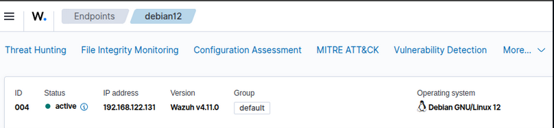

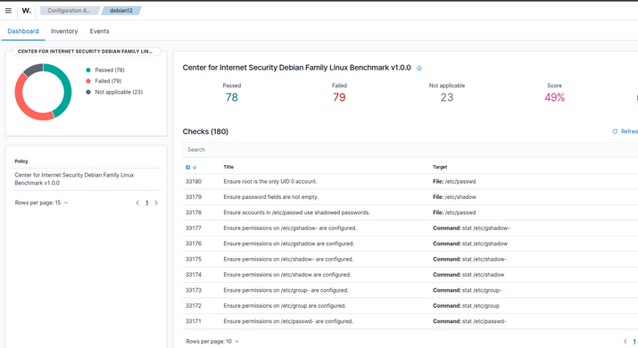

Figure. Figure CIS benchamarks are checked

SCA policy checks could be enabled and configured from manager config [[ref.](https://documentation.wazuh.com/current/user-manual/capabilities/sec-config-assessment/available-sca-policies.html)]

---

## A2 – CIS Benchmark: MAC Section (AppArmor Controls)

Linux Ubuntu 22.04

### 1.6.1 – Ensure AppArmor is installed

```bash
sudo apt install -y apparmor apparmor-utils apparmor-profiles apparmor-profiles-extra
```

### 1.6.1.1 – Ensure AppArmor is enabled in the bootloader

```bash
# Check current GRUB config
grep "GRUB_CMDLINE_LINUX" /etc/default/grub

# Add apparmor=1 and security=apparmor to GRUB
sudo sed -i 's/GRUB_CMDLINE_LINUX="\(.*\)"/GRUB_CMDLINE_LINUX="\1 apparmor=1 security=apparmor"/' \
  /etc/default/grub

# Verify the change
grep "GRUB_CMDLINE_LINUX" /etc/default/grub

# Update GRUB
sudo update-grub

# Reboot to apply kernel parameters
sudo reboot
```

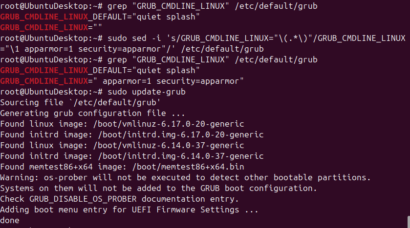

Figure. AppArmor is verified to be installed at grub level

### After reboot – Verify AppArmor is active

```bash
# Check AppArmor status
sudo apparmor_status

# Or via systemd
sudo systemctl status apparmor

# Verify kernel parameter
cat /proc/cmdline | grep apparmor
```

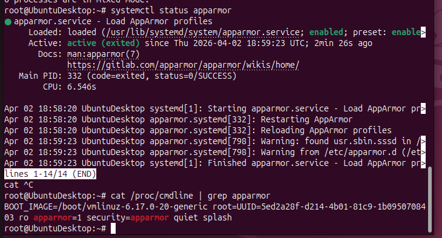

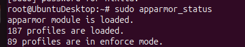

Figure. AppArmor is active and profiles are loaded

### 1.6.1.2 – Ensure all AppArmor profiles are in enforce mode

```bash
# Check current profile status
sudo aa-status

# Set all loaded profiles to enforce mode
sudo aa-enforce /etc/apparmor.d/*
```

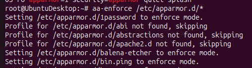

Figure. Enforcing profiles

```bash
# Load all available profiles
sudo apparmor_parser -r /etc/apparmor.d/*

# Verify: no profiles should be in complain mode
sudo aa-status | grep "profiles are in complain mode"
# Should return: 0 profiles are in complain mode

# Check for unconfined processes
sudo aa-status | grep "processes are unconfined"
```

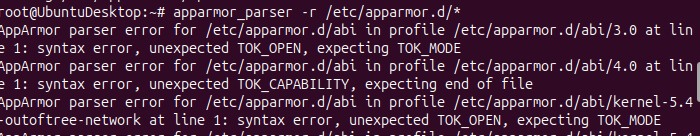

Figure. Loading all available profiles

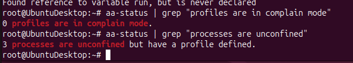

Figure. Verifying complain mode for profiles and unconfined processes

### Additional Hardening (CIS-aligned)

```bash
# Install audit daemon for AppArmor logging
sudo apt install -y auditd audispd-plugins

sudo systemctl enable auditd
sudo systemctl start auditd

# Configure auditd for AppArmor events
sudo tee -a /etc/audit/rules.d/apparmor.rules << 'EOF'
## AppArmor audit rules
-w /etc/apparmor/ -p wa -k apparmor_config
-w /etc/apparmor.d/ -p wa -k apparmor_profiles
EOF
```

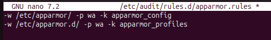

Figure. `auditd` for AppArmor events

```bash
sudo service auditd restart

# Verify AppArmor kernel module is loaded
sudo cat /sys/module/apparmor/parameters/enabled
# Should return: Y

# Check AppArmor filesystem
ls /sys/kernel/security/apparmor/

# List all profiles and their modes
sudo aa-status --json | python3 -m json.tool
```

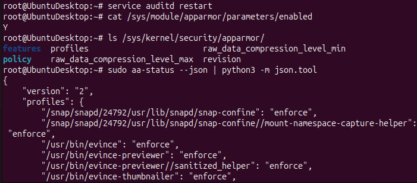

Figure. `auditd` restarted, profiles and their model listed and verified manually

### Ensure AppArmor starts on boot

```bash
sudo systemctl enable apparmor
sudo systemctl is-enabled apparmor
# Should output: enabled
```

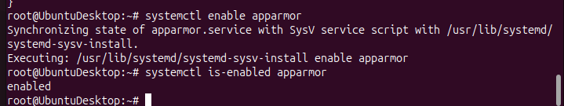

Figure. Reloading AppArmor

---

## A3 – Webapp Serving Two Directories with AppArmor Confinement

This section deploys Nginx to serve files from two directories (`/var/www/allowed` and
`/var/www/restricted`), then uses AppArmor to confine Nginx to only one directory.

### Step 1 – Install Nginx

```bash
sudo apt install -y nginx

# Enable and start nginx
sudo systemctl enable nginx
sudo systemctl start nginx
sudo systemctl status nginx
```

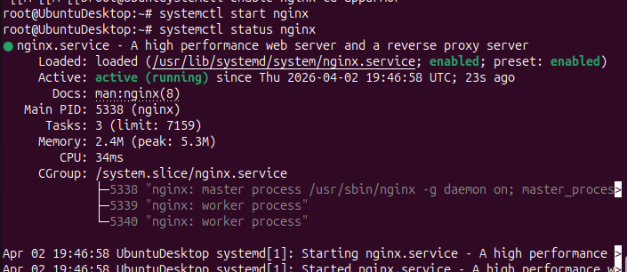

Figure. Nginx is installed

### Step 2 – Create two content directories

```bash
# Create directories
sudo mkdir -p /var/www/allowed
sudo mkdir -p /var/www/restricted

# Create test files in each directory
echo "<h1>ALLOWED DIRECTORY - This file is publicly accessible</h1>" \
  | sudo tee /var/www/allowed/index.html

echo "<h1>RESTRICTED DIRECTORY - This should be blocked by AppArmor</h1>" \
  | sudo tee /var/www/restricted/secret.html

# Set ownership
sudo chown -R www-data:www-data /var/www/allowed
sudo chown -R www-data:www-data /var/www/restricted

# Set permissions
sudo chmod -R 755 /var/www/allowed
sudo chmod -R 755 /var/www/restricted

# Verify
ls -la /var/www/allowed/
ls -la /var/www/restricted/
```

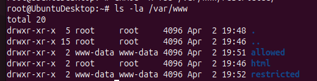

Figure. Ownership and Permissions for web files

### Step 3 – Configure Nginx to serve both directories

```bash
# Create Nginx configuration
sudo tee /etc/nginx/sites-available/lab5 << 'EOF'
server {
    listen 80;
    server_name _;

    # Serve the allowed directory at /allowed
    location /allowed/ {
        alias /var/www/allowed/;
        autoindex on;
    }

    # Serve the restricted directory at /restricted
    location /restricted/ {
        alias /var/www/restricted/;
        autoindex on;
    }

    # Default location
    location / {
        return 200 "Lab5 AppArmor Demo Server\n";
        add_header Content-Type text/plain;
    }
}
EOF

# Enable the site and disable the default
sudo ln -sf /etc/nginx/sites-available/lab5 /etc/nginx/sites-enabled/lab5
sudo rm -f /etc/nginx/sites-enabled/default

# Test Nginx configuration
sudo nginx -t

# Reload Nginx
sudo systemctl reload nginx
```

### Step 4 – Verify BOTH directories are accessible (AppArmor INACTIVE)

```bash
# Get server IP
SERVER_IP=$(hostname -I | awk '{print $1}')
echo "Server IP:$SERVER_IP"

# Test allowed directory
curl -v http://localhost/allowed/index.html
# Expected: 200 OK with "ALLOWED DIRECTORY" content

# Test restricted directory
curl -v http://localhost/restricted/secret.html
# Expected: 200 OK with "RESTRICTED DIRECTORY" content (AppArmor not yet active)

# Check AppArmor status for nginx
sudo aa-status | grep nginx
```

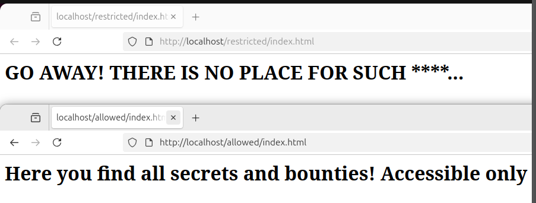

Figure. Accessing web directories

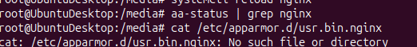

Figure. Preparing AppArmor for nginx profile

### Step 5 – Check the existing Nginx AppArmor profile

```bash
# View the default nginx profile
sudo cat /etc/apparmor.d/usr.sbin.nginx

# Or if not present, install extra profiles
sudo apt install -y apparmor-profiles-extra

# List all available profiles
ls /etc/apparmor.d/ | grep -i ngin
```

- No profile for `nginx` by default, so let’s create one

### Step 6 – Create a custom AppArmor profile for Nginx

```bash
# First, put the existing nginx profile in complain mode to see what it accesses
sudo aa-complain /usr/sbin/nginx 2>/dev/null || true

# Now create a custom restrictive profile
sudo tee /etc/apparmor.d/usr.sbin.nginx << 'PROFILE'
#include <tunables/global>

/usr/sbin/nginx {
  #include <abstractions/base>
  #include <abstractions/nameservice>
  #include <abstractions/openssl>

  capability dac_override,
  capability net_bind_service,
  capability setgid,
  capability setuid,

  # Binary
  /usr/sbin/nginx mr,

  # Configuration files
  /etc/nginx/** r,
  /etc/ssl/** r,

  # PID and lock files
  /run/nginx.pid rw,
  /var/lock/nginx.lock rw,

  # Logs
  /var/log/nginx/ rw,
  /var/log/nginx/** rw,

  # Temporary files
  /var/lib/nginx/ rw,
  /var/lib/nginx/** rw,
  /tmp/ rw,
  /tmp/** rw,

  # ALLOWED DIRECTORY - Nginx CAN read this
  /var/www/allowed/ r,
  /var/www/allowed/** r,

  # RESTRICTED DIRECTORY - intentionally OMITTED
  # /var/www/restricted/ r,   <-- NOT ALLOWED
  # /var/www/restricted/** r, <-- NOT ALLOWED

  # System libraries
  /lib/** mr,
  /usr/lib/** mr,
  /usr/share/nginx/** r,

  # Network
  network tcp,
  network udp,
}
PROFILE

echo "Custom AppArmor profile created."
```

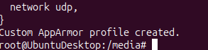

Figure. Profile for `nginx` is created

### Step 7 – Load and enforce the Nginx AppArmor profile

```bash
# Parse and load the profile
sudo apparmor_parser -r /etc/apparmor.d/usr.sbin.nginx

# Set to enforce mode
sudo aa-enforce /usr/sbin/nginx

# Verify profile is loaded and enforcing
sudo aa-status | grep -A2 nginx

# Restart Nginx so the new confinement applies
sudo systemctl restart nginx
sudo systemctl status nginx
```

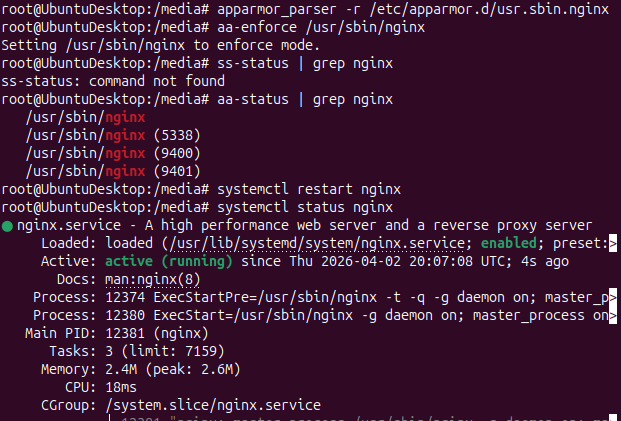

Figure. Reloading, parsing, applying profiles and services

### Step 8 – Verify directory access WITH AppArmor ENFORCING

```bash
# Test allowed directory - SHOULD SUCCEED
echo "=== Testing ALLOWED directory (should work) ==="
curl -v http://localhost/allowed/index.html
echo ""

# Test restricted directory - SHOULD FAIL (403 or empty)
echo "=== Testing RESTRICTED directory (should be blocked) ==="
curl -v http://localhost/restricted/secret.html
echo ""

# Check AppArmor denial logs
sudo dmesg | grep -i "apparmor.*DENIED" | tail -20
# OR
sudo tail -20 /var/log/syslog | grep -i apparmor
# OR
sudo ausearch -m avc --start today 2>/dev/null | grep nginx
```

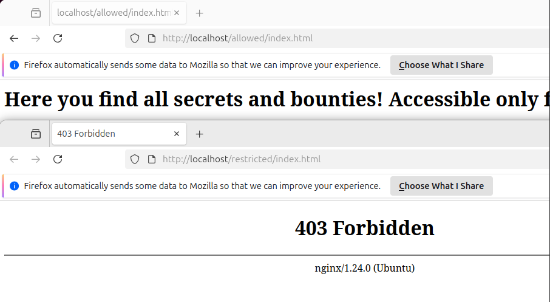

Figure. Hardening and MAC applied

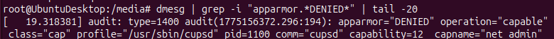

Figure.

### Step 9 – External access test (from another machine or using port-forwarding)

```bash
# Allow HTTP through firewall
sudo ufw allow 80/tcp
sudo ufw enable

# From a remote client, test:
# curl http://<SERVER_IP>/allowed/index.html   → Should succeed
# curl http://<SERVER_IP>/restricted/secret.html → Should be blocked/403

# View real-time AppArmor logs while testing
sudo journalctl -f | grep apparmor &

# Or monitor syslog
sudo tail -f /var/log/syslog | grep -i "apparmor"
```

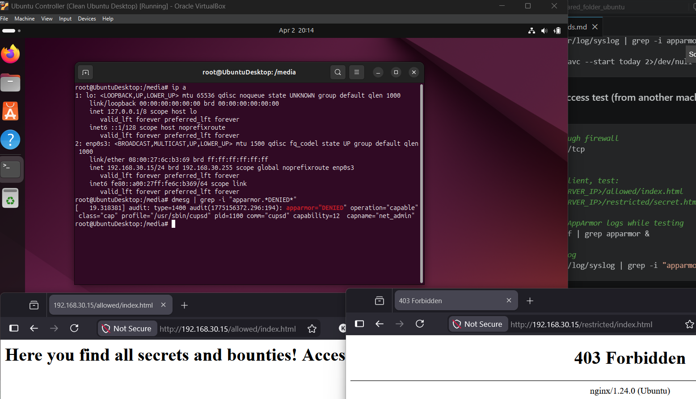

Figure. External access to web directories (AppArmor applied)

### Step 10 – Temporarily disable AppArmor to confirm both work again

```bash
# Put profile in complain mode (logging only, no blocking)
sudo aa-complain /usr/sbin/nginx

sudo systemctl restart nginx

# Now BOTH should succeed
curl http://localhost/allowed/index.html
curl http://localhost/restricted/secret.html

# Re-enforce
sudo aa-enforce /usr/sbin/nginx
sudo systemctl restart nginx
```

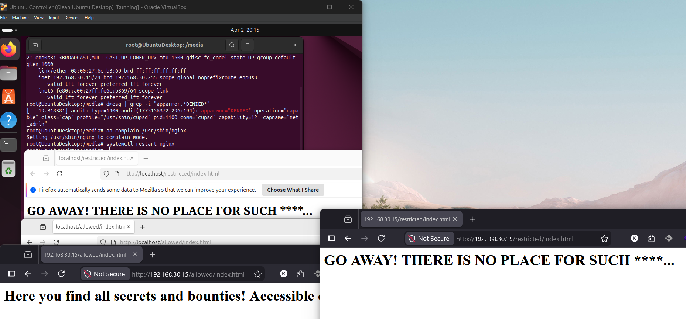

Figure. External access to web directories (AppArmor disabled)

---

## A4 – How AppArmor Uses Default Profiles to Secure Services

- Each process/system (`usr.sbin/apache2`) has it’s own default profile inside apparmor etc directory (`/etc/apparmor.d/`) which defines files, directories, network access, system calls and their access policies respectively. Works at the top of UNIX chown/chmod rules. Not defined routes and accesses are blocked.
- List active profiles `sudo aa-status`. Mode profiles: enforce (block undefined actions), complain (allow but log violations).
- Add custom rule:

    ```bash
    nano /etc/apparmor.d/usr.bin.httpd
    	# add line
    	/srv/data/** r, # read inside this directory all files and stuff recursively

    sudo systemctl restart apparmor
    ```

**List of useful commands:**

```bash
# List all pre-installed default profiles
ls /etc/apparmor.d/

# View a common default profile (e.g., cups)
sudo cat /etc/apparmor.d/usr.sbin.cupsd

# View abstractions that profiles include
ls /etc/apparmor.d/abstractions/

# Example: see what the 'base' abstraction permits
sudo cat /etc/apparmor.d/abstractions/base

# See which processes are currently confined
sudo aa-status

# See processes WITHOUT a profile (unconfined)
sudo aa-status | grep "unconfined"

# Check profile for a specific binary
sudo apparmor_parser -p /etc/apparmor.d/usr.sbin.nginx

# Display profile details
sudo aa-status --json | python3 -c "
import sys, json
data = json.load(sys.stdin)
for mode, profs in data.get('profiles', {}).items():
    print(f'Mode: {mode}')
    for p in profs[:5]:
        print(f'  {p}')
"
```

---

## A5 – Troubleshooting AppArmor Confinement Issues

When your Webapp fails to start or misbehaves after AppArmor enforcement:

### Step 1 – Identify the problem

```bash
# Check service status
sudo systemctl status nginx

# Check AppArmor logs for denials
sudo dmesg | grep apparmor | tail -30
sudo grep -i apparmor /var/log/syslog | tail -30
sudo grep -i "DENIED" /var/log/kern.log | tail -30

# If auditd is installed
sudo ausearch -m avc --start recent
```

### Step 2 – Switch to Complain mode (non-blocking logging)

```bash
# Complain mode: log denials but don't block
sudo aa-complain /usr/sbin/nginx
sudo systemctl restart nginx

# Now reproduce the issue
curl http://localhost/restricted/secret.html

# Read what was denied/allowed
sudo aa-logprof   # Interactive: reviews logs and suggests profile updates
# OR
sudo cat /var/log/syslog | grep apparmor
```

### Step 3 – Use aa-logprof to auto-update the profile

```bash
# After running in complain mode, run aa-logprof to analyse
sudo aa-logprof

# It will interactively show denied operations and suggest additions
# Press 'A' to allow, 'D' to deny, 'S' to save

# After updating, re-enforce
sudo aa-enforce /usr/sbin/nginx
sudo systemctl restart nginx
```

### Step 4 – Manually edit the profile to add missing permissions

```bash
# Edit profile
sudo vim /etc/apparmor.d/usr.sbin.nginx

# Example fix: if nginx needs /var/www/uploads/
# Add inside the profile block:
#   /var/www/uploads/ r,
#   /var/www/uploads/** rw,

# After editing, reload the profile
sudo apparmor_parser -r /etc/apparmor.d/usr.sbin.nginx

# Restart the service
sudo systemctl restart nginx

# Verify no more denials
sudo dmesg | grep apparmor | tail -10
```

### Step 5 – Use aa-genprof to generate a fresh profile

```bash
# Generate a brand-new profile for a binary
sudo aa-genprof /usr/sbin/nginx

# In another terminal, exercise the application:
#   curl http://localhost/allowed/index.html
#   curl http://localhost/restricted/secret.html
# Then come back and press 'S' to scan logs and 'F' to finish

# The new profile will be in complain mode; enforce when satisfied
sudo aa-enforce /usr/sbin/nginx
```

### Step 6 – Disable AppArmor for one profile only (last resort)

```bash
# Disable just nginx profile without disabling AppArmor system-wide
sudo aa-disable /usr/sbin/nginx

# Or move to a safe backup
sudo mv /etc/apparmor.d/usr.sbin.nginx /etc/apparmor.d/usr.sbin.nginx.bak

# Re-enable later
sudo mv /etc/apparmor.d/usr.sbin.nginx.bak /etc/apparmor.d/usr.sbin.nginx
sudo apparmor_parser -r /etc/apparmor.d/usr.sbin.nginx
sudo aa-enforce /usr/sbin/nginx
```

---

# PART B – SELinux

---

## B1 – SELinux Explained (Conceptual Summary)

SELinux (Security-Enhanced Linux) is a MAC framework developed by the NSA, integrated
into the Linux kernel. It uses policy-based access control where every process, file,
and socket is labelled with a security context. Actions are only permitted if the
SELinux policy explicitly allows them — default is DENY.

Key concepts:
- **Labels / Contexts**: `user:role:type:level` (e.g., `system_u:system_r:httpd_t:s0`)’

- `type` = classification (e.g., `user_home_t`)
- `level` = sensitivity (e.g., `s0`)

- **Modes**: Enforcing (blocks + logs), Permissive (logs only), Disabled
- **Policy types**: Targeted (most services), MLS (multi-level security)
- **Boolean switches**: Toggle permissions without rewriting policy

---

## B2 – Deploy Webapp, Stress Test, Install SELinux, Compare

### Phase 1 – Deploy the Webapp (Python Flask on Ubuntu 22.04)

```bash
# Install Python and pip
sudo apt install -y python3 python3-pip python3-venv

# Create app directory
sudo mkdir -p /opt/webapp
cd /opt/webapp

# Create virtual environment
python3 -m venv venv
source venv/bin/activate

# Install Flask
pip install flask gunicorn

# Create the Flask app
cat > /opt/webapp/app.py << 'EOF'
from flask import Flask, jsonify
import time, os, socket

app = Flask(__name__)

@app.route('/')
def index():
    return jsonify({
        "status": "running",
        "host": socket.gethostname(),
        "pid": os.getpid()
    })

@app.route('/health')
def health():
    return jsonify({"healthy": True})

@app.route('/compute')
def compute():
    # Light CPU work
    result = sum(i*i for i in range(100000))
    return jsonify({"result": result})

if __name__ == '__main__':
    app.run(host='0.0.0.0', port=5000)
EOF

# Create systemd service for the webapp
sudo tee /etc/systemd/system/webapp.service << 'EOF'
[Unit]
Description=Lab5 Flask Webapp
After=network.target

[Service]
User=www-data
Group=www-data
WorkingDirectory=/opt/webapp
ExecStart=/opt/webapp/venv/bin/gunicorn --workers 4 --bind 0.0.0.0:5000 app:app
Restart=always
RestartSec=3

[Install]
WantedBy=multi-user.target
EOF

# Fix permissions
sudo chown -R www-data:www-data /opt/webapp

sudo systemctl daemon-reload
sudo systemctl enable webapp
sudo systemctl start webapp
sudo systemctl status webapp

# Test
curl http://localhost:5000/
curl http://localhost:5000/health
curl http://localhost:5000/compute
```

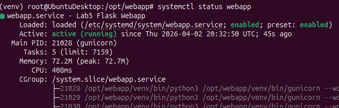

Figure. Webapp is running

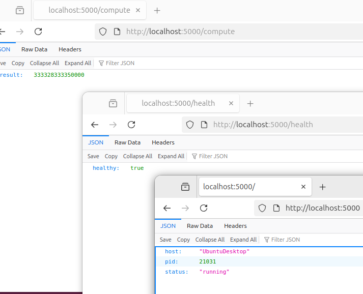

Figure. Webapp is accessible

### Phase 2 – Stress Test BEFORE SELinux (Baseline)

```bash
# Install stress testing tools
sudo apt install -y apache2-utils wrk stress sysstat

# Allow port 5000
sudo ufw allow 5000/tcp

# ---- Benchmark 1: Apache Bench (ab) ----
echo "=== Apache Bench Baseline (no SELinux) ==="
ab -n 5000 -c 50 -r http://localhost:5000/ 2>&1 | tee /tmp/baseline_ab.txt

# Show key results
grep -E "Requests per second|Time per request|Failed requests" /tmp/baseline_ab.txt

# ---- Benchmark 2: wrk (detailed throughput) ----
echo "=== wrk Baseline ==="
wrk -t4 -c50 -d30s http://localhost:5000/ 2>&1 | tee /tmp/baseline_wrk.txt

# ---- Benchmark 3: CPU stress + load monitoring ----
echo "=== System resource usage during load ==="
# Start stress in background
stress --cpu 2 --timeout 30 &

# Monitor for 30 seconds
for i in $(seq 1 6); do
    echo "--- Sample$i ---"
    mpstat 1 1
    sleep 5
done

# ---- Benchmark 4: Response time measurement ----
echo "=== Response time baseline ==="
for i in $(seq 1 10); do
    curl -o /dev/null -s -w "%{time_total}\n" http://localhost:5000/compute
done | awk '{sum+=$1; count++} END {printf "Average response time: %.4f seconds\n", sum/count}'

# Save baseline summary
cat > /tmp/baseline_summary.txt << EOF
=== BASELINE (No SELinux) ===
Date:$(date)
$(grep -E "Requests per second|Time per request|Failed" /tmp/baseline_ab.txt)
$(cat /tmp/baseline_wrk.txt | tail -5)
EOF

cat /tmp/baseline_summary.txt
```

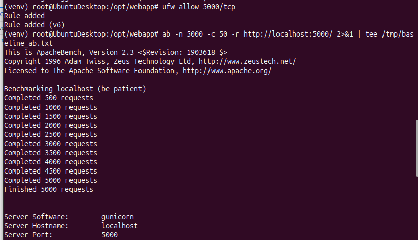

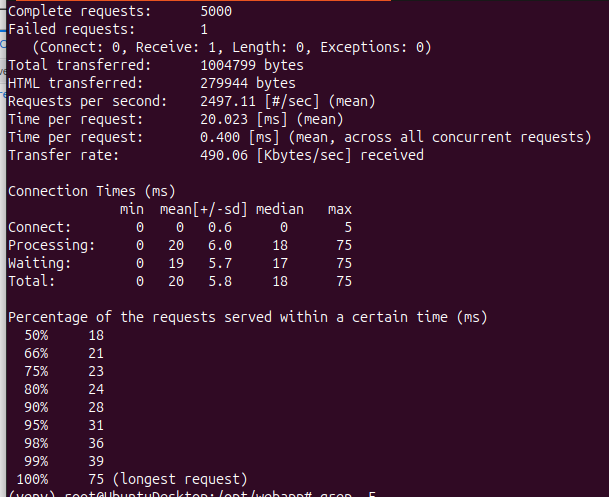

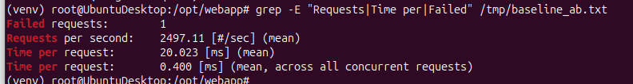

Figure. Benchmark 1 results

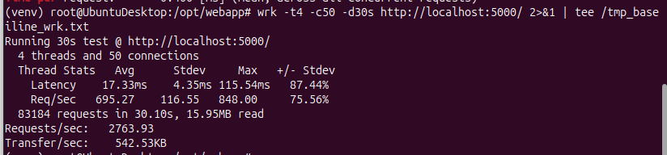

Figure. Benchmark 2 results

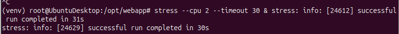

Figure. Benchmark 3 results

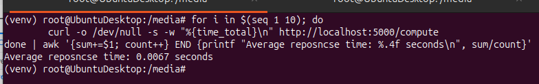

Figure. Benchmark 4 results

### Phase 3 – Install SELinux on Ubuntu 22.04

> Note: Ubuntu uses AppArmor by default. SELinux requires disabling AppArmor first.
>

```bash
# Step 1: Disable AppArmor (SELinux will replace it)
sudo systemctl stop apparmor
sudo systemctl disable apparmor
sudo apt remove -y --purge apparmor apparmor-utils
sudo apt autoremove -y

# Step 2: Install SELinux packages
sudo apt install -y selinux-basics selinux-policy-default auditd

# Step 3: Activate SELinux (sets up filesystem labels)
sudo selinux-activate
# This adds security=selinux to /etc/default/grub and updates GRUB

# Step 4: Verify the activation
grep "selinux" /etc/default/grub
cat /etc/selinux/config

# Step 5: REQUIRED REBOOT – first boot will relabel the entire filesystem
echo "Rebooting to apply SELinux and relabel filesystem..."
sudo reboot
```

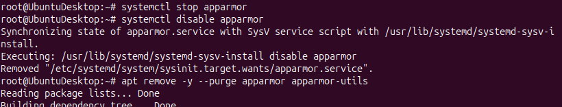

Figure. Reinstalling AppArmor

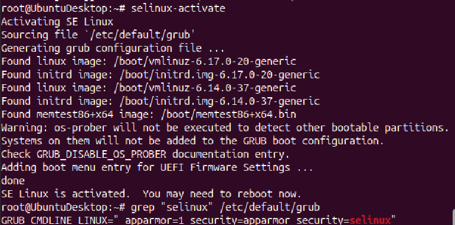

Figure. SELINUX is installed and active

### After first reboot – Verify SELinux status

```bash
# Check SELinux status
sestatus

# Should show:
# SELinux status:                 enabled
# SELinuxfs mount:                /sys/fs/selinux
# SELinux mount check:            enabled
# Mount check:                    enabled
# Rootfs labeled:                 disabled
# Loaded policy name:             default
# Current mode:                   permissive   <-- starts permissive
# Mode from config file:          permissive
# Policy MLS status:              enabled
# Policy deny_unknown status:     denied
# Memory protection checking:     actual (secure)
# Max kernel policy version:      33

# Check mode
getenforce
# Output: Permissive

# List contexts
ls -Z /var/www/
ls -Z /opt/webapp/
```

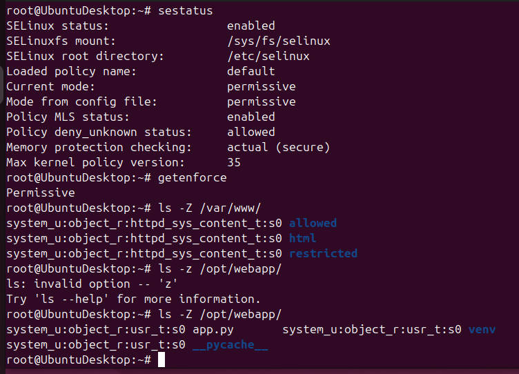

Figure. SELinux status

### Phase 4 – Configure SELinux for the Webapp

```bash
# Install SELinux utilities
sudo apt install -y policycoreutils setools python3-setools

# Restart webapp after reboot
sudo systemctl start webapp

# Check context of the webapp files
ls -Z /opt/webapp/

# Check current process context
ps -eZ | grep gunicorn

# Allow webapp to bind to port 5000
# First check if port is already defined
sudo semanage port -l | grep 5000

# Add port 5000 to http_port_t
sudo semanage port -a -t http_port_t -p tcp 5000 2>/dev/null || \
  sudo semanage port -m -t http_port_t -p tcp 5000

# Verify
sudo semanage port -l | grep http_port_t

# Label the webapp directory appropriately
sudo semanage fcontext -a -t httpd_exec_t '/opt/webapp/venv/bin/gunicorn'
sudo semanage fcontext -a -t httpd_sys_content_t '/opt/webapp(/.*)?'
sudo restorecon -Rv /opt/webapp/

# Verify new labels
ls -Z /opt/webapp/
```

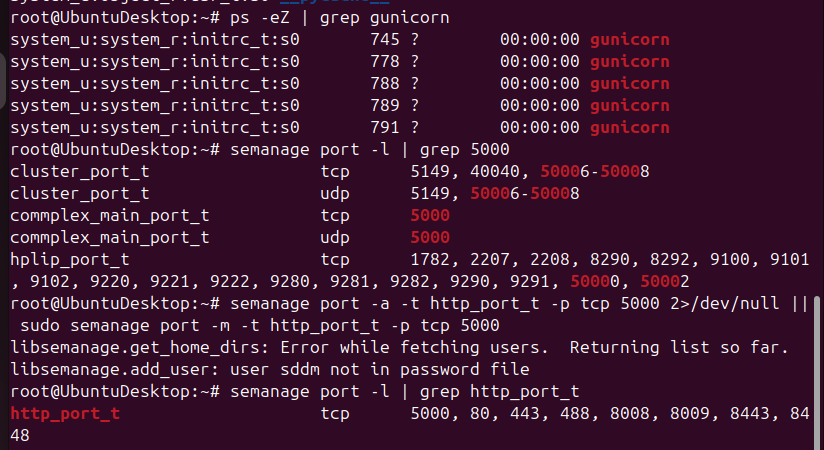

Figure. gunicorn server status

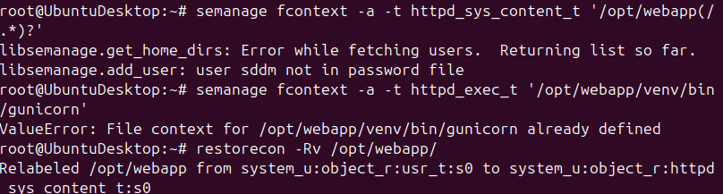

Figure. Labeling webapp directories

### Phase 5 – Implement SELinux Containment Policies

```bash
# Check for SELinux denials so far
sudo ausearch -m avc --start today 2>/dev/null | head -40

# ---- Policy 1: Use audit2allow to create a custom policy module ----

# Run webapp in permissive mode and capture denials
sudo setenforce 0
sudo systemctl restart webapp
curl http://localhost:5000/compute
curl http://localhost:5000/

# Collect AVC denials and create a policy
sudo ausearch -m avc --start today 2>/dev/null | \
  audit2allow -M webapp_policy 2>/dev/null || echo "No denials to convert"

# If a policy was created, install it
if [ -f webapp_policy.pp ]; then
    sudo semodule -i webapp_policy.pp
    echo "Custom policy module installed"
fi

# ---- Policy 2: SELinux Booleans ----

# List booleans related to httpd (web)
sudo semanage boolean -l | grep httpd | head -20

# Allow httpd to connect to network (needed for gunicorn)
sudo setsebool -P httpd_can_network_connect 1

# Allow httpd to read user content
sudo setsebool -P httpd_read_user_content 1

# Check active booleans
getsebool -a | grep httpd | grep "on$"

# ---- Policy 3: Restrict file access ----
# Create a sensitive file and label it so the webapp CANNOT read it
sudo mkdir -p /opt/secrets
echo "TOP SECRET DATA" | sudo tee /opt/secrets/secret.txt

# Label with a type that httpd cannot access
sudo semanage fcontext -a -t etc_t '/opt/secrets(/.*)?'
sudo restorecon -Rv /opt/secrets/
ls -Z /opt/secrets/

# Now switch to Enforcing mode
sudo setenforce 1
getenforce
# Should output: Enforcing

# ---- Policy 4: Enable SELinux enforcing in config (permanent) ----
sudo sed -i 's/SELINUX=permissive/SELINUX=enforcing/' /etc/selinux/config
grep SELINUX /etc/selinux/config

# Restart webapp and verify it still runs
sudo systemctl restart webapp
sudo systemctl status webapp
curl http://localhost:5000/health
```

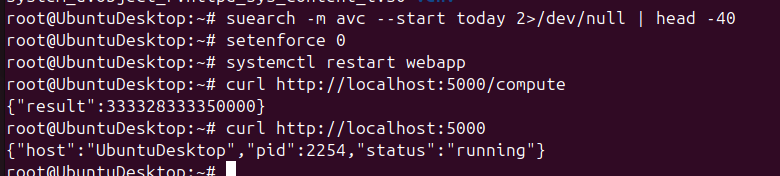

Figure. Webapp is running in permissive mode

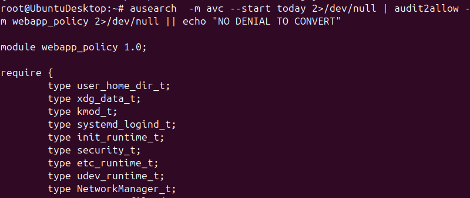

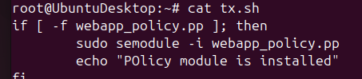

Figure. Policy 1 is created

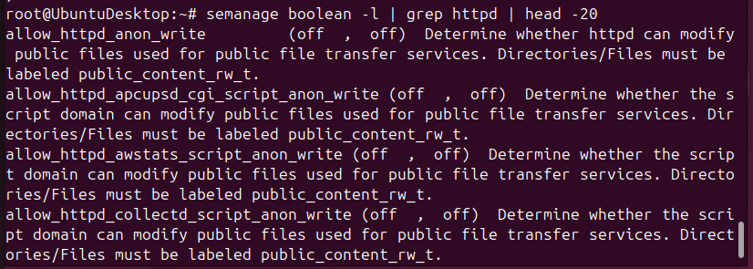

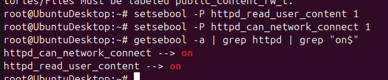

Figure. Policy 2 is created

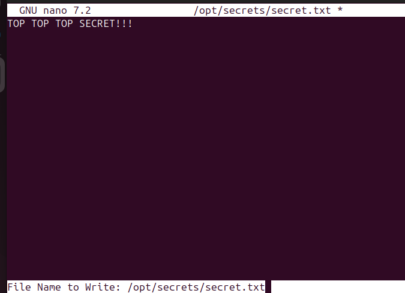

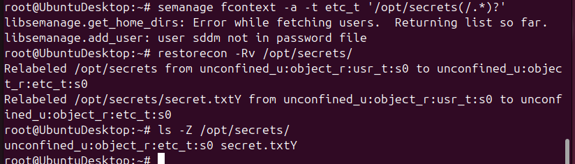

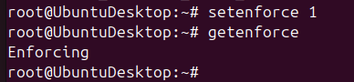

Figure. Policy 3 is created

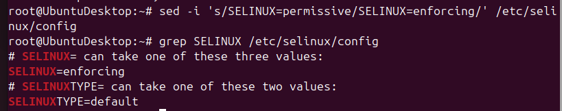

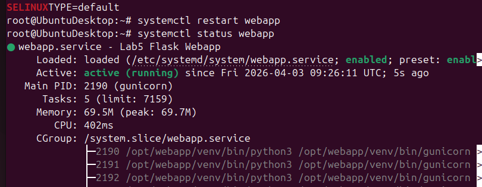

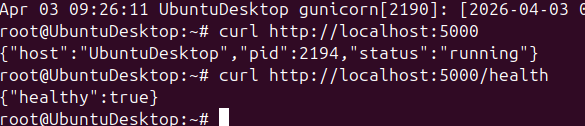

Figure. Policy 4 is created

### Phase 6 – Stress Test AFTER SELinux (Enforcing)

```bash
# Confirm SELinux is enforcing
getenforce

# ---- Benchmark 1: Apache Bench with SELinux ----
echo "=== Apache Bench WITH SELinux Enforcing ==="
ab -n 5000 -c 50 -r http://localhost:5000/ 2>&1 | tee /tmp/selinux_ab.txt

grep -E "Requests per second|Time per request|Failed requests" /tmp/selinux_ab.txt

# ---- Benchmark 2: wrk with SELinux ----
echo "=== wrk WITH SELinux ==="
wrk -t4 -c50 -d30s http://localhost:5000/ 2>&1 | tee /tmp/selinux_wrk.txt

# ---- Benchmark 3: Response time ----
echo "=== Response time WITH SELinux ==="
for i in $(seq 1 10); do
    curl -o /dev/null -s -w "%{time_total}\n" http://localhost:5000/compute
done | awk '{sum+=$1; count++} END {printf "Average response time: %.4f seconds\n", sum/count}'

# ---- Compare Results ----
echo ""
echo "=========================================="
echo "       PERFORMANCE COMPARISON SUMMARY"
echo "=========================================="
echo ""
echo "--- BASELINE (No SELinux) ---"
grep -E "Requests per second|Time per request|Failed" /tmp/baseline_ab.txt 2>/dev/null

echo ""
echo "--- WITH SELinux Enforcing ---"
grep -E "Requests per second|Time per request|Failed" /tmp/selinux_ab.txt 2>/dev/null

echo ""
echo "Note: Performance difference is typically < 1–3% overhead."
echo "SELinux kernel-level enforcement has minimal throughput impact."
echo "=========================================="
```

---

## BONUS – Shellshock Attack & SELinux Mitigation

### Background

Shellshock (CVE-2014-6271) exploits a Bash bug where function definitions in environment
variables are followed by arbitrary commands that execute when Bash starts.

```
env VAR='() { :; }; <COMMAND>' bash
```

CGI scripts that invoke Bash are vulnerable because web servers pass HTTP headers
as environment variables to CGI scripts.

### Step 1 – Set up the vulnerable environment

```bash
# Install an old Bash version in a test directory (simulate the vulnerability)
# On modern Ubuntu, Bash is already patched. We simulate using a custom CGI setup.

# Install Apache with CGI support
sudo apt install -y apache2

# Enable CGI module
sudo a2enmod cgi
sudo a2enconf serve-cgi-bin
sudo systemctl restart apache2

# Create a vulnerable CGI script (simulates calling bash with env vars)
sudo mkdir -p /usr/lib/cgi-bin/
sudo tee /usr/lib/cgi-bin/test.sh << 'CGISCRIPT'
#!/bin/bash
echo "Content-type: text/plain"
echo ""
echo "CGI script executed by: $(whoami)"
echo "Hostname: $(hostname)"
CGISCRIPT

sudo chmod +x /usr/lib/cgi-bin/test.sh
sudo chown www-data:www-data /usr/lib/cgi-bin/test.sh

# Test normal CGI execution
curl http://localhost/cgi-bin/test.sh
```

### Step 2 – Test the Shellshock vector (on patched system, shows blocked attempt)

```bash
# This simulates what the Shellshock attack does:
# Attacker sends a malicious User-Agent header with bash function + command

# Test 1 – Basic shellshock probe
echo "=== Shellshock Probe ==="
curl -A '() { :; }; echo "VULNERABLE: shellshock worked"' \
  http://localhost/cgi-bin/test.sh

# Test 2 – Try to read /etc/passwd via shellshock
echo "=== Password File Exfil Attempt ==="
curl -H 'X-Custom: () { :; }; /bin/cat /etc/passwd' \
  http://localhost/cgi-bin/test.sh

# Test 3 – Try to create a reverse shell
echo "=== Reverse Shell Attempt ==="
curl -A '() { :; }; /bin/bash -c "id > /tmp/shellshock_proof.txt"' \
  http://localhost/cgi-bin/test.sh

# Check if file was created (indicates shellshock success)
if [ -f /tmp/shellshock_proof.txt ]; then
    echo "SHELLSHOCK SUCCEEDED - file created:"
    cat /tmp/shellshock_proof.txt
else
    echo "SHELLSHOCK BLOCKED or system is patched"
fi
```

### Step 3 – Demonstrate SELinux blocking Shellshock

```bash
# Ensure SELinux is enforcing
sudo setenforce 1
getenforce

# Label the CGI directory
ls -Z /usr/lib/cgi-bin/

# Apply the correct SELinux context for CGI scripts
sudo semanage fcontext -a -t httpd_sys_script_exec_t '/usr/lib/cgi-bin(/.*)?'
sudo restorecon -Rv /usr/lib/cgi-bin/

# Verify context
ls -Z /usr/lib/cgi-bin/test.sh

# Try the shellshock attack again WITH SELinux enforcing
echo "=== Shellshock with SELinux Enforcing ==="

# Attempt to write to /tmp via shellshock
curl -A '() { :; }; /bin/bash -c "id > /tmp/selinux_test.txt 2>&1"' \
  http://localhost/cgi-bin/test.sh

# Check if it worked
ls -la /tmp/selinux_test.txt 2>/dev/null && \
  echo "FILE CREATED - SELinux did not block" || \
  echo "FILE NOT CREATED - SELinux blocked the attack!"

# View SELinux denial logs
sudo ausearch -m avc --start today 2>/dev/null | tail -20
sudo dmesg | grep -i "apparmor\|selinux" | tail -20

# SELinux prevents the shellshock payload because:
# 1. httpd_t processes cannot execute /bin/bash outside policy
# 2. httpd_t cannot write to /tmp (only httpd_tmp_t areas)
# 3. httpd_t cannot exec arbitrary binaries
echo ""
echo "Key SELinux containment: even if Bash IS invoked, the httpd_t domain"
echo "cannot write files outside allowed locations or spawn unrestricted shells."
```

### Step 4 – Demonstrate the containment clearly

```bash
# Check what httpd_t can and cannot do
echo "=== What httpd_t processes are NOT allowed to do: ==="
sudo sesearch --allow --source httpd_t --target shell_exec_t 2>/dev/null | head -10
# No results = httpd cannot exec a shell

sudo sesearch --allow --source httpd_t --target tmp_t -c file 2>/dev/null | head -10
# Restricted write access to tmp

# Verify current process context for Apache
ps -eZ | grep apache2 | head -5

# Show that the process is in a restricted domain
echo ""
echo "Apache runs in httpd_t domain — all actions are policy-constrained."
echo "Shellshock can trigger Bash, but Bash inherits httpd_t and cannot:"
echo "  1. Write to arbitrary filesystem paths"
echo "  2. Open network connections (unless allowed by boolean)"
echo "  3. Execute binaries outside policy"
echo "  4. Read sensitive files (/etc/shadow, /root/, etc.)"
```

### Step 5 – SELinux audit and logging for the attack

```bash
# View all SELinux denials from today
sudo ausearch -m avc --start today 2>/dev/null

# Check audit log
sudo tail -30 /var/log/audit/audit.log | grep -i "denied\|avc"

# Generate a human-readable report
sudo audit2allow -a 2>/dev/null | head -40

# Generate SELinux stats
sudo seinfo 2>/dev/null | head -20

# Final status check
echo ""
echo "=== Final SELinux Status ==="
sestatus
getenforce
sudo semodule -l | head -10
```

---

## QUICK REFERENCE – Key Commands

```bash
# AppArmor
sudo aa-status                    # Show all profiles and status
sudo aa-enforce /path/to/bin      # Set profile to enforce mode
sudo aa-complain /path/to/bin     # Set profile to complain mode
sudo aa-disable /path/to/bin      # Disable a profile
sudo aa-genprof /path/to/bin      # Generate a new profile
sudo aa-logprof                   # Update profiles from logs
sudo apparmor_parser -r profile   # Reload a profile
sudo dmesg | grep apparmor        # View AppArmor kernel log

# SELinux
getenforce                        # Show current mode
sestatus                          # Detailed SELinux status
sudo setenforce 0                 # Permissive mode (temporary)
sudo setenforce 1                 # Enforcing mode (temporary)
ls -Z /path                       # Show file security context
ps -eZ                            # Show process security context
sudo ausearch -m avc              # Search audit log for denials
sudo audit2allow -a               # Generate policy from denials
sudo semanage port -l             # List port labels
sudo setsebool -P boolean on/off  # Set a SELinux boolean
sudo restorecon -Rv /path         # Restore file contexts
```

---

*End of LAB5 MAC Implementation GuidePlatform: Ubuntu 22.04 LTS Server*
