# 1 Data Acquisition

Name of report: CCF_LAB_1_Nikita_Niakhai
Course: Computer Forensics and Incident Response
Performed by Nikita Niakhai
Date submission: 03.05.2026
---

> This lab introduces **forensic imaging and data handling** using a live environment. Work is performed in groups of 2 persons per group for Task 3.
>
> - USB Drive 1 — CAINE live environment (for collecting evidence)
> - USB Drive 2 (Drive A) — target disk image, uncompressed with FTK Imager and burned to the drive including unallocated space

---

# Task 1 — Setting Up Your Environment

> 🔧
>
> **Setup:**
>
> 1. Prepared USB Drive 1 (A) with a **CAINE 14.0 live environment** bootable image.
>     1. *Nikita’s property*
> 2. Prepared USB Drive 2 (B) (**Drive inside it called “A”**) — uncompress the provided disk image using **FTK Imager** (preserving all original bits, including unallocated space) and burn it to the flash drive.
>     1. *Acquired from Victor Adekanye.*

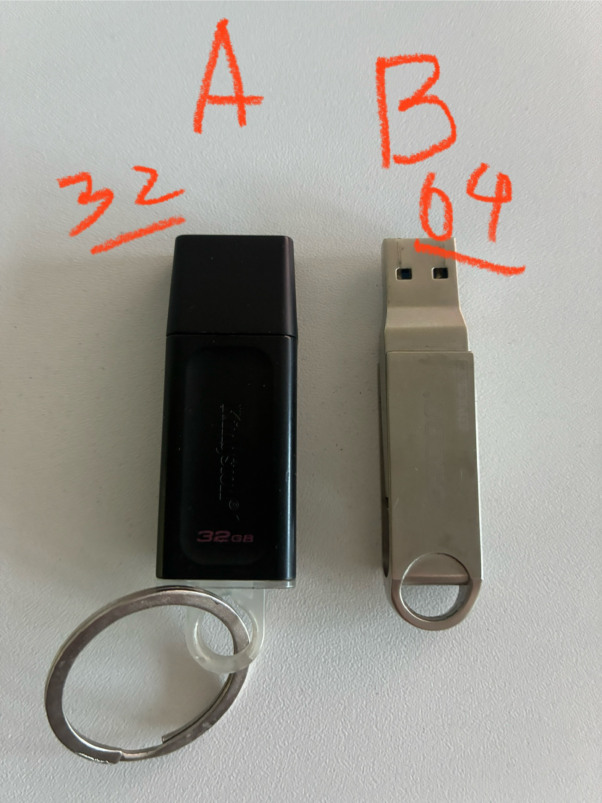

Figure. USB drives used for the lab

- Downloaded CAINE 14.0
- Checked hashes SHA256 between installed Caine image and authentic hash using `shasum -a 256 iso_file`
    - authentic hash sha256 from Caine website:

        ```bash
        2702226cf9ee131ee54e9649d6d90008f3fe851ba35939f43ae8cb614a00d564  caine14.0.iso
        ```

    - My computed hash:

    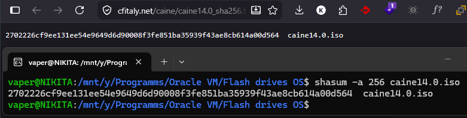

- Burned Caine on my usb A with Rufus tools.
    - started at 02.05.2026 18:20

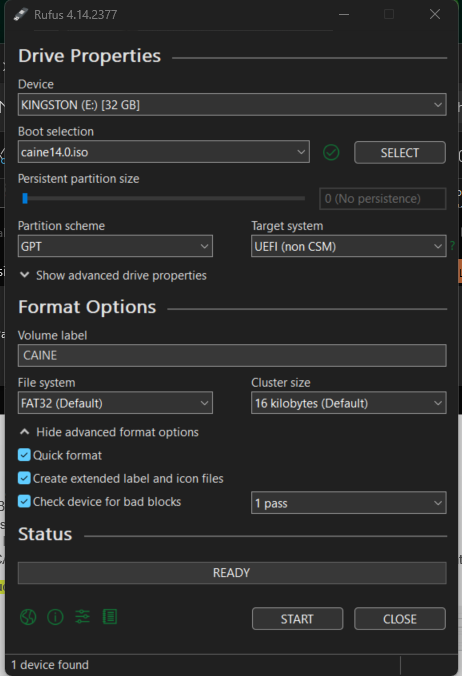

Figure. rufus setup for usb A

- *Unknown options for rufus configuration explained:*
    - *Persistent size: if set to 0, then every boot OS will start as fresh one - live environment, otherwise it means that size of partition is the size for saved changes between Boots that OS uses. Since, the goal is to run env. live, I keep this value 0.*
    - *Partition scheme defined by the machine that is booting a live USV env., since I am using Windows 11 with UEFI, then GPT — is a standalone option. Nevertheless, I can use MBR (which is legacy scheme), but it may cause some issues and may require enabling Compatibility Support Module (CSM) inside my BIOS settings.*

- At 19:16 burning process ended

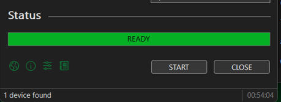

Figure. Burning process ended

```bash
# Verify CAINE boot media after writing
lsblk
fdisk -l /dev/sdX
```

- In Windows Exterro FTK lmager 4.7.3.81 added new evidence item of a type file

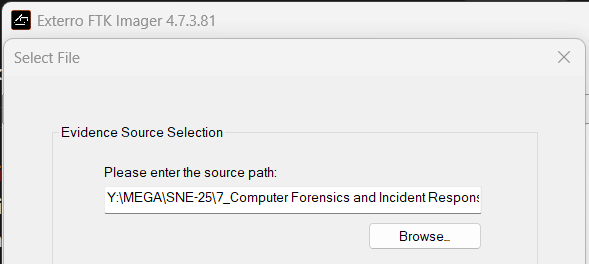

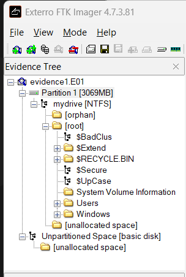

Figure. Evidence managing

- then right clicked on the evidence item and exported an image, in image destination added all needed configurations:
    - format: raw dd
    - path
    - forensics metadata

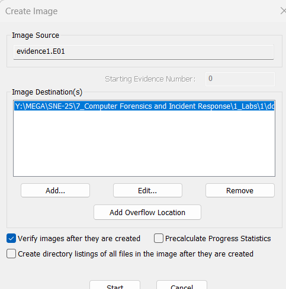

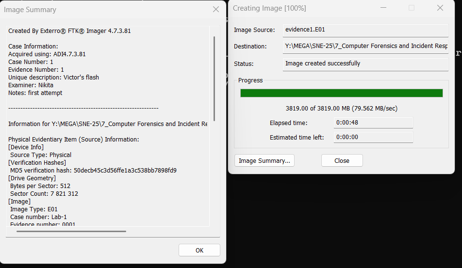

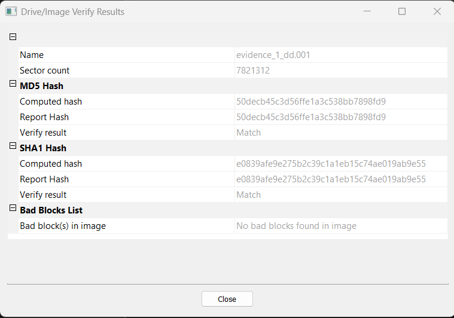

Figure. Evidence managing (creating image, logs, summary, hashes)

```bash
Case Information: 
Acquired using: ADI4.7.3.81
Case Number: 1
Evidence Number: 1
Unique description: Victor's flash
Examiner: Nikita
Notes: first attempt

--------------------------------------------------------------

Information for Y:\MEGA\SNE-25\7_Computer Forensics and Incident Response\1_Labs\1\dd_evidence\evidence_1_dd:

Physical Evidentiary Item (Source) Information:
[Device Info]
 Source Type: Physical
[Verification Hashes]
 MD5 verification hash: 50decb45c3d56ffe1a3c538bb7898fd9
[Drive Geometry]
 Bytes per Sector: 512
 Sector Count: 7 821 312
[Image]
 Image Type: E01
 Case number: Lab-1
 Evidence number: 0001
 Examiner: Emil A. Sharifullin
 Notes: 4C532000060816106053
 Acquired on OS: Linux deft8 3.5.0-30-generic #51-Ubuntu SMP Tue May 14 18:47:48 UTC 2013 x86_64
 Acquired using: guymager 0.7.3-1
 Acquire date: 09.01.2017 11:50:17
 System date: 09.01.2017 11:50:17
 Unique description: Red evidence flash drive
 Source data size: 3819 MB
 Sector count:    7821312
[Computed Hashes]
 MD5 checksum:    50decb45c3d56ffe1a3c538bb7898fd9
 SHA1 checksum:   e0839afe9e275b2c39c1a1eb15c74ae019ab9e55

Image Information:
 Acquisition started:   Sat May  2 19:28:39 2026
 Acquisition finished:  Sat May  2 19:29:27 2026
 Segment list:
  Y:\MEGA\SNE-25\7_Computer Forensics and Incident Response\1_Labs\1\dd_evidence\evidence_1_dd.001
 COMPUTED HASH :  50decb45c3d56ffe1a3c538bb7898fd9
 COMPUTED HASH :  e0839afe9e275b2c39c1a1eb15c74ae019ab9e55

Image Verification Results:
 Verification started:  Sat May  2 19:29:29 2026
 Verification finished: Sat May  2 19:29:44 2026
 MD5 checksum:    50decb45c3d56ffe1a3c538bb7898fd9 : verified
 SHA1 checksum:   e0839afe9e275b2c39c1a1eb15c74ae019ab9e55 : verified
```

- Mounted USB B to `wsl` with `usbipd` on Windows and verified presence on wsl with `lsblk`

    ```bash
    #Step 1 — Install usbipd on Windows (one time)
    #Open PowerShell as Administrator:
    winget install usbipd

    #Step 2 — List all USB devices
    usbipd list
    # this is my usb b: 
    # 2-21   346d:5678  USB Mass Storage Device

    # Step 3 — Bind and attach your Drive A
    # Bind it first (one time per device)
    usbipd bind --busid 2-21
    usbipd attach --wsl --busid 2-21

    # Step 4 — Go back to WSL2 and check
    lsblk
    ```

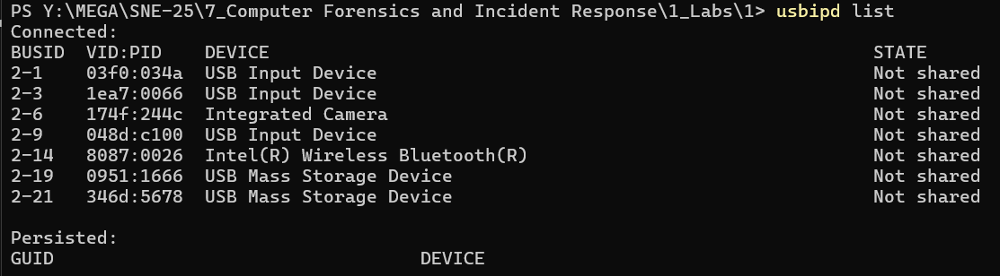

Figure. step 2 `usbipd list`

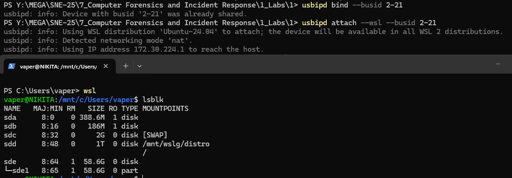

Figure. step 3

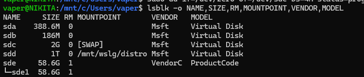

Figure. step 4

- Wiped drive A, usb B with zeroes

    ```bash
    sudo dc3dd wipe=/dev/sde tpat=0x00 log=wipe_log.txt hash=md5 hash=sha256 verb=on
    ```

    | Parameter | Meaning |
    | --- | --- |
    | `wipe=/dev/sde` | target drive to wipe |
    | `tpat=0x00` | fill with zeros (use `tpat=r` for random data) |
    | `log=wipe_log.txt` | saves full log to this file |
    | `hash=md5` | computes MD5 of the wipe operation |
    | `hash=sha256` | computes SHA256 of the wipe operation |
    | `verb=on` | verbose output, shows progress |

    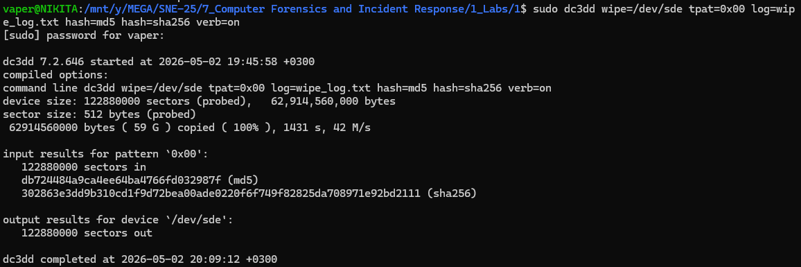

    Figure. d3cdd wiping results

- Write Evidence Image to Drive A started at 20:28, ended at 20:32

    ```bash
    dc3dd if="/mnt/y/Programms/Oracle VM/Flash drives OS/evidence/evidence1.001" of=/dev/sde log=burning_ev.txt hash=md5 hash=sha256 hlog=burning_ev_hash_logs.txt verb=on
    ```

    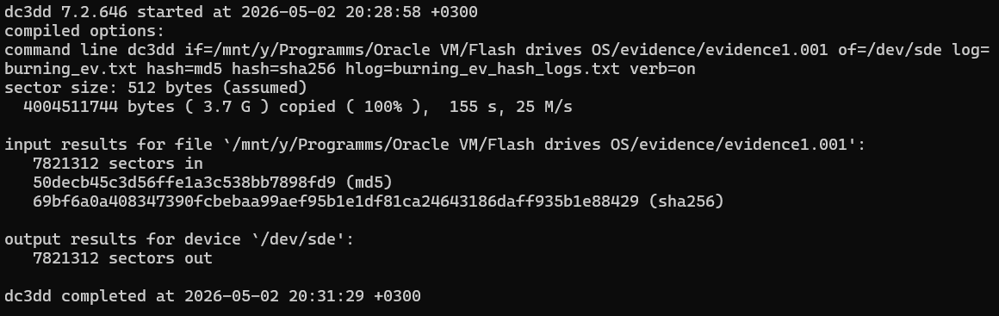

    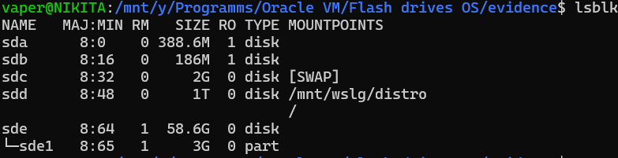

    Figure. USB B (Drive A) prepared in FTK Imager (image uncompressed and written)

- Preparing for booting a Live Environment, Launching:
    - Reboot, saw an error

    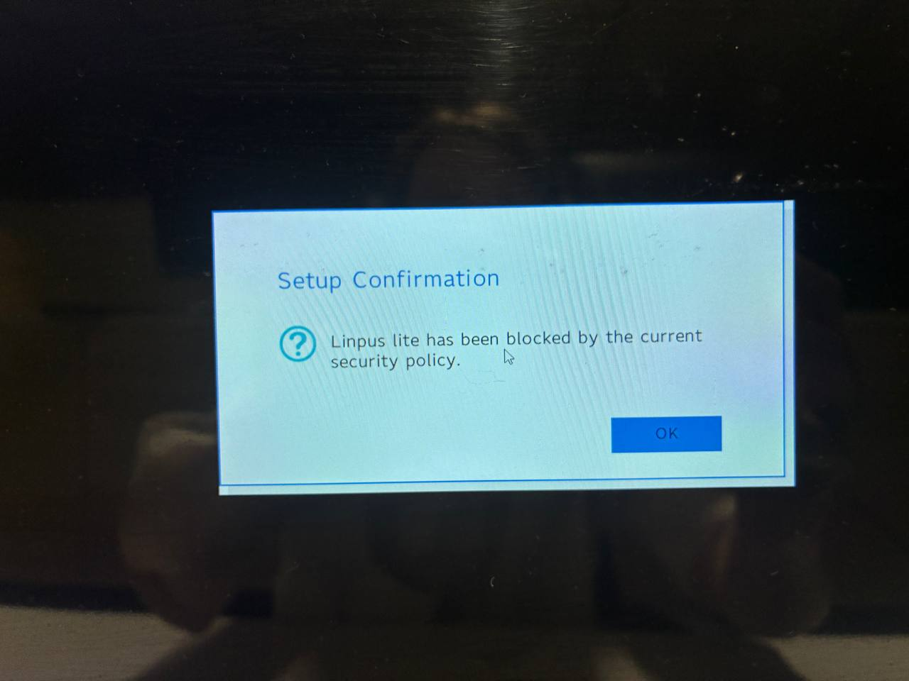

    Figure. CAINE bootloader in “black list” of Microsoft, since Secure Boot is turned on

    - Reboot again, switched to BIOS mode, setup unsecured boot, changed booting order

    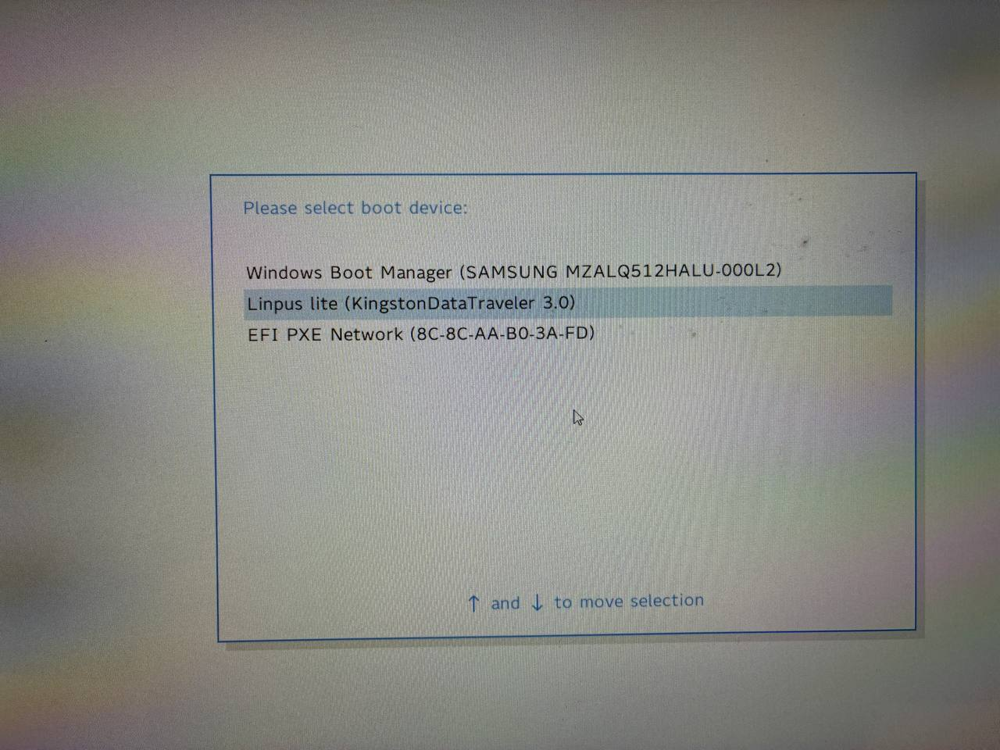

    Figure. Changing boot order (default settings on the screen)

    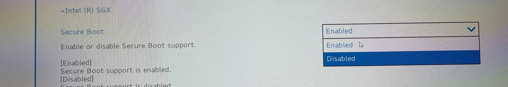

    Figure. Disabling Secure Boot

- Booting as CAINE RAM (default setup)

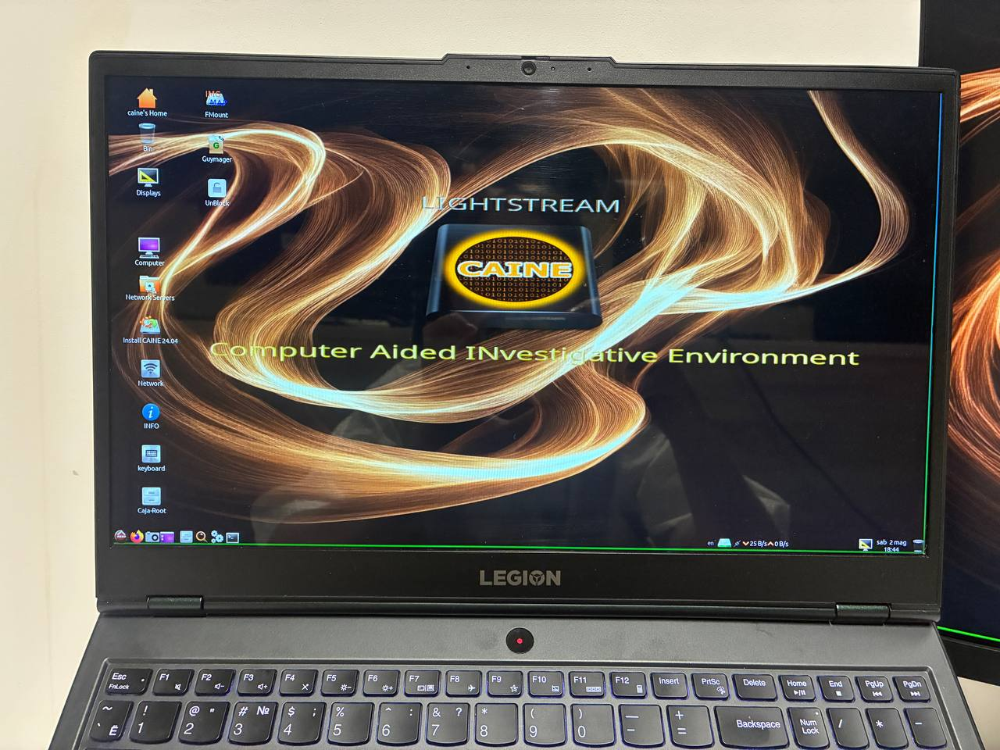

Figure. CAINE live USB boot screen

---

# Task 2 — Imaging

## 2.1 — Forensically Sound Acquisition Method

| **Step** | **Action** | **Reason** |
| --- | --- | --- |
| 0 | Record timestamp. Fill chain of custody form. | Maintains chain of custody |
| 0 | Document all steps with timestamps and tool versions | Maintains chain of custody |
| 1 | Inspect Drive A physically for damage. Label and package it. Note observations. |  |
| 2 | Boot into CAINE live environment | Prevents automatic mounting of evidence drives |
| 3 | Attach hardware write blocker or verify software write block is active | Prevents any modification to the source drive |
| 4 | Identify the source device with `lsblk` / `fdisk -l` | Confirms correct device before imaging |
| 5 | Use Guymager to create forensic image. Enable MD5 + SHA1 generation. | Establishes integrity baseline. Acquire hash of source drive before imaging (MD5/SHA256). Create bit-for-bit copy |
| 6 | Run imaging tool (Guymager / dcfldd) to  | Captures all data including unallocated space |
| 7 | Acquire hash of resulting image and compare to source hash | Verifies image integrity — required for court admissibility |
| 8 | Backup | Copy image to a second location (teammate's machine or second USB) |

## 2.2 — CAINE Tool Descriptions

> disk imaging
>

— a solid process of copying disks (usb drive, ssd…) between places. it is 100% complete copy, without loses.

> burning
>

— a process of “putting” a game/iso/os from host machine to the disk, drive, usb and etc.

> **dd**
>

dd (data duplicate) — is a classic

- command line tool for duplicating data (imaging)
- Open source for linux
- reliable and still industry standard
- no hash veryfying
- logging is not comprehensive enough

> **dcfldd / dc3dd:**
>
- *enhanced versions of `dd` with built-in on-the-fly hashing, progress output, and split output support for forensic use.*
- command line tool for duplicating data (imaging)
- Created by the U.S. Department of Defense Computer Forensics Lab (DCFL) based on `dd`, solving separation of dd only copying and verifying, logging functionality
- supports different types of logging (hash creation, hash verification, process/status logging)
- Features:
    - Built-in hashing feature (MD5, SHA-1, SHA-256, etc.)
    - Real-time progress indicators
    - Automatic verification
    - Error handling improvements
    - Ability to split output images
    - Detailed logging for forensic reports

> **Guymager:**
>
- GUI-based forensic imaging tool supporting many raw data formats with built-in hashing, logging case management tools.
- Linux native
- High-speed imagin
- Features:
    - Creating forensic disk images
    - Hashing drives with MD5, SHA-1, SHA-256
    - Performing bit-for-bit cloning
    - Generating detailed acquisition logs
    - Producing EWF (E01), AFF, or Raw (.dd) images

> **Disk Image Mounter:**
>

Mounts disk image files *(DD, EWF, AFF) in read-only mode* so their contents can be browsed as a filesystem

> **kpartx:**
>

Creates device mappings for partitions inside disk images, enabling per-partition mounting

## 2.3 — Acquiring the Image from Drive A

```bash
# Step 1 — Identify device
lsblk
fdisk -l /dev/sdX

# Step 2 — Pre-acquisition hash (MD5 + SHA256)
md5sum /dev/sdX
sha256sum /dev/sdX

# Step 3 — Acquire image with dcfldd (note version)
dcfldd --version
dcfldd if=/dev/sdX of=/mnt/evidence/driveA.dd hash=md5,sha256 hashlog=/mnt/evidence/driveA.hash bs=512 conv=noerror,sync

# Step 4 — Verify output hash matches
cat /mnt/evidence/driveA.hash

# Note versions inside CAINE:
guymager --version
dcfldd --version
dc3dd --version
kpartx --version
```

- Acquiring evidence frkm USB B, disk A on caine in tmp (because it is RAM and no other third usb is present for setting destination path there)
1. Opened **Guymager**: Applications → Forensics → Guymager
2. Right-click Drive A → **Acquire image**, settings:
    - Format: **Linux dd raw** or **EWF (E01)**
    - MD5 hash
    - SHA-1,256 hashes
    - Split size: 0 (no split, single file)
3. Click **Start** — note exact start timestamp
- Acquiring metadata:

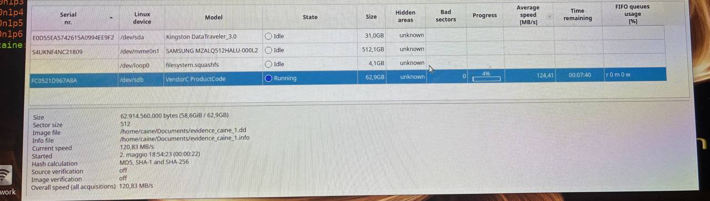

Figure. Guymager GUI with USB drive B (started acquiring)

## 2.4 — CAINE Linux Research Questions

### a. Why use a Forensic Distribution? Main differences from a regular distribution?

Meets the needs of a forensic guy:

- live boot way: every boot you have clean environment (persistence)
- rapid booting, because of ligth OS
- *a hardware write-blocker* for forensics
- CAINE never automounts connected devices, preventing accidental write operations that would compromise evidence integrity
- all main industry forensics tools preinstalled
- boots in read only (write protected mode)
- court admired and allowed
- maintaining chain of custody

### b. When to use a live environment vs. an installed environment?

**live** — for on-site triage/acquisition of a running machine without altering the disk,  when leaving no traces on the host — matter fresh environment every time.

**installed** — for in-lab analysis where persistent tool configuration, larger storage, and performance matter.

### c. What are the policies of CAINE?

- user must unmount before unplugging to avoid filesystem corruption
- no auto-mounting of devices
- no swap activation
- no modification of evidence media
- all block devices are mounted read-only by default, always with flags: `ro, noatime, noexec, nosuid, nodev, noload`

---

# Task 3 — Verification *(Group Task — 2 persons)*

## 3.1 — Verification Method

**Note for the partner:**

```bash
1. Receive Drive A and the .info metadata file
2. Inspect Drive A physically — note any damage
3. Record timestamp, update chain of custody
4. Connect Drive A to CAINE live machine — confirm no automount (lsblk)
5. Hash the drive:
      md5sum /dev/sdX
      sha1sum /dev/sdX
      sha256sum /dev/sdX
6. Compare output against hashes in the .info file
7. If hashes match → acquisition verified, integrity confirmed
8. If hashes differ → flag immediately, do not proceed
```

## 3.2 — Partner Verification Paragraph

> *"On 24.04.2026 at 23:12 I received Drive A from Victor Adekanye along with the associated metadata file. Physical inspection shoed no visible damage to the USB. The chain of custody was updated to reflect all notes. After, at 03.05.2026 the device was connected to a CAINE 14.0 live environment and inverstigated: no automounting occurred as confirmed by `lsblk` output. Using md5sum, cryptographic hashes of the drive were computed and compared against the values recorded in the provided metadata file. The MD5 hash values matched exactly. The acquisition procedure followed by [partner name] is consistent with forensically sound practice: no write operations were performed on the original evidence, a verified forensic image was produced, and integrity was maintained throughout. This evidence is suitable for use in further forensic analysis."*
>

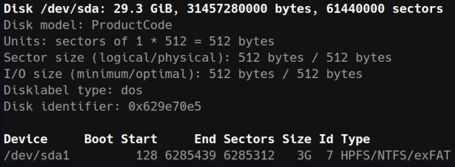

Figure. `fdisk -l` results on connected USB

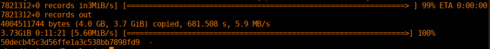

Figure. hash matching `sudo dd if=/dev/sdb count=7821312 | pv -s $((7821312*512))| md5sum`

---

# Task 4 — Technical Analysis

## 4.1 — Mount Image as Read-Only

```bash
# Create mount point
mkdir -p /mnt/driveA

# Mount image read-only
mount -o ro,loop /mnt/evidence/driveA.dd /mnt/driveA

# Verify read-only mount
mount | grep driveA
```

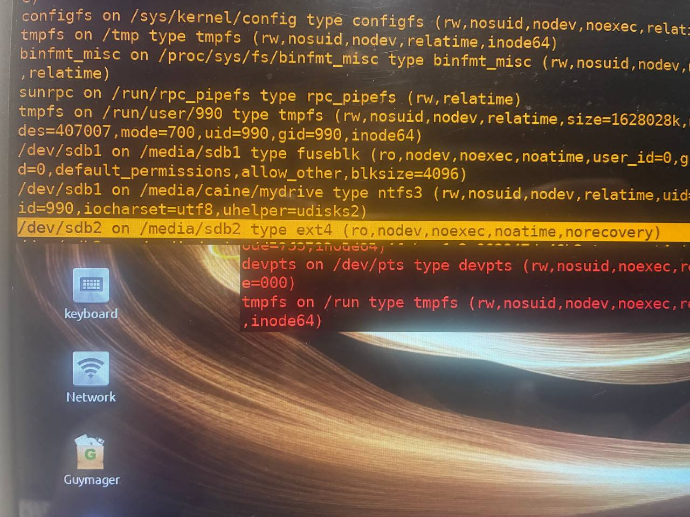

Figure. Image mounted and verified as read-only on `/dev/sdb2`

## 4.2 — Image Characterisation

- Size ~ 3096MB (2,94 GB, 6168576 sectors)
- DOS/MBR boot
- File System (FS) type: NTFS exFAT (Windows 7 Machine)
- Main user is *Thomas Ehrhart*

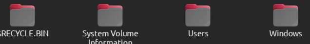

Figure. root folder content

- Basic commands for overall analysis:

```bash
# Image size
du -sh /mnt/evidence/driveA.dd
wc -c /mnt/evidence/driveA.dd

# Partition and filesystem info
fdisk -l /mnt/evidence/driveA.dd
mmls /mnt/evidence/driveA.dd

# MBR/GPT check
file /mnt/evidence/driveA.dd
gdisk -l /mnt/evidence/driveA.dd
```

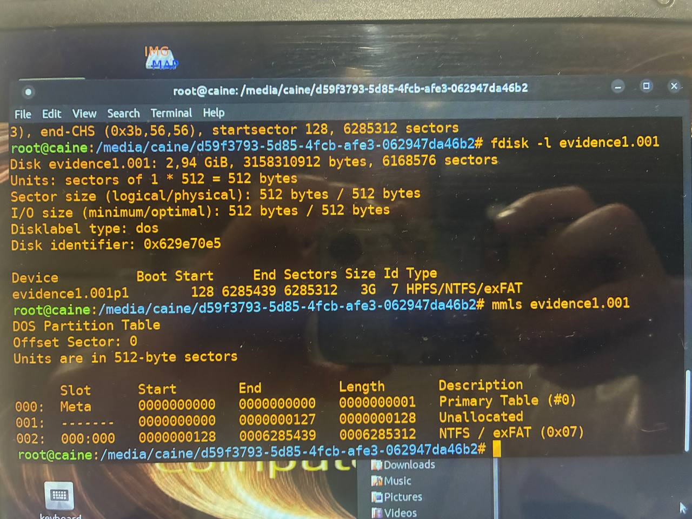

Figure. `fdisk` / `mmls` output showing partition structure

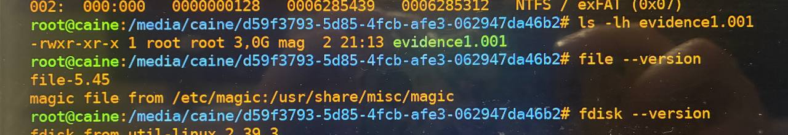

Figure.  `ls-lh` and tools versions

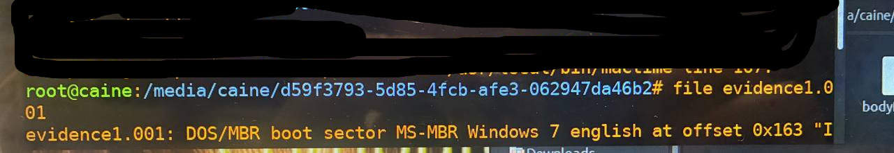

Figure.  MBR/GPT identification output: partition table: `file` command

- Investigated data (personal folder, appdata, roaming, caches and etc.):
    - cats pictures
    - migration plans
    - girls interests
    - documents
    - apps (firefox, Adobe, VeraCrypt)
    - Browsing:
        - Most activity for browsing were seen in August 2016: mostly firefox-related for the user `m3k5a7px`
            - Browser form autofill data (SQLite database)
            - Google search for "Artifact hiding" (in browser cache)
    - history searches
    - Encrypted file `myDokuments` with VeraCrypt
        - history and config metadata

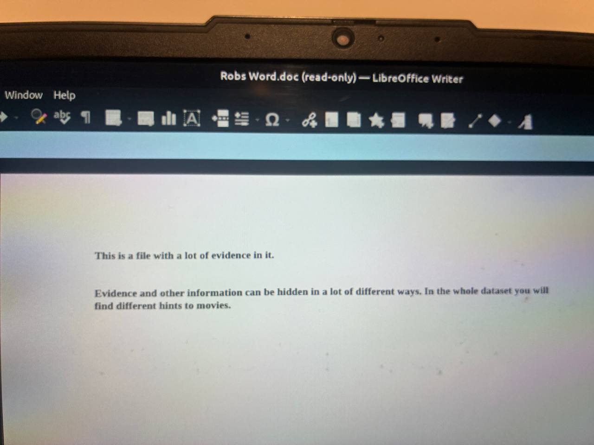

Figure. Documents

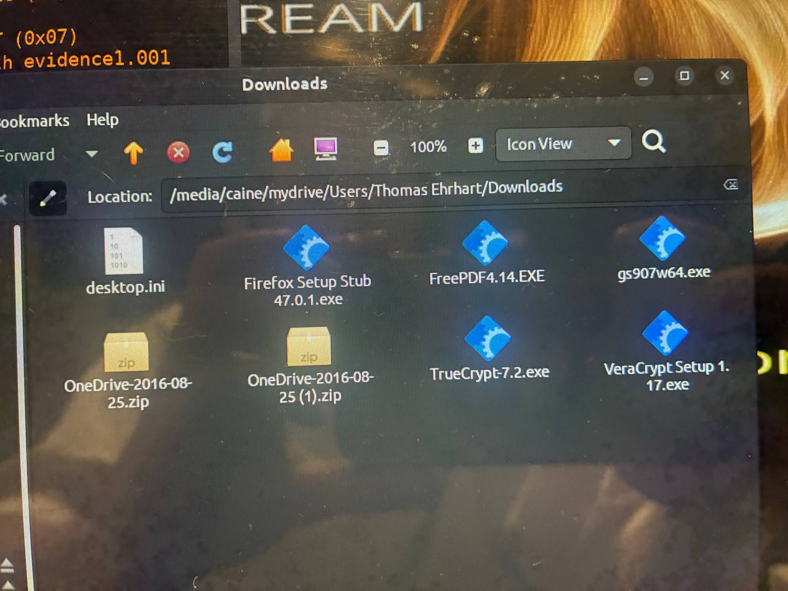

Figure. Downloads (Firefix, VeraCrypt)

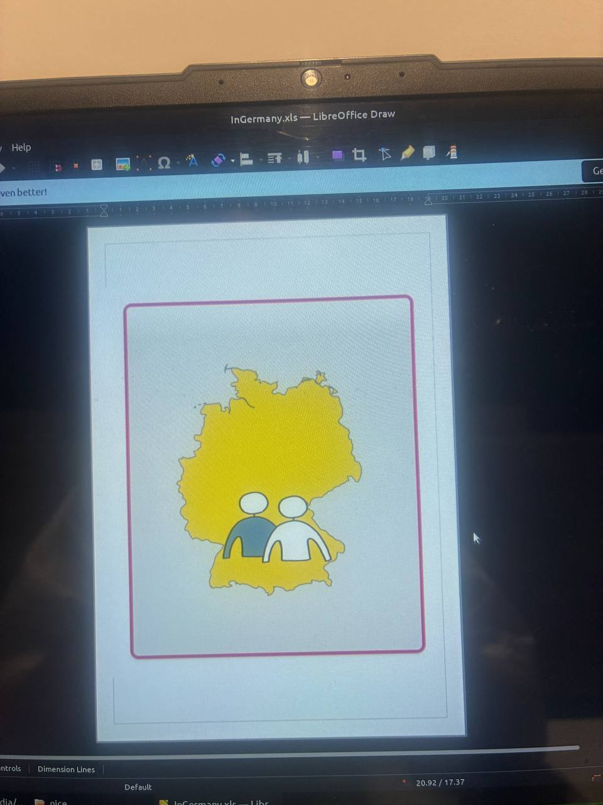

Figure. Pictures of possible migration tactics and interests

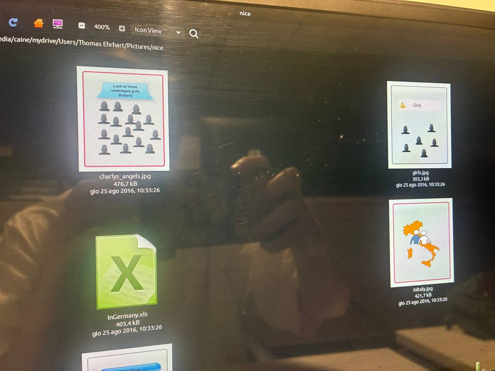

Figure. Pictures of possible migration tactics and interests

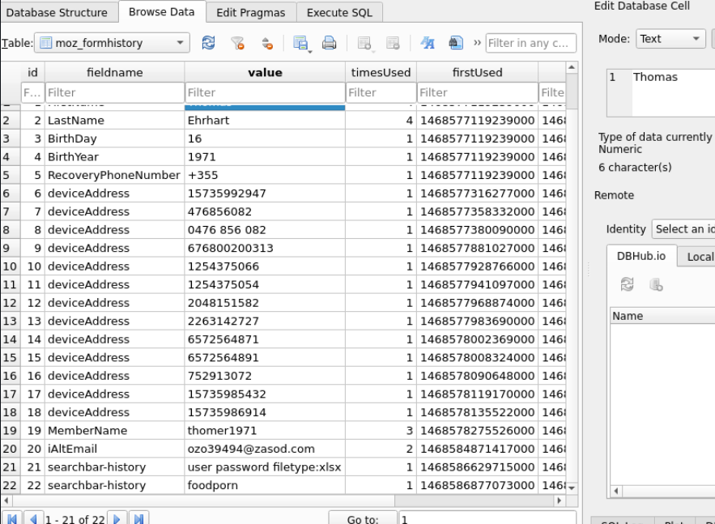

Figure. Forms autofill

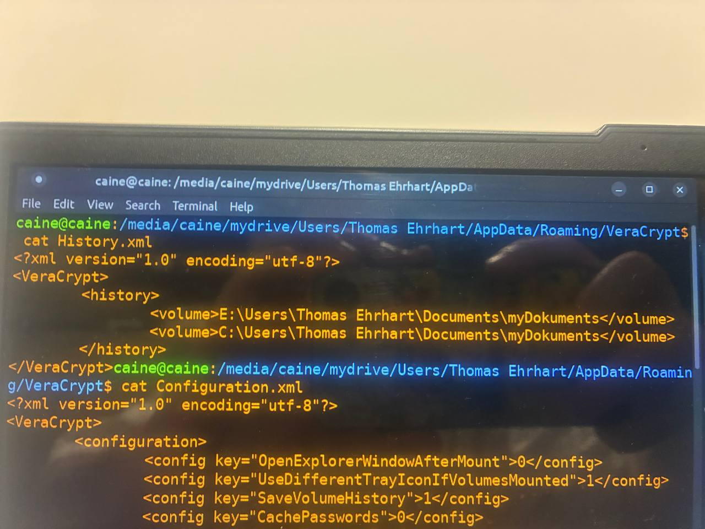

Figure. VeraCrypt history and configuration

## 4.3 — Timeline Analysis

- As soon as the dump finished, started a timeline creation tool on the image using `fls`.

```bash
fls -r -m / /dev/sdX1 > bodyfile.txt
mactime -b bodyfile.txt -d > timeline.csv
```

Figure. Timeline generation with `mactime` and `fls` running on Drive A image (p.1)

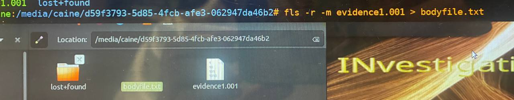

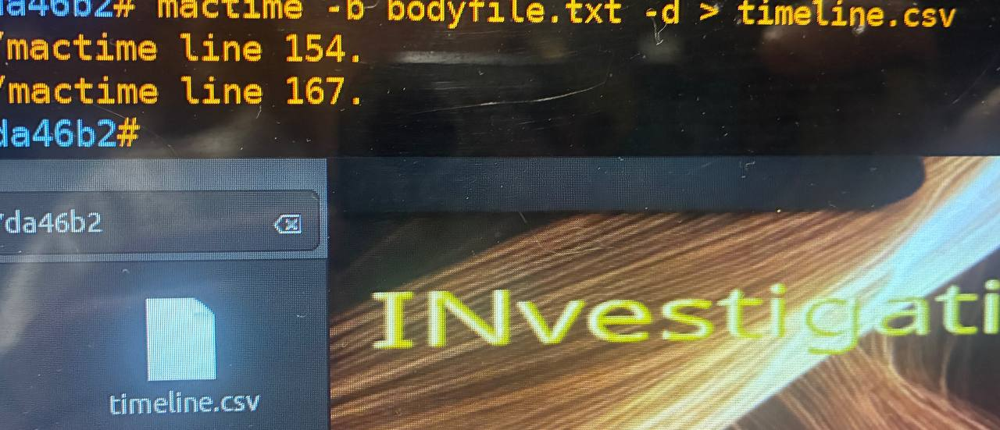

Figure. Timeline generation with `mactime` and `fls` running on Drive A image (p.2): `timeline.csv` is created

- Visualising timeline (cli or autopsy tools)

```bash
# Filter timeline for interesting events — example queries
grep "2024" /mnt/evidence/timeline.csv | grep -i "delete\|move\|copy\|create" | head -30

# Examine file activity by time range
grep "MACB" /mnt/evidence/timeline.csv | sort | head -50
```

- Takeaway: most activity were for browsing (firefox) in August 2016 for the user `m3k5a7px`

## 4.4 — Further Investigation

- finding keys for encrypted documents via VeraCrypt
- analyzing deleted thumbnails
- analyzing email logs and artifacts
- analyzing deleted files
- analyzing network logs
- analyzing adobe logs
- finding ways to get into drive `U:/`

---

# 5 — Tools used

| Tools and Version | Comments |
| --- | --- |
| Exterro FTK lmager 4.7.3.81 | used on Windows 11 host machine |
| caine 14.0 | for usb A |
| dc3dd 7.2.646 | - |
| file-5.45 | - |
| fdisk 2.39.3 | - |
| fls 3.41.2 | - |

---

# References

1. **Beginners guide to Guymager, dd, d3dd, dc3fldd** <https://hackercoolmagazine.com/beginners-guide-to-guymager/> , <https://hackercoolmagazine.com/beginners-guide-to-dd-forensic-tool/> , <https://hackercoolmagazine.com/beginners-guide-to-dcfldd-forensic-tool/>
2. Presentation for the lab and first lectures
