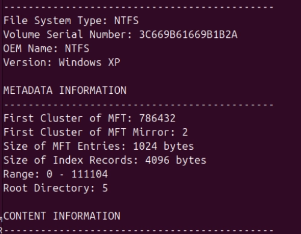

# CCF LAB 2 — Digital Forensic Report (Final)

Course: Computer Forensics and Incident Response
Performed by Nikita Niakhai

---

**Case Number:** Case 1

**Report Reference:** CCF-LAB2-CASE1-2026

**Examiner:** Nikita Niakhai

**Course:** Computer Forensics and Incident Response

**Date of Report:** 31 March 2026

**Evidence Item:** Disk image — `case1.001` (primary working copy)

---

# Digital Forensic Report

## 1. Introduction

The purpose of this report is to document the examination of a disk image provided as part of the CCF Lab 2 forensic file system analysis exercise. The image was assigned to this investigator based on an odd student number (#19), which dictates Case 1. The examination was performed in a controlled forensic environment and the findings presented herein are based solely on artefacts recovered from the provided disk image.

The facts presented within this report fall within the examiner's area of expertise and knowledge, and do not extend to matters or knowledge outside such expertise.

### 1.1 Summary of Case and Tasking

The subject of this investigation is a disk image originating from a Windows-based machine associated with a user persona named **"Hunter"**. The persona appears to represent an IT worker or office employee within a mid-to-large organisation, exhibiting characteristics consistent with malicious or policy-violating conduct. Evidence suggests the persona engaged in network reconnaissance, data exfiltration preparation, use of anti-forensic tools, and communication with an external party ("linux-rul3z") through email and Skype.

The forensic expert was engaged to reconstruct, to the best of their ability, the documentary evidence reflecting the activities conducted on this system, including relevant artefacts, user behaviour patterns, and any indicators of compromise or deliberate anti-forensic activity.

### 1.2 Statement of Compliance

I understand my duty as an expert witness to provide independent assistance by way of objective, unbiased opinion in relation to matters within my expertise. I will inform all parties in the event that my opinion changes on any material issues. All examinations were performed on a read-only mounted copy of the provided image to ensure evidential integrity.

---

## 2. Forensic Examination

All examinations, measurements, tests, and experiments were performed on a virtual machine running **Ubuntu 22.04 LTS** (8 GB RAM, 50+ GB NVMe storage, 3 processors) hosted on a Windows 11 laptop. The 7z archive was extracted directly into the shared folder to prevent transfer corruption, and the disk image was mounted in read-only mode throughout the investigation.

### 2.1 Tools Used

The following forensic tools were employed during the examination:

- **File identification:** `file`, `strings` (GNU coreutils/binutils)
- **Filesystem analysis:** The Sleuth Kit — `fls`, `fsstat` (open-source digital forensics library)
- **Disk imaging verification:** `md5sum` / `sha256sum`
- **Malware analysis:** ClamAV (updated via `freshclam` prior to scanning)
- **Forensic platform:** Autopsy (GUI forensic case management and analysis platform)
- **Registry analysis:** RegRipper (open-source Windows registry extraction tool)
- **Timeline generation:** Autopsy Timeline Module
- **Database artefact extraction:** `sqlite3` (for browser history, Thumbs.db)
- **Email extraction:** `pst-utils` / `readpst`
- **Archive extraction:** `7z`

To the examiner's knowledge, none of the software listed above possesses material issues whose severity would invalidate the findings presented in this report.

### 2.2 Chain of Custody

| Field | Details |
| --- | --- |
| **Evidence Item** | Disk image: `case1.001` |
| **File System Type** | NTFS |
| **Image Size** | ~25 GB (mounted as /dev/loop9) |
| **Platform** | Windows 8.1 Enterprise 64-bit (VirtualBox VM) |
| **Examiner** | Nikita Niakhai |
| **Examination Environment** | Ubuntu 22.04 LTS VM (read-only mount) |
| **Date of Examination** | 31 March 2026 |
| **Acquisition Method** | Archive extracted to shared folder; image mounted read-only via `sudo mount -o ro` |

The disk image was mounted as read-only (`/mnt/evidence` or `/mnt/windows8`) at all times during examination. No write operations were performed on the original image. A copy of the Chrome history database was placed in the examiner's home directory solely for SQLite query access, as SQLite requires write permissions to create temporary files; the original artefact was not modified.

---

### 2.3 Evidence Classes

#### 2.3.1 System and Platform Identification

**Tool:** `file`, `fsstat`, Autopsy (SOFTWARE/SYSTEM registry hives)

Initial analysis of the disk image using the `file` command confirmed the presence of a DOS/MBR boot sector with NTFS formatting. The `fsstat` tool was used to extract full file system statistics.

Key system identifiers recovered:

- **File system type:** NTFS
- **Operating System:** Windows 8.1 Enterprise, 64-bit (Client installation type)
- **Registered owner/main user:** `Hunter`
- **BIOS version (from SYSTEM hive):** `VBOX - 1` — confirming the system operated as a **VirtualBox virtual machine**
- **Active computer hostname:** Recovered from `CurrentControlSet\Control\ComputerName\ActiveComputerName`
- **Network adapters:** VirtualBox virtual adapters detected; no physical hardware adapters present
- **Volume Serial Number:** 3C669B61669B1B2A
- **Total sector range:** 0 – 51,707,902; cluster size: 4,096 bytes

Figure 1. Windows version information extracted from SOFTWARE registry hive via Autopsy

Figure 2. Hardware information confirming BIOS version VBOX-1



Figure 3. File system statistics confirming NTFS, sector and cluster sizes

---

#### 2.3.2 Malware Detection

**Tool:** ClamAV (updated signatures via `freshclam`)

**Timestamp of scan:** 31 March 2026

The disk image was mounted read-only and subjected to a full recursive ClamAV scan. Prior to scanning, virus signatures were refreshed using `freshclam` to ensure up-to-date detection coverage. The following malware signatures were positively identified:

- **Win.Malware.Nymeria-6980619-0** — detected in `Program Files (x86)/Adobe/Acrobat Reader DC/Reader/AcroRd32.exe`
- **Win.Virus.Expiro-6912318-0** — detected in `Program Files (x86)/Common Files/Adobe/ARM/1.0/armsvc.exe`

Both detections are located within Adobe software directories, suggesting either infected installers or post-compromise file infection consistent with the Expiro file infector virus family.

Figure 4. ClamAV scan results showing two confirmed malware detections

---

#### 2.3.3 Timeline Analysis

**Tool:** Autopsy Timeline Module

A comprehensive filesystem timeline was generated using the Autopsy Timeline module, covering all file creation, modification, and access events recorded in the NTFS MFT.

**Key observations:**

- **Active periods:** File system activity spans from approximately 2013 through June 2016.
- **Peak activity year:** 2016 — particularly concentrated in **March** and **June**.
- **High-activity days in March 2016:** 02, 04, 05, 07, 11, 12, 16, 22, 28, 29
- **High-activity period in June 2016:** Multiple days across the month, with 20–21 June being the most intense.

**Significant activities identified on high-activity days:**

- Nmap and WinPcap installation/execution artefacts (network scanning)
- Google Chrome browsing sessions with searches related to firewall bypass, DNS exfiltration, and SSH tunnelling
- Adobe file access, Microsoft Office document activity
- Windows Installer (.msi) artefacts
- Dropbox and McAfee activity
- VirtualBox installation (16 June 2016)
- Skype activity (10 June and 15 June 2016)
- CCleaner execution (15 June 2016) — notable as a potential anti-forensic activity
- All major activities are attributed to the **Hunter** user account

Figure 5. Autopsy timeline showing activity distribution by year (2013–2016)

Figure 6. Monthly breakdown of 2016 activity with peaks in March and June

Figure 7.Artefacts from the most active days, including network tools and browsing evidence

Figure 8. Artefacts from the most active days, including network tools and browsing evidence

---

#### 2.3.4 Windows Registry Artefacts

**Tool:** RegRipper, Autopsy (Registry Viewer)

**Hives examined:** SAM, SYSTEM, SOFTWARE, NTUSER.DAT

**SAM Hive — User Account Information**

Extracted via: `regripper -r /mnt/windows8/Windows/System32/config/SAM -a > /media/sam.txt`

- **Username:** Hunter
- **Account created:** 21 January 2016, 08:37:57 UTC
- **Login count:** 3
- **Password hint:** "What do you do?"
- **Account flags:** Active, password does not expire
- **Additional accounts:** Administrator [500], Guest [501] (default built-in accounts)

Figure 9. SAM hive data showing Hunter account creation date, login count, and password hint

**SYSTEM Hive — Hardware and Device History**

Extracted via: `regripper -r /mnt/windows8/Windows/System32/config/SYSTEM -a > /media/sys.txt`

- **Mounted/USB devices:** History of connected storage volumes recovered
- **Bluetooth:** No Bluetooth devices found
- **USB Storage devices (USBStor):** Two USB devices recorded with connection timestamps:
    - Imation Nano Pro USB Device (first connected: 2016-06-21 01:53:14Z; last removed: 2016-06-21 02:01:38Z)
    - Lexar JumpDrive USB Device (first connected: 2016-06-21 02:01:59Z; last removed: 2016-06-21 02:03:04Z)
- **Unique MAC addresses:** Recovered from network adapter entries
- **DHCP configuration:** 1 network adapter detected with DHCP-assigned addressing

Figure 10. Mounted volumes and device identifiers from SYSTEM hive


Figure 11. USB storage device connection history — Imation and Lexar devices connected on 21 June 2016

Figure 12. Unique MAC addresses recovered from SYSTEM registry hive

Figure 13. DHCP address configuration — single adapter detected

---

#### 2.3.5 Windows Event Logs

**Tool:** Autopsy (evtx viewer), `python3-evtx`

**Location:** `Windows\System32\winevt\Logs\`

The following event log files were identified and analysed:

- `Security.evtx` — logon/logoff events (Event IDs 4624, 4625, 4648, 4720)
- `System.evtx` — system-level events
- `Application.evtx` — application events
- `Windows PowerShell.evtx` — PowerShell execution history
- `Microsoft-Windows-TaskScheduler%4Operational.evtx` — scheduled task activity
- Additional operational logs for Windows Defender, UAC, Terminal Services, and Firewall

Note: Evidence of log clearing was identified — the `Windows PowerShell.evtx` and `APPLIC~1.EVT` files showed MFT metadata consistent with truncation or clearing, as indicated by `$LogFile Sequence Numbers` and zero `Actual Size` values in the Autopsy file analysis. This is consistent with deliberate anti-forensic activity.


Figure 14. Windows event log files present in the image

---

#### 2.3.6 Personal User Data and File System Artefacts

**Tool:** Autopsy (file browser, thumbnail viewer), `sqlite3`

Examination of the Hunter user profile revealed the following artefacts:

- **Desktop:** nmap scan result files; Thumbs.db (corrupted); shortcut files
- **Downloads:** FTK Imager installer, Eraser, Burnout Free, ChromeSetup, DropboxInstaller, and multiple forensic/hacking utility installers with timestamps of 21 June 2016
- **Documents:** PDF files including `Confidential_Document.pdf`, defcon presentations on firewall bypass, `how_do_threat_actors_steal_your_data.pdf`, and `muti-detecting-deterring-both.pdf`; also contained a valid Thumbs.db
- **Recycle Bin (`$Recycle.Bin`):** Deleted files recovered including `.jpg` image files with timestamp metadata
- **Pictures / Music:** Empty or minimal content folders

Notably, images with network infrastructure diagrams and references to hacking resources and security conferences (DEFCON) were found within the user's Documents folder, along with files named `Exfil` and `Exfiltration_Diagram.png` (referenced in recent documents registry key).


Figure 15. Contents of Hunter's Desktop directory in Autopsy


Figure 16. Content of Downloads directory


Figure 17. Nmap scan output file found on Hunter's Desktop


Figure 18. Documents folder contents including network infrastructure image and hacking conference PDFs

---

#### 2.3.7 Email Artefacts

**Tool:** `pst-utils` (`readpst`), Autopsy

**Location:** `Users\Hunter\Documents\Outlook Files\backup.pst`

An Outlook PST backup file was identified and extracted. The following email threads were recovered from the Inbox:

- **From: Skype** — Subject: Skype notification (Arabic-language content)
- **From: Linux rul3z** — Subject: RE: TeamViewer
- **From: Linux rul3z** — Subject: RE: Pics
- **From: Linux rul3z** — Subject: DNS Exfil Videos
- **From: Google** — Subject: New sign-in from Windows
- **From: Linux rul3z** — Subject: File Extensions
- **From: Linux rul3z** — Subject: RE: DNS Exfil Videos
- **From: Linux rules** — Subject: Re: Network Design
- **From: Linux rules** — Subject: Fwd: Network Design *(email contained an attached network topology diagram)*
- **From: Google** — Subject: Sign-in attempt prevented
- **From: Google** — Subject: Access for less secure apps has been turned on
- **From: Microsoft Outlook** — Subject: Microsoft Outlook Test Message

Of particular significance: the email thread titled **"DNS Exfil Videos"** references YouTube links to DNS exfiltration techniques, and the sender (`ehptmsgs@gmail.com`) forwarded a detailed home network topology diagram. The response from `linux-rul3z@hotmail.com` contains language consistent with awareness of detection risk.


Figure 19. Recovered email list from Outlook PST backup


Figure 20. Email containing network design diagram sent to Hunter from [ehptmsgs@gmail.com](mailto:ehptmsgs@gmail.com)

---

#### 2.3.8 Browser Artefacts

**Tool:** `sqlite3`

**Location:** `Users\Hunter\AppData\Local\Google\Chrome\User Data\Default\History` and `Cookies`

Google Chrome history was extracted by copying the SQLite database to the examiner's home directory (required for SQLite temporary file creation) and querying with:

```
sqlite3 ~/chrome_history.db "SELECT datetime(last_visit_time/1000000-11644473600,'unixepoch'), url, title FROM urls ORDER BY last_visit_time;"
```

Significant browsing activity identified on **20 June 2016**, including:

- Searches and visits related to **bypassing firewalls and internet filters** ([wikihow.com](http://wikihow.com))
- Visits to [**verot.net**](http://verot.net) regarding SOCKS proxy tunnelling on restricted networks
- Download of DEFCON 22 presentation: *"Bypass Firewalls Application Whitelists in 20 Seconds"*
- Searches for **SSH for Windows** and firewall bypass techniques
- Cookies database indicating active authenticated sessions

Additionally, **TOR Browser** execution logs were identified, suggesting anonymous browsing activity. TOR Browser was installed under `Users\Hunter\Desktop\Tor Browser\`.


Figure 21. Chrome history showing searches related to firewall bypass and DNS exfiltration


Figure 22. TOR browser log files indicating execution of anonymous browsing software

---

#### 2.3.9 Messenger Artefacts (Skype)

**Tool:** Autopsy (SQLite browser), `sqlite3`

**Location:** `Users\Hunter\AppData\Roaming\Skype\[username]\main.db`

Skype artefacts were recovered, revealing the following:

- **Skype username:** Recovered (hunterehpt-related identity)
- **Hotmail account linked:** `hunterehpt@hotmail.[...]`
- **Primary contact:** `linux-rul3z` (also appearing as email sender `linux-rul3z@hotmail.com`)
- **Chat content recovered:** Conversations referencing DNS exfiltration videos, file extensions, and a deleted 7z archive described as containing "fake porn" — consistent with a social engineering or obfuscation artefact
- **Deleted archive reference:** A `.7z` file linked from Skype chat data was no longer present on the filesystem, indicating deliberate deletion


Figure 23. Skype application data folder contents


Figure 24. Recovered Skype chat data with contact linux-rul3z referencing exfiltration techniques

---

#### 2.3.10 Other Notable Artefacts

**TeamViewer Logs**

TeamViewer connection log files were recovered under the Hunter user profile, indicating that remote access sessions were established or attempted on the subject machine. Timestamps of TeamViewer activity were noted in the UserAssist registry records (2016-06-21 12:00:43Z). This is significant as it indicates the potential for remote third-party access to the system.


Figure 25. TeamViewer log files recovered from the Hunter user profile

**Anti-Forensic Activity Indicators**

Multiple indicators of deliberate anti-forensic activity were identified:

1. **CCleaner** (v5.19) was installed and executed on 21 June 2016, confirmed by both the UserAssist registry key and the uninstall registry entry showing it was subsequently removed on the same day at 11:43:05Z.
2. **Windows PowerShell event log** (`Windows PowerShell.evtx`) was identified with metadata consistent with log clearing.
3. **Application event log** showed similar clearing artefacts.
4. A **7z archive** referenced in Skype chat data was deleted from the filesystem.
5. **Recently accessed documents** (recovered from `NTUSER.DAT` RecentDocs key) included files named `Exfil`, `Exfiltration_Diagram.png`, and `dns-exfiltration-using-sqlmap-18-728.jpg` — files no longer present in their expected locations.


Figure 26. Account information and private file artefacts recovered from Autopsy

---

## 3. Summary of Conclusions

### 3.1 Expert Opinion Regarding Findings

Examination of the forensic image `case1.001` has produced the following conclusions:

**System Environment:** The disk image originates from a Windows 8.1 Enterprise 64-bit virtual machine operating within a VirtualBox environment. The primary (and only active) user account is "Hunter," created on 21 January 2016 with a total of three recorded logins.

**Malicious Software:** Two confirmed malware families were detected — a Nymeria-variant trojan and an Expiro file infector — both residing within Adobe software directories. This indicates either deliberate installation of infected software or post-compromise file infection activity on the subject machine.

**Evidence of Network Reconnaissance:** Filesystem artefacts, browser history, and downloaded tools (nmap, WinPcap, Wireshark Radius dictionary) confirm that the user conducted network scanning and reconnaissance activities during March and June 2016. Browser queries demonstrate targeted research into firewall bypass techniques, DNS-based data exfiltration, SOCKS proxying, and SSH tunnelling.

**Evidence of Communication and Coordination:** Recovered email and Skype artefacts demonstrate that Hunter actively communicated with an external contact (`linux-rul3z@hotmail.com`, also emailing from `ehptmsgs@gmail.com`) about DNS exfiltration techniques, network topology, and file sharing. The contact responded with network infrastructure diagrams and links to DNS exfiltration tutorial videos.

**Anti-Forensic Activity:** The evidence strongly indicates that the user took deliberate steps to conceal their activities, including execution of CCleaner immediately followed by its uninstallation on 21 June 2016, clearing of Windows PowerShell and Application event logs, and deletion of a file archive referenced in Skype communications. The use of TOR Browser further supports an intent to avoid detection.

**USB Exfiltration Indicators:** Two USB storage devices (Imation Nano Pro and Lexar JumpDrive) were connected on 21 June 2016 within a two-hour window — the same day as peak activity, CCleaner execution, and log clearing. This is consistent with data staging and potential physical exfiltration.

**Overall Assessment:** The totality of the evidence — network reconnaissance tools, targeted research into exfiltration techniques, coordination with an external party, use of anonymisation tools, anti-forensic measures, and USB device activity — presents a consistent pattern of behaviour indicative of an individual engaged in, or preparing for, deliberate data exfiltration and/or unauthorised network access.

Further targeted investigation recommended:

- Carving of unallocated disk space for remnants of deleted archives and exfiltrated file fragments
- Correlation of DHCP/MAC data with external network logs
- Full analysis of TOR Browser profile data for .onion site visits
- Examination of any backup or cloud sync artefacts (Dropbox usage observed in timeline)

---

*Report prepared by: Nikita Niakhai*

*Course: Computer Forensics and Incident Response — CCF LAB 2*

*Date: 31 March 2026*

*Evidence reference: case1.001 — Case 1 (odd student number #19)*
