# 2 Forensic file system analysis

Name of report: CCF_LAB_2_Nikita_Niakhai
Course: Computer Forensics and Incident Response
Performed by Nikita Niakhai
Date submission: 31.03.2026
---

> This lab covers **forensic file system analysis** of a compromised Windows system image. The investigation follows forensically sound procedures and produces a report suitable for court presentation.
>
> **Case selection rule:** odd student number → **Case 1**
>
> **Student number odd #19.**

---

# Task 1 — Download the Evidence File

## ✍️ Execution

Case 1 was investigated using Virtual Machine Ubuntu 22.04 with GUI hosted on my Windows 11 laptop. VM has: 8 GB RAM, 50 GB+NVME, 3 processors.

7z archive with the image was transffered to the shared folder configured with the VM and extracted using `7z e archive.7z` command.

Then I referenced presentation with instructions to perform the lab, for checking right approach and tools.

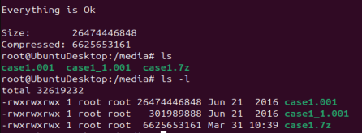

Figure 1.1 — Downloaded image file and integrity hash

---

# Task 2 — Black Box Forensics Analysis

## 2.1 — Platform, System, and File System Identification

- I analyzed the files before mounting:

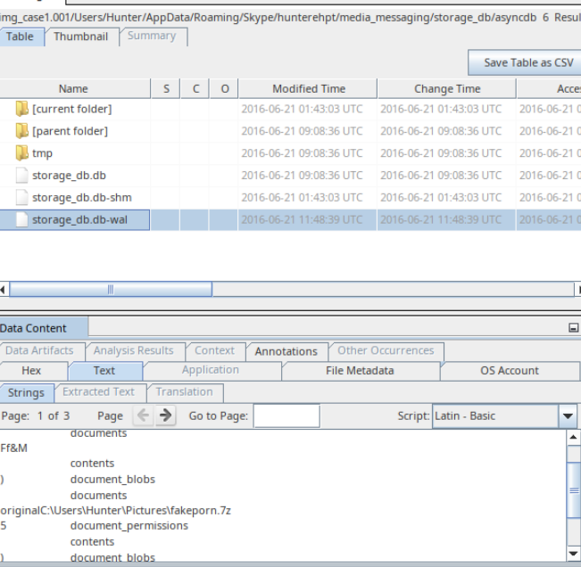

Figure. `files` output on the `case1.001`

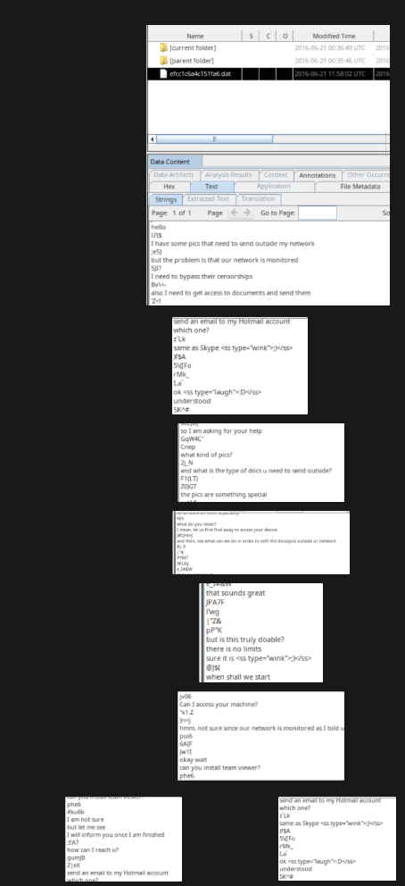

Figure. `files` output on the `case1_1.001`

- I see `NTFS` is used, see **information metrics, numbers about memory** (sectors and tracks), hidden sector of memory
- I see bootstrap `BOOTMGR`
- I see that those files (`case1_1.001 case1.001`) look completely the same, maybe this is the copy only for us. So I pick `case1` to work with because this weights more.

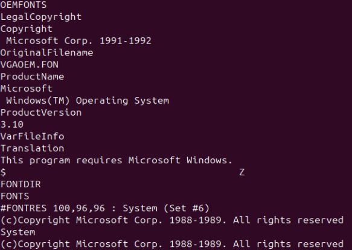

Figure. Some results from `string` on the file

- I runned strings on the file and found out that OS is windows … from Microsoft

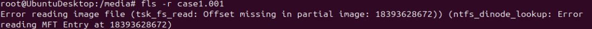

Figure. `fls error` on the file

- Run `fls -r`recursively to show all dirs inside the file. I
    - For some reason I got error on my image running `fls`, something happened while moving my image inside VM, so I decided to unzip the case archive again and do not move it from shared folder. Explanation of the error: tried to access a specific location on the image, but that location was empty or missing → image is incomplete / damaged
    - After right unzpip operation I got only one correct file and was able to do fls

    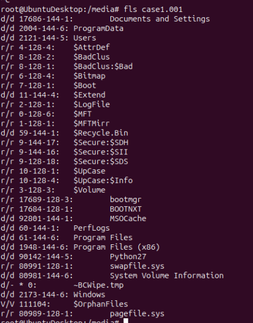

Figure. `fls`on the file

- A student suggested to use all-in-one tool calles Autopsy, so I decided to go with it.

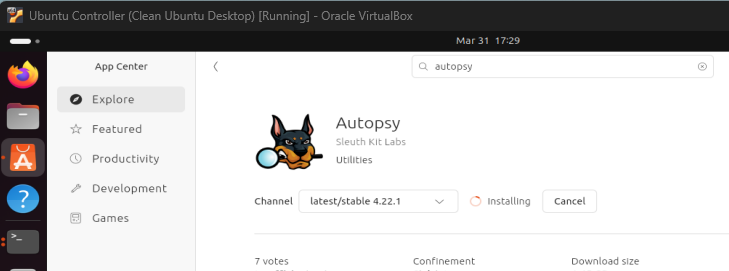

Figure. Downloading Autopsy

- Uploaded the image and setup case, picked some tools and options.

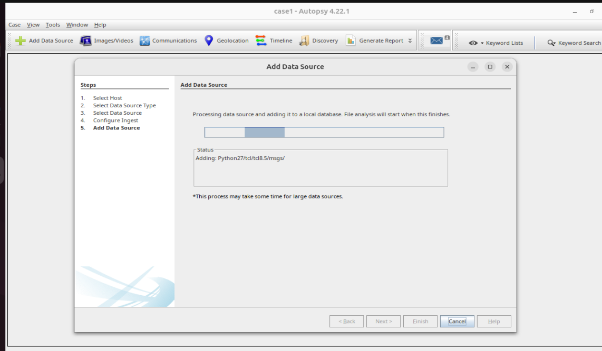

Figure. Autopsy case configuration

- Mounted opened image inside Autopsy — ready to analyze.

    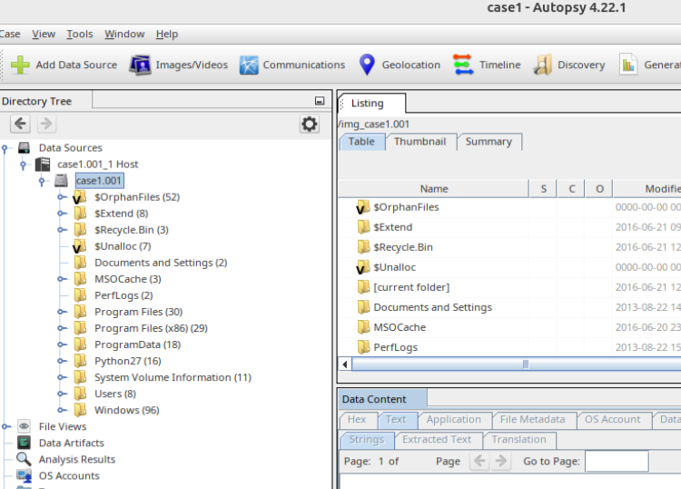

Figure. Autopsy Windows C content

- Went here to analyze system information: `Windows/System32/config/`, inside found and referenced overview on Registry hives from the presentation + explanation of DeepSeek to find information I need.
    - `SOFTWARE`

        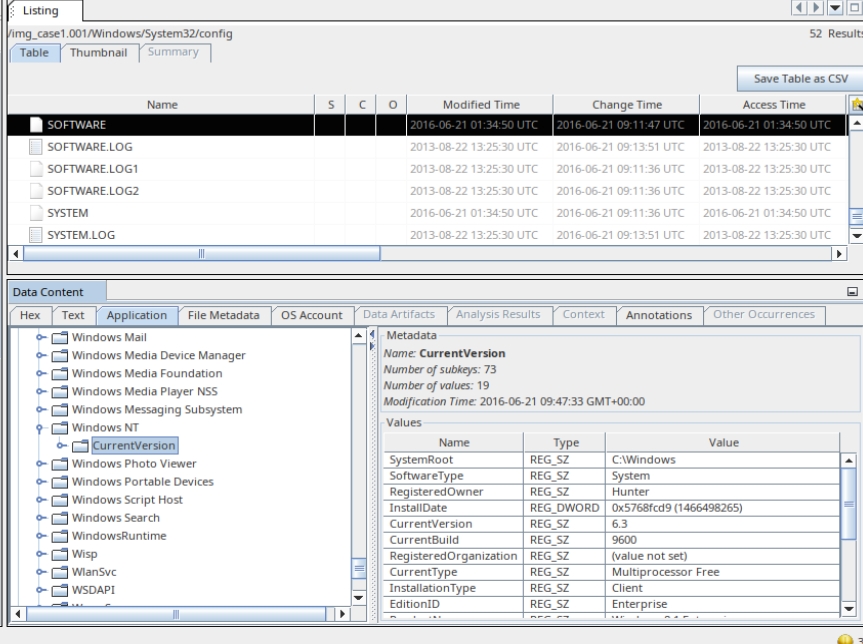

        Figure. System OS information

    - `SYSTEM`

        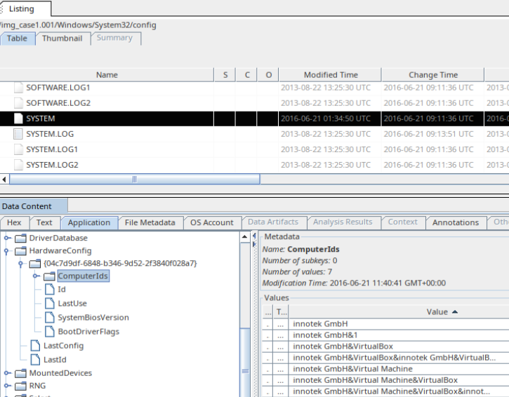

        Figure. Hardware information

        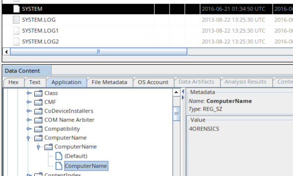

        Figure. Active computer name

        - **Network adapters** Key: `CurrentControlSet\Control\Network\`
        - **Hostname:** Key: `CurrentControlSet\Control\ComputerName\ActiveComputerName`

        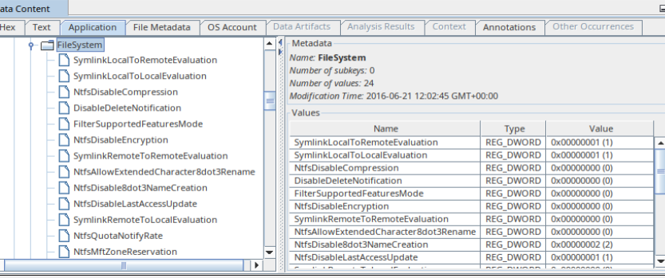

        Figure. Information about filesystem (NTFS)

- Infortmation about Windows installed on this case:
    - file system: `NTFS`
    - OS version: `Windows version and image Windows 8.1 Enterprise 64 bit`
        - Installation type `Client`
        - Registered main user `Hunter`

        

    - This is`Windows VM`, since hardware information says only about **VM**, **VirtualBox**. System bios version is `VBOX - 1`

    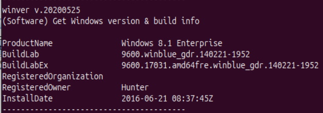

- Used fsstat to analyze the case VM itself (Version OS, File System, Cluster and MFT sizes)

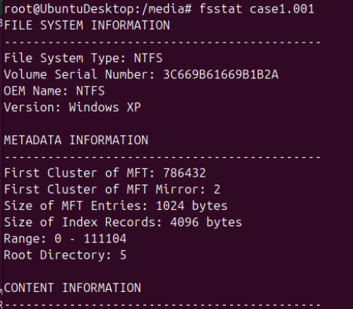

Figure. Information about case001 image `fsstat`

---

## 2.2 — Malware Search

- Mounted the image

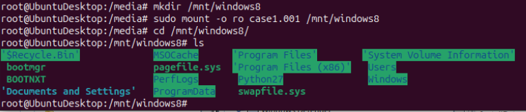

Figure. Mounting image

- Search for viruses using `clamscan`
    - before I runned `freshclam` to update db of sigs and viruses.
    - `clamscan` is taking too much time to analyze since it is recursive and runs through whole disk.
    - I found some Malware viruses of types: `Nymeria-6980619-0`, `Win. Virus. Expiro-6912318-0`

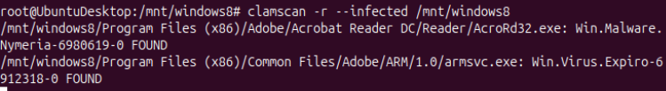

Figure. Running `clamscan` on the mounted disk, Malware scan results

---

## 2.3 — Timeline Creation and Analysis

Created a filesystem timeline usiing Timeline editor in the Autopsy. Active periods are 2013-2016 and 2016 is the most active one.  Especially june, march 2016: 02, 04, 05, 07, 11, 12 ,16, 22, 28, 29 days.

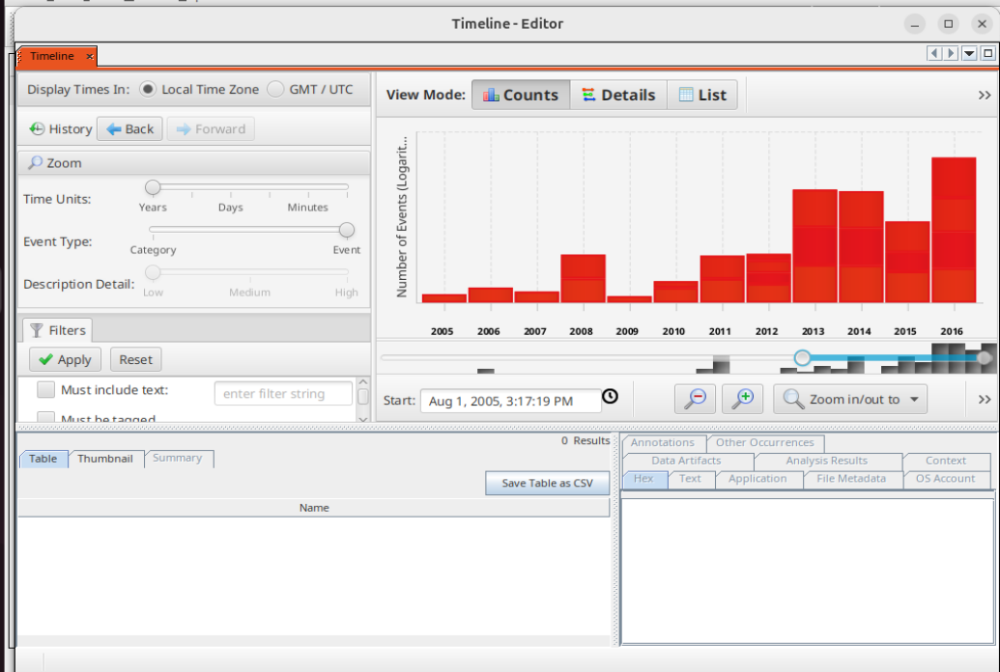

Figure. Timeline years

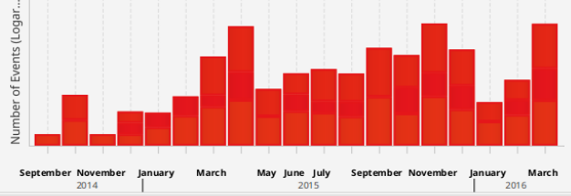

Figure. Timeline months

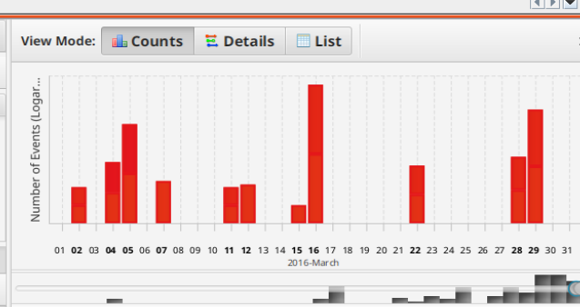

Figure. Timeline days

- Then I decided to analyze the most active day of march 16.03.2016, activities:
    - a lot of `nmap`, `winpcap`
    - and some of Google browsing:

        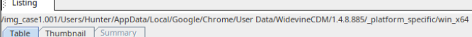

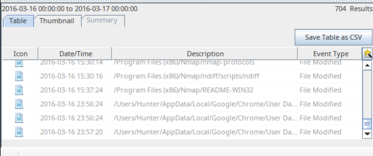

- Then I decided to analyze the most active day of June and 20th, activities:
    - Adobe files
    - Thimbs.db in Downloads
    - Windows Defender scan
    - Microsoft Office files and installation
    - Windows installer msi
    - and some of Google browsing.
    - Dropbox
    - MCaffee
    - Teamviewer
- Virtual box activites and installation on 16.06.2016.
- Skype (10.06.2016 ,15.06.2016,), CCleaner activites on 15.06.2016.

    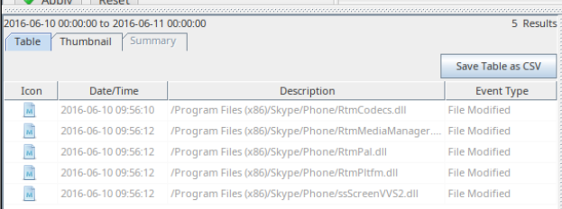

- All activities done by Hunter user using google chrome.

---

## 2.4 — Windows Artefacts Analysis

### 2.4.1 — Windows Registry

- `SAM` using Autopsy + `regripper -r /mnt/windows8/Windows/System32/config/SAM -a > /media/sam.txt`

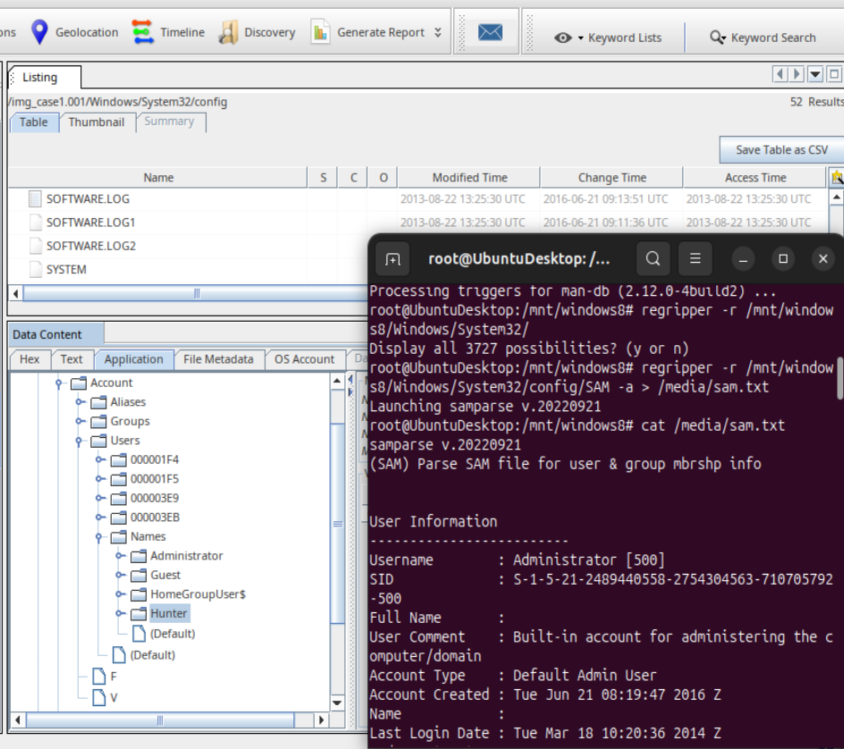

Figure. Overall Information about users

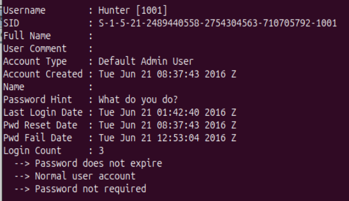

Figure. Information about `Hunter`

- Created on 21.01.2016 08:37:57
- Login count: 3
- Password hint: "What do you do?"

- `SOFTWARE`  `regripper -r /mnt/windows8/Windows/System32/config/SOFTWARE -a > /media/soft.txt`

- `SYSTEM regripper -r /mnt/windows8/Windows/System32/config/SYSTEM -a > /media/sys.txt`
    - Mounted devices:

        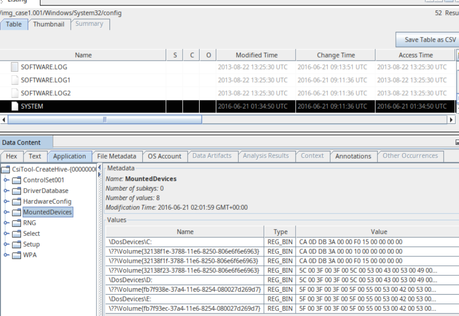

    - Bluetooth devices not found

        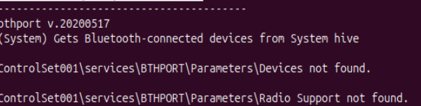

    - USB devices

        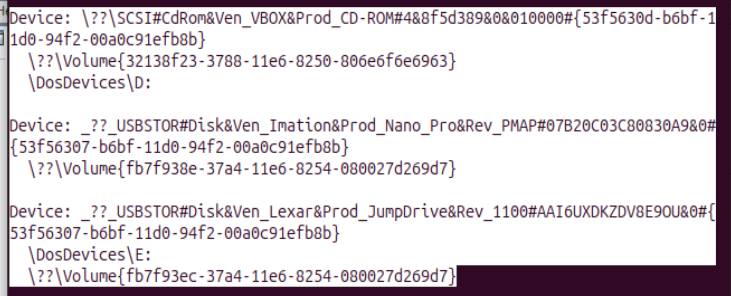

        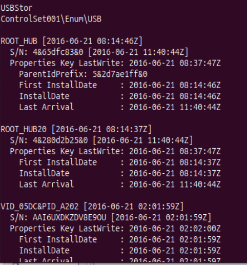

        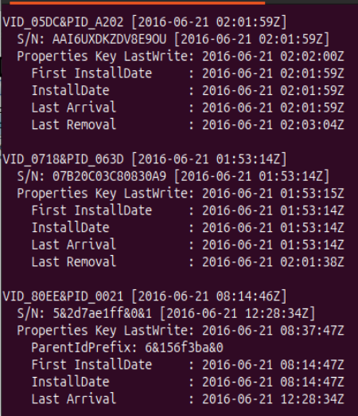

    - Unique MAC addresses

        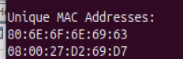

    - DHCP address (1 adapter)

        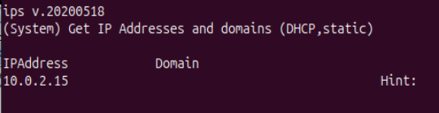

        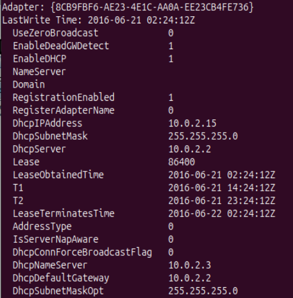

---

### 2.4.2 — Windows Event Logs

- Analysed `.evtx` logs: Security (4624 logons, 4625 failed, 4648, 4720), System, Application, PowerShell, and Task Scheduler logs.  That are find at `%WINDIR%\System32\winevt`contain system events.

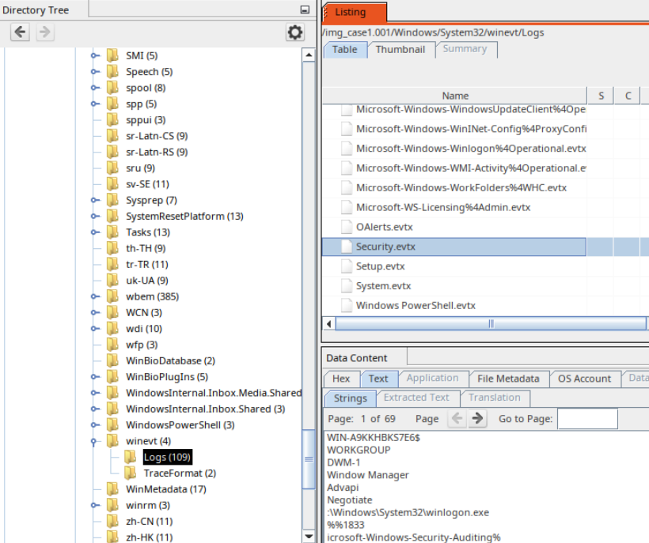

Figure. List of logs

---

### 2.4.3 — Personal User Data

- Examined user profile artefacts: Desktop, Downloads, Documents, Recent files (LNK), Prefetch, Shellbags, Jump Lists, and Recycle Bin.

```bash
"\$Recycle.Bin\|RECYCLER"
```

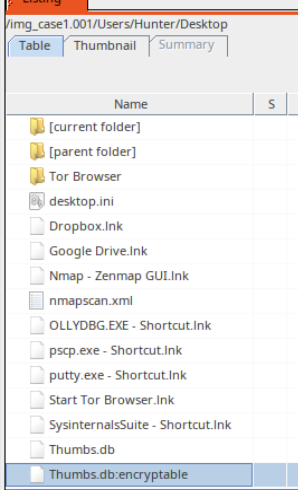

Figure. Desktop of Hunter

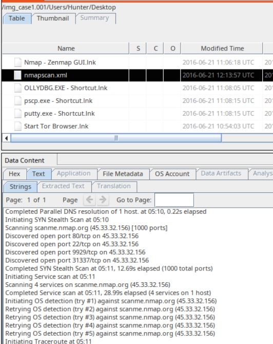

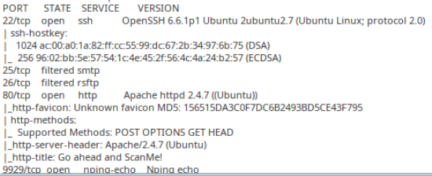

Figure. results of nmap scan

- Installed `sqlite3` to view thumbs db and other files.
- Checked browser data and `thumbsnail db` (the one in Desktop is corrupted, found identical in the Documents folder)

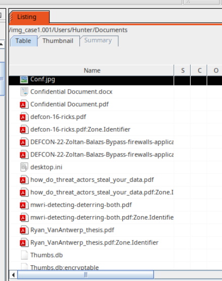

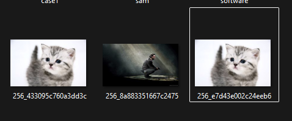

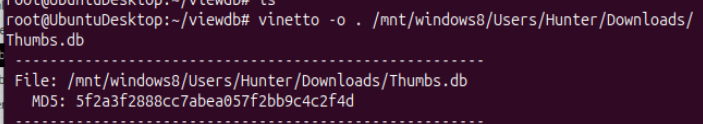

- Found some image with network infrastracture and hacking resoucres and conferences

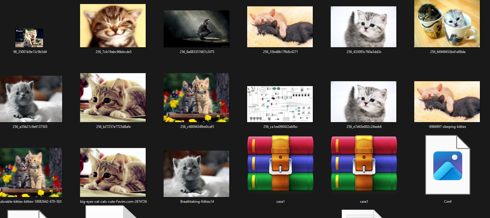

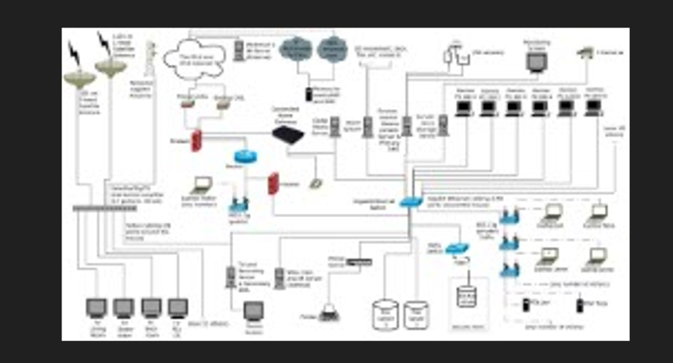

- Found information about some accounts of the Hunter

    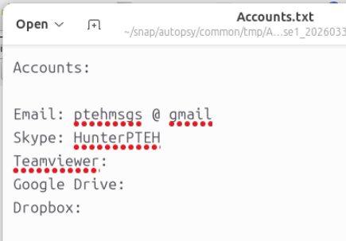

- Found some of his private files

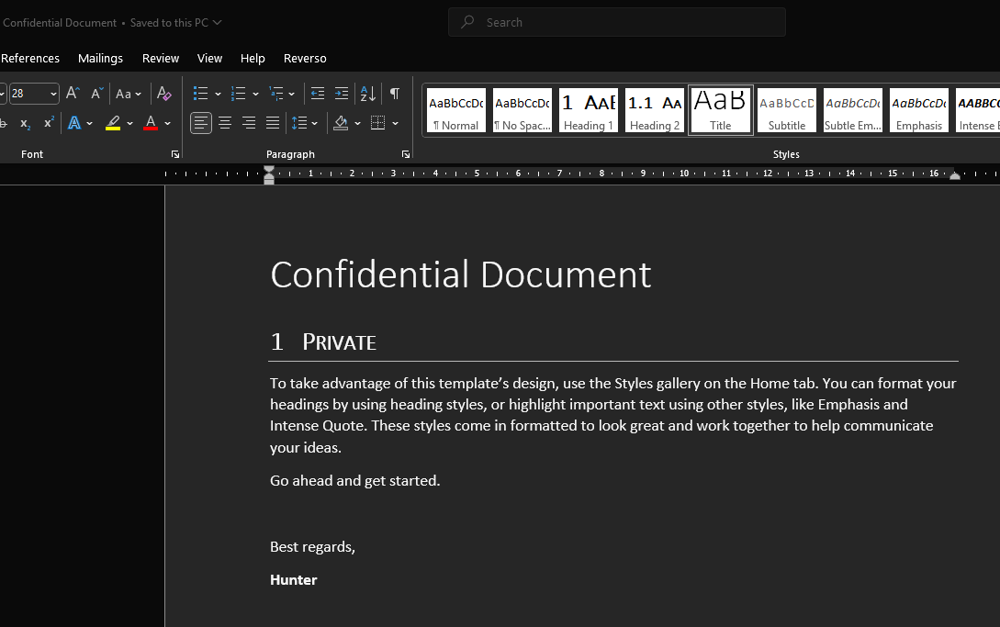

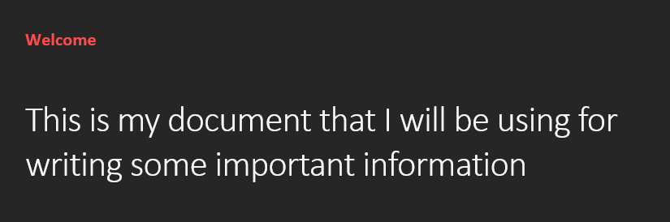

- found some links to the videos (2 of them are not availavle already)

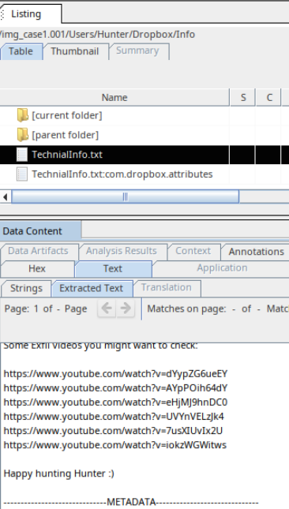

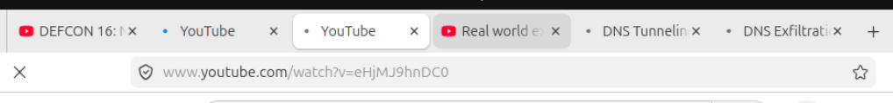

Figure. YouTube videos

---

### 2.4.5 — Email Artefacts

*Search for email clients (Outlook PST/OST, Thunderbird profile), webmail cache, and any email-related files. Note sender, recipient, subject, and timestamps of relevant messages.*

- found outlook backup

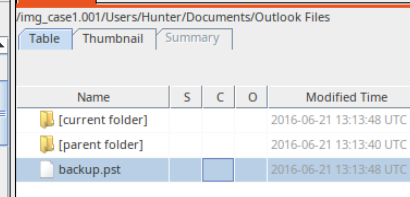

- install tool to open and deal with those email

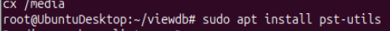

- Viewed emails sent

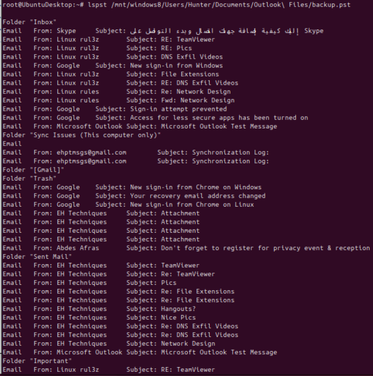

- Found network topology email


---

### 2.4.6 — Browser Artefacts

- Also you could find data and evidence of browsing in TOR ! I read paper about it, but I was lazy to find it.
- Found log data of executing TOR browser:

    

- Found History and Cookies: `"Users/Hunter/AppData/Local/Google/Chrome/User Data/Default/History” , "Users/Hunter/AppData/Local/Google/Chrome/User Data/Default/Cookies”`


---

### 2.4.7 — Messenger Artefacts

- Skype data

    

    - Found link to deleted 7z archive with fake porn

        

    - found user name data

        

    - found some data from skype chats with user`linux-rul3z`:

    


- Found that user has Hotmail account `hunterehpt@hotmail….`


---

### 2.4.9 — Other Notable Artefacts

Found TeamViewer logs:


---

# Task 3 — Forensic Report

CCF LAB 2 — Digital Forensic Report (Final)
