# 1 Reverse Engineering

Name of report: Assembly_RE_LAB_1_Nikita_Niakhai
Course: Offensive Technologies with Elements of ML
Performed by Nikita Niakhai
Date submission: 30.03.2026
---

> **Assembly** language is the human-readable representation of the computer's native language. It is a key component in creating effective shellcode and understanding exploit development. This lab covers disassembly, binary analysis, and reverse engineering of provided binaries.
>
> **Compile commands reference:**
>
> `sample64` → `gcc -fno-stack-protector -g -o sample64 sample.c`
>
> `sample64-2` → `gcc -o sample64-2 sample.c`
>
> `sample32` → `gcc -m32 -fno-stack-protector -g -o sample32 sample.c`

> **Report notes from the lab:**
>
> - Make the report as **technical** as possible — no installation guides.
> - Always include **PoC code** where required.
> - Assembly code must be in **formatted code blocks**.
> - Command output must be **readable** — preserve formatting.
> - Inline commands must be **highlighted** (bold, inline code, etc.).

---

# 1. Preparation

## ✍️ Environment Setup

I used tools: `GDB`, `GEF`, `gcc` tools.

**`gcc-multilib` + `libc6-i386`:** to run and compile 32-bit binaries. Without them, the sample32 binary won't execute and `gcc -m32` won't work.

`GDB` is the standard Linux debugger. `GEF` plugin adds colors, heap analysis, register views, and exploit-dev commands. This will allow to set breakpoints, inspect stack, step through assembly.

```bash
sudo apt update && sudo apt install -y gdb gcc gcc-multilib \
  libc6-i386 libc6-dev-i386 binutils python3 python3-pip

# Clone the repo
git clone https://github.com/hugsy/gef.git ~/.gef

# Tell GDB to load it on startup
echo "source ~/.gef/gef.py" >> ~/.gdbinit
```

---

# 2. Theory

## a. What is ASLR and why do we need it?

***Address Space Layout Randomization** — randomizes memory addresses of the stack, heap, and libraries at each execution to make exploitation harder.*

It randomizes actual addresses for heap, memory that prevents attacker to reverse engineer the code, systems. Making them randomized for every enter for the function/program.

We use it for security reasons.

## b, c. What architecture are the received binaries (32-bit or 64-bit)? What do stripped binaries mean?

***Stripped binaries** have had their symbol table and debug information removed — function names, variable names, and line numbers are gone, making reverse engineering harder.*

I used `file` tool to detect striped files.

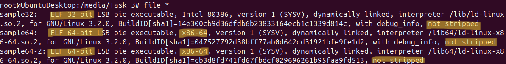

Figure. `file` command output for task 3

All files for task 3 are all ***not striped***. `sample32` - is a 32 bit file — easier to crack, since ASLR is not that hard comparing to 64 bit files. All other files are 64 bit.

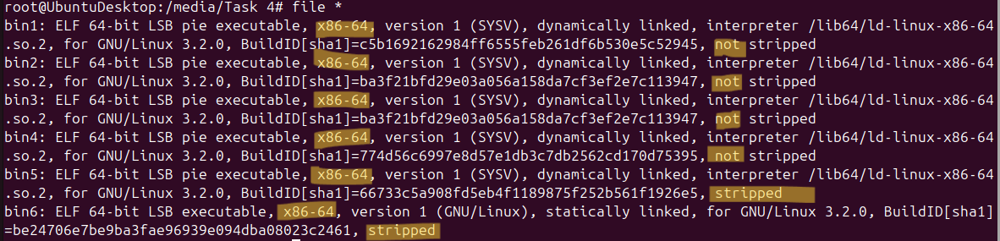

Figure. `file` command output for task 4

For task 4 all files are 64 bit (`x86-64` means that). Files `bin6`, `bin5` are ***stripped*,** all other files are **not stripped**.

## d. What are GOT and PLT?

*GOT — is the Global Offset Table is a table that binds function calls to real addresses of functions, written in other libraries that we connect to our files, that have their body and execution not in out current folder/project.*

*PLR — is the Procedure Linkage Table (PLT) are mechanisms used in ELF binaries for dynamic linking and lazy symbol resolution.*

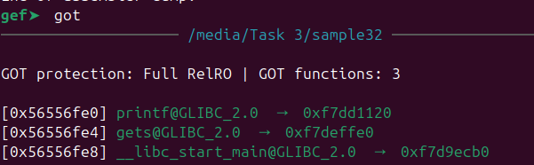

Figure. `got` entries

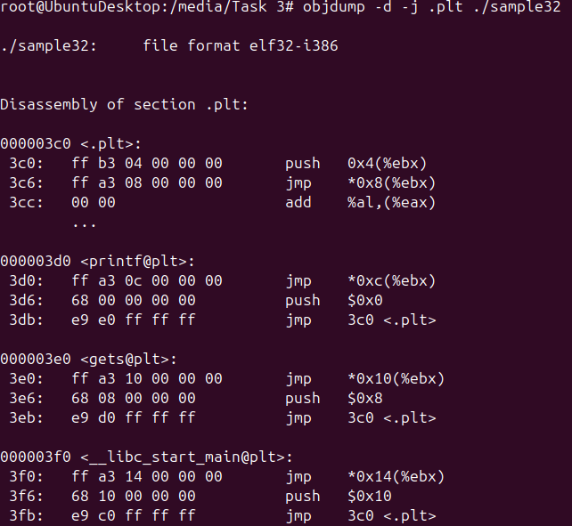

Figure. `PLT` entries

## e. How can a debugger insert a breakpoint in a debugged binary?

> *Write your answer here.*
>

*A software breakpoint replaces the target instruction with an `INT 3` (`0xCC`) opcode. When the CPU hits it, execution is suspended and control passes to the debugger.*

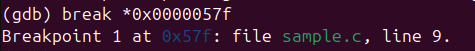

Figure. Setting breakpoint at specific address inside a function

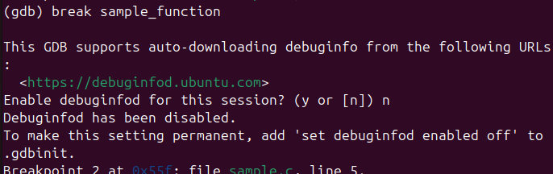

Figure. Setting breakpoint at the function

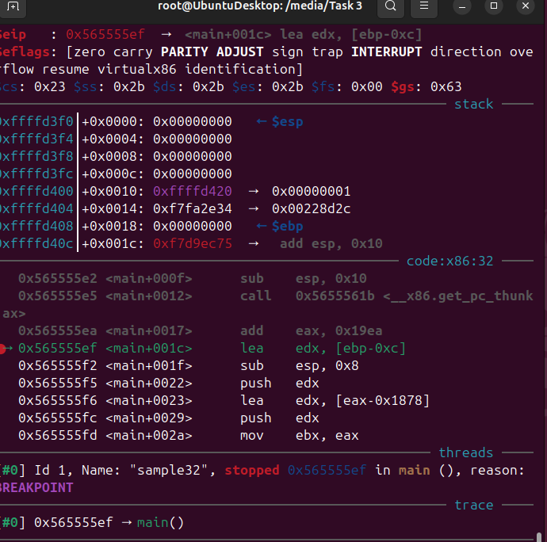

Figure. Running code with breakpoint at the function main

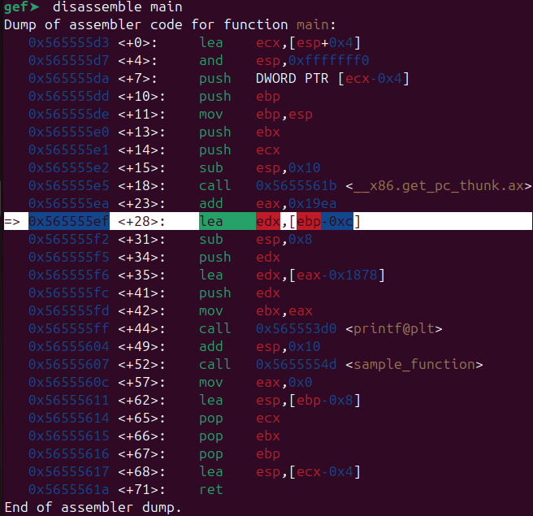

Figure. on highlighted line the breakpoint is set, also ⇒ is present

---

# 3. Disassembly

## a. Disable ASLR

```bash
# Check current status
cat /proc/sys/kernel/randomize_va_space

# Enable
sudo sysctl -w kernel.randomize_va_space=0

# Verify
cat /proc/sys/kernel/randomize_va_space

# Disable after the lab
sudo sysctl -w kernel.randomize_va_space=2
```

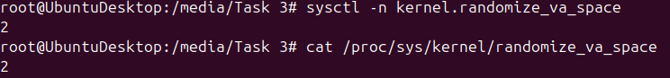

Figure. Values by default

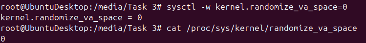

Figure. ASLR is disabled

## b. Load Binaries from Task 3 Folder

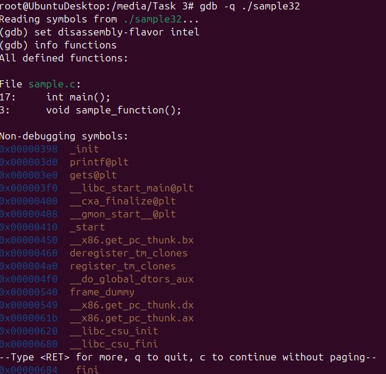

Figure. Loading and disassembling the file `sample32`.

I used `gdb -q file_name` to load the file into the tool, then I set disassembly style to intel

> GDB will use the Intel disassembly style (e.g. **mov eax, DWORD PTR [ebp+0xc]**) that is popular among Windows users.
>

*Describe how you loaded each binary into your disassembler/debugger.*

```bash
# Inside GDB
gef> set disassembly-flavor intel

# List all functions
gef> info functions

# Disassemble main
gef> disassemble main
```

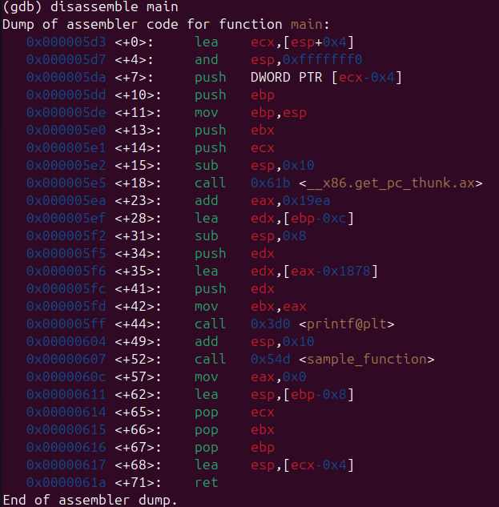

Figure  — `sample32` main disassembled

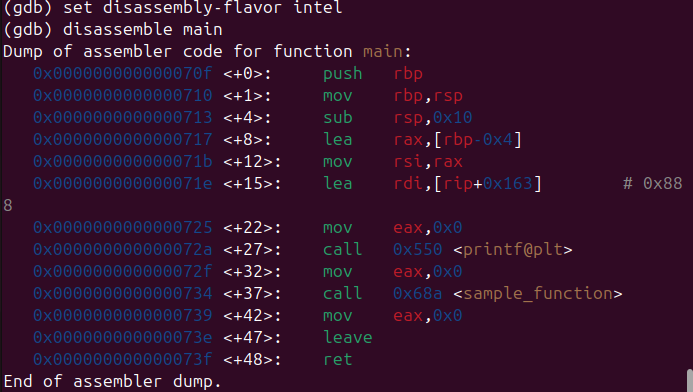

Figure  — `sample64` main disassembled

I used `strings` to analyze the strings (print all strings in the file) and received some interesting information:

```bash
for sample32

In sample_function(), i is stored at 0x%08x.
In sample_function(), buffer is stored at 0x%08x.
Value of i before calling gets(): 0x%08x
Value of i after calling gets(): 0x%08x
In main(), x is stored at 0x%08x.

for sample64

In sample_function(), i is stored at %p.
In sample_function(), buffer is stored at %p.
Value of i before calling gets(): 0x%llx
Value of i after calling gets(): 0x%llx
In main(), x is stored at %p.
```

Options to analyze:

- What system calls does it make? (does it open network sockets? delete files?). Run with `strace` to see syscalls WITHOUT giving it real execution freedom
    - `strace -f ./binary_name`
- What library functions does it call? (system(), exec(), unlink()?)
    - `ltrace ./binary_name`

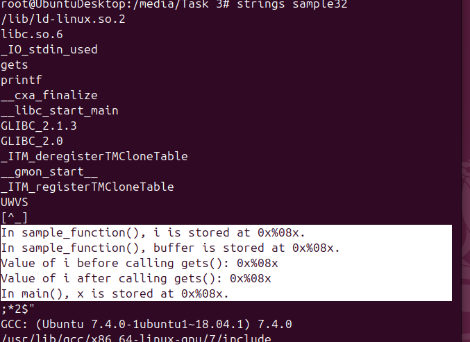

Figure. `strings` output for `sample32`

## c. Do the function prologue and epilogue differ in 32-bit vs 64-bit?

Prologue function is `_init`

Epilogue function is `_fini`

They deffer basically in 64 version new commands are added

Difference between ini and fini calls:`mov`, `test`,`je`,`call` in the middle of the sequence of actions performed.

Same structure, different register names. 32-bit: **EBP/ESP** (4 bytes). 64-bit: **RBP/RSP** (8 bytes). Stack frame sizes may also differ due to alignment requirements (64-bit enforces 16-byte alignment).

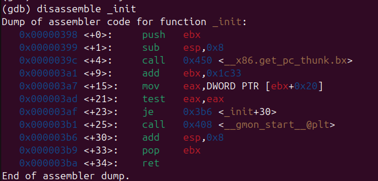

Figure  — `sample32` Prologue function disassembled

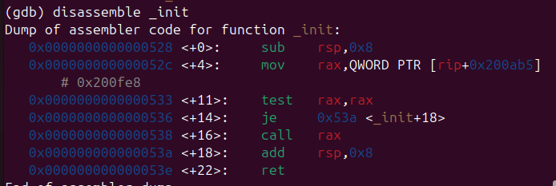

Figure  — `sample64` Prologue function disassembled

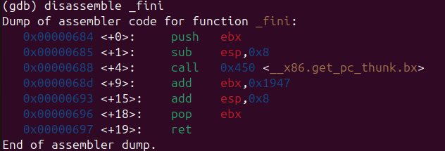

Figure  — `sample32` Epilogue function disassembled

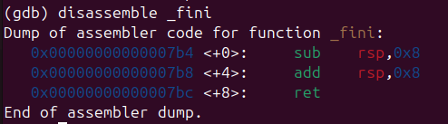

Figure  — `sample64` Epilogue function  disassembled

## d. Do function calls differ in 32-bit vs 64-bit? What about argument passing?

- Arguments go into registers instead of stacks in 64 bit — RDI (arg1)m RSI (arg2), RDX (arg3) … And no push and cleanup operations.
- After calls no stack clenaup needed in 64 bit.
- 64 bit uses different approach to find string addresses: `lea rdi, [rip+offset]`

**Differences in Assembly:**

```bash
; === 32-bit (sample32) ===
lea    eax, [ebp-0xc]          ; eax = &i
sub    esp, 0x8                ; align stack
push   eax                     ; arg2 → stack
lea    eax, [ebx-0x1934]      ; eax = format string (PIC)
push   eax                     ; arg1 → stack
call   printf@plt
add    esp, 0x10               ; clean up stack

; === 64-bit (sample64) ===
lea    rax, [rbp-0x8]          ; rax = &i
mov    rsi, rax                ; arg2 → RSI register
lea    rdi, [rip+0x11f]       ; arg1 → RDI register (RIP-relative)
mov    eax, 0x0                ; 0 float args in SSE
call   printf@plt
                               ; no cleanup needed
```

`sample32`

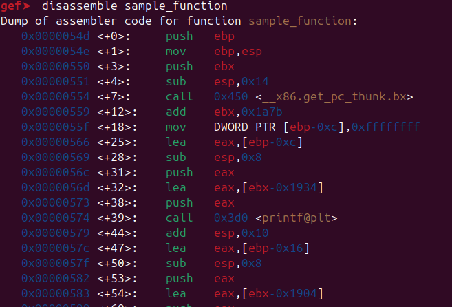

```nasm
gef➤  disassemble sample_function 
Dump of assembler code for function sample_function:
   0x0000054d <+0>:	push   ebp
   0x0000054e <+1>:	mov    ebp,esp
   0x00000550 <+3>:	push   ebx
   0x00000551 <+4>:	sub    esp,0x14
   0x00000554 <+7>:	call   0x450 <__x86.get_pc_thunk.bx>
   0x00000559 <+12>:	add    ebx,0x1a7b
   0x0000055f <+18>:	mov    DWORD PTR [ebp-0xc],0xffffffff
   0x00000566 <+25>:	lea    eax,[ebp-0xc]
   0x00000569 <+28>:	sub    esp,0x8
   0x0000056c <+31>:	push   eax
   0x0000056d <+32>:	lea    eax,[ebx-0x1934]
   0x00000573 <+38>:	push   eax
   0x00000574 <+39>:	call   0x3d0 <printf@plt>
   0x00000579 <+44>:	add    esp,0x10
   0x0000057c <+47>:	lea    eax,[ebp-0x16]
   0x0000057f <+50>:	sub    esp,0x8
   0x00000582 <+53>:	push   eax
   0x00000583 <+54>:	lea    eax,[ebx-0x1904]
   0x00000589 <+60>:	push   eax
   0x0000058a <+61>:	call   0x3d0 <printf@plt>
   0x0000058f <+66>:	add    esp,0x10
   0x00000592 <+69>:	mov    eax,DWORD PTR [ebp-0xc]
   0x00000595 <+72>:	sub    esp,0x8
   0x00000598 <+75>:	push   eax
   0x00000599 <+76>:	lea    eax,[ebx-0x18d0]
   0x0000059f <+82>:	push   eax
   0x000005a0 <+83>:	call   0x3d0 <printf@plt>
   0x000005a5 <+88>:	add    esp,0x10
   0x000005a8 <+91>:	sub    esp,0xc
   0x000005ab <+94>:	lea    eax,[ebp-0x16]
   0x000005ae <+97>:	push   eax
   0x000005af <+98>:	call   0x3e0 <gets@plt>
   0x000005b4 <+103>:	add    esp,0x10
   0x000005b7 <+106>:	mov    eax,DWORD PTR [ebp-0xc]
   0x000005ba <+109>:	sub    esp,0x8
   0x000005bd <+112>:	push   eax
   0x000005be <+113>:	lea    eax,[ebx-0x18a4]
   0x000005c4 <+119>:	push   eax
   0x000005c5 <+120>:	call   0x3d0 <printf@plt>
   0x000005ca <+125>:	add    esp,0x10
   0x000005cd <+128>:	nop
   0x000005ce <+129>:	mov    ebx,DWORD PTR [ebp-0x4]
   0x000005d1 <+132>:	leave
   0x000005d2 <+133>:	ret
End of assembler dump.
```

`sample64`

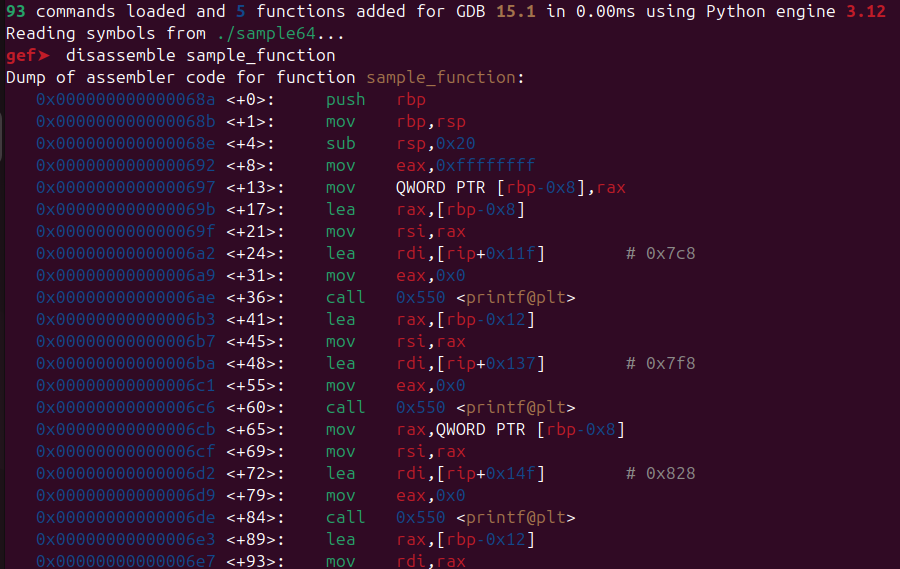

```bash
gef➤  disassemble sample_function 
Dump of assembler code for function sample_function:
   0x000000000000068a <+0>:	push   rbp
   0x000000000000068b <+1>:	mov    rbp,rsp
   0x000000000000068e <+4>:	sub    rsp,0x20
   0x0000000000000692 <+8>:	mov    eax,0xffffffff
   0x0000000000000697 <+13>:	mov    QWORD PTR [rbp-0x8],rax
   0x000000000000069b <+17>:	lea    rax,[rbp-0x8]
   0x000000000000069f <+21>:	mov    rsi,rax
   0x00000000000006a2 <+24>:	lea    rdi,[rip+0x11f]        # 0x7c8
   0x00000000000006a9 <+31>:	mov    eax,0x0
   0x00000000000006ae <+36>:	call   0x550 <printf@plt>
   0x00000000000006b3 <+41>:	lea    rax,[rbp-0x12]
   0x00000000000006b7 <+45>:	mov    rsi,rax
   0x00000000000006ba <+48>:	lea    rdi,[rip+0x137]        # 0x7f8
   0x00000000000006c1 <+55>:	mov    eax,0x0
   0x00000000000006c6 <+60>:	call   0x550 <printf@plt>
   0x00000000000006cb <+65>:	mov    rax,QWORD PTR [rbp-0x8]
   0x00000000000006cf <+69>:	mov    rsi,rax
   0x00000000000006d2 <+72>:	lea    rdi,[rip+0x14f]        # 0x828
   0x00000000000006d9 <+79>:	mov    eax,0x0
   0x00000000000006de <+84>:	call   0x550 <printf@plt>
   0x00000000000006e3 <+89>:	lea    rax,[rbp-0x12]
   0x00000000000006e7 <+93>:	mov    rdi,rax
   0x00000000000006ea <+96>:	mov    eax,0x0
   0x00000000000006ef <+101>:	call   0x560 <gets@plt>
   0x00000000000006f4 <+106>:	mov    rax,QWORD PTR [rbp-0x8]
   0x00000000000006f8 <+110>:	mov    rsi,rax
   0x00000000000006fb <+113>:	lea    rdi,[rip+0x156]        # 0x858
   0x0000000000000702 <+120>:	mov    eax,0x0
   0x0000000000000707 <+125>:	call   0x550 <printf@plt>
   0x000000000000070c <+130>:	nop
   0x000000000000070d <+131>:	leave
   0x000000000000070e <+132>:	ret
End of assembler dump.
```

## e. What does the `ldd` command do?

>
>
>
> 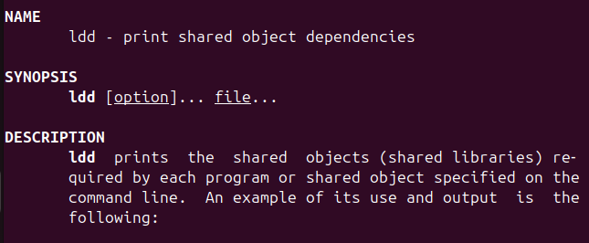
>

`*ldd` prints the shared libraries required by a binary and their resolved load addresses.*

```bash
ldd ./sample64
ldd ./sample32
```

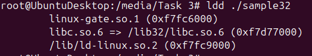

Figure — `ldd` output for sample64 and sample32

So for sample32 libs `libc` and `ld` are required to run the file.

## f. Why didn't the value of `i` change in `sample64-2` even with a very long input?

`sample64-2` is compiled without `-fno-stack-protector` and with modern compiler optimizations.

**Before:**

The value of `i` doesn't change because the compiler reordered the stack layout to protect variables from buffer overflows. Here's the proof from the assembly:
In `sample64` (no protection), `i` was at `[RBP-0x8]` and the buffer at `[RBP-0x12]`. The buffer sat below `i`, so overflowing upward hit `i` directly.

**After:**

In `sample64-2`, the compiler flipped the layout:

- `i` is now at `[RBP-0x20]` — the **lowest** address on the stack
- buffer is at `[RBP-0x12]` — **above** `i`
- canary is at `[RBP-0x8]` — **above** the buffer, guarding the saved RBP and return address

**Conclusion:**

- Variable reordering: `i` is places at higher address, overflow gets away — it can not reach it.
- Stack canary: nevertheless `i` is safe, the overflow *will* hit the canary at `[RBP-0x8]`

    ```bash
    mov    rax, QWORD PTR [rbp-0x8]    ; reload canary from stack
    xor    rax, QWORD PTR fs:0x28      ; XOR with original value
    je     0x7a0                        ; if equal (XOR = 0), canary intact → continue
    call   __stack_chk_fail@plt         ; if corrupted → abort the program
    ```


Figure — sample64-2 stack layout showing why `i` is protected

---

# 4. Reversing

| **Bin** | **Stripped** | **Linking** | **PLT imports (clues)** | **Likely behavior** |
| --- | --- | --- | --- | --- |
| bin1 | **no** | **dynamic** | printf, time, localtime, __stack_chk_fail | `Prints date/time` |
| bin2 | **no** | **dynamic** | printf, __stack_chk_fail | `Prints computed value` |
| bin3 | **no** | **dynamic** | printf, __stack_chk_fail | `Same hash as bin2!` |
| bin4 | **no** | **dynamic** | printf, scanf, __stack_chk_fail | `Reads input + prints` |
| bin5 | **yes** | **dynamic** | printf, scanf, __stack_chk_fail | `Same as bin4 but stripped` |
| bin6 | **yes** | **static** | no PLT (all inlined) | `Hardest — no symbols at all` |
|  |  |  |  |  |
- run `file` command
- run `info functions`, found out that there are 0 defined functions, so that only main function is available to be disassembled.
- run `disassemble main` on bin1..4, got assamble code
- finding entry address for bin5,6 (stripped)

    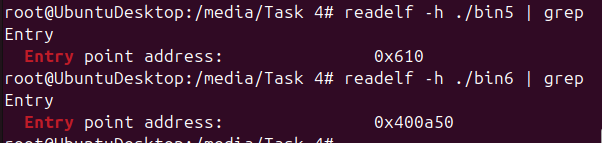

- run `x/20i 0x<entry_address_from_readelf>` to see the assembly rows (count=20) starting from entry address
- then found first appearance of
`lea   rdi, [rip+` - this is main() entry

    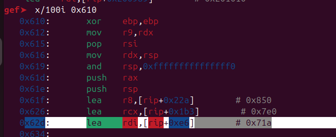

    Figure. `bin5` assemble code with main address

- for bin6 a lot of stuff before main() entry, but inside main, not as much as in bun5. Completely looked wrong and never ending, probably somehow corrupted. So that means I disassembled string section instead of main function.

    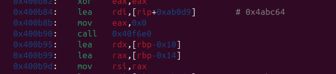

    Figure. `bin6` assemble code with main address

- send diassembly with my notes to claude to generate c code.

## Binary 1

*Describe what the binary does based on disassembly analysis.*

```c
/*
 * bin1 - Date/Time Printer
 *
 * Assembly analysis:
 *   - Calls time(NULL) to get current epoch
 *   - Calls localtime(&rawtime) to get struct tm pointer
 *   - Reads 7 fields from struct tm at offsets:
 *       [rax+0x14] = tm_year (offset 20)
 *       [rax+0x10] = tm_mon  (offset 16)
 *       [rax+0x0c] = tm_mday (offset 12)  -- actually tm_hour per struct layout
 *       [rax+0x18] = tm_wday (offset 24)
 *       [rax+0x04] = tm_min  (offset 4)
 *       [rax+0x1c] = tm_yday (offset 28)
 *   - printf with 7 args (arg7 pushed on stack = more than 6 register args)
 *
 * NOTE: The exact format string and argument order depend on the
 *       rodata section. Run: objdump -s -j .rodata ./bin1
 *       to see the actual format string, then adjust below.
 */

#include <stdio.h>
#include <time.h>

int main() {
    time_t rawtime = time(NULL);
    struct tm *t = localtime(&rawtime);

    // The assembly passes these struct tm fields to printf:
    // tm_year(+1900), tm_mon(+1), tm_mday, tm_hour, tm_min, tm_sec, tm_yday
    // Exact format string needs verification via: objdump -s -j .rodata ./bin1
    printf("%d/%d/%d %d:%d:%d %d\n",
           t->tm_year + 1900,
           t->tm_mon + 1,
           t->tm_mday,
           t->tm_hour,
           t->tm_min,
           t->tm_sec,
           t->tm_yday);

    return 0;
}
```

## Binary 2, 3

*Describe what the binary does based on disassembly analysis.*

```c
/*
 * bin2 / bin3 - Array Doubler (identical binaries, same BuildID)
 *
 * Assembly analysis:
 *   - Local variable: int i at [rbp-0x64]
 *   - Array: int arr[20] at [rbp-0x60] (20 * 4 bytes = 80 bytes)
 *
 *   Loop 1 (fill): i = 0 to 19
 *     lea edx, [rax+rax*1]     → edx = i + i = i * 2
 *     mov [rbp+rax*4-0x60], edx → arr[i] = i * 2
 *
 *   Loop 2 (print): i = 0 to 19
 *     mov edx, [rbp+rax*4-0x60] → edx = arr[i]
 *     mov esi, eax               → esi = i
 *     printf(format, i, arr[i])
 *
 *   cmp 0x13 + jle = loop while i <= 19 (0x13 = 19 decimal)
 */

#include <stdio.h>

int main() {
    int arr[20];
    int i;

    // Loop 1: fill array with i * 2
    for (i = 0; i <= 19; i++) {
        arr[i] = i * 2;
    }

    // Loop 2: print each element
    for (i = 0; i <= 19; i++) {
        printf("arr[%d] = %d\n", i, arr[i]);
    }

    return 0;
}
```

## Binary 4

*Describe what the binary does based on disassembly analysis.*

```c
/*
 * bin4 - Odd/Even Checker
 *
 * Assembly analysis:
 *   - printf(prompt)                  → prints "Enter a number: " or similar
 *   - scanf("%d", &num)               → reads int into [rbp-0xc]
 *   - and eax, 0x1                    → eax = num & 1 (isolate lowest bit)
 *   - test eax, eax                   → check if result is zero
 *   - jne → odd branch                → if bit is set, number is odd
 *
 *   Even path (+74): printf(even_format, num)
 *   Odd path  (+98): printf(odd_format, num)
 *
 *   "and 0x1" + "test" + "jne" is the classic bitwise even/odd check.
 *   Equivalent to: if (num % 2 != 0) goto odd;
 */

#include <stdio.h>

int main() {
    int num;

    printf("Enter a number: ");
    scanf("%d", &num);

    if (num % 2 == 0) {
        printf("%d is even\n", num);
    } else {
        printf("%d is odd\n", num);
    }

    return 0;
}
```

## Binary 5

*Describe what the binary does based on disassembly analysis.*

```c
/*
 * bin5 - Factorial Calculator (stripped binary)
 *
 * Finding main: bin5 is stripped, so "disassemble main" fails.
 * Used: readelf -h ./bin5 | grep Entry → found entry point
 * Then: x/20i <entry> → found lea rdi,[rip+...] loading 0x71a into RDI
 * before calling __libc_start_main → 0x71a is main.
 *
 * Assembly analysis of main at 0x71a:
 *   - mov QWORD PTR [rbp-0x10], 0x1     → long result = 1
 *   - printf(prompt)                      → "Enter a number: " or similar
 *   - scanf("%d", &num)                   → reads int into [rbp-0x18]
 *
 *   - test eax, eax                       → check if num is negative
 *   - jns → skip to loop                  → if non-negative, continue
 *   - printf(error_msg)                   → "negative number" error
 *   - jmp to exit                         → skip calculation
 *
 *   Loop (factorial calculation):
 *   - mov DWORD PTR [rbp-0x14], 0x1      → int i = 1
 *   - imul rax, rdx                       → result = result * i
 *   - mov QWORD PTR [rbp-0x10], rax      → store back to result
 *   - add [rbp-0x14], 0x1                → i++
 *   - cmp [rbp-0x14], eax                → i <= num?
 *   - jle → loop body                     → continue if i <= num
 *
 *   - printf(result_format, num, result)  → print the factorial
 *
 * Key observations:
 *   - result is QWORD (8 bytes / long) at [rbp-0x10] → handles large factorials
 *   - jns = "jump if not sign" = jump if SF=0 = jump if non-negative
 *   - imul rax, rdx = signed multiply, result stored in rax
 */

#include <stdio.h>

int main() {
    long result = 1;
    int num;
    int i;

    printf("Enter a number: ");
    scanf("%d", &num);

    if (num < 0) {
        printf("Error: negative number\n");
    } else {
        for (i = 1; i <= num; i++) {
            result = result * i;
        }
        printf("Factorial of %d = %ld\n", num, result);
    }

    return 0;
}
```
