# 2 Buffer Overflow

Name of report: Buf_Over_LAB_2_Nikita_Niakhai
Course: Offensive Technologies with Elements of ML
Performed by Nikita Niakhai
Date submission: 11.04.2026
---

# Overview

> In this lab, we learn how to perform a **buffer overflow** attack — a phenomenon that occurs when a program writes data outside of an allocated memory buffer. Stack frame overflows can allow an attacker to load and execute arbitrary machine code and gain a root shell.
>

---

# Task 1 — Theory

## Q1: What binary exploitation mitigation techniques do you know?

- **ASLR (Address Space Layout Randomization)** — randomizes the base addresses of the stack, heap, and libraries on each run, making it harder to predict target addresses.
- **Stack Canaries** — random values placed on the stack before the return address. If it's overwritten, the program detects a buffer overflow and aborts.
- **NX / DEP (stands for No-Execute / Data Execution Prevention)** — marks memory regions (stack and heap) as non-executable, preventing shellcode placed there from running.
- **PIE (Position Independent Executable)** — makes the entire binary load at a randomized address (close to ASLR).
- **RELRO (Relocation Read-Only)** — Makes the GOT/PLT memory regions read-only after startup to prevent overwrite-based attacks.
- **SafeStack / Shadow Stack** — Separates sensitive control-flow data (return addresses) from regular stack data.
- **CFI (Control Flow Integrity)** — Validates that indirect branches and calls follow a legitimate control flow graph.
- **Fortify Source** — Compile-time/run-time checks on unsafe string/memory functions (e.g., `strcpy`, `memcpy`).

---

## Q2: Did NX solve all binary attacks? Why?

**No.** NX prevents executing injected shellcode placed on the stack/heap, but it does **not** stop attacks that reuse existing executable code:

- **Return-to-libc** — Redirects execution to functions already in memory which are in already-executable `.text` pages.
- **Return-Oriented Programming** — Chains small snippets of legitimate code ("gadgets") ending in `ret` instructions to achieve arbitrary computation without injecting new code.

    NX is one layer of defense; it must be combined with other techniques.

---

## Q3: Why do stack canaries end with `0x00`?

Stack canaries always **end with a null byte (`\x00`), it is their feature**:

- Most string functions like `strcpy`, `gets`, or `scanf`**stop copying at a null byte**.
- the null byte acts as a natural terminator that truncates the attacker's input.
- this forces an attacker to either leak the canary value first or find a way to bypass string termination checks entirely.

---

## Q4: What is a NOP sled?

A **NOP sled** (`\x90` repeated) is a sequence of no-operation CPU instructions placed before shellcode in an exploit payload.

When injecting shellcode and redirecting EIP, the exact address of the shellcode is hard to hit precisely (especially with slight stack variations). A long NOP sled "slides" execution — if EIP lands anywhere in the NOP sequence, the CPU executes nothing meaningful until it reaches the actual shellcode at the end.

```
[ PADDING ] [ NOP NOP NOP NOP ... NOP ] [ SHELLCODE ] [ RET ADDR ]
                 ← NOP sled (e.g. 100–200 bytes) →
```

This significantly increases the probability of a successful exploit by turning a precise target into a large landing zone.

---

# Task 2 — Binary Attack Warming Up

## Why doesn't the value of `i` change in `warm_up`, unlike `binary64` from Lab 1?

The key difference lies in **memory layout and variable ordering on the stack**.

In `binary64` (Lab 1), the buffer and the variable `i` were placed on the stack such that overflowing the buffer would overflow *into* the adjacent `i` variable — they were contiguous in memory.

In `warm_up`, the compiler places the variables in a different order, or the variable `i` is stored in a **CPU register** rather than on the stack. When a local variable is optimized into a register, it has no stack address to overwrite, so no amount of buffer overflow can touch it.

### Proof of Concept (PoC)

- These are the results of running both binaries and supplying the same long string input.

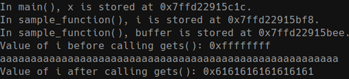

Figure. `sample64`

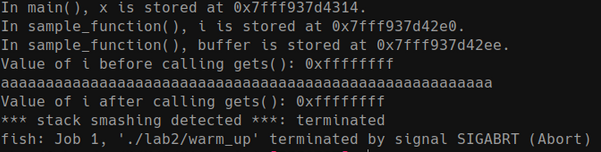

Figure. `warm_up`

- I analyzed binary code and found that the second binary terminates with an error without overwriting the value of `i`. Decompilation of `sample_function` is similar to the first case, except it has additional canary code

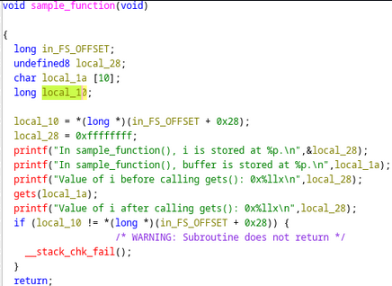

Figure. sample64 code binary

- The first binary (`gcc`) was compiled with `-fno-stack-protector`, disabling stack canaries, while the second one wasn’t.

---

# Task 3 — Linux Local Buffer Overflow Attack (x86)

- Created a code

```bash
touch source.c
# Paste the vulnerable C code into source.c
gcc -o binary -fno-stack-protector -m32 -z execstack source.c
```

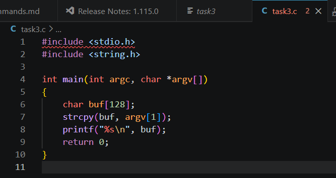

Figure. C code file

- I compiled code with the command, but got error, I analyzed it with GPT and decided to change `-m` parameter because it uses 32 bit approach for speed, but I am using 64 bit system.  But actually the error was because I did not install package `gcc-multilib`.

`gcc -o binary -fno-stack-protector -m64 -z execstack source.c`

| Parameter | Meaning |
| --- | --- |
| `-fno-stack-protector` | Disables **stack canary** insertion — the compiler will NOT add a canary value before the return address, making buffer overflows exploitable. |
| `-m32` | Compiles the binary as a **32-bit (x86)** executable, even on a 64-bit host system. EIP/ESP/EBP registers are used instead of RIP/RSP/RBP. |
| `-z execstack` | Marks the stack segment as **executable**, allowing shellcode placed on the stack to be run. This disables NX/DEP on the stack. |

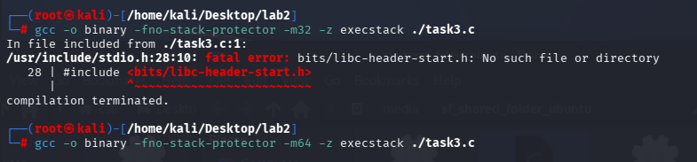

Figure. compiling c code with errors but in 64 bit

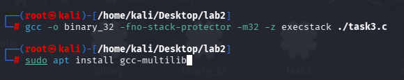

Figure. compiling c code without errors in 32 bit

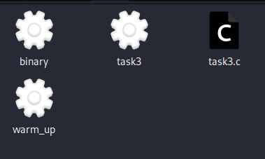

Figure. binary output

- Disabled ASLR (Address Space Layout Randomization) using code used in previous lab

    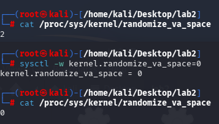

Figure. ASLR status is disabled

- Installed `gdb` binary disassembler and made an action with 32 bit binary

    ```bash
    gdb ./binary
    (gdb) set disassembly-flavor intel
    (gdb) disas main
    ```

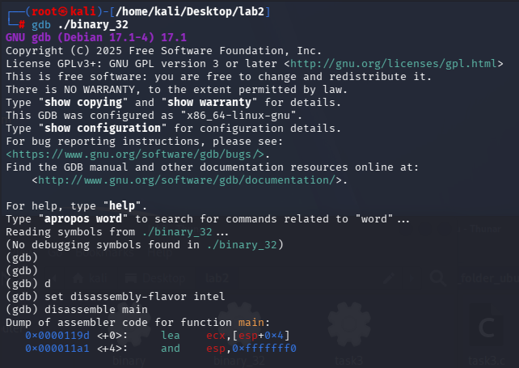

Figure. Disassembling binary

- Main function:

```bash
Dump of assembler code for function main:
   0x0000119d <+0>:     lea    ecx,[esp+0x4]
   0x000011a1 <+4>:     and    esp,0xfffffff0
   0x000011a4 <+7>:     push   DWORD PTR [ecx-0x4]
   0x000011a7 <+10>:    push   ebp
   0x000011a8 <+11>:    mov    ebp,esp
   0x000011aa <+13>:    push   ebx
   0x000011ab <+14>:    push   ecx
   0x000011ac <+15>:    add    esp,0xffffff80
   0x000011af <+18>:    call   0x10a0 <__x86.get_pc_thunk.bx>
   0x000011b4 <+23>:    add    ebx,0x2e40
   0x000011ba <+29>:    mov    eax,ecx
   0x000011bc <+31>:    mov    eax,DWORD PTR [eax+0x4]
   0x000011bf <+34>:    add    eax,0x4
   0x000011c2 <+37>:    mov    eax,DWORD PTR [eax]
   0x000011c4 <+39>:    sub    esp,0x8
   0x000011c7 <+42>:    push   eax
   0x000011c8 <+43>:    lea    eax,[ebp-0x88]
   0x000011ce <+49>:    push   eax
   0x000011cf <+50>:    call   0x1040 <strcpy@plt>
   0x000011d4 <+55>:    add    esp,0x10
   0x000011d7 <+58>:    sub    esp,0xc
   0x000011da <+61>:    lea    eax,[ebp-0x88]
   0x000011e0 <+67>:    push   eax
   0x000011e1 <+68>:    call   0x1050 <puts@plt>
   0x000011e6 <+73>:    add    esp,0x10
   0x000011e9 <+76>:    mov    eax,0x0                                                                                  
   0x000011ee <+81>:    lea    esp,[ebp-0x8]                                                                            
   0x000011f1 <+84>:    pop    ecx                                                                                      
   0x000011f2 <+85>:    pop    ebx                                                                                      
   0x000011f3 <+86>:    pop    ebp                                                                                      
   0x000011f4 <+87>:    lea    esp,[ecx-0x4]
   0x000011f7 <+90>:    ret
```

- Functions:

```bash
(gdb) info functions
All defined functions:

Non-debugging symbols:
0x00001000  _init
0x00001030  __libc_start_main@plt
0x00001040  strcpy@plt
0x00001050  puts@plt
0x00001060  __cxa_finalize@plt
0x00001070  _start
0x000010a0  __x86.get_pc_thunk.bx
0x000010b0  deregister_tm_clones
0x000010f0  register_tm_clones
0x00001140  __do_global_dtors_aux
0x00001190  frame_dummy
0x00001199  __x86.get_pc_thunk.dx
0x0000119d  main
0x000011f8  _fini
```

- Buffer overflowing function is `strcpy` with the address  `0x000011cf <+50>`
    - Destination buffer is `lea    eax,[ebp-0x88]`, that corresponds to 136 bytes
- Function that follows main function with buffer overflowing accident from function lists is `_fini` function with the address `0x000011f8`
- Set breakpoint

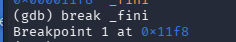

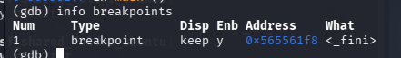

Figure. breakpoint

- To analyze I used `info registers` and followed `EIP` value there to analyze it’s status of overwritting.
- Running code without overflowing the char value bellow `< 128` chars makes program successful, even with chars`> 129`
    - Value of `eip` in register `0x5656565 <main+90>` is default even with chars much bigger than array length, program running healthfully.

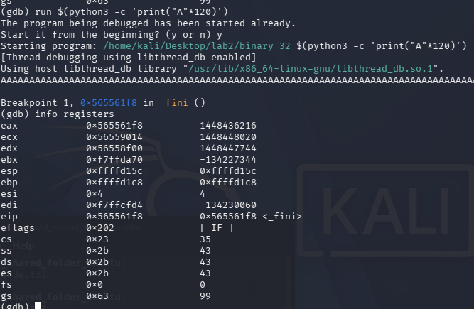

Figure. breakpoint is triggered, overflow was not exceeded. `chars = 120`

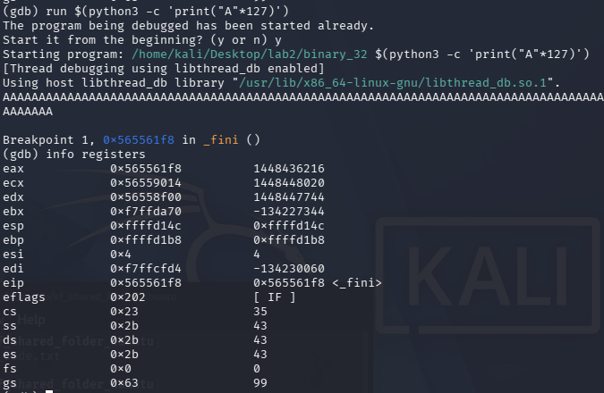

Figure. breakpoint is triggered, overflow was not exceeded. `chars = 127`

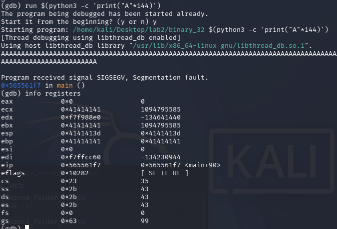

Figure. breakpoint **is not triggered**, overflow **was not exceeded** (successful `chars = 144`).

- SIGSEV error, overflow exceeded with input value **(exactly 128 chars)**
    - Value of `eip` in register `0x4141414` confirms the overflow , means EIP is

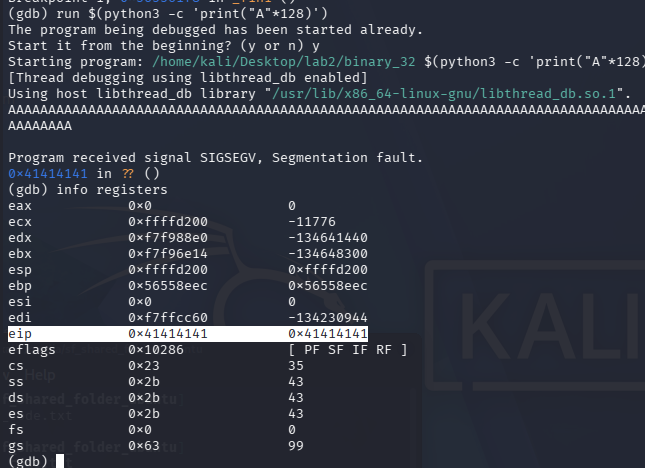

Figure. breakpoint is not triggered, overflow was exceeded (successful `chars = 128 == array size`).

- Deleted breakpoints and started experimenting

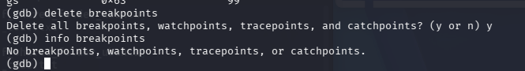

Figure. breakpoints status

- with values for chars bellow 127: 126, 127 program behaves naturally, registers are not available.

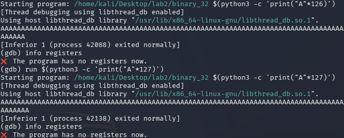

Figure. normal behaviour.

- with values for chars 128, 129 program behaves unnaturally, registers are available:
    - with 128, eip is 0x41414141, **overwritten**
    - with 129 eip is 0x0000000, **overwritten**

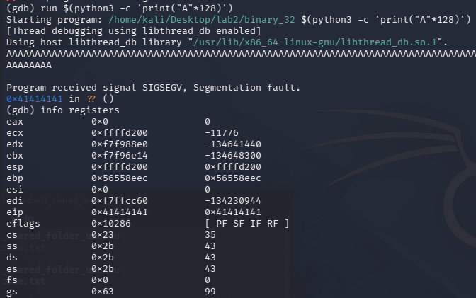

Figure. desirable behaviour is found

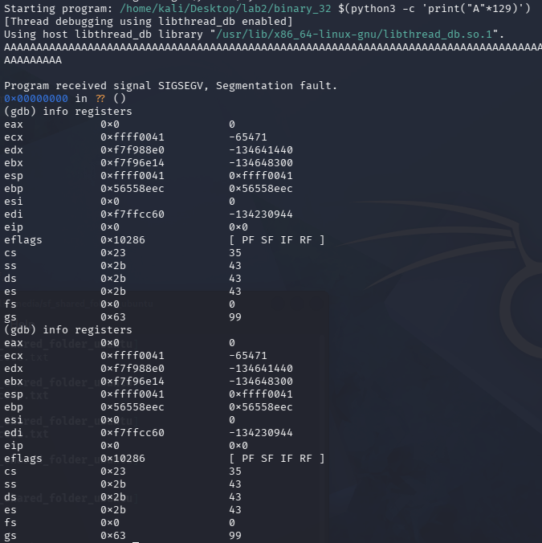

Figure. running results

- Now I exceed with abnormal values like 140 and 0
    - with 140, eip is `normal` not overwritten
    - with 0, eip is `0xf7e12d28` is **overwritten**

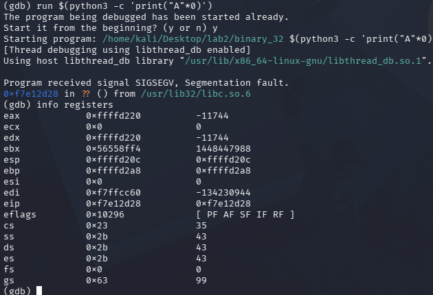

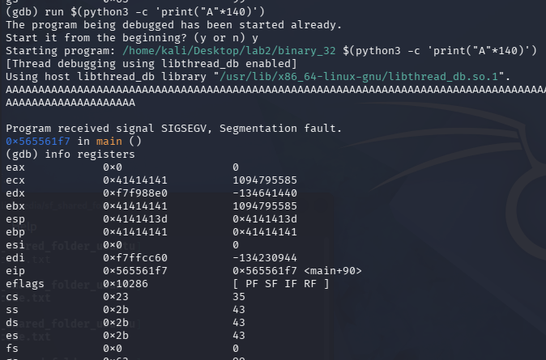

Figure. exceeding limits at max

---

# Task 4 — Catch the Password (x64)

- verified that binary is 64 bit

<https://app.notion.com>

Figure. file results

- Found passwords functions using `info:`
    - check and print pass

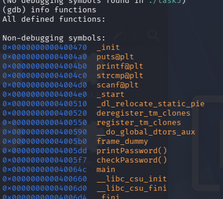

- Disassembled main, it calls for checkPassword

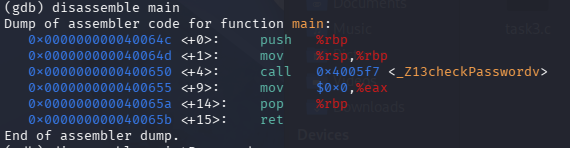

Figure. main disassemble

- Okay, then let’s see the route inside checkPassword. Disassembled checkPassword.
    - it calls: puts, scanf, strcmp, puts, puts
    - Char arg for possible password is `0x00000000004005fb <+4>: add $0xffffffffffffff80,%rsp` which is equivalent for 128 bytes of allocated space

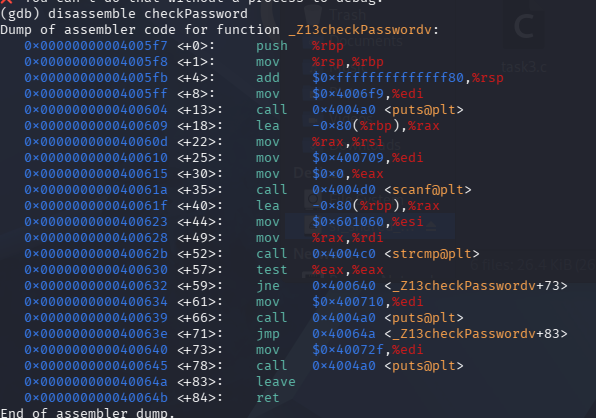

Figure. checkPassword disassemble

- Then I decided to dump all binary to gpt and get exact analysis of the function flow, to understand which flow I should exploit and how.

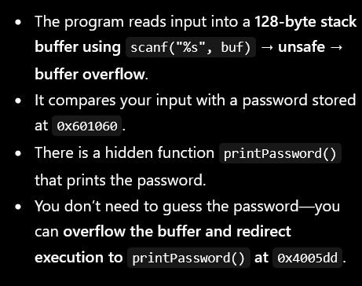

- So I put break after `scanf` inside checkPassword before making input to analyze registers

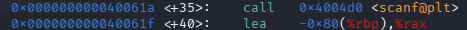

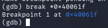

Figure. setting breakpoint after input is done.

- then my goal was to get value to have rip overwritten with my value for the printPassword function. the goal is to find right offset for input to have it controlled and overwritten
    - Values of 137-143 make it overwritten

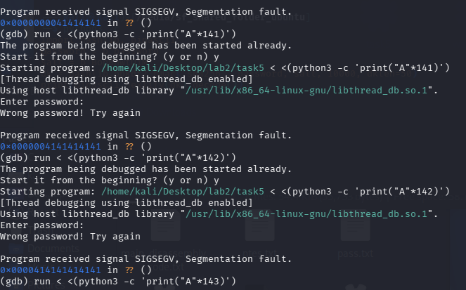

Figure. Values of 137-143 make it overwritten

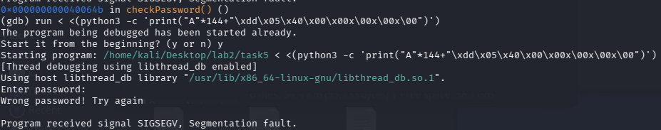

Figure. overwritting input and then injecting adress of printPassword function

- So like this I would get printPassword running inside execution of c code prorgram
- BTW, there were an easiser way! I got hint from Claude and remembered previous labs. So I analysed with`strings`:
    - Possible values for password:
        - 12345
        - AWAVI
        - AUATL

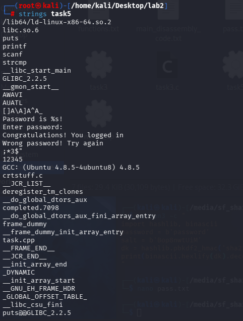

Figure. `strings` result for c code

- Then I decided to run the program and check those possible values and from first try I was able to guess it!

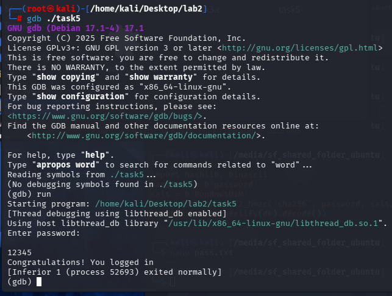

Figure. password is found

- The password is `12345`

## Q2: Differences between debugging 32-bit and 64-bit applications

| Aspect | 32-bit (x86) | 64-bit (x86-64) |
| --- | --- | --- |
| Instruction Pointer | `EIP` | `RIP` |
| Stack Pointer | `ESP` | `RSP` |
| General registers | `EAX`, `EBX`, `ECX`… | `RAX`, `RBX`, `RCX`, `R8–R15`… |
| Function arguments | Passed on the **stack** | Passed in registers (`RDI`, `RSI`, `RDX`, `RCX`, `R8`, `R9`) |
| Address size | 4 bytes | 8 bytes |
| Return address overwrite | Easier (4-byte writes) | Needs 8-byte aligned writes; canonical address restrictions |
| Shellcode on stack | Simpler with execstack | More complex; ROP chains often preferred |

## Q3: Do we need shellcode for Task 4?

 **No.** The goal is to find the correct **password** (a string comparison bypass), not to execute arbitrary code. This can be done by:

- Statically analyzing the binary with `strings`, `objdump`, or `Ghidra` to find the hardcoded password.
- Using `ltrace` or `strings` to observe the `strcmp` or similar call with the expected value.
- Patching the comparison in GDB to always return "correct."

Since we're redirecting logical flow (or reading a hardcoded secret), **no shellcode injection is needed**. This is a pure **reverse engineering / logic bypass** task.
