# 4 Malware Analysis

Name of report: MalA_LAB_4_Nikita_Niakhai
Course: Offensive Technologies
Performed by Nikita Niakhai
Date submission: 11.05.2026
---

## Environment Overview

**Host OS:** Ubuntu Linux 6.8.0-110-generic
**Hypervisor:** QEMU/KVM via virt-manager
**Sandbox:** CAPEv2
**Analysis VM:** Windows 10 x64 (win10.qcow2)

The lab runs on a single Ubuntu desktop (SNE lab PC, which also has second-primary user `victor`) as a `root` and `nikita` users. The analysis VM is isolated on a host-only bridge network. CAPE controls the VM over that same network.
For VM manager `Virtual Manager` was chosen.

> So, please let `victor` username for root@victor do not bother you, there are still screenshots with `nikita` user ;)
BTW, I can show you this PC with the lab ENV.
>

> Claude PRO was used to analyze logs and guide through complex situations, concerning security breaches.
>

**Architecture**

```
Host — 192.168.100.1 (virbr0)
  └── win10 VM — 192.168.100.10 (static)
        └── agent.py listening on :8000
              └── reports back to resultserver at 192.168.100.1:2042
```

---

# Task 1. Set up your environment

## 1.1 Sandbox Selection

**CAPEv2** (Config And Payload Extraction) was chosen as the sandboxing solution.

Key reasons:
- Active fork of Cuckoo Sandbox with regular updates
- Built-in PE unpacking and payload extraction engine — CAPE can unpack packed samples and automatically submit extracted payloads for re-analysis
- Native .NET and Themida support
- YARA and community signature matching out of the box
- Self-hosted, no sample privacy concerns

Installation:

```bash
git clone https://github.com/kevoreilly/CAPEv2 /opt/CAPEv2
cd /opt/CAPEv2
sudo -u cape poetry install
```

CAPE runs as a set of independent services:

| Service | Role |
| --- | --- |
| `cape.service` | Core scheduler, VM controller, hook injector |
| `cape-web.service` | Web dashboard on port 8000 |
| `cape-processor.service` | Post-analysis report generation |
| `cape-rooter.service` | Per-analysis network routing |
| `mongodb.service` | Report storage |
| `postgresql@18-main.service` | Task and metadata database |

---

## 1.2 VM Setup

The analysis VM runs Windows 10 x64 under QEMU/KVM managed by virt-manager.

| Parameter | Value |
| --- | --- |
| OS | Windows 10 x64 |
| CPU | 3 vCPUs, host-passthrough mode |
| RAM | 6 GB |
| Disk | `/var/lib/libvirtimages/win10.qcow2` |
| Machine type | pc-q35-6.2 |
| Disk bus | SATA |

---

## 1.3 Network Configuration

The VM connects to `virbr0` — a libvirt-managed bridge at `192.168.100.1/24`. The VM has a static IP of `192.168.100.10`.

The libvirt default network has NAT forwarding enabled. This means:
- The VM can reach the internet through the host — useful for capturing C2 callbacks in network logs
- For destructive samples like ransomware, NAT should be disabled to keep the VM fully isolated

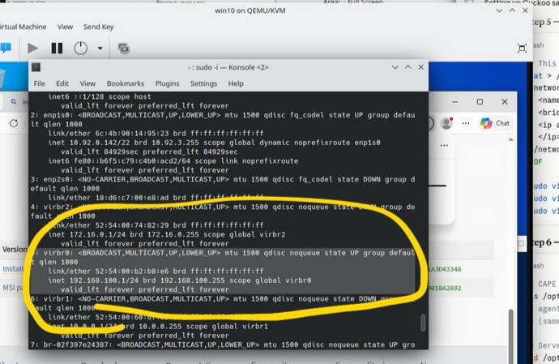

*Figure — virbr0 adapter at 192.168.100.1/24 on the host*

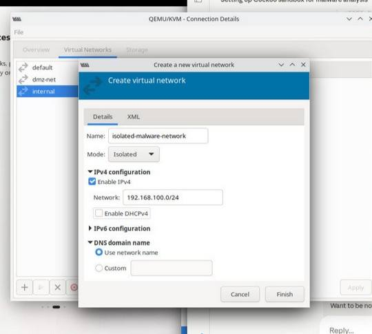

*Figure — libvirt NAT network configuration*

CAPE configuration pointing at the VM:

```
# /opt/CAPEv2/conf/kvm.conf
[kvm]
machines= win10
interface= virbr0

[win10]
label= win10
platform= windows
ip= 192.168.100.10
snapshot= snapshot1
interface= virbr0
resultserver_ip= 192.168.100.1
resultserver_port=2042
arch= x64
tags= win10
```

```
# /opt/CAPEv2/conf/cuckoo.conf
[resultserver]
ip= 192.168.100.1
port=2042
```

---

## 1.4 CAPE Agent Setup

The CAPE agent (`agent.py`) runs inside the Windows VM and acts as CAPE’s hands inside the guest. It receives hook DLLs from CAPE, executes samples, and sends behavioral data back to the result server.

Requirements inside the VM:
- Must run as Administrator — hook injection requires elevated privileges
- Windows Firewall must be disabled — otherwise port 8000 is blocked

Files were transferred to the VM over the `virbr0` network using a Python HTTP server on the host:

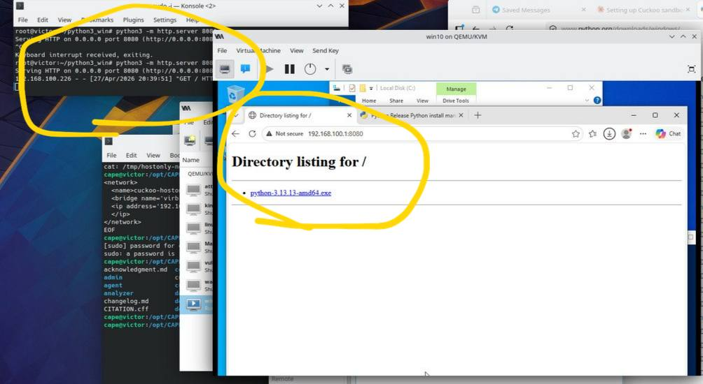

*Figure — `python3 -m http.server` used to deliver [agent.py](http://agent.py) to the VM over virbr0*

Inside the VM (admin PowerShell):

```powershell
netsh advfirewall set allprofiles state off
python C:\agent.py
```

Verify connectivity from host:

```bash
nc -z -w2 192.168.100.10 8000 && echo "AGENT OK"
```

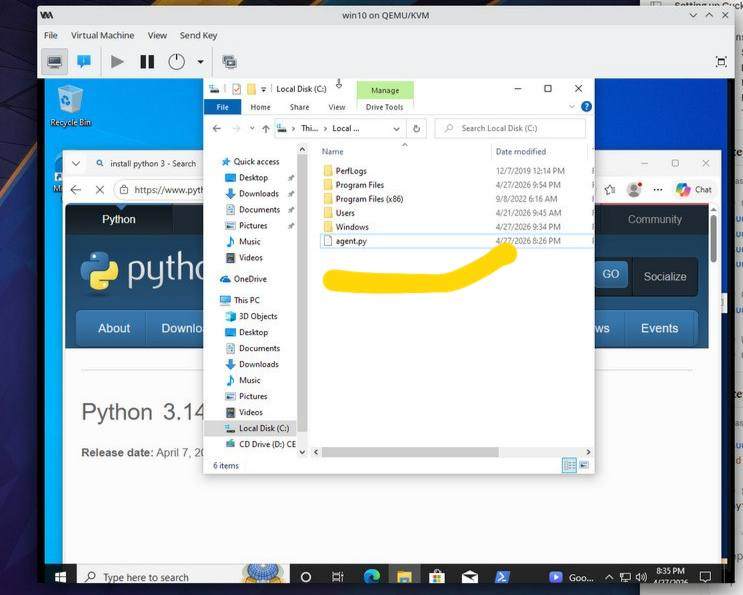

*Figure — [agent.py](http://agent.py) listening on port 8000 in admin PowerShell*

---

## 1.5 CAPE Dashboard

Once the services are running, the web dashboard is accessible from the host browser.

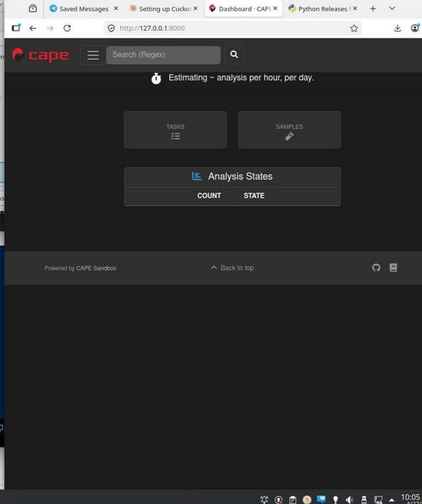

*Figure — CAPE dashboard showing active task queue*

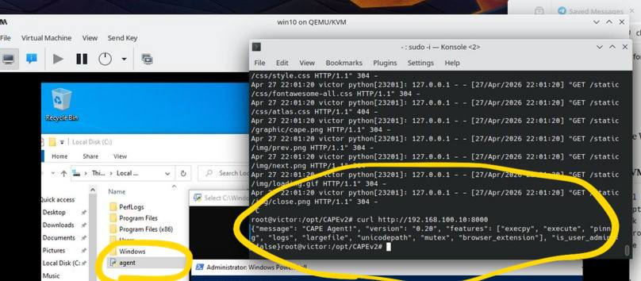

*Figure — Dashboard opened from the host machine, confirming network connectivity*

---

## 1.6 Snapshot

CAPE requires a libvirt snapshot in `running` state — the VM must be captured with the agent already active inside. CAPE restores this snapshot between every analysis run to guarantee a clean environment.

```bash
virsh snapshot-create-as \
  --domain win10 \
  --name snapshot1 \
  --description "CAPE clean state with agent running" \
  --atomic
```

The `--atomic` flag is required because the disk uses a SATA bus — live snapshots are not supported on SATA. `--atomic` pauses the VM briefly, takes the snapshot, then resumes.

```bash
# Verify state = running (CAPE checks this on startup)
virsh snapshot-info win10 snapshot1
```

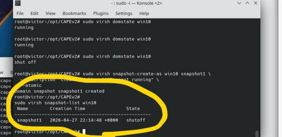

*Figure — virsh confirms snapshot1 in running state*

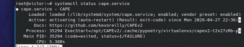

*Figure — `systemctl status cape.service` showing active with no errors*

---

## 1.7 Issues Encountered During Setup

| Issue | Cause | Fix |
| --- | --- | --- |
| `cape.service` crashed: “snapshot not found” | No snapshot existed yet | Created `snapshot1` with `virsh snapshot-create-as` |
| `cape.service` crashed: resultserver IP mismatch | Config had `ip = 192.168.1.1` instead of `192.168.100.1` | Updated `cuckoo.conf` resultserver IP |
| Snapshot state was `shutoff` instead of `running` | Snapshot taken without `--atomic` while VM was paused | Re-created snapshot using `--atomic` flag |
| Agent not running as admin | Launched from a regular terminal | Moved to admin PowerShell — hooks require elevated privileges |

---

# Task 2. Let’s get some malware

Two samples were analyzed. The second was discovered automatically by CAPE during analysis of the first.

---

## Sample 1 — Outer Dropper/Loader

Downloaded from **MalwareBazaar**.

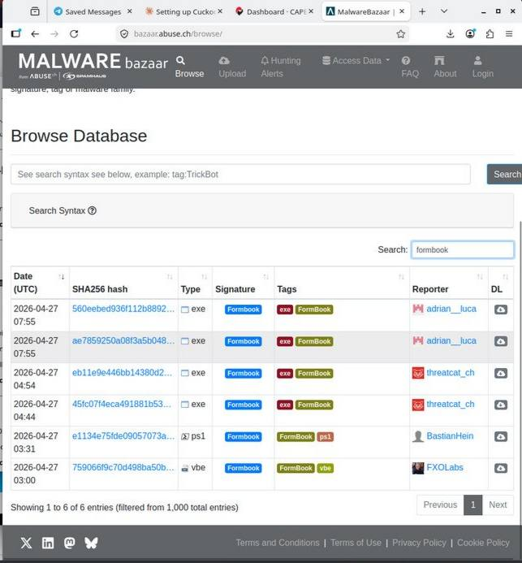

*Figure — MalwareBazaar download page for the outer dropper*

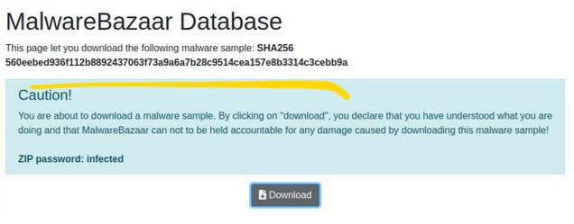

*Figure — Zip archive confirmed present in Downloads folder*

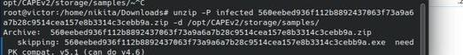

*Figure — Extracting with password `infected` (MalwareBazaar standard)*

| Field | Value |
| --- | --- |
| SHA256 | `560eebed...` |
| Type | PE32 .NET assembly (x86), GUI |
| Role | Outer dropper — unpacks and launches the inner payload |

---

## Sample 2 — Nested Payload (Extracted by CAPE)

CAPE’s extraction engine found a second PE binary packed inside Sample 1 during the first analysis run. It was automatically stored and submitted for separate analysis.

| Field | Value |
| --- | --- |
| SHA256 | `0ba17c89e787fee76c372b36e8db40ffc31f96420ae882a78f603e5c5e228005` |
| MD5 | `4b4b5334b25f14402d7d236e2c49713d` |
| Type | PE32 executable (GUI) Intel 80386, Mono/.NET assembly |
| Size | 1,107,456 bytes |
| Packer | Themida (commercial protector/DRM) |
| Origin | Extracted from Sample 1 by CAPE during Task 1 analysis |

This nested PE is the main subject of analysis for the rest of the lab.

---

# Task 3. Static Analysis

Since dynamic analysis produced zero behavioral data across four attempts, static analysis was the only remaining option. All tools were run on the host. Target: `0ba17c89...` (Sample 2, the Themida-packed nested PE).

Tools used: `file`, `pefile` (Python), `strings`, `binwalk`, `rabin2`, `r2` (radare2).

---

## Step 1 — File Identification

```bash
file /home/nikita/Downloads/sample2.exe
```

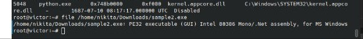

*Figure— `file` output: PE32 executable, GUI, Mono/.NET assembly*

Output: `PE32 executable (GUI) Intel 80386 Mono/.Net assembly, for MS Windows`

- 32-bit Windows GUI executable
- `.Net assembly` in the output means the binary contains .NET metadata — even though it is packed, the PE header still carries the .NET marker
- GUI subsystem — no console window, designed to run as a desktop application

---

## Step 2 — PE Header and Section Entropy

```bash
python3 /home/nikita/Downloads/pe_analysis.py
```

The script reads the PE headers and calculates Shannon entropy for each section.

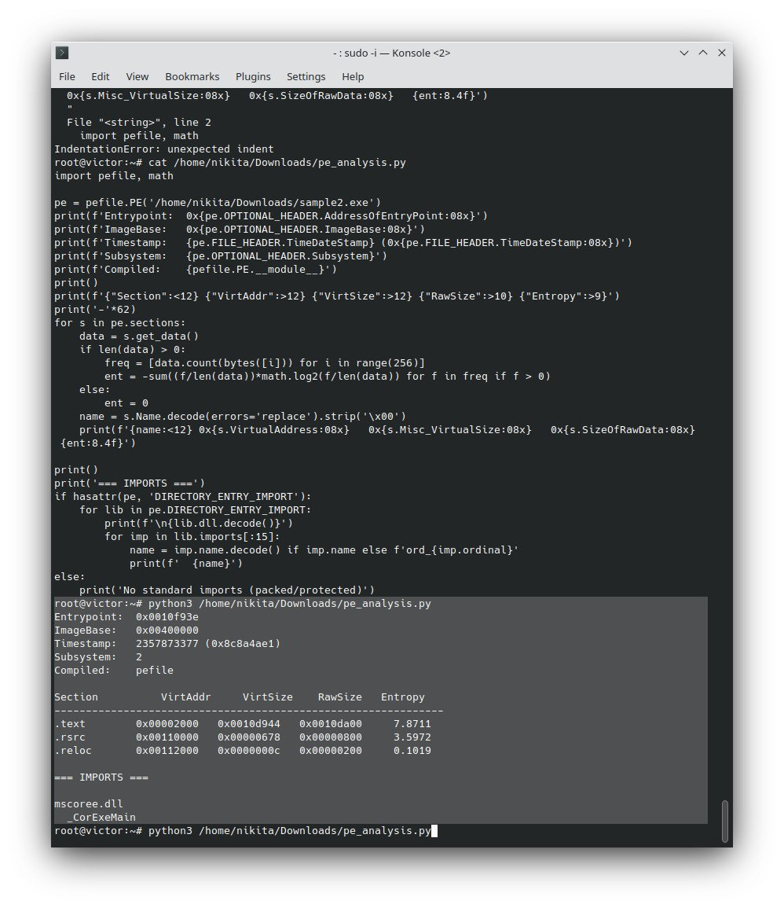

*Figure — pe_analysis.py output showing headers, sections, and entropy values*

Header fields:

| Field | Value | Meaning |
| --- | --- | --- |
| Entrypoint | `0x0010f93e` | Single jump stub — no real code |
| ImageBase | `0x00400000` | Standard Windows default |
| Timestamp | `0x8c8a4ae1` = Sep 2044 | Future date — deliberate timestomping |
| Subsystem | `2` = Windows GUI | Desktop application, no console |

Section entropy:

| Section | Size | Entropy | Verdict |
| --- | --- | --- | --- |
| `.text` | 1.05 MB | **7.87 / 8.0** | Themida-encrypted — near-maximum |
| `.rsrc` | 2 KB | 3.60 | Normal resource data |
| `.reloc` | 12 bytes | 0.10 | Nearly empty — packed binary artifact |

Normal compiled code sits around 4.5–6.5 entropy. 7.87 is the forensic definition of encryption or compression. The entire code section is a ciphertext blob that cannot be disassembled in static form.

Imports:

```
mscoree.dll → _CorExeMain   (only import)
```

One function. Themida resolves all its own API calls dynamically at runtime — nothing appears in the import table because the real import logic is inside the encrypted section.

---

## Step 3 — String Extraction

```bash
strings -n 6 /home/nikita/Downloads/sample2.exe \
  | grep -E "^[A-Za-z0-9 _.\-\/\:]{6,}$" | sort -u
```

Despite 7.87 entropy in the code section, the .NET metadata region (below offset `0x1E000`) is not encrypted and leaks readable strings.

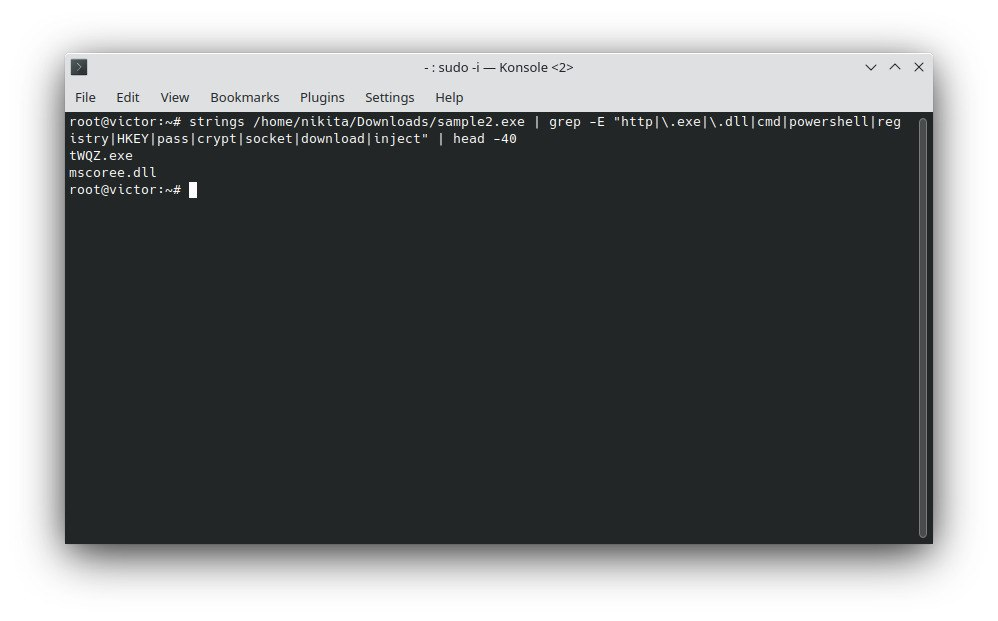

*Figure — Filtered strings output showing multiple readable namespaces from .NET metadata*

**The strings revealed the true identity of the payload.**

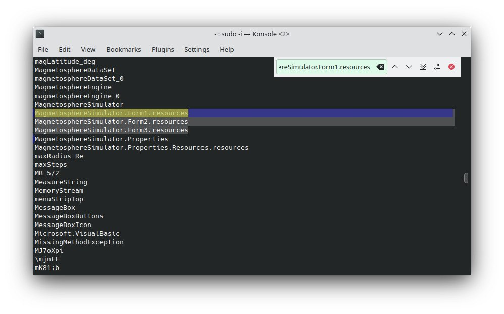

*Figure — `MagnetosphereSimulator.Form*.resources` — application name and UI form namespaces*

Application identity:

| String | Meaning |
| --- | --- |
| `MagnetosphereSimulator` | Application name |
| `Orbital Plasma Labs` | Author / company |
| `1.0.5.1` | Application version |
| `v4.0.30319` | .NET Framework 4.0 runtime |

Scientific functionality visible in the MSIL metadata:

| Method / Namespace | Purpose |
| --- | --- |
| `ComputeDipoleField` | Earth magnetic dipole model |
| `ComputeGyroFrequency` | Particle gyrofrequency calculation |
| `ComputeLShell` | L-shell (magnetic latitude) |
| `ComputeDriftPeriod` | Van Allen belt drift period |
| `ComputeBowShockRe` | Bow shock standoff distance |
| `ComputeMagnetopauseStandoffRe` | Magnetopause boundary |
| `DrawBowShock`, `DrawMagnetopause`, `DrawBelts` | Visualization engine |
| `DrawSolarWindArrows`, `DrawTrajectories` | Particle trajectory rendering |
| Particle types: `Proton`, `Electron`, `Helium`, `Oxygen` | Multi-species simulation |

This is a full-featured GUI physics application. Not malware.

Additional key strings:

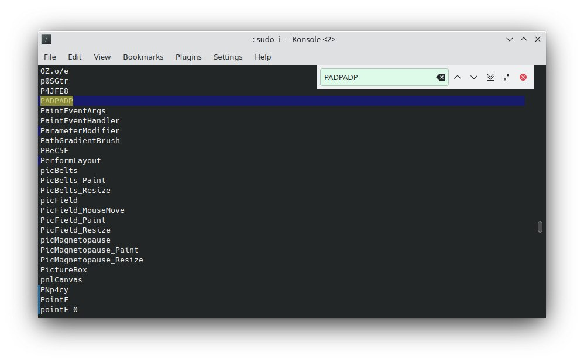

*Figure — `PADPADP` found in the binary — a known Themida internal padding marker*

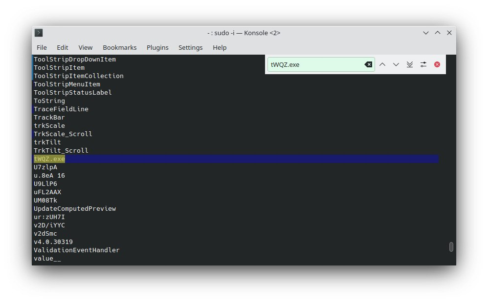

*Figure  — `tWQZ.exe` — randomly generated filename, likely the original name of the outer dropper*

| String | Significance |
| --- | --- |
| `PADPADP` | Themida internal padding marker — definitive Themida confirmation |
| `tWQZ.exe` | Random filename — likely the outer dropper’s original name |

---

## Step 4 — Entropy Map

```bash
binwalk -E /home/nikita/Downloads/sample2.exe
```

Produces a visual entropy plot showing how entropy changes across the file.

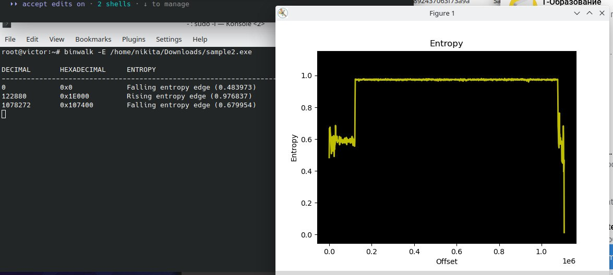

*Figure  — Sharp entropy rise at offset 0x1E000 marks the start of Themida’s encrypted section*

| Offset range | Entropy | Region |
| --- | --- | --- |
| `0x0 → 0x1E000` | ~0.48 | PE headers and .NET metadata — readable |
| `0x1E000 → 0x107400` | ~0.98 | Themida-encrypted `.text` — 955 KB of cipher |
| `0x107400 → EOF` | ~0.68 | `.rsrc` resources — partially structured |

The sharp rise at `0x1E000` is the exact byte where Themida’s encryption starts. 97.7% entropy is statistically indistinguishable from random data.

---

## Step 5 — PE Metadata

```bash
rabin2 -I /home/nikita/Downloads/sample2.exe
```

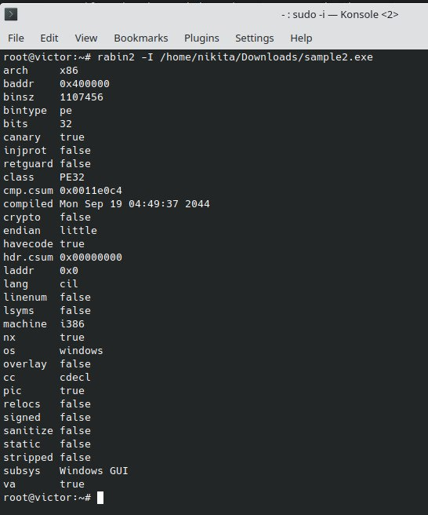

*Figure — rabin2 PE metadata: compiled date, language, signing status, checksum fields*

Key fields:

| Field | Value | Meaning |
| --- | --- | --- |
| `compiled` | Mon Sep 19 04:49:37 2044 | Timestomping — confirmed independently by rabin2 |
| `lang` | `cil` | .NET CIL bytecode |
| `signed` | `false` | No valid code signature — cracked or modified binary |
| `hdr.csum` | `0x00000000` | PE checksum zeroed |
| `cmp.csum` | `0x0011e0c4` | Calculated real checksum |

The mismatch between `hdr.csum` (0) and `cmp.csum` (0x0011e0c4) is the forensic fingerprint of a patched binary. When software is cracked, patching tools typically zero the PE checksum rather than recalculate it correctly.

`canary=true` and `nx=true` — these came from the original legitimate build and were preserved through the crack process.

---

## Step 6 — Import Table

```bash
rabin2 -i /home/nikita/Downloads/sample2.exe
```

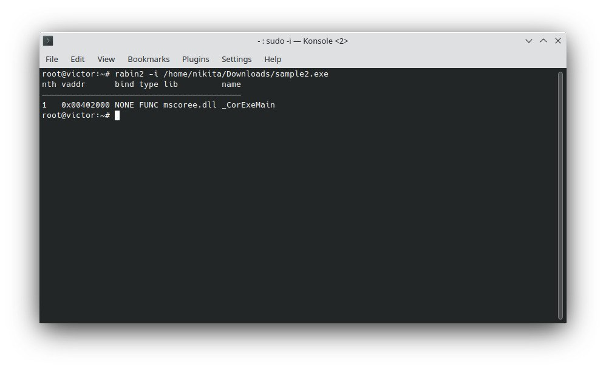

Figure — Single import: mscoree.dll → _CorExeMain*

Output:

```
1   0x00402000   mscoree.dll   _CorExeMain
```

One import. All of Themida’s API calls are resolved internally through its own hash-based lookup at runtime. The actual IAT that matters is encrypted inside `.text`.

---

## Step 7 — Section Map

```bash
rabin2 -S /home/nikita/Downloads/sample2.exe
```

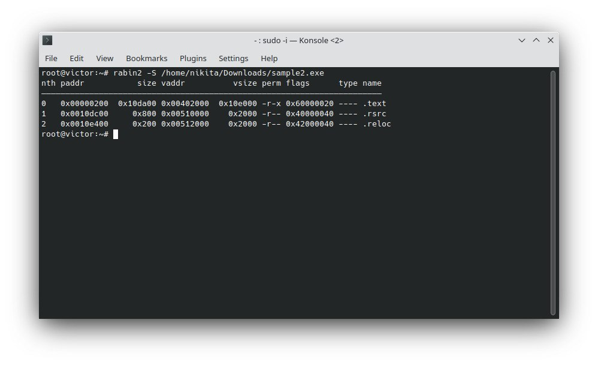

*Figure — Three sections: .text (1.05 MB), .rsrc (2 KB), .reloc (12 bytes)*

```
.text    0x00402000   size=0x10da00   vsize=0x10e000   -r-x
.rsrc    0x00510000   size=0x800      vsize=0x2000     -r--
.reloc   0x00512000   size=0x200      vsize=0x2000     -r--
```

`.text` is `-r-x` (no write) on disk. At runtime, Themida calls `VirtualProtect` to temporarily mark it writable, decrypts the real payload in-place, then restores `-r-x`. This is the standard unpack-in-place technique.

---

## Step 8 — Entry Point Disassembly

```bash
r2 -q -c 'pd 30' /home/nikita/Downloads/sample2.exe 2>/dev/null
```

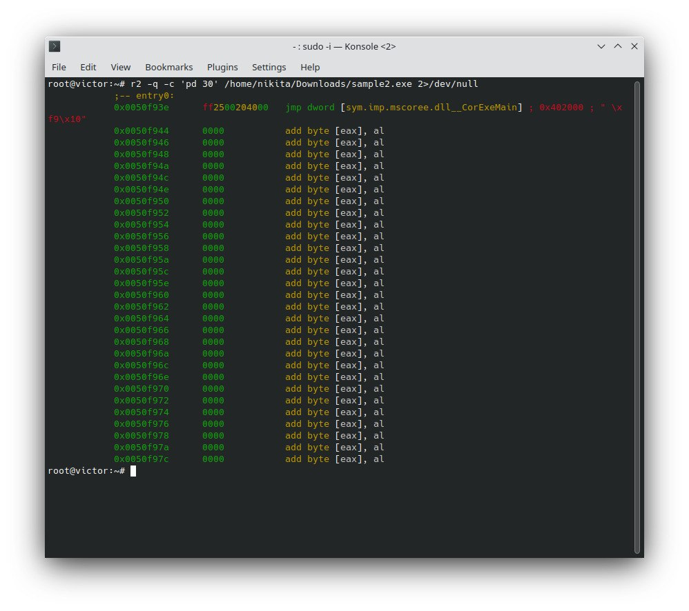

Figure — Entry point: single jmp to _CorExeMain, followed by encrypted null bytes misread as opcodes*

Output:

```nasm
;-- entry0:
0x0050f93e   ff2500204000   jmp dword [sym.imp.mscoree.dll__CorExeMain]
0x0050f944   0000           add byte [eax], al    ; encrypted bytes
0x0050f946   0000           add byte [eax], al    ; misread as instructions
...
```

One instruction: jump to the .NET CLR entry point. Everything after is `0x00 0x00` from the encrypted section being misread as x86 opcodes. Themida’s decryption loop runs entirely inside the encrypted section at runtime — there is nothing to statically disassemble.

---

# Task 4. Mapping to ATT&CK mitre framework (Optional)

### Criteria for mapping

1. Direct observation, assumptions.
    1. A CAPE/Volatility/static-analysis finding is enough to map only the behavior it actually proves.
2. ATT&CK technique names ⇒ behavior
    1. Packed binary = T1027.002.
    2. Embedded second PE = T1027.009.
    3. VM/sandbox checks = T1497.
    4. Debugger checks = T1622.
3. No execution evidence ⇒ no later-stage mapping.
    1. No C2 traffic = no C2 technique.
    2. No persistence artifact = no persistence technique.
    3. No credential behavior = no credential access technique.
    4. No file encryption/destruction = no impact technique.
4. Static PE header/string/entropy evidence = good for packing/timestamp mappings.
5. Sandbox signatures = good for evasion mapping.

### Simple mapping table

| ATT&CK tactic | Technique ID | Technique name | Sample 1 | Sample 2 | Confidence | Sample 1 Comments | Sample 2 Comments |
| --- | --- | --- | --- | --- | --- | --- | --- |
| Stealth / Defense Evasion | **T1027.009** | **Embedded Payloads** | Yes | No direct | High for Sample 1 | CAPE extracted Sample 2 from inside Sample 1; this directly matches embedded secondary payload behavior. | - |
| Stealth / Defense Evasion | **T1027.002** | **Software Packing** | Yes | Yes | Medium–High for Sample 1; High for Sample 2 | - | high-entropy encrypted code and hidden runtime logic. |
| Stealth / Discovery | **T1497.001** | Virtualization/Sandbox Evasion: System Checks | Not proven | Yes | High for Sample 2 | - | checked CAPE/Cuckoo/QEMU/KVM artifacts such as hypervisor, SMBIOS, MAC OUI, and disk identity. |
| Stealth / Discovery | **T1497.002** | Virtualization/Sandbox Evasion: User Activity Based Checks | Not proven | Yes | High for Sample 2 | - | mouse movement and foreground window activity. |
| Stealth / Discovery | **T1497.003** | Virtualization/Sandbox Evasion: Time Based Checks | Not proven | Yes | High for Sample 2 | - | sleep/timer behavior to outlast or detect sandbox manipulation |
| Stealth / Defense Evasion | **T1622** | Debugger Evasion | Not proven | Yes | High for Sample 2 | - | anti-debug checks such as guard pages, OutputDebugString, IsDebuggerPresent, and NtQueryInformationProcess. |
| Defense Evasion | **T1070.006** | Timestomp | Yes | Yes | Medium | - | - |
| Defense Evasion | **T1562 / T1562.001** | Impair Defenses / Disable or Modify Tools | No | Possible | Low–Medium | - | - |

> Sample 1 ⇒ **T1027.009 (**Stealth / Defense Evasion**)**

> Sample 2 ⇒ T1027.002, T1497.001, T1497.002, T1497.003, T1622

**Sample 1 functions as an outer container/dropper that hides and exposes a nested executable, mapping primarily to embedded payloads, packing, and timestamp deception. Sample 2 is dominated by Themida-based anti-analysis behavior, mapping strongly to software packing, sandbox evasion, user-activity checks, time-based checks, and debugger evasion.**

> *P.S. Since actual dynamic execution failed and memory analysis showed no malware C2, injection, persistence, or destructive behavior, the correct ATT&CK mapping should stay limited to Defense Evasion or Stealth and Discovery.*
>

---

# Task 5*. Sandbox (Dynamic) Analysis

## 5.1 Submitting Sample 1 — Behavior Capture

Sample 1 was submitted to CAPE using the CLI tool:

```bash
cd /opt/CAPEv2
sudo -u cape .cache/pypoetry/virtualenvs/capev2-t2x27zRb-py3.10/bin/python \
  utils/submit.py /opt/CAPEv2/storage/binaries/560eebed... \
  --timeout 240 --enforce-timeout
```

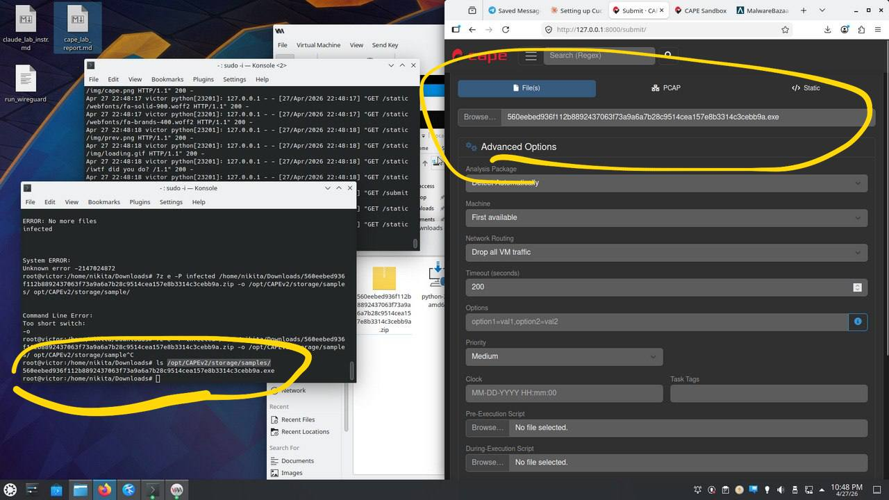

*Figure — [submit.py](http://submit.py) call confirming sample queued as task 1*

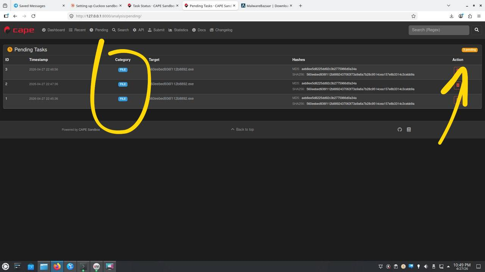

*Figure — Three tasks queued for the outer dropper with different option combinations*

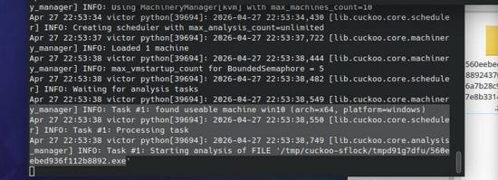

*Figure — Live cape.service log: VM snapshot restored, sample injected, monitoring active*

### Results — Sample 1

| Field | Value |
| --- | --- |
| Malscore | 2.0 / 10 |
| Processes captured | 0 |
| Network activity | None |
| Payloads extracted | 1 (Sample 2) |

Signatures triggered:

| Signature | Severity | Meaning |
| --- | --- | --- |
| `packer_entropy` | Medium | High-entropy sections — binary is packed or encrypted |
| `pe_compile_timestomping` | High | PE timestamp is fake — deliberate anti-forensics |

The outer dropper executed, unpacked its payload into memory, and exited — all before CAPE’s hook layer could observe any behavior. The only useful output was the extracted nested PE.

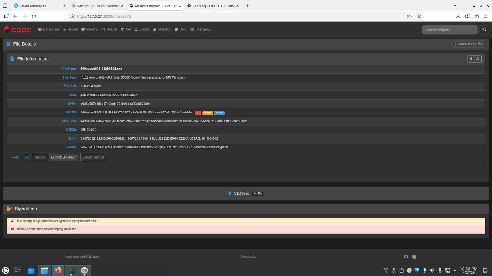

*Figure — All three initial tasks completed. Malscore 2.0 with zero behavioral data.*

---

## 5.2 Submitting Sample 2 — Evasion and Defeat Attempts

CAPE found the nested PE and flagged it for separate analysis. It was sent as task 4.

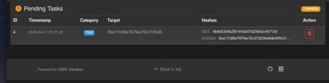

*Figure — CAPE reports payload found; submitted automatically as task 4*

Sample 2 is packed with **Themida** — a commercial protector used both for software DRM and by malware authors. Themida performs a series of environment checks before decompressing and running the real code. If it detects a sandbox or debugger, it exits silently.

Evasion techniques detected on Sample 2:

| Signature | Technique |
| --- | --- |
| `packer_themida` | Themida protector wrapper |
| `antisandbox_cuckoocrash` | Detects CAPE/Cuckoo by name or artifacts |
| `antidebug_guardpages` | Memory guard pages to detect debugger |
| `antidebug_outputdebugstring` | Timing check via OutputDebugString |
| `antidebug_windows` | IsDebuggerPresent / NtQueryInformationProcess |
| `mouse_movement_detect` | Checks for real mouse input |
| `antisandbox_foregroundwindows` | Checks if a real window is in foreground |
| `antisandbox_sleep` | Long sleep calls to outlast sandbox timeout |
| `antisandbox_script_timer` | Detects accelerated timers |
| `antiav_servicestop` | Tries to stop AV/EDR services |
| `stealth_network` | Hides network activity |
| `disable_driver_via_blocklist` | Blocks security driver loading |
| `pe_compile_timestomping` | Fake compile timestamp |

13 evasion techniques total — this is an unusually high count, consistent with Themida’s DRM-grade protection.

---

## 5.3 Defeating Sandbox Evasion — Four Attempts

### Attempt 1 — Default CAPE hooks (Task 4)

Standard submission with full hook injection. Themida detected the hook footprint immediately and exited.

**Result:** Malscore 2.0, 0 processes, 0 network.

### Attempt 2 — Relaxed options (Task 5)

Resubmitted with options designed to look more like a real system:

```
free=yes    — disables CAPE hooks entirely
human=1     — simulates mouse movement
sleep=1     — patches sleep calls so Themida can't outlast timeout
clock=...   — fakes system date
```

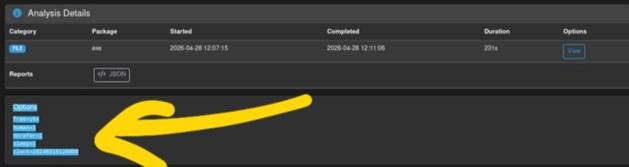

*Figure — CAPE submission form with evasion-defeat options applied*

`free=yes` removes the hook footprint Themida was detecting. But the result was the same — Themida still exited without executing.

**Result:** Malscore 2.0, 0 processes, 0 network.

Conclusion: hook detection was not the only problem. Themida was also detecting the QEMU virtual machine itself.

### Attempts 3 and 4 — VM Hardware Hardening (Tasks 6 and 7)

Themida detects QEMU through four main vectors:

- **CPUID hypervisor bit** — KVM sets a flag in the CPU ID response that signals a hypervisor is present
- **SMBIOS strings** — QEMU puts “QEMU” in the BIOS/motherboard info readable by any application
- **MAC address OUI** — QEMU uses the OUI prefix `52:54:00`, registered to QEMU
- **Disk serial** — Windows Device Manager shows the device as “QEMU HARDDISK”

The libvirt VM XML was modified to spoof all four:

```xml
<!-- Hide hypervisor flag from CPUID -->
<kvm><hidden state='on'/></kvm>
<cpu mode='host-passthrough' check='none' migratable='on'>
  <feature policy='disable' name='hypervisor'/>
</cpu>

<!-- Spoof SMBIOS as HP EliteBook 840 G8 -->
<sysinfo type='smbios'>
  <bios>
    <entry name='vendor'>American Megatrends Inc.</entry>
    <entry name='version'>F.71</entry>
    <entry name='date'>09/14/2021</entry>
  </bios>
  <system>
    <entry name='manufacturer'>HP</entry>
    <entry name='product'>HP EliteBook 840 G8 Notebook PC</entry>
    <entry name='serial'>CND1471B3M</entry>
  </system>
</sysinfo>
<os>
  <smbios mode='sysinfo'/>
</os>

<!-- Replace QEMU MAC OUI with a real Intel OUI -->
<mac address='00:21:cc:a4:3f:7e'/>

<!-- Add a realistic Western Digital disk serial -->
<serial>WD-WCC4N2RKV8F3</serial>
```

Applied with:

```bash
virsh define /tmp/win10.xml
```

The VM was rebooted to apply the SMBIOS changes.

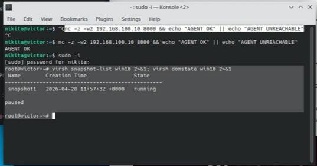

*Figure — virsh snapshot-list confirming snapshot1 in running state after VM reconfiguration*

Tasks 6 and 7 were submitted against the hardened VM.

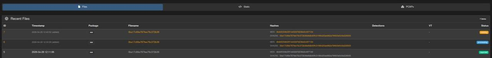

*Figure — Both tasks completed with zero behavioral data despite VM hardening*

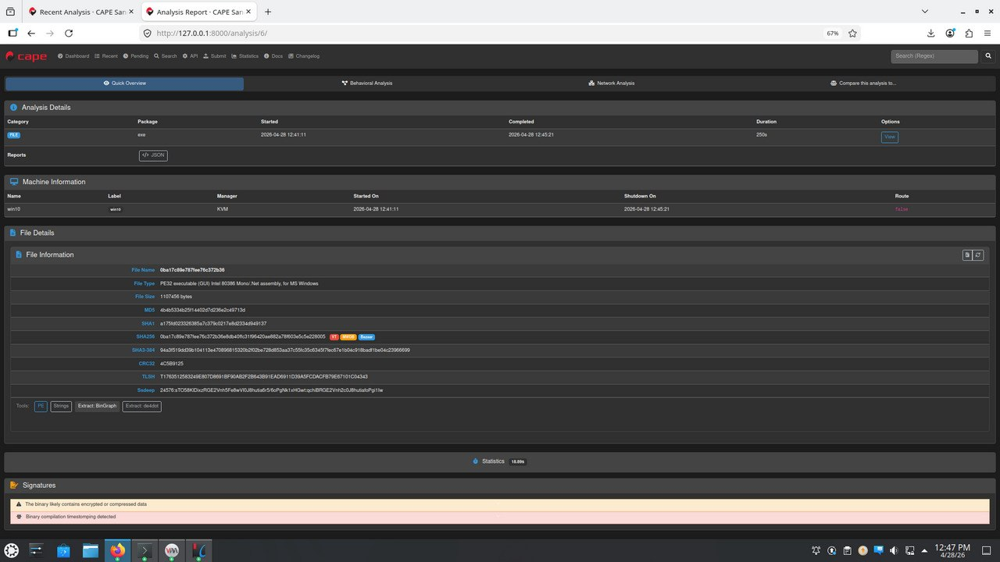

*Figure — Task 6 JSON report downloaded from CAPE*

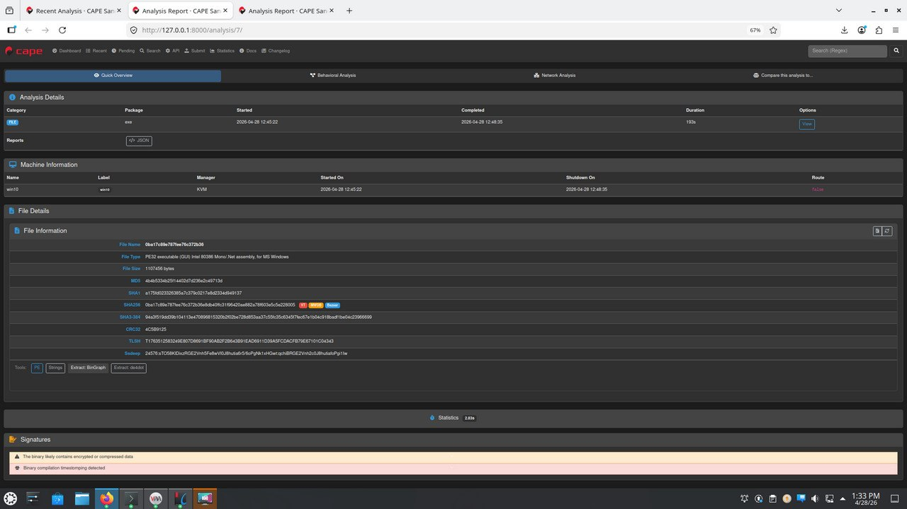

*Figure — Task 6 report confirmed: zero signatures, zero processes, zero network*

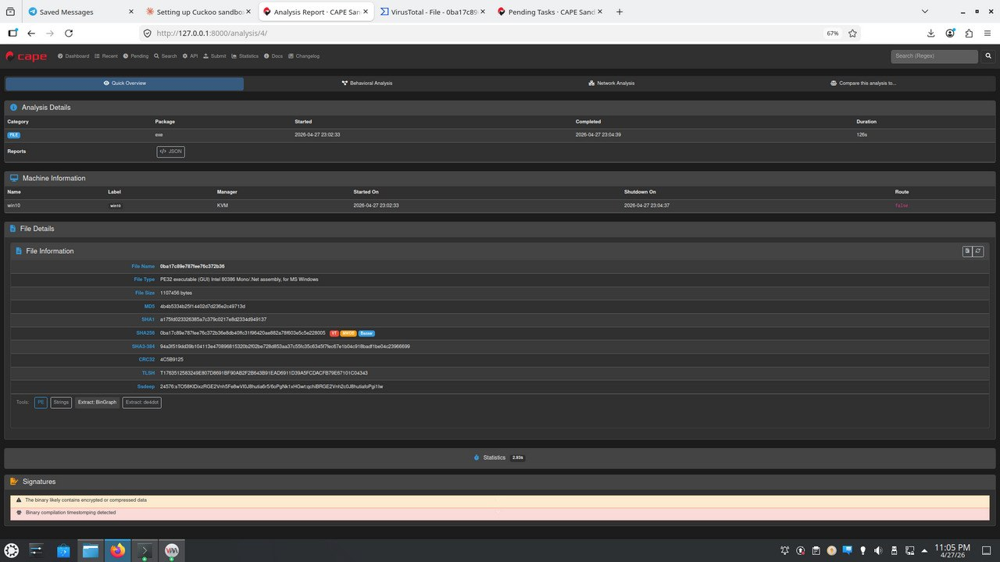

*Figure — Task 4 result: Malscore 2.0, 0 processes, 0 network — same as all previous runs*

**Result:** Still nothing. Malscore 2.0, 0 processes, 0 network on both tasks 6 and 7.

### Why Hardening Still Failed

After the four vectors were addressed, Themida still detected the environment. Remaining detection points:

- **RDTSC timing** — measures clock cycles between CPUID instructions. VM overhead is measurable even with host-passthrough CPU, because the hypervisor still intercepts some instructions
- **Registry artifacts** — QEMU/VirtIO driver keys are still present under `HKLM\SYSTEM\CurrentControlSet\Enum\`
- **SATA controller name** — Windows Device Manager still shows the QEMU SATA controller model name
- **Process scanning** — Themida may check for CAPE’s monitoring processes or the agent itself

### Summary of All Four Attempts

| Task | Options | Result |
| --- | --- | --- |
| 4 | Default hooks, admin agent | 0 processes, 0 network |
| 5 | free=yes, human=1, sleep=1 | 0 processes, 0 network |
| 6 | Hardened VM (SMBIOS + MAC + KVM hidden) | 0 processes, 0 network |
| 7 | Same hardened VM, second run | 0 processes, 0 network |

**Conclusion:** Themida’s anti-VM layer is too deep for automated sandbox analysis on QEMU/KVM with the available options. Dynamic analysis failed completely. Static analysis is the only remaining approach.

---

## 5.4 Memory Dump and Volatility Analysis (Static methods)

Since the sample evaded all sandbox runs, a memory dump of the Windows VM was taken in its post-analysis state. This captures the full Windows environment: processes, network connections, loaded modules, and any injected code.

### Dump Acquisition

```bash
virsh dump win10 /home/nikita/Downloads/win10_memdump.raw --memory-only
```

Dump size: **6.1 GB** — matches the 6 GB RAM configured for the VM.

---

### Step 1 — OS Identification (`windows.info`)

```bash
vol -f /home/nikita/Downloads/win10_memdump.raw windows.info
```

The first step is always to confirm Volatility can correctly parse the dump and identify the OS version. This establishes the memory profile used by all subsequent plugins.

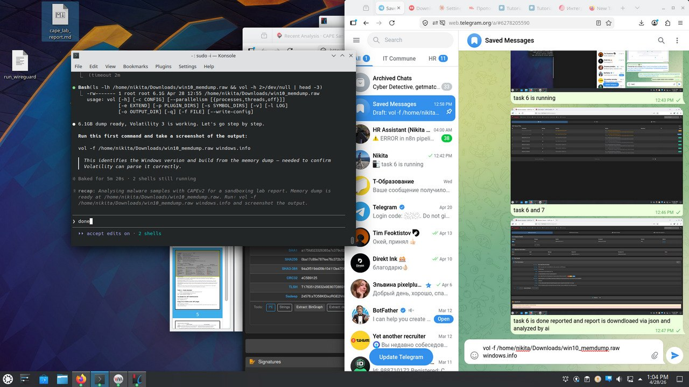

*Figure — Volatility confirms Windows 10 x64 Build 19041, 3 CPUs, correct kernel base*

**Result:** Windows 10 x64 Build 19041 confirmed. Dump is valid and parseable.

---

### Step 2 — Process List (`windows.pslist`)

```bash
vol -f /home/nikita/Downloads/win10_memdump.raw windows.pslist
```

Lists all processes in the kernel’s EPROCESS doubly-linked list. This is the primary process list maintained by Windows. Shows PID, PPID, name, start time, and exit time.

Things to look for:
- Typosquatted names (`scvhost.exe` vs `svchost.exe`)
- Processes with no parent (orphans)
- Already-exited processes — malware that ran and terminated

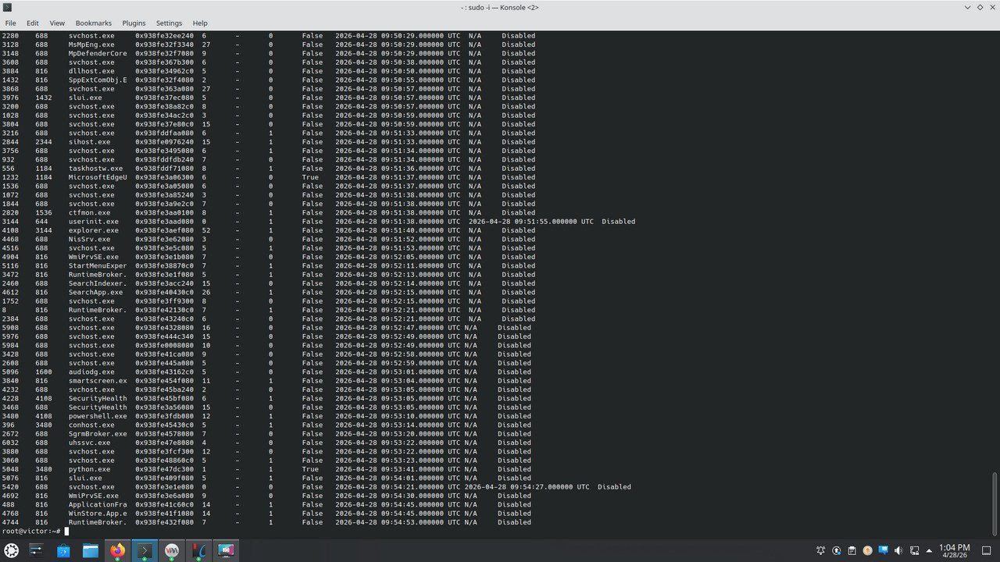

*Figure — Full process list at dump time*

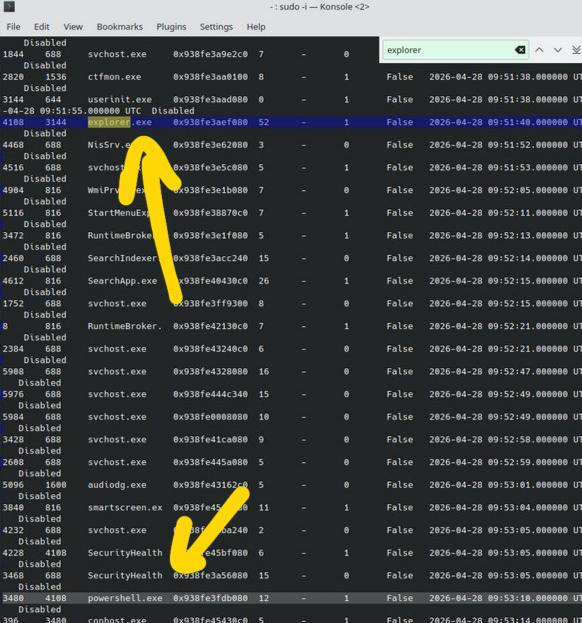

*Figure — powershell.exe (PID 3480) and python.exe (PID 5048) visible in pslist*

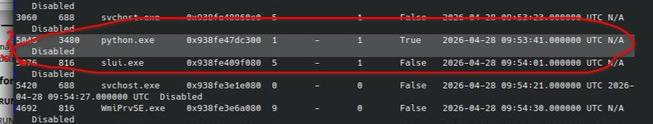

*Figure — Continuation of agent chain entries*

Notable processes:

| PID | Name | PPID | Note |
| --- | --- | --- | --- |
| 3480 | `powershell.exe` | 4108 (explorer) | Admin PowerShell used to launch the agent |
| 5048 | `python.exe` | 3480 | CAPE agent — `.\agent.py`, 32-bit (Wow64=True) |
| 3128 | `MsMpEng.exe` | 688 (services) | Windows Defender — active, 27 threads |
| 5420 | `svchost.exe` | 688 (services) | Exited at 09:54:27, 0 threads, blank cmdline |

No typosquatted process names. No orphaned processes. The exited `svchost.exe` is normal — it is a transient host process for a service that completed.

---

### Step 3 — Process Tree (`windows.pstree`)

```bash
vol -f /home/nikita/Downloads/win10_memdump.raw windows.pstree
```

Displays the same processes as a parent-child hierarchy. Useful for spotting suspicious spawn chains — for example, `winword.exe` launching `powershell.exe`, or `explorer.exe` spawning an unknown child.

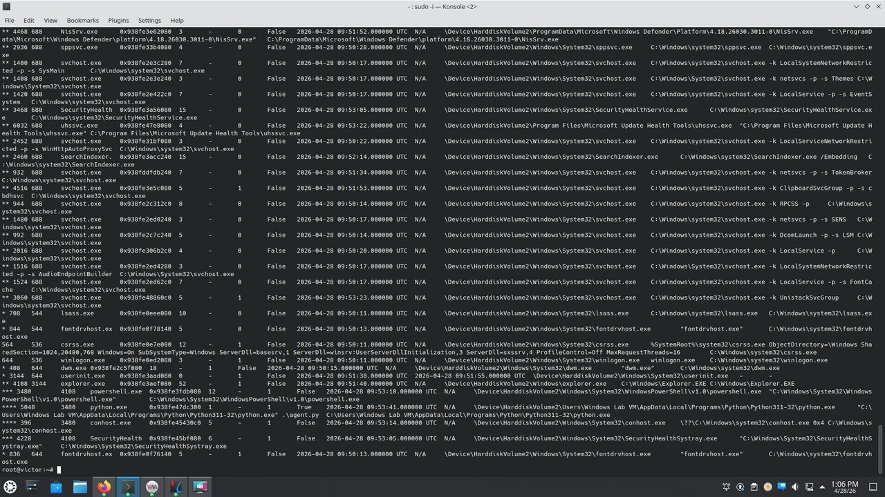

*Figure — Full process tree*

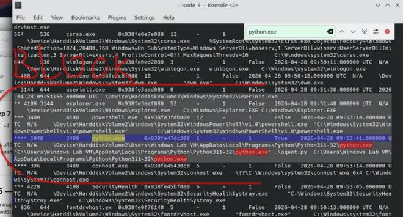

*Figure — The agent launch chain clearly visible in the tree*

Key chain:

```
explorer.exe (4108)
  └── powershell.exe (3480)     — admin PowerShell
        ├── python.exe (5048)   — CAPE agent (.\agent.py)
        └── conhost.exe (396)   — console host
```

All processes trace back to legitimate system ancestors. No anomalous parent-child relationships.

---

### Step 4 — Command Lines (`windows.cmdline`)

```bash
vol -f /home/nikita/Downloads/win10_memdump.raw windows.cmdline
```

Extracts the full command line string for each process from the Process Environment Block (PEB). Reveals dropped file paths, encoded PowerShell payloads, and malware arguments.

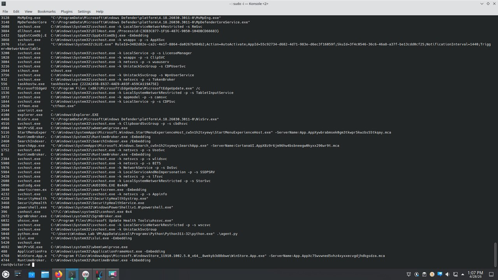

*Figure — Full cmdline output for all processes*

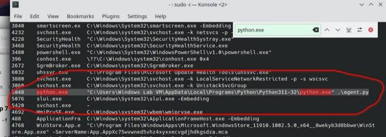

*Figure — PID 5048: `"...Python311-32\python.exe" .\agent.py` — agent launched interactively*

Notable entries:

| PID | Process | Command |
| --- | --- | --- |
| 5048 | python.exe | `"...Python311-32\python.exe" .\agent.py` |
| 3976 | slui.exe | `SLUI.exe RuleId=3482d82e... Action=AutoActivate Trigger=NetworkAvailable` |
| 5420 | svchost.exe | *(blank — exited process, PEB cleared)* |

No encoded PowerShell. No dropped paths outside expected locations. The agent was run interactively from a PowerShell working directory — not installed as a scheduled task.

---

### Step 5 — Network Connections (`windows.netscan`)

```bash
vol -f /home/nikita/Downloads/win10_memdump.raw windows.netscan
```

Scans memory for TCP/UDP endpoint structures — active, closed, and listening sockets with remote IPs, ports, and owning process. The primary plugin for finding C2 communication.

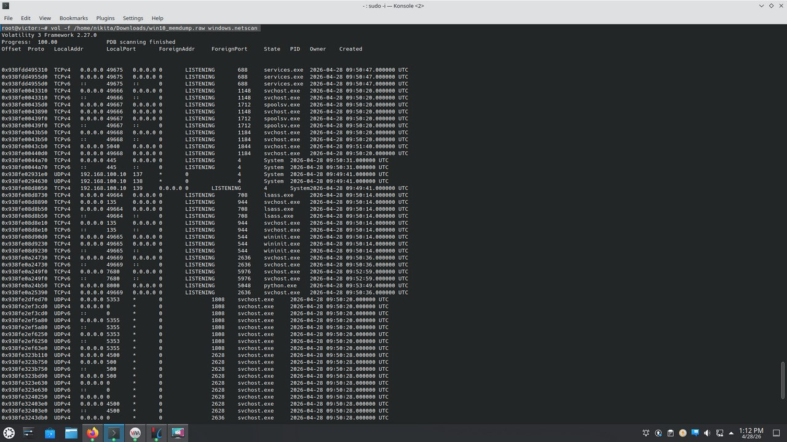

*Figure — Full netscan output*

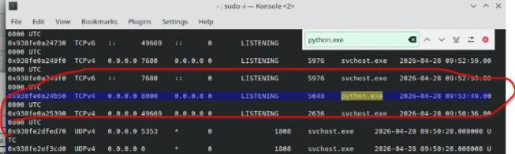

*Figure — python.exe (5048) LISTENING on 0.0.0.0:8000 — agent socket*

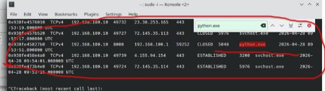

*Figure — CLOSED entry: 192.168.100.1:59252 → 192.168.100.10:8000 — CAPE host connected to agent during task execution*

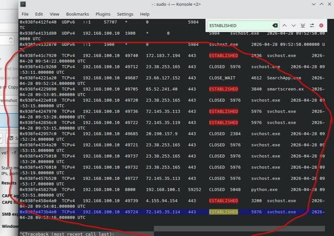

*Figure — ESTABLISHED connections from svchost.exe to Akamai CDN and Microsoft — Windows Update and telemetry traffic*

**Findings:**

| Connection | Owner | Verdict |
| --- | --- | --- |
| LISTENING `0.0.0.0:8000` | python.exe (5048) | CAPE agent socket |
| CLOSED `192.168.100.1:59252 → 192.168.100.10:8000` | python.exe | CAPE host connecting during analysis |
| LISTENING `0.0.0.0:445`, `0.0.0.0:139` | System (PID 4) | Windows SMB — standard |
| ESTABLISHED to `23.38.x.x`, `72.145.x.x` | svchost.exe | Windows Update via Akamai CDN |
| ESTABLISHED to `65.52.241.40:443` | smartscreen.exe | Microsoft SmartScreen cloud check |
| CLOSED to `48.192.1.65:443` | slui.exe | Windows activation attempt |

**No malware C2 connections.** Every outbound connection belongs to a legitimate Windows process communicating with Microsoft or Akamai infrastructure. Themida exited before any payload network code ran.

---

### Step 6 — Injected Code Detection (`windows.malfind`)

```bash
vol -f /home/nikita/Downloads/win10_memdump.raw windows.malfind
```

Finds memory regions that are executable, private (not backed by a file on disk), and contain shellcode-like byte patterns. This is the main plugin for detecting process injection and reflective DLL loading.

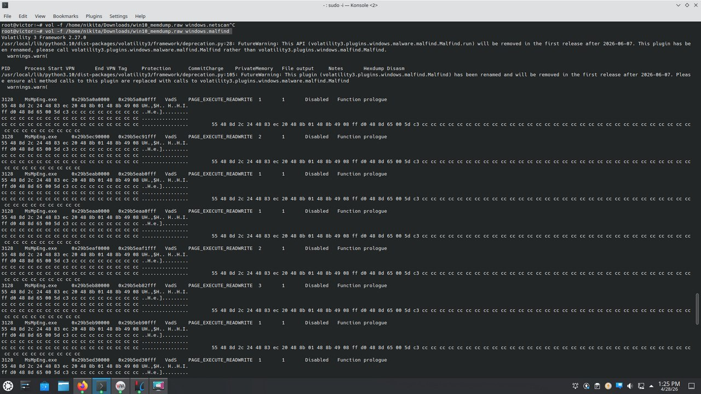

*Figure — malfind results — all hits are in legitimate system processes*

**Results:**

| Process | PID | Hits | Verdict |
| --- | --- | --- | --- |
| `MsMpEng.exe` | 3128 | 12 | False positive — Windows Defender JIT engine |
| `SearchApp.exe` | 4612 | 2 | False positive — .NET CLR JIT dispatch stubs |
| `smartscreen.exe` | 3840 | 1 | False positive — .NET CLR JIT stub |
| `powershell.exe` | 3480 | 5 | False positive — PowerShell is a .NET app, CLR allocates RWX regions |
| Malware sample | — | 0 | No injection artifacts |

All 20 hits are explained. The `MsMpEng.exe` pattern is identical across all 12 hits:

```
55 48 8d 2c 24 48 83 ec 20 48 8b 01 48 8b 49 08
ff d0 48 8d 65 00 5d c3 cc cc cc cc cc cc cc cc
```

This is a standard x64 function prologue followed by `INT3` padding (`cc`) — a compiled Defender scan stub, not shellcode. The `cc` padding is what triggers malfind’s heuristic.

**Key finding:** No MZ headers in private memory of any process. No shellcode. Themida exited cleanly without injecting anything into a host process.

---

### Step 7 — Loaded DLLs (`windows.dlllist`)

```bash
vol -f /home/nikita/Downloads/win10_memdump.raw windows.dlllist --pid 5048
```

Lists all DLLs loaded into the CAPE agent process from the PEB loader list. Used to verify no unexpected modules were injected into the agent.

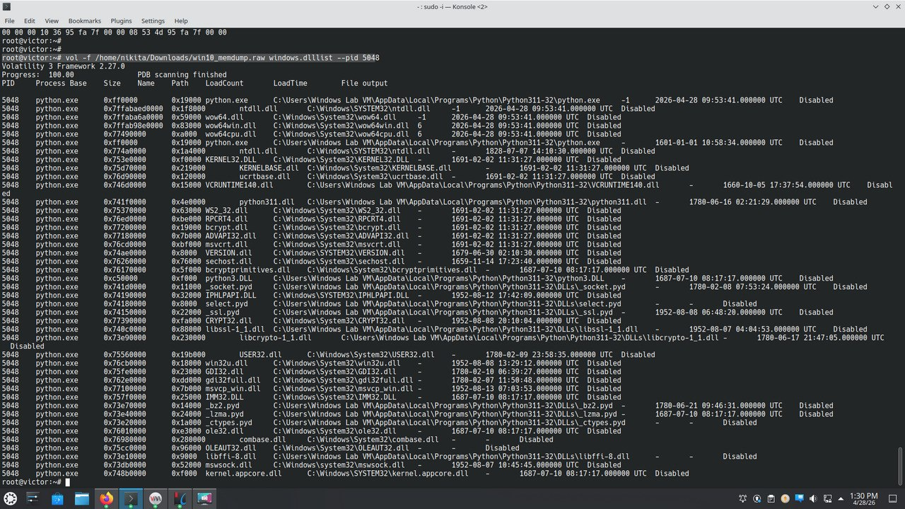

*Figure — All DLLs loaded into python.exe (5048)*

**Key modules loaded:**

| DLL | Purpose |
| --- | --- |
| `python311.dll` | Python 3.11 runtime |
| `_socket.pyd` | Network socket module |
| `_ssl.pyd` + `libssl-1_1.dll` | TLS/SSL — agent encrypts result traffic |
| `_ctypes.pyd` + `libffi-8.dll` | Direct Windows API calls via ctypes |
| `IPHLPAPI.DLL` | Network interface queries |
| `wow64.dll / wow64win.dll` | WoW64 bridge — 32-bit process on 64-bit OS |

Two anomalies that are actually expected:
- `ntdll.dll` appears twice at different base addresses — normal for WoW64 processes (both 32-bit and 64-bit ntdll are mapped)
- Many DLLs show LoadTime of `1601-01-01` — uninitialized PEB timestamp field, common in WoW64

No unexpected DLLs. No modules loaded from temp paths or unusual locations.

---

### Volatility Summary

| Plugin | Key Finding |
| --- | --- |
| `windows.info` | Windows 10 Build 19041, x64, dump valid |
| `windows.pslist` | 100+ processes, all legitimate; agent visible at PID 5048 |
| `windows.pstree` | explorer → powershell → python.exe chain confirmed, no anomalies |
| `windows.cmdline` | Agent launched as `.\agent.py` interactively; no encoded PowerShell |
| `windows.netscan` | Agent socket on :8000; CAPE handshake visible; all external traffic is Windows telemetry |
| `windows.malfind` | 20 hits, all JIT false positives from Defender and .NET CLR |
| `windows.dlllist` | All agent DLLs expected; no injected modules |

**Overall:** The memory dump confirms that no malware activity reached the injection or execution stage in any of the four analysis runs. Themida’s protection exited the process cleanly before any payload ran.

---

## Static Analysis Conclusion — True Sample Identity

Static analysis identified the payload as **MagnetosphereSimulator v1.0.5.1 by Orbital Plasma Labs** — a cracked commercial scientific application for Earth magnetosphere and Van Allen belt simulation. It is not conventional malware.

Themida was used as **DRM (Digital Rights Management)** to protect the software license, not to conceal malicious behavior. This explains every anomaly from dynamic analysis:

| Observation | Explanation |
| --- | --- |
| 13 anti-sandbox techniques | Themida DRM checking for VM to prevent license bypass |
| No C2, no destructive behavior | There is no malicious payload — Themida was protecting legitimate software |
| Timestomping | Cracked software obfuscating its origin |
| `hdr.csum = 0x00000000` | Patching tool zeroed the checksum during the crack process |
| `signed = false` | Code signature invalidated by patching |
| Refused to run in QEMU across 4 attempts | Themida DRM is specifically designed to detect VMs |

---

## Dynamic vs Static — Which Worked Better?

|  | Dynamic (CAPEv2) | Static (CLI tools) | Sandboxing |
| --- | --- | --- | --- |
| **Found** | Outer dropper structure, nested PE extraction, 13 evasion signatures | True application identity, Themida confirmation, timestomping, patched checksum, version, author | Execution containment, filesystem/process isolation, outbound connection attempts, anti-VM checks, delayed execution behavior |
| **Missed** | Everything about the inner payload | Runtime behavior, decryption keys, actual execution flow | Payload logic hidden behind user interaction, kernel-level activity, |
| **Strength** | Real behavior — network IoCs, process chains, registry changes | No evasion possible — file exists on disk, metadata is always readable | malware can execute without risking host compromise or contaminating production systems |
| **Weakness** | Themida/DRM defeats all automated analysis | Encrypted sections cannot be disassembled without unpacking | Since malware nowadays detects virtualized/sandboxed environments and suppresses execution or exits early |

That said, static analysis, dynamic analysis, and sandboxing solve different problems. Sandboxing provides controlled detonation and safety isolation, allowing suspicious binaries to execute without risking the analyst workstation. Dynamic analysis extracts runtime artifacts — network IoCs, dropped files, registry changes, and process chains — that static analysis cannot observe directly. Static analysis, however, remains effective even when malware refuses to run, especially for packed or DRM-protected binaries where unencrypted metadata still reveals attribution, tooling, timestamps, and build information.

---

## Online tools analysed for task 3

**Comparison**

| Feature | CAPEv2 (local) | ANY.RUN | Hybrid Analysis |
| --- | --- | --- | --- |
| Behavioral data on Sample 2 | Zero — Themida evasion | Possibly partial — human interaction bypasses some checks | Likely zero — fully automated |
| Evasion defeat | Manual VM hardening | Built-in interaction simulation | Not available |
| Nested PE extraction | Yes — auto-extracted Sample 2 | No | No |
| Network capture | Full PCAP on host | Full PCAP + TLS decode | Full PCAP |
| Memory analysis | Manual via Volatility | Not exposed | Not exposed |
| Sample privacy | Fully local | Sample uploaded to cloud | Sample uploaded to cloud |
| VM customization | Full control — SMBIOS, CPUID, MAC | Vendor-controlled | Minimal |
| Cost | Free (self-hosted) | Paid for advanced features | Paid for private submissions |
- **ANY.RUN** is the best option when evasion is the
problem. Real mouse input can bypass checks that defeat all automated
tools. For Sample 2, an analyst running it interactively on ANY.RUN
might have gotten behavioral data.
- **Hybrid Analysis** is strong for known malware families — the threat intel database can return a verdict from static patterns alone.
- **CAPEv2** is the only platform that gave us the nested PE extraction, full memory access via Volatility, and complete control
over the VM environment. For deep research and sensitive samples, local
is the right choice.

---

# Appendix — Commands Reference

```bash
# CAPE services
sudo systemctl restart cape.service cape-processor.service
sudo systemctl status cape.service --no-pager

# VM management
virsh list --all
virsh domstate win10
virsh snapshot-list win10
virsh snapshot-info win10 snapshot1
virsh snapshot-create-as --domain win10 --name snapshot1 --atomic

# Verify agent
nc -z -w2 192.168.100.10 8000 && echo "AGENT OK"

# Submit sample
cd /opt/CAPEv2
sudo -u cape .cache/pypoetry/virtualenvs/capev2-t2x27zRb-py3.10/bin/python \
  utils/submit.py /path/to/sample.exe --timeout 240 --enforce-timeout

# Memory dump
virsh dump win10 /home/nikita/Downloads/win10_memdump.raw --memory-only

# Volatility
vol -f /home/nikita/Downloads/win10_memdump.raw windows.info
vol -f /home/nikita/Downloads/win10_memdump.raw windows.pslist
vol -f /home/nikita/Downloads/win10_memdump.raw windows.pstree
vol -f /home/nikita/Downloads/win10_memdump.raw windows.cmdline
vol -f /home/nikita/Downloads/win10_memdump.raw windows.netscan
vol -f /home/nikita/Downloads/win10_memdump.raw windows.malfind
vol -f /home/nikita/Downloads/win10_memdump.raw windows.dlllist --pid 5048

# Static analysis
file /home/nikita/Downloads/sample2.exe
python3 /home/nikita/Downloads/pe_analysis.py
strings -n 6 /home/nikita/Downloads/sample2.exe | grep -E "^[A-Za-z0-9 _.\-\/\:]{6,}$" | sort -u
binwalk -E /home/nikita/Downloads/sample2.exe
rabin2 -I /home/nikita/Downloads/sample2.exe
rabin2 -i /home/nikita/Downloads/sample2.exe
rabin2 -S /home/nikita/Downloads/sample2.exe
r2 -q -c 'pd 30' /home/nikita/Downloads/sample2.exe 2>/dev/null
```
