# Final Project: IoT Deception Honeypot Network

Name of report: Final_Project_IoT_Honeypot
Course: Offensive Technologies
Performed by Salekh Mamadaliev, Nikita Niakhai — M25-SNE-01
Video Demo: [https://drive.google.com/file/d/1sPnsSkpskU6UDWZr5spxOi_ylVtGwUsM/view?usp=sharing](https://drive.google.com/file/d/1sPnsSkpskU6UDWZr5spxOi_ylVtGwUsM/view?usp=sharing)

---

# Abstract

This project presents a realistic IoT honeypot network designed to simulate smart devices such as IP cameras and MQTT sensors in order to attract real-world attackers and capture malicious activity. The system is deployed on a hardened VPS (Yandex Cloud, Ubuntu 24.04) using Docker and Docker Compose, running Cowrie (SSH/Telnet honeypot), a fake camera stub (nginx), and a Mosquitto MQTT broker as decoy services. All collected logs are forwarded to a Wazuh SIEM stack (manager, indexer, dashboard) for correlation, behavior classification (botnets, brute-force, MQTT flood), and real-time dashboard visualization. Fake device fingerprints and intentional weak credentials increase honeypot realism and attacker engagement. The project demonstrates end-to-end deception: from server hardening, through containerized decoy services, to custom Wazuh rules and validated attack simulations using Hydra, nmap, and mosquitto-clients.

**Keywords:** IoT, Honeypot, Cowrie, Wazuh, ELK, Docker, MQTT, Brute-force, Botnet, Attack Analytics, Deception

---

# Table of Contents

1. Division of Labour
2. Introduction
3. Project Overview
    - 2.1 Problem Statement
    - 2.2 Technology Stack
4. Architecture Model
    - 3.1 Infrastructure Setup
    - 3.2 SSH Hardening
5. Server Security
    - 4.1 UFW Firewall Rules
    - 4.2 Wazuh Admin Password
6. Honeypot Layer
    - 5.1 Cowrie — SSH/Telnet Honeypot
    - 5.2 Fake Camera — nginx Stub
    - 5.3 MQTT Broker — Mosquitto
7. Analytics — Wazuh SIEM
    - 6.1 Wazuh Server Deployment
    - 6.2 Wazuh Agent
    - 6.3 Custom Rules for Cowrie
    - 6.4 Dashboards and Alerts
8. Attack Simulation
    - 7.1 SSH Brute-Force (Hydra → Cowrie)
    - 7.2 Port Scanning (nmap)
    - 7.3 MQTT Flood — Custom Script
    - 7.4 Statistics
9. Future Development
10. Summary
11. References

---

# Division of Labour

| **Nikita Niakhai** | **Salekh Mamadaliev** |
| --- | --- |
| Setting up VPS in Yandex Cloud, initial access via ssh | User configuration on VPS, SSH hardening, UFW configuration |
| Wazuh Initial installation | Honeypot containers configuration |
| Wazuh hardening (credentials for all users inside a cluster) | Wazuh configuration for honeypot logs gathering |
| Attack simulation, script writting, validating attacks (brute force, reconisaince, mqtt flodd) | Wazuh custom rules creation for events generation and custom dashboard configuration |
| Diagram drawings, writting Report 1/2, Presentation review | Presentation creation, writing Report 1/2, Video editing |

---

# 1. Introduction

The rapid growth of consumer and industrial IoT devices has produced a vast attack surface populated by under-secured embedded systems. Botnets such as Mirai and its descendants continue to weaponise default credentials and exposed management interfaces, especially on SSH/Telnet, HTTP camera panels, and MQTT brokers. This project deploys a **deceptive IoT environment** on a publicly reachable VPS to attract, observe, and classify such activity, while feeding all events into a Wazuh-based SIEM for correlation and visualization.

---

# 2. Project Overview

## 2.1 Problem Statement

The primary goal is to study attacker behavior targeting IoT devices by deploying believable decoy services on a publicly accessible VPS. Traditional security monitoring focuses on defending real assets; this project takes the opposite approach — deliberately exposing fake vulnerabilities to observe what attackers do when they believe they have found a real device. The project also serves as a practical demonstration of SIEM integration, log normalization, and real-time alerting for a non-traditional attack surface.

## 2.2 Technology Stack

| **Category** | **Technology** | **Purpose** |
| --- | --- | --- |
| SSH/Telnet Honeypot | Cowrie | Emulates SSH/Telnet services, captures credentials and commands |
| Fake Camera | nginx (stub) | Simulates an IP camera HTTP interface to attract scanners |
| MQTT Broker | Mosquitto | Decoy IoT message broker exposed to the internet |
| Log Shipping | Filebeat | Collects logs from containers and forwards to Wazuh |
| SIEM / Analytics | Wazuh + ELK Stack | Log correlation, alerting, dashboards, behavior classification |
| Containerization | Docker + Docker Compose | Orchestrates all honeypot and SIEM services |
| Infrastructure | VPS (Ubuntu 24.04) | Publicly accessible host for attracting real attack traffic |

---

# 3. Architecture Model

The project runs on a **VPS** accessed via SSH with key-based authentication. All honeypot services and the Wazuh stack are deployed inside Docker containers, orchestrated with Docker Compose on the same host.

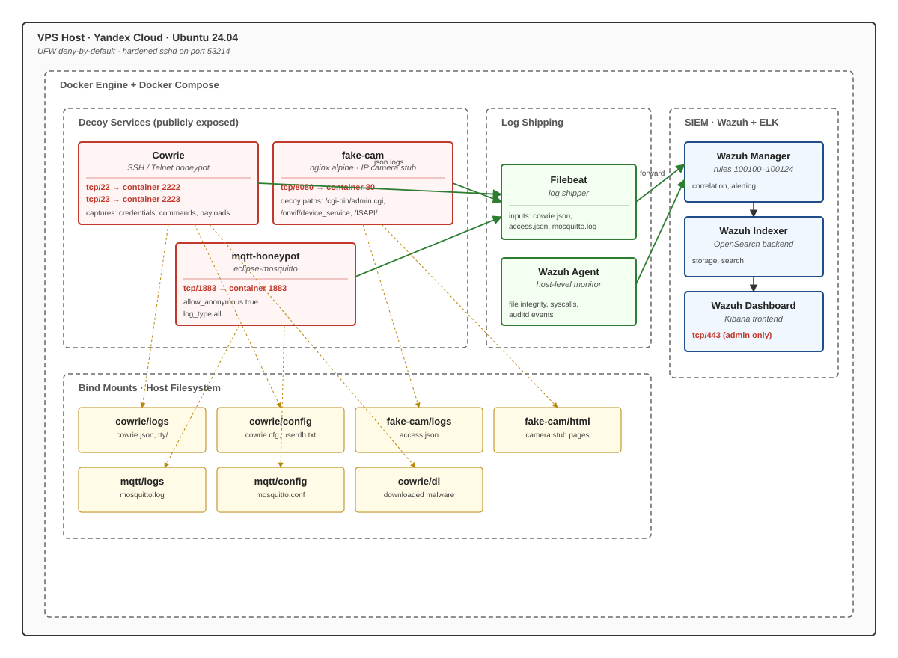

*Figure. Components topology*

The diagram shows three logical zones inside the Docker engine on a single hardened VPS: red-bordered decoy services (Cowrie, fake-cam, mqtt-honeypot), a green log-shipping layer (Filebeat plus host-level Wazuh Agent), and a blue Wazuh+ELK SIEM stack consuming those logs. Yellow dashed lines mark bind mounts to the host filesystem where configs, captured logs, and downloaded malware persist.

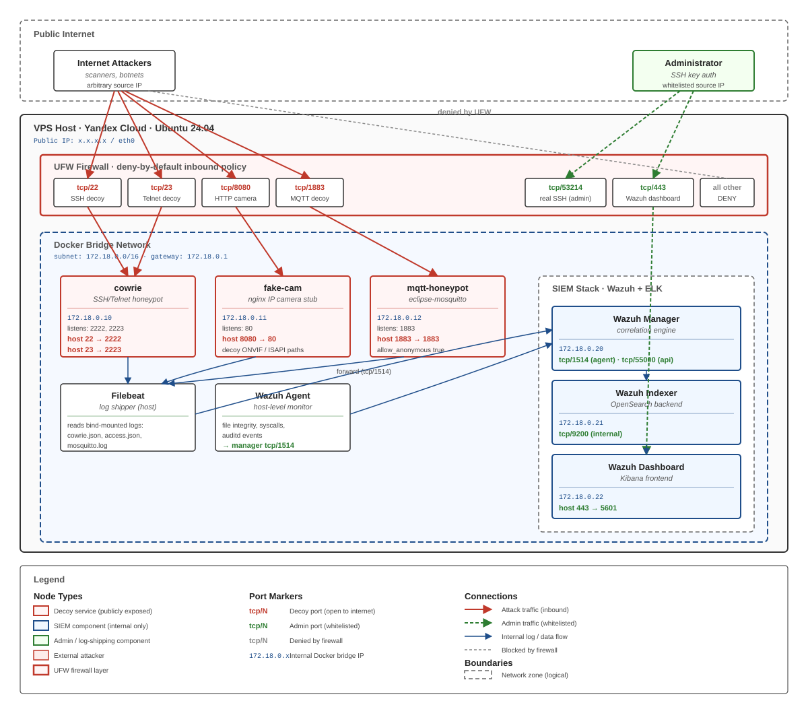

*Figure. Network topology*

The topology shows three trust zones stacked top-to-bottom: the public internet (attackers and the whitelisted administrator), the VPS host with UFW enforcing a deny-by-default policy that exposes only four decoy ports plus two admin ports, and the internal Docker bridge network (172.18.0.0/16) where decoy containers, log shippers, and the Wazuh+ELK stack communicate. Red arrows trace attack traffic into the decoys, green arrows mark the segregated admin path to port 53214 and the dashboard, and blue arrows show the internal log pipeline feeding the SIEM.

## 3.1 Infrastructure Setup

- **VPS provider:** Yandex Cloud
- **OS:** Ubuntu 24.04
- **SSH hardened:** custom port `53214`, `PermitRootLogin` disabled, `PasswordAuthentication` disabled, `AllowUsers` restricted
- **Docker + Docker Compose** installed
- **UFW** configured to expose only honeypot ports and Wazuh dashboard

## 3.2 SSH Hardening

The goal is to keep the real admin entry point invisible to scanners while leaving the decoy SSH (port 22) wide open.

- **Custom SSH configuration applied:**
    - Changed default port `22` → **`53214`**
    - `PermitRootLogin no`
    - `PasswordAuthentication no`
    - `AllowUsers` restricted to project user only

Moves the real management plane off the default scanned port, disables the most-attacked authentication paths (root login, passwords), and restricts who can even attempt a session. The decoy SSH port `22` remains available, but it points at Cowrie — not the real shell.

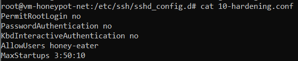

*Figure. sshd_config showing hardened SSH parameters on the VPS.*

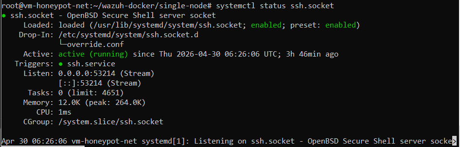

*Figure. Verification of the SSH hardening (service status / login behavior).*

---

# 4. Server Security

The server is hardened to ensure that only honeypot-related traffic reaches the decoy services, while the management plane (SSH) remains accessible only via key-based authentication.

## 4.1 UFW Firewall Rules

UFW is the boundary between the public internet and the running services.

- **Inbound policy:** UFW is configured to allow inbound traffic on honeypot ports (real SSH port `53214`, SSH honeypot on `22`, Telnet on `23`, HTTP camera stub on `8080`, MQTT on `1883`) and the Wazuh dashboard port, while blocking all other inbound traffic.

*Explanation:* The deny-by-default policy guarantees that only the deliberately exposed decoys and the management/SIEM ports are reachable. Each open port maps to a specific decoy service inside Docker, which keeps the attack surface predictable and easy to correlate in Wazuh.

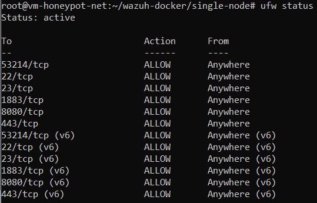

*Figure. Output of `ufw status` showing the active firewall rules on the VPS.*

## 4.2 Wazuh Admin Password

The Wazuh default password for `admin` and `kibanaserver` must be replaced with a value that Filebeat can use without escaping issues.

- **Replace the default Wazuh admin password** with a simple alphanumeric value (no special characters) so Filebeat can authenticate without parsing problems.

> For some reason default `kibanaserver` hash for default password was corrupted, so we regerenated and out logging with Filebeat started working.

- We followed this guide to change the credentials:

[Changing the default password of Wazuh users - Deployment on Docker](https://documentation.wazuh.com/current/deployment-options/docker/changing-default-password.html#wazuh-indexer-user)

---

# 5. Honeypot Layer

Each service is a separate Docker container, so its blast radius is limited and its logs are isolated. All honeypot services run as isolated Docker containers. Each service simulates a different IoT device or protocol to maximize the attack surface presented to scanners and botnets.

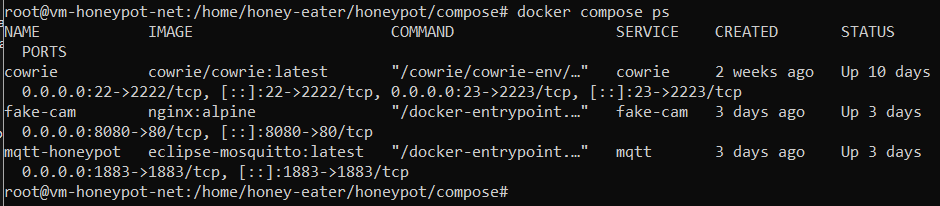

*Figure. `docker compose ps` showing the running honeypot containers.*

All three decoy containers — `cowrie`, `fake-cam`, and `mqtt-honeypot` — are in the running state with their host ports correctly mapped (`22:2222`, `23:2223`, `8080:80`, `1883:1883`). This matches the compose definition below and confirms the honeypot layer is live and reachable.

```yaml
services:
  cowrie:
    image: cowrie/cowrie:latest
    container_name: cowrie
    restart: unless-stopped
    ports:
      - "22:2222/tcp"
      - "23:2223/tcp"
    volumes:
      - ../cowrie/config/cowrie.cfg:/cowrie/cowrie-git/etc/cowrie.cfg:ro
      - ../cowrie/config/userdb.txt:/cowrie/cowrie-git/etc/userdb.txt:ro
      - ../cowrie/logs:/cowrie/cowrie-git/var/log/cowrie
      - ../cowrie/dl:/cowrie/cowrie-git/var/lib/cowrie/dl
    environment:
      - COWRIE_TELNET_ENABLED=yes

  fake-cam:
    image: nginx:alpine
    container_name: fake-cam
    restart: unless-stopped
    ports:
      - "8080:80"
    volumes:
      - ../fake-cam/html:/usr/share/nginx/html:ro
      - ../fake-cam/logs:/var/log/nginx
      - ../fake-cam/nginx.conf:/etc/nginx/conf.d/default.conf:ro

  mqtt:
    image: eclipse-mosquitto:latest
    container_name: mqtt-honeypot
    restart: unless-stopped
    ports:
      - "1883:1883"
    volumes:
      - ../mqtt/config:/mosquitto/config:ro
      - ../mqtt/logs:/mosquitto/log
```

## 5.1 Cowrie — SSH/Telnet Honeypot

Cowrie pretends to be a fully working shell, which lets it capture the entire post-login behaviour of an attacker.

- **Deploy Cowrie on default ports**
    - Listens on default ports **`22`** (SSH) and **`23`** (Telnet)
    - Fake device fingerprint configured to mimic a common router/camera
    - Logs stored in JSON format, collected by Filebeat

```yaml
[honeypot]
hostname = iotcam-01
#log_path = /cowrie/log
#download_path = /cowrie/dl

[output_jsonlog]
enabled = true

[output_textlog]
enabled = true
```

`cowrie.cfg`

- **Seed the credential database with weak IoT defaults**

```yaml
root:0:root
root:0:admin
root:0:123456
root:0:password
admin:0:admin
admin:0:1234
guest:0:guest
ubnt:0:ubnt
pi:0:raspberry
```

`userdb.txt`

Cowrie's `userdb.txt` defines which credentials are accepted. Including the canonical IoT/router default pairs (`root/root`, `admin/admin`, `ubnt/ubnt`, `pi/raspberry`, etc.) ensures that Mirai-style botnets, which iterate exactly these combinations, will succeed and continue into a fake shell — exposing their post-login payloads.

## 5.2 Fake Camera — nginx Stub

HTTP decoy mimics an IP camera login page and answers the most-scanned vulnerable paths to keep scanners interested.

- **Deploy the nginx stub on port `8080`**
    - Returns a fake camera login page
    - HTTP access logs forwarded to Wazuh via Filebeat
    - Specific decoy endpoints (`/cgi-bin/admin.cgi`, `/onvif/device_service`, `/ISAPI/Security/userCheck`) respond instead of 404'ing

```yaml
log_format json_combined escape=json
  '{"time":"$time_iso8601",'
  '"src_ip":"$remote_addr",'
  '"method":"$request_method",'
  '"uri":"$request_uri",'
  '"status":$status,'
  '"user_agent":"$http_user_agent"}';

access_log /var/log/nginx/access.json json_combined;

server {
    listen 80;

    root /usr/share/nginx/html;
    index index.html;

    location / {
        try_files $uri $uri/ /index.html;
    }

    location /cgi-bin/admin.cgi { return 200 ""; }
    location /onvif/device_service { return 200 ""; }
    location /ISAPI/Security/userCheck { return 401 ""; }
}
```

`nginx.conf`

- **Serve a believable IP camera login page**

```html
<!DOCTYPE html>
<html>
<head><title>IPCamera Login</title></head>
<body style="background:#1a1a1a;display:flex;align-items:center;justify-content:center;height:100vh;mar>
  <div style="background:#2a2a2a;padding:40px;border-radius:4px;width:320px">
    <h2 style="color:#fff;text-align:center;margin:0 0 24px">IP Camera</h2>
    <p style="color:#888;text-align:center;font-size:12px">DS-2CD2143G2-I</p>
    <form method="POST" action="/login">
      <input name="username" placeholder="Username" value="admin"
        style="width:100%;padding:8px;margin:8px 0;box-sizing:border-box"><br>
      <input name="password" type="password" placeholder="Password"
        style="width:100%;padding:8px;margin:8px 0;box-sizing:border-box"><br>
      <button type="submit"
        style="width:100%;padding:10px;background:#0066cc;color:#fff;border:none;margin-top:8px;cursor:>
        Login
      </button>
    </form>
  </div>
</body>
</html>
```

`index.html`

## 5.3 MQTT Broker — Mosquitto

A Mosquitto MQTT broker is exposed on port **1883** without authentication, simulating an insecure IoT message bus. This attracts MQTT-targeting tools and botnets that scan for open brokers.

- **Run Mosquitto with intentional weak configuration**
    - Listens on port **`1883`**
    - Anonymous connections allowed
    - Connection and publish logs forwarded to Wazuh

```yaml
listener 1883
allow_anonymous true
log_dest file /mosquitto/log/mosquitto.log
log_type all
```

`mosquitto.conf`

`allow_anonymous true` is the misconfiguration that real-world IoT deployments leak the most often, so this is the decoy condition we want. `log_type all` ensures every connect/subscribe/publish/disconnect event lands in the file Filebeat is tailing.

---

# 6. Analytics — Wazuh SIEM

Without a SIEM, the decoys would just be noisy log files; Wazuh turns them into correlated alerts and dashboards.

Wazuh is deployed via Docker Compose and provides the full ELK-based SIEM stack: indexer, manager, and dashboard. All honeypot events flow into Wazuh for correlation, classification, and visualization.

## 6.1 Wazuh Server Deployment

All three Wazuh components share the same host as the honeypots.

- **Deploy Wazuh via the official Docker Compose configuration.** The Wazuh manager, indexer (OpenSearch), and dashboard run as separate containers on the same host.

Provides a self-contained SIEM stack on the same VPS without needing a second machine. The manager handles rules and decoders, the indexer stores events, and the dashboard is the analyst-facing UI.

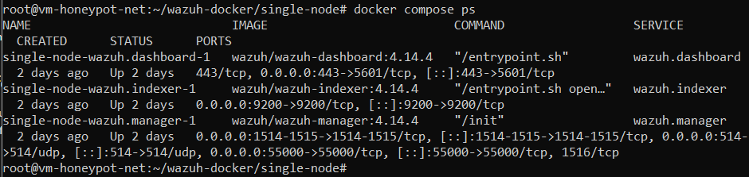

*Figure. Wazuh services statuses*

The dashboard is reachable and reports a healthy cluster — manager, indexer, and dashboard components are up. This confirms the Compose deployment succeeded and the SIEM is ready to ingest the honeypot logs described in Section 5.

## 6.2 Wazuh Agent

The agent watches the VPS itself, not the decoy containers.

- **Install the Wazuh agent directly on the VPS host** to monitor system-level events (file integrity, host-based intrusion detection) in addition to the honeypot log streams.

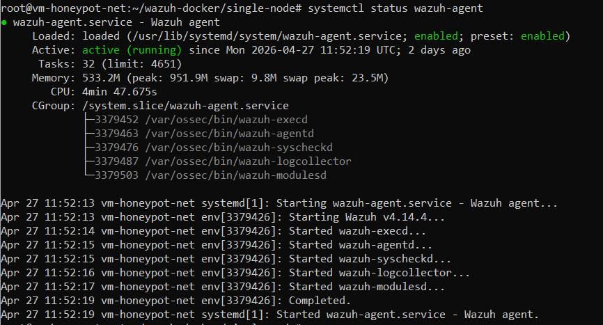

*Figure. Wazuh agent running*

## 6.3 Custom Rules for Cowrie

- **Add custom rules to the Wazuh manager** to parse honeypot logs and generate alerts (`100100`–`100124`).

```xml
<group name="honeypot,">

  <!-- Cowrie SSH/Telnet -->
  <rule id="100100" level="5">
    <decoded_as>json</decoded_as>
    <field name="eventid">cowrie.session.connect</field>
    <description>Cowrie: New connection</description>
  </rule>

  <rule id="100101" level="8">
    <decoded_as>json</decoded_as>
    <field name="eventid">cowrie.login.failed</field>
    <description>Cowrie: Failed login attempt</description>
  </rule>

  <rule id="100102" level="12" frequency="5" timeframe="60">
    <if_matched_sid>100101</if_matched_sid>
    <same_field>data.src_ip</same_field>
    <description>Cowrie: Brute-force attack detected</description>
    <group>honeypot,brute_force,</group>
  </rule>

  <rule id="100103" level="10">
    <decoded_as>json</decoded_as>
    <field name="eventid">cowrie.login.success</field>
    <description>Cowrie: Successful honeypot login</description>
  </rule>

  <rule id="100104" level="12">
    <decoded_as>json</decoded_as>
    <field name="eventid">cowrie.command.input</field>
    <description>Cowrie: Command executed in honeypot</description>
  </rule>

  <rule id="100105" level="12">
    <decoded_as>json</decoded_as>
    <field name="eventid">cowrie.session.file_download</field>
    <description>Cowrie: Malware download attempt</description>
    <group>honeypot,malware,</group>
  </rule>

  <rule id="100106" level="6">
    <decoded_as>json</decoded_as>
    <field name="eventid">cowrie.client.fingerprint</field>
    <description>Cowrie: SSH client fingerprint recorded</description>
    <group>honeypot,recon,</group>
  </rule>

  <!-- Fake camera nginx -->
  <rule id="100110" level="3">
    <decoded_as>json</decoded_as>
    <field name="uri">\.+</field>
    <description>Fake-cam: HTTP request</description>
  </rule>

  <rule id="100111" level="8">
    <if_sid>100110</if_sid>
    <field name="uri">cgi-bin|admin|ISAPI|onvif</field>
    <description>Fake-cam: IoT exploit path scan</description>
    <group>honeypot,recon,</group>
  </rule>

  <rule id="100112" level="10">
    <if_sid>100110</if_sid>
    <field name="uri">\.env|\.git|wp-admin|phpmyadmin|shell|cmd|exec</field>
    <description>Fake-cam: Generic web exploit attempt</description>
    <group>honeypot,web_attack,</group>
  </rule>

  <!-- MQTT -->
  <rule id="100120" level="5">
    <match>New connection from</match>
    <description>MQTT: New connection to honeypot broker</description>
    <group>honeypot,</group>
  </rule>

  <rule id="100121" level="6">
    <match>New client connected from</match>
    <description>MQTT: Client connected to honeypot broker</description>
    <group>honeypot,</group>
  </rule>

  <rule id="100122" level="10">
    <match>Received SUBSCRIBE</match>
    <description>MQTT: Wildcard subscription - possible topic enumeration</description>
    <group>honeypot,recon,</group>
  </rule>

  <rule id="100123" level="8">
    <match>Protocol error</match>
    <description>MQTT: Protocol error - possible scanner or exploit attempt</description>
    <group>honeypot,scan,</group>
  </rule>

  <rule id="100124" level="10" frequency="10" timeframe="30">
    <if_matched_sid>100120</if_matched_sid>
    <description>MQTT: Multiple rapid connections - possible flood attack</description>
    <group>honeypot,flood,</group>
  </rule>

</group>
```

Defines a layered detection model: low-severity baseline events (`100100`, `100110`, `100120`), medium-severity recon detections (`100106`, `100111`, `100122`), and high-severity correlated alerts (`100102` brute-force, `100124` MQTT flood) that fire only when a threshold is crossed inside a time window. The `same_field` and `if_matched_sid` directives are what turn isolated log lines into actual attack-pattern alerts.

## 6.4 Dashboards and Alerts

Simple yet informative dashboard was created in Wazuh web interface with charts and recent activity.

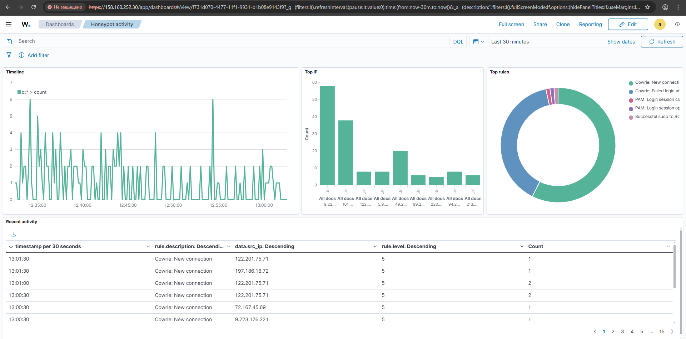

*Figure. Wazuh custom dashboard with charts and a recent-events table for the honeypot rule group.*

The dashboard shows live alert volume, rule-level distribution, and a recent-events table populated with honeypot rule IDs from the `100100`–`100124` range. This validates that the custom rules from Section 6.3 are being matched against real ingested logs and that the visualization layer is wired up correctly.

---

# 7. Attack Simulation

To validate the honeypot and SIEM pipeline, attack scenarios are executed from a separate machine (not the VPS) to generate realistic traffic that appears in the dashboards.

- **Install the attack tooling on the test client**

```bash
# Installing
sudo apt update && sudo apt upgrade -y
sudo apt install -y hydra nmap mosquitto-clients

# Installing comunity wordlists for hydra (optionally)
wget https://github.com/brannondorsey/naive-hashcat/releases/download/data/rockyou.txt
ls /usr/share/wordlists/
```

Installs the three tools used across this section: `hydra` for credential brute-force, `nmap` for port and service discovery, and `mosquitto-clients` for MQTT publish/subscribe. `rockyou.txt` is fetched as a realistic large password list for the brute-force runs.

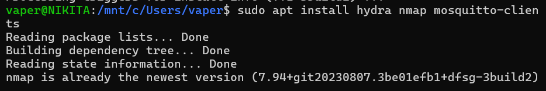

*Figure. Terminal output of the attacker-side tooling installation.*

The output confirms `hydra`, `nmap`, and `mosquitto-clients` were installed successfully on the test client and that `rockyou.txt` is available locally. The attack machine is now ready to execute the scenarios in 7.1–7.3.

## 7.1 SSH Brute-Force (Hydra → Cowrie)

The aim is to confirm that failed logins, successful logins, and the brute-force correlation rule (`100102`) all fire correctly.

- **Build custom user/password lists and launch Hydra against SSH and HTTP**

```bash
# Creating custom wordlist (passwords)
cat > ~/passwords.txt <<EOF
123456
password
admin
1234
root
123
qwerty
letmein
raspberry
admin
ubnt
guest
admin123
jbeD9e62Bs00
EOF

# Creating custom wordlist (users)
cat > ~/users.txt <<EOF
123456
password
admin
1234
root
123
qwerty
letmein
raspberry
ubnt
guest
admin123
kibanaserver
admin
EOF

# Brute-force SSH honeypot with common IoT credentials
hydra -L users.txt -P passwords.txt -s 22 -t 4 -V ssh://<VPS_IP>

# For form-based authentication
hydra -L users.txt -P passwords.txt -s 8080 -t 4 -V <VPS_IP> http-get /
```

Produces two small wordlists biased toward IoT defaults plus one known-good Cowrie credential (`jbeD9e62Bs00`) so we can verify successful-login alerts as well as failures. The first `hydra` command brute-forces SSH on port `22` (Cowrie); the second runs against the fake-cam HTTP on `8080`.

- manual passwords and users files + rockyou.txt downloaded

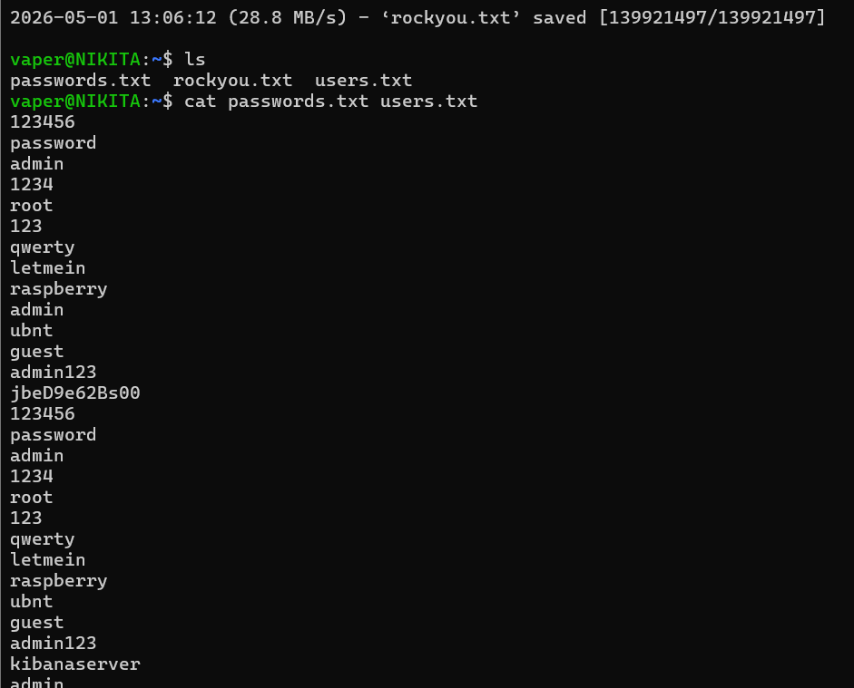

*Figure. Listing of the prepared wordlist files on the attacker host.*

Both `users.txt` and `passwords.txt` are present with the expected contents, and `rockyou.txt` is in place as a fallback. The wordlist preparation step is complete, so the next Hydra run will draw from a representative IoT-default credential set.

- hydra runtime:

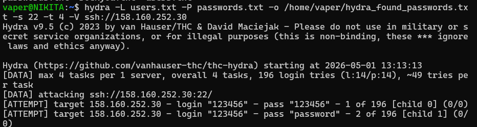

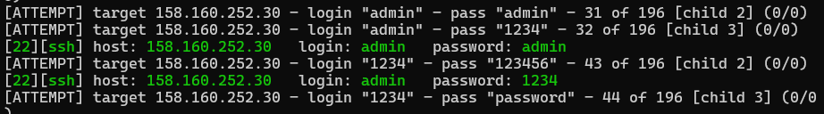

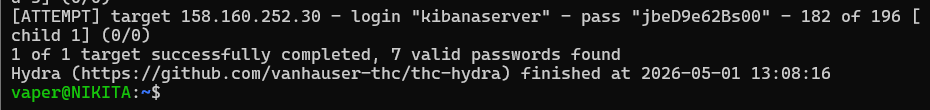

*Figure. Hydra in progress against the SSH honeypot — verbose login/password attempts streaming.*

- Found credentials combinations:

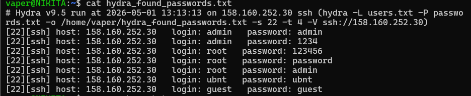

*Figure. Hydra final report showing the credential pairs that were accepted by the SSH honeypot.*

Hydra reports successful `login:password` combinations that match entries seeded into Cowrie's `userdb.txt`. This confirms two things at once: Cowrie's fake authentication accepts the planted IoT defaults, and rule `100103` (Cowrie: Successful honeypot login) will have fired in Wazuh.

**hydra command explained:**

- `-L`: stands for logins, pointing to a file (`-l` for a single login string on the CLI)
- `-s`: stands for port
- `-V`: verbose mode / show login+pass combination for each attempt
- `-o`: output file
- Wazuh dashboard activity during brute force attack

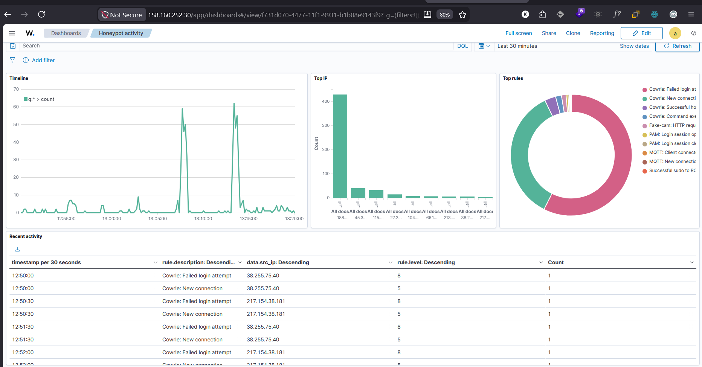

*Figure. Wazuh dashboard during the Hydra brute-force run — alert volume spike and rule distribution.*

- Log of successful sudo login

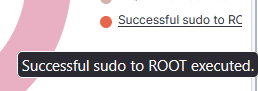

*Figure. Wazuh alert for a successful sudo / privileged login event captured by the host agent.*

This event comes from the Wazuh agent on the VPS host (Section 6.2), not from Cowrie. It demonstrates that host-level auditing works in parallel with the honeypot — if anyone ever genuinely escalates on the real host, it surfaces immediately, separate from the decoy traffic.

- Testing connection to the service of IOT camera device on port 22.

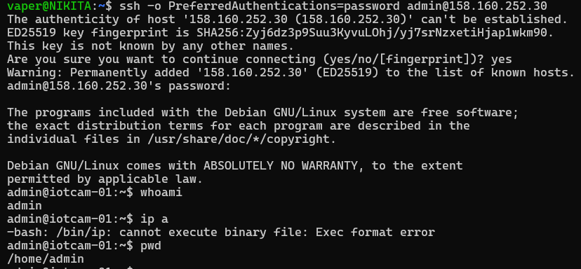

*Figure. Manual SSH connection attempt to port 22 showing the Cowrie banner.*

---

- Service on port 8080

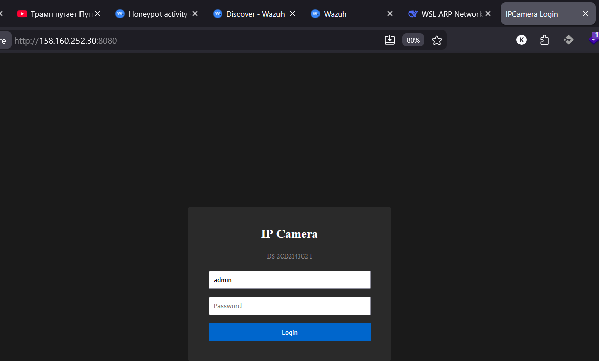

*Figure. Browser view of the fake-cam login page served on port 8080.*

The IP camera login UI from Section 5.2 renders as expected, including the model identifier `DS-2CD2143G2-I`. Any HTTP-aware scanner fingerprinting by page content will classify the host as a Hikvision-family camera, increasing the chance of a follow-up brute-force.

- Runtime: brute force on http server

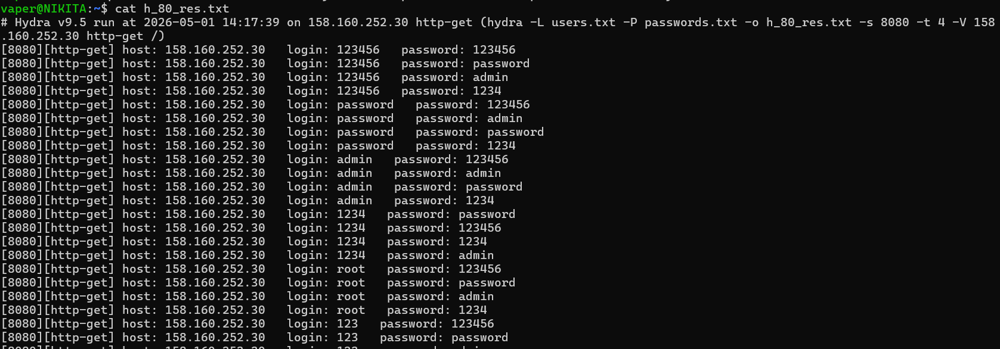

*Figure. Hydra in progress against the HTTP `/login` endpoint of the fake camera.*

- Results: brute force on http server

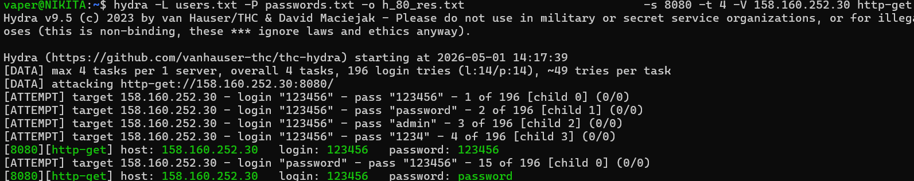

*Figure. Hydra final summary for the HTTP brute-force run.*

## 7.2 Port Scanning (nmap)

- **Run a targeted version scan and a deeper OS-detection scan**

```bash
# Scan exposed honeypot ports
nmap -sV -p 22,23,80,1883,8080,443,2222,2323,1883,8080 <VPS_IP>

# Full scan with OS detection
nmap -sS -sV -O -p 1-10000 -T4 <VPS_IP>
```

The first command does a focused service-version scan on the ports we expect to be open (the honeypots). The second is a much louder SYN + version + OS scan over the first 10 000 ports — the kind a Shodan-style scanner might run — which lets us verify that nothing leaks beyond the intended honeypot ports.

- nmap known ports, results:

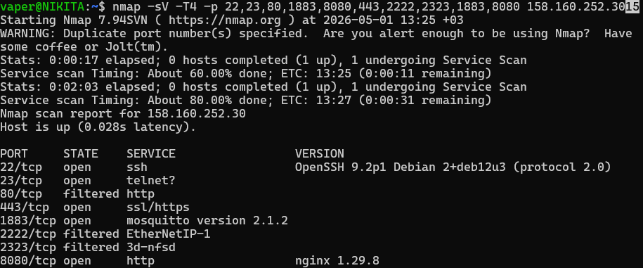

*Figure. nmap version-scan results for the targeted honeypot port set.*

Only the deliberately exposed honeypot ports are open (`22`, `23`, `1883`, `8080`); everything else is filtered. The reported services match what we expect: Cowrie on `22/23`, Mosquitto on `1883`, nginx on `8080`. The real management SSH on `53214` does not appear in this scan range, confirming the firewall/hardening from Section 4.

- nmap Fingerprint:

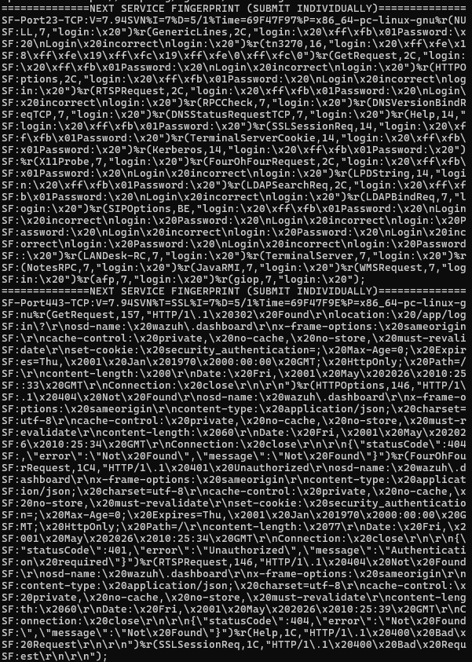

*Figure. nmap service/version fingerprints returned for the open ports.*

The fingerprints returned by `-sV` look plausible to an automated scanner — Cowrie returns an OpenSSH-like banner consistent with a typical IoT device, the HTTP service identifies as nginx, and Mosquitto announces itself on `1883`. The honeypot-as-IoT illusion holds up against version detection.

- OS detected:

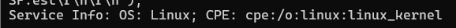

*Figure. nmap `-O` OS-detection result for the VPS.*

- nmap full scan results:

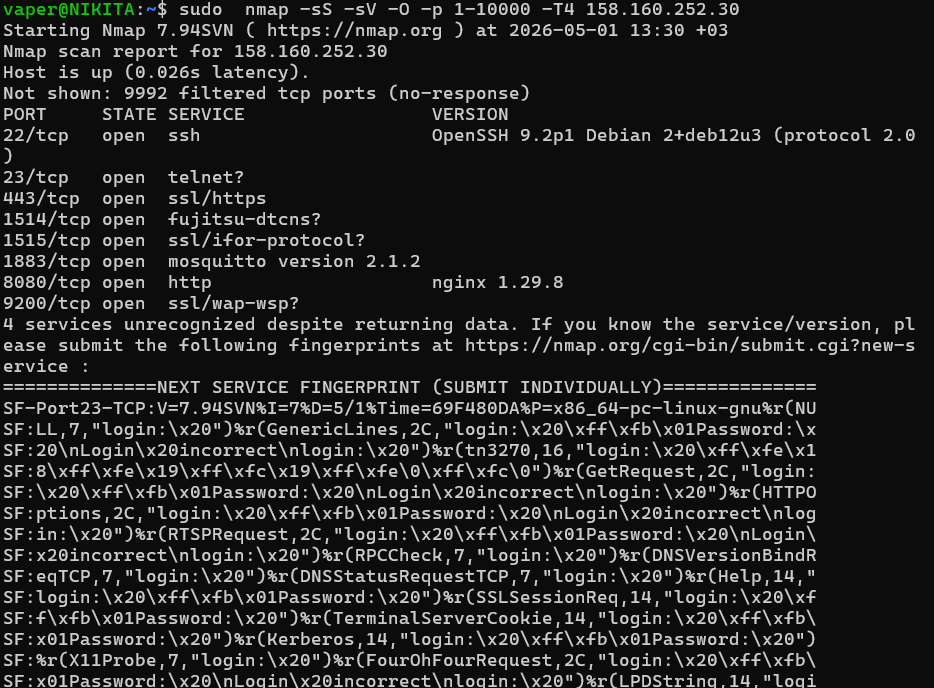

*Figure. nmap deep scan over ports 1–10000 with SYN, version, and OS detection.*

## 7.3 MQTT Flood — Custom Script

The aim is to trigger both the recon rule (wildcard subscribe) and the flood-correlation rule (`100124`).

- **Test the broker, then flood it, then enumerate topics**

```bash
# OPTION 1
# Testing connection
mosquitto_sub -h <VPS_IP> -p 1883 -t "#" -v &

# Flooding with messages
for i in $(seq 1 200); do
    mosquitto_pub -h 158.160.252.30 -p 1883 -t "sensor/temp" -m "{\"val\":$i}"
done

# Recon, susbscribing on all topics
mosquitto_sub -h 158.160.252.30 -p 1883 -t "#" -v -C 50
```

The first command opens a wildcard subscription (`#`) to confirm the broker is reachable and to trigger the topic-enumeration rule (`100122`). The shell loop then publishes 200 messages in rapid succession, which simulates a small MQTT flood and exercises the rate-based rule (`100124`). The third command does a bounded recon subscription that captures up to 50 messages.

- Connection tested:

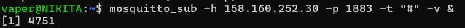

*Figure. Successful `mosquitto_sub` connection to the honeypot broker.*

The wildcard subscription connects without authentication, confirming `allow_anonymous true` from Section 5.3 is in effect. From the attacker's view, this is a recognisable misconfiguration signal that real-world MQTT botnets actively scan for.

- Flooding with messages:

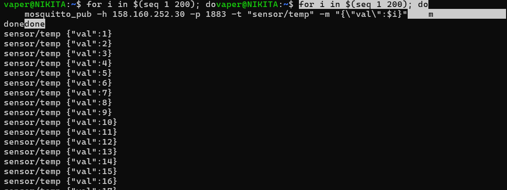

*Figure. Output of the `mosquitto_pub` flood loop publishing 200 messages.*

The publish loop completes without errors, meaning the broker accepted all 200 messages on `sensor/temp`. This is the input that produces a burst of `New connection from` log lines on the broker side and feeds rule `100124` (`>=10` connections within 30s).

- Flood messages observed:

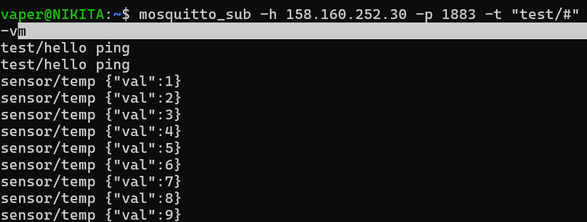

*Figure. Subscriber terminal receiving the flooded messages in real time.*

The wildcard subscriber receives the flood payloads (`{"val":1}` … `{"val":200}`), proving the broker is correctly relaying messages. For the SIEM, every publish is a logged event — so the per-message volume here corresponds directly to rule-match volume in Wazuh.

MQTT subscription testing (first starting subscription 1, then sending messages 2, observing messages via subscription)

- MQTT logs about possible flood attack and new connections established

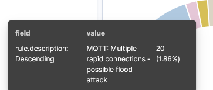

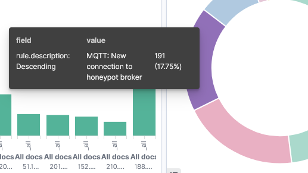

- MQTT subscription rules trigerred

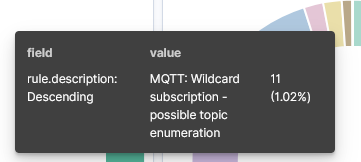

*Figure. Wazuh alerts pane showing MQTT honeypot rules firing — including the wildcard-subscription recon rule.*

## 7.4 Statistics

Since the honeypot machine is accessible on the Internet, different scanners, bots, and crawlers are actively trying to attack it. This gives us a good opportunity to gather some real information about scanners activity.
Created dashboard provides most crucial informaion about events: top IP addresses, rule description, and recent activity. In a real-life scenario, this potentially will help the SOC or monitoring team immediately react to possible threats.

We will observe small timeline from May 3rd 22:40 to May 5th 10:40 Moscow time.

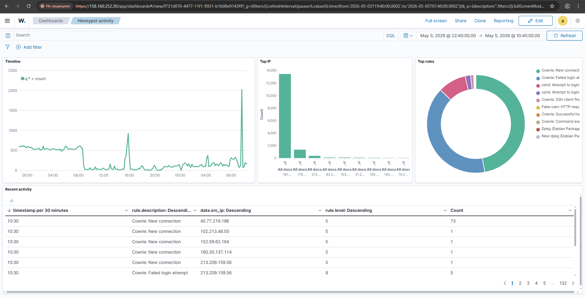

*Figure. Timeline statistics*

For choosen timeline we can see a total of **52,293 events.** Statistics for top rules by count:

| **Rule** | **Count** |
| --- | --- |
| Cowrie: New connection | 23,657 |
| Cowrie: Failed login attempt | 20,122 |
| sshd: Attempt to login using a non-existent user | 4,673 |
| sshd: Attempt to login using a denied user. | 897 |
| Cowrie: SSH client fingerprint recorded | 491 |

Also we can inpect top IP addresses by count:

| **IP** | **Count** |
| --- | --- |
| 197.242.182.66 | 13,456 |
| 176.65.139.95 | 1,380 |
| 213.171.199.40 | 391 |
| 43.241.37.250 | 120 |
| 103.179.216.97 | 120 |

From this, we can conclude that any machine that is accessible from the internet is constantly under attack from scanners, bots, and others. If interesting services or open access are detected on the machine, attackers will try to actively attack the system in order to gain access to its computing power or sensitive data.In a real system, when attack patterns are detected, it is preferable to take some protective measures, such as blocking the attacking addresses.

---

# 8. Future Development

- [ ]  Add **Dionaea** honeypot for FTP/SMB/Telnet protocol coverage
- [ ]  Implement **GeoIP enrichment** in Wazuh to map attacker origins
- [ ]  Add **automated threat intelligence lookup** (e.g. AbuseIPDB) for detected IPs
- [ ]  Extend MQTT decoy with **fake device topics and retained messages** for deeper engagement
- [ ]  Explore integration with **threat-sharing platforms** (MISP, OpenCTI)

---

# 9. Summary

The project successfully delivered a working IoT-themed deception network on a single hardened VPS. Three decoy services — Cowrie (SSH/Telnet), an nginx-based fake IP camera on port `8080`, and an open Mosquitto MQTT broker on `1883` — were deployed via Docker Compose and exposed to the public internet. A full Wazuh SIEM stack (manager, indexer, dashboard) was deployed on the same host, fed by Filebeat, and extended with a dedicated honeypot rule group (IDs `100100`–`100124`) covering connections, failed and successful logins, command execution, malware downloads, recon paths, web exploitation patterns, MQTT topic enumeration, and MQTT flood correlation. End-to-end validation was performed using Hydra, nmap, and `mosquitto-clients` from a separate machine, and every attack pattern produced the expected alerts and dashboard signals. SSH and firewall hardening (custom port `53214`, key-only auth, deny-by-default UFW) ensured that the only externally reachable surfaces were the intended decoys, while a Wazuh agent on the host provided independent host-level monitoring. The combination of believable device fingerprints (camera model name, IoT-default credentials, anonymous MQTT) and structured logging produces a platform that is realistic enough to attract opportunistic attackers and analytical enough to classify their behaviour into named patterns (brute-force, recon, flood) automatically.

---

# 10. References

- [Cowrie Documentation](https://cowrie.readthedocs.io/)
- [Wazuh Documentation](https://documentation.wazuh.com/)
- [Mosquitto MQTT Broker](https://mosquitto.org/documentation/)
- [Filebeat Documentation](https://www.elastic.co/guide/en/beats/filebeat/current/index.html)
- [Docker Compose Documentation](https://docs.docker.com/compose/)
- [Hydra — THC](https://github.com/vanhauser-thc/thc-hydra)
- [nmap Documentation](https://nmap.org/book/man.html)
